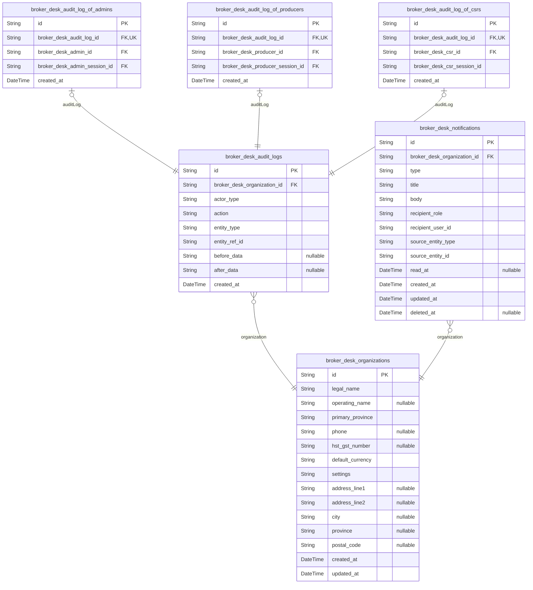
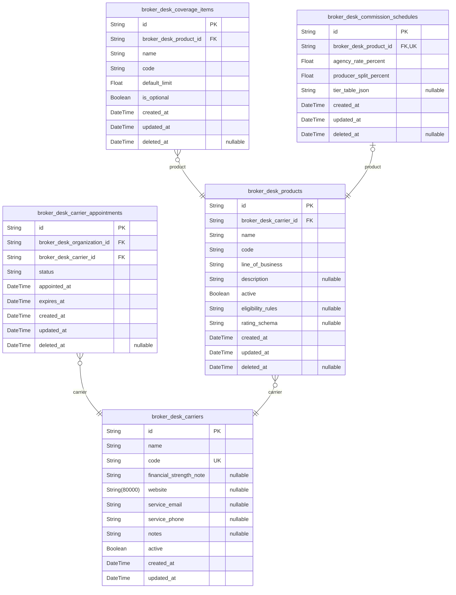
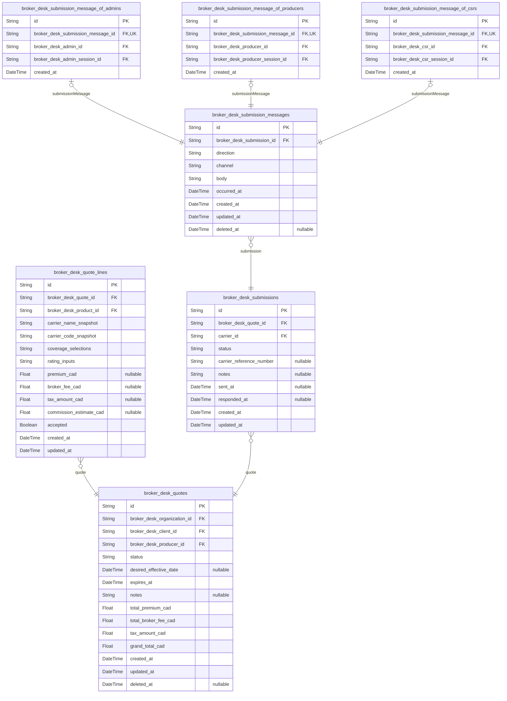
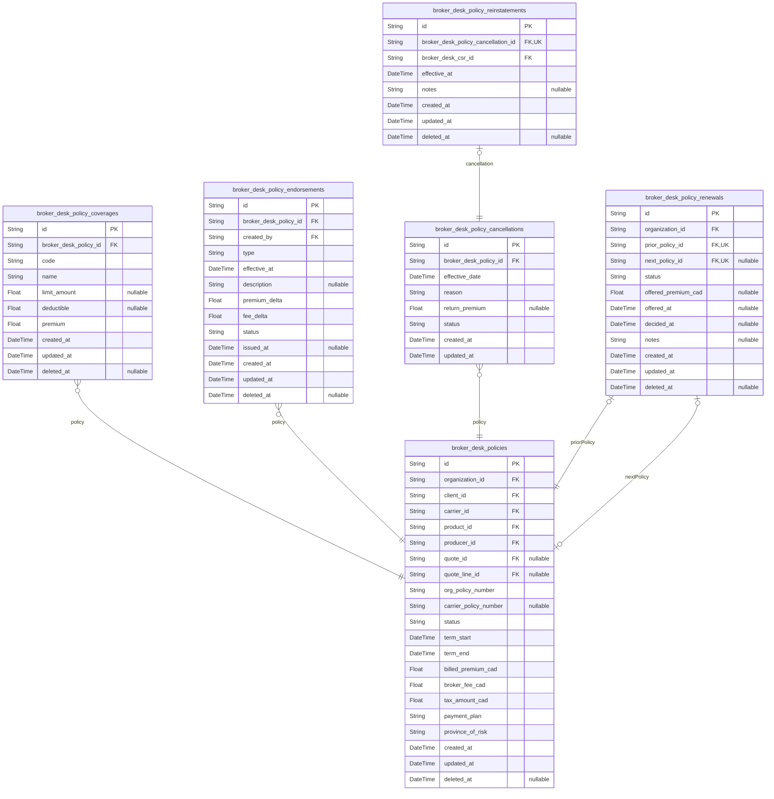
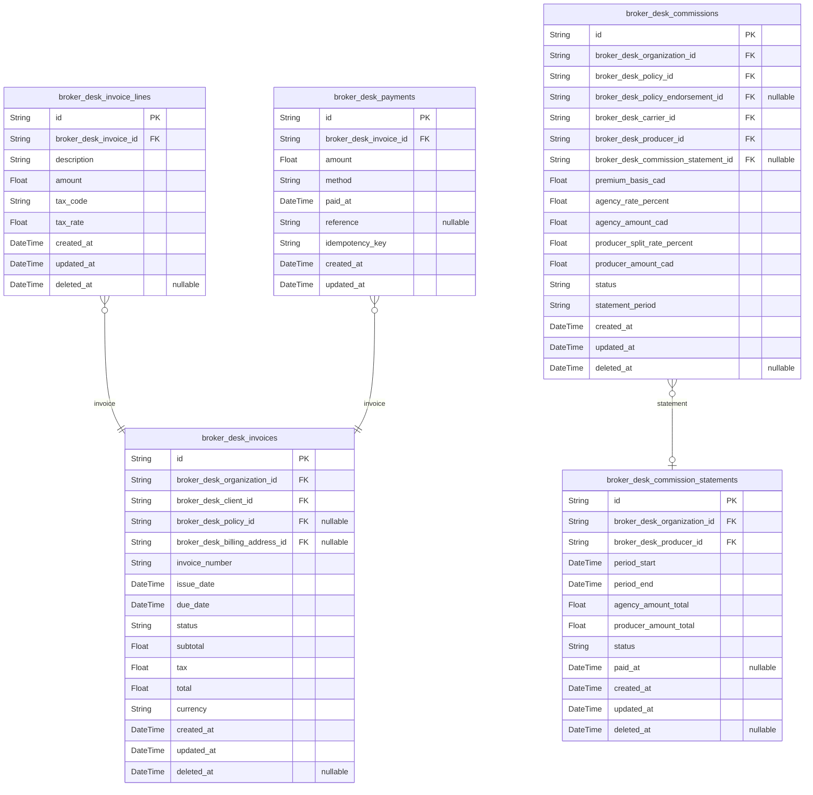
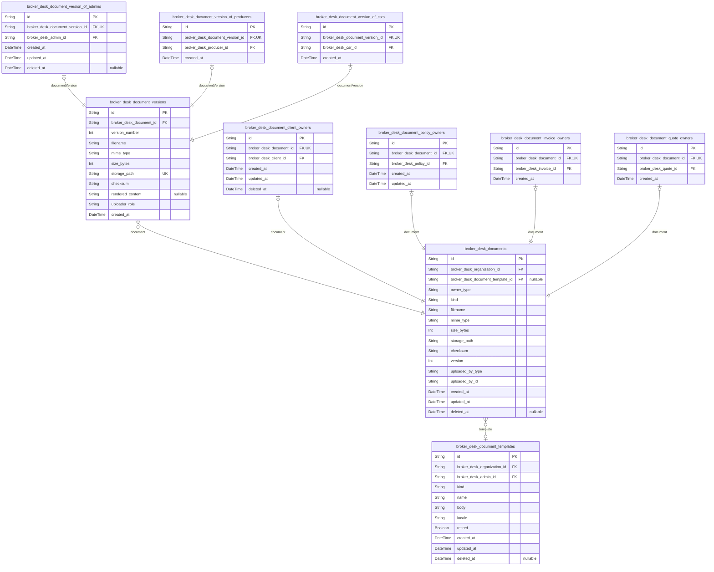

# Prisma Markdown

> Generated by [`prisma-markdown`](https://github.com/samchon/prisma-markdown)

- [Actors](#actors)
- [Systematic](#systematic)
- [Crm](#crm)
- [Catalogue](#catalogue)
- [Quoting](#quoting)
- [Policy](#policy)
- [Billing](#billing)
- [Document](#document)

## Actors

```mermaid
erDiagram
"broker_desk_guests" {
  String id PK
  DateTime created_at
  DateTime updated_at
}
"broker_desk_guest_sessions" {
  String id PK
  String broker_desk_guest_id FK
  String ip
  String href
  String referrer
  DateTime created_at
  DateTime expired_at
}
"broker_desk_admins" {
  String id PK
  String broker_desk_organization_id FK
  String email UK
  String password_hash
  String display_name
  Boolean active
  DateTime created_at
  DateTime updated_at
  DateTime deleted_at "nullable"
}
"broker_desk_admin_sessions" {
  String id PK
  String broker_desk_admin_id FK
  String ip
  String href
  String referrer
  DateTime created_at
  DateTime expired_at
}
"broker_desk_admin_password_resets" {
  String id PK
  String broker_desk_admin_id FK
  String requested_by_admin_id FK "nullable"
  String token_hash UK
  DateTime expired_at
  DateTime consumed_at "nullable"
  DateTime created_at
}
"broker_desk_admin_email_verifications" {
  String id PK
  String broker_desk_admin_id FK
  String email
  String token UK
  DateTime created_at
  DateTime expires_at
  DateTime consumed_at "nullable"
}
"broker_desk_admin_audit_logs" {
  String id PK
  String broker_desk_admin_id FK
  String target_broker_desk_admin_id FK "nullable"
  String action
  String detail
  String ip
  String user_agent
  DateTime created_at
}
"broker_desk_producers" {
  String id PK
  String broker_desk_organization_id FK
  String email UK
  String password_hash
  String display_name
  Boolean active
  DateTime created_at
  DateTime updated_at
  DateTime deleted_at "nullable"
}
"broker_desk_producer_sessions" {
  String id PK
  String broker_desk_producer_id FK
  String ip
  String href
  String referrer
  DateTime created_at
  DateTime expired_at
}
"broker_desk_producer_password_resets" {
  String id PK
  String broker_desk_producer_id FK
  String token UK
  String ip
  DateTime expired_at
  DateTime consumed_at "nullable"
  DateTime created_at
}
"broker_desk_producer_email_verifications" {
  String id PK
  String broker_desk_producer_id FK
  String email
  String token UK
  DateTime created_at
  DateTime expired_at
  DateTime consumed_at "nullable"
}
"broker_desk_csrs" {
  String id PK
  String broker_desk_organization_id FK
  String email
  String password_hash "nullable"
  String display_name
  Boolean active
  DateTime created_at
  DateTime updated_at
  DateTime deleted_at "nullable"
}
"broker_desk_csr_sessions" {
  String id PK
  String broker_desk_csr_id FK
  String ip
  String href
  String referrer
  DateTime created_at
  DateTime expired_at
}
"broker_desk_csr_password_resets" {
  String id PK
  String broker_desk_csr_id FK
  String token_hash UK
  DateTime expires_at
  DateTime used_at "nullable"
  DateTime created_at
  DateTime updated_at
}
"broker_desk_csr_email_verifications" {
  String id PK
  String broker_desk_csr_id FK
  String email
  String token UK
  DateTime created_at
  DateTime expired_at
  DateTime consumed_at "nullable"
}
"broker_desk_clients" {
  String id PK
  String organization_id FK
  String email UK
  String password_hash
  Boolean active
  DateTime email_verified_at "nullable"
  DateTime created_at
  DateTime updated_at
}
"broker_desk_client_sessions" {
  String id PK
  String broker_desk_client_id FK
  String ip
  String href
  String referrer
  DateTime created_at
  DateTime expired_at
}
"broker_desk_client_password_resets" {
  String id PK
  String broker_desk_client_id FK
  String token_hash UK
  DateTime expires_at
  DateTime used_at "nullable"
  DateTime created_at
  DateTime updated_at
}
"broker_desk_client_email_verifications" {
  String id PK
  String broker_desk_client_id FK
  String email
  String token_hash UK
  DateTime expires_at
  DateTime verified_at "nullable"
  DateTime created_at
}
"broker_desk_producer_licences" {
  String id PK
  String broker_desk_producer_id FK
  String province_code
  String licence_type
  String licence_number
  DateTime issue_date
  DateTime expiry_date
  String status
  DateTime created_at
  DateTime updated_at
  DateTime deleted_at "nullable"
}
"broker_desk_guest_sessions" }o--|| "broker_desk_guests" : guest
"broker_desk_admin_sessions" }o--|| "broker_desk_admins" : admin
"broker_desk_admin_password_resets" }o--|| "broker_desk_admins" : admin
"broker_desk_admin_password_resets" }o--o| "broker_desk_admins" : requestedBy
"broker_desk_admin_email_verifications" }o--|| "broker_desk_admins" : admin
"broker_desk_admin_audit_logs" }o--|| "broker_desk_admins" : admin
"broker_desk_admin_audit_logs" }o--o| "broker_desk_admins" : targetAdmin
"broker_desk_producer_sessions" }o--|| "broker_desk_producers" : producer
"broker_desk_producer_password_resets" }o--|| "broker_desk_producers" : producer
"broker_desk_producer_email_verifications" }o--|| "broker_desk_producers" : producer
"broker_desk_csr_sessions" }o--|| "broker_desk_csrs" : csr
"broker_desk_csr_password_resets" }o--|| "broker_desk_csrs" : csr
"broker_desk_csr_email_verifications" }o--|| "broker_desk_csrs" : csr
"broker_desk_client_sessions" }o--|| "broker_desk_clients" : client
"broker_desk_client_password_resets" }o--|| "broker_desk_clients" : client
"broker_desk_client_email_verifications" }o--|| "broker_desk_clients" : client
"broker_desk_producer_licences" }o--|| "broker_desk_producers" : producer
```

### `broker_desk_guests`

Anchor identity record for an unauthenticated visitor initiating one of
BrokerDesk's public entry points before any credentialed identity exists.

Every request that arrives without proven identity belongs to a guest: a
person holding no role among admin, producer, csr, and client and no
standing within any [brokerage](#broker_desk_organizations). The
guest is the default condition of anonymous traffic on the permitted
doors — first-administrator registration, sign-in, password-reset
request, email verification, and token refresh — and this record exists
solely so those flows can be attributed to a stable identifier while the
identity gate continues revealing nothing about which brokerages exist.

By design the record stores no email address, password hash, token, or
any other credential-bearing attribute, and it holds no foreign keys: a
guest has no organization membership, tenant isolation cannot apply until
identity is proven, and a role is received only through successful
conversion to admin, producer, csr, or client — never negotiated at the
gate. Device context such as IP address, href, and referrer lives on
[broker_desk_guest_sessions](#broker_desk_guest_sessions), which references this anchor rather
than duplicating concerns here. Rows are transient by nature: once their
associated public flows conclude they carry no further business meaning,
so stale records are garbage-collected rather than soft-deleted.

Properties as follows:

- `id`: Primary Key.
- `created_at`
  > Moment the anonymous visitor first initiated a public flow such as
  > first-administrator registration, sign-in, token refresh, or a
  > password-reset or email-verification request.
  >
  > Serves as the basis for time-windowed purge jobs removing stale anonymous
  > anchors and for abuse analysis over public-flow traffic.
- `updated_at`
  > Moment this guest record was last touched by any public-flow activity
  > attributed to the same anonymous visitor.
  >
  > Supports staleness detection when garbage-collecting abandoned anchors
  > whose associated flows never completed.

### `broker_desk_guest_sessions`

Anonymous visitor sessions issued before any credentialed identity
exists, tracking each unauthenticated person's device context while they
traverse BrokerDesk's public entry points such as first-administrator
registration, sign-in, password-reset requests, and email verification.

Every record belongs to exactly one [broker_desk_guests](#broker_desk_guests) identity
and captures the network origin (ip), entry URL (href), and referrer
header of the initiating request, forming the transient pre-login state
described by the guest access boundary. Sessions carry no credentials
themselves; they exist only so public flows can correlate successive
steps of one anonymous visit.

Rows are short-lived runtime machinery: expired_at is mandatory, and once
it passes the anonymous token can no longer be exchanged, forcing the
visitor back through the identity gate. Records are append-only artifacts
written once at issuance and never mutated by business operations.

Properties as follows:

- `id`: Primary key identifying the anonymous guest session row.
- `broker_desk_guest_id`
  > Reference to the anonymous [broker_desk_guests](#broker_desk_guests) identity that owns
  > this session.
  >
  > One guest may hold several concurrent anonymous sessions (one per
  > public-flow attempt), making this an ordinary one-to-many reference
  > rather than a unique link. The binding is permanent: a session never
  > migrates between guests.
- `ip`
  > IP address the anonymous visitor presented when the session was created.
  >
  > Part of the device-context trail used for security review of
  > unauthenticated traffic; kept as text so both IPv4 and IPv6 forms survive
  > without lossy conversion.
- `href`
  > Page URL at which the anonymous session was initiated.
  >
  > Records which public entry point (registration, login, token refresh,
  > password reset, email verification) spawned the session so anomalous
  > origins can be audited later.
- `referrer`
  > Referrer header value supplied by the visitor's client application when
  > the session began.
  >
  > Completes the device context alongside ip and href, describing where the
  > unauthenticated traffic came from without revealing whether any brokerage
  > or account exists.
- `created_at`
  > Timestamp at which the anonymous session was issued.
  >
  > Anchors the chronological ordering of a guest's public-flow activity and
  > serves as the sort column of the per-guest session-history index.
- `expired_at`
  > Mandatory expiry moment after which the anonymous token becomes unusable.
  >
  > Guest sessions are deliberately short-lived; once this deadline passes
  > the visitor must restart the public flow from scratch. Never null,
  > because an open-ended anonymous session would violate the default-denial
  > posture enforced at the identity gate.

### `broker_desk_admins`

Brokerage administrator account holding sign-in credentials and
organization membership for the highest-authority staff actor of a
brokerage tenant.

An administrator governs exactly one [broker_desk_organizations](#broker_desk_organizations)
tenant: managing the organization profile, inviting and administering
staff accounts and their roles, stewarding the carrier roster and product
catalogue, owning document templates and commission schedules, overseeing
reports, and reviewing the append-only audit trail. The very first
administrator is created through public guest registration in the same
transaction that creates the new organization, while every subsequent
administrator is provisioned by invitation from an existing administrator
rather than by self-registration.

Each record carries a globally unique email used as the sign-in
identifier together with a salted password hash, a human-readable display
name shown across the workspace, and an active flag that gates
authentication - deactivating an administrator immediately blocks fresh
token issuance while preserving the row for historical references and
audit attribution instead of physically deleting it.

Runtime authentication artifacts live in sibling tables owned by the
authorization flow ([broker_desk_admin_sessions](#broker_desk_admin_sessions), {@link
broker_desk_admin_password_resets}, {@link
broker_desk_admin_email_verifications}), and security-relevant account
events such as activations, role changes, and password changes are
recorded in [broker_desk_admin_audit_logs](#broker_desk_admin_audit_logs).

Properties as follows:

- `id`: Primary key of the administrator account.
- `broker_desk_organization_id`
  > Brokerage tenant this administrator belongs to.
  >
  > Every administrator operates within exactly one {@link
  > broker_desk_organizations} record, and all permission checks and queries
  > are scoped through this membership for multi-tenant isolation. The
  > reference is never null because even the founding administrator is
  > inserted in the same transaction that registers the organization.
- `email`
  > Sign-in email address identifying the administrator.
  >
  > Serves as the credential identifier during login, password recovery, and
  > email verification, and is the address to which invitations, reset links,
  > and verification messages are delivered. Uniqueness is enforced
  > platform-wide so any given email resolves to at most one account.
- `password_hash`
  > Salted hash of the administrator's password credential.
  >
  > Only the irreversible hash is stored, never the plaintext; it is verified
  > at sign-in and replaced whenever the administrator changes the password
  > or completes a reset flow.
- `display_name`
  > Human-readable display name shown throughout the workspace.
  >
  > Appears in staff directories, assignment attributions, and {@link
  > broker_desk_audit_logs} entries identifying who acted, kept distinct from
  > the email so the visible label can change without altering the
  > credential.
- `active`
  > Activation flag gating whether the administrator may authenticate.
  >
  > Deactivation performed by another administrator immediately prevents new
  > session issuance while preserving the account for historical references;
  > reactivation restores access without recreating the record.
- `created_at`
  > Timestamp when the administrator account was created.
  >
  > Set once at registration or invitation acceptance and never modified
  > afterwards.
- `updated_at`
  > Timestamp of the most recent modification to the account.
  >
  > Refreshed whenever profile details, credentials, or the active flag
  > change.
- `deleted_at`
  > Soft-delete timestamp marking administrative removal of the account.
  >
  > Null while the account remains part of the tenant roster; a non-null
  > value hides the account from listings while retaining it for audit
  > traceability.

### `broker_desk_admin_sessions`

JWT authentication session record for a {@link broker_desk_admins
brokerage administrator}, issuing short-lived access tokens paired with
longer-lived refresh tokens.

Each row represents exactly one sign-in from one device or browser
context and captures request-origin metadata (IP address, entry href,
referrer) so that every issued token can be traced back to how and from
where it was obtained. Token renewal reads the administrator's current
role and activation status at refresh time, guaranteeing that renewed
credentials reflect present account state rather than the state at
original issuance.

Logout invalidates the session by terminating its validity ahead of
schedule, and deactivating an administrator force-terminates all of that
administrator's open sessions in bulk as an account-security measure.
Rows form an append-only security audit trail: once written they are
never edited, only terminated.

Properties as follows:

- `id`: Primary Key.
- `broker_desk_admin_id`
  > Reference to the authenticated [broker_desk_admins](#broker_desk_admins) administrator
  > who owns this session.
  >
  > Every session is bound to exactly one administrator within one brokerage
  > organization; all permission checks during access-token and refresh-token
  > validation resolve through this relationship, so a terminated or
  > deactivated administrator immediately loses effective access even if
  > previously issued tokens remain cryptographically valid.
- `ip`
  > Client IP address from which the session was established.
  >
  > Used for security auditing, anomaly detection such as impossible-travel
  > analysis, and post-incident investigation of suspicious sign-ins.
- `href`
  > Absolute URL of the endpoint or page at which sign-in was performed.
  >
  > Records the entry context of authentication for audit purposes.
- `referrer`
  > HTTP referrer value supplied when the session was established.
  >
  > Helps identify whether sign-ins originate from expected application
  > surfaces or external links.
- `created_at`
  > Moment at which the session was created by a successful sign-in.
  >
  > Serves both as the issuance time of the initial access/refresh token pair
  > and as the ordering key of the session history shown in account-security
  > views.
- `expired_at`
  > Moment at which the session stops being accepted, after which its access
  > and refresh tokens are refused.
  >
  > NOT NULL by design: every session carries a hard expiry from creation.
  > Refresh flows extend validity only up to policy limits while re-checking
  > the owner's current role and activation status; logout and forced
  > termination on deactivation shorten this timestamp to terminate the
  > session immediately.

### `broker_desk_admin_password_resets`

Single-use, time-limited password reset tokens issued to {@link
broker_desk_admins} administrators who cannot sign in, covering both
self-service recovery requests and resets an administrator triggers on
behalf of another user.

Each row records the hashed form of the emailed one-time token rather
than any reusable secret, so exposure of stored rows cannot yield working
credentials. A valid token must be presented together with a new password
meeting the quality standard; successful presentation replaces the old
password, after which the previous credential can no longer authenticate.

Token lifecycle is enforced entirely through timestamps: expired_at
bounds validity from issuance, while consumed_at records the moment of
successful use and prevents replay — expired or already-consumed tokens
are rejected, requiring a fresh request. Rows carry permanent attribution
to the affected [broker_desk_admins](#broker_desk_admins) account, with an optional
requester reference identifying the acting administrator when the reset
was initiated on behalf of someone else; self-service requests leave that
reference empty. To avoid revealing whether an email address exists,
reset requests for unknown or deactivated accounts create no row here and
behave identically to known ones.

Properties as follows:

- `id`: Primary Key.
- `broker_desk_admin_id`
  > Reference to the [broker_desk_admins](#broker_desk_admins) account whose password this
  > reset token may replace.
  >
  > Every token is permanently bound to exactly one administrator identity,
  > mirroring the requirement that a reset request targets a known, active
  > account; tokens belonging to deactivated administrators cannot complete a
  > successful sign-in even if consumed.
- `requested_by_admin_id`
  > Optional reference to the [broker_desk_admins](#broker_desk_admins) account of the
  > acting administrator who triggered this reset on behalf of another user.
  >
  > Null for ordinary self-service recovery where the administrator requested
  > their own token; populated whenever an administrator initiates the reset
  > flow targeting a colleague, providing accountability for delegated
  > password administration.
- `token_hash`
  > Hashed form of the single-use reset token delivered by email; the
  > plaintext value is never persisted, and only the matching hash may be
  > presented together with a new password to complete recovery.
- `expired_at`
  > Absolute deadline after which the token is rejected as expired; set at
  > issuance to enforce the time-limited nature of every reset request.
- `consumed_at`
  > Moment the token was successfully redeemed alongside a new password,
  > marking it consumed; null while the token remains unused, and non-null
  > values make replay impossible since consumed tokens are rejected.
- `created_at`
  > Timestamp when the reset request arrived and the token was issued and
  > dispatched by email.

### `broker_desk_admin_email_verifications`

Time-limited, single-use email verification tokens confirming ownership
of an administrator's email address before [broker_desk_admins](#broker_desk_admins)
sign-in is permitted.

Each row is issued when an administrator registers, accepts an
invitation, or later changes their email address, and a one-time token is
delivered to that address. Only a hash of the delivered token is
persisted, so exposure of database contents never yields usable
credentials.

A row becomes permanently spent when consumed by a successful
verification and is independently unusable once its hard expiry passes;
because tokens are strictly single-use, every new verification request
inserts a fresh row rather than mutating an existing one. Expired rows
carry no account state and may be garbage-collected safely, while the
consumption timestamp preserves a lightweight trail of completed
verifications.

Properties as follows:

- `id`: Primary Key.
- `broker_desk_admin_id`
  > Administrator whose email address this verification attempt confirms.
  >
  > Exactly one [broker_desk_admins](#broker_desk_admins) row owns each token, matching the
  > single-recipient nature of the delivered email; the one-to-many direction
  > lets an administrator accumulate historical attempts across registration,
  > invitation acceptance, and later email changes without ever overwriting
  > earlier records.
- `email`
  > Email address targeted by this verification attempt.
  >
  > Captured at issuance so the delivered message stays auditable even if the
  > administrator's profile email changes afterwards; a successful
  > verification proves control of exactly this address.
- `token`
  > Hashed one-time verification token compared against the value the
  > administrator submits.
  >
  > The plaintext token exists only in the outbound email; persisting its
  > hash prevents database compromise from producing working credentials, and
  > the unique guarantee ensures each issued token maps to at most one
  > verification attempt.
- `created_at`: Moment the verification request was generated and the token dispatched.
- `expires_at`
  > Hard deadline after which the token is rejected regardless of whether the
  > submitted value matches.
  >
  > Not-null by security default so every verification window is finite;
  > expired rows stay inert until garbage collection removes them.
- `consumed_at`
  > Timestamp when the token was successfully redeemed, completing email
  > confirmation for the owning administrator.
  >
  > Null while the token is still pending and set exactly once at redemption;
  > combined with the insert-only single-use policy this makes double
  > redemption impossible.

### `broker_desk_admin_audit_logs`

Append-only security audit trail recording authentication and
account-management events performed on [broker_desk_admins](#broker_desk_admins)
accounts, with each entry attributed to the acting administrator.

Every row captures one immutable event such as sign-in, sign-out, role
change, activation, deactivation, password change,
administrator-initiated password reset, or email verification completion.
Entries are written once upon occurrence and never modified or removed,
giving administrators a tamper-evident history for compliance review and
accountability questions about who changed what and when.

Two relationships separate perspective: the mandatory
acting-administrator attribution identifies who performed the action,
while the optional target-administrator reference identifies whose
account was affected whenever one administrator acts on a colleague, for
example a role change or deactivation. Self-service events leave the
target reference null because actor and subject coincide.

Forensic context accompanies each entry through the originating IP
address and client user-agent string, enabling administrators to
correlate suspicious activity across sessions.

Properties as follows:

- `id`: Primary Key.
- `broker_desk_admin_id`
  > Acting administrator attributed with this audit event.
  >
  > References the [broker_desk_admins](#broker_desk_admins) record identifying who
  > performed the authentication or account-management action, making every
  > recorded change attributable to its originator.
- `target_broker_desk_admin_id`
  > Administrator account affected when the event targets someone other than
  > the actor.
  >
  > Populated for administrative actions performed on another member, such as
  > role changes, reactivations, deactivations, or resets triggered on behalf
  > of another user; remains null for self-service events where the acting
  > user and affected account are the same person. References {@link
  > broker_desk_admins}.
- `action`
  > Machine-readable event classifier identifying what occurred.
  >
  > Holds stable labels such as login, logout, role_change, activation,
  > deactivation, password_change, password_reset_requested, or
  > email_verified, letting administrators filter the trail by kind of
  > security event.
- `detail`
  > Human-readable summary of the recorded event.
  >
  > Describes what happened in plain language with relevant specifics, such
  > as the previous and new roles after a role change or which administrator
  > requested a reset on another member's behalf.
- `ip`
  > Source IP address from which the event originated.
  >
  > Captured for security forensics so administrators can correlate activity
  > across sessions and detect anomalous access patterns.
- `user_agent`
  > User-agent string reported by the client application during the event.
  >
  > Preserves device and browser context supporting forensic review of
  > authentication and account-management activity.
- `created_at`
  > Timestamp when the audit event was written.
  >
  > Assigned once at insertion and never altered afterward, anchoring the
  > chronological order of the append-only trail.

### `broker_desk_producers`

Producer actor record representing a sales broker employed or contracted
by one brokerage, owning a book of business that includes assigned {@link
broker_desk_clients}, quotes, carrier submissions, policies, renewals,
and commissions.

Provisioned exclusively through administrator invitation — there is no
public self-registration path. Each row holds the email credential used
for sign-in (unique across the platform), a password hash, a human-facing
display name, and an active flag that administrators toggle to suspend or
restore access without deleting the account.

Every producer belongs to exactly one [broker_desk_organizations](#broker_desk_organizations)
row for tenant isolation; all business records owned by the producer
reference this table by foreign key. Authentication mechanics live in
companion artifacts ([broker_desk_producer_sessions](#broker_desk_producer_sessions), {@link
broker_desk_producer_password_resets}, {@link
broker_desk_producer_email_verifications}) managed by auth flows rather
than on this row.

Properties as follows:

- `id`: Primary Key.
- `broker_desk_organization_id`
  > Owning brokerage tenant of this producer.
  >
  > Every business record the producer creates or owns is ultimately scoped
  > to the referenced [broker_desk_organizations](#broker_desk_organizations) row, enforcing
  > multi-tenant isolation. The relationship is non-optional and 1:N — an
  > organization keeps many producers while each producer belongs to exactly
  > one organization.
- `email`
  > Sign-in email address of the producer, unique across all actors in the
  > platform and used as the primary credential lookup during login and
  > invitation flows.
- `password_hash`
  > Salted password hash verifying the producer's password at sign-in; never
  > stores plaintext credentials.
- `display_name`
  > Human-readable display name shown across staff rosters, client timelines,
  > task assignees, commission statements, and audit attributions.
- `active`
  > Activation state of the account: true when the producer may authenticate
  > and operate, false after administrative deactivation; deactivation
  > terminates active sessions without deleting history.
- `created_at`
  > Timestamp when the producer account row was created through administrator
  > provisioning.
- `updated_at`
  > Timestamp of the most recent mutation of this producer row, refreshed
  > whenever profile data, credentials, or activation state change.
- `deleted_at`
  > Soft-delete marker set when the account is retired; null while the
  > producer remains an ordinary retrievable record.

### `broker_desk_producer_sessions`

A JWT sign-in session record for a [broker_desk_producers](#broker_desk_producers) account,
issuing a short-lived access token paired with a longer-lived refresh
credential so an authenticated producer stays signed in across requests
without re-entering credentials.

Each row captures the device context observed at sign-in — the client IP
address, the application URL where authentication was performed, and the
referrer header — forming an append-only audit trail of producer logins.
Sessions are permanently bound to the producer's brokerage through the
owning producer reference, because [broker_desk_producers](#broker_desk_producers) carries
the organization membership, so a session can never migrate across tenant
boundaries.

Invalidation follows two paths: logout advances the expiry moment so the
paired access and refresh tokens stop working immediately, and
deactivation of the underlying producer account forces termination of
every live session belonging to that producer. The expired_at column is
never null for security reasons, guaranteeing that no session outlives
its declared lifetime.

Properties as follows:

- `id`
  > Primary key identifying the session; also serves as the subject from
  > which the paired access token is derived.
- `broker_desk_producer_id`
  > The producer whose sign-in established this session.
  >
  > Every session belongs to exactly one [broker_desk_producers](#broker_desk_producers)
  > record, which carries the brokerage membership; this indirection
  > permanently binds each authenticated session to a single organization and
  > blocks cross-tenant token usage. Deactivating the producer account
  > invalidates all sessions referencing it.
- `ip`
  > Client IP address observed when the producer authenticated.
  >
  > Retained for security auditing so staff can review where producer
  > sign-ins originate and detect suspicious access patterns.
- `href`
  > Application URL at which the producer performed authentication.
  >
  > Distinguishes portal-originated sign-ins and helps debug authentication
  > flows.
- `referrer`
  > HTTP referrer header value captured at sign-in time.
  >
  > May be blank when the browser withheld the header; kept purely for
  > forensic context.
- `created_at`
  > Moment the session was established by a successful producer sign-in.
  >
  > Combined with the producer foreign key in a composite index to power
  > recent-login listings and audit queries.
- `expired_at`
  > Moment after which the session must be re-authenticated.
  >
  > Always non-null as a security invariant; logout sets it to the current
  > instant, and forced termination after producer deactivation applies the
  > same treatment to every live session.

### `broker_desk_producer_password_resets`

Single-use, time-limited password reset tokens allowing producers who
cannot sign in to set a new password without supplying the old one.

Each row is appended when a producer requests recovery (or an
administrator triggers it on their behalf): an emailed one-time token is
stored only as a hash, stays redeemable until expired_at, and is
permanently sealed by stamping consumed_at once the credential change
succeeds. Expired or already-consumed rows are never reused; any further
request always issues a fresh token.

Security context travels with the row - the requester's IP address and
issuance timestamp support rate-limiting checks and anomaly review when
repeated recovery attempts target the same [broker_desk_producers](#broker_desk_producers)
account.

Relationships: every token belongs to exactly one producer in {@link
broker_desk_producers}, while one producer may accumulate many historical
reset records over time.

Properties as follows:

- `id`: Primary Key of the reset-token record.
- `broker_desk_producer_id`
  > Reference to the producer account whose password this token may reset.
  >
  > Each reset token belongs to exactly one [broker_desk_producers](#broker_desk_producers)
  > row; a producer may hold many reset records over time, but each
  > individual token can discharge only the credential change of its own
  > producer. The relationship points strictly from this child artifact to
  > the parent identity, mirroring the session-table direction.
- `token`
  > Hashed one-time reset token delivered to the producer by email.
  >
  > The raw value is never persisted anywhere; redemption compares hashes, so
  > a database leak cannot expose usable reset links.
- `ip`
  > IP address from which the reset was requested.
  >
  > Recorded for security review and anomaly detection, backing rate-limit
  > decisions when repeated recovery requests hit the same producer account.
- `expired_at`
  > Deadline after which the token is no longer accepted.
  >
  > Not-null by default for security: redemption requires the row to be both
  > unconsumed and inside this window, and expired tokens can only be
  > superseded by newly issued ones.
- `consumed_at`
  > Moment the token was redeemed to set a new password; null while the token
  > is still pending.
  >
  > Stamping this value enforces single-use semantics without deleting the
  > row, preserving the producer's recovery history for security audits.
- `created_at`
  > Timestamp when the reset was requested and the token issued.
  >
  > Serves as the ordering basis for per-producer recovery-history listings
  > and expiry-window bookkeeping alongside expired_at.

### `broker_desk_producer_email_verifications`

One-time verification tokens confirming a {@link broker_desk_producers
producer}'s email address before sign-in is permitted, also serving as
the identity-confirmation step of the administrator-invited activation
path.

Each row records a single emailed challenge, issued either from the
welcome message sent at invitation time or from a subsequent resend
request. Only a digest of the emailed token is stored so a database
compromise never yields usable credentials, and each row carries its own
expiry deadline plus a nullable consumption marker distinguishing
pending, satisfied, and stale challenges.

Rules enforced through this table: sign-in remains refused while the
producer's email is unverified; presenting an expired or already-consumed
token is rejected and requires issuing a fresh message; and completing an
invitation setup link counts as verification, so the activated account
may sign in immediately. Rows are append-only security artifacts and are
never modified after creation.

Properties as follows:

- `id`: Primary Key.
- `broker_desk_producer_id`
  > Producer account whose email address this challenge confirms.
  >
  > Every verification attempt binds to exactly one {@link
  > broker_desk_producers producer}; resending inserts a new row rather than
  > mutating prior ones, so a producer accumulates an append-only history of
  > challenges, and sign-in gating consults the state established by the
  > redeemed row.
- `email`
  > Email address this challenge was issued to confirm.
  >
  > Captured at issuance so the record documents which address was verified
  > even if the [producer](#broker_desk_producers) later changes their
  > contact email; the address becomes verified once a valid token for this
  > row is redeemed.
- `token`
  > Hashed form of the one-time verification token embedded in the emailed
  > confirmation link.
  >
  > Persisting only the digest prevents replay from leaked data; resolution
  > of a presented raw token occurs through this column's unique index.
- `created_at`: Moment the challenge was issued and the verification email dispatched.
- `expired_at`
  > Deadline after which the token is no longer acceptable.
  >
  > A presentation past this moment is rejected, and the producer must
  > request a fresh verification message.
- `consumed_at`
  > Moment the token was successfully redeemed to mark the email verified.
  >
  > Null while the challenge is pending; written exactly once at redemption,
  > enforcing single-use semantics - any later presentation finds a non-null
  > value and is rejected as already used.

### `broker_desk_csrs`

A customer service representative staff account of a brokerage, holding
email and password credentials, a display name, an activation standing,
and membership in exactly one [broker_desk_organizations](#broker_desk_organizations).

CSR accounts are provisioned exclusively through administrator invitation
inside an established organization; public self-registration is reserved
for the first-administrator flow that creates the organization itself. An
invited account starts without a password and reaches its first sign-in
through a single-use, time-limited setup path, whose acceptance also
serves as the email-verification step for the address.

The role encoded by this table carries agency-wide service reach inside
its own brokerage — servicing any client, recording activities,
processing endorsements, handling documents, and coordinating tasks —
while every query executed under this identity stays confined to the
owning organization's data envelope. Role-based authorization blocks all
administrative capabilities such as user management and organization
settings regardless of how valid the session is.

Accounts are never permanently deleted. Deactivation by an administrator
bars sign-in immediately, stops refresh-token renewal, and removes the
account from assignment choices while historical records keep displaying
the display name for reporting and audit; reactivation restores prior
access with no loss of history. Login sessions, password resets, and
email-verification tokens live in companion runtime tables managed by the
authentication layer.

Properties as follows:

- `id`: Primary Key.
- `broker_desk_organization_id`
  > References the brokerage ([broker_desk_organizations](#broker_desk_organizations)) that owns
  > and governs this CSR account.
  >
  > Every CSR belongs to exactly one organization with no multi-brokerage
  > staff membership. This reference defines the tenant boundary for all
  > servicing work — clients, quotes, policies, endorsements, documents,
  > tasks, and invoices reachable under this identity — and administrators
  > may manage the account only from within their own organization.
- `email`
  > Sign-in identifier of the account, presented at login together with the
  > password credential.
  >
  > The address uniquely names the account within its organization and
  > receives invitations, email-verification messages, and password-reset
  > tokens. Uniqueness is enforced per organization through a composite
  > constraint so that independent brokerages never collide on the same
  > address.
- `password_hash`
  > Stored credential proving the person's identity at sign-in.
  >
  > Nullable because administrator-invited accounts start without a password:
  > the invitee establishes the initial password through a one-time setup
  > path, and until then the account exists but cannot sign in. The value is
  > never displayed once chosen and is replaced only through the self-service
  > change or the token-based reset flows.
- `display_name`
  > Human-readable name shown throughout the application.
  >
  > It labels every record attributed to the CSR — recorded client
  > activities, raised tasks, uploaded documents, processed endorsements —
  > and keeps displaying on those historical records for reporting and audit
  > purposes even after the account has been deactivated.
- `active`
  > Activation standing controlling whether sign-in is currently permitted.
  >
  > Only administrators may flip this flag, and only within their own
  > organization. Deactivation immediately bars sign-in, stops refresh-token
  > renewal, and removes the account from client, task, and document
  > assignment choices; reactivation restores the previous access with no
  > loss of history. Each transition is captured in the append-only audit
  > trail together with the acting administrator's identity.
- `created_at`
  > Timestamp when the invited account row was created, preceding the moment
  > the invitee completes initial setup and first sign-in.
- `updated_at`
  > Timestamp of the most recent mutation of the account, such as
  > display-name edits, credential changes, or activation-state flips.
- `deleted_at`
  > Soft-deletion timestamp; null while the account remains in force.
  >
  > Staff accounts are never permanently deleted so that every attributed
  > record stays intact and attributable; removal-like effects are expressed
  > exclusively through the activation standing instead.

### `broker_desk_csr_sessions`

JWT sign-in session record belonging to exactly one customer service
representative ([broker_desk_csrs](#broker_desk_csrs)), issuing short-lived access
tokens paired with longer-lived refresh tokens that remain permanently
bound to the representative's own brokerage and terminate on logout,
refresh-rotation failure, or forced invalidation following account
deactivation.

Each row captures one authenticated CSR session so authorization flows
can validate, renew, and revoke service-side access without touching
business data. Because every token derives its authority from the
referenced [broker_desk_csrs](#broker_desk_csrs) account, role checks, active-flag
verification, and brokerage scoping all resolve through the single
foreign key below, confining the caller to their organization without
duplicating tenant data onto the session row.

Sessions are append-only security artifacts managed entirely through
authentication flows: creation occurs at successful sign-in, renewal
advances the expiry, and logout or deactivation-driven termination pulls
the expiry to the current moment instead of deleting the row, preserving
a complete sign-in history for security review.

Properties as follows:

- `id`
  > Primary key uniquely identifying an individual CSR sign-in session across
  > its whole lifecycle, also serving as the stable reference embedded in
  > issued token claims.
- `broker_desk_csr_id`
  > Owning customer service representative whose credentials established this
  > session.
  >
  > References [broker_desk_csrs](#broker_desk_csrs); every access and refresh token
  > minted under this row inherits that account's role, active flag, and
  > organization membership, which confines all servicing reach to the
  > caller's own brokerage. Deactivating the referenced CSR forces
  > termination of every still-open session belonging to that representative.
- `ip`
  > IP address from which the sign-in request was received.
  >
  > Captured once at session establishment for device-context tracking and
  > post-hoc security auditing of CSR access patterns.
- `href`
  > Absolute URL of the application page that initiated the sign-in request.
  >
  > Preserves the entry point of the session so audits can reconstruct where
  > authentication began.
- `referrer`
  > Referrer URL supplied by the client application when the sign-in request
  > was issued.
  >
  > Complements href in reconstructing the navigation context that led to
  > session creation.
- `created_at`
  > Moment the session was established through successful CSR authentication.
  >
  > Serves as the chronological ordering key for per-representative session
  > history and pairs with the composite index used when listing recent
  > sessions.
- `expired_at`
  > Moment after which this session no longer validates access nor accepts
  > renewal requests.
  >
  > Set in the future at creation to bound refresh-token lifetime, advanced
  > by refresh rotation, and pulled back to the current time upon logout or
  > forced termination after account deactivation; never null, keeping
  > expired rows queryable within the append-only trail.

### `broker_desk_csr_password_resets`

Single-use, time-limited credential-recovery token for a {@link
broker_desk_csrs} staff account, enabling password recovery when the CSR
cannot sign in.

Issued whenever a password reset is requested for a known, active CSR
email address — whether self-requested by the CSR or initiated by an
administrator on their behalf — each row persists only the cryptographic
hash of the emailed one-time token, never the token itself. Delivery may
be written to logs instead of actually emailed in development
environments.

A token is consumable exactly once: presenting a valid, unused, unexpired
record together with a new password meeting the quality standard replaces
the old credential. Attempts using an invalid, reused, or expired token
are rejected and leave the account unchanged, after which a fresh request
must be made.

Rows are retained as a security audit trail of credential-recovery
activity; expired or consumed tokens carry no residual access capability
and may be purged by scheduled cleanup.

Properties as follows:

- `id`: Primary Key.
- `broker_desk_csr_id`
  > References the [broker_desk_csrs](#broker_desk_csrs) staff account whose password this
  > token may reset.
  >
  > Exactly one CSR owns each reset request; the relationship is non-optional
  > because a token cannot exist without the account it recovers. A CSR
  > accumulates multiple reset records over time, forming a recovery history
  > in which only an unconsumed, unexpired token remains practically usable.
- `token_hash`
  > Cryptographic hash of the one-time reset token delivered to the CSR's
  > email address.
  >
  > Only the SHA-256 digest is persisted so that a database compromise cannot
  > expose usable recovery credentials; incoming tokens are hashed before
  > lookup against this column. Uniqueness enforces one row per issued token
  > and makes token presentation an indexed constant-time lookup.
- `expires_at`
  > Deadline after which the token is no longer acceptable for completing a
  > password change.
  >
  > Set at issuance to enforce the time-limited nature of recovery tokens;
  > presentation after this moment is rejected and requires issuing a fresh
  > request.
- `used_at`
  > Moment the token was successfully consumed to complete a password change,
  > or null while still unused.
  >
  > A non-null value marks the row as spent, enforcing single-use semantics:
  > reused tokens are rejected even within their validity window.
- `created_at`
  > Issuance timestamp recorded when the password reset was requested.
  >
  > Orders the recovery history per [broker_desk_csrs](#broker_desk_csrs) account and
  > anchors audit reporting of credential-recovery activity.
- `updated_at`
  > Timestamp of the latest modification, advancing primarily when the token
  > is consumed.
  >
  > Distinguishes untouched pending requests from rows mutated during
  > consumption without altering the original issuance time.

### `broker_desk_csr_email_verifications`

One-time email verification tokens confirming a {@link broker_desk_csrs
CSR}'s email address before sign-in is permitted.

Each row records a single verification attempt issued to a customer
service representative, holding the exact email address being verified
together with a secure one-time token and its expiry moment. While a
CSR's email remains unverified, sign-in is refused, so this table
directly gates a CSR's first successful authentication following
administrator invitation.

Tokens are strictly single-use: presenting a valid, unexpired token
consumes the record, and any subsequent presentation of the same token is
rejected. When a token has expired without consumption or was already
used, the system issues a fresh verification message rather than reviving
the stale record, keeping the verification history append-only.

Properties as follows:

- `id`: Primary Key.
- `broker_desk_csr_id`
  > Reference to the [CSR](#broker_desk_csrs) account whose email address
  > this verification token confirms.
  >
  > Every token belongs to exactly one customer service representative
  > account, while a single CSR may accumulate several verification rows over
  > time as invitations are re-issued or addresses change, forming an
  > append-only verification history rather than an overwrite.
- `email`
  > Email address this token verifies.
  >
  > Snapshots the CSR's email address at issuance time so a later address
  > change cannot retroactively reinterpret older tokens; acceptance logic
  > matches the presented token against this recorded address context.
- `token`
  > Secure one-time verification token carried inside the emailed
  > verification link.
  >
  > Stored in hashed form so exposure of stored data cannot reveal usable
  > verification links; global uniqueness guarantees every dispatched message
  > references a distinct token value.
- `created_at`
  > Timestamp recording when this verification token was generated and its
  > verification email dispatched.
  >
  > Serves as the chronological anchor for the per-CSR verification history
  > and for auditing repeated re-issue requests.
- `expired_at`
  > Moment after which this token is no longer acceptable.
  >
  > NOT NULL by design because verification links are security-sensitive and
  > must always carry a bounded lifetime; presenting an expired token is
  > rejected and a fresh message must be requested instead.
- `consumed_at`
  > Timestamp marking when the token was successfully presented and the CSR's
  > email confirmed; NULL means the token is still unused.
  >
  > A presentation attempt against a row whose consumed_at is already set is
  > rejected as reuse, enforcing strictly one-time verification semantics.

### `broker_desk_clients`

A portal client authentication identity: an insured customer's sign-in
account, provisioned by an administrator of exactly one brokerage against
that customer's existing client profile.

Unlike staff accounts, this identity performs no work inside the
brokerage; its grants are limited to reading its own policies and
documents and submitting service requests through the deferred
self-service portal. The account is always tied to exactly one {@link
broker_desk_organizations} tenant — it never floats free and never spans
brokerages — and role separation guarantees no hybrid staff-and-customer
account exists. Public registration never creates these identities;
provisioning is exclusively administrative.

Sign-in uses email and password credentials verified by the shared token
machinery: one-time tokens confirming control of the email address
(carried in companion verification tables) must be redeemed before first
successful sign-in, and password recovery proceeds through single-use
reset tokens without revealing whether an address exists. Sessions issue
paired access and refresh tokens confined to the owning brokerage.

Accounts are never physically deleted. An administrator deactivates the
identity instead, which bars sign-in immediately while every historical
attribution remains intact; reactivation restores ordinary access with no
loss of history.

Properties as follows:

- `id`
  > Primary key that uniquely identifies each portal client authentication
  > identity.
- `organization_id`
  > Membership of this portal account in exactly one brokerage organization.
  >
  > The identity is provisioned by an administrator of that organization
  > against an existing client profile maintained in the CRM domain, and
  > every entitlement the account carries derives from being the subject of
  > records inside this single tenant. The reference to {@link
  > broker_desk_organizations} enforces tenant isolation: all session queries
  > executed under this identity are scoped to this organization only.
- `email`
  > Sign-in identifier of the portal account.
  >
  > The email address uniquely names the account across the whole platform
  > and is what the insured customer submits together with their password at
  > sign-in. Control of the address is proven through the one-time token flow
  > carried by [broker_desk_client_email_verifications](#broker_desk_client_email_verifications); sign-in stays
  > refused until verification completes, and a fresh message can be
  > requested when the token has expired or was used.
- `password_hash`
  > Stored credential proving the customer's identity at sign-in.
  >
  > Only the irreversible hash is ever persisted; the plaintext password is
  > never displayed once chosen and can be replaced solely through the
  > single-use, time-limited token flow carried by {@link
  > broker_desk_client_password_resets}, including resets an administrator
  > triggers on the customer's behalf when they lose access to their mailbox.
- `active`
  > Activation standing controlling whether sign-in is currently permitted
  > for this identity.
  >
  > Accounts are never physically deleted: an administrator deactivates the
  > identity instead, barring sign-in immediately while every historical
  > record stays attributable, and reactivation restores ordinary access with
  > no loss of history. Administrators cannot deactivate their own account,
  > and the last active administrator in the organization is always protected
  > from deactivation.
- `email_verified_at`
  > Timestamp marking when the customer completed the email verification flow
  > and confirmed control of the sign-in address.
  >
  > Null means the address is unverified, in which case sign-in is refused
  > regardless of correct credentials and a fresh verification message may be
  > offered; presenting a valid, unused, unexpired token from {@link
  > broker_desk_client_email_verifications} fills this value and unlocks
  > normal sign-in.
- `created_at`
  > Moment the administrator provisioned this portal identity against the
  > existing client profile.
- `updated_at`
  > Last modification timestamp of the account, reflecting credential
  > replacement, activation or deactivation changes, and email verification
  > completion.

### `broker_desk_client_sessions`

JWT authentication session issued to a portal client identity after
successful sign-in, carrying paired access-token and refresh-token grants
under the same token machinery used by staff actors.

Each row belongs to exactly one [broker_desk_clients](#broker_desk_clients) portal
identity and records the network context of the sign-in request ({@link
broker_desk_client_sessions.ip}, href, referrer), the moment the session
was established, and the hard expiry deadline enforced by the
authorization layer. Access tokens are validated statelessly against
their signature while refresh flows re-issue short-lived tokens bound to
this row, so logging out or forcibly terminating the session revokes both
grants at once.

Sessions are append-only security artifacts managed exclusively by
authentication flows: created at login, renewed through refresh while
still valid, and ended by explicit logout or automatic invalidation when
the owning client's credentials change or the account is deactivated.
They never hold business data — commercial records reference clients
directly rather than through sessions.

Properties as follows:

- `id`
  > Primary key identifying this portal-client sign-in session.
  >
  > Referenced by the authorization layer when validating refresh-token
  > grants against live sessions.
- `broker_desk_client_id`
  > Portal client identity that owns this sign-in session.
  >
  > Exactly one [broker_desk_clients](#broker_desk_clients) record issues any number of
  > sessions across devices and browsers, so the relationship is one-to-many
  > and mandatory — a session cannot exist without its authenticated owner.
  > Termination of all rows bearing this reference is how account
  > deactivation and credential changes revoke outstanding portal access.
- `ip`
  > IP address from which the sign-in request originated.
  >
  > Captured for device auditing so users can recognize unfamiliar sign-ins
  > and support staff can investigate suspicious portal activity.
- `href`
  > URL of the page from which the portal sign-in flow was initiated.
  >
  > Preserves the entry point so post-login navigation can return the user
  > toward their original destination and audits retain request origin.
- `referrer`
  > Referrer URL supplied by the browser during sign-in.
  >
  > Complements [broker_desk_client_sessions.ip](#broker_desk_client_sessions) and href in
  > reconstructing the request context of session establishment.
- `created_at`
  > Moment the session was established by a successful sign-in or refresh
  > grant.
  >
  > Serves as the sort anchor of the composite session-history index and
  > marks the start of validity alongside expired_at.
- `expired_at`
  > Hard expiry deadline after which the session can no longer be renewed or
  > honored.
  >
  > NOT NULL by security policy: every session is born with a finite
  > lifetime, and logout or forced invalidation ends the session earlier than
  > this bound rather than relying on nullable markers.

### `broker_desk_client_password_resets`

Password-reset token issuance for portal client account recovery, storing
a hashed single-use token that authorizes setting a new credential when
the holder presents it before expiry.

Each row belongs to exactly one [broker_desk_clients](#broker_desk_clients) identity and
records only the cryptographic digest of the emailed token, never the raw
value. Redemption is bounded by an expiry deadline and permanently
consumed on first successful use, so tokens cannot be replayed.

Responses never reveal whether the addressed email belongs to an existing
portal client; issuance and consumption are handled exclusively by the
authentication flows of [broker_desk_clients](#broker_desk_clients), with no standalone
management endpoints.

Properties as follows:

- `id`: Primary key identifying an individual password-reset token issuance.
- `broker_desk_client_id`
  > Portal client identity whose password this token authorizes resetting.
  >
  > Exactly one [broker_desk_clients](#broker_desk_clients) row owns each reset issuance;
  > presenting a valid token within its validity window permits setting a new
  > credential on this client only.
- `token_hash`
  > Cryptographic hash of the one-time reset token delivered to the client's
  > email address.
  >
  > Only the digest is persisted so raw tokens never appear in storage;
  > uniqueness guarantees every generated token maps to exactly one possible
  > redemption.
- `expires_at`
  > Deadline after which the token is no longer redeemable.
  >
  > Reset presentations arriving later than this moment are refused and a
  > fresh token must be requested.
- `used_at`
  > Moment the token was successfully redeemed to set a new password,
  > remaining null until then.
  >
  > A non-null value permanently consumes the token, blocking any second use
  > even before expiry.
- `created_at`: Timestamp when the reset was requested and the token was issued.
- `updated_at`
  > Timestamp of the latest modification, currently limited to the
  > consumption event that sets used_at.

### `broker_desk_client_email_verifications`

One-time verification tokens confirming a portal client's email address
prior to first successful sign-in.

Each record pairs a single-use, time-limited token with one {@link
broker_desk_clients} identity and the exact email address being proven.
Sign-in remains refused until a valid token is confirmed, so
portal-client provisioning issues a row up front and clients may request
fresh rows whenever a previous token expires or goes unused. Rows are
immutable once written apart from the confirmation stamp, and exhausted
rows simply age out for routine cleanup.

Properties as follows:

- `id`: Primary Key.
- `broker_desk_client_id`
  > Portal client identity whose email address this verification confirms.
  >
  > Every token belongs to exactly one [broker_desk_clients](#broker_desk_clients) row, and
  > the relationship is intentionally non-unique so a client can accumulate
  > several verification attempts across provisioning retries, expired links,
  > or corrected addresses. Only the child side holds the reference; the
  > client table itself never points back into verification artifacts.
- `email`
  > Email address being confirmed by this verification attempt.
  >
  > Stored as an explicit snapshot rather than read live from the client
  > profile so the token keeps proving ownership of the address that was
  > originally targeted, even if the client's email changes before
  > confirmation completes.
- `token_hash`
  > Hashed form of the single-use verification token delivered inside the
  > emailed confirmation link.
  >
  > Only the digest is persisted so exposure of this table cannot reveal
  > usable verification links; the plaintext token exists solely within the
  > outbound message.
- `expires_at`
  > Deadline after which the token is no longer acceptable.
  >
  > The short validity window enforces the time-limited nature of
  > confirmations; once this moment passes, a brand-new verification row must
  > be issued rather than reviving the old one.
- `verified_at`
  > Moment the email address was successfully confirmed.
  >
  > Null while the token is still pending; set exactly once when the correct
  > token is presented, permanently consuming the row and preventing any
  > later replay.
- `created_at`: When the verification token was issued to the client.

### `broker_desk_producer_licences`

A provincial insurance licence held by a [broker_desk_producers](#broker_desk_producers)
producer, recording the issuing jurisdiction, credential type, licence
number, and validity window used to verify the producer's legal authority
to sell insurance in that province.

Each row captures one provincial qualification: the issuing province code
(ON/QC/AB/BC/...), the regulatory licence type such as RIBO, the
government-assigned licence number, the issue date marking the start of
validity, and the expiry date marking its end. A separate status field
records the licence's regulatory standing so that suspensions or
revocations remain visible even while the expiry date still lies in the
future.

This table is the compliance-alert source for licence governance: expired
and soon-expiring conditions are detected by comparing expiry dates
against the current date and surfaced as flags feeding notifications and
admin dashboards, ensuring producers without valid provincial credentials
are identified before they quote or bind business in that jurisdiction.
Administrators and CSRs maintain these records on behalf of producers,
and each producer sees the licences qualifying their own book.

Properties as follows:

- `id`: Primary Key.
- `broker_desk_producer_id`
  > Reference to the [broker_desk_producers](#broker_desk_producers) account holding this
  > provincial licence.
  >
  > Every licence belongs to exactly one producer. The relationship scopes
  > licence maintenance (administrators and CSRs manage the roster of staff
  > qualifications) and lets a producer review the credentials qualifying
  > their own book of business.
- `province_code`
  > Canadian province or territory code where the licence was issued, such as
  > ON, QC, AB, or BC.
  >
  > Drives jurisdiction checks when quoting or writing business in a given
  > province and groups licence maintenance by region.
- `licence_type`
  > Regulatory classification of the credential, such as RIBO (Registered
  > Insurance Brokers of Ontario) or the equivalent licence class of another
  > province.
  >
  > Distinguishes which kinds of insurance activity the producer is
  > authorized to perform within the issuing jurisdiction.
- `licence_number`
  > Government-assigned identifier printed on the licence document.
  >
  > Used for verification against regulator registries and displayed during
  > compliance reviews; uniqueness is enforced jointly with the holder,
  > province, and licence type.
- `issue_date`
  > Date the regulator issued the licence.
  >
  > Marks the beginning of the credential's validity period and provides
  > issuance provenance during audits.
- `expiry_date`
  > Date after which the licence is no longer valid unless renewed.
  >
  > Primary input to compliance scanning: values approaching the current date
  > trigger soon-expiring notifications, and lapsed values surface
  > expired-licence flags on admin dashboards.
- `status`
  > Current regulatory standing of the licence, such as active, suspended, or
  > revoked.
  >
  > Complements the expiry date because a licence can become invalid before
  > expiring through suspension or voluntary surrender; compliance views
  > filter on this value together with expiry proximity.
- `created_at`: Timestamp when this licence record was created.
- `updated_at`
  > Timestamp of the most recent update to this licence record, including
  > renewals that extend the validity window.
- `deleted_at`
  > Soft-delete timestamp; set when a licence record is withdrawn from view
  > while remaining available for historical compliance auditing.

## Systematic

### `broker_desk_organizations`

Root tenant representing an independent insurance brokerage; every
business record in the system belongs to exactly one {@link
broker_desk_organizations}.

The organization is the top-level isolation boundary of BrokerDesk's
multi-tenant architecture. It is created transactionally alongside the
first administrator account during public registration, after which all
staff actors, client profiles, commercial records, catalogue data, and
paperwork are scoped to it through organization ownership enforced on
every query.

Profile content covers the brokerage's legal identity (registered legal
name, optional operating/trade name), contact channel (business phone),
CRA tax registration (HST/GST number), and the embedded principal-office
address block. Provincial context is captured twice by design:
primary_province declares the operating jurisdiction driving licence
checks and default taxation, while the address block locates the physical
office for correspondence and document rendering.

Financial configuration is anchored by the fixed CAD currency column
mandated by Canadian compliance, plus the settings JSON column storing
the organization-configurable tax rate table seeded with Ontario HST 13%
as the default example; invoice lines consult these configured rates when
stamping GST/HST/QST/exempt treatment and recording the rate used at
issuance.

Administrators exclusively manage this record through organization
profile and settings endpoints; changes flow into the audit trail where
applicable. Soft deletion is intentionally unsupported - tenants are
deactivated through user administration rather than removed.

Properties as follows:

- `id`
  > Primary key identifying the brokerage organization that owns every
  > business record in the system.
- `legal_name`
  > Registered legal name of the brokerage.
  >
  > Used on official documents, invoices, certificates of insurance, and
  > regulatory filings. Distinct from the operating name, which may be a
  > trade name under which the brokerage does business.
- `operating_name`
  > Trade or operating name used publicly when it differs from the registered
  > legal name.
  >
  > Nullable because most independent brokerages operate under their legal
  > name; consumers fall back to legal_name for display when absent.
- `primary_province`
  > Canadian province or territory code (ON, QC, AB, BC, ...) where the
  > brokerage primarily operates.
  >
  > Drives default provincial taxation rules seeded into the settings tax
  > rate table, producer licence jurisdiction checks, and province-scoped
  > filtering across the platform.
- `phone`
  > Primary business telephone number of the brokerage.
  >
  > Rendered onto client-facing paperwork produced from document templates
  > such as invoices and certificates.
- `hst_gst_number`
  > HST/GST registration number issued by the CRA (format 123456789RT0001).
  >
  > Appears on invoices and other tax-bearing documents. Nullable because a
  > freshly registered brokerage may not yet hold a registration number.
- `default_currency`
  > Fixed ISO currency code governing every monetary value recorded by the
  > platform.
  >
  > Always 'CAD' per Canadian compliance requirements; persisted as an
  > explicit column so financial records remain self-describing even though
  > multi-currency support does not exist.
- `settings`
  > Organization-scoped configuration JSON holding the configurable tax rate
  > table plus related brokerage preferences.
  >
  > Explicitly specified JSON content: seeded with Ontario HST 13% as the
  > default example, it stores per-province sales tax rates
  > (GST/HST/QST/exempt handling), broker fee taxability flags, and similar
  > configurable values consumed when issuing invoice lines. Stored as a
  > string-typed column; service-layer validation enforces structure on read
  > and write.
- `address_line1`
  > Street address line 1 of the brokerage's principal office.
  >
  > First line of the embedded brokerage address block specified for the
  > organization; printed on client-facing documents.
- `address_line2`
  > Street address line 2 (unit, suite, or floor) of the brokerage's
  > principal office.
  >
  > Optional continuation of the embedded brokerage address block.
- `city`
  > City of the brokerage's principal office.
  >
  > Municipality component of the embedded brokerage address block.
- `province`
  > Province code of the brokerage's principal office address.
  >
  > Geographic component of the embedded brokerage address block, independent
  > of primary_province which captures the overall operating jurisdiction.
- `postal_code`
  > Postal code of the brokerage's principal office (A1A 1A1 format).
  >
  > Final component of the embedded brokerage address block.
- `created_at`
  > Timestamp when the organization record was created.
  >
  > Set once during first-administrator registration, which creates the
  > organization transactionally together with the founding ADMIN user
  > account.
- `updated_at`
  > Timestamp of the most recent modification to the organization record.
  >
  > Refreshed whenever administrators update profile details or revise the
  > settings configuration through organization management endpoints.

### `broker_desk_audit_logs`

Immutable append-only audit trail attributing every recorded creation,
modification, deletion, and practical client-personal-information access
event on critical business entities to the acting staff member within one
[broker_desk_organizations](#broker_desk_organizations).

Coverage follows the compliance mandate: changes to clients, quotes,
policies, endorsements, invoices, commissions, staff accounts, and
products are logged, while reads touching client personal information are
captured as access events so privacy accountability under Canadian
requirements can be demonstrated. Each row stores the performed action, a
logical entity type with the referenced row identifier, and nullable
serialized JSON before/after snapshots that together constitute the
change diff; rows are written once by the platform and never mutated or
soft-deleted, which is why the model carries only created_at.

Concrete attribution to the acting identity lives one-to-one in the
[broker_desk_audit_log_of_admins](#broker_desk_audit_log_of_admins), {@link
broker_desk_audit_log_of_producers}, and {@link
broker_desk_audit_log_of_csrs} companion rows selected through the
actorType discriminator. This subtype layout keeps the main table free of
multiple nullable actor foreign keys while still resolving exactly who
acted and from which sign-in session.

Properties as follows:

- `id`: Primary Key.
- `broker_desk_organization_id`
  > Brokerage tenant that owns this audit entry.
  >
  > Every business record in BrokerDesk belongs to exactly one {@link
  > broker_desk_organizations}; an audit entry inherits the tenant scope of
  > the change it describes so administrators review the trail strictly
  > within their own brokerage.
- `actor_type`
  > Discriminator naming which staff actor kind performed the recorded event.
  >
  > Constrained in application logic to admin, producer, or csr; routes
  > attribution resolution to the matching one-to-one companion table ({@link
  > broker_desk_audit_log_of_admins}, {@link
  > broker_desk_audit_log_of_producers}, or {@link
  > broker_desk_audit_log_of_csrs}) instead of stacking nullable actor
  > foreign keys on this table.
- `action`
  > Verb performed on the affected entity.
  >
  > Constrained in application logic to create, update, delete, or access,
  > where access denotes a read touching client personal information captured
  > for privacy accountability rather than a data mutation.
- `entity_type`
  > Logical type label of the audited entity.
  >
  > Stores the stable domain name of the affected record — client, quote,
  > policy, endorsement, invoice, commission, admin, producer, csr, or
  > product — so the companion pointer in entityRefId resolves without
  > coupling this table to physical table names.
- `entity_ref_id`
  > Primary key of the affected entity row.
  >
  > Deliberately a plain UUID rather than a foreign key because the
  > referenced table varies with entityType; paired with entityType it forms
  > the lookup path retrieving the complete change history of any single
  > record.
- `before_data`
  > Serialized JSON snapshot of the entity state before the change.
  >
  > Null for create and access events, where no prior state exists to record;
  > stored as JSON text under the explicit audit-diff requirement so
  > reviewers see exactly which fields changed.
- `after_data`
  > Serialized JSON snapshot of the entity state after the change.
  >
  > Null for delete and access events, where no resulting state exists;
  > combined with beforeData it forms the before/after diff demanded by the
  > audit specification.
- `created_at`
  > Timestamp when the event was recorded.
  >
  > Doubles as the occurrence moment because rows are immutable once written;
  > updatedAt and deletedAt are intentionally absent from this append-only
  > trail.

### `broker_desk_notifications`

Alert record addressed to exactly one staff member or portal user, raised
by persisted system triggers such as task due dates, expiring producer
licences, expiring policies, upcoming renewals, and carrier submission
status changes.

Each [broker_desk_notifications](#broker_desk_notifications) row is scoped to one {@link
broker_desk_organizations} so tenant isolation applies to the alert
stream just like every other business record; the recipient, however, is
stored polymorphically (recipient_role plus recipient_user_id) because
brokerage identities live in separate actor tables — administrators,
producers, CSRs, and portal clients — and stacking nullable per-role
foreign keys here would violate normalization, so referential integrity
of the pair is enforced at the application layer.

The triggering source is likewise referenced polymorphically through
source_entity_type and source_entity_id because the five trigger families
originate from different tables ([broker_desk_tasks](#broker_desk_tasks) for task_due,
producer licence records for producer_licence_expiring, {@link
broker_desk_policies} for policy_expiring, {@link
broker_desk_policy_renewals} for renewal_due, and {@link
broker_desk_submissions} for submission_status_changed); the pair doubles
as the deep-link target the notification center uses to open the
originating record.

Lifecycle is intentionally small: created_at records when the trigger
fired, read_at flips from null to a timestamp when the recipient
acknowledges the alert, updated_at tracks that acknowledgement, and
deleted_at softly dismisses the alert from the inbox without destroying
the trail. Rows are written exclusively by the platform's persisted
triggers; users never author notifications, they only browse,
acknowledge, and dismiss them.

Properties as follows:

- `id`: Primary Key.
- `broker_desk_organization_id`
  > Brokerage tenant that owns this notification.
  >
  > Every business record in BrokerDesk belongs to exactly one {@link
  > broker_desk_organizations}, and notifications are no exception: the
  > organization boundary guarantees staff only ever see alerts raised inside
  > their own brokerage and gives administrators a natural scope for
  > organization-wide administration.
- `type`
  > Trigger family that raised the alert: task_due,
  > producer_licence_expiring, policy_expiring, renewal_due, or
  > submission_status_changed.
  >
  > The value mirrors the five persisted notification triggers required by
  > the platform and lets API consumers render type-specific icons, grouping,
  > and deep links in the notification center without parsing prose.
- `title`
  > Short human-readable headline displayed in notification lists.
  >
  > Kept deliberately brief so dense inbox rows stay scannable, with detail
  > deferred to body.
- `body`
  > Free-form message elaborating the alert beyond its headline.
  >
  > Populated by whichever persisted trigger raised the record — for example
  > the licence number and expiry date for a producer_licence_expiring alert
  > or the carrier reference for a submission_status_changed alert.
- `recipient_role`
  > Actor family the recipient belongs to: ADMIN, PRODUCER, CSR, or CLIENT.
  >
  > Because brokerage identities are physically realized as separate actor
  > tables (administrators, producers, CSRs, and portal clients), the role
  > selects which table holds the recipient row identified by
  > recipient_user_id; the pair forms the polymorphic recipient reference
  > whose integrity is enforced at the application layer, avoiding prohibited
  > stacks of nullable per-role foreign keys.
- `recipient_user_id`
  > Identifier of the addressed person within the actor table selected by
  > recipient_role.
  >
  > Combined with recipient_role this drives every inbox query — list mine,
  > count unread, mark read — which is why the composite indexes lead with
  > these two columns.
- `source_entity_type`
  > Logical table name of the entity that triggered the notification, such as
  > broker_desk_tasks, producer licence records, broker_desk_policies, policy
  > renewal records, or broker_desk_submissions.
  >
  > Together with source_entity_id it forms the polymorphic deep-link target
  > that lets the notification center navigate straight to the originating
  > record regardless of which domain raised the alert.
- `source_entity_id`
  > Primary key of the triggering entity inside the table named by
  > source_entity_type.
  >
  > Indexed as a composite pair with source_entity_type to support reverse
  > lookups, such as clearing stale alerts when a task completes or a
  > submission changes state again.
- `read_at`
  > Moment the recipient acknowledged the alert; null while unread.
  >
  > Unread badge counts and unread-only filters test this column for null,
  > and marking a notification read stamps it once; the column participates
  > in a composite index so unread filtering stays indexed per recipient.
- `created_at`
  > Moment the trigger persisted this alert.
  >
  > Inbox listings sort descending on this column so the newest alerts appear
  > first.
- `updated_at`
  > Last modification time, advanced whenever the record changes after
  > creation, such as when acknowledgement is stamped.
  >
  > Maintained alongside created_at per the platform-wide temporal convention.
- `deleted_at`
  > Soft-dismissal marker; null while the notification remains visible in the
  > inbox.
  >
  > Dismissing an alert hides it from the recipient without destroying the
  > audit-relevant record, mirroring the soft-deletion discipline applied
  > elsewhere in the platform.

### `broker_desk_audit_log_of_admins`

[broker_desk_audit_log_of_admins](#broker_desk_audit_log_of_admins) identifies which administrator
performed an audited action, binding an append-only {@link
broker_desk_audit_logs} entry to the acting [broker_desk_admins](#broker_desk_admins)
account and to the [broker_desk_admin_sessions](#broker_desk_admin_sessions) sign-in session in
effect at the time.

The parent [broker_desk_audit_logs](#broker_desk_audit_logs) trail stores only what happened
- action, affected entity type and reference, before/after diff, and
timestamp - so a single immutable event stream can serve every actor
type. Who-did-it resolution follows the main-entity-plus-subtype pattern:
this subtype row exists precisely when an administrator acted, letting
reviewers expand any audit entry into concrete staff accountability
without introducing multiple nullable actor foreign keys on the parent.
Because at most one administrator can act per audit entry, the
relationship to the trail is strictly one-to-one, enforced by a unique
foreign key.

Rows are written once when the audited event is recorded and are never
updated or deleted, mirroring the immutability contract of the audit
trail itself; consequently only a creation timestamp is kept and no
soft-delete marker applies.

Pairing the administrator with the originating session strengthens
security investigations: reviewers can join to {@link
broker_desk_admin_sessions} to recover device context such as ip, href,
and referrer, confirming the change was made inside a live authenticated
session rather than through a stale or stolen credential.

Properties as follows:

- `id`: Primary Key.
- `broker_desk_audit_log_id`
  > Audit entry whose acting administrator this row attributes.
  >
  > Exactly one [broker_desk_audit_log_of_admins](#broker_desk_audit_log_of_admins) row may exist per
  > [broker_desk_audit_logs](#broker_desk_audit_logs) entry, so this foreign key is both
  > mandatory and unique, enforcing the strict one-to-one relationship. It is
  > populated whenever an administrator creates, updates, or deletes a
  > critical entity such as a client, quote, policy, endorsement, invoice,
  > commission, user, or product, or when client PII access is captured.
- `broker_desk_admin_id`
  > Administrator account whose credentials were used for the audited action.
  >
  > Links the entry to the specific [broker_desk_admins](#broker_desk_admins) member of the
  > brokerage so compliance reviewers can answer who changed a given critical
  > record and when, satisfying the read-only audit review rights described
  > for administrators.
- `broker_desk_admin_session_id`
  > Authenticated sign-in session during which the audited action occurred.
  >
  > References [broker_desk_admin_sessions](#broker_desk_admin_sessions) so investigators can
  > correlate the entry with device context recorded on the session and
  > verify the change took place inside a live authenticated login rather
  > than through a stale credential.
- `created_at`
  > Timestamp at which the attribution row was written.
  >
  > Assigned once on insert because [broker_desk_audit_log_of_admins](#broker_desk_audit_log_of_admins)
  > is append-only; it coincides with the recording moment of the parent
  > [broker_desk_audit_logs](#broker_desk_audit_logs) entry and never changes afterwards.

### `broker_desk_audit_log_of_producers`

Audit-trail attribution subtype identifying [broker_desk_producers](#broker_desk_producers)
members as the actors behind audit log entries, pairing each qualifying
[broker_desk_audit_logs](#broker_desk_audit_logs) row with the exact {@link
broker_desk_producer_sessions} sign-in that was active when the action
occurred.

Properties as follows:

- `id`: Primary Key.
- `broker_desk_audit_log_id`
  > Reference to the [broker_desk_audit_logs](#broker_desk_audit_logs) entry this attribution
  > annotates.
  >
  > Uniqueness makes the relationship strictly one-to-one: an audit entry
  > carries at most one producer attribution, mirroring the single-actor rule
  > of the append-only audit trail. The value is assigned in the same
  > transaction that writes the parent log row and is never repointed
  > afterward.
- `broker_desk_producer_id`
  > The [broker_desk_producers](#broker_desk_producers) account identified as the actor of the
  > annotated audit entry.
  >
  > Lets compliance dashboards, own-book access filters, and producer
  > accountability reports query the audit trail directly by producer without
  > resolving the session relationship first. Retained as an explicit foreign
  > key even though the referenced session also identifies its owning
  > producer, because the attribution design mandates both the actor account
  > and the sign-in context side by side.
- `broker_desk_producer_session_id`
  > The [broker_desk_producer_sessions](#broker_desk_producer_sessions) sign-in during which the
  > audited action was performed.
  >
  > Provides device-level investigation context - IP address, href, and
  > referrer stored on the session record - which strengthens PIPEDA-aware
  > reviews of how client PII was accessed. Sessions are immutable historical
  > artifacts, so the reference captured at write time remains valid for the
  > lifetime of the log entry.
- `created_at`
  > Timestamp recording when this attribution row was written, coinciding
  > with the creation moment of the annotated [broker_desk_audit_logs](#broker_desk_audit_logs)
  > entry.

### `broker_desk_audit_log_of_csrs`

Append-only attribution record binding a [broker_desk_audit_logs](#broker_desk_audit_logs)
entry to the customer service representative ([broker_desk_csrs](#broker_desk_csrs))
who performed the audited change and the sign-in session through which it
was made.

Every audit entry whose acting staff member is a CSR carries exactly one
row here: the unique [broker_desk_audit_logs](#broker_desk_audit_logs) foreign key enforces
strict 1:1 pairing between an audit entry and its CSR attribution, while
the [broker_desk_csrs](#broker_desk_csrs) foreign key names the responsible account so
administrators can filter the compliance trail per service
representative.

The [broker_desk_csr_sessions](#broker_desk_csr_sessions) identifier is stored deliberately as
a bare UUID reference rather than an enforced foreign key so immutable
audit history survives session-table rotation and cleanup; combined with
the acting account it answers "which representative acted from which
authenticated device" for every audited change.

Rows are written once alongside their audit entry and are never updated
or soft-deleted, keeping the trail tamper-evident; together with {@link
broker_desk_audit_log_of_admins} and {@link
broker_desk_audit_log_of_producers} it completes the polymorphic
actor-attribution family over the audit log without introducing nullable
actor foreign keys on the parent.

Properties as follows:

- `id`: Primary Key.
- `broker_desk_audit_log_id`
  > Audit entry attributed to a customer service representative.
  >
  > Exactly one row of this table exists for each {@link
  > broker_desk_audit_logs} record whose acting user is a CSR; the unique
  > constraint on this column enforces the 1:1 pairing between an audit entry
  > and its CSR attribution and serves as the direct lookup path when
  > expanding an audit entry into actor details.
- `broker_desk_csr_id`
  > Customer service representative who performed the audited action.
  >
  > References the [broker_desk_csrs](#broker_desk_csrs) account held responsible for the
  > change captured in the paired [broker_desk_audit_logs](#broker_desk_audit_logs) entry,
  > enabling per-representative filtering of the audit trail. Deactivating or
  > removing the account never erases past attributions, preserving
  > accountability history within the brokerage.
- `broker_desk_csr_session_id`
  > Identifier of the [broker_desk_csr_sessions](#broker_desk_csr_sessions) sign-in session that
  > was active when the audit entry was written.
  >
  > Stored deliberately as a bare UUID reference instead of an enforced
  > foreign key so the immutable audit history survives session-table
  > housekeeping; together with the acting-account foreign key it answers
  > which representative acted from which authenticated session.
- `created_at`
  > Timestamp recording when this attribution row was persisted.
  >
  > Coincides with the creation moment of the paired {@link
  > broker_desk_audit_logs} entry and never changes afterwards, because
  > attribution rows are immutable once written; supports chronological
  > ordering of a representative's audited activity.

## Crm

```mermaid
erDiagram
"broker_desk_client_contacts" {
  String id PK
  String broker_desk_client_id FK
  String name
  String title "nullable"
  String email "nullable"
  String phone "nullable"
  Boolean is_primary
  DateTime created_at
  DateTime updated_at
  DateTime deleted_at "nullable"
}
"broker_desk_addresses" {
  String id PK
  String type
  String line1
  String line2 "nullable"
  String city
  String province
  String postal_code
  DateTime created_at
  DateTime updated_at
  DateTime deleted_at "nullable"
}
"broker_desk_activities" {
  String id PK
  String broker_desk_client_id FK
  String type
  String subject
  String body
  DateTime occurred_at
  DateTime created_at
  DateTime updated_at
  DateTime deleted_at "nullable"
}
"broker_desk_tasks" {
  String id PK
  String organization_id FK
  String client_id FK "nullable"
  String policy_id FK "nullable"
  String title
  String description "nullable"
  DateTime due_at
  String status
  DateTime created_at
  DateTime updated_at
}
"broker_desk_client_tags" {
  String id PK
  String broker_desk_client_id FK
  String value
  DateTime created_at
  DateTime updated_at
  DateTime deleted_at "nullable"
}
"broker_desk_address_of_clients" {
  String id PK
  String broker_desk_address_id FK,UK
  String broker_desk_client_id FK
  DateTime created_at
  DateTime updated_at
}
"broker_desk_address_of_organizations" {
  String id PK
  String broker_desk_address_id FK,UK
  String broker_desk_organization_id FK
  DateTime created_at
}
"broker_desk_activity_of_producers" {
  String id PK
  String broker_desk_activity_id FK,UK
  String broker_desk_producer_id FK
  DateTime created_at
  DateTime updated_at
}
"broker_desk_activity_of_csrs" {
  String id PK
  String broker_desk_activity_id FK,UK
  String broker_desk_csr_id FK
  DateTime created_at
}
"broker_desk_task_of_admins" {
  String id PK
  String broker_desk_task_id FK,UK
  String broker_desk_admin_id FK
  DateTime created_at
  DateTime updated_at
}
"broker_desk_task_of_producers" {
  String id PK
  String broker_desk_task_id FK,UK
  String broker_desk_producer_id FK
  DateTime created_at
  DateTime updated_at
}
"broker_desk_task_of_csrs" {
  String id PK
  String broker_desk_task_id FK,UK
  String broker_desk_csr_id FK
  DateTime created_at
  DateTime updated_at
}
"broker_desk_address_of_clients" |o--|| "broker_desk_addresses" : address
"broker_desk_address_of_organizations" |o--|| "broker_desk_addresses" : address
"broker_desk_activity_of_producers" |o--|| "broker_desk_activities" : activity
"broker_desk_activity_of_csrs" |o--|| "broker_desk_activities" : activity
"broker_desk_task_of_admins" |o--|| "broker_desk_tasks" : task
"broker_desk_task_of_producers" |o--|| "broker_desk_tasks" : task
"broker_desk_task_of_csrs" |o--|| "broker_desk_tasks" : task
```

### `broker_desk_client_contacts`

Contact persons belonging to business clients, holding each individual's
name, job title, and contact coordinates together with a primary-contact
designation so staff know whom to call first.

[broker_desk_client_contacts](#broker_desk_client_contacts) rows always hang off exactly one
[broker_desk_clients](#broker_desk_clients) record; a business client may hold many
contacts covering owners, managers, and administrative personnel, while
individual clients typically carry none because the {@link
broker_desk_clients} row itself already holds their direct details.

Each entry records the person's display name, an optional job title
describing their role inside the client's organization, and optional
email and telephone coordinates — either coordinate may be absent when a
person is reachable through only one channel. The is_primary flag
designates the client's preferred main point of contact for routine
servicing; exactly one primary designation is maintained at the
application layer, supported by the composite index on ({@link
broker_desk_client_id}, is_primary) that resolves primary-contact lookups
efficiently.

Rows follow standard temporal bookkeeping: created_at marks when the
contact entered the directory, updated_at tracks detail revisions, and
deleted_at soft-deletes departed or retired contacts so historical {@link
broker_desk_activities} and correspondence remain attributable to real
people.

Properties as follows:

- `id`: Primary Key.
- `broker_desk_client_id`
  > Reference to the business client this contact person belongs to.
  >
  > Every contact is anchored to exactly one [broker_desk_clients](#broker_desk_clients)
  > record, while one business client holds many contacts across its staff.
  > Tenant isolation flows transitively through the parent client's
  > organization membership, so no separate organization column is required.
- `name`
  > Full display name of the contact person.
  >
  > Recorded as provided by staff (for example "Marie Tremblay") and used to
  > identify the contact in listings, correspondence, and activity
  > attribution.
- `title`
  > Job title or role of the contact person within the client's organization.
  >
  > Optional because many small-business contacts carry no formal title.
- `email`
  > Email address used to reach the contact person.
  >
  > Nullable because some contacts are reachable only by telephone.
- `phone`
  > Telephone number of the contact person.
  >
  > Held as free-form text to accommodate North American formats, extensions,
  > and toll-free numbers.
- `is_primary`
  > Designates the client's preferred main contact for routine servicing.
  >
  > Exactly one primary designation is maintained per business client at the
  > application layer; the composite index on ([broker_desk_client_id](#broker_desk_client_id),
  > is_primary) makes resolving that contact efficient.
- `created_at`: Timestamp when the contact was recorded in the client's contact directory.
- `updated_at`: Timestamp of the most recent modification to the contact's details.
- `deleted_at`
  > Soft-deletion timestamp marking when the contact left the client
  > organization or was retired from the directory.
  >
  > Retaining soft-deleted rows keeps historical activities and
  > correspondence attributable to real people.

### `broker_desk_addresses`

Typed civic address shared across the brokerage domain, holding purpose
classification among mailing, billing, and risk along with street lines,
unit line, city, province, postal code, and soft-delete lifecycle.

[broker_desk_addresses](#broker_desk_addresses) exists as one normalized location store
rather than duplicated per-owner columns: every business record needing
an address attaches rows from this table through dedicated owner-link
child tables ([broker_desk_address_of_clients](#broker_desk_address_of_clients) for client locations
and [broker_desk_address_of_organizations](#broker_desk_address_of_organizations) for brokerage office
locations). A risk-typed address identifies the insured location whose
province drives coverage eligibility evaluation against {@link
broker_desk_products} eligibility rules and selects the applicable rate
from the organization's configured tax table, while mailing and billing
addresses receive correspondence and anchor invoice correspondence
respectively.

Ownership is resolved exclusively through the link tables, each enforcing
a single-owner rule via a unique constraint on the address reference, so
an address row never carries polymorphic or nullable owner keys of its
own.

Properties as follows:

- `id`: Primary key of the address record.
- `type`
  > Purpose classification of the address among the supported values mailing,
  > billing, and risk.
  >
  > Mailing addresses receive correspondence, billing addresses anchor
  > invoicing correspondence, and risk addresses identify the insured
  > location whose province participates in coverage eligibility validation
  > against [broker_desk_products](#broker_desk_products) eligibility rules and sales-tax
  > treatment.
- `line1`
  > Primary street portion of the address such as the civic number and street
  > name.
  >
  > Rendered as the first addressing line on envelopes, certificates, and
  > paperwork generated from document templates.
- `line2`
  > Optional supplementary addressing line holding apartment, unit, suite, or
  > floor details.
  >
  > Null whenever the location needs no secondary designation.
- `city`
  > Municipality or city name of the location.
  >
  > Displayed on client profiles and documents and used together with
  > province for regional filtering of locations.
- `province`
  > Two-letter Canadian province or territory code of the location such as
  > ON, QC, AB, or BC.
  >
  > When the address is a risk location, this province participates in
  > product eligibility evaluation and selects the applicable rate from the
  > organization's configured tax table.
- `postal_code`
  > Canadian postal code of the location in the A1A 1A1 pattern.
  >
  > Completes the civic address for mail delivery and serves as a carrier
  > rating input.
- `created_at`: Timestamp when the address record was created.
- `updated_at`: Timestamp when the address record was last modified.
- `deleted_at`
  > Nullable timestamp marking soft deletion of the address; null while the
  > address remains active and referenced by its owning {@link
  > broker_desk_clients} or [broker_desk_organizations](#broker_desk_organizations) record.

### `broker_desk_activities`

Client interaction history entry typed call, email, meeting, note, or
other, recording what happened with a client and permanently attributing
which staff member logged it.

Each activity belongs to exactly one [broker_desk_clients](#broker_desk_clients) record
and carries four descriptive elements: a type classifying the interaction
(call, email, and meeting record external touchpoints between brokerage
and client; note records internal knowledge such as a remembered client
preference; other is the catch-all preventing genuine interactions being
forced into the nearest wrong category), a short staff-written subject
headline so readers grasp entries while scanning a long history, a
free-form body holding the actual substance of what was discussed,
agreed, or observed, and an occurred_at moment recording when the
interaction genuinely took place — deliberately separate from created_at
so evening batch logging of a day's visits keeps the history truthful.

Attribution is permanent and polymorphic: the logging staff member is
either a producer or a CSR, resolved through exclusive {@link
broker_desk_activity_of_producers} or {@link
broker_desk_activity_of_csrs} authorship records rather than competing
nullable foreign keys. Permanent attribution preserves institutional
memory — successors reconstruct the relationship from the timeline
instead of relying on verbal handover, and disputed promises trace to the
exact person and wording recorded at the time.

Activities accumulate into each client's continuous communication history
ordered by occurred_at, weaving together with tasks, quotes, and policies
into the chronological client timeline serving as the relationship's
shared institutional memory.

Properties as follows:

- `id`: Primary Key.
- `broker_desk_client_id`
  > Client whose communication history contains this activity.
  >
  > Every activity documents an interaction with exactly one {@link
  > broker_desk_clients} record and cannot exist without it; the reference
  > anchors the entry into that client's chronological timeline and scopes
  > visibility to staff servicing the client.
- `type`
  > Classification of the documented interaction: call, email, meeting, note,
  > or other.
  >
  > Call, email, and meeting record external touchpoints between the
  > brokerage and the client, while note records internal knowledge that
  > never left the brokerage; other exists so staff never distort the record
  > by forcing a meaningful interaction into the nearest wrong category.
- `subject`
  > Short staff-written headline naming the interaction, such as "Renewal
  > review call".
  >
  > Exists so a reader scanning a long history can grasp each entry at a
  > glance without opening it; merely indexes the fuller body narrative.
- `body`
  > Free-form substance of the entry: what was discussed, what was agreed,
  > what was observed.
  >
  > This is where the actual content of the relationship lives; the subject
  > merely indexes it. Keyword-searchable so staff can reconstruct promises
  > or decisions made during past interactions.
- `occurred_at`
  > Point in time when the interaction actually took place.
  >
  > Deliberately separated from the created_at write time: a broker finishing
  > a day of site visits may log several entries in the evening, each
  > pointing back to when the conversation genuinely happened, keeping the
  > history truthful for batch-recorded entries and anchoring the entry's
  > position on the client timeline.
- `created_at`
  > When the activity entry was written into the system.
  >
  > Distinct from occurred_at, which records when the interaction itself
  > happened.
- `updated_at`: When the activity entry was last revised after its initial logging.
- `deleted_at`
  > Soft-delete marker hiding an erroneous entry from the timeline while
  > retaining the row, respecting the historical-record character of the
  > communication history.

### `broker_desk_tasks`

Follow-up work item assigned to a staff member of the owning brokerage,
carrying a title, optional description, due date, and an
open/done/cancelled status, optionally anchored to a {@link
broker_desk_clients} client record or [broker_desk_policies](#broker_desk_policies) policy
so context travels with the work.

Every task belongs to exactly one [broker_desk_organizations](#broker_desk_organizations),
whose envelope scopes all task visibility and coordination. The client
and policy anchors are both optional: tasks arise from general agency
housekeeping as well as from servicing a specific relationship, and a
client-anchored task integrates into that client's timeline alongside
[broker_desk_activities](#broker_desk_activities), quotes, and policies.

The status lifecycle runs among open (work still owed), done (completed),
and cancelled (withdrawn); due dates are kept accurate as circumstances
change so time-sensitive obligations surface as task-due {@link
broker_desk_notifications}. Customer service representatives coordinate
task life across the entire agency — creating work on behalf of any
colleague and routing it appropriately — while producers and
administrators see the tasks assigned to them.

Because the acting staff roles are maintained as separate identity
tables, the assignee is never held as multiple nullable staff foreign
keys here; instead, exactly one assignment row exists in {@link
broker_desk_task_of_admins}, [broker_desk_task_of_producers](#broker_desk_task_of_producers), or
[broker_desk_task_of_csrs](#broker_desk_task_of_csrs) for every assigned task.

Properties as follows:

- `id`: Primary Key.
- `organization_id`
  > Owning brokerage tenant of this task.
  >
  > Every task is created inside exactly one {@link
  > broker_desk_organizations} and inherits its data envelope; tenant
  > isolation confines all task listings, searches, and coordination to this
  > organization, and the link stays mandatory even when neither the client
  > nor the policy anchor is set.
- `client_id`
  > Optional client anchor of this work item.
  >
  > When set, the task concerns the [broker_desk_clients](#broker_desk_clients) record
  > identified here and integrates into its timeline next to activities,
  > quotes, and policies; left unset when the task arises from coordination
  > that is not tied to one relationship.
- `policy_id`
  > Optional policy anchor of this work item.
  >
  > When set, the task concerns the [broker_desk_policies](#broker_desk_policies) record
  > identified here — for example a renewal follow-up, endorsement chase, or
  > cancellation chore — usable together with or instead of the client
  > anchor.
- `title`
  > Short human-readable summary of the promised work, displayed in
  > assignment queues, client timelines, and notification titles.
- `description`
  > Longer free-form elaboration of what the task requires, recorded when the
  > title alone cannot carry the necessary detail.
- `due_at`
  > Moment by which the task should be completed.
  >
  > Kept accurate as circumstances change so time-sensitive obligations
  > surface correctly; drives task-due [broker_desk_notifications](#broker_desk_notifications) and
  > due-date ordering inside staff queues.
- `status`
  > Lifecycle standing of the work: open while still owed, done once
  > completed, or cancelled when withdrawn before completion.
  >
  > Only open tasks count toward outstanding-work views and feed due-date
  > alerting.
- `created_at`
  > Creation timestamp of the task, fixing its original position in client
  > timelines and agency activity history.
- `updated_at`
  > Timestamp of the most recent modification, reflecting due-date
  > adjustments, status transitions, and content edits.

### `broker_desk_client_tags`

Normalized tag assignments for [broker_desk_clients](#broker_desk_clients) records,
storing exactly one row per tag value so clients can be filtered,
searched, and segmented by individual tags.

This table replaces a non-normalized tags[] array on the client profile:
each tag is an atomic string row referencing exactly one client through
[broker_desk_clients](#broker_desk_clients). Tenancy is inherited from the owning client
rather than duplicated on the tag row, preserving third normal form. A
composite unique constraint on (broker_desk_client_id, value) guarantees
the same tag text cannot attach twice to one client while still allowing
shared tags across different clients. A dedicated index on value enables
brokerage-wide tag browsing and client-list filtering by tag
independently of the client-leading unique index.

Removal of a tag performs a soft delete by stamping deleted_at, keeping
assignment history auditable alongside the owning client's own
soft-delete lifecycle.

Properties as follows:

- `id`: Primary key of this tag assignment row.
- `broker_desk_client_id`
  > Reference to the [broker_desk_clients](#broker_desk_clients) record this tag belongs to.
  >
  > Every tag row attaches to exactly one existing client; removing the tag
  > or retiring its parent client soft-deletes the row so assignment history
  > stays retrievable.
- `value`
  > The atomic tag text assigned to the client (for example "vip",
  > "construction", "renewal-risk").
  >
  > Stored as its own row per assignment under first normal form; application
  > logic normalizes casing and whitespace before insert, while the
  > (broker_desk_client_id, value) unique index rejects exact duplicates.
- `created_at`: Timestamp when this tag was assigned to the client.
- `updated_at`: Timestamp when this tag assignment row was last modified.
- `deleted_at`
  > Soft-delete timestamp marking when the tag stopped applying to the
  > client; null while the tag is active, set when removed so assignment
  > history remains retrievable.

### `broker_desk_address_of_clients`

Ownership junction binding a typed address to exactly one owning {@link
broker_desk_clients} client, covering every client-attached mailing,
billing, and risk location under the single-owner rule.

The shared [broker_desk_addresses](#broker_desk_addresses) space lets any address be
claimed by at most one owner at a time. This table records the client
side of that claim: the unique constraint on the address reference
prevents an address from being simultaneously owned by a second party
(such as the brokerage itself through {@link
broker_desk_address_of_organizations}), while one client may freely
accumulate many addresses across multiple rows.

Business meaning follows the referenced address classification: risk
locations attached here drive coverage eligibility checks and
province-aware taxation, mailing locations receive client correspondence,
and billing locations anchor invoice delivery. Because classification and
geography live solely on the referenced address row, this junction stores
pure ownership without transitive copies.

Rows are created when staff attach an address to a client and physically
removed upon detachment — soft deletion is reserved for core business
entities, not ownership bindings. Temporal columns capture when each
attachment was made and last revised.

Properties as follows:

- `id`: Primary key uniquely identifying each address-to-client ownership binding.
- `broker_desk_address_id`
  > Reference to the typed address being attached to its client owner.
  >
  > Each [broker_desk_addresses](#broker_desk_addresses) row may be claimed by at most one
  > owner anywhere in the system, so this foreign key carries a unique
  > constraint. The referenced address row holds the physical location fields
  > (street lines, city, province, postal code) and the address
  > classification (mailing, billing, or risk); this junction contributes
  > ownership only, avoiding any duplication of address data.
- `broker_desk_client_id`
  > Reference to the [broker_desk_clients](#broker_desk_clients) client that owns the bound
  > address.
  >
  > A client may hold several distinct locations — separate mailing, billing,
  > and risk addresses — so this side of the relationship is one-to-many.
  > Risk locations attached through this link serve as the basis for coverage
  > eligibility evaluation and province-aware premium taxation, while mailing
  > and billing locations support correspondence and invoicing workflows.
- `created_at`: Timestamp recording when the address was attached to the client.
- `updated_at`
  > Timestamp of the most recent revision to the ownership binding, refreshed
  > whenever the attachment metadata changes.

### `broker_desk_address_of_organizations`

Ownership link binding a typed [broker_desk_addresses](#broker_desk_addresses) record to
exactly one [broker_desk_organizations](#broker_desk_organizations) brokerage tenant, allowing
the shared address space to serve office locations without duplicating
address data.

The table enforces the single-owner invariant: every organization-owned
address appears here exactly once, guaranteed by a unique constraint on
the address foreign key. An address therefore resolves either to a client
owner ([broker_desk_address_of_clients](#broker_desk_address_of_clients)) or to an organization
owner through this table, never both. Because the binding is established
once when the address is attached and is never reassigned, rows are
append-only and carry only a creation timestamp.

Listing an organization's office locations filters by the organization
reference; the composite index covering organization and address
references keeps those tenant-scoped listings efficient.

Properties as follows:

- `id`: Primary key of the ownership link row.
- `broker_desk_address_id`
  > Reference to the typed [broker_desk_addresses](#broker_desk_addresses) record claimed as an
  > organization location.
  >
  > Unique and mandatory: each address row can be bound to at most one owner,
  > so this column acts as the 1:1 discriminator separating
  > organization-owned addresses from client-owned ones recorded in {@link
  > broker_desk_address_of_clients}.
- `broker_desk_organization_id`
  > Reference to the [broker_desk_organizations](#broker_desk_organizations) brokerage tenant
  > owning the linked address.
  >
  > Mandatory because every ownership row must resolve to a concrete
  > organization; many ownership rows may point at the same organization,
  > together forming its roster of office locations.
- `created_at`
  > Timestamp recording when the address was first bound to the organization.
  >
  > Kept separate from any business semantics: the binding itself is
  > immutable, so no update or deletion timestamp applies to ownership rows.

### `broker_desk_activity_of_producers`

Producer-authorship attribution row identifying exactly which {@link
broker_desk_producers} sales broker logged a given {@link
broker_desk_activities} client-timeline entry.

The CRM activity feed is a shared servicing space where both producers
and customer service representatives file interactions such as calls,
emails, meetings, notes, and other contact records. Because actor
identity differs by role kind, authorship is normalized into dedicated
one-to-one link tables instead of multiple nullable actor foreign keys on
the shared entry itself: producer-written entries resolve their author
through this table, while CSR-written entries resolve through the sibling
[broker_desk_activity_of_csrs](#broker_desk_activity_of_csrs). Exactly one row exists here per
producer-authored activity, enforced by a unique constraint on the
activity reference.

Each row carries two immutable references - the attributed timeline entry
and the logging [broker_desk_producers](#broker_desk_producers) account - plus creation and
update timestamps supporting chronological reconstruction of an
individual broker's contribution history across every client book they
service.

Rows are append-only once written; they are never independently
soft-deleted, because removal travels with the parent {@link
broker_desk_activities} record.

Properties as follows:

- `id`: Primary key of the producer-authorship attribution row.
- `broker_desk_activity_id`
  > Reference to the [broker_desk_activities](#broker_desk_activities) entry being attributed;
  > constrained unique so each activity admits at most one
  > producer-authorship row.
  >
  > Joining [broker_desk_activities](#broker_desk_activities) to this column resolves the
  > producing staff member responsible for the timeline entry; absence of a
  > match indicates the entry was logged by a CSR recorded in {@link
  > broker_desk_activity_of_csrs} instead.
- `broker_desk_producer_id`
  > Reference to the [broker_desk_producers](#broker_desk_producers) producer who logged the
  > activity.
  >
  > Many entries may share one author, making this a many-to-one
  > relationship; it anchors each producer's personal contribution history
  > across all client timelines within their brokerage.
- `created_at`
  > Timestamp recording when this attribution row was written, coinciding
  > with the moment the producer filed the interaction onto the client
  > timeline.
  >
  > Combined with the producer reference, it orders an individual producer's
  > authorship history chronologically for audit and performance review.
- `updated_at`
  > Timestamp of the most recent correction applied to the attribution row,
  > such as re-pointing the author reference during administrative data
  > repair.
  >
  > Because attribution is append-only, updates are rare corrections rather
  > than routine mutations.

### `broker_desk_activity_of_csrs`

CSR authorship attribution binding an interaction-history entry to the
[broker_desk_csrs](#broker_desk_csrs) service representative who logged it.

Each row fixes exactly one [broker_desk_activities](#broker_desk_activities) record to its
CSR author through a unique activity foreign key, enforcing a strict
one-to-one relationship so a CSR-authored activity carries exactly one
attribution row. Producer-authored entries are recorded separately in
[broker_desk_activity_of_producers](#broker_desk_activity_of_producers); splitting attribution by role
keeps the shared activity table free of multiple nullable author foreign
keys while preserving permanent staff accountability on the client
timeline.

Rows are append-only: once written, the attribution is never mutated and
never soft-deleted, so historical timeline entries remain traceable to
the servicing representative who logged them regardless of later role
changes or deactivation.

Properties as follows:

- `id`: Primary Key.
- `broker_desk_activity_id`
  > Reference to the [broker_desk_activities](#broker_desk_activities) entry being attributed.
  >
  > Unique across the table so each CSR-authored activity owns exactly one
  > authorship row, making the relationship with the activity strictly
  > one-to-one and enabling direct navigation from a timeline entry back to
  > its logging representative.
- `broker_desk_csr_id`
  > Reference to the [broker_desk_csrs](#broker_desk_csrs) service representative who
  > logged the activity.
  >
  > Carries the permanent staff attribution used whenever client-timeline
  > entries are displayed, filtered by author, or audited for servicing
  > history.
- `created_at`
  > Timestamp recording when this CSR attribution was written, coinciding
  > with the creation of the attributed activity.
  >
  > The row is append-only, so no updated_at or deleted_at exists:
  > attribution is permanent and never revised or withdrawn.

### `broker_desk_task_of_admins`

Assignment record binding a follow-up work item to an administrator
assignee within the brokerage.

Each row of [broker_desk_task_of_admins](#broker_desk_task_of_admins) records that one {@link
broker_desk_admins} administrator is accountable for one {@link
broker_desk_tasks} item. A unique constraint on the task foreign key
enforces the one-row-per-task invariant, so a task can never resolve to
more than one administrator assignment.

The table exists as a separate subtype rather than as nullable columns on
[broker_desk_tasks](#broker_desk_tasks) so that each actor kind (administrator,
producer, customer service representative) owns its own assignment record
with independent referential integrity. When a task moves between
assignees of different kinds, application logic retires this row before
creating the replacement, keeping every assignment snapshot attributable
to exactly one staff role.

Properties as follows:

- `id`: Primary Key.
- `broker_desk_task_id`
  > Reference to the assigned follow-up task.
  >
  > Points at the [broker_desk_tasks](#broker_desk_tasks) row this assignment binds to an
  > administrator assignee. The reference is unique, realizing the
  > one-row-per-assigned-task invariant stated for this table.
- `broker_desk_admin_id`
  > Reference to the administrator assigned to the task.
  >
  > Identifies the [broker_desk_admins](#broker_desk_admins) account accountable for
  > completing the bound [broker_desk_tasks](#broker_desk_tasks) item. Many assignments may
  > reference the same administrator, forming that administrator's
  > chronological queue of promised work.
- `created_at`
  > Timestamp when this assignment was created.
  >
  > Records the moment the [broker_desk_tasks](#broker_desk_tasks) item was bound to the
  > [broker_desk_admins](#broker_desk_admins) assignee, anchoring the assignment in
  > coordination history.
- `updated_at`
  > Timestamp of the most recent modification to this assignment.
  >
  > Updated whenever the assignment row changes without changing its
  > identity, such as corrections applied during task coordination by agency
  > staff.

### `broker_desk_task_of_producers`

Assignment record binding a follow-up [broker_desk_tasks](#broker_desk_tasks) item to
the [broker_desk_producers](#broker_desk_producers) producer responsible for completing it.

One row per producer-assigned task is enforced through a unique task
foreign key, realizing the polymorphic-assignee subtype pattern alongside
[broker_desk_task_of_admins](#broker_desk_task_of_admins) and [broker_desk_task_of_csrs](#broker_desk_task_of_csrs).
This keeps the parent [broker_desk_tasks](#broker_desk_tasks) table free of multiple
nullable actor columns while guaranteeing every task resolves to exactly
one staff assignee across the three role-specific assignment tables.

Reassignment of follow-up work between producers updates the producer
reference in place, preserving the original assignment creation moment;
producers discover their work through this row under the own-book access
boundary, and due-date notifications raised against the task ultimately
attribute back to the producer recorded here.

Properties as follows:

- `id`: Primary Key.
- `broker_desk_task_id`
  > Reference to the follow-up task being assigned to a producer.
  >
  > Points at exactly one [broker_desk_tasks](#broker_desk_tasks) record; the uniqueness of
  > this foreign key enforces the one-to-one relationship, ensuring a single
  > task can carry at most one producer assignment at any time.
- `broker_desk_producer_id`
  > Producer assigned ownership of the task.
  >
  > Identifies the [broker_desk_producers](#broker_desk_producers) sales-broker account
  > accountable for completing the follow-up work within their book of
  > business; the producer's own-book task views join through this reference.
- `created_at`
  > Timestamp when the task was assigned to the producer.
  >
  > Records when the producer became the accountable assignee, kept distinct
  > from any later reassignment reflected in {@link
  > broker_desk_task_of_producers.updated_at}.
- `updated_at`
  > Timestamp of the most recent modification to this assignment row.
  >
  > Advances when the assignment changes, such as reassignment to a different
  > producer within [broker_desk_producers](#broker_desk_producers).

### `broker_desk_task_of_csrs`

Assignment row binding a follow-up [broker_desk_tasks](#broker_desk_tasks) record to
the [broker_desk_csrs](#broker_desk_csrs) customer service representative responsible
for completing it.

The table implements the polymorphic assignee subtype pattern: the base
[broker_desk_tasks](#broker_desk_tasks) table keeps shared work-item data free of
nullable actor foreign keys, while this sibling stores the CSR-specific
half of the relationship. Exactly one row may exist per CSR-assigned
task, enforced by a unique constraint on the task foreign key.

Reassignment replaces the representative reference on the same row rather
than duplicating history, so the pair of timestamps distinguishes when
work was first delegated from when it last changed hands. Together with
[broker_desk_task_of_admins](#broker_desk_task_of_admins) and {@link
broker_desk_task_of_producers}, the three assignment tables cover every
internal staff role capable of holding a follow-up task.

Properties as follows:

- `id`: Primary Key.
- `broker_desk_task_id`
  > Reference to the assigned follow-up task.
  >
  > Identifies the [broker_desk_tasks](#broker_desk_tasks) work item whose completion is
  > delegated to the paired customer service representative. The unique
  > constraint on this column guarantees that a task carries at most one CSR
  > assignment row, keeping the base task table free of nullable assignee
  > foreign keys while remaining joinable back to the shared task record.
- `broker_desk_csr_id`
  > Reference to the customer service representative assigned to the task.
  >
  > Points at the [broker_desk_csrs](#broker_desk_csrs) account that owns execution of the
  > paired task. A representative may hold assignments for many different
  > tasks, while every assignment row names exactly one representative,
  > giving CSRs a direct reverse collection for building their personal
  > workload and due-date views.
- `created_at`
  > Timestamp recording when the task was assigned to the customer service
  > representative.
  >
  > Set automatically when the assignment row is created and never modified
  > afterwards, preserving the original delegation moment even if the task is
  > later handed to a different representative.
- `updated_at`
  > Timestamp of the most recent change to the assignment row.
  >
  > Refreshed whenever the row mutates, most commonly when a task is
  > reassigned to a different [broker_desk_csrs](#broker_desk_csrs) representative,
  > letting reviewers distinguish the initial delegation date from later
  > hand-offs.

## Catalogue

### `broker_desk_carriers`

Catalogue entries for insurance carriers an independent brokerage may
transact with, forming the shared reference data consumed read-only by
quoting, policy, and billing workflows.

Each row carries the carrier's display name plus a unique short code used
for compact system-wide identification, together with an optional
financial-strength note preserving ratings such as AM Best assessments so
advisors can weigh carrier solvency during selection. Producer-support
contact channels — a service email and phone — and the corporate website
expose the carrier's communication endpoints, while free-form notes hold
unstructured internal observations maintained by administrators under
their catalogue-governance mandate.

Lifecycle is governed exclusively by the active flag: deactivating a
carrier removes it from future product and quote-line selection without
deleting the row, so historical [broker_desk_quote_lines](#broker_desk_quote_lines), {@link
broker_desk_submissions}, [broker_desk_policies](#broker_desk_policies), and {@link
broker_desk_commissions} records keep their carrier references intact for
audit continuity. Transaction rights between a brokerage and a carrier
are expressed separately through {@link
broker_desk_carrier_appointments}, which track appointment status and
expiry as the compliance-alert source; [broker_desk_products](#broker_desk_products)
offered by the carrier likewise remain selectable only while this flag is
true.

Properties as follows:

- `id`: Primary Key.
- `name`
  > Official display name of the insurance carrier as presented across
  > catalogue listings, appointment records, and generated client-facing
  > paperwork.
- `code`
  > Unique short reference code identifying the carrier throughout the
  > system, kept stable even when the display name changes so downstream
  > snapshots and exports stay reconcilable.
- `financial_strength_note`
  > Optional free-text financial-strength observation such as an AM Best
  > rating or solvency commentary, surfaced to advisors when comparing
  > carriers during quoting.
- `website`
  > Corporate website URL for the carrier, giving staff a quick pointer to
  > public product and claims information.
- `service_email`
  > Service email address through which brokerage staff reach the carrier's
  > producer-support desk for submissions and servicing questions.
- `service_phone`
  > Service phone number for the carrier's producer-support desk,
  > complementing [service_email](#service_email) for urgent verbal follow-ups.
- `notes`
  > Free-form administrative notes recording internal observations about the
  > carrier, such as negotiation history or servicing quirks; never exposed
  > to clients.
- `active`
  > Selectability flag: true allows the carrier to appear in new product,
  > quote-line, and submission selections, while false hides it from future
  > choices yet preserves every historical reference pointing at the row.
- `created_at`: Timestamp when the carrier was added to the catalogue.
- `updated_at`: Timestamp of the most recent modification to any carrier attribute.

### `broker_desk_carrier_appointments`

Junction record appointing an insurance carrier to a brokerage
organization, carrying the appointment status and expiry date that serve
as the compliance-alert source for upcoming or lapsed appointments.

Each row binds exactly one [broker_desk_organizations](#broker_desk_organizations) tenant to
one [broker_desk_carriers](#broker_desk_carriers) catalogue entry, expressing that the
brokerage holds authority to place business with that carrier during the
recorded term. The compound unique constraint guarantees a single live
appointment record per organization-carrier pair, while soft deletion
preserves historical appointment trails for audit.

Administrators govern this record directly: creating appointments when a
carrier relationship begins, updating status and pushing expires_at
forward on renewal, and reviewing the whole book on compliance dashboards
regardless of which carrier is selected. The expires_at column feeds
scheduled scans that raise [broker_desk_notifications](#broker_desk_notifications) before
placement authority lapses and flag lapped appointments so the carrier
leaves future quoting selection while historical quote lines,
submissions, policies, and commissions keep their carrier references
intact.

Properties as follows:

- `id`: Primary key identifying the carrier appointment record.
- `broker_desk_organization_id`
  > Reference to the brokerage organization holding the carrier appointment.
  >
  > Every appointment belongs to exactly one {@link
  > broker_desk_organizations} tenant, enforcing multi-tenancy so appointment
  > records never leak across brokerages.
- `broker_desk_carrier_id`
  > Reference to the appointed insurance carrier from the shared catalogue.
  >
  > Links the appointment to exactly one [broker_desk_carriers](#broker_desk_carriers) entry
  > whose products become selectable for this organization's quotes while the
  > appointment remains active and unexpired.
- `status`
  > Current lifecycle state of the appointment, distinguishing awaiting,
  > active, expired, and terminated standing.
  >
  > Drives selectability of the carrier's products during quoting and feeds
  > compliance dashboards separating authorized placements from lapsed
  > relationships.
- `appointed_at`
  > Date the carrier granted or most recently renewed the appointment,
  > marking the start of the current appointment term.
  >
  > Together with expires_at it expresses the appointment window
  > administrators review during carrier governance and renewal.
- `expires_at`
  > Expiry date of the carrier appointment, the primary trigger for
  > upcoming-expiry and lapsed-appointment compliance alerts.
  >
  > Scheduled compliance scans compare this value against the current date to
  > raise administrator notifications before placing authority lapses.
- `created_at`: Timestamp when the appointment record was created.
- `updated_at`
  > Timestamp when the appointment record was last modified, such as a status
  > change or a renewal pushing the expiry forward.
- `deleted_at`
  > Soft-delete timestamp preserving terminated appointment history while
  > excluding the row from live uniqueness enforcement and future product
  > selection.

### `broker_desk_products`

Insurance products offered by a carrier, forming the admin-governed
product catalogue from which comparative quotes, submissions, policies,
and commissions are built.

Each [broker_desk_products](#broker_desk_products) row belongs to exactly one {@link
broker_desk_carriers} record and carries the display name plus reference
code staff use when assembling quote lines, together with a fixed
line-of-business classification (auto | home | commercial_property |
commercial_liability | life | health | disability | travel | other) that
never changes after creation.

Two free-shape JSON documents automate quoting: eligibility_rules
captures validation constraints such as allowed provinces, client types,
and min/max value ranges enforced by the server when attaching the
product to a quote, while rating_schema enumerates the coverage options,
limits, deductibles, and risk questions a producer must supply when
pricing against the product. Both documents vary freely per carrier
product and are therefore stored as requested JSON columns rather than
normalized child rows.

Deactivating a product through its active flag removes it from future
selection while historical quote lines, submissions, policies, and
commissions retain their references.

Properties as follows:

- `id`: Primary Key.
- `broker_desk_carrier_id`
  > Carrier offering this product.
  >
  > Every product belongs to exactly one [broker_desk_carriers](#broker_desk_carriers) record;
  > the relationship is mandatory because a product cannot exist outside a
  > carrier's offering. Historical references are preserved even when the
  > carrier or product is later deactivated.
- `name`
  > Display name of the product shown throughout the catalogue, on
  > comparative quote lines, and on rendered policy documents.
- `code`
  > Short reference code identifying this product within its carrier, used in
  > listings, exports, and cross-references from quote lines and policies.
- `line_of_business`
  > Fixed line-of-business classification of the product; one of auto | home
  > | commercial_property | commercial_liability | life | health | disability
  > | travel | other. The classification never changes after creation because
  > downstream quoting and policy records depend on it.
- `description`
  > Optional marketing and underwriting description of the product displayed
  > to staff when selecting coverage options.
- `active`
  > Selectability flag: true while the product may be attached to new quotes;
  > deactivation removes future selection while historical quote lines,
  > submissions, policies, and commissions keep their references.
- `eligibility_rules`
  > Eligibility-rules JSON describing constraints validated server-side when
  > attaching the product to a quote, such as allowed provinces, permitted
  > client types, and min/max insurable values. Stored as requested
  > free-shape JSON because rule shapes vary per carrier product.
- `rating_schema`
  > Rating-schema JSON enumerating the required quoting inputs for this
  > product - coverage options, limits, deductibles, and risk questions -
  > which quote-line rating inputs must conform to. Stored as requested
  > free-shape JSON because schema shapes vary per carrier product.
- `created_at`: Timestamp when the product record was created.
- `updated_at`: Timestamp when the product record was last modified.
- `deleted_at`
  > Soft-delete timestamp; null while the product remains part of the live
  > catalogue.

### `broker_desk_coverage_items`

Coverage catalog items belonging to a {@link broker_desk_products
product}, defining the reusable coverage vocabulary that quote lines and
[policy coverage schedules](#broker_desk_policy_coverages) inherit.

Each record represents one selectable coverage option — such as
collision, comprehensive, or commercial general liability — offered under
a single product. Administrators maintain these entries as part of
product governance: the catalogue name supplies client-facing wording,
the code provides a stable reference used during quoting and issuance,
the default limit pre-fills the CAD coverage amount, and the optional
marker indicates whether a client may exclude the coverage from a
selection.

Downstream consumers snapshot these values rather than live-reference
them: quote lines copy name, code, and limit at pricing time, and policy
coverage schedules mirror them at issuance, so edits or retirement of a
catalogue entry affect only future selections while issued records remain
unchanged.

Properties as follows:

- `id`: Primary Key.
- `broker_desk_product_id`
  > Reference to the [product](#broker_desk_products) offering this
  > coverage item.
  >
  > Every coverage item belongs to exactly one product and is managed
  > exclusively through its parent product's administration surface.
  > Deactivating or removing a product ends future catalogue selection while
  > historical quote lines and policy coverage schedules retain their own
  > frozen copies of the inherited values.
- `name`
  > Client-facing catalogue name of the coverage item, such as "Collision" or
  > "Commercial General Liability".
  >
  > This wording is inherited by quote lines when building comparative
  > options and by policy coverage schedules when rendering certificates and
  > policy schedule documents.
- `code`
  > Stable reference code identifying the coverage within its parent product.
  >
  > Uniqueness is enforced per product so codes stay short and readable;
  > downstream quote lines and policy coverage schedules use this code to
  > trace which catalogue entry a copied coverage value originated from.
- `default_limit`
  > Default coverage limit in CAD pre-filled whenever this coverage item is
  > attached to a quote line or policy coverage schedule.
  >
  > A value of zero denotes coverage with no monetary limit; the stored
  > figure is a catalogue default only, since issuers may override limits per
  > quote and policy.
- `is_optional`
  > Whether the coverage may be excluded from a client's selection.
  >
  > When true, producers and CSRs may omit the coverage while assembling
  > comparative quote lines; mandatory coverages (false) must always appear
  > on derived quotes and policies.
- `created_at`: Timestamp when the coverage catalogue entry was created.
- `updated_at`: Timestamp of the most recent modification to the catalogue entry.
- `deleted_at`
  > Soft-deletion timestamp; null while the catalogue entry remains active
  > and selectable for new quotes and policies.

### `broker_desk_commission_schedules`

Default commission configuration attached to exactly one {@link
broker_desk_products} entry, defining the agency commission rate,
producer split, and optional volume-tier structure used to seed estimated
commissions whenever the product enters a quote line or generates a
policy commission.

Governance. Administrators own this catalogue data as part of product
governance; producers and CSRs consume it read-only through downstream
workflows such as [broker_desk_quote_lines](#broker_desk_quote_lines) commission estimates
and [broker_desk_commissions](#broker_desk_commissions). The unique foreign key enforces a
strict 1:1 relationship — each product carries at most one default
schedule, mirroring the catalogue rule that a product has one
CommissionSchedule.

Compensation semantics. [agency_rate_percent](#agency_rate_percent) sets the brokerage
commission as a decimal percentage of the premium basis, and {@link
producer_split_percent} sets the share of that agency commission
attributed to the producing staff member. Downstream quote lines and
commissions persist these seeded figures as independent snapshots, so
later revisions to this schedule never retroactively restate historical
estimates.

Volume tiers. [tier_table_json](#tier_table_json) optionally encodes a graduated tier
table as JSON — an explicitly requested JSON column mapping volume or
premium breakpoints to adjusted rates; null applies the flat default
rates uniformly across all volume levels.

Lifecycle. created_at and updated_at track administrator revisions of the
configuration, while nullable deleted_at supports retiring a schedule
softly so historical commission lineage remains fully traceable.

Properties as follows:

- `id`
  > Primary key uniquely identifying each product's default commission
  > configuration record.
- `broker_desk_product_id`
  > Reference to the [broker_desk_products](#broker_desk_products) row whose default
  > commission economics this schedule configures.
  >
  > Enforced unique, making the relationship strictly 1:1: every product
  > carries at most one commission schedule, and every schedule always
  > belongs to exactly one product. The child-to-parent direction keeps
  > product governance authoritative — deactivating a product removes future
  > selection while this configuration simply follows the product lifecycle.
- `agency_rate_percent`
  > Default agency commission rate expressed as a decimal percentage of the
  > premium basis (for example 12.5 meaning 12.5%).
  >
  > Seeds the agency-side commission estimate persisted on {@link
  > broker_desk_quote_lines} and [broker_desk_commissions](#broker_desk_commissions); subsequent
  > edits to this value never retroactively restate previously seeded
  > estimates.
- `producer_split_percent`
  > Default share of the agency commission attributed to the individual
  > producing staff member, expressed as a decimal percentage (for example 50
  > meaning 50%).
  >
  > Combined with [agency_rate_percent](#agency_rate_percent), it determines the producer
  > amount seeded onto commission records attributed to the producing member.
- `tier_table_json`
  > Optional volume-tier table serialized as JSON, mapping premium or volume
  > breakpoints to adjusted commission rates for graduated compensation
  > structures.
  >
  > Stored as a JSON column by explicit system requirement; null indicates
  > that the flat [agency_rate_percent](#agency_rate_percent) and {@link
  > producer_split_percent} defaults apply uniformly across all volume
  > levels.
- `created_at`
  > Timestamp recording when administrators created this default commission
  > configuration for the product.
- `updated_at`
  > Timestamp recording the most recent revision of the commission
  > configuration, refreshed whenever rates or the tier table change.
- `deleted_at`
  > Soft-delete timestamp marking retirement of the configuration while
  > preserving historical estimate and commission lineage; null while the
  > schedule remains in force.

## Quoting

### `broker_desk_quotes`

Producer-owned pre-sale quotations presenting comparative insurance
options to an organization client, carrying the desired coverage start
date, quote expiry, notes, CAD money totals, soft deletion, and the
draft/priced/submitted/bound/declined/expired status workflow.

Each [broker_desk_quotes](#broker_desk_quotes) record is the aggregate root of the
pre-sale pipeline for exactly one [broker_desk_organizations](#broker_desk_organizations)
tenant, is prepared for a specific [broker_desk_clients](#broker_desk_clients) prospect,
and is owned by one [broker_desk_producers](#broker_desk_producers) salesperson whose book
of business it belongs to.

Comparative carrier and product options are enumerated in {@link
broker_desk_quote_lines}, while manual out-of-band carrier tracking is
recorded in [broker_desk_submissions](#broker_desk_submissions). Binding the accepted line
transactionally converts this quote into a policy whose origin columns
link back to this record.

Properties as follows:

- `id`: Primary key of the quotation record.
- `broker_desk_organization_id`
  > Reference to the brokerage tenant that owns this quotation.
  >
  > Every business record in BrokerDesk belongs to exactly one {@link
  > broker_desk_organizations}; this column enforces tenant isolation so
  > quote listings, searches, status transitions, and binding actions never
  > cross brokerage boundaries.
- `broker_desk_client_id`
  > Reference to the client this quotation was prepared for.
  >
  > Quotes always target a specific [broker_desk_clients](#broker_desk_clients) profile
  > inside the owning organization; the client province, type, and language
  > feed product eligibility validation on attached lines, and quote activity
  > surfaces on the client timeline.
- `broker_desk_producer_id`
  > Reference to the producing staff member who owns this quotation.
  >
  > A quote belongs to the book of business of exactly one {@link
  > broker_desk_producers} account; that producer drives pricing and carrier
  > submissions, and commission estimates recorded on quote lines anticipate
  > this producer's future split.
- `status`
  > Current workflow state of the quotation.
  >
  > Holds one of the lifecycle values draft, priced, submitted, bound,
  > declined, or expired. Transitions follow the mandated flow draft ->
  > priced -> submitted -> bound | declined | expired and gate the binding
  > action.
- `desired_effective_date`
  > Coverage commencement date the client wants the eventual policy to start
  > on.
  >
  > May remain undetermined while the quote is still a draft; once known it
  > anchors pricing and becomes the reference carried onto the policy created
  > when the quote binds.
- `expires_at`
  > Moment after which this quotation is no longer valid for acceptance or
  > binding.
  >
  > Set when the quote leaves draft status; after this moment without a bound
  > outcome the quote moves toward expired status and continued pursuit
  > starts a fresh quotation.
- `notes`
  > Free-form remarks captured by staff about the quotation context, client
  > preferences, or negotiation history.
  >
  > Informational only and never included in carrier-facing payloads.
- `total_premium_cad`
  > Summed base premium across the quote's comparative lines in Canadian
  > dollars at two-decimal precision (decimal(12,2)).
  >
  > Excludes broker fees and taxes, which carry their own columns; zero while
  > the quote is still a draft with no priced lines.
- `total_broker_fee_cad`
  > Total brokerage service fee charged on top of premiums for this quotation
  > in Canadian dollars at two-decimal precision (decimal(12,2)).
  >
  > Broker fees are explicit and taxable per provincial rules using the
  > organization's configurable tax rate table.
- `tax_amount_cad`
  > Aggregate sales-tax amount (GST, HST, or QST as applicable to the risk
  > province) calculated over premium and broker fee amounts in Canadian
  > dollars at two-decimal precision (decimal(12,2)).
  >
  > Rates resolve from the owning organization settings tax rate table seeded
  > with Ontario HST 13 percent as default.
- `grand_total_cad`
  > Client-presented payable total combining premium, broker fee, and tax
  > amounts in Canadian dollars at two-decimal precision (decimal(12,2)).
  >
  > Anchors proposal document rendering and sets billing expectations once
  > the quote binds.
- `created_at`
  > Timestamp when the quotation record was first saved.
  >
  > Orders quotes chronologically within client timelines and producer
  > pipelines.
- `updated_at`
  > Timestamp of the most recent modification.
  >
  > Refreshed on every status transition, line adjustment, or totals
  > recalculation.
- `deleted_at`
  > Soft-delete timestamp marking the quotation as removed while preserving
  > its rows for audit history and bound-policy lineage.
  >
  > Null while active; deletion sets this value instead of physically
  > removing the record.

### `broker_desk_quote_lines`

Comparative product-option line within a {@link broker_desk_quotes
quote}, capturing one carrier-product proposal for side-by-side
comparison.

Each line pairs a catalogue [product](#broker_desk_products) with
frozen carrier name and code snapshot strings, the coverage options
selected from the product's coverage catalog, and the risk-question
answers that produced its rating. Money figures — premium, broker fee,
taxes, and commission estimate — are populated when the parent quote is
priced, and an accepted flag identifies which line became the binding
basis when the quote transitions to bound into a policy.

Lines are managed exclusively through their owning quote: producers
assemble and compare lines across multiple carriers on one quote,
submissions track out-of-band carrier responses per courted carrier, and
the bind action promotes exactly one accepted line into a policy
transactionally.

Properties as follows:

- `id`: Primary Key.
- `broker_desk_quote_id`
  > Owning quotation that groups this comparison line.
  >
  > Every quote line belongs to exactly one [quote](#broker_desk_quotes);
  > lines are created, compared, priced, and bound exclusively within their
  > parent quote's lifecycle, inheriting the quote's client and organization
  > scoping for tenant isolation.
- `broker_desk_product_id`
  > Catalogue product offered under this comparative option.
  >
  > References the [broker_desk_products](#broker_desk_products) entry the producer attached
  > while assembling the quote; the product's eligibility rules govern
  > whether it may be quoted, and its rating schema governs the shape of
  > rating_inputs.
- `carrier_name_snapshot`
  > Frozen display name of the carrier backing this option, captured at
  > quoting time.
  >
  > Stored deliberately as a snapshot string rather than a foreign key so
  > subsequent carrier renames, deactivations, or catalogue edits in {@link
  > broker_desk_carriers} can never distort issued proposals or the audit
  > trail of what was compared.
- `carrier_code_snapshot`
  > Frozen short code of the carrier backing this option, captured at quoting
  > time.
  >
  > Pairs with carrier_name_snapshot to give proposals a stable
  > machine-readable carrier identifier independent of live {@link
  > broker_desk_carriers} catalogue state.
- `coverage_selections`
  > JSON document recording the coverage options selected for this line.
  >
  > Stores limits, deductibles, and optional-flag choices drawn from the
  > product's [broker_desk_coverage_items](#broker_desk_coverage_items) catalog as an explicitly
  > requested JSON structure, preserving exactly which coverages were offered
  > on this comparative option; mirrored into {@link
  > broker_desk_policy_coverages} when the line binds into a policy.
- `rating_inputs`
  > JSON document of risk-question answers used to rate this line.
  >
  > Conforms to the rating-schema JSON published on the referenced {@link
  > broker_desk_products} entry; retained verbatim so any premium recorded on
  > this line can be reproduced and audited against the exact inputs that
  > produced it.
- `premium_cad`
  > CAD term premium quoted for this option once rated.
  >
  > Null while the line sits unpriced in a draft quote; populated by the
  > rating engine as the parent [quote](#broker_desk_quotes) transitions
  > from draft to priced, and summed into its totalPremiumCad.
- `broker_fee_cad`
  > CAD brokerage fee charged on top of the premium for this option.
  >
  > Null until priced; taxable per provincial rules using the organization
  > settings tax-rate table, and rolled into the parent quote's
  > totalBrokerFeeCad.
- `tax_amount_cad`
  > CAD tax amount computed on this option's premium and broker fee.
  >
  > Derived from the organization settings tax-rate table applicable to the
  > client's province (e.g. Ontario HST 13%); null until priced, then summed
  > into the parent quote's taxAmountCad.
- `commission_estimate_cad`
  > CAD commission estimate seeded for this option from the product's
  > commission schedule.
  >
  > Applies the [broker_desk_commission_schedules](#broker_desk_commission_schedules) agency rate percent
  > and producer split percent (including tier tables where configured) to
  > the priced premium; remains an estimate only — realized commissions are
  > recorded in [broker_desk_commissions](#broker_desk_commissions) after bind.
- `accepted`
  > Flag marking this line as the accepted binding basis of its quote.
  >
  > When the owning producer binds a [quote](#broker_desk_quotes) into a
  > policy, the binding service sets accepted on the chosen line and clears
  > it on sibling lines, keeping exactly one accepted line per quote under
  > application-enforced integrity.
- `created_at`: Timestamp when this comparative line was added to its quote.
- `updated_at`
  > Timestamp of the most recent modification to this line, such as
  > re-rating, repricing, or acceptance toggling.

### `broker_desk_submissions`

Out-of-band submission tracking record pairing a {@link
broker_desk_quotes} with one courted [broker_desk_carriers](#broker_desk_carriers),
following the manual request-for-quotation exchanges brokerage staff
conduct with insurers outside the platform.

A composite unique constraint on the quote and carrier foreign keys
guarantees at most one submission per carrier per quote, so each
comparative quote line maps to at most a single courtship thread with any
given insurer. The status field advances through pending | sent |
acknowledged | quoted | declined as the exchange unfolds, and every
status change raises a [broker_desk_notifications](#broker_desk_notifications) entry for
interested staff.

Tracking details preserve the operational trail: sent_at marks dispatch
to the carrier, responded_at marks the carrier's latest substantive
response, and carrier_reference_number retains the insurer-assigned file
number once known. Free-form internal remarks live in the atomic notes
column, while individual conversation turns are normalized into {@link
broker_desk_submission_messages} so each message remains a discrete,
time-stamped row.

Submissions inherit their fate from the owning quote — the quote's own
soft-delete horizon governs visibility — so this table keeps no separate
deletion flag, only the standard created_at and updated_at stamps.

Properties as follows:

- `id`: Primary Key.
- `broker_desk_quote_id`
  > Reference to the [broker_desk_quotes](#broker_desk_quotes) record this submission
  > belongs to.
  >
  > Every submission is filed against exactly one producer-owned quote;
  > hiding or soft-deleting the quote likewise removes its submissions from
  > active view. Combined with carrier_id under a unique constraint, this
  > enforces the business rule that a quote courts any given carrier through
  > at most one submission.
- `carrier_id`
  > Reference to the [broker_desk_carriers](#broker_desk_carriers) catalogue entry courted by
  > this submission.
  >
  > Identifies which insurer the quote was shopped to out of band.
  > Deactivated carriers keep their historical submissions intact, so the
  > reference is retained rather than removed when a carrier leaves future
  > selection.
- `status`
  > Current stage of the out-of-band carrier courtship workflow.
  >
  > Holds exactly one of pending | sent | acknowledged | quoted | declined:
  > pending marks a planned contact not yet dispatched, sent records a
  > transmitted request, acknowledged confirms the carrier picked the case
  > up, quoted means pricing came back, and declined closes the pursuit. Each
  > transition raises a notification to interested staff through {@link
  > broker_desk_notifications}.
- `carrier_reference_number`
  > File or reference number the carrier assigns to this submission once it
  > acknowledges the case.
  >
  > Null until the insurer issues its own identifier; preserved afterwards so
  > staff can cite the carrier-side file during follow-ups.
- `notes`
  > Free-form internal remarks summarizing the state of the exchange with the
  > carrier.
  >
  > Kept as a single atomic value, deliberately separate from the structured
  > conversation log stored in [broker_desk_submission_messages](#broker_desk_submission_messages).
- `sent_at`
  > Moment the submission was dispatched to the carrier.
  >
  > Null while the submission is merely planned and set once staff transmit
  > the request out of band; drives aging reports on unanswered courtships
  > together with responded_at.
- `responded_at`
  > Moment of the carrier's most recent substantive response, such as an
  > acknowledgement, a returned quotation, or a declination.
  >
  > Null until the carrier first replies; each subsequent response refreshes
  > the stamp to reflect the latest contact.
- `created_at`: Creation timestamp of the submission record.
- `updated_at`
  > Last modification timestamp, refreshed whenever the status, reference
  > number, notes, or response tracking change.

### `broker_desk_submission_messages`

Individual conversation-log entry exchanged between brokerage staff and
an insurance carrier regarding a [broker_desk_submissions](#broker_desk_submissions) record,
capturing direction, channel, body, occurrence time, and the staff member
who logged it.

Each row represents one discrete message or call note in the carrier
correspondence thread attached to a submission. The direction field
distinguishes outbound communications sent by brokerage staff from
inbound responses received from the carrier, while channel records how
the exchange took place such as email, phone, portal, mail, or fax.

occurred_at is stored separately from created_at because staff frequently
log conversations after the fact; created_at reflects when the entry was
recorded in [broker_desk](#broker_desk), while occurred_at preserves the true
exchange moment used for chronological thread ordering within a
submission's negotiation trail.

Attribution of the logging staff member follows the project-wide subtype
pattern used by activities, tasks, audit logs, and document versions:
exactly one of the sibling one-to-one rows in {@link
broker_desk_submission_message_of_admins}, {@link
broker_desk_submission_message_of_producers}, or {@link
broker_desk_submission_message_of_csrs} names the administrator,
producer, or customer service representative who filed this entry.

Rows are managed strictly within their parent submission context
(subsidiary stance); soft deletion via deleted_at removes erroneous log
entries without breaking the surrounding thread history.

Properties as follows:

- `id`: Primary key uniquely identifying this carrier-conversation log entry.
- `broker_desk_submission_id`
  > Parent [broker_desk_submissions](#broker_desk_submissions) record whose carrier conversation
  > thread this message belongs to.
  >
  > Every message is filed against exactly one submission; submissions carry
  > their message history along, preserving the complete negotiation trail
  > recorded against each courted carrier.
- `direction`
  > Direction of the exchange: outbound when brokerage staff initiated
  > contact with the carrier, inbound when the carrier responded.
- `channel`
  > Medium through which the exchange occurred, such as email, phone, portal,
  > mail, or fax, giving context for response-time expectations on the
  > submission.
- `body`
  > Message text or conversation notes as exchanged with the carrier,
  > including any quoted terms, questions asked, or clarifications received.
- `occurred_at`
  > Actual date and time the exchange took place, independent of created_at
  > which records when staff logged it; drives chronological ordering of the
  > conversation thread.
- `created_at`
  > Timestamp when this log entry was recorded in the system; may differ from
  > occurred_at due to retrospective logging.
- `updated_at`: Timestamp of the last correction applied to this log entry.
- `deleted_at`
  > Soft-delete timestamp hiding erroneous or retracted log entries while
  > retaining the audit trail.

### `broker_desk_submission_message_of_admins`

Administrator-attribution record fixing each carrier-submission
conversation entry to the [broker_desk_admins](#broker_desk_admins) account and {@link
broker_desk_admin_sessions} sign-in session that logged it.

Exactly one row exists per administrator-authored {@link
broker_desk_submission_messages} entry, enforced by the uniqueness of the
message foreign key; entries written by producers or customer service
representatives are attributed through their parallel subtype tables
([broker_desk_submission_message_of_producers](#broker_desk_submission_message_of_producers), {@link
broker_desk_submission_message_of_csrs}), keeping actor-specific identity
and session mechanics separated rather than stacking multiple nullable
actor references on the shared message.

The admin foreign key identifies who spoke, while the session reference
preserves the authenticated context of the action for security review,
letting auditors trace any submission conversation entry back to the
precise login through which it was written. Rows are immutable once
written and therefore carry only a creation timestamp, mirroring the
append-only character of the underlying message log.

Properties as follows:

- `id`: Primary key of the administrator attribution row.
- `broker_desk_submission_message_id`
  > Carrier-conversation entry being attributed to its administrator author.
  >
  > Establishes a strict one-to-one relationship with {@link
  > broker_desk_submission_messages}: uniqueness of this foreign key
  > guarantees a submission message carries at most one administrator
  > attribution row, so reading the authorship of an admin-authored entry
  > never requires disambiguation. Entries logged by producer or CSR actors
  > are attributed in their sibling subtype tables instead.
- `broker_desk_admin_id`
  > Administrator ([broker_desk_admins](#broker_desk_admins)) who wrote the linked {@link
  > broker_desk_submission_messages} entry.
  >
  > Provides permanent staff attribution that survives later role changes,
  > deactivation, or password resets, allowing reviewers to enumerate every
  > carrier communication a given administrator recorded during quote
  > pursuit.
- `broker_desk_admin_session_id`
  > Sign-in session ([broker_desk_admin_sessions](#broker_desk_admin_sessions)) under which the
  > administrator logged the message.
  >
  > Preserves the authenticated device context held by the session — IP
  > address, access href, referrer, and expiry metadata — so security
  > investigations can confirm precisely which authenticated connection
  > produced the carrier correspondence.
- `created_at`
  > Moment the attribution linkage was written.
  >
  > Because attribution rows are append-only, this timestamp equals the
  > instant the administrator-authored message was bound to its author and
  > session, and it is never revised afterward.

### `broker_desk_submission_message_of_producers`

Producer-side attribution record fixing a {@link
broker_desk_submission_messages} conversation-log entry to the {@link
broker_desk_producers} account and the {@link
broker_desk_producer_sessions} sign-in session that logged it.

When brokerage staff exchange correspondence with a carrier about a
[broker_desk_submissions](#broker_desk_submissions) submission, exactly one attribution row
certifies who recorded the message. Staff span three actor families
(administrators, producers, customer service representatives), and each
owns a dedicated attribution table — this one covers producers — so
[broker_desk_submission_messages](#broker_desk_submission_messages) never carries nullable
role-specific foreign keys.

A unique constraint on the message foreign key enforces strict one-to-one
cardinality: every producer-logged message holds at most one attribution
row. Rows are written once at logging time and remain immutable
thereafter, preserving a permanent accountability trail for
producer-authored carrier communications.

Properties as follows:

- `id`: Primary key of the producer attribution record.
- `broker_desk_submission_message_id`
  > Reference to the [broker_desk_submission_messages](#broker_desk_submission_messages) entry whose
  > authorship this record certifies.
  >
  > The accompanying unique index makes the relationship strictly one-to-one,
  > letting services resolve the logger identity directly instead of
  > maintaining nullable polymorphic columns on the message row.
- `broker_desk_producer_id`
  > Reference to the [broker_desk_producers](#broker_desk_producers) sales-broker account that
  > logged the submission message.
  >
  > Provides durable staff identity for accountability independent of session
  > lifetime, enabling producers to browse their own carrier-correspondence
  > history and administrators to attribute submissions activity per
  > producer.
- `broker_desk_producer_session_id`
  > Reference to the [broker_desk_producer_sessions](#broker_desk_producer_sessions) JWT session that
  > was active when the message was logged.
  >
  > Captures the exact authentication context — device fingerprint and issued
  > tokens — under which the correspondence entered the system, supporting
  > forensic review alongside the organization-level audit trail.
- `created_at`
  > Timestamp recording when the producer logged the submission message and
  > this attribution row was written.
  >
  > Immutable once set because attribution rows are append-only; doubles as
  > the sort key when listing a producer's carrier correspondence
  > chronologically.

### `broker_desk_submission_message_of_csrs`

One-to-one attribution record fixing each {@link
broker_desk_submission_messages} conversation entry to the {@link
broker_desk_csrs} customer service representative who logged it and the
[broker_desk_csr_sessions](#broker_desk_csr_sessions) sign-in session in force at logging
time.

Submission conversation entries on a quote's carrier submission can be
authored by admins, producers, or CSRs, so authorship is resolved through
dedicated attribution rows rather than multiple nullable actor foreign
keys on the message itself. Exactly one such row exists per CSR-authored
message, enforced by a unique constraint on the message foreign key; the
companion tables broker_desk_submission_message_of_admins and
broker_desk_submission_message_of_producers cover the remaining staff
types.

Rows are immutable once written: they preserve permanent staff
accountability for carrier-facing correspondence and strengthen the
security audit trail by tying every entry to both an accountable account
and the authenticated session that produced it.

Properties as follows:

- `id`: Primary Key.
- `broker_desk_submission_message_id`
  > Reference to the [broker_desk_submission_messages](#broker_desk_submission_messages) entry attributed
  > to a CSR.
  >
  > Unique and mandatory so every CSR-authored conversation entry carries
  > exactly one attribution row and a single message can never be
  > double-attributed; combined with the admin and producer sibling
  > attribution tables this realizes polymorphic logger resolution without
  > nullable actor foreign keys on the message.
- `broker_desk_csr_id`
  > Reference to the [broker_desk_csrs](#broker_desk_csrs) representative who recorded the
  > submission conversation entry.
  >
  > Establishes the one-to-many relationship in which a single CSR logs many
  > submission messages over time, giving permanent staff attribution for
  > agency-wide servicing work such as endorsement processing and
  > coordination with carriers.
- `broker_desk_csr_session_id`
  > Reference to the [broker_desk_csr_sessions](#broker_desk_csr_sessions) sign-in session active
  > when the message was logged.
  >
  > Ties the attribution to an authenticated device context carrying IP,
  > href, and referrer data rather than merely an account, reinforcing
  > tenant-scoped accountability for carrier communication.
- `created_at`
  > Timestamp when the attribution row was written, coinciding with the
  > moment the submission message was logged.
  >
  > The row is immutable once written, so no updated_at or deleted_at exists;
  > corrections occur through new conversation entries rather than edits to
  > past ones.

## Policy

### `broker_desk_policies`

In-force insurance policy binding one [client](#broker_desk_clients)
of an [organization](#broker_desk_organizations) to coverage placed
with a [carrier](#broker_desk_carriers) under a {@link
broker_desk_products product}, written by a producing {@link
broker_desk_producers user}. It anchors the post-bind lifecycle: coverage
schedule lines ([broker_desk_policy_coverages](#broker_desk_policy_coverages)), mid-term
endorsements ([broker_desk_policy_endorsements](#broker_desk_policy_endorsements)), cancellations and
reinstatements, renewals, plus downstream invoices and commissions.

Each row records two independent policy numbers: an
organization-generated reference unique inside the brokerage, and the
carrier-assigned contract number once issued. Term dates delimit the
coverage period, while the status workflow tracks the lifecycle states
active, pending_cancel, cancelled, expired, and lapsed. Financial figures
are stored in Canadian dollars covering billed premium, brokerage fee,
and taxes, alongside the agreed payment plan and the province of risk
used for eligibility and taxation decisions.

A policy originates either from a transactional bind of an accepted
[quote line](#broker_desk_quote_lines) belonging to a {@link
broker_desk_quotes quote}, or from manual book-roll entry without any
quoting origin; the origin links are therefore optional. Rows are
soft-deleted rather than physically removed so historical contracts
remain attributable and auditable.

Properties as follows:

- `id`: Primary Key.
- `organization_id`
  > Owning brokerage whose tenant scope contains this policy.
  >
  > Every business record belongs to exactly one {@link
  > broker_desk_organizations organization}; this foreign key enforces
  > multi-tenant isolation so queries never cross brokerage boundaries.
- `client_id`
  > Insured [client](#broker_desk_clients) holding this contract.
  >
  > Policies always belong to a client of the same organization; the client's
  > history keeps every past and current policy reachable even after the
  > client itself is soft-deleted.
- `carrier_id`
  > [Carrier](#broker_desk_carriers) underwriting the coverage.
  >
  > Historical rows keep their carrier reference even after the carrier is
  > deactivated, which only removes future selectability.
- `product_id`
  > [Product](#broker_desk_products) classifying the line of business and
  > defining the coverage vocabulary mirrored by this policy's schedule
  > lines.
- `producer_id`
  > Producing [user](#broker_desk_producers) accountable for the account
  > and credited on commissions derived from this policy.
  >
  > Reassignment changes accountability going forward without altering
  > historical attribution elsewhere.
- `quote_id`
  > Originating [quote](#broker_desk_quotes) when the policy was created
  > by binding a priced proposal; null for manually entered book-roll
  > policies.
  >
  > Set together with quote_line_id during the transactional bind action to
  > preserve provenance from the pre-sale pipeline.
- `quote_line_id`
  > Accepted comparative [quote line](#broker_desk_quote_lines) serving
  > as the pricing basis for the bound coverage; null for manual book-roll
  > entry.
  >
  > Paired with quote_id, it lets the system trace exactly which carrier
  > option the client accepted.
- `org_policy_number`
  > Brokerage-generated policy reference, unique within the owning
  > organization and shown throughout servicing screens regardless of whether
  > the carrier number has been issued yet.
- `carrier_policy_number`
  > Carrier-assigned contract number recorded once the carrier confirms
  > issuance; remains unset until then because binding and carrier numbering
  > can happen out of band.
- `status`
  > Lifecycle state of the coverage: active, pending_cancel, cancelled,
  > expired, or lapsed.
  >
  > Reinstatement restores cancelled policies to active; expiry and lapse
  > transitions reflect term boundaries rather than user edits alone.
- `term_start`: First day the coverage is in force, marking the start of the policy term.
- `term_end`
  > Last day of the current term; proximity to this date drives renewal
  > candidate detection and policy-expiring notifications.
- `billed_premium_cad`
  > Billed premium for the term in Canadian dollars, excluding brokerage fees
  > and taxes.
- `broker_fee_cad`
  > Brokerage fee charged on top of premium in Canadian dollars, taxable
  > according to provincial rules.
- `tax_amount_cad`
  > Total applicable sales tax amount in Canadian dollars computed from the
  > provincial rate table configured on the owning organization's settings.
- `payment_plan`
  > Instalment plan agreed for collecting the billed amounts: annual,
  > semi_annual, quarterly, or monthly.
- `province_of_risk`
  > Canadian province where the insured risk is located, such as ON or QC,
  > feeding product eligibility checks and provincial tax treatment.
- `created_at`
  > Timestamp when the policy record was created, either through the bind
  > action or manual book-roll entry.
- `updated_at`
  > Timestamp of the most recent modification to the policy's own attributes,
  > including status transitions such as cancellation or reinstatement.
- `deleted_at`
  > Soft-deletion marker; non-null hides the policy from routine lists and
  > searches while preserving the contract history for audit and commission
  > inquiries.

### `broker_desk_policy_coverages`

Coverage schedule line attached to an insurance policy, recording the
bound coverage's frozen name and code, limit, deductible, and premium
contribution.

Each row mirrors one [broker_desk_coverage_items](#broker_desk_coverage_items) catalogue entry
of the [broker_desk_products](#broker_desk_products) offering at the moment the {@link
broker_desk_policies} record was bound or subsequently amended: the
coverage name and code are snapshot copies rather than live foreign keys,
so certificates of insurance and policy schedule documents render exactly
what was sold even after the catalogue entry is renamed or deactivated.
Because nothing depends on the catalogue, manually entered book-roll
policies can also carry fully described coverage lines without a
catalogue origin.

Monetary figures are CAD. Every active line contributes its premium
toward reconciling the policy's total billed premium, while nullable
limit_amount and deductible accommodate liability-style coverages that
state neither a cap nor a deductible. When an issued {@link
broker_desk_policy_endorsements} amendment changes the protection
package, superseded lines are soft-deleted and corrected lines appended,
keeping the schedule an auditable history of mid-term changes.

Properties as follows:

- `id`: Primary key of the coverage schedule line.
- `broker_desk_policy_id`
  > Reference to the parent insurance policy whose coverage schedule this
  > line belongs to.
  >
  > Every coverage line is bound to exactly one [broker_desk_policies](#broker_desk_policies)
  > record and inherits its organization, client, carrier, product, producer,
  > and term context; the required non-nullable relationship guarantees no
  > orphan schedule lines exist outside an owning policy, and soft deletion
  > of the policy removes its entire book of coverage lines from active
  > queries.
- `code`
  > Short reference code identifying the coverage type, copied from the
  > catalog coverage item when the line entered the schedule.
  >
  > Frozen at bind time, the code keeps rendering, grouping, and cross-policy
  > comparison stable regardless of later catalogue edits; together with the
  > parent policy reference it lets staff read the protection package of any
  > [broker_desk_policies](#broker_desk_policies) record at a glance.
- `name`
  > Human-readable coverage display name printed on certificates of insurance
  > and policy schedule documents.
  >
  > Mirrors the catalog coverage item name at creation time so client-facing
  > paperwork stays faithful to what was quoted and bound, independent of any
  > subsequent catalogue renaming.
- `limit_amount`
  > Maximum payable amount for this coverage in CAD.
  >
  > Nullable because liability-style coverages carry no stated cap. When
  > present the value is the copy taken from the catalog coverage item's
  > default limit, adjustable afterwards only through issued endorsements so
  > the schedule always reflects the contract actually in force.
- `deductible`
  > Per-claim out-of-pocket amount the insured pays before this coverage
  > responds, in CAD.
  >
  > Nullable because liability-type coverages typically carry no deductible;
  > the stored figure preserves the bound value even when the product
  > catalogue's defaults change later.
- `premium`
  > Premium contribution of this coverage line to the policy's total billed
  > premium, in CAD.
  >
  > The sum of all active lines reconciles against {@link
  > broker_desk_policies} billed premium; when an {@link
  > broker_desk_policy_endorsements} adjustment redistributes cost, the
  > affected lines' premiums are updated or superseded accordingly.
- `created_at`
  > Timestamp when this coverage line entered the schedule, either at initial
  > policy binding or when a subsequent endorsement added it.
  >
  > Kept separate from update tracking so the original issuance moment
  > remains visible in schedule histories.
- `updated_at`
  > Timestamp of the most recent modification to this line, refreshed
  > whenever limits, deductibles, premiums, or the display name are adjusted
  > in place.
- `deleted_at`
  > Soft-delete timestamp marking retirement of this line from the active
  > coverage schedule, typically when an endorsement supersedes it with a
  > corrected version.
  >
  > Retained rows preserve the exact wording and amounts behind previously
  > issued certificates and support historical audits; null means the line is
  > currently part of the in-force schedule.

### `broker_desk_policy_endorsements`

A policy endorsement records one mid-term amendment applied to an
in-force [broker_desk_policies](#broker_desk_policies) record: a change to coverage,
limits, deductibles, or other policy terms that takes effect on a date
inside the current policy term without ending or replacing the policy
itself.

Each endorsement captures what changed (type and description), when it
applies (effective date within the term), and the financial impact as a
premium delta and a fee delta in CAD. Positive deltas increase amounts
owed; negative deltas reduce them. The premium delta feeds adjustment
commissions downstream — [broker_desk_commissions](#broker_desk_commissions) rows may
optionally reference this table for mid-term compensation adjustments —
while the fee delta affects billing through the invoice pipeline.

Endorsements follow a draft-to-issued workflow. A CSR prepares the
amendment as a draft, and issuing it finalizes the change against the
policy; only issued endorsements affect the in-force policy state and
generate billing or commission adjustments. The staff user who created
the endorsement is attributed permanently via the created-by reference,
reflecting that endorsement processing is canonical
service-representative work under the BrokerDesk permission model.

Issued endorsements are never physically deleted because they amend
legally binding policy terms; soft deletion exists only to retract drafts
that were recorded in error.

Properties as follows:

- `id`: Primary Key of the endorsement record.
- `broker_desk_policy_id`
  > Reference to the in-force [broker_desk_policies](#broker_desk_policies) record being
  > amended by this endorsement.
  >
  > Every endorsement belongs to exactly one policy; the amendment's
  > effective date must fall inside the referenced policy's term start and
  > term end. Deleting the parent policy (soft delete) leaves its
  > endorsements in place as historical amendments.
- `created_by`
  > Attribution of the staff user ([broker_desk_csrs](#broker_desk_csrs) representative)
  > who created this endorsement, recording accountability for the mid-term
  > change.
  >
  > The acting user must belong to the same organization as the amended
  > policy's owning brokerage, preserving tenant isolation. This field is
  > permanent and never reassigned.
- `type`
  > Classification of the mid-term amendment being made, such as coverage
  > addition, coverage removal, limit change, deductible change, or
  > risk-detail correction.
  >
  > Stored as a free-form short code chosen by the application layer so new
  > endorsement categories can be introduced without schema migration.
- `effective_at`
  > Date on which the amendment takes effect within the policy term.
  >
  > May be a future date (planned change) or a past date within the term
  > (retroactive correction). Must lie between the parent policy's term start
  > and term end; this business rule is enforced by the service layer.
- `description`
  > Human-readable explanation of what changed on the policy, written by the
  > creating user for display on client-facing paperwork and internal history
  > views.
  >
  > Free-form text describing the amended coverage, limits, deductibles, or
  > other terms.
- `premium_delta`
  > Change in premium caused by this amendment, expressed in Canadian dollars
  > as a signed decimal value.
  >
  > Positive values represent additional premium owed by the client; negative
  > values represent return premium. Zero denotes a no-premium administrative
  > change. Feeds downstream adjustment commission calculations.
- `fee_delta`
  > Change in broker fee caused by this amendment, expressed in Canadian
  > dollars as a signed decimal value.
  >
  > Positive values add to the client's broker fees (taxable per provincial
  > rules); negative values reduce them. Zero denotes no fee change.
- `status`
  > Workflow status of the endorsement: draft while prepared by the CSR,
  > issued once finalized against the policy.
  >
  > Only issued endorsements affect the in-force policy state and generate
  > billing or commission adjustments; drafts have no financial effect.
- `issued_at`
  > Timestamp at which the endorsement was issued (finalized), null while it
  > remains a draft.
  >
  > Set during the draft-to-issued transition and never altered afterwards.
- `created_at`
  > Timestamp at which this endorsement record was created.
  >
  > Distinguishes record creation from the business effective date, which may
  > be retroactive within the policy term.
- `updated_at`
  > Timestamp of the most recent update to this endorsement record, refreshed
  > whenever any field changes.
  >
  > Draft endorsements update freely until issued; after issuance the row
  > becomes effectively immutable apart from soft deletion.
- `deleted_at`
  > Soft-delete timestamp; non-null marks the endorsement as retracted and
  > excluded from active listings.
  >
  > Intended for retracting erroneous drafts. Issued endorsements should not
  > be soft-deleted because they amend binding policy terms.

### `broker_desk_policy_cancellations`

Early termination record cancelling an in-force {@link
broker_desk_policies} policy before its scheduled term end, capturing
when coverage stops, why the policy was terminated, the return premium
owed back to the client, and whether the termination has fully taken
effect.

Each cancellation belongs to exactly one policy and is bound to it at
creation time. The effective date must fall inside the originating policy
term, and once the termination completes, the parent policy leaves the
active state. Because a reinstated policy may lawfully be cancelled again
in a later cycle, a policy can accumulate several historical cancellation
rows over its lifetime; the current standing of the policy itself always
remains authoritative on [broker_desk_policies](#broker_desk_policies).

Completion status advances from requested to completed once the effective
date arrives and the termination is processed. An eligible cancellation
is reversed exclusively through {@link
broker_desk_policy_reinstatements}, which restore the policy to active
without ever altering this original record, preserving the full
termination history for compliance review. Downstream financial
consequences such as client refunds and commission clawbacks flow to the
Billing component ([broker_desk_commissions](#broker_desk_commissions)) rather than being
stored here.

Properties as follows:

- `id`: Primary key uniquely identifying the cancellation record.
- `broker_desk_policy_id`
  > Reference to the in-force [broker_desk_policies](#broker_desk_policies) row being
  > terminated early.
  >
  > Every cancellation is attached to exactly one policy at creation and
  > cannot exist detached from it. The relationship is intentionally
  > one-to-many rather than unique: after {@link
  > broker_desk_policy_reinstatements} restore a policy to active, that same
  > policy can be cancelled again, producing a second historical cancellation
  > row.
- `effective_date`
  > Moment the cancellation takes effect and coverage under the policy ends.
  >
  > Must fall within the originating policy term (after term start, at or
  > before term end); earlier-dated requests are validated at the service
  > layer against [broker_desk_policies](#broker_desk_policies). Also drives the scheduled job
  > that transitions requested terminations to completed.
- `reason`
  > Business reason for terminating the policy before term end, recorded
  > verbatim from the initiating request.
  >
  > Typical values include client request, non-payment, insurer-initiated
  > cancellation, or misquote correction. Kept as plain descriptive text
  > rather than a lookup table because reasons are free-form and
  > audit-oriented.
- `return_premium`
  > Premium refund owed back to the client for the unused remainder of the
  > term, expressed in CAD using pro-rata or short-rate calculation.
  >
  > Null while the refund has not yet been assessed or when no premium is
  > returnable; a stored zero distinguishes an assessed-but-empty refund from
  > an unassessed one. Actual money movement and taxation are settled through
  > Billing records, not duplicated here.
- `status`
  > Completion status of the termination: requested from creation until
  > processing concludes, then completed once the effective date has arrived
  > and the policy has left the active state.
  >
  > Reinstatement never rewrites this value; {@link
  > broker_desk_policy_reinstatements} records supersede it operationally so
  > the original outcome stays intact.
- `created_at`
  > Timestamp when the cancellation request was recorded in the system.
  >
  > Together with updated_at it provides the audit baseline expected of
  > lifecycle records referenced by the organization-wide audit trail.
- `updated_at`
  > Timestamp of the most recent modification, typically the transition of
  > status from requested to completed or an update to the assessed return
  > premium.
  >
  > Maintained automatically on every mutation of the row.

### `broker_desk_policy_renewals`

Renewal offer record linking an expiring {@link broker_desk_policies
prior-term policy} to its potential successor, carrying the offered
premium and a scheduled/offered/accepted/rewritten/non_renewed/lost
status workflow.

A renewal row is created when term-end proximity marks a policy as a
renewal candidate; it initially sits in the scheduled state. When the
brokerage extends terms to the client the status moves to offered and
offered_at plus the offered CAD premium are stamped. A client decision
resolves the record into a terminal state — accepted or rewritten (both
of which generate the next-term [broker_desk_policies](#broker_desk_policies) referenced
by next_policy_id), non_renewed (brokerage declined to offer further
terms), or lost (client declined the offer).

Each renewal is bound to exactly one expiring prior policy through
prior_policy_id and to at most one generated successor policy through
next_policy_id, making the renewal-to-policy associations unambiguous 1:1
relationships in both directions. Organization scoping via {@link
broker_desk_organizations} keeps every renewal inside its brokerage
tenant.

Properties as follows:

- `id`: Primary key uniquely identifying the renewal offer record.
- `organization_id`
  > Owning brokerage tenant for this renewal offer.
  >
  > Every business record belongs to exactly one {@link
  > broker_desk_organizations organization}; this mandatory reference
  > enforces multi-tenant isolation so renewal pipelines are always queried
  > within a single brokerage.
- `prior_policy_id`
  > Expiring prior-term [policy](#broker_desk_policies) that this renewal
  > seeks to continue.
  >
  > Mandatory because a renewal cannot exist without the contract it
  > continues, and unique so each policy carries at most one renewal record —
  > a clean 1:1 link that lets term-end proximity scans detect renewal
  > candidates directly from the policy roster.
- `next_policy_id`
  > Next-term [policy](#broker_desk_policies) generated when this renewal
  > was accepted or rewritten.
  >
  > Remains null while the renewal is merely scheduled, offered, non_renewed,
  > or lost, and becomes populated upon acceptance so the successor contract
  > carries a durable backlink to the negotiation that produced it. Unique to
  > guarantee a single renewal yields at most one successor policy.
- `status`
  > Current stage of the renewal workflow.
  >
  > Allowed values: scheduled (candidate detected by term-end proximity),
  > offered (terms presented to the client), accepted (client agreed and the
  > next-term policy was generated), rewritten (business rewritten onto a new
  > successor policy), non_renewed (brokerage elected not to offer further
  > terms), lost (client declined the offer). Drives {@link
  > broker_desk_notifications renewal-due} alerting and pipeline reporting.
- `offered_premium_cad`
  > Annual premium quoted for the next policy term, expressed in CAD.
  >
  > Null while the renewal remains merely scheduled because nothing has been
  > priced yet; recorded when terms are offered and retained afterwards so
  > historical offers stay comparable against the prior term's billed premium
  > even after the successor policy exists.
- `offered_at`
  > Moment the renewal terms were formally extended to the client.
  >
  > Null until the status transitions from scheduled to offered; supports
  > turnaround measurement between candidate detection and offer delivery.
- `decided_at`
  > Moment the renewal reached a terminal decision (accepted, rewritten,
  > non_renewed, or lost).
  >
  > Null until resolution; enables renewal-outcome reporting and
  > acceptance-rate analysis over calendar periods.
- `notes`
  > Free-form remarks about the renewal negotiation, such as pricing
  > rationale, client objections, or conditions attached to the offer.
- `created_at`: Timestamp when the renewal record was created as a scheduled candidate.
- `updated_at`
  > Timestamp of the most recent modification to the renewal record,
  > reflecting status transitions and offer updates.
- `deleted_at`
  > Soft-delete timestamp; null while the renewal is active, set when the
  > record is withdrawn so lifecycle history is preserved without physical
  > removal.

### `broker_desk_policy_reinstatements`

Reversal record restoring a cancelled [broker_desk_policies](#broker_desk_policies) policy
to active status.

Each reinstatement points at exactly one prior early termination ({@link
broker_desk_policy_cancellations}) whose effect it reverses; the original
cancellation row is never altered or deleted, so the full
cancel-and-restore history of a policy remains auditable. A reinstatement
can be recorded only once per cancellation, enforced by a unique
constraint on the cancellation reference.

Restoration is a service-side transaction performed by a {@link
broker_desk_csrs} representative, whose identity is captured for
accountability alongside the reversal effective date and free-form
commentary covering carrier authorization or returned-premium repayment
conditions.

Properties as follows:

- `id`: Primary key uniquely identifying the reinstatement record.
- `broker_desk_policy_cancellation_id`
  > Reference to the [broker_desk_policy_cancellations](#broker_desk_policy_cancellations) record being
  > reversed.
  >
  > Every reinstatement undoes exactly one prior early termination, and the
  > unique constraint on this column guarantees a given cancellation cannot
  > be reinstated twice. The affected policy is reached through this
  > cancellation, so the policy link is not duplicated on the reinstatement
  > itself, keeping the schema free of transitive redundancy.
- `broker_desk_csr_id`
  > Reference to the [broker_desk_csrs](#broker_desk_csrs) representative who performed
  > the reinstatement.
  >
  > Restoring a cancelled policy to active standing is a client-servicing
  > transaction on the service side of the agency, so the acting staff member
  > is recorded permanently for accountability. A representative may perform
  > many reinstatements over time.
- `effective_at`
  > Moment from which the reversal takes effect and the {@link
  > broker_desk_policies} record stands restored to active status.
  >
  > Kept separate from created_at because a reinstatement may be entered
  > after the agreed restoration moment, such as when backdated clearance of
  > a returned premium is confirmed.
- `notes`
  > Free-form commentary explaining the reinstatement circumstances, such as
  > returned-premium repayment, carrier authorization details, or
  > underwriting conditions attached to the restoration.
  >
  > Nullable because some restorations proceed without special conditions
  > worth recording.
- `created_at`: Timestamp marking when the reinstatement record was created.
- `updated_at`
  > Timestamp marking when the reinstatement record was last modified, for
  > example when notes were corrected.
- `deleted_at`
  > Soft-delete timestamp hiding an erroneous reinstatement entry from normal
  > queries while preserving the audit trail of the original cancellation it
  > had reversed.

## Billing

### `broker_desk_invoices`

A client-facing bill issued by a brokerage for premiums, fees, taxes, or
service charges, denominated in Canadian dollars and optionally tied back
to the [policy](#broker_desk_policies) transaction that generated it.

Each invoice belongs to exactly one {@link broker_desk_organizations
organization}, enforcing tenant isolation across the multi-tenant system,
and is billed to exactly one [client](#broker_desk_clients). The
header carries the invoice number, issue date, due date, lifecycle
status, and CAD totals (subtotal, tax amount, grand total); item-level
charges with their individual GST/HST/QST/exempt tax codes live on {@link
broker_desk_invoice_lines invoice lines}, keeping this header free of
duplicated line detail.

Collection progress is expressed through the status workflow draft, sent,
partial, paid, and void rather than denormalized paid-amount columns, so
balances remain reconcilable against recorded {@link broker_desk_payments
payments}. Voiding retires an erroneous invoice without erasing audit
history, and soft deletion removes an invoice from routine listings while
preserving the financial record.

Properties as follows:

- `id`: Primary key uniquely identifying each invoice record.
- `broker_desk_organization_id`
  > Owning brokerage tenant that issued this invoice.
  >
  > Every business record in BrokerDesk belongs to exactly one {@link
  > broker_desk_organizations organization}; this mandatory reference scopes
  > invoice numbering, listing, settlement, and audit attribution to a single
  > brokerage.
- `broker_desk_client_id`
  > Client billed for this invoice.
  >
  > References the [client](#broker_desk_clients) who owes the balance,
  > anchoring accounts-receivable history, payment application, and the
  > client timeline view of past bills.
- `broker_desk_policy_id`
  > Optional originating policy that generated this bill.
  >
  > Premium, endorsement adjustment, and cancellation-return invoices
  > reference the [policy](#broker_desk_policies) they settle; standalone
  > charges such as broker fees may be billed without a policy, leaving this
  > reference null.
- `broker_desk_billing_address_id`
  > Selected billing address used for invoice correspondence.
  >
  > Optionally records which typed entry from {@link broker_desk_addresses
  > addresses} receives the mailed invoice; null when the bill is delivered
  > electronically or uses the client default mailing address.
- `invoice_number`
  > Organization-scoped invoice number identifying the bill on documents,
  > payments, and correspondence.
  >
  > Generated by the issuing brokerage and unique within the organization,
  > forming the human-readable reference staff quote on calls and statements.
- `issue_date`
  > Date the invoice was formally issued to the client.
  >
  > Starts the payable period shown on the printed document and anchors aging
  > reports and statement-period filters.
- `due_date`
  > Date by which the client must settle the outstanding balance.
  >
  > Drives overdue detection and collection follow-up once passed without
  > full payment.
- `status`
  > Lifecycle state of the receivable: draft before issuance, sent once
  > delivered, partial after some payment, paid when fully settled, and void
  > when retired without effect.
  >
  > Transitions replace any derived balance flag so collection progress stays
  > reconcilable with recorded [payments](#broker_desk_payments).
- `subtotal`
  > Sum of all charge-line amounts before tax, in Canadian dollars.
  >
  > Stored as decimal(12,2)-precision money; equals the aggregate of {@link
  > broker_desk_invoice_lines invoice line} amounts at issuance.
- `tax`
  > Total tax charged on the invoice, in Canadian dollars.
  >
  > Stored as decimal(12,2)-precision money; aggregates the per-line tax
  > amounts computed from the GST/HST/QST/exempt codes and stored rates
  > recorded on each [invoice line](#broker_desk_invoice_lines).
- `total`
  > Grand total payable by the client, in Canadian dollars.
  >
  > Stored as decimal(12,2)-precision money; the subtotal plus tax that
  > recorded payments must discharge before the invoice reaches the paid
  > status.
- `currency`
  > ISO currency code of every monetary figure on the invoice.
  >
  > Fixed to CAD for the entire system per Canadian-market requirements,
  > retained explicitly so financial exports never depend on implicit
  > defaults.
- `created_at`
  > Timestamp when the invoice row was created.
  >
  > Orders client billing-history listings and anchors audit attribution of
  > the issuance event.
- `updated_at`
  > Timestamp of the most recent modification to the invoice header.
  >
  > Tracks status transitions, corrections, and reissuance edits for change
  > auditing.
- `deleted_at`
  > Soft-deletion timestamp hiding the invoice from routine listings while
  > preserving the financial record.
  >
  > Null while the invoice remains active; set when a bill is withdrawn from
  > day-to-day view without destroying receivable history.

### `broker_desk_invoice_lines`

Individual charge lines decomposing a client invoice into per-item rows,
each carrying its own CAD amount, tax classification, and frozen
issuance-time rate.

Every [broker_desk_invoices](#broker_desk_invoices) record is built from one or more of
these lines: premium charges for [broker_desk_policies](#broker_desk_policies), taxable
broker fees, and exempt items may all appear on the same bill. Because
Canadian sales-tax treatment varies per charge rather than per invoice,
each line independently stores exactly one tax code (GST/HST/QST/exempt)
together with the concrete rate applied at the moment of issuance —
satisfying the requirement to persist the rate used even after
organization-level tax tables change.

Lines are subsidiary records managed exclusively through their parent
invoice; they carry no workflow status of their own, since validity is
governed by the parent's draft/sent/partial/paid/void lifecycle.
Invoice-level aggregates (subtotal, total tax, grand total) are derived
by summing line amounts and amount × tax_rate, so no duplicated totals
are stored on individual lines.

Soft deletion preserves withdrawn rows for audit continuity alongside the
append-only trail kept in [broker_desk_audit_logs](#broker_desk_audit_logs), while rendered
invoice paperwork generated from [broker_desk_document_templates](#broker_desk_document_templates)
reproduces descriptions verbatim.

Properties as follows:

- `id`: Primary key uniquely identifying the invoice charge line.
- `broker_desk_invoice_id`
  > Parent [broker_desk_invoices](#broker_desk_invoices) record that owns this charge line.
  >
  > Every line belongs to exactly one invoice; the reference direction is
  > strictly line → invoice, letting the invoice aggregate load all of its
  > lines together while voiding, revising, or superseding the invoice treats
  > its lines as one unit.
- `description`
  > Plain-language charge description shown to the client on the issued
  > invoice.
  >
  > Free text authored by staff, for example "Commercial general liability
  > premium – annual term" or "Broker fee – policy administration", rendered
  > verbatim into invoice paperwork generated from {@link
  > broker_desk_document_templates}.
- `amount`
  > Pre-tax charge amount for this line in CAD, held at two-decimal precision
  > consistent with the decimal(12,2) money convention used across BrokerDesk
  > financial records.
  >
  > Summing this field across all lines of the parent invoice yields the
  > invoice subtotal; the invoice-level tax figure is derived by applying
  > each line's frozen tax_rate to its amount rather than being stored
  > redundantly here.
- `tax_code`
  > Exactly one Canadian sales-tax classification applied to this line: GST,
  > HST, QST, or exempt.
  >
  > Validated against this fixed enumeration at write time. Per-line
  > attribution is deliberate because a single invoice may legitimately mix
  > taxable premium charges, taxable broker fees, and exempt items; the
  > applicable code follows the provincial tax rules governing the brokerage
  > ([broker_desk_organizations](#broker_desk_organizations)) and the nature of the charged supply.
- `tax_rate`
  > Tax rate actually applied to this line at issuance, stored as a decimal
  > fraction where 0.13 represents 13%.
  >
  > Frozen from the organization's configurable tax-rate table at the moment
  > the line was created so historical invoices remain reproducible even
  > after [broker_desk_organizations](#broker_desk_organizations) settings change, satisfying the
  > requirement to persist the rate used. Exempt lines persist 0.
- `created_at`: Timestamp recording when this charge line was added to the invoice.
- `updated_at`
  > Timestamp of the most recent revision made to this line while its parent
  > invoice remained editable.
- `deleted_at`
  > Soft-delete marker for withdrawn lines; null while the line is active.
  >
  > Retaining soft-deleted rows keeps the billing audit trail intact,
  > consistent with the append-only accountability expected of {@link
  > broker_desk_audit_logs} for critical financial entities.

### `broker_desk_payments`

A payment record capturing money received against a {@link
broker_desk_invoices} balance — whether collected directly from the
client or billed by the carrier — reducing the brokerage's outstanding
receivable.

Each payment stores the amount in Canadian dollars, the collection method
(etransfer, cheque, card, carrier_bill, or other), the moment the funds
were received, an optional external reference such as a cheque number or
e-transfer confirmation, and a caller-supplied idempotency key. The
idempotency key is enforced unique together with its invoice so that
retried submission requests — a scenario explicitly called out alongside
the bind action as idempotency-sensitive — can never double-apply a
payment to a balance.

Payments are append-only financial facts: they are created and read but
never rewritten into different money movements, so the model carries no
soft-delete column; corrections are made through adjusting entries rather
than mutating history. Carrier-billed entries document that the carrier
invoiced or remitted directly on behalf of the client, yet still
discharge the [broker_desk_invoices](#broker_desk_invoices) balance so aging and
collection reports remain accurate.

Properties as follows:

- `id`: Primary Key.
- `broker_desk_invoice_id`
  > The invoice whose outstanding balance this payment discharges.
  >
  > Every payment applies against exactly one [broker_desk_invoices](#broker_desk_invoices)
  > record, anchoring the receivable it reduces. The pairing is fixed at
  > creation time and, combined with the idempotency key in the unique
  > constraint, guarantees that repeated submissions of the same payment
  > request collapse into a single ledger entry.
- `amount`
  > Monetary value of the payment in Canadian dollars.
  >
  > Stored with two-decimal precision consistent with the platform-wide
  > decimal(12,2) money convention. Values are positive: refunds, return
  > premiums, and reversals are represented through adjusting documents
  > rather than negative payment rows, keeping the payment ledger unambiguous
  > for reconciliation.
- `method`
  > How the funds were collected.
  >
  > Constrained by convention to one of etransfer, cheque, card,
  > carrier_bill, or other. The carrier_bill value marks settlements the
  > carrier billed or remitted directly on behalf of the client — the record
  > then documents the direct-carrier arrangement while still discharging the
  > [broker_desk_invoices](#broker_desk_invoices) balance.
- `paid_at`
  > Moment the funds were received or the carrier-billed settlement took
  > effect.
  >
  > Kept distinct from the row's created_at bookkeeping timestamp so
  > backdated cheque deposits and late-entered e-transfers preserve their
  > true economic date, supporting period-based cash reports and statement
  > reconciliation.
- `reference`
  > External identifier supplied with the payment instrument, when the
  > channel provides one.
  >
  > Holds values such as cheque serial numbers, e-transfer confirmation
  > codes, or card authorization references. Nullable because some channels —
  > notably carrier_bill arrangements recorded after the fact — may have no
  > usable reference at entry time.
- `idempotency_key`
  > Caller-supplied token that makes payment submission safely repeatable.
  >
  > API consumers resend the same key whenever a request's outcome is
  > unknown; the unique constraint pairing this key with its invoice ensures
  > a retried request cannot create a second identical payment, fulfilling
  > the idempotency requirement the database instructions share between
  > payments and the bind action. The value should be a stable UUID or opaque
  > token generated once per logical payment attempt.
- `created_at`
  > When the payment record was committed to the ledger.
  >
  > Standard bookkeeping timestamp for every business entity; distinct from
  > paid_at, which carries the economic date of receipt.
- `updated_at`
  > When the payment record was last annotated.
  >
  > Money-movement fields such as amount and method are treated as immutable
  > after commit; this timestamp advances only for narrow administrative
  > annotations, preserving trust in the financial trail.

### `broker_desk_commissions`

Commission records capturing insurance compensation earned on policies
and mid-term endorsements, attributed to the issuing carrier and the
producing staff member, tracked through an estimate-to-settlement
lifecycle and grouped into statement periods for payout.

Origin and attribution: each row derives from exactly one {@link
broker_desk_policies} entry — the originally bound policy, a manually
entered book-roll policy, or the next-term policy of a renewal. When a
mid-term [broker_desk_policy_endorsements](#broker_desk_policy_endorsements) amendment changes the
premium, a separate adjustment commission references that endorsement.
Compensation is attributed both to the carrier ({@link
broker_desk_carriers}) that owes or remits it and to the producer ({@link
broker_desk_producers}) whose book of business generated the premium;
these explicit references keep historical reporting intact even if the
originating records are later corrected. Quote-side figures deliberately
stay as estimates on [broker_desk_quote_lines](#broker_desk_quote_lines) so no double
counting occurs between pipelines.

Financial figures: premium_basis_cad stores the premium the commission
was calculated on, agency_rate_percent and agency_amount_cad record the
brokerage-level rate and resulting amount seeded from the product's
[broker_desk_commission_schedules](#broker_desk_commission_schedules), and producer_split_rate_percent
and producer_amount_cad record the producer's share. Amounts are
persisted as point-in-time financial facts — later schedule changes never
rewrite history, negotiated overrides and clawback reversals retain their
exact settled values, and all monetary figures are CAD consistent with
the fixed organizational currency.

Lifecycle and settlement: status advances estimated → due → paid, with
clawback marking reversed compensation such as post-cancellation return
premiums. statement_period groups commissions into accounting windows
(formatted YYYY-MM); when an administrator issues a {@link
broker_desk_commission_statements} row for a producer and period, the
member commissions attach through the nullable statement back-reference,
and marking that statement paid settles them. Administrators list and
filter statements by producer and period, while producers see only their
own commissions.

Properties as follows:

- `id`: Primary Key.
- `broker_desk_organization_id`
  > Owning brokerage tenant.
  >
  > Enforces multi-tenant isolation: every commission belongs to exactly one
  > [broker_desk_organizations](#broker_desk_organizations), mirroring the organization of the
  > originating policy so statements, reports, and settlements remain scoped
  > to a single brokerage.
- `broker_desk_policy_id`
  > Policy generating this commission.
  >
  > Each commission derives from exactly one [broker_desk_policies](#broker_desk_policies)
  > row, covering original binds, manual book-roll entries, and renewal-term
  > policies alike; renewal acceptance produces a new policy and therefore
  > its own fresh commission rows rather than mutating prior ones.
- `broker_desk_policy_endorsement_id`
  > Optional endorsement amendment that produced this adjustment commission.
  >
  > Null for ordinary term commissions; set when an issued {@link
  > broker_desk_policy_endorsements} amendment raises or lowers the premium
  > and thereby generates a corresponding positive or negative adjustment
  > commission inside the current term.
- `broker_desk_carrier_id`
  > Carrier the compensation is attributed to.
  >
  > References the [broker_desk_carriers](#broker_desk_carriers) account that owes or remits
  > the commission; kept as an explicit column rather than reached through
  > the policy so carrier-attributed reporting remains stable and auditable
  > over the life of the record.
- `broker_desk_producer_id`
  > Producer earning the compensation.
  >
  > References the [broker_desk_producers](#broker_desk_producers) account whose book of
  > business generated the premium; drives self-only commission visibility
  > for producers, licence-holder reporting, and the producer dimension of
  > administrative statement filtering.
- `broker_desk_commission_statement_id`
  > Settlement statement this commission has been grouped into, once issued.
  >
  > Null while the commission remains unsettled. When an administrator issues
  > a [broker_desk_commission_statements](#broker_desk_commission_statements) row for the producer and
  > period, member commissions back-link here; marking that statement paid
  > finalizes the linked commissions as paid, providing the reconciliation
  > path between individual rows and settlement documents.
- `premium_basis_cad`
  > Premium amount in CAD this commission was calculated against.
  >
  > Stored as a point-in-time fact at issuance so later policy
  > recalculations, endorsement amendments, or return premiums never silently
  > alter the base of an already-recorded commission.
- `agency_rate_percent`
  > Agency commission rate in percent applied to the premium basis.
  >
  > Seeded from the product's [broker_desk_commission_schedules](#broker_desk_commission_schedules)
  > defaults when the commission is created and frozen on the record,
  > preserving the commercial terms in force at issuance.
- `agency_amount_cad`
  > Brokerage-level commission amount in CAD.
  >
  > The compensation payable to the agency for this policy or endorsement
  > line; stored explicitly rather than recomputed from rates so negotiated
  > overrides and clawback entries retain their exact settled figures.
- `producer_split_rate_percent`
  > Producer share of the agency amount in percent.
  >
  > Seeded from the [broker_desk_commission_schedules](#broker_desk_commission_schedules) split defaults
  > at issuance and frozen on the record, documenting how the agency amount
  > was divided with the producing staff member.
- `producer_amount_cad`
  > Producer-level commission amount in CAD.
  >
  > The producer's slice of the agency amount; the figure surfaced in
  > producer self-only commission views and aggregated onto {@link
  > broker_desk_commission_statements} for settlement.
- `status`
  > Lifecycle state of the commission.
  >
  > One of estimated (seeded expectation from the commission schedule), due
  > (earned and awaiting settlement), paid (settled through a statement), or
  > clawback (reversed compensation, typically following cancellation or
  > return premium). Drives filtering on administrative commission lists and
  > statement assembly.
- `statement_period`
  > Accounting period the commission belongs to, formatted YYYY-MM (e.g.,
  > "2026-08").
  >
  > Groups commissions into statement windows before any statement exists;
  > [broker_desk_commission_statements](#broker_desk_commission_statements) are issued per producer and
  > period, and this column supports listing and filtering commissions by
  > period alongside the eventual statement back-reference.
- `created_at`: Timestamp when the commission record was created.
- `updated_at`
  > Timestamp of the most recent modification, such as status advancement
  > toward settlement.
- `deleted_at`
  > Soft-delete timestamp; null while the commission remains part of the
  > active ledger, preserving financial history for audit and reporting.

### `broker_desk_commission_statements`

Commission statement settling a producer's earned compensation for one
statement period, carrying aggregated CAD amounts and an open-to-paid
settlement state that administrators review, filter, and mark paid.

Each row belongs to exactly one {@link broker_desk_organizations
organization} and attributes its commissions to a single {@link
broker_desk_producers producer}, preserving tenant isolation while
supporting the admin mandate to list and filter statements by producer
and period. The period is expressed as explicit start and end timestamps,
and a uniqueness constraint guarantees at most one statement per producer
per period span.

Aggregated amounts (agency total and producer-payable total, net of
clawbacks) are frozen onto the statement when it is generated, so the
issued statement remains a stable financial document even if member
[broker_desk_commissions](#broker_desk_commissions) change afterward; those commissions carry
a back-reference to the statement they were settled under.

The settlement lifecycle moves from open to paid: marking a statement
paid stamps paid_at, and the persisted rows give administrators a durable
record of producer compensation settlement without deriving state from
commission-row scans.

Properties as follows:

- `id`: Primary Key.
- `broker_desk_organization_id`
  > Owning brokerage tenant that scopes the statement for multi-tenant
  > isolation.
  >
  > Every business record belongs to exactly one {@link
  > broker_desk_organizations organization}; this scoping ensures
  > administrators only ever browse and settle statements belonging to their
  > own brokerage.
- `broker_desk_producer_id`
  > Producer whose commissions the statement settles.
  >
  > Attribution to a single [producer](#broker_desk_producers) enables
  > own-book statement visibility for producers and admin listing/filtering
  > by producer; combined with the period columns it forms the unique
  > per-producer-per-period key.
- `period_start`
  > Inclusive start timestamp of the statement period.
  >
  > Together with period_end it delimits which commissions fall within the
  > statement, typically a calendar-month boundary used by admin period
  > filters.
- `period_end`
  > Inclusive end timestamp of the statement period.
  >
  > Paired with period_start to form the unique per-producer period key,
  > preventing duplicate statements covering the same span.
- `agency_amount_total`
  > Total agency commission amount in CAD aggregated from the statement's
  > member commissions.
  >
  > Frozen at generation time so the issued statement stays a stable
  > financial document; clawbacks reduce the aggregate rather than appearing
  > as separate rows.
- `producer_amount_total`
  > Total producer-share amount in CAD payable to the producer, net of
  > clawbacks.
  >
  > This is the figure an administrator discharges when marking the statement
  > paid during commission settlement.
- `status`
  > Settlement state of the statement: open while unpaid, or paid once
  > settled.
  >
  > Drives admin workflows over outstanding statements and supports filtering
  > statements by settlement state.
- `paid_at`
  > Timestamp recording when an administrator marked the statement paid.
  >
  > Null while the statement remains open; serves as the settlement audit
  > point referenced from member [broker_desk_commissions](#broker_desk_commissions).
- `created_at`: Creation timestamp of the statement record.
- `updated_at`: Last modification timestamp of the statement record.
- `deleted_at`
  > Soft-deletion timestamp; null while the statement remains active and
  > visible.

## Document

### `broker_desk_document_templates`

[broker_desk_document_templates](#broker_desk_document_templates) is each organization's reusable
branded wording library from which client-facing paperwork is produced:
quote proposals, policy schedules, certificates of insurance (COI),
invoices, and custom letters.

Each template belongs to exactly one [broker_desk_organizations](#broker_desk_organizations)
tenant and carries a kind classification (quote_proposal |
policy_schedule | coi | certificate | invoice | custom), a display name
unique within its organization and kind, and a markdown/HTML body
embedding {{variable}} placeholders that the render flow substitutes with
entity data. An en/fr locale marks the intended language so bilingual
brokerages can maintain parallel wordings.

Lifecycle is governed by the retired flag: retiring removes a template
from future selection while historical [broker_desk_documents](#broker_desk_documents) keep
the rendered content they were produced with. Creation, revision, and
retirement are reserved to [broker_desk_admins](#broker_desk_admins); the authoring
administrator is recorded for accountability.

Properties as follows:

- `id`: Primary Key.
- `broker_desk_organization_id`
  > Organization this template library entry belongs to.
  >
  > Every template is scoped to exactly one [broker_desk_organizations](#broker_desk_organizations)
  > brokerage so wording libraries never leak across tenants; together with
  > kind and name it forms the uniqueness boundary of the library.
- `broker_desk_admin_id`
  > Administrator who authored this template.
  >
  > Template governance - creation, revision, and retirement - is exclusive
  > to [broker_desk_admins](#broker_desk_admins); this reference records which administrator
  > introduced the wording for accountability and audit follow-up.
- `kind`
  > Category of paperwork this template produces.
  >
  > One of quote_proposal, policy_schedule, coi (certificate of insurance),
  > certificate, invoice, or custom; determines which render flow and
  > placeholder variable set apply when generating {@link
  > broker_desk_documents} from this wording.
- `name`
  > Display name identifying the template within its organization and kind.
  >
  > Administrators use it to pick wordings in the library browser; uniqueness
  > is enforced per organization and kind so two wordings of the same
  > paperwork type cannot collide.
- `body`
  > Markdown or HTML wording containing {{variable}} placeholders substituted
  > at render time.
  >
  > Placeholders resolve against the owner entity (client, quote, policy, or
  > invoice) when paperwork is generated; the rendered output is copied into
  > the resulting [broker_desk_documents](#broker_desk_documents) row, so later edits to this
  > body never alter already-issued paperwork.
- `locale`
  > Intended language of the wording, either en or fr.
  >
  > Bilingual brokerages keep parallel English and French templates for the
  > same paperwork kind and select between them by the recipient's language
  > preference.
- `retired`
  > Deprecation flag removing the template from future selection.
  >
  > Retired templates stay queryable for history but can no longer produce
  > new [broker_desk_documents](#broker_desk_documents); flipping the flag back restores
  > availability without any data loss.
- `created_at`: Timestamp when the template was created.
- `updated_at`: Timestamp of the most recent revision of the wording or metadata.
- `deleted_at`
  > Soft-delete timestamp; null while the template remains part of the
  > library.
  >
  > Day-to-day deprecation uses the retired flag instead; this column only
  > guards against physical row loss and keeps referential history intact.

### `broker_desk_documents`

Unified document registry holding every filed file in a brokerage — both
manually uploaded attachments and paperwork generated from templates —
each bound to exactly one polymorphic owner fixed at filing time.

Every document points at precisely one owner record (a client, quote,
policy, or invoice) through the owner_type discriminator together with
the matching [broker_desk_document_client_owners](#broker_desk_document_client_owners), {@link
broker_desk_document_quote_owners}, {@link
broker_desk_document_policy_owners}, or {@link
broker_desk_document_invoice_owners} junction row, which carries the
enforced foreign key. The binding is established at upload or generation
time and never changes, so documents cannot drift between owners.

This row always summarizes the currently active rendition: filename, MIME
type, byte size, storage path, integrity checksum, and sequential version
number. Superseded renditions remain fully retrievable in {@link
broker_desk_document_versions}, which archives every replaced file and
re-rendered output with its own metadata and stored rendered content.

Documents produced from branded wording carry a provenance reference to
the originating [broker_desk_document_templates](#broker_desk_document_templates) entry, while
manually uploaded files leave that reference null — making the
generated-versus-uploaded distinction directly observable. Filing
attribution records which staff actor category (admin, producer, or CSR)
performed the upload. All rows are scoped to a {@link
broker_desk_organizations} tenant for query-level isolation, and deletion
is a soft delete that hides the document while preserving it and its
version history for audit.

Properties as follows:

- `id`: Primary Key.
- `broker_desk_organization_id`
  > Tenant anchor tying every filed document to the brokerage that owns it.
  >
  > All document listings, permission checks, and retention handling resolve
  > through this organization, mirroring the multi-tenant scoping carried by
  > the owning client, quote, policy, or invoice records themselves.
- `broker_desk_document_template_id`
  > Provenance link identifying the [broker_desk_document_templates](#broker_desk_document_templates)
  > entry used to produce this document.
  >
  > A non-null value marks the document as template-generated paperwork whose
  > rendered HTML/text content was produced from the template body; a null
  > value marks a manually uploaded file. The generated-versus-uploaded
  > distinction is deliberately derived from this column's nullability rather
  > than duplicated in a separate origin flag.
- `owner_type`
  > Discriminator fixing which entity type owns the document: client, quote,
  > policy, or invoice.
  >
  > The value is immutable after filing and selects which of the {@link
  > broker_desk_document_client_owners}, {@link
  > broker_desk_document_quote_owners}, {@link
  > broker_desk_document_policy_owners}, or {@link
  > broker_desk_document_invoice_owners} junction rows holds the enforced
  > foreign key to the actual owner record.
- `kind`
  > Business classification of the document, such as quote proposal, policy
  > schedule, certificate of insurance (COI), invoice paperwork, custom
  > correspondence, or a generic upload attachment.
  >
  > Drives filtering in document browsers and aligns with the template kinds
  > used at generation time.
- `filename`
  > Human-readable display name of the currently active rendition, shown in
  > listings and downloads.
  >
  > Filenames of superseded versions remain preserved per rendition in {@link
  > broker_desk_document_versions}.
- `mime_type`
  > IANA media type of the current rendition's content, for example
  > application/pdf or image/png.
  >
  > Used for download response headers and upload validation against
  > permitted file formats.
- `size_bytes`
  > Size of the current rendition's stored content in bytes.
  >
  > Feeds storage accounting and enforces upload size limits.
- `storage_path`
  > Object-storage key locating the current rendition's binary or rendered
  > content.
  >
  > Always reflects the newest version; paths of replaced renditions remain
  > accessible only through [broker_desk_document_versions](#broker_desk_document_versions).
- `checksum`
  > Integrity digest of the current rendition's content, used for tamper
  > detection and deduplication checks.
  >
  > Digests of earlier renditions stay recorded on their rows in {@link
  > broker_desk_document_versions}.
- `version`
  > Sequential version number of the currently active rendition, starting at
  > 1.
  >
  > Every replacement upload or re-render increments this counter and
  > archives the prior rendition in [broker_desk_document_versions](#broker_desk_document_versions).
- `uploaded_by_type`
  > Discriminator naming the staff actor category that filed the document:
  > admin, producer, or csr.
  >
  > Paired with uploaded_by_id it provides filing attribution without
  > resorting to multiple nullable foreign keys across the separated actor
  > tables.
- `uploaded_by_id`
  > Logical identifier of the concrete staff account ({@link
  > broker_desk_admins}, [broker_desk_producers](#broker_desk_producers), or {@link
  > broker_desk_csrs}) that filed the document, interpreted according to
  > uploaded_by_type.
  >
  > Stored as a plain UUID rather than an enforced foreign key because the
  > referenced actor table varies per row; the type-and-id pairing keeps
  > attribution unambiguous and auditable.
- `created_at`
  > Timestamp marking when the document was originally filed, whether by
  > first upload or by template generation.
- `updated_at`
  > Timestamp of the most recent modification to the document's metadata or
  > current-rendition pointers.
- `deleted_at`
  > Soft-deletion timestamp; a non-null value hides the document from active
  > listings while preserving the row and its version history for audit and
  > recovery.

### `broker_desk_document_versions`

Immutable historical renditions of a [broker_desk_documents](#broker_desk_documents) record.

Whenever a document file is replaced through re-upload or re-rendering,
the outgoing rendition is preserved here as a frozen snapshot so every
version ever filed remains retrievable while listings show only the
newest. Rows are append-only and never mutated after creation: each
captures the exact filename, MIME type, byte size, blob-storage path, and
integrity checksum of the file as it existed at capture time.

Version numbering is sequential per owning document starting at 1, and
the pair of document reference and version number is unique, making the
current rendition trivially identifiable as the highest number. Because
rows are historical facts they carry only created_at; superseding content
appends new rows instead of editing existing ones, and soft deletion of
the parent [broker_desk_documents](#broker_desk_documents) row leaves this rendition
history intact for retention and audit purposes.

Renditions produced by rendering a [broker_desk_document_templates](#broker_desk_document_templates)
body additionally store their generated HTML/text output in
rendered_content, guaranteeing that issued paperwork such as quote
proposals, policy schedules, certificates of insurance, and invoices
keeps the exact wording it carried at issuance even if the source
template is later revised or retired.

Attribution of who filed each rendition follows the polymorphic-uploader
subtype pattern: this table stores an uploader_role discriminator (ADMIN
| PRODUCER | CSR, the staff roles permitted to file documents) and the
concrete staff account is resolved through exactly one companion
attribution table - [broker_desk_document_version_of_admins](#broker_desk_document_version_of_admins),
[broker_desk_document_version_of_producers](#broker_desk_document_version_of_producers), or {@link
broker_desk_document_version_of_csrs} - rather than through multiple
nullable foreign keys on this row.

Properties as follows:

- `id`: Primary Key.
- `broker_desk_document_id`
  > Reference to the owning [broker_desk_documents](#broker_desk_documents) record.
  >
  > All versions of one document chain back to the same stable document
  > identity, so replacing a file appends a new rendition here rather than
  > mutating the parent row; the parent's soft-deletion state does not remove
  > or alter this reference.
- `version_number`
  > Sequential rendition number within the owning document, starting at 1 for
  > the originally filed file and incrementing by one on every replacement or
  > re-render.
  >
  > Unique together with broker_desk_document_id, it orders the version
  > history and identifies the current rendition as the highest number.
- `filename`
  > Display filename of this rendition exactly as filed or rendered when it
  > was captured.
  >
  > Kept per version rather than only on the parent {@link
  > broker_desk_documents} record so historical retrievals can present the
  > name under which the file was originally issued, even if later versions
  > renamed it.
- `mime_type`
  > IANA media type of the stored rendition, such as application/pdf or
  > text/html.
  >
  > Preserves how consumers should interpret the bytes retrieved from
  > storage_path for this specific historical version.
- `size_bytes`
  > Size of the rendition payload in bytes.
  >
  > Supports download headers, quota accounting, and storage-capacity
  > reporting without fetching the object from blob storage.
- `storage_path`
  > Blob-storage key under which this rendition's bytes are persisted.
  >
  > Unique across all rows so every stored object maps to exactly one
  > rendition, guaranteeing that retrieving or pruning a storage object never
  > affects a different document version.
- `checksum`
  > Integrity checksum (SHA-256 hexadecimal digest) of the rendition payload.
  >
  > Enables tamper detection and content verification on retrieval,
  > supporting PIPEDA-aware integrity expectations for client-facing
  > insurance paperwork.
- `rendered_content`
  > Stored HTML/text output captured when this rendition was produced by
  > rendering a [broker_desk_document_templates](#broker_desk_document_templates) body.
  >
  > Null for manually uploaded files whose content lives only at
  > storage_path; populated for generated paperwork so issued proposals,
  > schedules, certificates of insurance, and invoices keep the exact wording
  > they carried at issuance even after the source template is later revised
  > or retired.
- `uploader_role`
  > Discriminator identifying which staff actor type filed this rendition:
  > ADMIN, PRODUCER, or CSR.
  >
  > Read together with the matching broker_desk_document_version_of_*
  > attribution table to resolve the concrete staff account without storing
  > multiple nullable foreign keys on this row.
- `created_at`
  > Timestamp when this rendition was captured, i.e. when the file was
  > uploaded or the template render completed.
  >
  > Serves as the immutable version's sole temporal marker; retention sweeps
  > and audit timelines order renditions by it.

### `broker_desk_document_client_owners`

Ownership junction fixing a filed document to its client owner, enforcing
the single-owner invariant for client-bound files within the unified
[broker_desk_documents](#broker_desk_documents) space.

Exactly one row of this table exists for every {@link
broker_desk_documents} record whose polymorphic owner is a client, while
quote-, policy-, and invoice-bound files are fixed by their sibling
junctions instead. The binding is established once when the file is
uploaded or generated against the client profile and never migrates to
another owner, so the unique constraint on the document reference
guarantees each document resolves through at most one owner path.

The reverse direction is intentionally many-to-one from owners to
clients: a single [broker_desk_clients](#broker_desk_clients) record legitimately owns
unlimited documents such as identification, correspondence, certificates,
and letters, so only the document-side reference carries uniqueness. Rows
are created and read alongside their parent document lifecycle.

Properties as follows:

- `id`: Primary Key.
- `broker_desk_document_id`
  > Reference to the [broker_desk_documents](#broker_desk_documents) record being claimed as
  > client-owned.
  >
  > This is the junction's anchoring half: the unique constraint on this
  > column realizes the 1:1 relationship between a document and its
  > client-owner attribution row, so no document can ever resolve to two
  > client-owner rows. It pairs with the sibling owner junctions covering
  > quote, policy, and invoice polymorphic cases.
- `broker_desk_client_id`
  > Reference to the owning [broker_desk_clients](#broker_desk_clients) profile the document
  > belongs to.
  >
  > Many documents may reference the same client, making this the non-unique
  > side of the junction; queries listing a client's paperwork filter on this
  > column. The referenced client belongs to the same organization as the
  > document, preserving tenant isolation.
- `created_at`
  > Timestamp recording when the document was bound to its client owner, i.e.
  > upload or generation time; kept separate from row update mechanics so
  > chronological document listings remain stable.
- `updated_at`
  > Timestamp of the most recent correction to the ownership row itself,
  > maintained for consistency with platform-wide audit conventions even
  > though the owner binding is immutable after creation.
- `deleted_at`
  > Soft-deletion marker aligning the junction's retirement with the
  > soft-deleted state of its parent document, allowing tenant-scoped
  > listings to exclude withdrawn paperwork without physical removal.

### `broker_desk_document_policy_owners`

Ownership junction binding a filed document to its owning {@link
broker_desk_policies} policy record.

Exactly one row per [broker_desk_documents](#broker_desk_documents) record exists across
the four sibling owner junctions ({@link
broker_desk_document_client_owners}, quote owners, policy owners, invoice
owners); this table holds the rows for documents whose single fixed owner
is a policy. A unique constraint on the document reference enforces the
single-owner invariant, while the non-unique policy reference permits one
policy to own many documents.

The binding is established once when the document is uploaded or
template-rendered and never re-pointed afterward; lifecycle of the row
follows the document itself, which carries soft deletion.

Properties as follows:

- `id`: Primary key of the ownership junction row.
- `broker_desk_document_id`
  > Reference to the owned [broker_desk_documents](#broker_desk_documents) record.
  >
  > Unique and mandatory so each document resolves to exactly one
  > policy-owner row, jointly enforcing the polymorphic single-owner
  > invariant together with the three sibling junctions.
- `broker_desk_policy_id`
  > Reference to the owning [broker_desk_policies](#broker_desk_policies) policy.
  >
  > Non-unique because a policy owns many documents (policy schedules,
  > certificates of insurance, endorsements correspondence); deletion of the
  > referenced policy cascades conceptually through its document bindings.
- `created_at`
  > Timestamp when the ownership binding was created, coinciding with the
  > document upload or template render that fixed the policy owner.
- `updated_at`
  > Timestamp of the most recent change to the binding row; normally equal to
  > created_at because ownership links are immutable after establishment.

### `broker_desk_document_invoice_owners`

Ownership junction fixing a [broker_desk_documents](#broker_desk_documents) record to its
[broker_desk_invoices](#broker_desk_invoices) owner, enforcing the single-owner invariant
for invoice-bound files.

Every filed file binds to exactly one polymorphic owner fixed at upload
time; this table realizes that binding whenever the owner is an invoice.
The document-side foreign key is unique, guaranteeing each invoice-owned
document participates in exactly one ownership row, while the invoice
side admits many documents per invoice so a billing record can carry
proposals, certificates, receipts, and correspondence together.

The row is written once when a document is attached to its invoice and is
never mutated afterwards, acting purely as the join point through which
invoice-scoped document listings resolve.

Properties as follows:

- `id`: Primary Key.
- `broker_desk_document_id`
  > Reference to the invoice-bound [broker_desk_documents](#broker_desk_documents) record whose
  > owner this row fixes.
  >
  > Unique across the table so each document resolves to at most one invoice
  > ownership link, upholding the single-owner invariant of the polymorphic
  > document space shared with the client, quote, and policy owner junctions.
- `broker_desk_invoice_id`
  > Reference to the owning [broker_desk_invoices](#broker_desk_invoices) record to which the
  > document is attached.
  >
  > Many documents may point at one invoice, letting an invoice accumulate
  > its complete paperwork trail without duplicating ownership state on the
  > document itself.
- `created_at`
  > Moment the ownership binding was recorded, captured when the document was
  > first attached to its invoice.

### `broker_desk_document_version_of_admins`

Administrator-attribution record fixing a single {@link
broker_desk_document_versions} rendition to the {@link
broker_desk_admins} account that filed it, completing the
staff-authorship trail for admin-uploaded paperwork.

Whenever an administrator uploads a file or triggers template-based
generation of client-facing paperwork, the resulting {@link
broker_desk_document_versions} rendition stays actor-neutral, and the
filing identity is resolved through exactly one row of this table. A
unique constraint on the version reference enforces the one-to-one
relationship, preserving the invariant that every rendition has at most
one filing attribution while keeping role-specific foreign keys off the
shared rendition table.

Because document filings can originate from administrators, producers, or
customer service representatives, polymorphic ownership is decomposed
into per-actor attribution tables instead of multiple nullable actor
columns. This model is the administrator arm of that decomposition,
sitting alongside its producer and CSR sibling tables, so listings can
resolve uploader identity by joining whichever attribution arm matches.

Rows are write-once in practice: they are created when the rendition is
filed and are only ever retired together with their owning document,
keeping historical paperwork accountability intact.

Properties as follows:

- `id`: Primary Key.
- `broker_desk_document_version_id`
  > The [broker_desk_document_versions](#broker_desk_document_versions) rendition being attributed to
  > the filing administrator.
  >
  > A unique, mandatory reference enforcing the one-to-one relationship: each
  > rendition owns at most one attribution row, and this table contains
  > exactly one row per attributed rendition. Superseding or retiring the
  > rendition ends the meaning of this attribution, so the reference can
  > never be null.
- `broker_desk_admin_id`
  > The [broker_desk_admins](#broker_desk_admins) account that filed the rendition.
  >
  > Records which brokerage administrator performed the upload or template
  > render, providing permanent staff accountability for admin-authored
  > paperwork that survives later account changes. One administrator may file
  > many renditions over time, so the relationship is one-to-many from the
  > administrator's perspective while remaining one-to-one from the
  > rendition's perspective.
- `created_at`
  > Moment the attribution was recorded.
  >
  > Normally coincides with the filing instant of the rendition; stored
  > independently so attribution bookkeeping stays auditable even if
  > rendition-level timestamps change.
- `updated_at`
  > Timestamp of the most recent modification of the attribution row.
  >
  > Maintained by the application on update; expected to stay equal to
  > created_at because attributions are write-once.
- `deleted_at`
  > Soft-deletion timestamp for the attribution row.
  >
  > Null while the attribution is live; populated only when the owning
  > document or rendition is retired, so historical filing trails remain
  > reconstructable without physical removal.

### `broker_desk_document_version_of_producers`

Attribution row binding one [broker_desk_document_versions](#broker_desk_document_versions)
rendition to the [broker_desk_producers](#broker_desk_producers) producer who filed it.

The row exists so the shared rendition table never carries nullable actor
columns: whenever a producer uploads or re-renders a document file,
exactly one of the per-actor attribution tables receives a row, and this
table is the producer branch of that polymorphic ownership split. A
unique constraint on the document-version foreign key guarantees the
one-to-one relationship, meaning a rendition can be attributed to at most
one producer.

The record is written once when the producer files the rendition and is
treated as immutable filing history thereafter, giving permanent staff
attribution for audit and book-of-business reporting.

Properties as follows:

- `id`: Primary Key.
- `broker_desk_document_version_id`
  > Reference to the [broker_desk_document_versions](#broker_desk_document_versions) rendition being
  > attributed.
  >
  > Uniqueness of this reference makes the relationship strictly one-to-one:
  > every producer attribution belongs to exactly one rendition and every
  > rendition carries at most one producer attribution. It is the join point
  > through which the filed filename, storage path, checksum, and rendered
  > content of the rendition can be reached.
- `broker_desk_producer_id`
  > Reference to the [broker_desk_producers](#broker_desk_producers) account that uploaded or
  > re-rendered the rendition.
  >
  > Establishes permanent staff attribution so producer filings remain
  > traceable to the owning sales broker even after role changes or
  > deactivation, and enables per-producer queries over the documents a
  > producer has filed. A producer may file many renditions, hence the
  > one-to-many direction from [broker_desk_producers](#broker_desk_producers).
- `created_at`
  > Timestamp recording when the producer filed the rendition and this
  > attribution row was created.
  >
  > Because the row is immutable filing history, creation time doubles as the
  > filing time and no mutation timestamps are maintained.

### `broker_desk_document_version_of_csrs`

Staff-attribution row binding exactly one {@link
broker_desk_document_versions} rendition to the [broker_desk_csrs](#broker_desk_csrs)
customer service representative who filed it.

A row exists only when a CSR manually uploaded or re-rendered a document
version, keeping the rendition itself actor-agnostic while permanently
recording who performed the filing. The link to the rendition is
one-to-one, enforced by a unique foreign key, so a rendition carries at
most one CSR attribution — renditions filed by administrators or
producers resolve through the sibling subtype tables {@link
broker_desk_document_version_of_admins} and {@link
broker_desk_document_version_of_producers} instead.

Rows are append-only: they are written at filing time and never mutated
afterward, so only creation time is tracked and no soft deletion applies
— lifecycle removal is governed by the owning document.

Properties as follows:

- `id`: Primary Key.
- `broker_desk_document_version_id`
  > The document rendition whose filer is being attributed, linked one-to-one.
  >
  > Uniqueness on this reference guarantees every {@link
  > broker_desk_document_versions} row resolves to at most one CSR
  > attribution, preserving the single-CSR-filer invariant while filings by
  > other staff roles remain in their own subtype tables.
- `broker_desk_csr_id`
  > The [broker_desk_csrs](#broker_desk_csrs) account that filed the rendition, recorded
  > permanently for service-history and accountability purposes.
  >
  > One CSR files many renditions over time, making the relationship
  > many-to-one from attribution rows to the representative; paired with the
  > creation timestamp it enables a complete chronological view of everything
  > a given representative filed.
- `created_at`
  > Moment at which the CSR filed the rendition and this attribution row was
  > written.
  >
  > Immutable after insertion because attribution rows are append-only; used
  > together with the CSR reference to build the representative's
  > chronological filing history.

### `broker_desk_document_quote_owners`

Ownership link binding a filed [broker_desk_documents](#broker_desk_documents) record to
its [broker_desk_quotes](#broker_desk_quotes) quotation owner.

Documents are polymorphically owned: every filed file belongs to exactly
one owner among clients, quotes, policies, and invoices, fixed at upload
time. This table realizes the quote arm of that invariant. Exactly one
row may reference any given document — enforced by a unique constraint on
the document foreign key — so a quote-classified file always resolves to
precisely one owning quote, while client-, policy-, and invoice-bound
files resolve through the sibling owner tables instead.

Each row carries only the two structural references plus the moment the
link was recorded. Mutable attributes such as filename, mime type, size,
checksum, version history, and stored rendered content live on the
referenced [broker_desk_documents](#broker_desk_documents) record and its rendition
records, keeping this junction purely a normalized pointer pair.

Properties as follows:

- `id`: Primary Key.
- `broker_desk_document_id`
  > Reference to the [broker_desk_documents](#broker_desk_documents) record whose quote
  > ownership this row declares.
  >
  > The unique constraint on this column enforces the polymorphic
  > single-owner invariant: a document may appear here at most once,
  > guaranteeing exactly one owning quote per quote-classified file. Together
  > with the sibling client-, policy-, and invoice-owner junctions, any given
  > document belongs to exactly one owner family member.
- `broker_desk_quote_id`
  > Reference to the [broker_desk_quotes](#broker_desk_quotes) quotation that owns the
  > linked document.
  >
  > Established once when the document is uploaded or template-rendered in
  > the context of a comparative quotation — for example a proposal produced
  > from a [broker_desk_document_templates](#broker_desk_document_templates) body — and never reassigned
  > afterwards. One quote aggregates many owned documents through this
  > one-to-many side.
- `created_at`
  > Moment the quote-ownership link was recorded, coinciding with the upload
  > or template-driven rendering of the bound document.
  >
  > Ownership rows are immutable: the link is written once and never mutated
  > or reassigned, and deletion lifecycle belongs to the owning {@link
  > broker_desk_documents} record itself, so no updated_at or deleted_at
  > columns exist here.
