**brokerDesk — Actor definitions, permission matrix, authentication, session, account lifecycle**

Actor definitions, permission matrix, authentication, session, account lifecycle

# Actor Definitions

Define all user actor types with their identity, permissions, and access boundaries.

## guest Actor

A guest is anyone interacting with BrokerDesk without an authenticated identity in any brokerage. The guest holds no role and no organization affiliation, so every business capability — clients, quotes, policies, invoices, commissions, reports — remains invisible to them. In the permission matrix, the guest row is closed everywhere except the entry points that lead into the system: registering the very first admin, logging in with existing email and password credentials, requesting a password reset, and completing email verification. Registering the first admin is special because that single act also establishes the new brokerage organization to which all future records of that business will belong. A guest cannot browse the carrier catalogue, product listings, dashboards, or reports, because reaching anything beyond the authentication area requires proven identity. An attempt by a guest to reach any business capability, including another brokerage's data, is refused identically at the identity gate. The guest state is intentionally transient: it lasts only until a successful sign-in converts the person into their assigned role of admin, producer, csr, or client. Failed credentials or a missing session simply leave the person as a guest. This actor anchors the whole security posture by making unauthenticated denial the default for the entire backend.

### Unauthenticated Visitor Status

A guest is any person who interacts with BrokerDesk without an authenticated identity recognized by any brokerage. The guest holds no role among admin, producer, csr, and client, and holds no affiliation with any brokerage organization. Because there is no proven identity behind the request, the system treats the guest purely as an anonymous visitor.

The guest is not an account type that is stored, configured, or managed anywhere in the system. It is simply the default condition of every interaction that arrives without valid credentials. If credentials are missing, incorrect, or no longer recognized, the person making the request remains a guest regardless of any prior history with the system.

In practical terms, a guest has:

- No assigned role and none of the powers of any role
- No home brokerage and no standing within any brokerage's records
- No personal workspace, dashboard, notifications, or reports
- Access only to the permitted entry points described below

Every statement about what a guest can do reduces to one idea: a guest can only present an identity or establish one. Anything beyond that requires becoming someone else — an admin, producer, csr, or client.

### Guest Access Boundary and Permitted Entry Points

The guest access boundary is deliberately narrow. Exactly four capabilities sit outside the identity gate, because each one is a necessary way into the system rather than a use of the system:

| Entry point | Who uses it | Outcome |
|---|---|---|
| First admin registration | A person founding a new brokerage | Establishes a brand-new organization together with its founding administrator |
| Login with email and password | Any holder of an existing account | Converts the guest into the role assigned to that account |
| Password reset request | An account holder who lost access | Initiates recovery of the account's password credential |
| Email verification | An account holder confirming their address | Confirms ownership of the email address tied to an account |

Two boundary rules govern these entry points:

1. Registration is exclusively the doorway for a new brokerage. Completing the first-admin registration creates the organization and its first administrator in a single act; it never attaches a new person to a brokerage that already exists. Every later staff member of that brokerage enters only through accounts created or invited by its administrators (see the admin Actor section for that authority).
2. The remaining three entry points — login, password reset request, and email verification — operate only on identities that already exist. Responses from these doors reveal nothing about which brokerages exist or who belongs to them, matching the identical-refusal posture applied everywhere else at the gate.

The step-by-step mechanics of registration, login, password reset, and verification are defined in the Registration and Login module; this section fixes only who may reach those doors and when.

### Denied Access to Protected Capabilities

Beyond the four permitted entry points, everything else is closed to a guest, and the closure is enforced at the identity gate — before any business logic runs and before any record is touched. This default-denial stance anchors the whole security posture: unless a request proves an accepted identity, the answer is refusal.

Three consequences follow:

1. No business data visibility. Clients, quotes, policies, endorsements, invoices, payments, commissions, documents, tasks, carriers, products, templates, dashboards, reports, and audit trails are all invisible to a guest. There are no public previews, sample listings, or read-only glimpses of anything commercial.
2. Identical refusal everywhere. An attempt to reach any protected capability is refused the same way whether the request names a brokerage the person will someday belong to, a brokerage they used to belong to, or a brokerage they have no connection with at all. The refusal reveals nothing about which brokerages exist or what data they hold.
3. No exceptions for familiarity. Knowing an organization name, a policy number, or a client email grants no entry. Only proven identity opens the gate.

Testably: any attempt by an unauthenticated visitor to use any capability other than the four entry points listed above results in refusal, and the refusal carries no information about the targeted brokerage's data.

### Transient Pre-Login State and Conversion to Assigned Role

The guest state is intentionally temporary. It begins whenever a request arrives without proven identity and lasts only until one of two things happens: the person signs in successfully, or the person gives up and leaves.

Conversion happens in one direction and completely. On a successful sign-in, the guest ceases to exist as such: the person instantly becomes the admin, producer, csr, or client identified by the signed-in account, receiving the full permission set of that role and shedding every guest restriction. The role received is whatever the account already carries — a guest never negotiates or chooses a role at the gate. Conversely, a failed sign-in, a forgotten password, or a missing session changes nothing: the person simply stays a guest.

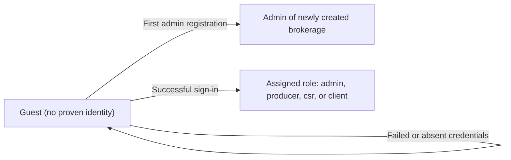

Because the client-facing portal arrives after the staff-facing system, the same conversion applies to client accounts from day one: a client-role account holder signs in through the same door and becomes the least-privileged authenticated role, even before any portal screens exist for that role.

## admin Actor

The admin is the highest-authority actor inside a single brokerage, identified by a user account carrying the admin role within exactly one organization. Admins run the brokerage itself: they manage the organization profile, invite and create users, change roles, and deactivate accounts. They are also custodians of the commercial backbone — the carrier roster, product catalogue, document templates, commission schedules, organizational reports, and audit logs. Alongside CSRs, admins maintain producer licence records, so expired or soon-expiring provincial licences surface to them as compliance signals. Carrier appointment standing falls under the same compliance watch, since an approaching appointment expiry feeds alerts. The admin's authority is absolute inside their brokerage but stops hard at its edge; no admin reaches another organization's records regardless of seniority. Sensitive operations are additionally guarded by explicit role checks, so merely holding a valid session never confers management powers on non-admins. The first admin comes into existence through initial registration, and further admins are designated only by an existing admin's decision. Changes made by admins to critical entities land in the append-only audit trail, keeping their stewardship accountable.

### Highest-Authority Staff Actor

- The admin is the highest-authority staff role inside a single brokerage (one organization), identified by a user account whose assigned role is admin.
- Within its own organization, the admin outranks every other role: producers own their personal book of business, customer service representatives handle day-to-day servicing, and client accounts see only their own affairs — the admin stands above all of these with whole-of-brokerage authority.
- The admin mandate covers governing the brokerage itself rather than selling or servicing: the organization profile, users and their roles, the carrier roster, the product catalogue, document templates, commission schedules, organizational reporting, and audit logs.
- An account carries exactly one role; there is no combined admin-plus-producer or admin-plus-customer-service designation on a single account.
- The admin's authority is absolute inside its brokerage but stops hard at that brokerage's edge (see Single-Brokerage Administration Boundary).

### Single-Brokerage Administration Boundary

- Every business record belongs to exactly one organization, and an admin's authority terminates at the edge of its own organization.
- An admin can never read, search, manage, or report on another organization's records, no matter how senior the admin is inside its own brokerage.
- All queries and actions performed by an admin are automatically confined to the admin's own organization; cross-organization access is treated as unauthorized and fails outright.
- Because seniority grants no reach across tenants, tenant isolation applies to admins exactly as it does to every other role.
- A person serving two brokerages holds two separate accounts, one in each organization; no single account ever spans organizations.

### Organization Profile Management Right

- Only admins hold the right to manage the organization profile: legal name, operating name, primary province, mailing address, phone number, HST/GST registration number, the fixed default currency (Canadian dollars), and organization-wide settings such as the configurable broker-fee tax rate table.
- Other members of the organization may rely on this profile data — it feeds documents and correspondence — but they can only view it, never change it.
- Keeping the profile accurate is an administrative responsibility, because incorrect profile data propagates into generated documents and tax calculations for the entire brokerage.

### User Invitation and Creation Authority

- Only admins bring new people into the organization, either by direct creation or by invitation; producers and customer service representatives work alongside existing teammates but can never mint new accounts.
- When creating or inviting a user, the admin fixes the newcomer's email address, display name, and starting role (admin, producer, customer service representative, or client).
- Newly created or invited users complete their own credential setup themselves, following the account lifecycle described in Account Management.
- Every user belongs to exactly one organization, so a user account created by an admin exists solely within that admin's brokerage.

### Role Changes and Deactivation Power

- Only admins change a user's role among the four roles: admin, producer, customer service representative, and client.
- Only admins deactivate or reactivate user accounts; no other role holds any account-lifecycle power over colleagues.
- Deactivating an account cuts off future sign-in while preserving the person's historical work intact, so reporting and audit trails remain complete.
- As a safeguard, a role change that would leave an organization without any active admin is refused.
- Self-service actions on one's own account (password change, account closure) follow the account lifecycle in Account Management and are distinct from this administrative power over other members' accounts.

### Carrier Roster Stewardship

- Only admins maintain the carrier roster: adding carriers, and editing each carrier's name, code, optional financial strength note, website address, service contact email and phone, and notes, plus switching a carrier between active and inactive.
- Marking a carrier inactive removes it from future selection everywhere in the brokerage while leaving historical references untouched: past quote lines, submissions, policies, and commissions continue to show which carrier they involved.
- Producers and customer service representatives choose among listed carriers when quoting and writing business, but they never alter the roster itself.

### Product Catalogue Governance

- Only admins govern the product catalogue: creating products under a carrier and maintaining each product's name, code, line of business, description, and active flag.
- Governance extends to each product's supporting definitions — its coverage item catalogue, its eligibility rules checked when attaching the product to a quote, and its rating inputs used when pricing.
- Producers and customer service representatives attach existing products to quotes and policies, but reshaping a product or its rules remains exclusively administrative.
- Commission economics attached to a product are governed separately under Commission Schedule Control.

### Document Template Ownership

- Document templates belong to the organization, and only admins create, revise, or retire them.
- Template definition covers the template kind (quote proposal, policy schedule, certificate of insurance or certificate, invoice, or custom), the template name, the body text containing placeholder variables, and the language locale (English or French).
- Everyday rendering and filing of documents is servicing work performed by others; template authorship and maintenance stay exclusively administrative.
- Retiring or revising a template affects documents generated afterwards; documents already generated keep the content they were produced with.

### Commission Schedule Control

- Only admins control commission economics: for each product, the default agency rate percentage, the default producer split percentage, and an optional tier table for volume-based variations.
- These schedules seed estimated commissions on quote lines and policy lines across the brokerage.
- Schedule changes take effect for commissions estimated afterwards; commission amounts already recorded stand as originally calculated.
- Producers observe the resulting figures through their self-only commission visibility but never configure or alter the schedules behind them.

### Organizational Reporting Oversight

- Only admins receive organization-wide reporting: dashboards and reports whose aggregates span every producer and every function of the brokerage.
- The organization-wide dashboard includes counts of active clients, open quotes, and active policies; expiring-policy outlooks across 30-, 60-, and 90-day horizons; the quotes pipeline broken down by status; revenue measures such as month-to-date and year-to-date bound premium and commissions due; and the compliance panels covering expired or expiring producer licences and carrier appointments.
- Producers see comparable dashboards restricted to their own book of business; the whole-of-brokerage lens belongs to administration alone.
- Commission statement administration rests with admins: listing and filtering statements by producer and by period, and marking statements as paid.

### Audit Log Review Rights

- The audit trail is readable only by admins, who may narrow their review by affected entity type, acting user, and date range.
- Review is strictly read-only: no role, admins included, can edit or remove audit entries, because the log is append-only by design.
- Audit review lets an admin answer compliance questions such as who changed a given critical record and when.

### Producer Licence Maintenance Duty

- Admins share with customer service representatives the duty of maintaining producer licence records: province, licence type (for example RIBO), licence number, issue date, expiry date, and status.
- Producers do not curate their own licence records; keeping licensing current is an administrative and service responsibility.
- The system surfaces expired and soon-expiring licences to admins, so supervision gaps appear as compliance signals before they become regulatory problems.

### Carrier Appointment Expiry Awareness

- Admins keep watch over the organization's appointments with carriers, each appointment carrying a status and an expiry date.
- Appointments approaching or past their expiry feed alerts and the compliance portion of reporting, giving early warning before placement authority lapses.
- Recording and updating appointment standing is administrative custody; other roles benefit indirectly whenever placements remain compliant.

### Role-Guarded Sensitive Operations

- A valid session proves identity, not authority: before executing sensitive operations — user management, organization settings, template authorship, and commission schedule changes — the system separately verifies that the acting user holds the admin role.
- An attempt at a sensitive operation by a user without the admin role fails, even though that user's session itself is perfectly genuine.
- This second check is what stops a stolen or merely ordinary staff session from exercising management power.

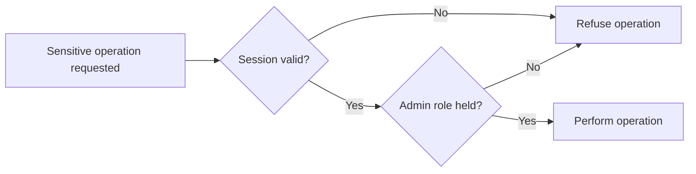

### First Admin from Initial Signup

- An organization's first admin comes into existence at initial signup: registering the brokerage and becoming its founding administrator occur in a single step, and the registration flow itself is specified under the guest actor together with the registration-and-login unit.
- After the bootstrap, additional admins come into being only by designation from an existing admin through a role change; nothing else creates an admin account.
- The founding admin therefore begins with the complete mandate described in this file, including the safeguard against removing the last remaining administrator.

### Accountability Through Audit Trail

- Whenever an admin creates, updates, or deletes a critical entity — clients, quotes, policies, endorsements, invoices, commissions, users, or products — the change is written to the append-only audit trail attributed to that admin.
- Admin rank purchases no exemption: admin entries are captured exactly like everyone else's and cannot be withheld or erased.
- Access to client personal information during administrative work is likewise audited where practical, reflecting privacy-aware expectations for Canadian brokerages.
- Because every critical change is attributable, any record can later answer which user acted and what changed, keeping administrative stewardship accountable.

## producer Actor

The producer is the sales-facing actor identified by a user account carrying the producer role within one brokerage. Producers own a book of business: the clients assigned to them and the quotes, carrier submissions, policies, and renewals that grow out of those relationships. Their commission visibility is deliberately narrow — a producer may see commission figures for their own work only, never colleagues' amounts or agency totals. Producers do not administer the platform: managing users, changing roles, adjusting organization settings, and governing the carrier or product catalogue are all outside their reach. Like every staff-side actor, a producer operates strictly within their own organization's scope, with other brokerages entirely unreachable. Because selling insurance is regulated, a producer's standing depends on the provincial licence records held about them, and expired or soon-expiring licences raise flags the system surfaces. Inside their book, the producer is the accountable owner of each client relationship and of the pipeline running from first quote through bound policy to renewal. Work outside that ownership circle, such as another producer's clients, falls outside the producer's access boundary. Producer activity on critical records appears in the audit trail just like every other actor's.

### Producer Role Identity

The producer is the sales-facing staff actor of a brokerage: a person identified by a user account carrying the producer role within exactly one organization. Such an account comes into being only when an administrator invites or creates the user and grants the role; a producer can neither elevate their own role nor assign roles to anyone else. The producer signs in with their personal email credential through the standard staff authentication flow (see Registration and Login), and their session follows the common session rules (see Session and Logout).

While the account remains activated, every capability described in this unit applies; once an administrator deactivates the account, those capabilities cease immediately.

Among the platform's four roles, the producer is distinguished from the CSR by ownership rather than servicing breadth: where the CSR reaches across the agency to service records, the producer is the accountable owner of a specific circle of relationships — the book of business described next.

### Book of Business Ownership

A producer's book of business is the complete collection of commercial records for which the producer is accountable: every client assigned to them together with the quotes, carrier submissions, policies, renewals, and personal commission figures that arise from those relationships.

Each client in the book names the producer as its assigned producer, and every record created downstream of such a client inherits the same ownership line: a quote grown from an assigned client belongs to that producer from creation, the policy bound from that quote stays in the same book, and the renewals of that policy remain there as well.

Ownership implies accountability. The producer originates, maintains, and advances the records of their book, and their name stands behind each relationship in it. Membership in the book changes only when an administrator assigns or reassigns clients; producers cannot move clients between books themselves.

### Assigned Client Portfolio

The assigned client portfolio is the client layer of the book: the individuals and businesses the organization has placed under the producer's care, whether prospects, active relationships, inactive accounts, or lost opportunities. Within this portfolio the producer may view, search, and maintain client information, record interactions and follow-up tasks, and attach documents connected to serving those clients.

The portfolio's contents are determined solely by assignment. A newly assigned client enters the producer's reachable world in full; an unassigned or reassigned client leaves it equally fully. Clients belonging to other producers lie outside the portfolio, as bounded under Own-Book Access Boundary.

### Quote-through-Renewal Pipeline Ownership

The producer owns the commercial pipeline of their assigned clients end to end: drafting quotes, assembling comparative lines against carrier products, recording submissions to carriers, binding an accepted quote into a policy, and shepherding that policy toward its next renewal. Every stage remains attached to the owning producer; a record born from a previous one inherits the same book membership automatically.

Amendments made to an in-force policy, such as endorsements processed by CSRs, do not move the policy out of the producing producer's book; the underlying record remains theirs throughout, and they retain sight of its standing.

The diagram shows the span of ownership rather than the inner workings of each stage: at no point does a record leave the producing producer's book.

### Carrier Submission Tracking for Own Quotes

On each comparative quote they own, a producer may open and track one submission per carrier being courted, following each submission through its working life — pending, sent, acknowledged, quoted, or declined — while capturing the carrier's reference number and correspondence notes along the way.

When a tracked submission changes status, the system notifies the owning producer, keeping them current without manual checking. Submissions exist only on the producer's own quotes; submissions attached to another producer's quotes are neither visible nor trackable from a producer account, consistent with the access boundary described below.

### Self-Only Commission Visibility

A producer's window onto commissions shows exclusively their own figures: the premium basis behind each commission, their own split rate and the amount it yields, and the estimated, due, paid, or clawback positions carried under their name across statement periods. Commission statements available to the producer are therefore filtered to themselves and the periods they select.

Two walls bound this visibility. First, colleagues' commission figures never appear to a producer — neither per record nor in aggregate. Second, organization-wide totals and commission reporting remain administrative ground (see the admin Actor). Beyond viewing their own figures, the role confers no commission-management authority: marking payments received, adjusting rates or splits, and altering commission records lie outside the producer's reach.

### Provincial Licence Standing and Expired Licence Compliance Flags

Because selling insurance is provincially regulated, the system maintains provincial licence records for each producer: the province, the licence type (for example RIBO), the licence number, the issue date, the expiry date, and the current standing of the licence. Administrators and CSRs administer these records; the producer consults their own licence standing rather than editing it.

The system actively surfaces licence health instead of letting lapses pass silently. An expired licence raises a compliance flag, and a licence nearing expiry is flagged before it lapses; both conditions feed notifications to the producer concerned and contribute to the compliance picture administrators monitor on the dashboard. Flagging is informational and imposes no further consequences within these requirements — selling authority in the real world is a matter of regulation, not of this system's records.

### No User or Settings Administration

The producer holds no administrative authority whatsoever. They cannot invite or create users, cannot change any user's role including their own, cannot deactivate accounts, and cannot alter the organization's profile or its operating settings; those powers rest solely with the administrator (see the admin Actor).

These prohibitions hold unconditionally. Record ownership confers no exemption — owning a client does not authorize administering anything — and any attempt to exercise an administrative capability from a producer account is refused.

### Catalogue Consumer Without Governance Rights

In the carrier and product catalogue, the producer is a consumer, never a governor. They may browse the organization's appointed carriers, read product descriptions and lines of business, examine coverage item catalogs, draw on document templates when generating proposals and schedules, and take account of commission parameters while assembling quotes — but they may not add, edit, activate, or retire any carrier, product, coverage item, document template, or commission schedule. Carrier appointment records and their compliance standing likewise sit beyond the producer's reach.

This division keeps the commercial catalogue stable under administrative control while leaving producers free to sell from whatever the catalogue offers.

### Single-Organization Operating Scope

Every record a producer touches belongs to their one brokerage. The producer's entire working world — clients, quotes, policies, tasks, documents, commissions, catalogue — is drawn from their own organization, and the records of any other brokerage are wholly absent from their view regardless of how they are sought. There is no cross-brokerage lookup, browsing, or comparison available to a producer account.

This mirrors the tenant scoping applied to every actor in the platform; it is restated here because it forms the outermost edge of the producer's reach.

### Own-Book Access Boundary

Inside their own organization, the producer's reach narrows again to the book. Their assigned clients and the quotes, submissions, policies, renewals, and commissions descended from them are fully accessible; another producer's book — clients, pipelines, and commission figures alike — lies outside the boundary. Shared catalogues such as carriers and products form the only common ground beyond the book itself.

The boundary moves in exactly one way: when an administrator assigns or reassigns clients, the corresponding slice of the organization enters or exits the producer's reach. Nothing else widens it.

### Renewal Accountability for Owned Policies

For every policy standing in their book, the producer carries accountability for the renewal outcome: watching for approaching term ends, ensuring a renewal offer is prepared and presented in time, and driving the client's accept-or-decline decision to a recorded conclusion.

The system detects renewal candidates among policies whose term end approaches and surfaces them to the owning producer, so accountability begins from a prompt rather than memory. When a client accepts a renewal offer, the generated next-term policy lands back in the same producer's book, preserving continuity of ownership; when the outcome is a non-renewal or a loss to another placement, that result is likewise recorded against the same book.

### Audit-Visible Record Activity

Every consequential action a producer takes on critical business records — creating, updating, or removing clients, quotes, policies, endorsements, invoices, or commissions within their book — is written to the organization's append-only audit trail with the producer recorded as the acting user, alongside a summary of what changed and when it occurred.

Audit entries are immutable for everyone, producers included: no actor can amend or erase the trail of anyone's activity. Reading the audit trail is an administrative privilege reserved to the administrator; the producer's relationship to the log is to appear in it faithfully, not to inspect it.

## csr Actor

The csr is the service-side actor identified by a user account carrying the csr role in one brokerage. CSRs keep the agency running day to day: servicing clients, processing endorsements, handling documents, and coordinating tasks across the brokerage's client base rather than a personally owned book. Where the producer is defined by owning relationships, the csr is defined by operational service work wherever the brokerage needs it. The role's sharpest boundary is administrative: a csr may never manage users or modify organization settings, regardless of tenure or circumstance. On compliance duties, CSRs join admins in maintaining producer licence records, helping the brokerage respond when a producer's licence lapses or expires. Endorsement handling, document upkeep, and task coordination form the heart of the csr mandate, always exercised inside the same organization as every other staff actor. Capabilities reserved for higher roles stay withheld behind role-based authorization even when the csr holds a perfectly valid session. Because service work means constant contact with client information, csr actions on critical entities are likewise captured in the audit trail.

### Service-Side Actor Identity

The csr is a staff actor of exactly one brokerage, identified by a user account carrying the csr role. The account is created and governed by the brokerage's administrator through normal staff account administration (see admin Actor), and the actor signs in through the standard staff authentication flow (see Registration and Login).

Key identity properties:

- The csr belongs to one and only one organization; there is no multi-brokerage staff membership.
- The account must be active for any csr capability to be available; once deactivated by an administrator, every csr capability ceases.
- The role is defined by operational service work — servicing clients, processing endorsements, handling documents, and coordinating tasks across the brokerage's client base — rather than by ownership of a personally held book of business, which distinguishes the csr from the producer.
- The csr carries trusted internal standing inside the brokerage: distinct from the external client portal actor (client Actor) and from the unauthenticated visitor (guest Actor).

### Client Servicing Operations

Client servicing is the daily substance of the csr role. A csr may service any client belonging to the brokerage, regardless of which producer holds the client relationship.

Servicing capabilities:

- View the full profile of any client in the brokerage, including contact details, addresses, activities, tasks, and related documents.
- Update routine service-facing client information such as phone numbers, mailing address details, preferred name, and correspondence language.
- Record client activities — calls, emails, meetings, and notes — on behalf of the brokerage, attributed to the csr who logged them.
- Maintain contact persons attached to business clients while servicing those relationships.
- Raise tasks out of client needs and route them to the appropriate colleague (see Task Coordination Across Agency).

While servicing, the csr may follow a client's quotes and policies as context — for example to answer a coverage question — but the csr does not take ownership of the quoting or renewal pipeline, which remains with producers as defined in the producer Actor. Commission visibility is likewise outside the role; commission reporting belongs to admins and self-viewing producers.

### Agency-Wide Service Reach

The csr's access footprint is agency-wide, defined by supporting the brokerage's entire client base rather than a personally assigned portfolio. Where a producer's reach follows an assigned book of business, the csr's reach follows the brokerage's needs: any client, policy, endorsement, document, or task inside the organization falls within the csr's servicing purview.

Boundary conditions of this reach:

- Breadth of reach does not confer ownership. Supporting every client does not make the csr the responsible producer for any of them, and servicing work never transfers a client relationship away from its assigned producer.
- The reach extends only inside the csr's own brokerage (see Tenant-Scoped Staff Access).
- The reach is bounded by the administrative exclusions below: supporting the whole client base never expands into administering the organization itself.

In practice this means a csr can pick up any service need — a certificate required today, an address change phoned in this afternoon, a follow-up owed on someone else's client — without waiting for a reassignment, which is precisely what keeps a brokerage responsive.

### Endorsement Processing Responsibility

Endorsement processing sits at the heart of the csr mandate. An endorsement amends a policy already in force — adjusting coverage, premium, or fees mid-term — and the brokerage relies on CSRs to carry these amendments through.

Responsibilities:

- Prepare endorsements on policies within the brokerage, specifying endorsement type, effective date, description, premium change, and fee change.
- Work on endorsements regardless of which producer wrote the underlying policy; the agency-wide service reach applies fully here.
- Move an endorsement from draft to issued when amendment details are complete, making the change part of the policy record.
- Because endorsements change critical policy records, every endorsement action taken by a csr is captured in the audit trail (see Audit-Visible Service Actions).

The csr processes endorsements; deciding broader commercial outcomes for a policy — whether to renew, cancel, or rewrite — remains with the producer and administrator roles.

### Document Handling Duties

Document upkeep is a standing csr duty. Paperwork flowing between the brokerage, its clients, and its carriers passes through csr hands.

Duties:

- Upload documents against the correct owning record — a client, quote, policy, or invoice — so each piece of paper lives where the brokerage expects to find it.
- Classify each uploaded document by kind and filename, recording its basic characteristics such as file type and size so colleagues can identify it later.
- Produce customer-facing paperwork by rendering approved organization templates — proposals, schedules, certificates — whenever servicing requires issued documents.
- Attach rendered or generated documents to the relevant client, quote, or policy record as part of the same service action.

Documents uploaded by a csr are attributed to that csr, and document storage and retention behaviour is governed by the policies described in the non-functional file rather than by this role definition.

### Task Coordination Across Agency

Tasks are how a brokerage remembers its promises, and the csr acts as the coordinator of that memory across the agency.

Coordination responsibilities:

- Create tasks on behalf of any colleague, assigning them to administrators, producers, or fellow CSRs as the work demands.
- Track task life across the agency — open, done, or cancelled — not merely the csr's own queue.
- Optionally link tasks to the client or policy they concern so context travels with the work item.
- Convert incoming client service requests — including requests submitted through the client portal (see client Actor) — into tracked tasks routed to the right staff member.
- Keep due dates accurate as circumstances change so time-sensitive obligations surface correctly to assignees as task-due notifications.

Task coordination gives the csr a legitimate window onto work owned by others; it does not give the csr authority to reassign a producer's book or alter administrative priorities set by the administrator.

### Shared Producer Licence Maintenance

Producer licensing is a compliance obligation of the brokerage, and the csr shares responsibility for it alongside the administrator — the original requirements allow licences to be managed by ADMIN/CSR alike.

Scope of the shared duty:

- Create and update provincial licence records for producers — province, licence type such as RIBO, licence number, issue date, expiry date, and status.
- Keep licence records current so the brokerage's expired-and-expiring licence warnings reflect reality; stale records hide compliance risk.
- Treat this as the explicit exception to the csr's otherwise absent user-management rights: the csr maintains licence records attached to producer accounts without gaining any power over the accounts themselves.

This division lets day-to-day licence housekeeping happen at the service desk where expiry notices usually arrive, while appointment, hiring, and deactivation decisions about producers remain exclusively with the administrator (see admin Actor).

### No User Management Rights

The sharpest boundary of the csr role is that it carries no user-management rights whatsoever.

Withheld powers:

- The csr cannot invite or create new users for the organization.
- The csr cannot change any user's role — not even another CSR's.
- The csr cannot deactivate or reactivate user accounts, including accounts of other CSRs.
- The csr cannot alter a producer's identity attributes; the only permitted touchpoint on another user's record is licence maintenance as defined in Shared Producer Licence Maintenance.

These powers are reserved exclusively to the admin role as defined in the admin Actor. A csr who identifies a needed staffing change — a new hire, a departing employee, a role correction — must route the request to an administrator rather than acting directly.

### Organization Settings Off-Limits

Organization administration lies wholly outside the csr role. The brokerage's institutional configuration belongs to the administrator alone.

Off-limits areas:

- The organization profile itself — legal name, operating name, primary province, address, phone, tax registration details, default currency, and organization settings.
- Carrier relationships and appointment tracking, including appointment status and expiry administration.
- The product catalog — products, lines of business, eligibility rules, rating configurations, and coverage item definitions.
- Commission schedules and their default rates and tiers.
- Document template authoring, including template bodies and locales.

The csr consumes all of these as read-only reference material while servicing — checking a product's eligibility before preparing an endorsement, or selecting the right template for a certificate — but cannot create, change, or retire any of them. Requests for catalog or configuration changes go to an administrator.

### Role-Blocked Administrative Actions

Every administrative exclusion above is enforced by role-based authorization, not by convention or interface convenience.

Enforcement behaviour:

- When a csr submits any request exercising a capability reserved for a higher role, the request is refused, whatever the state of the csr's session.
- Refusal applies even with a perfectly valid, active session; a legitimate credential never substitutes for a missing privilege.
- There is no temporary elevation: tenure, seniority, workload, or circumstance never widen the csr's grant, and only an administrator acting in the admin role can exercise the withheld powers.
- Beyond user and organization administration, elevated domains such as organization-wide reporting and commission statement review remain equally blocked for the csr.

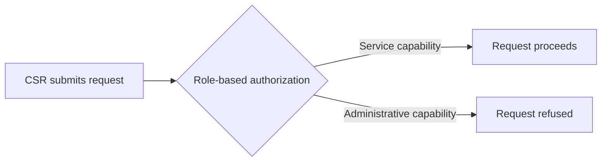

This guarantee is what allows a brokerage to grant CSRs broad agency-wide service reach confidently: the reach is wide horizontally, but vertically it stops cleanly below administrative authority.

### Tenant-Scoped Staff Access

Like every staff actor, the csr operates strictly inside a single tenancy: the brokerage that issued the account.

Access boundary:

- Every query the csr makes is confined to the csr's own organization; results never mix in records from another brokerage.
- Clients, policies, quotes, documents, tasks, and invoices belonging to other brokerages are invisible to a csr — even when identifiers for those records are guessed or encountered.
- An account exists within exactly one organization and inherits exactly that organization's data envelope.

This boundary exists because independent brokerages are mutual strangers with competing books of business. The technical guarantees behind the isolation are described in the non-functional file; for the actor definition the rule is simply: one csr, one brokerage, nothing seen beyond it.

### Audit-Visible Service Actions

Because service work means constant contact with sensitive client information, csr activity on critical records is deliberately visible to the brokerage.

Audit expectations:

- Every creation, update, or deletion a csr performs on critical entities — clients, quotes, policies, endorsements, invoices, documents among them — is written to the organization's append-only audit trail, recording who acted, on which record, with what change summary, and when.
- Where practical, a csr's access to client personal information is also captured in the audit trail, reflecting the brokerage's privacy-care obligations.
- Audit entries attributable to a csr carry the csr's identity, so a reviewer can distinguish service-desk activity from producer or administrator activity on the same record.
- The csr cannot edit, retract, or purge audit entries; the trail is append-only for every actor, including the one it observes.

How long audit records are kept, and who may review them, is defined in the non-functional file and the admin Actor respectively; the csr-side obligation is simply that honest service work leaves an honest record.

## client Actor

The client is the external customer-facing actor representing an insured individual or business, included in the permission matrix even though the self-service portal arrives later. Identity for this actor rests on authentication credentials tied to the person's client presence within one brokerage, under a dedicated client role kept separate from every staff role. The intended boundary is strictly personal: a client may read their own policies and documents and submit service requests back to their brokerage, and nothing beyond that. A client can never view another client's records, another brokerage's data, or internal apparatus such as the carrier catalogue, product setup, commission schedules, or reports. Internal financial mechanics — producer commissions and agency economics — are invisible to this actor by design. Service requests raised by clients become items for brokerage staff to action, granting no direct operational power over quotes, policies, or billing. Because the portal interface is deferred, the immediate obligation is the underlying authentication scaffolding and role wiring so client access can be switched on safely later. Within the matrix the client stands as the least-privileged authenticated actor, deliberately separated from both guests and staff.

### Client as Self-Service Portal Actor

The client actor is the external customer of a brokerage — an insured individual or a business — whose coverage is placed and serviced by brokerage staff. Unlike every staff actor, the client performs no job inside the brokerage: the role exists so that the person the business is about can eventually look after their own affairs through a self-service portal.

Identity for this actor is anchored externally. A client account is always tied to exactly one client record inside exactly one brokerage organization; it never floats free and never spans brokerages. Because the actor represents the insured party rather than an operator, every entitlement the role carries derives from being the subject of records — "this is my policy", "these are my documents" — rather than from any duty performed for the organization.

In the permission matrix the client sits outside the staff hierarchy (admin, producer, csr) as the sole customer-facing actor. The portal surface itself is deferred; what is defined here is the actor's permanent outer boundary: strictly personal reach into their own insurance matters and nothing more.

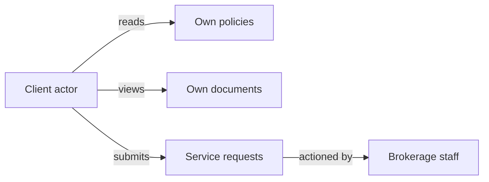

### Dedicated Client Role Separation

The client role is a dedicated role value kept wholly separate from the staff roles. An account carries either the client role or one staff role — admin, producer, or csr — never a combination. There is no hybrid account that is simultaneously staff and customer: a brokerage employee who is personally insured would hold two distinct accounts.

Among authenticated actors the client is deliberately the least privileged. The entire grant set consists of two read scopes — own policies and own documents — plus one submission capability, service requests. Nothing else is granted by default, by seniority, or by tenure: length of time as a customer confers no additional authority.

Role assignment is not under the client's control. A client account cannot change its own role, restore itself to active standing, or alter its attachment to its brokerage; those powers rest with the admin actor. Every client-scoped access decision is made on the server against this role before any data leaves the system, so the boundary holds regardless of what interface eventually calls it.

### Own-Policy Read Access

A client may read the policies in which they are the insured client: the policy number presented to customers, term start and term end, policy status, province of risk, payment plan, billed premium, broker fee, and taxes, together with the coverage schedule lines listing limits, deductibles, and premiums.

The access is read-only in the fullest sense. A client cannot create, amend, cancel, reinstate, or renew a policy — not even their own — and cannot modify the coverage schedule. Endorsements, cancellations, and renewals on their policies are staff work; the client's route to influencing them is a service request (see Service Request Submission).

Reach is limited to the policies bound to the client's own record. Policies belonging to any other client are invisible and unaddressable, whatever their status.

### Own-Document Viewing

A client may view and retrieve documents owned by their own client profile or attached to their own policies — for example schedules or certificates produced for them.

Document management remains entirely with staff. The client cannot upload files, add versions, replace content, or delete anything from the document store; the role's capability stops at viewing.

Discovery is bounded the same way as policies: only documents whose owner is the client themselves or one of their own policies can ever be listed or opened. Documents belonging to other clients, or to internal objects not tied to this client, never appear in any listing available to the role.

### Service Request Submission

A client may submit service requests — plain descriptions of what they need from the brokerage, such as a change to their coverage or a question about their documents. Each request is recorded against the submitting client's own record and nowhere else.

A request is a hand-off, not an action. Submitting one gives the client no immediate operational effect on quotes, policies, endorsements, cancellations, renewals, or billing. The request enters the brokerage's service queues, where staff actors — csr and producer under their own authorities, admin when needed — evaluate it and perform whatever work is genuinely required. Any resulting change to a policy or document is made by an authorized staff member, never by the requesting client; the client's submission grants them no power over the outcome beyond having raised it.

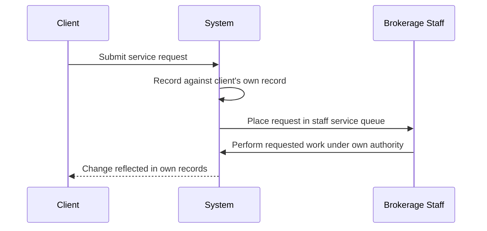

### No Cross-Client or Cross-Brokerage Visibility

The client's view ends at their own record. Within their own brokerage, a client cannot search, list, or open another client's profile, policies, documents, contacts, activities, or service traffic; another client's existence is simply not part of the role's world.

The same wall extends outward between brokerages: organization scoping applies identically to client accounts, so records held by any other brokerage are unreachable. Attempting to address a resource outside the client's own ownership — another client's policy, another organization's data — is rejected as unauthorized, not merely hidden from default views.

### No Internal Catalogue and Commission Exposure

The internal apparatus of the brokerage is invisible to the client role. The carrier catalogue, product setup with its rating and eligibility configurations, document templates, and carrier appointment standing — none of it is listed, searchable, or retrievable through a client account.

Commission data is equally sealed. Agency rates, producer splits, estimated or paid commission amounts, and commission statements are never returned to client accounts — including for coverage lines on the client's own policies. Seeing the premium and broker fee shown on an own policy is the limit of the role's financial visibility; the economics behind it stay internal.

Organization-level reporting such as dashboards and pipeline summaries, the staff directory, and audit logs complete the exclusions: none of these appear to a client account under any circumstance.

### Authentication Scaffolding and Deferred Portal Enablement

Although the customer-facing portal is deferred, the underlying wiring is not. From the first release the authentication layer recognizes the client role: the role participates in the same token-based login and session machinery as every other actor (registration, login, session, and account lifecycle mechanics are specified in their own sections and are not repeated here), and every protected operation knows how to evaluate a client-role credential against the boundaries above.

A client account is provisioned by the brokerage against an existing client record — public self-registration is reserved for establishing a new organization under the guest actor and therefore never creates client accounts. Credentials thus inherit the tight coupling between the person and their single client profile in a single brokerage.

Deferral applies to the interface, not the boundary. Version one ships no customer-facing screens; enabling the portal later means surfacing interfaces on top of server-side rules that are already complete, turning the launch into a presentation decision rather than a security retrofit. Until that switch, a client account carries exactly the narrow grants defined here — no dormant extra powers waiting behind the missing interface.

# Authentication Flows

Registration, login, logout, and session management from a user perspective.

## Registration and Login

Define user registration and login flows including validation and error handling.

### First Administrator Registration and Organization Creation

A person with no existing account can register as the first administrator of a brand-new brokerage. During registration the person provides:

- Their own account details: email address, password, and display name.
- The brokerage identity: legal name, operating name, primary province, address, phone number, and tax registration number.

On successful registration, the system creates the new organization and makes the registering person its first administrator with full administrative rights. Self-service registration is available only for this first-administrator scenario; every later staff or client account comes into existence through administrator invitation (see Invited User Activation below).

Outcomes and error conditions:

- If any required detail is missing or malformed (for example, an invalid email address or an unsupported primary province), the system rejects the registration and explains what must be corrected.
- If the chosen email address already belongs to an existing user, the system rejects the registration and directs the person to sign in or recover the existing account instead.
- If the chosen password does not meet the basic password quality standard, the system rejects it and states the requirement.

When registration succeeds, the system sends an email verification message containing a one-time verification token. In development environments the outgoing email may simply be logged rather than delivered.

The unauthenticated visitor performing this action is the guest actor defined earlier in this document; this section describes the registration flow itself, not the guest boundary.

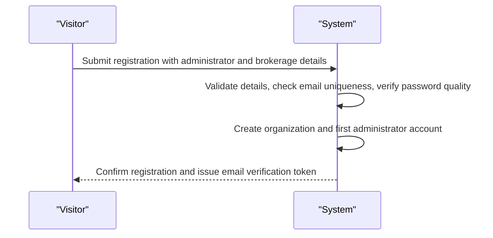

### Invited User Activation

After an organization exists, only administrators may bring new people onto the platform. An administrator invites a staff member (producer or CSR) or provisions a client portal user; the invited person then completes their own credentials before their first login:

- The invited person follows a one-time, token-based setup path to confirm their identity and choose an initial password.
- Once the initial password is set, the account behaves like any other credentialed account for sign-in purposes.
- If the setup token has expired or was already used, the system rejects the attempt and the administrator must issue a fresh invitation.
- Client portal accounts use the same email-plus-password model even though the client-facing portal experience arrives later; the authentication scaffolding supports client accounts from day one.

The authority to invite, create, deactivate, and change roles belongs exclusively to the administrator and is defined in the admin Actor section; this section covers only how the invited person establishes working credentials.

### Login

Any registered person — administrator, producer, CSR, or client — signs in by submitting their email address and password.

On a successful sign-in the system returns two credentials: a short-lived access token used to reach the system, and a longer-lived refresh token used to stay signed in. Long-lived session behaviour, refresh, and signing out are covered in the Session and Logout section; this section covers only the act of logging in.

Rejection cases:

- If the email address and password do not match an existing account, the system rejects the attempt with a single generic failure message that does not reveal whether the email or the password was wrong.
- If the account has been deactivated by an administrator, the system refuses the sign-in regardless of correct credentials.
- If the account's email address has not yet been verified, the system refuses the sign-in and offers to resend the verification message.
- If a required value is missing from the submission, the system rejects it and identifies the missing value.

Every subsequent request the signed-in person makes carries the access token, which is how the system knows who is acting and which brokerage they belong to.

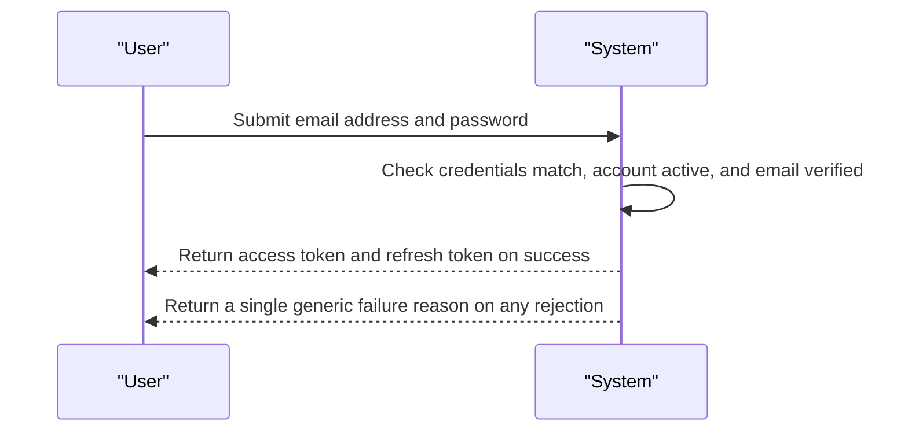

### Token-Based Authentication for Signed-In Access

Authentication is token-based. After a successful login, the holder of a valid access token can reach everything their role permits; without one, nothing beyond the public authentication flows (registration, login, token refresh, email verification, and password recovery) is reachable.

Rules that govern authenticated access:

- THE SYSTEM SHALL require a valid access token on every route except the public authentication flows listed above.
- WHEN a request arrives with no access token, an expired access token, or a token belonging to a deactivated account, THE SYSTEM SHALL reject the request and instruct the caller to authenticate again.
- WHEN an access token expires but the refresh token is still valid, THE SYSTEM SHALL allow a new access token to be obtained without re-entering the password.
- THE SYSTEM SHALL treat the authenticated identity as the basis for tenant isolation: a person only ever sees and acts on records belonging to their own brokerage, never another brokerage's records.
- THE SYSTEM SHALL enforce role-based checks on sensitive operations after authentication succeeds; which roles may do what is defined in the permission matrix earlier in this document.

This section states what authentication establishes; the detailed session lifetime, refresh rotation, and logout behaviour are defined in the Session and Logout section.

### Email Verification and Password Recovery

Two token-assisted flows support login: confirming an email address and recovering a forgotten password. Both work even when the person cannot sign in, and both rely on emailed one-time tokens. In development environments the outgoing email may simply be logged rather than delivered.

Email verification:

- WHEN a person opens the verification link from their welcome or resend message, THE SYSTEM SHALL mark the email address as verified and allow normal sign-in.
- IF the verification token has expired or was already used, THEN THE SYSTEM SHALL reject it and offer a fresh verification message.
- WHERE an account's email is unverified, THE SYSTEM SHALL continue refusing sign-in for that account until verification completes.

Password recovery:

- A person who cannot sign in can request a password reset by supplying their email address alone.
- WHEN such a request arrives, THE SYSTEM SHALL send a one-time reset token to that address if it belongs to a known, active account.
- WHEN a valid reset token is presented together with a new password meeting the quality standard, THE SYSTEM SHALL replace the old password and end the old password's ability to sign in.
- IF the reset token has expired or was already used, THEN THE SYSTEM SHALL reject it and require a new request.
- To avoid revealing whether an email address exists, THE SYSTEM SHALL respond to a reset request for an unknown or deactivated address exactly as it does for a known one.

Password changes made while already signed in are an account-management concern and are described in the Account Management section, not here.

## Session and Logout

Define session behavior and logout from a user perspective.

### Session Establishment and Renewal

Completing sign-in opens a session for the signed-in user. Each session is represented by two credential pieces issued at login: an **access token** presented on every subsequent request, and a longer-lived **refresh token** held by the signed-in application to obtain replacement access tokens.

- Every protected capability requires a currently valid access token; requests arriving without one are treated exactly as unauthenticated visitor traffic (see the guest Actor).
- A session is permanently bound to the signed-in user's brokerage. All work performed during the session is confined to records owned by that brokerage, regardless of which identifiers the caller supplies.
- When the access token reaches the end of its validity period, the holder presents the still-valid refresh token and receives a new access token without re-entering email and password.
- Each renewal reflects the user's current role and activation status, so a role change or deactivation takes effect no later than the next renewal.
- If the refresh token has expired, has been invalidated (for example by logout), or belongs to a user who is no longer active, renewal is refused and the user must perform a full sign-in before any protected access resumes.

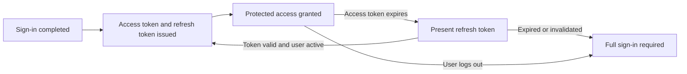

### Logout

Every authenticated actor — administrator, producer, CSR, and client portal user — can end their own active session at will through logout.

- Logging out immediately invalidates the refresh token of the session being closed, so it can never be exchanged for another access token.
- The outstanding access token is simply left to lapse within its short validity window; once it expires, nothing of the closed session remains usable.
- Logout ends only the session being closed. It does not deactivate the user account, alter the user's role, or affect other validly established sessions of the same user elsewhere.
- Any request made after logout using the closed session's credentials is treated as unauthenticated and receives no protected capability.
- Resuming work after logout always requires a complete sign-in with email and password; a logged-out session cannot be revived.

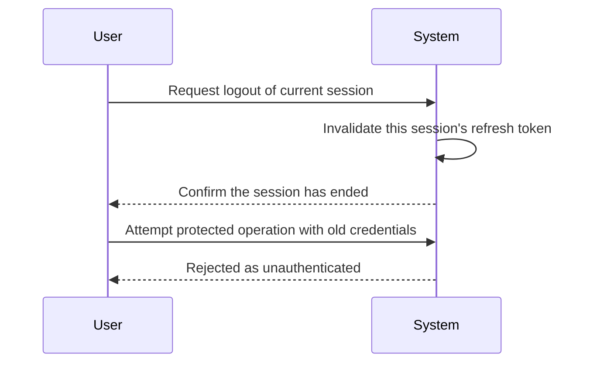

### Session Invalidation and Account Security

**Forced termination on deactivation**

- When an administrator deactivates a user (the administrative act itself is defined under the admin Actor), the deactivated user's refresh tokens stop renewing immediately and further sign-in attempts are refused until the account is reactivated.
- An outstanding access token of a deactivated user grants nothing beyond its short remaining validity; no lasting access survives deactivation.
- Reactivation restores ordinary session capability, but previously invalidated tokens remain unusable — the returning user signs in afresh.

**Safeguards applied throughout every session**

- Holding a valid session proves identity only; it never authorizes on its own. Each sensitive operation is additionally checked against the caller's assigned role under the permission matrix (see the actor definition sections).
- Every query executed during a session is scoped to the caller's own brokerage. Referencing another brokerage's record yields a rejection rather than disclosure, preserving tenant isolation.
- A session cannot elevate privilege: available capabilities are exactly those of the user's current role, and renewal never widens them beyond that role's permissions.
- Changes to critical entities made during a session are attributed to the acting user and written to the append-only audit log, including access to client personal information wherever practical.

# Account Lifecycle

Account creation, deletion, and password management.

## Account Management

Define how users create accounts, delete accounts, and change passwords.

### Staff Account Creation

Every brokerage staff account belongs to exactly one organization and is created inside that organization. The only exception is the very first administrator account, which is created through public sign-up and simultaneously establishes the organization itself; that flow is defined in the guest actor definition and is not repeated here.

Within an established organization, an administrator invites or creates additional user accounts. When creating an account, the administrator provides:

- An email address, which must be unique within the organization.
- A display name shown throughout the application.
- A role: admin, producer, csr — or client, for the portal scaffolding described below.

A newly invited account starts without a password. The system delivers an invitation containing a single-use, time-limited setup token, and the invitee completes setup by setting an initial password. Accepting the invitation confirms control of the email address and serves as the email verification step for the account. Until the initial password is set, the account exists but cannot sign in. In development environments, invitation delivery may be written to logs instead of actually emailing the invitee.

Client-role accounts carry the authentication scaffolding for the future client portal. A staff member may associate such an account with an existing client record, so that when the portal arrives the client can view their own policies and documents and submit service requests. No portal interface is required at this stage.

If the requested email address is already used by another user in the same organization, the creation request is rejected.
If the acting user is not an administrator, the creation request is rejected.

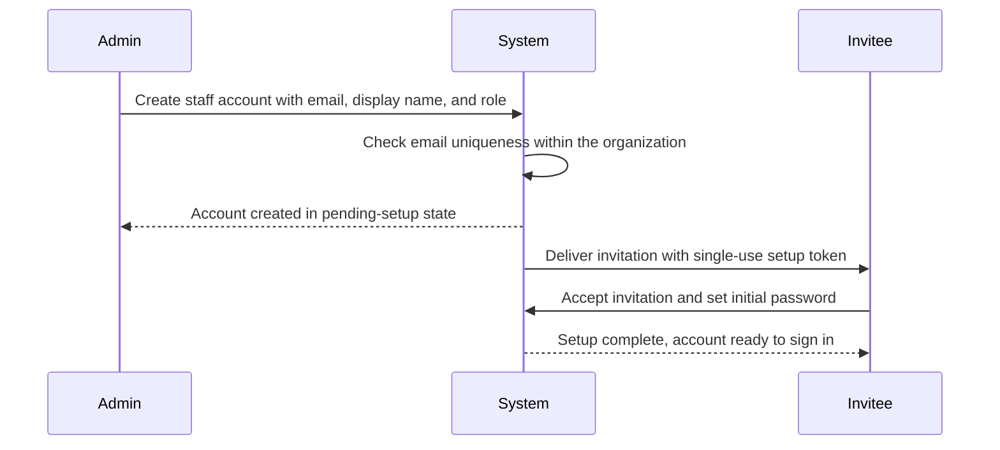

### Account Deletion and Deactivation

User accounts are never permanently deleted. Instead, an account is deactivated: every record ever attributed to that user — assigned clients, quotes, policies, tasks, documents, activities, commissions, and audit log entries — remains intact and attributable. This preserves the integrity of the book of business and of the append-only audit history.

Only administrators may deactivate or reactivate accounts, and only within their own organization.

While an account is deactivated:

- The account is barred from signing in.
- The account no longer appears as a choice when assigning clients, tasks, or other work.
- Historical records that reference the account continue to display the user's name for reporting and audit purposes.

Reactivating a deactivated account restores its previous role and access immediately, with no loss of history.

Two safeguards apply:

- An administrator cannot deactivate their own account.
- The last remaining active administrator account in an organization cannot be deactivated, so an organization always retains at least one administrator able to manage users.

Each deactivation and reactivation is captured in the append-only audit log together with the identity of the acting administrator.

### Password Change

Any signed-in user can change their own password. The change requires the current password plus the new password supplied twice for confirmation. If the current password does not match the account's stored credential, the change is rejected. The new password must differ from the current password. Every successful self-service password change is recorded in the append-only audit log against the affected user account.

A user who cannot sign in can request a password reset. The system issues a single-use, time-limited reset token and delivers it to the account's email address; in development environments the delivery may be written to logs rather than actually emailed. Presenting a valid, unused, unexpired token allows the user to set a new password without supplying the old one. Reset attempts using an invalid, reused, or expired token are rejected, and each failed attempt leaves the account unchanged.

An administrator may initiate a password reset on behalf of any user in the same organization — for example, when a staff member loses access to their email. The administrator triggers the same token-based flow, and the affected user still performs the actual password change personally; administrators never see or set another user's password directly.

How already-open sessions respond to a password change or reset is governed by the session rules and is defined once in the Session and Logout section.

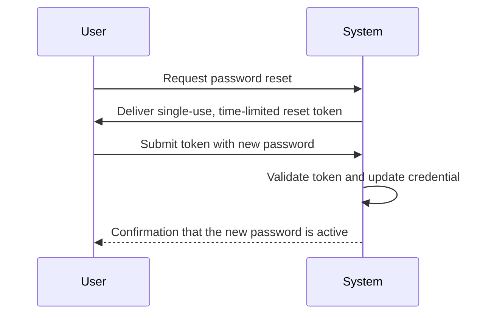