**brokerDesk — Business concepts, relationships, and states from user perspective**

Business concepts, relationships, and states from user perspective

# Domain Concepts

Describe what each concept means in the business domain and its key attributes.

## Organization Concept

An Organization represents an independent insurance brokerage that uses BrokerDesk as its management system. Every business record in the platform belongs to exactly one organization, which keeps each brokerage's data fully separated from every other brokerage's data. An organization is identified by its legal name and may also carry an operating name used day-to-day. Its profile records the primary province where the brokerage operates, along with its business address, phone contact details, and its HST or GST registration number. The default currency for all money amounts across the brokerage is the Canadian dollar (CAD). Organization-level settings capture preferences such as configurable tax rates applied to broker fees. Carriers, products, document templates, commission schedules, users, and clients are all defined within the scope of one organization. In practice, signing into BrokerDesk means working inside a single brokerage's workspace.

### Organization as Brokerage Tenant

An organization represents one independent Canadian insurance brokerage conducting its business through BrokerDesk. When a brokerage joins the platform, it exists as exactly one organization, which serves as its brokerage tenant: a self-contained home for everything that brokerage owns and performs in the system.

Two names identify the organization:

- **Legal name** — the registered corporate name under which the brokerage legally operates. It is the required identifier of the organization.
- **Operating name** — an optional second name capturing how the brokerage trades day-to-day when that differs from its legal name.

Together, the two names allow a brokerage to present itself accurately wherever its identity appears in the system.

### Organization Profile Details

Beyond its names, an organization carries a profile that establishes the brokerage's official identity within the platform:

- **Primary province** — the Canadian province where the brokerage principally operates (for example Ontario, Quebec, Alberta, or British Columbia). It anchors the brokerage's provincial context, since taxes and regulatory matters differ by province.
- **Business address** — the brokerage's place of business.
- **Phone** — the main contact number for the brokerage.
- **HST/GST registration number** — the number evidencing the brokerage's registration for federal sales taxes.

These profile details distinguish each brokerage from every other brokerage hosted on the platform and give the organization a concrete, identifiable presence in the system.

### Default Currency and Organization Settings

The default currency of an organization is the Canadian dollar (CAD). Every money amount belonging to the brokerage is expressed in CAD: premiums, broker fees, invoice amounts, payments, and commissions all operate in this single currency. There is no per-record choice of currency; the organization-level default keeps the brokerage's financial picture consistent end to end.

Organization settings hold brokerage-wide preferences. They apply to the whole organization rather than to any individual staff member, so everyone in the brokerage operates under the same conventions. The principal setting is the configuration of tax rates applied to explicit broker fees. Because the treatment of broker fee taxes varies by province, each organization configures its own rate table suited to its jurisdiction; the seeded example is Ontario HST at 13 percent. Settings therefore let otherwise similar brokerages tailor financial behaviour to their own province.

### Multi-Tenancy, Tenant Isolation, and Record Ownership

BrokerDesk practices multi-tenancy: one platform serves many unrelated brokerages simultaneously while behaving toward each as though it were that brokerage's dedicated system.

The governing principle is business record ownership — every business record belongs to exactly one organization. This spans clients, quotes, policies, invoices, payments, commissions, carriers, products, coverage items, commission schedules, document templates, tasks, documents, notifications, audit history, and staff accounts. Ownership attaches when the record arises under a brokerage and does not move between brokerages.

Tenant isolation is the guarantee that follows from this ownership:

- Every listing, search, report, and rendered document draws only from the signed-in user's own organization
- Two brokerages may each define their own entry for the same carrier or product, and each sees only its own copy — never the other's
- No operation reaches across organizational boundaries

In practice, signing into BrokerDesk means entering one brokerage's private workspace, and the platform experience never leaves it.

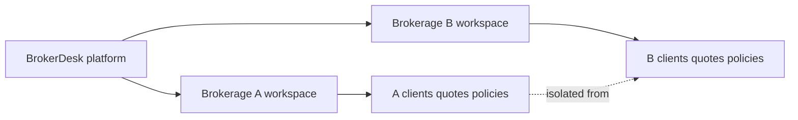

## User Concept

A User represents a person who signs in to BrokerDesk on behalf of a brokerage. Each user belongs to exactly one organization and carries an email address used for sign-in, a password credential, and a display name shown throughout the application. A role determines what the person may do: ADMIN manages the organization, users, carriers, products, templates, commission schedules, reports, and audit logs; PRODUCER owns a book of business spanning clients, quotes, submissions, policies, renewals, and personal commissions; CSR handles client service work including endorsements, documents, and tasks; CLIENT is reserved for portal access to read one's own policies and documents and submit service requests. A user also carries an active flag so a deactivated person can no longer sign in while their history remains intact. Producers are the staff members who hold provincial licences and to whom clients are assigned. Users invited or created by an administrator always stay inside their own brokerage's boundary.

### User Account

A user account represents a person who signs in to BrokerDesk on behalf of exactly one brokerage. The account carries the following identifying information:

- An email address that uniquely names the account and is used for sign-in
- A password credential used to prove the person's identity at sign-in
- A display name shown throughout the application
- A role that determines what the person may do (ADMIN, PRODUCER, CSR, or CLIENT)
- An active-or-inactive standing controlling whether sign-in is currently permitted

Every business record a person creates — clients, quotes, policies, activities, tasks, documents — stays inside that person's organization boundary. Account lifecycle events such as registration, email verification, password reset, and sign-in sessions are canonicalized in 01-actors-and-auth; this section defines only what an account means as a business concept.

### Role-Based Access

The role attached to a user account determines what the person may do inside BrokerDesk. There are exactly four roles: ADMIN, PRODUCER, CSR, and CLIENT. A user holds exactly one role at a time, and an administrator may change a person's role as their duties change.

The complete permission matrix — which role may perform which operation — is canonicalized in 01-actors-and-auth. The sections below define what each role means in the business domain.

### ADMIN Role

An ADMIN is the administrative owner of the brokerage workspace. The role spans management of the organization profile, user accounts and their roles, carriers and products, document templates, commission schedules, reports, and audit logs. An ADMIN operates across the entire brokerage rather than holding a personal book of business.

The first person to register a new brokerage becomes its initial ADMIN, and creating that first ADMIN account simultaneously brings the organization itself into existence. From then on, administrators invite or create additional users and decide each person's role.

### PRODUCER Role and Book of Business Ownership

A PRODUCER is a licensed salesperson who owns a book of business — the set of clients assigned to them together with all the quotes, carrier submissions, policies, and renewals arising from those client relationships. Assignment drives visibility: the work generated for an assigned client belongs to that client's producer.

A producer sees commission earnings for their own placements rather than for the whole brokerage. Producers are also the staff members who hold provincial sales licences; licence details and expiry compliance are covered under the ProducerLicence Concept.

### CSR Role

A CSR (client service representative) carries out the brokerage's day-to-day service work. The role centres on serving clients: recording client interactions, processing endorsements on in-force policies, managing client and policy documents, and working through service tasks. A CSR does not manage user accounts or organization settings — those responsibilities sit with the ADMIN role alone.

### CLIENT Portal Role

The CLIENT role is reserved for policyholders who eventually use the optional client portal. A client-role user reads their own policies and documents and submits service requests, and sees nothing beyond their own relationship with the brokerage. The role and its supporting sign-in scaffolding exist from the start of the platform even though the portal experience itself arrives later, so that portal users can be provisioned without restructuring accounts afterwards.

### Email and Password Credential

The email address is the primary identifier of a user account: it is what a person signs in with and how the system distinguishes one account from another. The password credential accompanies it and proves the signer's identity; a password is never displayed once chosen and can only be replaced through the password-reset flow. Accounts confirm control of their email address through the token-based email-verification flow.

Both mechanisms are step-by-step flows defined in 01-actors-and-auth; here they matter only as the two halves of how a person proves who they are.

### Display Name

The display name is the human-readable label for a person everywhere BrokerDesk shows human attribution: on client timeline entries, task assignments, document uploads, audit trail entries, and notifications. It lets staff recognize who did what at a glance without exposing sign-in details.

Changing a display name affects only presentation. Sign-in always relies on the email address, so a corrected or changed display name has no effect on how a person accesses the system.

### Deactivation via Active Flag

Every account carries an active-or-inactive standing. While active, a person signs in and works normally. When an administrator deactivates a person, sign-in stops immediately, yet everything the person ever did remains intact: assigned clients stay assigned, historical activities and documents continue to show the person's name, and previously earned commissions remain attributed. An administrator may later reactivate a deactivated person, restoring normal access.

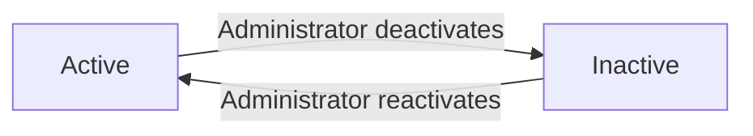

Deactivation therefore removes a person from day-to-day operation without erasing any history.

### Single Organization Membership

A user belongs to exactly one brokerage for the entire life of the account. Staffing is never shared between brokerages: a person invited into one organization operates solely inside that organization, and joining a different brokerage would mean a separate account under that other organization.

This single-membership principle anchors the isolation described under the Organization Concept: every record a person touches is scoped to their own organization, and a person from one brokerage can never read another brokerage's data.

## ProducerLicence Concept

A Producer Licence represents official permission for a producer to sell insurance in a specific Canadian province. Each licence records the province it covers, the licence type such as RIBO, the licence number issued by the regulator, the issue date, the expiry date, and a status showing whether it currently stands valid. One producer may hold several licences at once, covering multiple provinces. Administrators and CSRs maintain licence information on behalf of producers. Because regulators require current licensing, expired or soon-expiring licences must be visible to the brokerage so compliance problems surface before they disrupt business. Licence standing feeds compliance alerts and dashboard indicators alongside carrier appointments.

### Producer Licence

A producer licence is an official authorization that permits a producer to sell insurance within a specific Canadian province. The licence belongs to a single producer (a user working in the producer role) and represents the regulatory permission standing behind that person's ability to place business on behalf of clients.

Each licence carries a small set of defining attributes:

| Attribute | Meaning |
|---|---|
| Province | The single Canadian jurisdiction the licence covers |
| Licence type | The class of permission granted, such as RIBO |
| Licence number | The identifier assigned by the provincial regulator |
| Issue date | When the regulator granted the permission |
| Expiry date | When the permission lapses unless renewed |

Administrators and CSRs maintain licence information on behalf of producers, keeping the regulator-issued credentials accurate and current inside the brokerage system rather than living only on paper. Because regulators require current licensing before business may be placed, licence information is core brokerage data rather than optional background detail.

### Provincial Licensing Basis

Insurance selling in Canada is regulated at the provincial level rather than nationally. There is no single nationwide selling permission; each provincial regulator grants its own approval under its own rules. This is why every producer licence is tied to exactly one province, and why a producer working across provincial boundaries needs separate recognition in each jurisdiction.

Provincial licensing also explains how the licence connects to the rest of the domain: the province on a licence relates to the primary province recorded on clients, the province of risk on policies, and the allowed provinces configured within product eligibility rules.

### Licence Type and Licence Number

Each licence carries a licence type identifying the class of permission granted by the regulator. The Registered Insurance Broker of Ontario (RIBO) designation is the characteristic example for Ontario general insurance brokers, while other provinces and licence classes carry their own naming.

Alongside the type, every licence records the licence number assigned by the regulator — the official identifier the brokerage can cite when confirming a producer's standing with a regulator or a carrier. Taken together, the licence type and licence number make each credential distinguishable from any other, which matters when one producer holds several licences covering different provinces or different classes of permission.

### Issue Date and Expiry Date

A licence's authority lives within a time window defined by two dates. The issue date marks when the regulator granted the permission, and the expiry date marks when that permission lapses unless it is renewed. Of the two, the expiry date is the operationally significant one: it decides whether a producer may continue placing business in the covered province. The pair of dates gives each licence its lifecycle character — currently in force or lapsed — determined entirely by the passage of time relative to today, without anyone having to change the record for its standing to change.

### Licence Validity Status

Every licence shows a validity status describing whether it stands valid right now. The status follows from the current date read against the issue date and expiry date (defined in Issue Date and Expiry Date):

- **Valid** — today falls within the window opened by the issue date and closed by the expiry date.
- **Expiring** — the licence is still valid, but near enough to its expiry date to deserve renewal attention.
- **Expired** — the expiry date has passed and the permission has lapsed.

This three-way visibility turns licence standing into something actionable for the brokerage rather than merely archival.

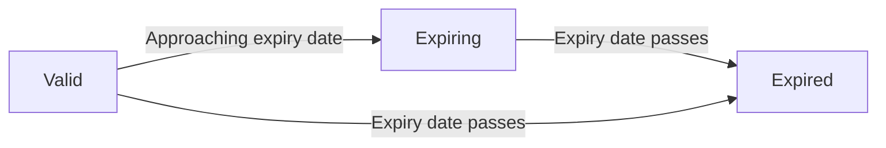

### Multiple Provinces per Producer

One producer may hold several licences at the same time, each covering a different province. A producer serving clients whose risks sit in more than one province needs recognized permission in each of those jurisdictions. Because each licence is an independent record with its own province, licence type, licence number, and dates, one province's licence can expire while another stays valid. The full collection of a producer's licences therefore describes the complete territory in which that person may place business, and any gap in the collection reveals precisely where selling permission is missing or has lapsed.

### Expired and Expiring Licence Visibility

An unnoticed licence lapse is more than a clerical inconvenience — it can interrupt a producer's ability to lawfully serve clients and create compliance exposure for the brokerage. For that reason, the system keeps expired and soon-expiring licences visible instead of buried in lists.

- **Expired licence alerting**: once an expiry date has passed, attention is raised so staff know the permission has lapsed.
- **Expiring licence visibility**: licences approaching their expiry date receive advance visibility while there is still time to renew.

These signals reach responsible staff through the notification facility (defined in the Notification Concept), arriving in the same channel as task-due and policy-expiry warnings rather than requiring someone to go looking.

### Compliance Tracking Role

Licence standing feeds directly into the brokerage's overall compliance tracking picture. Expired and expiring producer licences appear among the compliance indicators surfaced to the organization alongside carrier appointment standing (defined in the CarrierAppointment Concept), giving administrators one combined view of regulatory health: who may sell insurance, in which provinces, and until when. The producer licence thus serves two purposes at once — it records the regulator-granted permission that enables a producer to work, and it continuously measures how secure that permission remains as time passes.

## Client Concept

A Client represents an individual or a business the brokerage serves or hopes to serve. Each client is typed as either an individual, recorded by first and last name plus a preferred name, or a business, recorded by its legal name. A client profile captures the primary province, preferred language of English or French, email, phone, and mailing address. Every client carries a relationship status of prospect, active, inactive, or lost, reflecting where the account stands. Tags and free-form notes help brokers organize and describe their book of business. Each client is assigned to a producer who owns the relationship and is accountable for the account. Clients can be removed from working views without destroying history through soft deletion. Clients anchor nearly everything else in the domain: quotes, policies, invoices, activities, tasks, and documents all attach back to a client.

### Individual and Business Clients

Every client is classified as either an individual or a business, and this classification shapes how the client is identified. An individual client is recorded by first name and last name, with an optional preferred name captured for everyday courtesy — the name the person actually goes by in conversation. A business client is recorded by its legal name. The classification is chosen once when the client is created and does not switch between individual and business afterward; a fundamentally different kind of customer is simply recorded as a new client.

The classification also determines which supporting records apply. Business clients can maintain a roster of named contacts (see ClientContact Concept), while both kinds of client can hold addresses of various purposes (see Address Concept).

### Relationship Status Lifecycle

Each client carries a relationship status that tells the brokerage where the account stands:

- **Prospect**: a potential customer who has been entered into the book but does not yet have coverage placed through the brokerage.
- **Active**: a client currently being served, with the brokerage acting on their behalf.
- **Inactive**: a former or dormant account that the brokerage no longer services day to day, kept on record along with all of its history.
- **Lost**: a prospective or existing relationship that did not result in placed business or that moved to another brokerage.

A new client most commonly enters the book as a prospect and becomes active once business is placed. Movement among the other statuses reflects business judgement by brokerage staff rather than automatic system behaviour.

### Typical Status Journey

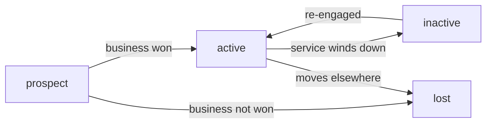

Because transitions are discretionary, the system treats the four values as a shared vocabulary for reporting and pipeline review rather than as an enforced sequence.

### Preferred Language and Primary Province

A client's preferred language — English or French — records how the client prefers to be communicated with. It guides day-to-day correspondence and selects the locale of generated paperwork: document templates are authored per locale (see DocumentTemplate Concept), so a French-preferring client receives French-rendered documents where a template exists.

The primary province identifies the Canadian province chiefly associated with the client, such as Ontario, Quebec, Alberta, or British Columbia. It situates the client geographically for the brokerage and feeds two downstream concerns: product eligibility checks that restrict offerings to certain provinces, and the provincial character of sales-tax handling on the client's invoices.

### Tags and Notes

Clients can be labelled with tags — short free-form markers that group the book of business along lines meaningful to the brokerage, such as line-of-business focus or referral origin. Because tags are open-ended, they let each organization build its own categories without imposing a fixed taxonomy.

Alongside tags, free-form notes capture narrative context about the relationship: background on the client's situation, reminders of preferences, or anything else worth remembering. Tags serve organization and retrieval, while notes preserve human context; together they round out the profile beyond structured fields.

### Assigned Producer

Every client is assigned to one producer — a user holding the PRODUCER role (see User Concept) — who owns the relationship and is accountable for the account. This assignment expresses whose book of business the client sits in and gives the brokerage a clear answer to "who looks after this client?".

When a producer leaves a book or workloads shift, the client can be reassigned to another producer. Reassignment changes accountability going forward but leaves the client's entire history — activities, quotes, policies, invoices — untouched and still attributed correctly.

### Soft Deletion of Clients

Clients can be removed from everyday working view through soft deletion rather than outright erasure. A softly deleted client disappears from routine lists and searches, but the record and everything anchored to it — past quotes, in-force and expired policies, invoices, correspondence history — remains intact and attributable.

This approach matters because insurance relationships carry obligations long after day-to-day contact ends: a policy sold years ago may still generate commission questions, renewal inquiries, or proof-of-coverage requests. Soft deletion keeps those answers available. How long deleted records are retained before any final disposition is governed by lifecycle and retention policies described under Lifecycle and Retention and in the non-functional specification.

### Anchor Record for Business Records

The client is the anchor record of the domain: nearly every other business object attaches back to one. Quotes proposed to the client, policies written for the client, and invoices billed to the client all hang off the client record, as do activities, tasks, contacts, addresses, and uploaded documents.

Viewed together, these attached records tell the client's complete story. The client timeline draws on this collection, presenting activities, tasks, quotes, and policies in chronological order so a broker can see at a glance everything that has happened with the account. Because each child record points back to its client, the full history survives status changes, producer reassignments, and soft deletion.

### Finding Clients

As the book of business grows, brokers need to find clients quickly along several dimensions. Searching by name locates a known client directly. Filtering narrows the book by:

- **Relationship status** — for example, isolating prospects for pursuit or actives for service.
- **Assigned producer** — viewing one producer's book or the whole brokerage's.
- **Primary province** — focusing on clients situated in a given province.
- **Tags** — pulling up groups built around organizational labels.

These facets mirror the organizing attributes defined earlier in this unit, giving staff consistent vocabulary for both managing profiles and retrieving them. The precise matching, combination, and pagination behaviour of listing clients is specified in the business rules.

## ClientContact Concept

A Client Contact represents a named person at a business client whom the brokerage communicates with. Contacts exist because businesses typically involve several people in insurance decisions, such as an owner, an office manager, or a benefits administrator. Each contact records a name, a job title, an email address, and a phone number. Exactly one contact can be flagged as primary so staff know the default person to reach first. Contacts belong to their business client and have no meaning outside that relationship. Individual clients need no contacts since the client record itself is the person.

### Client Contact Person

A client contact person is a named individual at a business client with whom brokerage staff communicate while serving the account. The business client is the customer of record, yet everyday insurance work — gathering information, answering questions, confirming coverage decisions — happens through people. The contact concept captures those individuals so staff always know exactly who they are dealing with.

Contacts apply only when the client type is business (see Client Concept for the individual-versus-business distinction). An individual client needs no contacts because the client record itself is the person.

### Multiple Contacts per Business

Insurance decisions at a business typically involve several people: an owner who signs applications, an office manager who handles paperwork, or a benefits administrator who coordinates group coverage. To reflect this reality, a business client can hold multiple contacts, each recorded as a separate person with their own details. Every participant in the account can therefore stay on file.

Each contact belongs to its business client and has no meaning outside that relationship. A contact never stands alone and never attaches to more than one client.

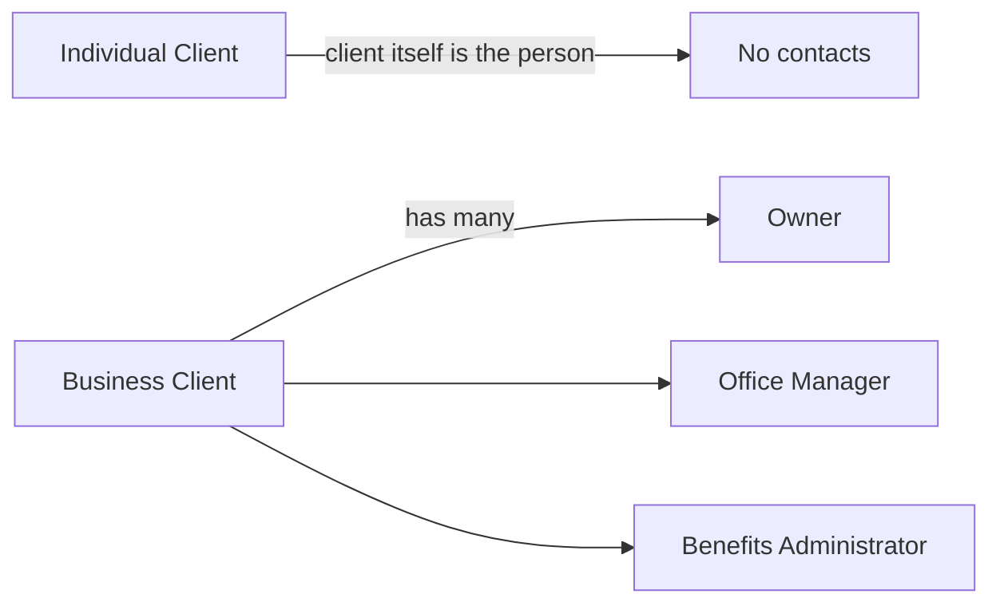

### Contact Details and Primary Designation

Each contact records four identifying details:

| Detail | Purpose |
|---|---|
| Name | How the person is known to the brokerage |
| Job title | Their role at the business (for example, Owner or Office Manager) |
| Email address | Channel for written correspondence |
| Phone number | Channel for telephone reach |

Exactly one contact of a business client can carry the primary contact flag at any given time. The flagged person serves as the standing day-to-day communication point — the default first person staff reach for routine matters on that account. Because only one contact holds the flag at a time, the primary point of contact is never ambiguous.


## Address Concept

An Address represents a physical location associated with a client or another party in the domain. Addresses are typed by purpose: mailing addresses for correspondence, billing addresses for invoicing, and risk addresses for locations being insured. Each address consists of street line one and optional street line two, a city, a province, and a postal code, following Canadian addressing conventions. A single client may hold several addresses covering different purposes and different risk locations. Province matters beyond geography because eligibility rules, tax treatment, and producer licensing are all province-aware in Canadian insurance. Risk addresses in particular connect client records to the property or location a policy protects.

### Address Definition

An Address is a physical location that matters to the brokerage because some party occupies it, receives correspondence at it, bills from it, or insures it. An address is always attached to a Client record, and the same address structure is reused for the Organization profile so a brokerage can record its own office location alongside its client records.

Each address entry describes exactly one location and serves exactly one declared purpose. The purpose (defined in Mailing, Billing, and Risk Address Types) tells the system what the address is used for, while its descriptive parts (defined in Street, City, Province, and Postal Code) tell where it sits.

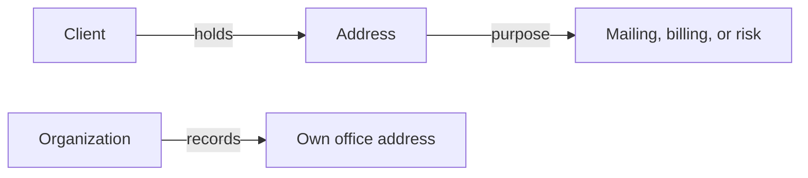

### Mailing, Billing, and Risk Address Types

Every address carries one of three purpose types: mailing, billing, or risk.

- **Mailing address** — where the party wants to receive correspondence, such as mailed documents and notices.
- **Billing address** — the location treated as the billing contact point when invoices and payment matters are handled.
- **Risk address** — the physical location exposed to the events a product insures, such as a house, a commercial building, or another insured site.

The purpose type never changes what an address looks like; all addresses share the same descriptive parts. What changes is how the rest of the domain uses the address: correspondence goes to mailing addresses, billing paperwork refers to billing addresses, and coverage placement keys off risk addresses.

### Street, City, Province, and Postal Code

An address consists of five descriptive parts:

- **Street line one** — the primary street information, typically the civic number and street name.
- **Street line two** — optional supplementary delivery information, such as a unit, suite, or apartment designator.
- **City** — the municipality name.
- **Province** — the Canadian province or territory where the location sits, written with the province's standard two-letter abbreviation (for example ON, QC, AB, BC).
- **Postal code** — the Canadian postal code, six characters alternating letters and digits with a single space between the third and fourth characters (for example K1A 0B1).

These Canadian addressing conventions apply uniformly everywhere an address appears — on client records and on the organization profile alike — so staff enter and read addresses the same way throughout the system.

### Multiple Addresses per Client

A client is never limited to a single address. A client may hold several addresses at once, differing in purpose, in location, or both. Common patterns include:

- An individual client whose home serves as the mailing address while a separately owned cottage is recorded as a risk address.
- A business client with distinct mailing and billing addresses plus several risk addresses, one per premises — for instance separate store locations, or a head office alongside a warehouse.

Because every address stands as its own entry, any single location remains individually identifiable and can be referred to on its own when arranging coverage.

### Risk Location for Coverage

The risk address is the link between a client and the physical thing a policy protects. Where mailing and billing addresses serve administrative processes, the risk address carries underwriting significance: it identifies the property whose situation and character matter when deciding whether coverage can be offered and on what basis.

When a policy concerns a particular location, the province of that risk location supplies the province-of-risk context carried on the policy (see Policy Concept). The risk address — not the client's preferred mailing address — is therefore the authoritative indicator of where a covered asset sits. A client who resides in one province while holding insured property in another shows both provinces in their record, each attached to its own address entry and serving its own role.

### Province-Aware Eligibility and Taxation

Beyond naming a place, the province recorded on an address participates in several province-sensitive behaviours across the domain:

- **Product eligibility** — products may restrict the provinces they accept; eligibility evaluation consults the province of the relevant address (rules defined with the Product Concept).
- **Tax treatment** — Canadian sales taxes differ by province; how the provincial context determines the tax code applied on an invoice line is defined with the Invoice Line Concept.
- **Broker fee taxability** — whether and at what rate broker fees are taxed depends on provincial rules; each organization maintains its own configurable fee-tax rate table in its settings, seeded with Ontario harmonized sales tax at thirteen percent as the default example.
- **Producer licensing** — producers hold licences issued province by province (defined in the Producer Licence Concept), so the provinces in which an organization places business determine which licence credentials matter.

Together with the organization's primary province (defined in the Organization Concept), address provinces give the brokerage a complete picture of where it operates and where its obligations arise.

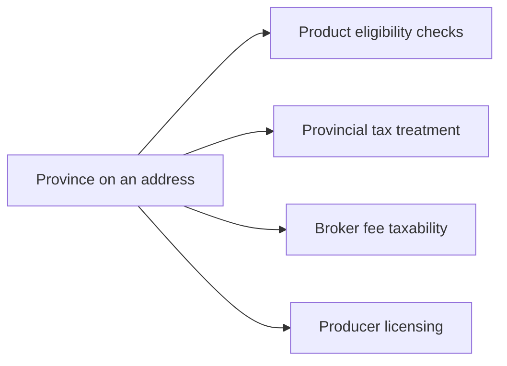

## Activity Concept

An Activity represents a logged interaction between brokerage staff and a client, such as a phone call, an email exchange, a meeting, or a general note. Each activity records its type, a short subject line, and a body holding the substance of the conversation or observation. Activities carry the moment they occurred and the staff member who logged them, preserving who said what and when. Any staff member servicing the client can log activities against the client record. Together with tasks, quotes, and policies, activities form the chronological timeline a broker reviews to understand everything that has happened with a client. Activities give the brokerage institutional memory so relationships survive staff changes and handovers.

### Activity Types

Every activity carries exactly one type that classifies the kind of interaction it documents. The five supported types are:

| Type | Business meaning |
|------|------------------|
| Call | A live voice conversation held with or about the client, such as a coverage discussion or a follow-up ring |
| Email | Written correspondence exchanged with the client, summarized so its substance survives outside any mailbox |
| Meeting | A scheduled in-person or virtual discussion, including sales presentations and annual reviews |
| Note | An internal observation or piece of knowledge that does not stem from a specific conversation, such as a reminder of a client preference |
| Other | A catch-all classification for meaningful interactions that fit none of the above categories |

Call, email, and meeting record external touchpoints between the brokerage and the client, while a note records internal knowledge that never left the brokerage. The "other" classification exists so staff never distort the record by forcing a genuine interaction into the nearest wrong category.

The type serves the reader as much as the writer: when reviewing a client's history, a producer can tell at a glance whether an entry was a client-facing conversation or a private observation, which changes how much weight and discretion the entry deserves.

### What Each Activity Records

An activity is composed of four descriptive elements that together preserve the full story of an interaction.

**Subject** — a short, staff-written headline naming the interaction, such as "Renewal review call". It exists so a reader scanning a long history can grasp each entry without opening it.

**Body** — the free-form substance of the entry: what was discussed, what was agreed, what was observed. The body is where the actual content of the relationship lives; the subject merely indexes it.

**Occurred-at moment** — the point in time when the interaction actually took place. This is deliberately separate from the moment the entry was written: a broker finishing a day of site visits may log several activities in the evening, each pointing back to the time the conversation genuinely happened. Keeping the occurred-at moment explicit keeps the history truthful even when entries are batch-recorded after the fact.

**Logged-by staff attribution** — the staff member who wrote the entry is permanently attached to it. Attribution answers the question "who said what and when": if a client later disputes something they claim was promised, the brokerage can see which staff member recorded the exchange and what that person wrote. Attribution also gives readers a natural person to approach for clarification about an ambiguous entry.

### Client Communication History and Institutional Memory

For every client, activities accumulate into a continuous communication history spanning the whole relationship — from the first prospecting call, through quoting conversations, meetings ahead of renewals, and routine service exchanges. No entry stands alone: each is a chapter in an ongoing narrative shared by any staff member servicing the client.

On its own, however, activity history is incomplete — work commitments, priced proposals, and in-force coverage are recorded elsewhere. The client timeline therefore weaves activities together with tasks, quotes, and policies into a single chronological sequence, each record placed according to its own relevant date (the occurred-at moment for activities). Reading down the timeline tells the full story of the relationship in order: the call that opened the account, the task that followed it, the quote that resulted, and the policy that bound it.

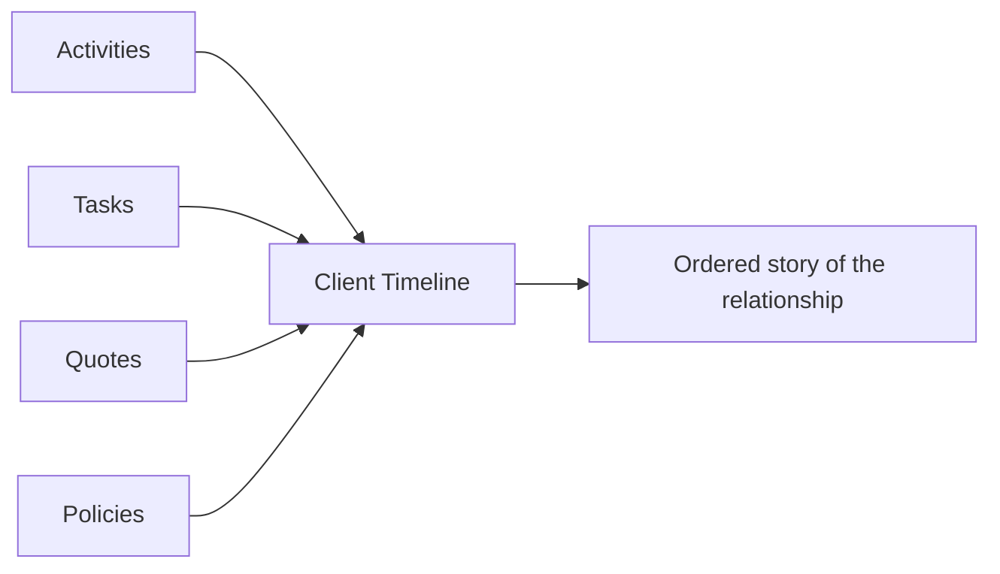

This shared record turns scattered interactions into relationship institutional memory. Knowledge does not live in personal inboxes or individual recollection; it lives on the client record. When a producer leaves the brokerage or service responsibility passes to another staff member, the successor reconstructs everything important by reading the timeline rather than depending on a verbal handover. Over months and years, the accumulated history protects the quality of advice, prevents promises from being forgotten, and ensures clients never have to repeat themselves because the person they dealt with is gone.

## Task Concept

A Task represents a piece of follow-up work assigned to a member of the brokerage. Each task carries a title, an optional longer description, a due date, and a status of open, done, or cancelled. Tasks may stand alone or be linked to the client or policy they concern, giving context to the work. An assignee owns each task so responsibility is never ambiguous. When a task falls due, the system raises a notification so deadlines are not missed. Tasks appear alongside activities, quotes, and policies in a client's timeline, showing outstanding commitments next to historical interactions.

### Task Concept

A Task represents a piece of follow-up work assigned to a member of the brokerage. Where an Activity records something that already happened — a call made, a meeting held — a Task looks forward: it captures something that still needs doing, who must do it, and by when.

Tasks exist so that managing follow-up work never depends on memory. Commitments made during client conversations — reviewing a renewal, sending requested documents, confirming coverage details — become durable records instead of loose reminders. Every outstanding commitment sits in one shared place carrying a title, an optional description, a due date, a status, and an assignee.

A task may stand entirely on its own, serving as an internal reminder unrelated to any particular record, or it may be tied to the client or policy it concerns. In either form it carries the same core elements.

### Task Title, Description, and Due Date

Every task carries a title stating the work in plain terms, such as "Follow up on signed application". Because staff scan titles first, a title should identify the commitment at a glance.

An optional longer description may accompany the title. It holds whatever context the creator considers useful — background from a conversation, instructions for the assignee, or notes on why the work matters.

The due date records when the work should be completed by. It turns a note into a commitment: it expresses urgency, it determines when the system alerts the assignee, and it lets anyone reviewing the workload see what falls due first.

### Open, Done, and Cancelled Statuses

A task moves through three possible statuses over its life:

- **Open** — the default state from creation. The work is outstanding and awaits completion.
- **Done** — the assignee has completed the work. The record is kept rather than erased, so the brokerage retains evidence that the commitment was met.
- **Cancelled** — the work is no longer needed, for instance because the underlying matter was resolved another way. Cancelling preserves the history of what was once planned.

Only an open task can transition to done or cancelled. Once a task is done or cancelled it is settled, and no further status changes apply to it.

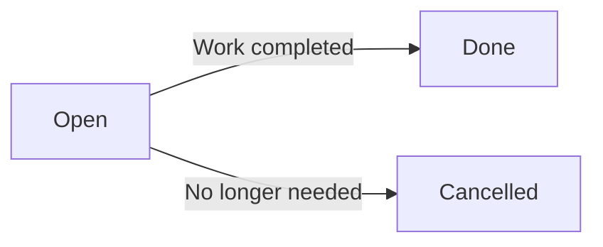

### Assignee Accountability

Each task has exactly one assignee — the member of the brokerage responsible for seeing the work through. This single-owner model keeps accountability unambiguous: when a task falls due or sits open longer than expected, it is always clear whose attention it needs. There is never a shared obligation drifting without an owner.

Assignment is part of the task from creation onward, so responsibility attaches to the work for its entire life. Combined with the due date, it answers the two questions that matter most for follow-up work: who must act, and by when.

### Linking Tasks to Clients and Policies

A task optionally carries a link to the client it concerns, and optionally a further link to the policy involved. These links supply context: a staff member working in a client's record sees immediately which follow-up commitments are attached to that relationship, and someone reviewing a policy sees the work pending against it.

The links are optional by design. Some tasks — general coordination, internal reminders — concern no particular client or policy, and forcing a link onto them would misrepresent their scope. When links are present, however, they connect the task into the broader picture of the client relationship rather than leaving it isolated.

### Task-Due Notification

When a task reaches its due date with its work still open, the system raises a notification so that deadlines are not missed. From the task's side, this contributes two things to the notification mechanism: the trigger — a task falling due — and the intended recipient, the task's assignee.

The notification refers back to the task itself, allowing the assignee to go directly from the alert to the outstanding work. Notifications as a mechanism — their types, titles, read state, and related-record references — are defined under the Notification Concept (Module 1).

### Client Timeline Integration

Tasks appear on a client's timeline alongside activities, quotes, and policies, arranged chronologically. This integration is deliberate: a broker reviewing the relationship sees in one view both what has happened — calls logged, proposals priced, policies issued — and what remains outstanding.

Because tasks look forward while activities, quotes, and policies largely record what has occurred, their presence on the timeline keeps commitments visible next to history. An open task sitting beside recent interactions signals work still owed to the client, ensuring follow-up items do not slip away simply because they were tracked somewhere apart from the story of the relationship.

## Document Concept

A Document represents any file held against the brokerage's business records, whether uploaded by staff or generated from templates. A document attaches to an owner among client, quote, policy, or invoice, and carries a kind indicating what it holds, such as a proposal, schedule, certificate, or invoice copy. Each document records its filename, its file format, its size, and its storage location, along with integrity and version details so revisions are tracked and files remain verifiable. The staff member who uploaded the file and the time it arrived are preserved for accountability. Documents support soft deletion so removing one from view does not destroy the underlying record. Rendered proposals, policy schedules, certificates of insurance, and other template outputs all become stored documents once produced.

### Document Concept

A Document represents any file held on behalf of the brokerage against its business records. It may be a proposal sent to a client, a policy schedule issued at binding, a certificate of insurance requested by a third party, an invoice copy, or any supporting file such as a scanned driver's licence or a signed application form.

A document is distinct from the business record it belongs to: deleting or changing a client does not silently alter the documents attached to that client. Every document carries the following identifying details:

- the kind of material it holds (see Document Kinds)
- the single business record it is attached to (see Attachable Owners)
- its filename, file format, and file size
- a storage location reference telling the system where the file content resides
- an integrity checksum and a version number
- the staff member who brought the file into the system and the moment it arrived

Documents belong to the same brokerage as the record they are attached to, so one brokerage never sees another brokerage's files.

### Attachable Owners: Client, Quote, Policy, Invoice

Every document is attached to exactly one owner at a time among four kinds of business records: a client, a quote, a policy, or an invoice. This polymorphic ownership lets one document-handling concept serve the whole book of business instead of separate file stores per record type.

Typical attachments follow the record's purpose:

- a client holds identification, correspondence, and signed applications
- a quote holds comparative proposals and carrier response letters
- a policy holds schedules, certificates of insurance, and full policy wordings
- an invoice holds billing copies and payment confirmations

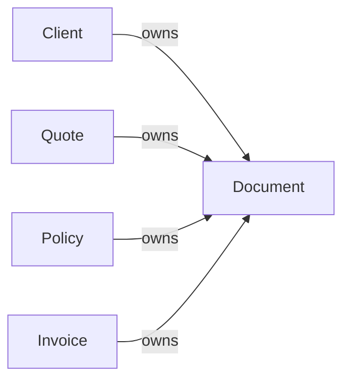

Because the owner is part of the document's identity, a document cannot float unattached, and moving a file to a different record is treated as attaching it anew rather than editing the old link.

### Document Kinds

Each document carries a kind indicating what the file contains. The recognized kinds mirror the material a brokerage produces day to day:

- quote proposal — the comparative offering presented to a prospect or client
- policy schedule — the coverage schedule summarizing an in-force policy
- certificate of insurance — proof-of-coverage evidence supplied to third parties
- certificate — other certificates issued around a placement
- invoice copy — a printable or archived copy of a bill
- general — any other supporting file that fits none of the above

The kind describes the content, not its origin: a policy schedule carries the same kind whether a producer uploaded a carrier-issued copy or the brokerage rendered it from a template. The kind allows users to filter a record's file list by purpose, for example pulling up every certificate ever issued for a policy.

### Filename, File Format, and File Size

Three attributes describe the file itself in user-facing terms:

- Filename — the name shown to users, normally the original name the uploader used, so a client-facing proposal keeps its intended presentation name rather than an internal label.
- File format — how the content is encoded, such as a PDF document, a Word processing file, or an image; this tells users and the system what kind of content to expect before opening it.
- File size — how large the file is, recorded at intake so listings can show weight and unusually sized files can be reviewed.

These three attributes travel together as the file's visible identity: two attachments on the same policy are told apart by their filenames even if they hold similar material.

### Storage Location Reference

A document does not hold its file content inside the business record itself. Instead, it stores a storage location reference — a pointer telling the system where the file's actual bytes reside. The business data therefore stays lightweight: listing a client's twenty documents means reading twenty references, not loading twenty files.

The reference is managed entirely behind the scenes. Users see the filename and kind; the storage location is resolved automatically whenever a file is opened or downloaded. If a document's reference points nowhere, the file is treated as unavailable rather than silently substituted.

### Integrity Checksum and Versioning

Two attributes protect the trustworthiness of every stored file:

- Integrity checksum — a computed value captured when the file enters the system. Recomputing it later confirms the file has not changed since arrival; a mismatch signals corruption or tampering and the file should not be trusted for compliance purposes.
- Version number — distinguishes successive filings of the same material. When a revised schedule replaces an earlier one, the new filing carries the next version number and the earlier filing remains present and identifiable rather than being overwritten.

Together these mean a brokerage can always answer two questions about any document: is this exactly the file that was originally filed, and is it the current edition or a superseded one?

### Uploaded-By Accountability

Every document records who brought it into the system and when it arrived. This attribution applies equally to files a CSR uploads on a client's behalf and to proposals the system generates from templates — in both cases a responsible person and a moment in time are preserved.

Attribution matters when questions arise later: which staff member filed the certificate the client disputes, and when did the signed application actually arrive. The answer is read straight from the document rather than reconstructed from memory. Attribution complements the organization-wide audit history (see AuditLog Concept); the document itself always knows its own filer even when consulted outside a formal audit review.

### Generated Versus Uploaded Files

Documents enter the system through two origins:

- Uploaded — a staff member brings in an existing file, such as a carrier-issued policy wording or a scan of a signed form. The filename, format, and size reflect whatever was provided.
- Generated — the system produces the file by rendering one of the brokerage's own templates against a specific record (see DocumentTemplate Concept), such as a quote proposal assembled for a priced quote or a certificate of insurance drawn from a policy.

Once produced, a generated output becomes an ordinary stored document: it receives a filename, a kind, a checksum, a version, and attribution like any uploaded file. The practical difference is provenance — a generated document is known to have been produced by the brokerage from its own template at a known moment, while an uploaded document came from outside. Both remain fully interchangeable for viewing, listing, and attachment purposes.

### Soft Deletion of Documents

Removing a document from view is a soft deletion: the document disappears from normal lists and can no longer be opened, yet the underlying record survives intact with its filename, attribution, and checksum still preserved.

This behaviour reflects how brokerages actually work — files get uploaded to the wrong client, superseded drafts clutter a policy, and a mis-filed invoice copy must come down immediately without destroying the evidence of what was there. Because nothing is physically destroyed at removal time, a removed document remains recoverable and auditable; how long removed documents are retained before final disposal follows the organization's retention policy (defined in 05-non-functional).

## Carrier Concept

A Carrier represents an insurance company whose products the brokerage places business with, such as large national insurers. Each carrier is identified by a name and a short code, and may carry an optional financial strength note such as an AM Best remark so brokers can judge the insurer's stability. Contact details including website, service email, and service phone let staff reach the carrier quickly. Free-form notes capture anything else worth remembering about the relationship. A carrier can be marked inactive when the brokerage stops doing business with it while historical quotes and policies remain intact. Carriers sit above products in the catalog: every product sold belongs to one carrier, and submissions raised during quoting are addressed to specific carriers.

### Insurance Company Identity: Carrier Name, Code, and Financial Strength

A carrier represents an insurance company whose products the brokerage places business with — the large national insurers brokers approach when arranging coverage for clients. BrokerDesk keeps one carrier record per insurance company so that every product offered, quote line priced, submission sent, policy issued, and commission earned traces back to the same consistent entry for that insurer.

Each carrier is identified by two pieces of information:

- **Carrier name** — the insurance company's full business name, displayed wherever staff see the carrier in the application
- **Carrier code** — a short code identifying the carrier wherever compact labelling is needed, such as lists, comparative quote lines, and reports

A newly recorded carrier requires only a name and a code to exist; the remaining profile details described below are optional and can be completed later.

### Financial Strength Note, Contact Details, and Free-Form Notes

Beyond its name and code, a carrier profile carries the following information:

| Attribute | Meaning |
|---|---|
| Financial strength note | An optional free-text remark, such as an AM Best observation, giving a quick read on the insurer's stability |
| Website | A link to the insurer's public site |
| Service email | The address staff use for servicing inquiries with the insurer |
| Service phone | The telephone line for day-to-day dealings with the insurer |
| Carrier notes | Free-form text capturing anything else worth remembering about the relationship |

The financial strength note matters because brokers judge where to place business partly on the soundness of the insurer; seeing the remark beside the carrier helps producers weigh stability when comparing offerings. The structured contact details — website, service email, and service phone — mean staff never need to look outside BrokerDesk to find out how to reach a carrier.

Free-form notes give brokerage staff a place to record anything worth remembering that does not fit a structured field: negotiation history, underwriting quirks, turnaround habits, or reminders about whom to call for a given line of business. The notes are purely informational; they inform people, and the system does not enforce anything based on their contents.

### Active Versus Inactive Carriers

A carrier is active while the brokerage does business with it. When the brokerage stops placing business with an insurer — because the relationship ended, the market changed, or the carrier withdrew from a region — the carrier is marked inactive rather than deleted.

Deactivation never erases history. Quotes, policies, submissions, and commissions that reference the carrier remain fully viewable, so past business stays auditable and reports continue to reflect what was actually placed. While a carrier is inactive, it effectively leaves the selling catalog: new submissions should not be raised against it, and its products are no longer presented for new quoting. Reinstating the carrier makes it available for new business again.

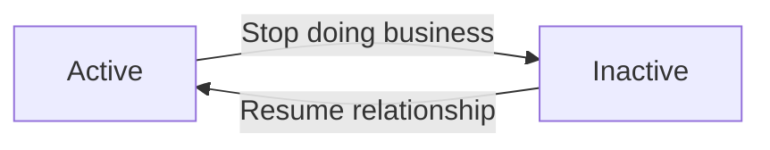

The formal appointment arrangement between an organization and a carrier — including its own status and expiry date — is a separate compliance concept described under the CarrierAppointment concept.

### Parent of the Product Catalog and Target of Submissions

Carriers sit above products in the catalog hierarchy: every product the brokerage sells belongs to exactly one carrier. When staff browse the product catalog by line of business, the carrier tells them who underwrites each offering, and a carrier gathers all the products it makes available. Product attributes themselves — names, codes, lines of business, eligibility — are defined under the Product concept and are not repeated here.

The carrier also anchors the quoting workflow in two ways:

- Comparative quote lines present competing offerings side by side, each identified by its carrier, so clients and producers can see at a glance which insurer offers what
- When a quote moves forward, submissions raised on that quote are addressed to specific carriers, and each carrier's response is tracked through its own submission status and carrier reference number (both defined under the Submission concept)

Policies likewise record which carrier underwrites them, keeping the insurer's identity attached to in-force coverage for the life of the policy. Across all of these references — quote lines, submissions, policies, and commissions — the same carrier record persists, so history remains attributable to the right insurance company regardless of later catalog changes.

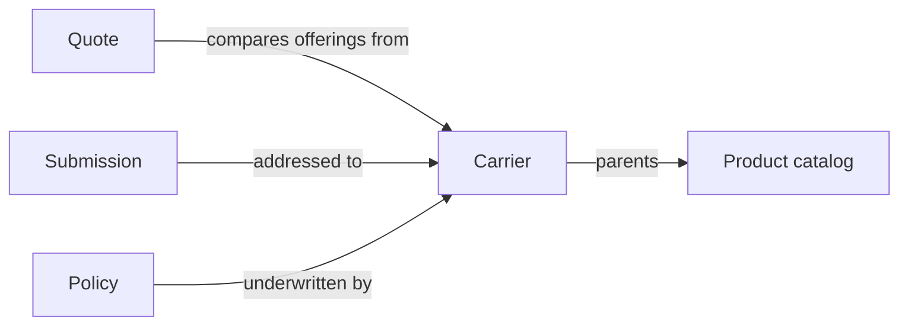

## CarrierAppointment Concept

A Carrier Appointment represents the formal arrangement that permits the brokerage to sell a given carrier's products. Appointments link one organization to one carrier and record an appointment status together with an expiry date. Without a current appointment a brokerage generally cannot legitimately place new business with that carrier, making appointments a compliance matter rather than mere administration. Expiring appointments surface as compliance alerts on dashboards and notifications, prompting renewal before placement of coverage is disrupted. Appointment tracking gives principals a clear picture of which carrier relationships are live, lapsing, or ended at any moment.

### Carrier Appointment and Authority to Place Business

A carrier appointment records the formal arrangement through which an insurance carrier grants the brokerage the authority to place business — that is, the standing to sell that carrier's products. Each appointment links exactly one organization to exactly one carrier, forming the organization-to-carrier relationship; a brokerage accumulates one such arrangement per appointed carrier, giving principals a register of which carrier relationships are live, lapsing, or ended at any moment.

An appointment is deliberately separate from the carrier catalog. A carrier may be present in the system with its products listed for reference, yet until an in-force appointment exists the brokerage holds no standing to sell that carrier's products. New placements with a carrier therefore presuppose a current appointment behind them; without one, placing new business with that carrier is treated as a compliance failure rather than a routine administrative gap.

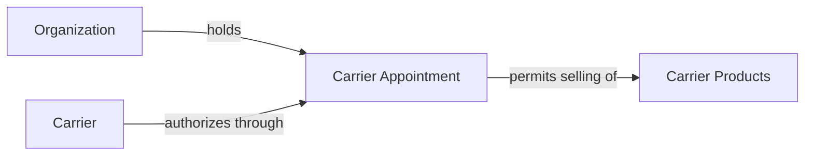

### Appointment Status and Expiry Date

Every carrier appointment carries two descriptive facts: an appointment status and an appointment expiry date.

The appointment status expresses the standing of the authority to place business at any moment — live while the carrier's authorization is current, lapsing once the expiry date draws near, and ended once the authorization has ceased.

The appointment expiry date is the calendar date on which the authorization ceases unless renewed. Because carriers appoint brokerages for fixed terms, an approaching expiry date draws appointment renewal attention: the brokerage must secure a renewal with the carrier to preserve uninterrupted authority before placement of coverage is disrupted. Completing the renewal carries the authorization forward and returns the relationship to live standing, while letting the date pass leaves the relationship ended until renewal is secured.

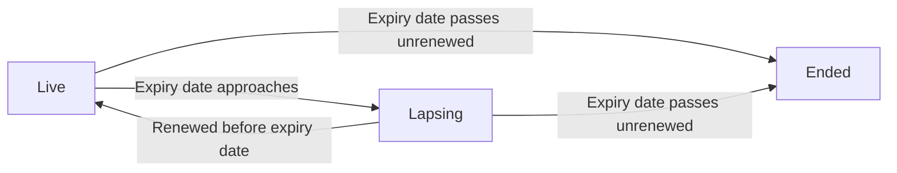

### Compliance Alert Source and Dashboard Compliance Indicator

The carrier appointment doubles as a compliance alert source. Its appointment status and expiry date reveal whenever the brokerage's authority to place business with a carrier is at risk — an appointment nearing its expiry date counts as expiring, and one whose expiry date has passed counts as expired. Both conditions demand action, sitting alongside the producer licensing concerns tracked separately for individual staff members.

These conditions surface in two complementary places. Affected users receive notifications identifying the carrier relationship at risk, following the behaviour described for the Notification concept. In addition, the dashboard compliance indicator aggregates expired and expiring carrier appointments together with producer licence concerns into the compliance portion of the dashboard summary, letting principals distinguish live, lapsing, and ended carrier relationships at a glance.

Acting on these indicators before an expiry date arrives keeps the brokerage's authority intact, so staff can continue legitimately placing new business with every appointed carrier.

## Product Concept

A Product represents an insurance offering a carrier makes available through the brokerage, such as personal auto, home, commercial liability, or a life product. Every product belongs to one carrier and is identified by a name and a code, classified under a line of business such as auto, home, commercial property, commercial liability, life, health, disability, travel, or other. A plain-language description helps staff explain the offering to clients. Products carry eligibility rules stating where they can be sold and to whom, such as allowed provinces, permitted client types, and minimum or maximum values. A rating schema describes the inputs needed to price the product, covering coverage options, limits, deductibles, and risk questions, enabling premium computation from simple formula tables with manual override always available. Products can be deactivated when withdrawn from sale while historical quotes and policies stay readable. Coverage items and commission schedules hang off individual products.

### Product Definition and Carrier Ownership

A Product represents an insurance offering that a carrier makes available for sale through the brokerage — for example a personal auto product, a home product, a commercial liability product, or a life product. A product is the sellable unit of the catalog: brokers select products when assembling quotes, and policies ultimately trace back to the product under which the risk was placed.

Every product belongs to exactly one carrier. A product cannot exist without its owning carrier, and the carrier behind a product remains visible everywhere the product appears — on quote lines, policies, submissions, and commission records.

Each product is identified within the brokerage catalog by two attributes:

- **Name**: the human-readable title staff see and choose from, such as "Personal Auto Standard" or "Commercial General Liability".
- **Code**: a short unique handle used to refer to the product unambiguously when attaching it to quotes or reading reports.

A plain-language description accompanies each product so staff can explain the offering to clients without consulting carrier documentation.

Two child collections hang off every product and are defined in their own sections: the coverage item catalog (defined in CoverageItem Concept) and the commission schedule defaults (defined in CommissionSchedule Concept).

### Line-of-Business Classification

Every product is classified under exactly one line of business. The recognized lines of business are:

- Auto
- Home
- Commercial property
- Commercial liability
- Life
- Health
- Disability
- Travel
- Other

This classification lets the catalog, search filters, and reporting group offerings by the kind of risk being placed rather than by carrier alone. A brokerage searching for home options across several carriers, or reviewing commercial liability volume for the year, relies on this single classification carried on every product.

### Eligibility Rules

Each product carries eligibility rules stating where the product can be sold and to whom. Eligibility answers three questions before a product may be placed on a quote:

- **Allowed provinces**: the provinces in which the product may be sold, matching the provincial focus of the brokerage (for example, a product available in Ontario but not in Quebec).
- **Permitted client types**: whether the product may be sold to individual clients, business clients, or both.
- **Value bounds**: minimum and maximum values the placement must respect, such as the smallest or largest insured amount the product accepts.

These rules act as gatekeeping at the moment a product is attached to a quote. If the client's province is not among the allowed provinces, the client type is not permitted, or the requested values fall outside the bounds, the attachment is rejected together with an explanation of which condition failed.

Browsing the catalog remains unrestricted: staff can still see what carriers offer even where a particular client cannot currently be placed. Eligibility only gates the act of attaching a product to a quote.

### Rating Schema and Premium Determination

Each product defines a rating schema describing the information needed to price it. The schema tells staff which inputs to gather and enter when building a quote line for the product:

- **Coverage options**: which coverages from the product's catalog may be selected or declined.
- **Limit selections**: the coverage limits to choose for each selected coverage, starting from the catalog default limit as a baseline (defined in CoverageItem Concept).
- **Deductible choices**: the deductible amounts offered for each coverage.
- **Risk questions**: the underwriting questions whose answers characterize the risk, such as driver history for auto or building characteristics for property.

When a product includes formula-table configuration, the system computes a suggested premium from the entered rating inputs using the stored table. The computation produces a premium figure that flows onto the quote line together with broker fee, taxes, and the commission estimate seeded from the product's commission schedule.

Manual override is always available: staff may replace any computed premium figure with their own amount, regardless of whether a formula table exists. Computed figures serve as aids to speed up pricing, never as locks on the number. The final premium recorded on the quote line is whatever the user confirmed, whether computed or manually entered.

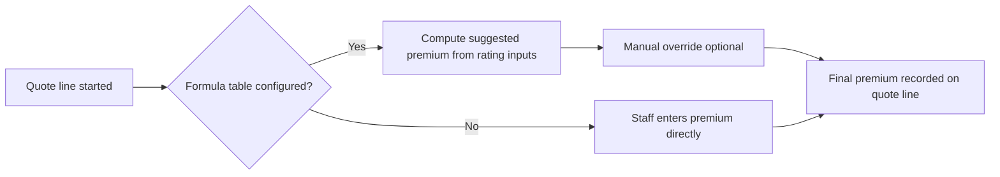

Two aspects of this determination matter for the domain model:

- The suggested premium derived from a formula table is provisional until confirmed; overriding it leaves no restriction on subsequent edits while the quote remains editable.
- The rating inputs and coverage selections captured against the quote line are preserved as entered, so any premium — computed or overridden — can always be traced back to the inputs and rules in effect at the time.

### Product Availability State

A product may be active or inactive. Only active products may be attached to new quotes; an inactive product has been withdrawn from sale and disappears from selectable catalogs for new business.

Deactivation is a withdrawal from sale, never an erasure. Historical records remain fully readable after deactivation:

- Existing quote lines that reference a deactivated product continue to display the product name, code, and carrier snapshot exactly as quoted.
- Issued policies remain tied to their product and keep their coverage schedules intact.
- Reports over past quotes and policies still aggregate correctly, because the classification and carrier links are preserved.

A deactivated product may be reactivated later if the carrier returns it to market, at which point it becomes selectable for new quotes again. Reactivation does not alter any record created while the product was inactive.

## CoverageItem Concept

A Coverage Item represents one named protection offered under a product, forming the product's coverage catalog. Each item carries a name and a code, together with a default limit suggesting a typical starting point when quoting. Depending on the line of business, examples include protections such as liability, collision, or contents coverage. Coverage items give quote lines and policy schedules a shared vocabulary, so what was quoted can be carried faithfully onto the bound policy. Items are optional per product; simple products may define few or none. Selecting and adjusting coverage happens at quoting time using these catalog entries as building blocks.

### Coverage Item

A Coverage Item is one named protection offered under an insurance product — for example, third-party liability under a personal auto product, or contents protection under a home product. While the Product Concept describes the insurance offering as a whole, coverage items break that offering down into its individual protections, forming the product's coverage catalog.

Every coverage item carries the following business attributes:

| Attribute | Business meaning |
|---|---|
| Coverage name | The human-readable label staff see, such as "Comprehensive" or "Contents" |
| Coverage code | A short, stable designation that keeps the item recognizable wherever it is referenced across quotes and policies |
| Default limit | A pre-set coverage amount suggested as the typical starting point when quoting |
| Optional flag | Identifies protections that may be omitted from a placement when they do not suit the client's situation |

The default limit is a suggestion, never a mandate. It gives the producer a sensible departure value drawn from the product's normal terms, which is then adjusted up or down to fit the client's situation. This spares producers from inventing limits from scratch on every quote while keeping the product catalog as the single source of typical terms. The value actually placed on a quote line or policy schedule may differ from the default once adjusted; the catalog default governs only where the number begins, not where it ends.

The exact protections offered depend on the product's line of business (defined in Product Concept): an auto product speaks of protections such as liability and collision, while a home product speaks of contents and other property protections.

### Coverage Catalog Per Product

Each product maintains its own coverage catalog — the set of coverage items that together express what the product can protect. Two auto products from different carriers may protect the same risks, yet their catalogs differ in names, codes, and default limits; the catalog therefore belongs to the product, not to the line of business generally.

Maintaining a catalog is optional per product. A simple product may define only a handful of items, or none at all. Where a catalog exists, however, it becomes the authoritative list of protections available for that product: offerings outside the catalog cannot be presented as part of the product, and every coverage selection made during quoting traces back to a catalog entry.

Note the distinction between the two senses of optionality: the catalog itself is optional per product, whereas the optional flag on an individual item (defined in Coverage Item) marks a protection that may be left out of a particular placement even when it belongs to the catalog.

### Shared Vocabulary From Quote To Policy

Coverage items give the whole placement lifecycle a shared vocabulary: the words used when quoting are the same words used once coverage is in force.

When a producer builds a comparative quote line (see QuoteLine Concept), coverage selections are assembled from the product's catalog entries acting as building blocks — each selected item begins at its default limit (defined in Coverage Item) and is adjusted to the client's needs. When the quote is bound into a policy, the chosen protections carry faithfully onto the policy's coverage schedule (see PolicyCoverage Concept), so the in-force schedule mirrors what was quoted rather than being re-described from scratch.

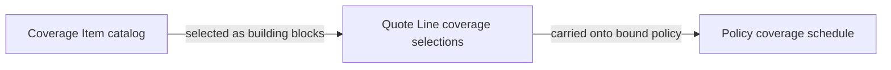

Because every stage speaks through the same named items, a broker reviewing a bound policy can trace each protection back to what was offered in the proposal, and discrepancies between quoted and issued coverage become visible rather than hidden in free-text descriptions.

## CommissionSchedule Concept

A Commission Schedule defines how the brokerage earns money when business is placed with a carrier through a product. Each schedule states a default agency rate percent, meaning the share of premium the carrier pays to the brokerage, and a default producer split percent, meaning how much of that agency amount flows to the writing producer. An optional tier table allows rates to vary by volume or other conditions rather than staying flat. Schedules attach to products so commissions estimated on quotes and recorded on policies reflect the agreed arrangement for that product. These defaults seed commission estimates at quoting and binding time, which can still be adjusted per transaction. Central schedules keep commission arithmetic consistent across the whole brokerage instead of relying on individual memory.

### Commission Schedule Definition

A Commission Schedule is a configuration attached to a single insurance product that states how commission is calculated by default whenever business is placed under that product. Each schedule carries two headline figures:

- **Default agency rate percent** — the share of premium that the carrier pays to the brokerage as commission on placements made under the product.
- **Default producer split percent** — the portion of that agency amount that flows to the writing producer, with the remainder retained by the brokerage.

Both figures are expressed as percentages applied to the relevant premium basis. Because every product carries its own schedule, differing carrier arrangements and differing lines of business are represented accurately instead of being flattened into one brokerage-wide number.


The schedule holds no client, quote, or policy information of its own — it is pure arrangement knowledge, referenced whenever commission amounts are derived.

### Optional Tier Table

In addition to its flat defaults, a commission schedule may carry an **optional tier table**. A tier table is a list of rate bands — most commonly volume tiers keyed to written premium thresholds — where each band states its own agency rate and producer split. Tiers let a single schedule express graduated arrangements, such as higher agency rates once cumulative placement volume passes a threshold, without requiring a separate schedule per band.

When a tier table is present, the applicable band is selected by matching the placement's volume against the tier conditions, and the matched tier's rates take precedence over the flat defaults. When no tier matches, or when the schedule defines no tier table at all, the flat default agency rate percent and default producer split percent apply unchanged. A schedule therefore always resolves to exactly one effective pair of rates at the moment commission is estimated.

### Per-Product Defaults Seeding Commission Estimates

The schedule functions as the source of per-product commission defaults. When a quote line is priced or a policy is issued, the system reads the schedule attached to that line's product and **seeds the commission estimate** (see Commission Concept) with the resulting rates — either the flat defaults or the tier-resolved rates. Seeding happens automatically, so staff never start from blank numbers.

Seeded values remain **adjustable per transaction**: any individually created commission record may have its agency rate, producer split, or resulting amounts overridden when a special arrangement applies to that particular placement, without altering the underlying schedule for future business.

Because every derivation begins from the same central schedule, commission arithmetic stays **consistent brokerage-wide** — the same product always produces the same initial numbers regardless of which producer or service representative works on the transaction, eliminating reliance on individual memory or ad-hoc calculation.

## Quote Concept

A Quote represents a priced insurance proposal prepared for a client, potentially comparing offerings from several carriers side by side. Each quote belongs to one client within one brokerage and is owned by the producer responsible for winning the business. A quote stands in a status among draft, priced, submitted, bound, declined, or expired, summarizing where the deal sits. Key attributes include the desired effective date, the date the quote itself expires, and internal notes. Money figures summarize the outcome in Canadian dollars: total premium, broker fee, tax amount, and grand total. Quotes support soft deletion so abandoned proposals leave the working view without erasing history. Once accepted, a quote becomes the source from which a policy is created, making it the pivotal artifact of the sales pipeline.

### Quote as a Priced Insurance Proposal

A quote is the pivotal selling artifact of BrokerDesk: a priced insurance proposal prepared by a brokerage for one of its clients. Where the client record describes who the customer is, the quote captures what the brokerage proposes to sell — which coverage, from which carriers, and at what price in Canadian dollars.

Every quote belongs to exactly one organization and one client, keeping each proposal firmly inside its brokerage's tenant boundary (see the Organization Concept). A quote may be prepared for a client at any stage of the relationship; a prospect can receive a quote before ever becoming an active client, and winning the business is precisely what moves the relationship forward.

The quote also carries internal notes: free-form remarks by staff that guide the deal — client preferences, negotiation history, follow-up intentions — kept apart from the client-facing proposal itself.

Key identifying aspects of a quote:

- One owning organization (the brokerage) and one subject client
- One accountable producer owner
- A status reflecting where the deal sits
- Timing expectations: when coverage should begin and how long the offer stands
- Summarizing money figures expressed in Canadian dollars

### Comparative Multi-Carrier Quote

BrokerDesk supports comparative quoting: a single quote may present competing offerings from several carriers side by side, allowing the client to choose between alternatives rather than evaluating separate proposals piecemeal.

Each competing offering is expressed on its own quote line (see the Quote Line Concept), which pairs a product with its carrying carrier and holds that line's coverage selections and pricing. Carrier interest is tracked separately from pricing: once a quote is put forward, each carrier's response is followed through that carrier's own submission on the quote (see the Submission Concept). This separation lets one quote carry several priced options while only some carriers have actually been approached.

The quote-level money figures then summarize the overall commercial picture across all lines, giving the client one consolidated view of the choices on the table.

### Quote Statuses

Every quote stands in exactly one of six statuses that summarize where the deal sits:

- Draft — the proposal is being assembled; prices may be incomplete or provisional.
- Priced — the financials are settled and the proposal is ready to present to the client or to carriers.
- Submitted — the proposal has been put before carriers and awaits their responses.
- Bound — the client accepted an option and the quote has been converted into a policy.
- Declined — the deal did not proceed; the opportunity was turned down and closed without a sale.
- Expired — the offer's validity ran out without acceptance.

Three of these statuses close the quote's active life: a bound quote graduates into a policy, while declined and expired quotes remain as historical records of opportunities that did not close. The permitted movements between statuses are governed by the state-transition rules; this section defines only what each status means.

### Effective and Expiry Timing

A quote carries two dates that together govern its timing.

The desired effective date records when the client wants coverage to begin. It anchors the proposal to the client's circumstances — a renewal coming due, a purchase closing, a new venture starting — and shapes which carriers and terms make sense to propose.

The quote expiry date records how long the quoted terms stand. Quoted prices are not open-ended: once this date passes without acceptance, the offer lapses and the quote takes the expired status. Read together, the two dates express a simple promise — coverage can begin on the desired effective date if the client accepts before the quote expires.

Both dates belong to the quote itself and are distinct from the term dates of any policy later issued from it, which take effect only when that policy comes into force (see the Policy Concept).

### Money Figures in Canadian Dollars

All quote amounts are stated in Canadian dollars, matching the brokerage's default currency. Four figures summarize the commercial outcome of the quote:

- Total premium — the insurance cost carried by the carriers' products across the quote's lines.
- Broker fee — the brokerage's own compensation, shown explicitly and separately from carrier premium so the client always sees what the brokerage charges for its service.
- Tax amount — the applicable taxes on the premium and fees.
- Grand total — the full amount payable by the client, combining premium, broker fee, and taxes.

Keeping these four figures distinct preserves transparency in the proposal, and the same breakdown carries forward onto the policy issued from a bound quote.

### Producer-Owned Opportunity

Each quote is owned by the producer responsible for winning the business. This ownership expresses accountability: the quote is that producer's opportunity within the brokerage's book, and its progress through the statuses reflects directly on them.

Ownership remains stable throughout the quote's life so that credit and follow-up stay clear even when others contribute; CSRs and administrators may assist with servicing work around the quote, but the producing producer remains its owner. Which roles may perform which actions on quotes is governed by the actor permission rules rather than restated here.

Because open quotes represent active selling effort, they feed pipeline visibility naturally: counting open quotes and grouping them by status shows where the brokerage's selling attention is currently invested.

### Source for Policy Creation

When the client accepts an option and the quote is bound, a policy is created from the quote in a single indivisible step. Performing the conversion atomically guarantees the quote and the resulting policy never disagree: either both come into existence consistently, or neither changes.

The new policy inherits what the quote established — the client, the chosen carrier and product, the agreed coverage selections, and the premium, broker fee, and tax breakdown. The quote remains in place afterward as the provenance of the policy, preserving the trail from first proposal to in-force coverage. The policy's own attributes and lifecycle are defined in the Policy Concept.

### Soft Deletion of Quotes

Quotes support soft deletion. When a proposal is abandoned — the client walks away, the need disappears, the quote was created in error — staff can remove it from the working view without erasing the record itself.

A deleted quote disappears from active lists, searches, and pipeline counts, yet remains retained for history and audit, honouring the brokerage's need to account for past proposals. Deletion therefore tidies the present without falsifying the past; broader deletion and recovery behaviour follows the lifecycle and retention policies.

## QuoteLine Concept

A Quote Line represents one carrier's offering inside a comparative quote. Each line points at the quoted product and snapshots the carrier identity so later catalog changes cannot rewrite history on old proposals. Lines carry the selected coverage options, the rating inputs entered to produce the price, and the resulting money breakdown of premium, broker fee, taxes, and estimated commission. A single quote may hold several lines so the client sees competing carriers next to each other. When a client accepts, one line is chosen and carried forward as the basis for the bound policy. Line-level pricing rolls up into the quote totals, keeping summary and detail consistent.

### Quote Line

A quote line represents one carrier's offering inside a comparative quote. Each line belongs to a single parent quote and inherits the quote's client, owning producer, and organization. There is exactly one carrier offering per line: a line presents one product from one carrier, priced against the client's risk, and never blends carriers, products, or prices within itself.

A line records:

- the product being offered together with the captured carrier identity (see Carrier Snapshot on Line)
- the coverage selections included in the offer
- the rating inputs used to arrive at the price
- the money breakdown: premium, broker fee, taxes, and commission estimate
- whether this line is the accepted choice that will become the policy basis

All monetary values on a line are expressed in Canadian dollars.

### Carrier Snapshot on Line

When a line is created, it captures the identity of the offered product and its carrier as they existed at quoting time. This snapshot means later catalog changes cannot rewrite history: if a product is renamed or retired, or a carrier updates its details, existing lines continue to show exactly what was proposed to the client.

The snapshot serves three purposes:

- Historical proposals remain faithful to what the client actually saw.
- Documents generated from the quote reflect the offering as quoted, even after the catalog evolves.
- The eventual policy inherits the same frozen identity, so the insured coverage traces back unambiguously to the carrier and product named on the accepted line.

### Coverage Selections and Rating Inputs

Coverage selections record which coverages from the product's coverage catalog are included in the offering, together with the limits and options chosen for the proposal. Lines reuse the shared coverage vocabulary defined on the product (see CoverageItem Concept), so the same coverage names appear consistently on the quote line and, later, on the policy's coverage schedule.

Rating inputs capture the answers given to the product's rating questions — risk details, chosen deductibles, and coverage options — that produced the price. Keeping these inputs on the line preserves how the figure was reached: computed from the product's stored formula configuration, or entered by hand when the producer sets the price directly. Either way, the line shows not only the result but the basis on which it was built.

### Line Pricing Breakdown

Each line carries four monetary figures in Canadian dollars: the premium charged by the carrier, the broker fee added by the brokerage, the taxes on those amounts, and a commission estimate for the placement.

- The broker fee appears explicitly on every line, keeping what the brokerage earns visible and separate from the insurer's premium.
- The commission estimate is seeded from the product's commission schedule — its default agency rate and producer split (see CommissionSchedule Concept) — and remains an estimate while the offer stands; actual earnings are recorded under the Commission Concept once a policy exists.
- Calculated figures may be overridden manually; when an override applies, the entered value replaces the computed one for that line while the line continues to show a complete breakdown.

### Comparative Quoting Lines

A single quote may hold several lines at once, letting the client see competing carriers next to each other. Each line stands independently — its own coverage selections, rating inputs, and pricing — so one carrier's terms never influence another's.

While the quote is out for comparison, each carrier's progress is tracked through the quote's submissions (defined in Submission Concept), one submission per carrier, rather than on the lines themselves. Lines answer "what was offered"; submissions answer "where does that offer stand". When the client decides, the chosen line prevails and the remaining lines stay on the quote as a record of what was compared.

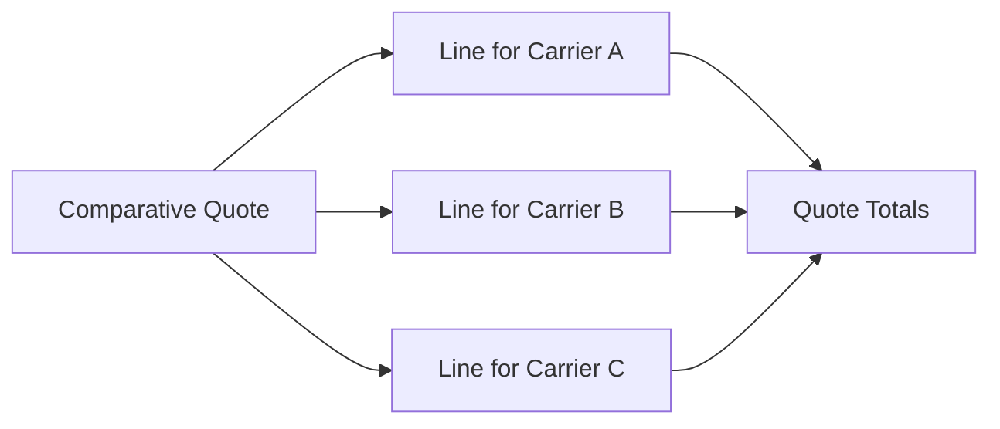

### Accepted Line as Policy Basis

When the client accepts an offer, one line on the quote is designated as the accepted choice. On binding, that accepted line — not the quote as a whole — becomes the basis for the new policy:

- its product and carrier snapshot identify the insurer behind the policy
- its coverage selections seed the policy's coverage schedule
- its premium, broker fee, and taxes carry forward as the policy's opening amounts

Only one line can serve as this basis. Unaccepted lines remain attached to the quote purely as evidence of the comparison, and are never silently promoted if circumstances change — a different line becomes the basis only through a deliberate new choice.

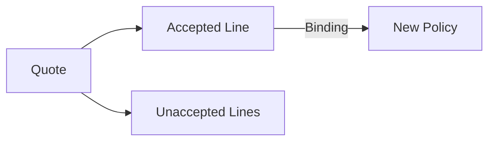

### Roll-Up to Quote Totals

The money shown on the quote header is the sum of its lines. Total premium equals the combined line premiums, the total broker fee equals the combined line fees, the tax amount equals the combined taxes, and the grand total is their overall sum in Canadian dollars.

Because the totals are derived this way, the quote summary and its detailed lines can never disagree: adding, removing, or adjusting any line moves the totals with it. A quote with no lines yet shows zero across all totals. This roll-up keeps the figure a client sees on a proposal headline consistent with the per-carrier detail beneath it.

## Submission Concept

A Submission represents sending a quote line to a carrier for consideration and tracking that request through to a response. Submissions are tracked per carrier on a quote and stand in a status among pending, sent, acknowledged, quoted, or declined. Each submission records the carrier's reference number so staff can cite it in follow-ups, along with messages or notes exchanged and timestamps marking progress. In this version carriers are not integrated electronically, so a submission is essentially a disciplined record of an out-of-band request with its outcome noted manually. Submission status changes raise notifications so producers learn promptly when a carrier responds. A positive response lets the quote advance toward binding, while a decline sends the broker back to the remaining comparative lines.

### Submission

A submission is the brokerage's record of asking one insurance carrier to consider providing coverage for a client, together with the outcome of that request. When a producer wants a carrier's appetite tested against the coverage described on a quote, the brokerage opens a submission naming that carrier. Because quotes are comparative — several carriers courted side by side — a single quote typically carries one submission per carrier, each progressing independently.

The submission is the unit of carrier submission tracking: from the moment a request is contemplated through dispatch, acknowledgement, and eventual response, every development is captured on the submission itself. It inherits its business context from its quote — the client seeking coverage, the organization doing the placing, and the producer responsible for the pursuit — while adding the carrier-facing dimension of who was asked, what was exchanged, and where the conversation stands.

### Submission Statuses and Recorded Conversation Details

A submission stands in exactly one of five statuses at any time:

| Status | Meaning |
|--------|---------|
| pending | The submission exists but the request has not yet been put before the carrier. |
| sent | The request has been dispatched to the carrier by some channel. |
| acknowledged | The carrier has confirmed receipt or otherwise engaged with the request. |
| quoted | The carrier has responded with an offer worth considering. |
| declined | The carrier has refused the risk or will not provide terms. |

A submission normally begins pending, moves to sent once dispatched, may pass through acknowledged when the carrier signals engagement, and concludes either quoted or declined. Some carriers answer directly without a formal acknowledgement, so a submission simply reflects whichever milestones genuinely occurred. These five values belong to the submission alone; the surrounding quote follows its own separate workflow vocabulary (defined in Quote Concept).

```mermaid
flowchart LR
    P["pending"] -->|"request dispatched"| S["sent"]
    S -->|"carrier engaged"| A["acknowledged"]
    S -->|"refusal received"| D["declined"]
    S -->|"offer received"| Q["quoted"]
    A -->|"offer received"| Q
    A -->|"refusal received"| D
```

When a carrier takes a request into its consideration process, staff record the reference number the carrier assigns to it. This reference number is not expected while the submission is merely pending, since no carrier identifier exists before first contact. Once present, it becomes the handle for later contact — quoting questions and follow-ups cite it, keeping conversations anchored even when different staff members correspond with the carrier over time.

Alongside the status and reference number, each submission preserves messages or notes exchanged with the carrier — what was asked, what was replied, any conditions raised — and a timestamp marking each progress point: when the request went out, when receipt was confirmed, and when terms arrived or a refusal was noted. Together these give a submission a self-contained history, so a producer returning weeks later, or a colleague stepping in, knows precisely where the negotiation stands.

### Manual Out-of-Band Requests and Response Outcomes

BrokerDesk does not connect to carriers electronically in this version. A submission is therefore a disciplined record of a request carried out out-of-band — an email drafted by the producer or a phone call made outside the system — with each milestone entered manually by staff afterwards. The system never presumes the carrier has seen anything until someone records that it was sent, nor that a reply exists until someone notes it. Because every brokerage follows the same status vocabulary and records the carrier's reference number, the collective record behaves like a coordinated picture of carrier interest even though the underlying exchanges happen by ordinary correspondence.

Whenever a submission's status changes, the system raises a notification (as defined in Notification Concept) addressed to the producer pursuing the quote, so an arriving offer or refusal surfaces promptly instead of waiting to be discovered in the file.

The two concluding outcomes steer the pursuit differently. A quoted response hands the producer a live carrier position to weigh against the other comparative lines; if accepted, it lets the quote advance toward binding, from which the policy is born (see Policy Concept). A declined response closes that carrier avenue and returns attention to the remaining lines on the quote — carriers still under consideration, or new ones to court. Either way, the submission's dated history remains as evidence of what each carrier was asked and what it answered.

## Policy Concept

A Policy represents in-force insurance coverage placed for a client, whether born from an accepted quote or entered manually when a book of business is rolled over from another system. Each policy identifies the insured client, the carrier, the product, and the producing broker, and carries an organization-generated policy number and optionally the carrier's own policy number. A policy runs between a term start and term end date and stands in one of several states: active, pending cancellation, cancelled, expired, or lapsed. Financial attributes include billed premium, broker fee, and taxes, all in Canadian dollars, plus a payment plan of annual, semi-annual, quarterly, or monthly instalments. The province where the risk sits is recorded because it drives tax and regulatory handling. Policies anchor downstream life: endorsements adjust them mid-term, cancellations end them early, renewals extend them, invoices bill them, and commissions reward them. Soft deletion keeps retired records recoverable.

### What a Policy Represents

<p>A <strong>policy</strong> is the record of insurance coverage that is genuinely <em>in force</em> for a client. A quote, however detailed, remains only a proposal until it is accepted; a policy comes into existence once placement is bound and the carrier stands behind the coverage.</p>
<p>Every policy identifies four parties at a glance:</p>
<ul>
<li>the <strong>insured client</strong> whose risk is covered,</li>
<li>the <strong>carrier</strong> providing the coverage,</li>
<li>the <strong>product</strong> that was purchased, and</li>
<li>the <strong>producing broker</strong> who placed it.</li>
</ul>
<p>The exact protections in force are itemized on the policy's coverage schedule — one line per coverage carrying its limit, deductible, and premium, built from the coverage catalogue of the purchased product. The schedule itself is described in the PolicyCoverage Concept and is not repeated here.</p>
<p>Like every business record in the platform, a policy belongs to exactly one organization (see Organization Concept).</p>

### How a Policy Comes into Existence

<p>Policies enter the system through one of two doors, and both lead to the same kind of record.</p>
<p><strong>Born from a bound quote.</strong> When a quote reaches its bound state and is accepted, the policy is brought into existence in a single all-or-nothing step: the winning comparative lines become the new policy's coverage schedule, and the quoted premium, broker fee, and tax amounts carry across unchanged. The client, carrier, product, and producer named on the quote become the parties of the policy. If any part of this step cannot complete, no half-formed policy is left behind.</p>
<p><strong>Manual entry for book-roll.</strong> When a brokerage moves an existing book of business over from another system, staff enter policies directly, recording each contract's terms as they stand today — current term dates, premium, and coverages — without passing through a quote first. Prior-system history is not reconstructed; the migrated policy simply continues forward from the moment it is entered.</p>
<p>Whichever door is used, the resulting record behaves identically afterwards: billing, mid-term changes, cancellation, and renewal treat a book-rolled policy exactly like one born from a quote.</p>

### Policy Numbers

<p>Each policy carries two independent numbers that may coexist on the same record:</p>
<ul>
<li>An <strong>organization-generated policy number</strong>, assigned by the brokerage itself and unique within its organization, so staff can refer to the placement even before any carrier paperwork arrives.</li>
<li>A <strong>carrier policy number</strong>, recorded once the carrier issues its own number for the placement — the number carriers print on certificates, schedules, and commission statements.</li>
</ul>
<p>A book-rolled policy entered manually carries whichever of these numbers the source paperwork shows; neither is mandatory at entry time, and the carrier-issued number may be added later when it becomes known.</p>

### Term and Lifecycle States

<p>Every policy runs for a defined term bounded by two dates: the <strong>term start</strong>, on which coverage takes effect, and the <strong>term end</strong>, on which the written period finishes. These dates frame whether coverage is currently live, when a renewal conversation must begin, and how far mid-term changes can reach.</p>
<p>At any moment a policy stands in exactly one of five states:</p>
<table>
<thead><tr><th>State</th><th>Meaning</th></tr></thead>
<tbody>
<tr><td><strong>Active</strong></td><td>Coverage is in force exactly as written on the schedule.</td></tr>
<tr><td><strong>Pending cancellation</strong></td><td>A cancellation has been arranged but its effective date has not yet arrived; coverage continues until then.</td></tr>
<tr><td><strong>Cancelled</strong></td><td>The policy was terminated before its term end; the reason and any money owed back live on the cancellation record itself.</td></tr>
<tr><td><strong>Expired</strong></td><td>The term ran naturally to its end date with no continuation in place.</td></tr>
<tr><td><strong>Lapsed</strong></td><td>Coverage fell away without a formal cancellation record — pragmatically, because required payments never arrived.</td></tr>
</tbody>
</table>
<pre><code class="language-mermaid">flowchart LR
    A[&quot;Active&quot;] --&gt;|&quot;Cancellation arranged&quot;| B[&quot;Pending Cancellation&quot;]
    B --&gt;|&quot;Cancellation takes effect&quot;| C[&quot;Cancelled&quot;]
    C --&gt;|&quot;Reinstatement allowed&quot;| A
    A --&gt;|&quot;Term end reached&quot;| D[&quot;Expired&quot;]
    A --&gt;|&quot;Coverage falls away&quot;| E[&quot;Lapsed&quot;]</code></pre>
<p>This definition fixes only what each state means; the permitted movements between states are governed centrally in the state-transition sections. Reinstatement — restoring a cancelled policy to active where circumstances allow — belongs to the Cancellation Concept.</p>

### Financial Attributes and Province of Risk

<p>The money side of a policy is kept explicit and separate:</p>
<ul>
<li>The <strong>billed premium</strong> charged for the term.</li>
<li>The <strong>broker fee</strong> the brokerage adds as its own service charge, always shown distinctly rather than folded into the premium.</li>
<li>The <strong>taxes</strong> owed on top of both.</li>
</ul>
<p>All three amounts are expressed in Canadian dollars, consistent with the currency used across the platform.</p>
<p>Tax treatment follows the <strong>province of risk</strong> — the province where the insured risk actually sits. This can differ from the client's mailing address or the brokerage's home province, which is why the policy records the risk location separately: applicable provincial tax handling follows where the risk lives, not where paperwork is sent.</p>
<p>A policy also records how its charges are collected through a <strong>payment plan</strong>: a single annual amount, or instalments split semi-annually, quarterly, or monthly. The chosen plan shapes how invoicing spreads the term's cost over time and pairs with the settlement behaviour described in the Payment Concept.</p>

### Hub for Downstream Records

<p>A policy is the connective point between coverage sold, money billed, and earnings earned. Its life story attaches directly to it:</p>
<ul>
<li>An <strong>endorsement</strong> amends the policy mid-term — adjusting coverages, premium, or fees while the term runs (Endorsement Concept).</li>
<li>A <strong>cancellation</strong> ends the policy early, with reinstatement able to reverse it where circumstances allow (Cancellation Concept).</li>
<li>A <strong>renewal</strong> carries an expiring policy into the next term, linked back to the prior policy (Renewal Concept).</li>
<li><strong>Invoices</strong> bill the client for the policy's premium, fee, and taxes (Invoice Concept).</li>
<li><strong>Commissions</strong> credit the agency and the producing broker from the placement (Commission Concept).</li>
</ul>
<p>Documents such as schedules and certificate placeholders also attach to policies, as described in the Document Concept. When a policy is retired it is removed softly rather than erased outright, keeping retired records recoverable; broader expectations for lifecycle, retention, and recovery are defined in the lifecycle-and-retention concepts.</p>

## PolicyCoverage Concept

A Policy Coverage represents one line of protection actually written onto an issued policy, recording the limit and deductible in force along with the portion of premium attributable to it. Coverage schedule lines translate the product catalog's coverage items into concrete terms for this particular client and term. The schedule shows at a glance what is covered, up to what ceiling, subject to what retention, and at what cost. Limits and deductibles may differ from catalog defaults because they were negotiated during quoting or adjusted by endorsement. The coverage schedule also supplies the substance for certificates and policy schedule documents when templates render them.

### Policy Coverage Line

A policy coverage line records one specific protection actually written onto an issued policy. Where the product's coverage catalog (see Coverage Item Concept) describes protections a product *can* offer in general terms, a coverage line states what a particular client's policy *does* include for the current term. Each line belongs to exactly one policy and has no meaning apart from it.

Every policy coverage line carries the following attributes:

- **Coverage name and code** — drawn from the catalog's shared vocabulary (defined in Coverage Item Concept), so a protection reads identically whether it appears on a quote or on the issued policy
- **Limit in force** — the maximum amount the carrier will pay for that protection during the term
- **Deductible in force** — the amount retained by the client before the protection responds
- **Coverage-level premium** — the portion of the policy's billed premium (defined in Policy Concept) attributable to that individual line

Each line mirrors one of the coverage items chosen from the product's catalog: the catalog item supplies the identity of the protection, while the policy line supplies the concrete values agreed for this particular contract.

### Coverage Schedule — Limits and Deductibles in Force

The **coverage schedule** is the complete list of a policy's coverage lines viewed together. Read top to bottom, it answers four questions at a glance: what is protected, up to what ceiling, subject to what retention, and at what cost.

**Limits and deductibles in force.** For each line, the limit in force is the maximum payable under that protection while the policy runs, and the deductible in force is the portion that remains with the client before the protection responds. These are the currently applicable values for this policy — not generic starting points.

**Catalog defaults adjusted at issuance.** The coverage catalog publishes a default limit for every coverage item (defined in Coverage Item Concept), but that default only seeds the conversation. By the time a quote binds into a policy, each line's limit and deductible reflect what was actually agreed: the accepted quote line's coverage selections (defined in Quote Line Concept) carry their adjusted values straight onto the newly created policy at issuance. A later mid-term amendment through an endorsement (see Endorsement Concept) adjusts a line again going forward. In either case the schedule always presents the value that governs today.

**Concrete terms per client and term.** Two policies written under the same product can show different limits, deductibles, and premiums for identically named coverages, because each schedule captures that client's particular negotiated outcome. The schedule is anchored to the policy's term start and term end (defined in Policy Concept): it describes exactly one period, and a renewal's next-term policy receives its own freshly recorded schedule (see Renewal Concept).

```mermaid
flowchart LR
    A["Catalog default limit"] -->|"Seeds negotiation"| B["Negotiated coverage selection"]
    B -->|"Carried onto bound policy"| C["Policy coverage line"]
    C -->|"Lines collectively form"| D["Coverage schedule"]
    D -->|"Supplies substance"| E["Certificate and policy schedule documents"]
```

### Feeds Certificate and Policy Schedule Documents

When a brokerage renders certificate or policy-schedule documents from its templates (template kinds defined in Document Template Concept), the rendered protection list is drawn directly from the policy's coverage lines: each entry shows the coverage name, the limit in force, the deductible in force, and — where the document calls for it — the coverage-level premium.

Certificates and policy schedules are routinely handed to parties outside the brokerage, such as lenders, landlords, or other insurers, so whatever the coverage schedule records is exactly what those recipients will read. Because the coverage lines are the single source feeding these documents, keeping the schedule accurate keeps every generated certificate and policy schedule accurate by extension. How templates render documents is governed by the functional requirement files.

## Endorsement Concept

An Endorsement represents a mid-term change to an in-force policy, such as adding a driver, raising a limit, or updating a risk address. Each endorsement records its type, its effective date, and a description of what changes, together with the resulting premium delta and fee delta in Canadian dollars. An endorsement begins as a draft and becomes issued once confirmed, at which point the policy's financials reflect the adjustment. The staff member who made the change is recorded for accountability. Endorsements can generate their own commissions proportional to the premium change, linking revenue to mid-term adjustments as well as new business. Issued endorsements feed amended documents such as updated schedules so clients hold paperwork matching reality.

### Endorsement as a Mid-Term Policy Change

An Endorsement represents a modification made to an in-force Policy during its current term — for example adding a driver to an automobile policy, raising a coverage limit, or updating a risk address. The Policy keeps its identity throughout: the Endorsement amends it rather than replacing it.

Within the domain, three distinct concepts handle post-issuance change, each with a different purpose. A Cancellation ends coverage early (see Cancellation Concept). A Renewal carries coverage forward into a new term under a fresh Policy (see Renewal Concept). An Endorsement is the middle path — it keeps the same Policy alive and adjusts its contents inside the current term.

Because the change occurs mid-term, its financial effect is expressed as a difference rather than a full reprice: premiums and fees move by their deltas instead of billed amounts being replaced outright.

### Endorsement Type and Description

Every Endorsement records a type identifying the category of change being made, together with a plain-language description of what is being altered. Typical examples drawn from brokerage practice include adding or removing a driver, raising a limit, lowering a deductible, or correcting a risk address.

The type gives the change a stable classification, while the description supplies the human-readable explanation that survives on the Policy's history and flows onto amended paperwork. Together they ensure that anyone reviewing the Policy later — another staff member or the client — understands exactly what changed and why.

### Effective Date and Financial Deltas

The effective date states when the change takes hold within the Policy's current term. Unlike the desired effective date carried on a Quote (defined in Quote Concept), an Endorsement's effective date always falls inside the term of the Policy it amends — it cannot reach beyond the coverage it is modifying.

Each Endorsement also carries a premium delta and a fee delta, expressed in Canadian dollars. These are signed amounts: a positive premium delta means the client owes more because coverage expanded, while a negative one means value returns to the client because coverage shrank. The fee delta adjusts the broker fee by the same logic. Once the Endorsement is issued, the Policy's financials reflect these adjustments on top of the originally billed amounts.

### Draft-to-Issued Status

An Endorsement lives in a simple two-state progression: it begins as a draft while being prepared, and becomes issued once confirmed. While in draft, the recorded change is inert — the Policy's coverage and financials are untouched, and the draft can still be revised freely as details are worked out.

Issuance is the moment of commitment. At that point the premium delta and fee delta take effect against the Policy, the amendment becomes part of the Policy's permanent record, and downstream artifacts such as commissions and amended documents follow.

```mermaid
flowchart LR
    A["draft"] -->|"Confirm"| B["issued"]
```

### Endorsement-Driven Commission

When an issued Endorsement changes the Policy's premium, it can generate a Commission of its own, calculated proportionally to the premium delta using the same agency-rate and producer-split conventions defined for regular placements in the Commission Concept. A mid-term increase therefore earns additional commission for the producing staff member, and a mid-term decrease correspondingly reduces it — keeping earnings aligned with the actual book of business rather than only with new business.

Commissions arising this way stay linked to the originating Endorsement, so statements and reporting can tell adjustment-driven revenue apart from new-business revenue.

### Amended Policy Documents

An issued Endorsement feeds the Policy's paperwork. Amended policy documents — most importantly updated coverage schedules reflecting the new limits, deductibles, and premiums — are produced so the client holds documentation matching reality. These outputs follow the behaviour defined in the Document Concept and DocumentTemplate Concept, rendered through organization templates and stored alongside the Policy's other records.

### Change Accountability

The staff member who made the change is recorded on every Endorsement, so any mid-term adjustment can always be traced back to the person who initiated it. This per-record attribution complements the broader append-only change history described in the AuditLog Concept.

## Cancellation Concept

A Cancellation represents the early termination of a policy before its term naturally ends. It records the effective date of termination, the reason coverage is ending, and any return premium owed back to the client. Recording a cancellation places the policy in a pending-cancellation then cancelled condition so everyone sees the coverage is closing. Return premiums and commission clawbacks tie into billing and commission handling so the books match reality. Where circumstances allow, reversing a cancellation returns the policy to force, acknowledging mistakes or changed minds. Keeping cancellation reasons on record helps brokerages spot patterns such as price-driven losses.

### Cancellation and Early Policy Termination

A Cancellation represents the deliberate ending of an insurance policy before its term naturally runs out. It differs from letting a policy expire at term end or lapse on its own path: a cancellation is an intentional early termination, taken when a client places their coverage elsewhere, their insured situation changes, or the brokerage and client agree to part ways mid-term.

Every cancellation preserves three descriptive facts about the termination:

- **Cancellation effective date**: the point at which coverage actually stops. It may fall before, on, or after the day the cancellation is recorded, but it always sits inside the policy term being ended.
- **Cancellation reason**: a plain-language explanation of why coverage is ending, kept so any staff member can understand the departure later without hunting for context.
- **Return premium amount**: any portion of the prepaid premium owed back to the client because coverage stopped early; this may legitimately be nothing depending on the circumstances (detailed in "Return Premium and Billing and Commission Impact").

Because every cancellation keeps its reason on record, a brokerage gradually accumulates a searchable history of why clients leave. Reading that history surfaces loss patterns — departures clustering around certain carriers, products, or pricing — turning individual terminations into retention insight, such as recognizing losses driven by price rather than service.

### Return Premium and Billing and Commission Impact

When a policy ends partway through its term, some of the premium collected up front may be unearned and owed back to the client. The cancellation captures this return premium amount, which may range from a full refund of the remaining term down to nothing at all, depending on the circumstances of the termination. Recording it keeps the brokerage's books aligned with reality: money collected in advance is reconciled against money given back once coverage stops.

The financial effect reaches two neighbouring domains:

- **Billing impact**: the return premium flows into the client's invoicing picture alongside the invoices and payments described in the Invoice Concept and Payment Concept, so credits and refunds line up with what was originally billed.
- **Commission impact**: agency and producer earnings calculated on the cancelled premium do not simply stand. Earnings tied to the returned premium move toward clawback handling — a commission status described in the Commission Concept — so reported earnings match what economically happened rather than what the original placement promised.

### Pending-Cancel Then Cancelled Condition and Reinstatement

Recording a cancellation does not cut off coverage instantly. The affected policy first enters a pending-cancel condition, signalling to everyone that termination has been booked but is not yet in force — most meaningful when the cancellation effective date lies ahead. Once that date arrives, the policy settles into the cancelled condition: coverage has ended and no further mid-term activity applies to it.

These conditions sit apart from the other ways a policy leaves force. A policy whose term simply runs out expires, and a policy that drops away on its own lifecycle path lapses; neither carries the deliberate act, recorded reason, and possible return premium that define a cancellation. All resting states of a policy are catalogued under the Policy Concept.

Where circumstances allow, a cancellation can be reversed. Reinstatement undoes the termination and returns the policy to active coverage, restoring it as though the cancellation had never stood — the escape hatch for booking mistakes or a client changing their mind before other arrangements take hold. Whether reinstatement is permitted depends on the individual situation, so the domain treats it as a conditional path rather than a guaranteed outcome. When a policy does come back into force, any return premium already settled against the cancellation must be accounted for so that premium, invoice, and commission records once again agree with the revived coverage.

```mermaid
flowchart LR
    A["Policy in force"] -->|"Cancellation recorded"| B["Pending cancel"]
    B -->|"Effective date reached"| C["Cancelled"]
    C -->|"Reinstatement when allowed"| A
```

## Renewal Concept

A Renewal represents the effort to continue a policy into its next term rather than letting coverage lapse. A renewal links to the prior policy and records the offered premium for the coming term together with a status among scheduled, offered, accepted, rewritten, non-renewed, or lost. Renewals begin as scheduled candidates, often surfaced automatically as policies approach their term end within a chosen look-ahead window. When a client accepts an offer, the next-term policy is generated from the renewal so continuity is preserved with fresh dates. The rewritten, non-renewed, and lost outcomes distinguish reworked placements from business deliberately dropped or taken elsewhere. Tracking renewals as first-class records lets the brokerage measure retention and plan workload ahead of the busy season.

### What a Renewal Represents

A Renewal is the business record of an effort to continue a client's policy into its next term rather than letting coverage lapse when the current term ends. Where a cancellation ends coverage early, a renewal is the opposite motion: carrying the client across the boundary between terms so protection never silently stops.

Every continuation attempt is captured as its own record, whether it succeeds or fails, so the brokerage builds a complete year-over-year history of how well it retains clients. Each renewal holds the essential facts of that attempt: the prior policy being continued, the premium offered for the coming term, and a status among scheduled, offered, accepted, rewritten, non-renewed, and lost.

### Link to the Prior Policy

Every renewal points to exactly one prior policy whose term is ending. Through this link the renewal inherits the full placement context — the client served, the carrier and product involved, and the assigned producer — so staff reviewing a renewal never need to guess what is being continued.

The link also forms a chain across years. When a renewal succeeds, the newly created policy can itself become the prior policy of a future renewal, tracing a client's continuous coverage from one term to the next, including the moments where the business was rewritten or lost.

### Offered Premium

The offered premium is the price proposed to the client for the coming term, recorded directly on the renewal. It commonly differs from the prior term's billed premium because carrier rates, risk details, or selected coverages may change between years.

Keeping the offered premium on the renewal preserves exactly what was put in front of the client and lets staff compare what was asked against what was ultimately accepted, declined, or reworked.

### Renewal Statuses and Outcomes

A renewal moves through six statuses that describe both the stage of work and the commercial outcome:

- **Scheduled** — the continuation has been identified as upcoming work; no offer has been presented to the client yet.
- **Offered** — the offer for the coming term has been extended to the client, who has not yet responded.
- **Accepted** — the client agreed to the offered terms, and the next-term policy is generated.
- **Rewritten** — the business was retained, but through a reworked or re-placed arrangement rather than a straightforward continuation of the same terms.
- **Non-renewed** — the brokerage deliberately chose not to offer continuation of the coverage.
- **Lost** — the client declined the offer and took the coverage elsewhere or let it lapse.

Together these values distinguish successful retention (accepted, rewritten) from business deliberately dropped (non-renewed) or taken elsewhere (lost). A renewal reaches exactly one terminal outcome: accepted, rewritten, non-renewed, or lost.

```mermaid
flowchart LR
    A["Scheduled"] -->|"Offer extended"| B["Offered"]
    B -->|"Client agrees"| C["Accepted"]
    B -->|"Placement reworked"| D["Rewritten"]
    B -->|"Brokerage declines continuation"| E["Non-renewed"]
    B -->|"Client goes elsewhere"| F["Lost"]
```

The detailed rules governing who may move a renewal between these statuses belong to the functional requirements; this section fixes the meaning of each value.

### Automatic Candidate Detection Near Term End

Renewals begin life as scheduled candidates. The system surfaces a policy as a renewal candidate automatically once its term end falls within a look-ahead window measured in days, so continuation work starts before coverage runs out rather than after.

This detection ensures no in-force policy quietly lapses simply because nobody remembered to review it, and it gives producers early visibility of the continuations approaching within their book of business.

### Next-Term Policy Generated on Acceptance

When the client accepts an offered renewal, the next-term policy is generated from it. The generated policy carries the placement forward — same client, carrier, product, and producer — rolling the coverage schedule onto fresh dates beginning where the prior term ended, with the offered premium serving as its starting billed amount.

The renewal itself remains as the bridge between generations: it still points back to the prior policy it continued and stands behind the next-term policy it created. Accepting an offer therefore never loses history — the old term, the offer, and the new term stay visibly connected.

### Retention Measurement and Workload Planning

Because every continuation attempt ends in exactly one recorded outcome, the renewal record is the raw material for measuring retention. Comparing accepted and rewritten outcomes against lost and non-renewed ones shows how well the brokerage keeps its clients — overall, and broken down by producer, client, carrier, or line of business.

The same records support workload planning. The pool of scheduled and offered renewals gives a forward-looking view of the decisions and offers still owed to clients, letting the brokerage staff up ahead of the busy season instead of reacting to expirations as they arrive.

## Invoice Concept

An Invoice represents a request for money sent by the brokerage to a client for premiums, fees, or other charges, denominated in Canadian dollars. Each invoice carries an invoice number, an issue date, and a due date, and may relate to a specific policy or stand alone. Status progresses among draft, sent, partially paid, paid, and void, mirroring how collection advances. Totals comprise a subtotal, tax, and grand total derived from the invoice's lines. Payments settle invoices progressively, and voiding withdraws an erroneous invoice from collection while preserving its trail. Invoices give the brokerage a receivables picture: who owes what, and since when.

### Invoice as a Client Receivable

An Invoice is the brokerage's formal request for money from a client. It captures amounts the client owes for premiums under a policy, broker fees, or other charges, all denominated in Canadian dollars.

Issuing an invoice creates a receivable: a claim the brokerage holds against the client until the money is collected. The invoice is therefore the anchor for everything that follows — recording payments against it, tracking its outstanding balance, and reporting on money owed.

Key characteristics:

- An invoice always bills exactly one client within the brokerage's organization.
- Every monetary amount on an invoice, including its lines, taxes, and grand total, is expressed in Canadian dollars (CAD).
- An invoice may support one policy or stand entirely on its own (see "Policy-Linked and Standalone Invoices").
- The money actually charged is itemized on the invoice's lines (defined in InvoiceLine Concept), never held only as a lump figure.

The invoice itself answers three questions at any moment: how much was asked for, how much has been collected, and how much remains outstanding.

### Invoice Number, Issue Date, and Due Date

Each invoice carries an invoice number that identifies it uniquely within the organization, so staff and clients can refer to an unambiguous document when discussing charges, payments, or discrepancies.

Two dates govern an invoice's collection timeline:

- Issue date: the date the invoice enters circulation and collection formally begins. Amounts and lines are fixed from this point onward.
- Due date: the date by which the client is expected to settle the invoice in full. It always falls on or after the issue date.

These dates together define timeliness of collection. Once the current date passes the due date and the invoice still carries an unpaid balance, the invoice is considered overdue. The combination of invoice number, issue date, and due date lets the brokerage speak precisely about who owes what and since when.

### Policy-Linked and Standalone Invoices

An invoice may relate to a specific policy, or it may stand alone with no policy behind it.

A policy-linked invoice bills the charges arising from an insurance placement or amendment — the billed premium for a term, broker fees, or adjustments flowing from endorsements or cancellations on that policy. Linking the invoice to the policy ties the receivable back to the coverage that generated it, so collections can be traced from the money owed to the placement responsible.

A standalone invoice bills charges that have no backing policy — for example, a service or broker fee invoiced to a client independent of any placement. It behaves identically in every other respect: same numbering, dates, statuses, totals, and payment handling.

Both kinds coexist naturally in the receivables picture: what matters to collection is the client who owes the money, not whether a policy happens to sit behind the charge.

### Invoice Status Lifecycle

An invoice moves through a small set of collection statuses: draft, sent, partially paid, paid, and void.

- Draft: the invoice is being prepared and has not yet been presented to the client. Its contents may still change freely.
- Sent: the invoice has been issued to the client and collection is underway. This is the state in which the receivable actively counts toward money owed.
- Partially paid: one or more payments have been applied, but an outstanding balance remains.
- Paid: the grand total has been fully settled. This is a terminal state — the invoice stands as a complete record of collected money and is not withdrawn afterwards.
- Void: the invoice was raised in error and has been withdrawn from collection (see "Voiding Erroneous Invoices"). Also terminal.

Progression is forward-moving: an invoice never returns to draft once issued, and a voided or paid invoice does not re-enter circulation.

```mermaid
flowchart LR
    A["Draft"] -->|"Issue to client"| B["Sent"]
    B -->|"Partial payment applied"| C["Partially paid"]
    C -->|"Outstanding balance settled"| D["Paid"]
    B -->|"Grand total settled"| D
    A -->|"Withdrawn as erroneous"| E["Void"]
    B -->|"Withdrawn as erroneous"| E
    C -->|"Withdrawn as erroneous"| E
```

### Invoice Totals in Canadian Dollars

An invoice's headline figures are derived from its lines rather than entered independently: the subtotal is the sum of all line amounts, the tax is accumulated from each line's calculated tax, and the grand total is the subtotal plus the tax.

Because individual lines carry their own tax code and the tax rate actually applied (defined in InvoiceLine Concept), the invoice-level tax correctly reflects provincial variation — the same charge can attract different tax depending on where it is taxed.

All figures are denominated in Canadian dollars. This holds regardless of the client's province or the type of charge, so every receivable in the system is comparable on a single currency basis.

### Invoices as Settlement Targets for Payments

Every payment the brokerage receives from a client is applied against a specific invoice — the invoice is the settlement target. Payments are never floating credits; each one reduces the outstanding balance of the invoice it settles.

The outstanding balance at any moment equals the grand total minus the payments applied so far. Because clients may pay in instalments or settle gradually (payment methods and timing are defined in Payment Concept), an invoice commonly passes through partial settlements before reaching paid.

Settlement behaviour in summary:

- Applying a payment reduces the invoice's outstanding balance immediately.
- Multiple payments may accumulate against the same invoice over time.
- When cumulative payments reach the grand total, the invoice becomes paid.
- A payment cannot be applied to a voided invoice, since a voided invoice is no longer in collection.

This anchoring of payments to invoices is what makes balances meaningful: the balance shown is always traceable to real money received.

### Voiding Erroneous Invoices

When an invoice turns out to be wrong — wrong client, wrong amount, duplicated issuance — it is not deleted. Instead it is voided: withdrawn from active collection while remaining permanently visible in the brokerage's history.

Voiding means:

- The invoice stops counting toward open receivables and no further payments may be applied to it.
- The invoice and any payments already applied to it remain on record, preserving a truthful trail of what was asked for and what was received before the error was caught.
- The void is a deliberate action taken by authorized staff, distinguishable from the invoice simply lapsing unnoticed.

Deletion is never used for invoices. The permanent record of voided invoices keeps the brokerage's books honest and provides the evidence trail expected of critical financial entities, consistent with the append-only change history kept for invoices (see AuditLog Concept).

### The Receivables Picture

Taken together — each invoice's grand total, its payments, and its status — give the brokerage a continuous receivables picture: who owes what, and since when.

The picture reads as follows:

- Open receivables are the invoices in sent or partially paid status, each contributing its outstanding balance.
- Overdue exposure is visible by comparing each open invoice's due date against the current date, highlighting clients whose balances have aged past expectation.
- Collected revenue is reflected by invoices reaching paid, with the payments that settled them.
- Withdrawn demands are set aside through void, without contaminating the open balance.

Because every invoice belongs to one client and one organization, this picture can be read for a single client's account or rolled up across the whole brokerage. It converts scattered charges and payments into a single answerable view of money owed to the business.

## InvoiceLine Concept

An Invoice Line represents one chargeable item on an invoice, described in plain language with its own amount. Every line assigns a Canadian tax code among GST, HST, QST, or exempt, and preserves the tax rate actually applied so historical documents remain reproducible even if rates change later. Lines make invoices transparent to clients by separating premium amounts from broker fees and other charges rather than burying them in one figure. Tax codes vary by province and by the nature of the charge, reflecting Canada's mixed sales-tax landscape. Summing line amounts and their taxes yields the invoice totals, so detail and summary always agree.

### Invoice Line

An Invoice Line represents one chargeable item presented on an invoice — a single, self-contained charge such as an insurance premium, a broker fee, or another billable service. While the invoice itself (see Invoice Concept) represents the overall receivable owed by a client, lines divide that receivable into readable parts so the client can see exactly what each portion of the balance pays for.

Every line belongs to exactly one invoice, and a typical invoice carries several lines covering premiums, fees, and other billable items. Each line conveys four pieces of information: a plain-language description of the charge, its own monetary amount in CAD, a Canadian tax code identifying the applicable sales-tax regime, and the tax rate actually applied when the invoice was issued.

### Chargeable Item Description and Amount

Each line states in plain words what is being charged — for example, a personal auto premium for a given term, a broker fee for the brokerage's service, or an adjustment arising from a mid-term policy change. The description is written for client-facing presentation: it must be understandable on its own, because rendered invoices reach clients without accompanying explanation.

Alongside the description, each line carries its own monetary amount expressed in CAD. The amount stands independently of every other line: each charge is stated and judged on its own merits. This one-description, one-amount pairing lets both the issuing staff and the receiving client verify an invoice at a glance, charge by charge, instead of trusting a single opaque figure.

### Canadian Tax Codes: GST, HST, QST, and Exempt

Every line carries exactly one tax code drawn from four fixed values: GST, HST, QST, and exempt. GST marks a charge taxable under the federal Goods and Services Tax alone. HST marks a charge taxable under a Harmonized Sales Tax that blends the federal tax with a participating province's portion into a single combined rate. QST marks a charge taxable under the Quebec Sales Tax, which coexists with GST rather than replacing it. Exempt marks a charge to which no sales tax applies.

The code is chosen per line rather than per invoice, because different charges appearing on the same document can legitimately fall under different tax regimes.

### Applied Tax Rate and Reproducible Historical Taxation

Beyond naming the tax regime, each line records the specific tax rate actually used when the invoice was issued. Statutory rates change over time, and looking up a rate fresh at viewing time would misstate past transactions.

By preserving the applied rate on the line itself, reproducible historical taxation becomes a built-in property rather than an after-the-fact reconstruction: the description, amount, tax code, and applied rate all travel together on every line. Consequently, any historical invoice can be reproduced exactly as originally billed. Reprints, client disputes, and audit reviews always display the original figures — never today's interpretation of yesterday's sale.

### Provincial Sales Tax Variation

Which tax code and rate apply to a given line depends on the province involved in the billing situation and on the nature of the charge. Canada's sales-tax landscape mixes regimes: some provinces participate in HST, Quebec applies QST alongside GST, the remaining provinces use GST alone, and particular charge types may be exempt outright.

Rather than fixing these combinations inside the application, each organization maintains its own configurable rate table within its organization settings that maps provinces and charge types to their applicable codes and rates. As a seeded default example, the table ships with Ontario HST at 13%. Because circumstances can differ from charge to charge, the appropriate code and rate are determined individually for each line, keeping every charge aligned with the rules that actually govern it.

### Separation of Premium and Broker Fee Charges

Insurance premiums and brokerage service fees are distinct kinds of charges with potentially different tax treatment, so they are never combined onto a single line. Premiums — the cost of coverage placed with a carrier — appear on their own lines, and broker fees — the brokerage's own service charges — appear on separate lines.

This separation serves three purposes. First, it keeps the client-facing document transparent: a client can tell what the insurance itself costs from what the brokerage charges for its services, instead of finding both buried inside one figure. Second, it keeps taxation correct, because broker fees are explicit and taxable according to provincial rules that may differ from the rules applying to premiums. Third, it preserves a clean premium picture for downstream purposes such as commission calculation, which draws on premium amounts (see Commission Concept).

### Line Roll-Up to Invoice Totals

The invoice's headline figures are derived from its lines and are never maintained independently of them. The subtotal equals the sum of every line amount; the overall tax equals the sum of the tax computed on each line using that line's own code and preserved rate; and the grand total in CAD equals the subtotal plus the tax.

Because the summary numbers are always the arithmetic result of the lines beneath them, detail and summary can never disagree: adjusting a line automatically adjusts the totals it feeds. The meaning of the invoice-level figures themselves — along with numbering, dating, and settlement status — is described in the Invoice Concept; what matters at the line level is that each line contributes its full, self-describing share — amount, code, and applied rate — to those totals.

```mermaid
flowchart LR
    L["Invoice lines"] -->|"Sum of line amounts"| S["Subtotal"]
    L -->|"Sum of per-line taxes"| T["Total tax"]
    S --> G["Grand total in CAD"]
    T --> G
```

## Payment Concept

A Payment represents money actually received against an invoice, moving it toward settled status. Each payment records the amount received, the method used among e-transfer, cheque, card, carrier-billed arrangement, or other, the moment it was paid, and a reference such as a cheque or transfer number. Payments apply to a specific invoice and accumulate until the balance clears, accommodating partial payments across multiple instalments. Capturing the same payment twice must not double-count money, so payment recording is designed to be safely repeatable. Carrier-billed arrangements acknowledge that some premium is collected by carriers directly rather than through the brokerage. Together, invoices and payments form the brokerage's cash picture.

### Payment Definition and Key Attributes

A Payment is the record of money actually received from a client against an invoice. An invoice declares what the client owes; a payment confirms what has truly arrived. Recording payments moves the invoice toward its settled state and keeps the brokerage's books honest.

A payment carries four key pieces of information:

- **Amount received**: how much money arrived, always expressed in Canadian dollars.
- **Method**: which channel delivered the funds — e-transfer, cheque, card, carrier-billed arrangement, or another means.
- **Paid-at moment**: when the money was actually received. This may differ from when staff later enter the record into the system, and the received moment is the one that matters.
- **Reference**: a human-readable identifier tying the record back to the real-world transaction, such as a cheque number or an e-transfer confirmation number.

Every payment applies against exactly one invoice. A payment never stands alone; its business meaning comes from reducing the balance of a specific client bill.

### Payment Methods and Direct Carrier Collections

The method records which of five recognized channels moved the money:

| Method | What it represents |
|---|---|
| E-transfer | Funds transferred electronically between the client and the brokerage |
| Cheque | A paper cheque, whose number serves as the natural reference |
| Card | A payment made by debit or credit card |
| Carrier-billed arrangement | Premium collected directly by the carrier from the client |
| Other | Any channel beyond the four above; the reference explains what occurred |

**Direct carrier collections** deserve emphasis. Many placements are billed directly by carriers, meaning the client pays the carrier rather than the brokerage. A payment recorded under the carrier-billed method therefore documents a collection performed outside the brokerage's own hands — it acknowledges that the money has been received by the carrier on the brokerage's behalf. Without recording these collections, invoices would remain open even after clients have already paid their premiums, painting a falsely alarming picture of unpaid bills.

### Invoice Settlement Through Partial Payments and Instalments

Invoices rarely settle in a single transaction. Clients following monthly or quarterly payment plans remit instalments, so several payments accumulate against one invoice until the total received equals the amount owed. Each instalment is recorded as its own payment with its own method, paid-at moment, and reference.

As payments land, the invoice advances through its lifecycle — from owing in full, to partially settled, to fully settled — using the invoice statuses defined in the Invoice Concept (draft, sent, partial, paid, void). Once accumulated payments cover the grand total, the bill is considered settled and no further money is expected against it.

```mermaid
flowchart LR
    A["Invoice issued"] -->|"Instalment received"| B["Partially settled"]
    B -->|"Remaining instalments"| C["Fully settled"]
    A -->|"Full amount at once"| C
```

### Safe Repeatable Payment Capture

Recording the same real-world money twice would overstate receipts and wrongly close balances, so capturing a payment is designed to be safely repeatable. When the identical payment is presented again against the same invoice — recognizable by its amount, method, paid-at moment, and reference — the system treats it as already recorded and applies the money only once.

Repeating a capture therefore produces exactly the same result as capturing once. This protects both invoice balances and the brokerage's books from accidental double-counting when staff re-enter information or retry a submission that already succeeded.

### Cash Position Picture

Invoices and payments together form the brokerage's **cash position picture**: invoices show what clients owe, payments show what has actually been received, and the difference between the two shows outstanding receivables at any glance. Settled invoices represent money already in hand; open balances identify who still owes and how much.

This cash picture is deliberately kept apart from earnings. Agency commissions earned from placements are tracked separately in the Commission Concept — the cash position answers "what money have we received", while commissions answer "what have we earned". Related questions, answered by different concepts.

## Commission Concept

A Commission represents the money the brokerage earns from placing business and the share of it owed to the producer who wrote it. Each commission ties to a policy and optionally to an endorsement, identifying the carrier, the producing broker, and the premium basis the calculation starts from. Amounts break down into the agency rate and agency amount earned by the brokerage, and the producer split rate and producer amount flowing to the individual. Commissions stand in a status among estimated, due, paid, or clawback, the last covering money returned when policies cancel early. Statement periods group commissions so statements can be produced per producer and period and marked paid. Commission records turn handshake arrangements with carriers into auditable, trackable income.

### What a Commission Represents

A Commission represents the money the brokerage earns from placing insurance business with a carrier, together with the share of that money owed to the producer who wrote the business.

Key characteristics:

- Every commission is anchored to a policy held within the organization; it cannot exist detached from placed business.
- Each commission identifies the carrier whose placement generated the income and the producing broker credited with the sale.
- A commission may additionally reference a specific endorsement when a mid-term policy change creates or adjusts an earning.
- Commission records turn informal handshake arrangements with carriers into auditable, trackable income: each record preserves who earned what, from which placement, and under which arrangement, so any dollar of income can be traced end to end from placement to settlement.
- Changes to commission records are captured in the organization's append-only audit history (defined in the Audit Log concept).
- Commissions track the carrier-to-brokerage side of the economics. They are distinct from the invoices and payments exchanged with clients, which are covered by the Invoice and Payment concepts.

### Agency Earnings: Premium Basis, Agency Rate, and Agency Amount

Each commission records three inputs that determine what the brokerage earns:

- **Premium basis**: the starting figure the calculation begins from. For a new policy this is the billed premium of the placed coverage; for an endorsement-driven commission it is the premium change introduced by that endorsement.
- **Agency rate**: the percentage of the premium basis the brokerage retains from the placement. The initial value comes from the product's commission schedule defaults (defined in the Commission Schedule concept) and can be adjusted on the individual commission record when a negotiated arrangement differs.
- **Agency amount**: the brokerage's actual earning, obtained by applying the agency rate to the premium basis.

All commission figures are expressed in Canadian dollars. Because basis, rate, and amount are stored together on the record, the origin of every earning remains explainable after the fact rather than relying on remembered arrangements.

### Producer Share of Commission: Split Rate and Producer Amount

The producer share of commission is the slice of the agency earnings passed on to the individual broker who wrote the business. It is described by two further values on the commission record:

- **Split rate**: the percentage of the agency amount allocated to the producer. As with the agency rate, the starting value comes from the product's commission schedule defaults (defined in the Commission Schedule concept) and may be adjusted per record.
- **Producer amount**: the producer's portion, obtained by applying the split rate to the agency amount. Whatever remains of the agency amount after the producer share is retained by the brokerage.

The producer credited on a commission is fixed at creation from the producer responsible for the underlying policy, so income remains attributable to the right individual for reporting and statement purposes even as books of business change hands.

### Commission Statuses: Estimated, Due, Paid, and Clawback

A commission stands in exactly one of four statuses that describe where its money stands:

- **Estimated**: the initial state. When business is bound or a policy is issued, a commission is first recorded as an estimate calculated from the applicable rates, before anyone has confirmed the earning.
- **Due**: the earning has been confirmed as payable and is ready to appear in settlement statements.
- **Paid**: settlement of the commission is complete and the record is financially closed.
- **Clawback**: the commission has been reversed because the policy was cancelled early and the carrier took commission back, proportionate to the return premium (see the Cancellation concept).

```mermaid
flowchart LR
    A["estimated"] -->|"earning confirmed"| B["due"]
    B["due"] -->|"settlement recorded"| C["paid"]
    B["due"] -->|"early cancellation reversal"| D["clawback"]
```

The status sequence gives the brokerage a faithful picture of expected income versus realized income: estimates show pipeline potential, due amounts show collectable income, paid amounts show banked income, and clawbacks show income surrendered on early cancellations.

### Statement Period Grouping and Marking Commissions Paid

Commissions are grouped by a statement period so that income can be reviewed and settled in batches rather than one record at a time.

- A statement period is a named span (such as a month) that many commissions share, allowing totals of agency amounts and producer amounts to be tallied per period.
- Commission statements are produced per producer and per period, so each broker sees exactly the earnings attributed to their own book within the period, and the brokerage sees the same picture organization-wide.
- Marking a commission paid records that settlement for that earning is complete. Through statement settlement, commissions move from due to paid, closing out the period's obligations to producers and confirming the corresponding agency income.
- Because grouping, filtering, and mark-paid all operate on the same period-labelled records, the result is a continuous, auditable trail of trackable income: every earning can be located by producer, period, carrier, and policy, and every settlement action leaves a visible mark in the record's history.

## DocumentTemplate Concept

A Document Template represents reusable branded wording the brokerage maintains for producing client-facing papers. Templates are scoped to one organization and come in kinds such as quote proposal, policy schedule, certificate of insurance, certificate, invoice, or custom. Each template holds a body written in markdown or HTML containing placeholder variables filled from real records at generation time, and declares whether it serves English or French readers. Rendering combines a template with chosen business records to produce finished content, which is stored as a document even where PDF output is simplified. Templates let brokerages standardize proposals and certificates instead of retyping letters each time, and locale-aware templates respect each client's language preference. Administrators own template upkeep so wording stays consistent firm-wide.

### Document Template

A Document Template is a body of reusable branded wording that a brokerage maintains for producing client-facing papers — proposals, schedules, certificates, invoices, and similar correspondence. Each template carries a human-readable name identifying its purpose within the firm.

Every template belongs to exactly one organization (see Organization Concept). A brokerage works exclusively with its own templates and never sees or borrows the wording of another firm, keeping each company's brand and legal voice separate.

Because template wording shapes what clients read, administrators own template creation and upkeep. Producers and service staff consume the papers templates produce; they do not rewrite the source wording themselves.

### Template Kinds

Each template declares a kind stating which business paper it produces:

- **Quote Proposal** — a client-facing presentation of quoted offerings for a prospect or client.
- **Policy Schedule** — a summary sheet of an in-force policy's coverages and amounts.
- **Certificate of Insurance (COI)** — proof that coverage is in force, often requested by third parties.
- **Certificate** — other certificate-style attestations beyond the COI.
- **Invoice** — billing paperwork presented to a client.
- **Custom** — any other branded correspondence the brokerage wishes to standardize.

A brokerage may hold several templates of the same kind — for example, differently worded certificates for different carriers or product families. The kind also indicates which family of business records can feed the template at generation time: a quote proposal draws from quote records, while an invoice template draws from invoice records.

### Template Body and Placeholder Variables

A template body is written once in markdown or HTML. Within the body, placeholder variables — written in double-brace notation, such as {{variables}} — mark the spots where live business data belongs: client names and addresses, coverage descriptions, premiums, fees, taxes, totals, dates, and producer signatures.

At generation time the system replaces each placeholder with the corresponding value taken from the real records selected for the render. A placeholder whose matching data cannot be found stays visibly marked in the rendered result rather than silently vanishing, so an incomplete paper is recognizable before anyone sends it to a client.

The body holds only wording and placeholders — no client data is stored inside the template itself. This separation lets one template serve any number of clients, quotes, policies, or invoices.

### Template Locales

Each template declares whether it serves English or French readers. Brokerages serving both language communities maintain parallel templates, one per locale, under the same kind.

When paperwork is generated for a client, the template matching that client's preferred language (defined in Client Concept) is used, so a French-preferring client receives French-worded proposals and certificates. If no template exists in the client's language, the brokerage's available templates for the kind are offered instead, and the choice remains visible to staff.

### Rendering Templates into Documents

Rendering is the act of combining one template with chosen business records to produce finished client-facing content. Staff select the template and the records to fill it — a quote, a policy, an invoice — and the system weaves the live values into the placeholder slots, yielding completed wording.

The rendered result is always captured as a Document attached to the relevant record (document attributes such as filename, format, size, integrity check, and versioning are defined in Document Concept), preserving an exact copy of what was issued. Where full PDF production is simplified, the rendered text or HTML is still retained, so the brokerage keeps evidence of the exact wording sent to clients.

Standardized templates spare staff from retyping letters and proposals for every placement and keep proposals, schedules, and certificates uniform regardless of which producer or service person issues them.

```mermaid
flowchart LR
    T["Document Template"] -->|"Combined with business records"| R["Rendered content"]
    R -->|"Captured as"| D["Document"]
```

## Notification Concept

A Notification represents a timely heads-up delivered inside the application telling a user something needs attention. Each notification names its intended user, carries a type, a title, and a body, and references the records concerned so following it lands somewhere useful. The system persists notifications for task due dates, expiring producer licences, policies approaching term end, renewals coming due, and submission status changes. A read marker distinguishes unseen alerts from those already handled, letting users triage their queue. Notifications concentrate scattered deadlines into one place so nothing important slips merely because nobody remembered to check. Email delivery may be stubbed in early versions while the in-app record remains the dependable source.

### Notification Concept

A Notification is a timely heads-up saved by BrokerDesk and addressed to one specific user, telling them something needs their attention. Instead of relying on people to remember deadlines or discover changes by browsing, the system raises the important moments — a task coming due, a licence nearing expiry, a submission changing status — to the person responsible.

Every notification names exactly one intended user, so accountability for acting on it is unambiguous. Each carries a type, a title, and a body describing what happened, and references the records concerned so following the alert lands somewhere useful. A read marker distinguishes alerts nobody has seen from those already handled.

Notifications are forward-looking prompts for action; the append-only audit log (described in its own section) is the backward-looking record of what changed. The system persists notifications for five kinds of events: task due dates, expiring producer licences, policies approaching term end, renewals coming due, and submission status changes.

### In-App Alert to a User

Notifications are delivered inside the application itself. Each user sees their own personal set of notifications while working in BrokerDesk, and one user's notifications are never visible to another user — an alert is private to the person it addresses.

Because every alert is saved as a durable record tied to its recipient, a user returning after time away still finds their accumulated notifications waiting, ordered so recent items stand out. Nothing depends on the user happening to be logged in at the exact moment something happens.

Email delivery is treated as a secondary channel that may be stubbed or simply recorded in early versions; the saved in-app record remains the dependable source of truth for what the user has been told.

### Notification Type, Title, and Body

Each notification describes its event through three human-readable parts:

- **Type** — the category of event that occurred (a task-due alert versus a licence-expiring alert, for example), letting a user tell at a glance what kind of matter needs handling.
- **Title** — a short summary that makes the entry recognizable at a glance within the notification list.
- **Body** — the explanatory detail behind the title, written so the user understands what happened and why it matters.

Together these parts make every entry self-explanatory without opening any other record first.

### References to Related Records

Every notification references the records concerned — the task that came due, the licence approaching expiry, the policy nearing its term end, the renewal awaiting a decision, or the submission that changed status. These references mean that following a notification takes the user straight to the record needing action, rather than leaving them to search for it.

Where several records share one story, a notification may carry more than one reference — a task-due alert also points to the client or policy the task is linked to, giving immediate context alongside the prompt.

### Task-Due Notification

Tasks carry a due date and an assignee (both described in the Task Concept). When an assigned task reaches its due date while still open, the system raises a notification addressed to the assigned user, so accountability follows the assignment.

The alert references the task itself and, where the task is linked to a client or a policy, carries those references too — the assignee learns not only that work is due but for whom. A task already finished or cancelled ahead of its due date warrants no alert, because nothing remains to act on.

### Licence-Expiring Notification

A producer licence carries an expiry date (described in the ProducerLicence Concept), and a lapse going unnoticed exposes the brokerage to regulatory risk. When a licence approaches or passes its expiry, the system raises a compliance alert addressed to the producer holding the licence.

The alert identifies the licence concerned and references the licence record, so its details — province, licence type, licence number, dates — can be reviewed immediately and renewed before the ability to place business is lost. Organization-wide visibility of expired and expiring licences additionally lives in the dashboard compliance summary, so administrators are not dependent on the individual alert to spot systemic lapses.

### Policy-Expiring and Renewal-Due Alerts

Two related deadline families follow the life of a policy:

- **Policy-expiring alert** — when an active policy approaches its term end (the term-end date is defined in the Policy Concept), the system raises an alert addressed to the producer responsible for that policy and referencing the policy record, so in-force coverage is not allowed to lapse unnoticed.
- **Renewal-due alert** — when a renewal comes due (a next-term continuation awaiting an outcome, described in the Renewal Concept), the system raises an alert addressed to the same responsible producer and referencing the renewal record, prompting them to move it toward acceptance, rewriting, or a deliberate decision to let it go.

Together these alerts turn expiring business into renewal conversations instead of silent losses: the first makes sure the moment is seen, the second makes sure the follow-through happens.

### Submission Status Change Alert

A submission tracks a quote's progress with a carrier (described in the Submission Concept), and its status changes are moments the responsible producer must know about — the carrier acknowledging the request, returning a quotation, or declining it.

When a submission changes status, the system raises a notification addressed to the producer who owns the quote. The alert names the new status and references the submission record, which holds the carrier reference number, so the producer can respond promptly instead of polling submissions manually or stumbling across the change days later.

### Read Versus Unread Tracking

Each notification carries a read marker, recorded as the moment it was read, separating unseen alerts from those already handled. An entry without a read marker stands on the user's outstanding list; marking it read settles the entry without erasing it, leaving it visible as handled history. This lets a user triage their notifications — act on the unread, skim the read — confident that nothing disappears before it has been seen.

Reading is personal: marking a notification read affects only that single entry for its one intended user.

```mermaid
flowchart LR
    A["Unread"] -->|"User reads the notification"| B["Read"]
```

## AuditLog Concept

An Audit Log represents the permanent record of who did what to critical business records and when. Entries capture the action taken among create, update, or delete, the type and reference of the affected record, and a human-readable summary of the change. The log is append-only: entries are written but never edited or erased, preserving trustworthy history. Critical entity families covered include clients, quotes, policies, endorsements, invoices, commissions, users, and products. Beyond operational accountability, auditing supports privacy obligations under PIPEDA by leaving evidence of access to sensitive client personal information where practical. For disputes, compliance reviews, or internal investigations, the audit log answers exactly what happened and on whose watch.

### Audit Log Concept

The Audit Log is the brokerage's permanent record of accountability: it answers who touched which critical business record, what they did to it, and when it happened. Every entry is captured on behalf of the organization whose record was affected, so each brokerage sees only its own history and no other tenant's.

The log is strictly append-only. A new entry is added whenever a critical record comes into existence, changes, or is removed, but once written, no entry can ever be revised or erased afterward — not by any role, and not even to correct a mistaken entry. If something must be corrected, the correction is itself recorded as a further entry, leaving the original intact. Because the past is never rewritten, the log reads as a faithful account of events exactly as they were observed at the time.

This permanence extends to removed business records. When a client, quote, policy, or document is soft-deleted and disappears from daily work, the audit entries describing its creation and subsequent changes remain in place. Removal affects visibility, not history.

```mermaid
flowchart LR
    A["Critical record created, updated, or deleted"] --> B["System identifies the actor and the affected record"]
    B --> C["A new audit entry is appended"]
    C --> D["Previously written entries remain permanently unchanged"]
```

### Anatomy of an Audit Entry

Every audit entry tells a complete story using a few consistent pieces:

- **The action**: one of three kinds — create, update, or delete — indicating whether the record came into existence, was modified, or was removed.
- **The affected record**: the type of business entity involved together with a reference pinpointing the exact record concerned, so a reviewer can locate the client, quote, policy, endorsement, invoice, commission, user, or product in question.
- **A human-readable change summary**: a short plain-language description of what actually happened — for example, which details moved from one value to another on an update — understandable by a non-technical reviewer without inspecting raw data.
- **The context of the event**: the staff member who performed the action and the occurred-at moment when it took place.

The auditing guarantee covers the critical entity families of the domain: clients, quotes, policies, endorsements, invoices, commissions, users, and products. Changes to any record in these families leave an audit trail. Day-to-day operational records outside these families — such as tasks and interaction notes — are not part of this guaranteed core.

### Privacy Awareness and Evidentiary Value

Audit logging is PIPEDA-aware. Beyond recording changes, the log — where practical — also records when someone accessed a client's personal information, not merely when they altered it. Viewing a client's sensitive details leaves the same kind of durable footprint as editing them, so a brokerage can later demonstrate who consulted which client's information and when. The qualifier "where practical" acknowledges that read-access capture is applied sensibly rather than exhaustively for every conceivable view.

The second purpose of the log is evidentiary. Because entries are append-only and can never be rewritten, the log stands as dependable evidence when questions arise: when a client disputes a change to their coverage or invoice, when a carrier or reviewer asks how a particular record came to be in its current state, or when a brokerage conducts an internal investigation. In each case the log supplies a chronological, unaltered account of the relevant events, suitable for dispute resolution, compliance reviews, and internal fact-finding alike.

# Domain Relationships

Describe how concepts relate to each other from a business perspective.

## Conceptual Relationships

Describe how concepts relate to each other in business terms.

### Organization Ownership of All Business Records

Every business record in BrokerDesk lives under exactly one Organization — an independent Canadian brokerage acting as the tenant. The Organization is the root of ownership:

- A User account belongs to the brokerage it works for, carrying its role inside that single tenant.
- A Client belongs to the brokerage that registered it, and everything gathered beneath the client — contacts, addresses, activities, tasks, documents, quotes, policies, and invoices — inherits that same home.
- A Quote belongs jointly to its Client and its brokerage; a Policy belongs to a Client, a Carrier, a Product, its writing producer, and its brokerage.
- Financial records follow their subject: an Invoice belongs to the brokerage through its client, a Payment through its invoice, and a Commission through the policy it derives from.
- Supporting records stay in-tenant too: Tasks, Activities, Documents, Notifications, and AuditLog entries all sit inside the brokerage where they were created.

One deliberate exception shapes the shared catalog side of the domain. A Carrier and its Products are not owned by any single brokerage — they form a neutral industry catalog. Instead, each brokerage maintains its own CarrierAppointment with each carrier it does business with, holding the appointment status and expiry date used for compliance alerts.

Ownership drives visibility. Because every record traces along a single path to exactly one Organization, staff in one brokerage never see records belonging to another — even when two brokerages serve clients of the same name, each sees only its own book.

```mermaid
flowchart LR
    ORG["Organization"] -->|"employs"| STAFF["Users"]
    ORG -->|"registers"| CLIENTS["Clients"]
    ORG -->|"appoints"| APPTS["Carrier Appointments"]
    ORG -->|"owns"| TEMPLATES["Document Templates"]
    CLIENTS -->|"gather"| RECORDS["Quotes, Policies, Invoices, Documents"]
```

Document templates are scoped to the Organization rather than to any single record type, so one template library serves the whole brokerage across proposals, schedules, certificates, and invoices.

### Belongs-To Structure of Core Records

Most records anchor to exactly one parent through a belongs-to tie, giving every piece of information a clear home:

**People and staffing**
- A User account belongs to one Organization and holds exactly one role within it.
- A ProducerLicence is held by one producer User.
- A Task is assigned to one User; an Activity is logged by one User; a Document is uploaded by one User; a Notification is addressed to one User.
- An AuditLog entry names both the acting User and the brokerage in which the change occurred.

**Client-side records**
- A Client belongs to one Organization and is assigned to one producer User who owns that book of business.
- A ClientContact belongs to one business-type Client; individual clients carry their details directly and have no separate contact people.
- An Address is attached to its owner — a Client for mailing, billing, or risk purposes, or the Organization itself for the brokerage's own location.
- An Activity is recorded about exactly one Client.

**Sales and placement chain**
- A Quote belongs to one Client and its Organization, owned by one producer User.
- A QuoteLine belongs to one Quote and references one Product, carrying a snapshot of the offering Carrier at pricing time.
- A Submission belongs to one Quote and concerns one Carrier approached on that quote.
- A Policy belongs simultaneously to its Client, its Carrier, its Product, its writing producer User, and its Organization.
- A PolicyCoverage line belongs to one Policy; an Endorsement amends one Policy; a Cancellation applies to one Policy.

**Money records**
- An Invoice is billed to one Client and may additionally be tied to one Policy.
- An InvoiceLine belongs to one Invoice; a Payment is applied against one Invoice.
- A Commission arises from one Policy — optionally from one Endorsement to that policy — and is attributed to one Carrier and one producer User.

A few records deliberately float free of a mandatory parent: a Task need not name a Client or a Policy, and an Invoice need not name a Policy. Everything else resolves to a single owning parent, so no record is ever ambiguous about where it came from.

### Has-Many Collections on Principal Concepts

Where belongs-to gives each record a home, has-many collections describe how much a parent gathers over time:

- **Organization**: has many Users, many CarrierAppointments (one per appointed carrier), and many DocumentTemplates.
- **Carrier**: offers many Products; each Product carries many CoverageItems in its catalog plus exactly one CommissionSchedule supplying default commission rates.
- **Client**: has many Contacts (for business clients), many Addresses, many Activities, many Tasks, many Documents, many Quotes, many Policies, and many Invoices. The client timeline draws on these collections, presenting activities, tasks, quotes, and policies as one chronological story.
- **Producer**: has many assigned Clients, and through them accumulates a personal book of quotes, policies, and commissions; a producer may hold several provincial licences at once, one per province or licence type.
- **Quote**: holds many comparative QuoteLines so offerings from different carriers sit side by side, and gathers one Submission per Carrier approached on that quote.
- **Policy**: carries many PolicyCoverage schedule lines describing what is in force, accumulates Endorsements as mid-term changes are made, may pass through a Cancellation, and links forward through Renewals.
- **Renewal chain**: successive renewals connect each expiring policy to its successor, so one client's history forms a chain of policies across terms.
- **Invoice**: itemizes many InvoiceLines and can receive multiple Payments, partial settlements building toward the total owing.
- **User inbox**: a User receives many Notifications and stands behind many AuditLog entries recording their actions.

These collections let the system answer quantity questions naturally: how many open quotes a producer carries, how many policies expire soon for a brokerage, or how many payments remain outstanding on an invoice.

### Cross-Cutting Associations Between Independent Concepts

Some relationships join concepts sitting outside the client–sales hierarchy. These associations give the model its flexibility:

- **CarrierAppointment junction**: pairs one Organization with one Carrier, independent of any particular client deal. Its presence and standing tell the brokerage whether it may place business with that carrier at all, and its expiry feeds compliance alerting.
- **Optional task links**: a Task may stand alone as a reminder, or point to a Client and/or a Policy when context helps the assignee.
- **Renewal bridge**: joins an expiring prior Policy to the next-term Policy that replaces it, preserving continuity between two otherwise separate policies.
- **Commission bridge**: connects three parties at once — the Carrier whose premium funds it, the producer entitled to the split, and the Policy (or Endorsement) that generated it.
- **Template rendering**: a DocumentTemplate is scoped to its Organization rather than tied to one record type, and renders Documents for client, quote, policy, and invoice entities alike.
- **Shared address shape**: the same kind of Address serves both Clients and the Organization itself, so brokerage and client locations behave identically wherever they appear.
- **Polymorphic document ownership**: a Document attaches to exactly one owner at a time, chosen among a Client, a Quote, a Policy, or an Invoice, letting one filing concept serve the whole brokerage.
- **Audit trail reach**: AuditLog entries reference the affected entity by type and reference, so one history mechanism observes every critical record class without being owned by any of them.

These cross-cutting links allow features such as compliance alerts from appointments, producer statements from commissions, and document generation from templates to reach across the domain without entangling the core client relationships.

### End-to-End Placement Relationship Chain

The relationships above combine into one continuous chain mirroring how a brokerage actually places coverage:

1. **Catalog side**: a Carrier offers Products; each Product publishes its CoverageItems catalog and its CommissionSchedule defaults.
2. **Sales side**: a producer composes a Quote for a Client, laying out comparative QuoteLines — each naming a Product and snapshotting its Carrier. For each carrier worth approaching, a Submission goes out and is tracked to an answer using its status and the carrier's reference number.
3. **Fulfillment side**: when the Client accepts an offering, the bound quote becomes a Policy in a single atomic act. The Policy carries its coverage schedule mirroring the chosen selections, and from it flow the Invoice (settled by Payments) and the estimated Commission (later reconciled to due, paid, or clawback).
4. **Continuity side**: Endorsements adjust the current term in place, a Cancellation may be reversed by reinstatement when allowed, and near term-end the Renewal process offers continuation; acceptance generates the next-term Policy linked back to the expiring one.

Reading the diagram left to right follows risk and money from the carrier catalog, through the quote, into the in-force policy and its financial consequences:

```mermaid
flowchart LR
    CAR["Carrier"] -->|"offers"| PRO["Product"]
    PRO -->|"priced on"| QL["Quote Line"]
    QL -->|"belongs to"| QUO["Quote"]
    QUO -->|"tracked by"| SUB["Submission"]
    SUB -->|"answered via"| CAR
    QUO -->|"binds into"| POL["Policy"]
    POL -->|"amended by"| END["Endorsement"]
    POL -->|"continued by"| REN["Renewal"]
    REN -->|"creates"| NEXTPOL["Next-Term Policy"]
    POL -->|"billed as"| INV["Invoice"]
    INV -->|"settled by"| PAY["Payment"]
    POL -->|"earns"| COM["Commission"]
```

Every arrow rests on the ownership and belongs-to rules above: the Quote inherits its organizational home through its Client, the Policy inherits its producer through the writer who bound it, and the financial records inherit their tenant through the Policy they serve. Status workflows governing movement along this chain — such as quote progression toward binding or renewal acceptance — are detailed under State Transitions.

## Lifecycle and Retention

Describe concept lifecycle states and transitions only. Detailed retention/recovery policies belong in 05-non-functional. Operation details belong in 03-functional-requirements.

### Record Lifecycle Overview

Every significant business record in BrokerDesk follows a recognizable lifecycle: it is created by a brokerage user, passes through one or more working states, reaches a terminal outcome, and then persists as a historical record. The lifecycle never ends in erasure — terminal outcomes change how a record is treated, not whether it exists.

Lifecycles apply to:

- **Clients** — progress from prospect to active, and later inactive or lost.
- **Quotes** — move from draft toward a bound, declined, or expired conclusion.
- **Submissions** — travel from pending through sent, acknowledged, and either quoted or declined.
- **Policies** — begin active, may be amended mid-term, and end cancelled, expired, or lapsed.
- **Endorsements** — move from draft to issued once applied to a policy.
- **Renewals** — advance from scheduled to offered, ending accepted, rewritten, non-renewed, or lost.
- **Invoices** — proceed from draft through sent toward partial, paid, or void.
- **Commissions** — start as estimates, become due, end paid or reversed by clawback.

A shared shape underlies all of these lifecycles:

```mermaid
flowchart LR
    A["Created"] --> B["Active"]
    B --> C["Terminal"]
    C --> D["Historical record"]
    C -.->|"Recovery where permitted"| B
```

Two principles govern every lifecycle. First, only explicitly defined transitions occur — a record cannot jump between unrelated states (detailed state flows are covered under State Transitions). Second, reaching a terminal state makes the record historical rather than disposable, which is essential because downstream records depend on it: policies reference their originating quote, renewals link to the prior policy, and commissions reference the policy that generated them.

### Retention of Business Records

BrokerDesk treats brokerage records as long-lived business assets. Clients, quotes, policies, endorsements, renewals, invoices, payments, commissions, and documents all remain retrievable after they finish their active life, because a brokerage's history is inseparable from its current operations.

From the user's perspective, retention means:

- A producer can always look back at prior-term policies when preparing next-term renewal offers, since each renewal stays linked to the expiring policy.
- Historical quotes, bound premiums, and commission results remain available to support revenue reporting and producer statements.
- Past client interactions — activities, tasks, documents — stay attached to the client's timeline so service context is never lost between staff members.
- Every create, update, and delete of critical entities is captured in the append-only audit log, which no role can edit or remove; the audit trail is retained permanently.

Records are never silently purged as a side effect of their own lifecycle. An expired quote or a cancelled policy continues to exist exactly as it did when it concluded. Where the brokerage later adopts formal retention durations for specific record types, those durations and any eventual disposal procedures are governed separately under retention and recovery policies in the non-functional specification; this document establishes only the business principle that completed records persist and stay attributable to the staff who worked on them.

### Archival of Completed Work

When a record reaches a terminal state it moves out of day-to-day working views and becomes an archived, historical item — but it remains searchable and readable.

Examples of this shift:

- An **expired or declined quote** no longer appears among open quoting work, yet stays visible on the client's timeline alongside the activities, tasks, quotes, and policies that surround it.
- A **cancelled, expired, or lapsed policy** leaves the count of active policies but remains fully browsable, together with its coverage schedule, endorsements, and cancellations.
- A **lost or non-renewed renewal** keeps its link to the prior policy so the brokerage can see why coverage was not continued.
- A **paid or void invoice** is closed to further settlement activity while remaining part of the client's billing history.
- A **declined submission** retains its carrier reference number and message notes as a record of what was attempted.

Archived records still participate in aggregate history: revenue reported year to date draws on concluded policies and their commissions, and compliance surfaces draw on licence and appointment histories. What changes at archival is emphasis, not existence — archived items stop demanding attention and start providing evidence. This distinction keeps working lists meaningful: open quotes, active policies, and due tasks reflect only live work.

### Deletion Policy

Deletion in BrokerDesk is deliberately conservative. Critical business records support soft deletion — removal from everyday views while the record itself is preserved — rather than true erasure.

The policy works as follows:

- **Client, Quote, Policy, and Document** records can be soft-deleted. A soft-deleted record disappears from standard lists and searches but is retained intact, along with everything recorded about it, for audit purposes and possible later restoration.
- **Deletion respects dependencies.** A client who holds in-force policies, open quotes, or outstanding receivables is not a candidate for deletion; the record is simply retired from active prospecting instead. Similarly, a quote that has produced a bound policy carries forward into that policy's history rather than being discarded.
- **Operational items are closed, not deleted.** Tasks conclude by moving to done or cancelled; activities form a permanent interaction log with no delete path.
- **Financial records are never deleted.** Corrections to invoicing happen by issuing a voided invoice, and reversal of commission earnings happens through clawback — the original records stay put.
- **Every deletion of a critical entity is itself audited.** Because the audit log is append-only, the fact that a record was removed from view — by whom and when — is permanently visible.

This approach reflects the brokerage reality that almost nothing is truly throwaway: yesterday's declined quote or cancelled policy is frequently tomorrow's reference point.

### Recovery Paths

Several business actions exist specifically to undo earlier outcomes, giving the brokerage controlled recovery paths:

- **Policy reinstatement** — a cancelled policy can be returned to active status when circumstances allow, reversing the cancellation and its associated return-premium effect. Reinstatement restores the policy to its pre-cancellation footing rather than creating a replacement record.

```mermaid
flowchart LR
    AC["Active policy"] --> PC["Pending cancellation"]
    PC --> CC["Cancelled"]
    CC -.->|"Reinstatement when allowed"| AC
    AC --> EX["Expired at term end"]
    EX --> RN["Renewal record"]
```

- **Restoration of soft-deleted records** — a soft-deleted client, quote, policy, or document can be brought back through administrative action, returning it to its previous visibility and status. Restoration is itself recorded, so the record's history shows both its removal and its return.
- **Commission clawback** — when commission previously paid must be recovered (for example, after a policy is cancelled early), the clawback mechanism reverses the earnings on the books while preserving the original commission record.
- **Audit-backed recoverability** — because the append-only audit log captures every create, update, and delete of critical entities, staff can reconstruct what happened to any record, which is the foundation that makes the other recovery paths trustworthy.

Not every outcome is reversible: an expired term leads forward through renewal rather than backward, and a lost renewal simply closes the book on that opportunity. Recovery paths apply where the business allows a second chance — mid-term cancellations and mistaken deletions — and the audit log guarantees that even irreversible outcomes remain fully explainable.

# Business Categories and State Flows

Business category classifications and state flow definitions.

## Business Category Definitions

Define all business category classifications with their allowed values and descriptions.

### Business Category Classification Overview

BrokerDesk organizes every record through a small set of fixed business categories. A business category is a named classification — such as client type, quote status, or tax code — that has a closed list of allowed values. Staff choose from these values when creating or updating records; free-text substitutes are never permitted inside a classified field, although supplementary tags and notes remain free-form.

These classifications serve three purposes:

- **Consistency** — every brokerage in the system describes records the same way, so reports and dashboards aggregate cleanly across producers and organizations.
- **Workflow** — status-type categories (quote, submission, policy, renewal, invoice, commission) mark where a record stands in its working life; how records move between those values is governed by the state flows described later in this document.
- **Compliance** — geographic, tax-code, licence-standing, and appointment-standing categories support Canadian regulatory awareness, including provincial variation and carrier appointment expiry.

```mermaid
flowchart LR
    A["BrokerDesk Business Categories"] --> B["Party Classifications"]
    A --> C["Lifecycle Status Types"]
    A --> D["Financial Classifications"]
    A --> E["Content Classifications"]
    A --> F["Compliance Classifications"]
    B --> B1["Client type"]
    B --> B2["Address type"]
    B --> B3["Line of business"]
    C --> C1["Quote, Submission, Policy"]
    C --> C2["Endorsement, Renewal"]
    C --> C3["Task, Invoice, Commission"]
    D --> D1["Payment method"]
    D --> D2["Payment plan"]
    D --> D3["Tax code"]
    E --> E1["Document template kind"]
    E --> E2["Locale (English/French)"]
    F --> F1["Province"]
    F --> F2["Licence and appointment standing"]
```

The subsections below form the single authoritative list of allowed values for every classification in the system. Role classification of users (administrator, producer, customer service representative, client portal user) is defined in the actors file and is not repeated here.

### Client Classification Categories

Clients carry two independent classifications: what kind of party they are, and where they stand in the brokerage relationship.

**Client type**

| Allowed Value | Description |
|---|---|
| Individual | A single person insured or advised in their personal capacity; identified by first name, last name, and preferred name. |
| Business | An organization or commercial enterprise; identified by legal name, and may have multiple contacts. |

The client type determines which descriptive details apply: individuals use personal names, while businesses use a legal name and maintain a contact list.

**Client status**

| Allowed Value | Description |
|---|---|
| Prospect | A potential client with whom the brokerage is pursuing business; no coverage has been placed yet. |
| Active | A current client of the brokerage, typically holding in-force policies or ongoing service work. |
| Inactive | A former or dormant client with no current pursuit and no in-force business. |
| Lost | A prospect or client whose opportunity ended without placement — for example, they chose another broker or carrier. |

Client lists can be searched and filtered using both classifications, together with the assigned producer, home province, and free-form tags. Tags complement — but never replace — these controlled values.

### Engagement and Task Categories

**Activity type** — every logged interaction with a client is classified by how it occurred:

| Allowed Value | Description |
|---|---|
| Call | A telephone conversation with or about the client. |
| Email | Correspondence exchanged by electronic mail. |
| Meeting | A face-to-face or virtual appointment. |
| Note | An internal observation or remark that did not involve direct contact. |
| Other | Any interaction that does not fit the preceding kinds. |

Each activity records a subject, optional body text, and the moment it occurred, attributed to the staff member who logged it.

**Task status** — tasks track follow-up work owed to clients and colleagues:

| Allowed Value | Description |
|---|---|
| Open | The task is outstanding and awaits completion by its assignee. |
| Done | The task has been completed. |
| Cancelled | The task was abandoned as unnecessary; it remains visible for history but requires no action. |

A task optionally relates to a client, a policy, or both, so service work stays connected to the records it concerns.

### Address Type Categories

Every address stored for a client (or reused for the brokerage organization itself) is classified by its purpose:

| Allowed Value | Description |
|---|---|
| Mailing | Where correspondence is delivered; the default point of contact by post. |
| Billing | Where invoices and account statements apply, when different from the mailing address. |
| Risk | The physical location of the property or exposure being insured — the address carriers rate and inspect. |

A client may hold several addresses at once, and the same street address may serve more than one purpose. Every address carries a full Canadian postal form — unit and street, city, province, and postal code — so risk addresses can always be tied to a jurisdiction for rating and tax purposes.

### Insurance Line of Business Categories

Every insurance product offered by a carrier belongs to exactly one line of business. This classification groups the product catalog, guides eligibility checks, and lets brokers filter offerings when building comparative quotes.

| Allowed Value | Description |
|---|---|
| Auto | Automobile coverage for personal or commercial vehicles. |
| Home | Residential property and contents coverage for homeowners, tenants, or condominium dwellers. |
| Commercial Property | Coverage for buildings, equipment, and inventory owned by businesses. |
| Commercial Liability | Liability protection arising from business operations. |
| Life | Life insurance products. |
| Health | Health and supplemental benefits coverage. |
| Disability | Income-replacement coverage arising from disability. |
| Travel | Coverage for medical emergencies and trip interruptions while travelling. |
| Other | Any offering outside the defined lines, retained so unusual products still fit the catalog. |

A single carrier may offer products across many lines, and a comparative quote may combine lines from different carriers side by side.

### Quote Status Types

A quote moves through a fixed set of status values that summarize how far the proposed coverage has progressed. The permitted sequence between these values is defined in the state flow section; only the meanings are given here.

| Allowed Value | Description |
|---|---|
| Draft | The quote is being assembled: lines, coverage selections, and rating inputs are still changeable. |
| Priced | Premium, broker fee, taxes, and grand total have been finalized for presentation. |
| Submitted | The quote has been sent onward to one or more carriers as submissions. |
| Bound | An option was accepted and the quote has been converted into a policy. |
| Declined | The pursuit was abandoned — the client went elsewhere or no coverage was arranged. |
| Expired | The quote passed its expiry date without being bound. |

Because a single quote may hold several carrier options as separate lines, the status always reflects the quote as a whole; individual carrier outcomes are tracked on each submission instead.

### Submission Status Types

Each submission represents one carrier's handling of one quote option, and its status records that carrier's response:

| Allowed Value | Description |
|---|---|
| Pending | The submission has been prepared but not yet dispatched. |
| Sent | The submission has been dispatched to the carrier. |
| Acknowledged | The carrier has confirmed receipt of the submission. |
| Quoted | The carrier has returned firm terms for the risk. |
| Declined | The carrier has declined to offer terms. |

Once a carrier assigns its own reference number, it is recorded on the submission so correspondence can be matched. Notes and messages exchanged during placement are kept on the submission, giving a per-carrier trail beside the comparative quote.

### Policy Status Types

A policy's status summarizes whether coverage is currently in force and how it left the book:

| Allowed Value | Description |
|---|---|
| Active | Coverage is in force for the current term. |
| Pending Cancel | A cancellation has been requested for a future effective date; coverage continues until then. |
| Cancelled | The policy was terminated before its term end, with any return premium determined at cancellation. |
| Expired | The term ended naturally and was not renewed. |
| Lapsed | Coverage ceased because conditions of the policy, most commonly premium payment, were not met. |

When circumstances permit, reinstatement reverses a cancellation and restores the policy to active, preserving the original term dates. Policy numbers may originate from the brokerage's own numbering or from the carrier; the status classification is independent of numbering origin. Policies created manually for book-roll enter the same lifecycle as those born from bound quotes.

### Endorsement Status Types

An endorsement amends a policy mid-term — adding, removing, or changing coverage — and carries a two-stage status:

| Allowed Value | Description |
|---|---|
| Draft | The amendment has been prepared with its effective date, description, premium change, and fee change, but does not yet affect the policy. |
| Issued | The amendment has been applied to the policy; its premium and fee changes take effect from the stated date. |

An issued endorsement may also adjust the commission earned on the amended policy, recorded separately from the base policy commission.

### Renewal Status Types

Each renewal tracks the journey of an expiring policy toward its next term:

| Allowed Value | Description |
|---|---|
| Scheduled | The policy has been flagged for renewal ahead of its term end; terms have not yet been offered. |
| Offered | Renewal terms, including the offered premium, have been presented to the client. |
| Accepted | The client accepted the offer; the next-term policy is generated from it. |
| Rewritten | The continuing business was placed as a fresh contract rather than a straight continuation. |
| Non-Renewed | The brokerage or carrier will not continue the coverage into the next term. |
| Lost | The renewal opportunity failed — the business moved to another brokerage or carrier. |

Policies approaching their term end are surfaced automatically as renewal candidates so that no expiry passes unnoticed, and acceptance of an offer produces the next-term policy linked back to the prior one.

### Invoice Status and Payment Plan Categories

**Invoice status** — invoices follow the collection life of money owed by a client:

| Allowed Value | Description |
|---|---|
| Draft | Prepared but not yet issued to the client; no payment expected. |
| Sent | Issued to the client with a due date; payment is awaited. |
| Partial | Some money has been received, but the balance remains outstanding. |
| Paid | Fully settled; no balance owing. |
| Void | Issued in error or withdrawn; it no longer represents collectable money. |

Partial payment is ordinary practice: several payments may settle one invoice, and the status reflects the running balance until it reaches zero.

**Payment plan** — a policy states how its premium is to be collected over the term:

| Allowed Value | Description |
|---|---|
| Annual | One payment covering the full term. |
| Semi-Annual | Two equal instalments across the term. |
| Quarterly | Four instalments spread across the term. |
| Monthly | Instalments collected month by month. |

The payment plan informs how invoicing is staged; it does not alter the billed premium, broker fee, or taxes shown on the policy.

### Canadian Tax Code Categories

Every charge line on an invoice carries exactly one tax code identifying the Canadian sales tax regime applied:

| Allowed Value | Description |
|---|---|
| GST | Federal Goods and Services Tax. |
| HST | Harmonized Sales Tax combining federal and provincial components in participating provinces. |
| QST | Quebec Sales Tax applied to Quebec transactions. |
| Exempt | No sales tax applies to the charge. |

The specific rate in effect at billing time is preserved on each invoice line alongside its code, so historical invoices remain reproducible even if rates change later. Broker fees are treated as taxable according to provincial rules, and each brokerage maintains a configurable rate table in its settings — seeded with Ontario harmonized sales tax at thirteen percent as the default example. All monetary amounts, including taxes, are expressed in Canadian dollars.

### Payment Method Categories

Every payment received against an invoice records how the money arrived:

| Allowed Value | Description |
|---|---|
| E-Transfer | Funds received by electronic transfer. |
| Cheque | Funds received by paper cheque. |
| Card | Funds charged to a credit or debit card. |
| Carrier Bill | Premium collected directly by the carrier under a direct-bill arrangement rather than through the brokerage. |
| Other | Any settlement channel outside the listed methods. |

Payments are always recorded against a specific invoice, with the moment of receipt and a reference such as a cheque or confirmation number. Recording the same payment twice must never double-apply money to an invoice — repeat submissions of identical payment details settle the balance only once.

### Commission Status Types

Commissions — the agency's earnings from placing business, shared with the producing broker — move through four statuses:

| Allowed Value | Description |
|---|---|
| Estimated | Computed automatically from the product's commission schedule when the quote or policy is created; not yet earned. |
| Due | Earned and awaiting settlement by the carrier. |
| Paid | Received and settled; available for statements. |
| Clawback | Reversed — typically after a mid-term cancellation returns premium — reducing or recovering previously recognized commission. |

Each commission records the premium basis, the agency rate and amount, the producer split rate and resulting producer amount, and the statement period to which it belongs. Statements filter commissions by producer and period, and marking a period paid advances its commissions to the paid status.

### Document and Template Categories

**Document template kinds** — templates define reusable document bodies, each serving one output purpose:

| Allowed Value | Description |
|---|---|
| Quote Proposal | The comparative proposal presented to a client showing quoted options. |
| Policy Schedule | The coverage schedule summarizing an in-force policy. |
| COI | Certificate of insurance evidencing liability coverage. |
| Certificate | General certificates of coverage beyond the COI form. |
| Invoice | Invoice layouts used for billing. |
| Custom | Any organization-defined document purpose outside the standard kinds. |

Each template is owned by one brokerage and written in markdown or HTML with placeholder variables filled at render time.

**Locale classification** — templates carry a language of English or French, matching the bilingual service expectations of Canadian brokerages, particularly in Quebec. Locale fields identify language wherever supported; v1 stores locale choices without providing a full bilingual authoring experience.

**Document ownership kinds** — every stored document belongs to one owning record: a client, a quote, a policy, or an invoice. The ownership kind tells viewers where the document came from and controls which screens list it.

### Compliance Standing Categories

Two classifications watch the brokerage's regulatory standing and raise alerts when attention is needed.

**Producer licence standing** — each provincial licence held by a producer carries issue and expiry dates, yielding a practical standing:

| Allowed Value | Description |
|---|---|
| Current | The licence is valid today. |
| Expiring | The licence approaches its expiry date and needs renewal attention. |
| Expired | The licence has lapsed; the producer may lack authority to sell in that province. |

Licence type examples include RIBO for Ontario brokers; each entry names the province, licence type, licence number, and its validity dates. Administrators and service staff manage licence records, and the system surfaces expired and expiring licences so lapses are caught before they become compliance failures.

**Carrier appointment standing** — the relationship between a brokerage and a carrier records whether the brokerage holds authority to place business:

| Allowed Value | Description |
|---|---|
| Pending | An appointment has been sought but not yet granted. |
| Active | The brokerage currently holds authority to place business with the carrier. |
| Terminated | The appointment has ended; new placements should not be made. |

Appointments carry an expiry date and feed the same compliance alerting as licences, since placing business without a valid appointment exposes the brokerage.

### Geographic and Currency Classifications

Province is the pervasive geographic classification in BrokerDesk. It appears wherever jurisdiction matters:

- the brokerage organization's primary province,
- each client's primary province,
- every address (mailing, billing, and risk),
- the province of risk on each policy,
- each producer licence's issuing province,
- product eligibility rules restricting where products may be sold.

Provinces use their standard two-letter Canadian codes — ON, QC, AB, BC, and the remaining provinces and territories. The province of risk drives which tax regime and eligibility rules apply to a placement.

**Currency classification** — the system operates in a single currency, Canadian dollars, set at the organization level. All premiums, fees, taxes, invoices, payments, and commission amounts are understood to be in Canadian dollars without exception, keeping cross-record totals directly comparable.

## State Transitions

Define valid state transition paths for stateful concepts.

### State Flow Overview and Transition Principles

Every consequential business record in BrokerDesk carries an explicit life cycle. A record holds exactly one status at any moment, and its status changes only through the transition paths defined in this unit. Transitions come in two kinds:

- **Action-driven transitions**: performed by authorized users — pricing a quote, sending a submission, issuing an endorsement, applying a payment, accepting a renewal.
- **Time-driven transitions**: evaluated automatically against stored dates — a quote expiry date passing, a policy term end arriving, a cancellation effective date completing, a licence expiry date passing.

Principles common to all state flows:

- A transition that is not listed for a record's current status is rejected; the record keeps its existing status.
- Terminal states accept no further transitions.
- Where the source requirements leave a trigger unspecified, the pragmatic version-1 decision chosen for that trigger is stated explicitly in the relevant section below.
- The exhaustive enumeration of allowed status values for each concept is the province of the Business Category Definitions; this unit concerns itself solely with which movements between those values are valid and what causes them.

### Quote Lifecycle Workflow

The quote carries a proposal from first pricing through carrier placement to a bound contract. Its valid path is draft → priced → submitted → bound, with declined and expired as alternative outcomes:

- A newly created quote always begins in **draft**.
- **draft → priced** (action): the comparative lines carry complete money figures. Premiums may be computed from the product's formula configuration or entered as a manual override — either route produces stable totals, and the override remains available even when a formula exists.
- **priced → submitted** (action): offerings go out to one or more carriers through the quote's submissions (see "Submission Status Flow"), enabling comparative placement across lines.
- **submitted → bound** (action): the client accepts an offering and the broker binds it. Binding is atomic — the resulting policy together with its coverage schedule lines is either created completely or not at all — and binding the same quote twice is prevented (idempotent).
- **priced → declined** or **submitted → declined**: the client declines the offerings, or every approached carrier declines.
- **draft → expired**, **priced → expired**, or **submitted → expired** (time): the quote expiry date passes without a binding.
- **bound**, **declined**, and **expired** are terminal. A bound quote's story continues on the policy it produced.

```mermaid
flowchart LR
    D["draft"] -->|"Totals completed or computed"| P["priced"]
    P -->|"Offerings sent to carriers"| S["submitted"]
    S -->|"Acceptance and bind"| B["bound"]
    P -->|"Declined by client or all carriers"| X["declined"]
    S -->|"Declined by client or all carriers"| X
    D -->|"Quote expiry date passes"| E["expired"]
    P -->|"Quote expiry date passes"| E
    S -->|"Quote expiry date passes"| E
```

### Submission Status Flow

Each carrier approached on a quote is tracked as an individual submission with its own working state:

- A submission begins in **pending** when an offering is prepared for a carrier on a quote.
- **pending → sent** (action): the offering goes out to the carrier. In version 1 transmission is a recorded placeholder rather than a live integration.
- **sent → acknowledged** (action): the carrier confirms receipt. From this point the submission carries the carrier's reference number once known.
- **acknowledged → quoted** (action): the carrier returns figures for the offering.
- **acknowledged → declined** or **quoted → declined**: the carrier declines to offer or withdraws a previous offer.
- **quoted** and **declined** are terminal for the submission itself; a carrier may be re-approached only through a new submission on the same quote.
- Every submission status change is timestamped and raises a notification to the responsible users (see "Notification Read-State Flow"), since submission status change is one of the system's watched events.

```mermaid
flowchart LR
    PE["pending"] -->|"Offering transmitted"| SE["sent"]
    SE -->|"Carrier acknowledges receipt"| AK["acknowledged"]
    AK -->|"Carrier returns figures"| QD["quoted"]
    AK -->|"Carrier declines"| DE["declined"]
    QD -->|"Carrier declines"| DE
```

### Policy Lifecycle State Flow

A policy represents in-force coverage and moves through the following paths:

- A policy is born **active**, whether created transactionally from a bound quote or entered manually for book-roll business.
- **active → pending_cancel** (action): a cancellation is requested; the cancellation records its effective date, reason, and any return premium owed (attributes defined in the Cancellation Concept).
- **pending_cancel → cancelled** (time): the cancellation effective date arrives and the termination completes.
- **pending_cancel → active** (action): the pending cancellation is reversed before completion.
- **cancelled → active** (action): reinstatement is performed where allowed, reversing the cancellation and adjusting the return-premium effect accordingly.
- **active → expired** (time): the term end passes without continuation. Expired is terminal for that policy term; continued business is expressed through the renewal flow producing a next-term policy, never by extending the expired record.
- **active → lapsed**: coverage ceases without formal cancellation because required payments remain outstanding. This trigger is a pragmatic version-1 definition, as the source names the lapsed status without specifying its cause.
- **lapsed → active** (action): reinstatement is performed where allowed.

```mermaid
flowchart LR
    AC["active"] -->|"Cancellation requested"| PC["pending_cancel"]
    PC -->|"Effective date arrives"| CA["cancelled"]
    PC -->|"Reversal before completion"| AC
    CA -->|"Reinstated where allowed"| AC
    AC -->|"Term end passes"| EX["expired"]
    AC -->|"Non-payment"| LA["lapsed"]
    LA -->|"Reinstated where allowed"| AC
```

### Endorsement Status Flow

An endorsement amends a policy mid-term and passes through two states:

- An endorsement begins in **draft** while its type, description, effective date, premium change, and fee change are being prepared.
- Only endorsements in draft remain freely correctable; once past draft, the recorded values stand as history.
- **draft → issued** (action): the endorsing user issues the endorsement. Issuance applies the recorded premium change and fee change to the policy's financial position and may generate an adjustment commission derived the same way as policy commissions.
- **issued** is terminal; any further mid-term change requires a new endorsement rather than modification of an issued one.

### Renewal Workflow States

A renewal continues an expiring policy into a next term and follows its own workflow:

- A renewal is created in **scheduled** automatically for each renewal candidate — a prior policy whose term end falls within the organization's renewal look-ahead window. The window length is configurable; version 1 fixes no universal number of days.
- **scheduled → offered** (action): the renewal offer is prepared for the client together with its offered premium.
- **offered → accepted** (action): the client accepts. Acceptance generates the next-term policy, which enters its own life cycle as an active policy.
- **offered → rewritten**: the continuing business is placed differently for the next term — a different carrier or product than the expiring policy.
- **offered → non_renewed**: the brokerage or carrier elects not to continue the arrangement.
- **offered → lost**: the client takes the coverage elsewhere.
- **accepted**, **rewritten**, **non_renewed**, and **lost** are terminal resolutions of the renewal record.

```mermaid
flowchart LR
    SC["scheduled"] -->|"Offer prepared with premium"| OF["offered"]
    OF -->|"Client accepts"| AA["accepted"]
    OF -->|"Placed with different terms"| RW["rewritten"]
    OF -->|"Elected not to continue"| NR["non_renewed"]
    OF -->|"Client moves elsewhere"| LO["lost"]
```

### Invoice and Payment Settlement Flow

An invoice travels from preparation to settlement, with payments driving the mid-course states:

- An invoice is created in **draft** and may be freely edited while in draft.
- **draft → sent** (action): the invoice is issued to the client.
- **sent → partial** (action): a payment is applied yet a balance remains.
- **partial → paid** (time or action): accumulated payments settle the invoice in full.
- **draft → void**, **sent → void**, or **partial → void** (action): the invoice is withdrawn. A void invoice accepts no further payments.
- Payments are applied against an invoice idempotently: applying the same payment twice cannot reduce the outstanding balance twice.
- **paid** and **void** are terminal.

```mermaid
flowchart LR
    DR["draft"] -->|"Issued to client"| SN["sent"]
    SN -->|"Part payment applied"| PA["partial"]
    PA -->|"Balance settled in full"| PD["paid"]
    DR -->|"Withdrawn"| VO["void"]
    SN -->|"Withdrawn"| VO
    PA -->|"Withdrawn"| VO
```

### Commission Earnings Flow

A commission follows the earnings life cycle from estimate to settlement:

- A commission begins in **estimated** when seeded from the product's commission schedule during quoting or pricing.
- **estimated → due** (event): the underlying policy comes into force and the earning becomes claimable.
- **due → paid** (action): the commission is included in a producer statement and that statement period is marked paid. Statement-level settlement is the only path into paid.
- **due → clawback** or **paid → clawback** (event): the triggering business is undone — pragmatically, when the associated policy is cancelled with return premium or the earning proves uncollectible — requiring repayment or offset. This trigger is a pragmatic version-1 definition, as the source names the clawback status without specifying its cause.
- Statements aggregate commissions by producer and statement period, supporting filtering by both.

### Client Relationship Status Flow

The client relationship progresses through its commercial standing. The source names the statuses without defining their movement, so the following pragmatic version-1 triggers apply:

- A new client begins as **prospect**.
- **prospect → active** (event): the client's first policy is bound.
- **active → inactive** (event): the client no longer has any in-force policies.
- **inactive → active** (event): new business is written for a returning client, restoring the relationship.
- **prospect → lost** (action): the prospective client decides against placing coverage with the brokerage.
- **lost** is terminal for the pursuit.

```mermaid
flowchart LR
    PR["prospect"] -->|"First policy bound"| AA["active"]
    AA -->|"No in-force policies remain"| IA["inactive"]
    IA -->|"New business written"| AA
    PR -->|"Prospect declines placement"| LO["lost"]
```

### Task Status Flow

A service task is deliberately lightweight and short-lived:

- A task is created **open** with a responsible assignee.
- **open → done** (action): the assignee completes the work.
- **open → cancelled** (action): the task is abandoned or is no longer needed.
- **done** and **cancelled** are terminal.
- WHILE a task remains open and its due date arrives, the task-due event feeds the notification flow described under "Notification Read-State Flow"; completion or cancellation ends the exposure.

### Compliance Expiry States

Two records act as compliance watch-points whose risk advances with the calendar rather than with user actions: the producer licence (province, licence type such as RIBO, licence number, issue date, expiry date, status) and the carrier appointment (appointment status with an expiry date linking the organization to a carrier).

Both follow the same expiry pattern, driven entirely by the expiry date:

- The record is **current** up to its expiry date.
- It becomes **expiring** once it enters the organization's configured alert horizon before expiry. The horizon length is an organization setting; version 1 fixes no universal number of days.
- It becomes **expired** after the expiry date passes.
- Entering the expiring or expired state produces a compliance notification to the responsible users, consistent with the licence-expiring watched event.
- Expired and expiring licences and appointments surface on the organization's compliance view alongside the 30, 60, and 90-day expiring-policy buckets used on the dashboard.
- Renewing a licence or appointment resets its dates and returns the record to the current state.

### Notification Read-State Flow

Notifications raised by the system carry a two-state read flow:

- A notification is born **unread**.
- **unread → read** (action): the recipient reads the notification, at which point its read-at moment is recorded.
- **read** is terminal; a notification cannot return to unread.

The system watches exactly the following events and persists an in-app notification for each, addressed to the affected user:

- A submission changes status (any movement through pending, sent, acknowledged, quoted, declined).
- A task becomes due while still open.
- A producer licence enters its expiring or expired state.
- A policy approaches its term end (policy expiring).
- A renewal reaches its offered state (renewal due).

Each notification records its type, title, body, and references to the related records so the recipient can navigate to the cause. Version 1 guarantees persistence of the in-app alert; electronic mail delivery may be stubbed or logged in development environments.