**brokerDesk — What operations users can perform, use cases, business workflows**

What operations users can perform, use cases, business workflows

# Core Business Operations

What the system must do for each business concept.

## Organization Operations

A brokerage joins the system when an administrator completes the first-administrator registration, which simultaneously establishes the organization profile with legal name, operating name, primary province, head office address, phone number, and HST/GST registration number. Every organization operates in Canadian dollars by default, and this currency carries through all money figures the brokerage works with. Administrators update the organization profile as business details change, keeping legal identity information accurate. Organization settings hold a configurable tax rate table used when taxing broker fees under provincial practice, with Ontario HST 13% seeded as the default example. Only administrators may view or modify organization-level settings, so producers and customer service representatives cannot make governance changes. Each business record belongs to exactly one organization, keeping every brokerage's data private from every other brokerage. A demonstration environment seeds one Ontario sample organization so new users immediately see realistic data.

### Organization Creation Through First-Administrator Registration

A prospective brokerage joins the platform when its first administrator registers with an email address and password. The account-side mechanics of registration are specified in the User Operations unit; this section covers the organization side of that same event.

WHEN the first administrator of a brokerage completes registration, THE SYSTEM SHALL create a new organization and link the registering account to it as its administrator.

THE SYSTEM SHALL create exactly one organization per completed first-administrator registration.

THE SYSTEM SHALL require the organization identity details defined in the Organization Profile Capture at Registration section before the registration completes.

IF registration omits any required organization detail, THEN THE SYSTEM SHALL reject the registration and create neither the administrator account nor the organization.

Joining an existing brokerage happens exclusively through administrator invitation as described in the User Operations unit; self-registration always establishes its own new organization.

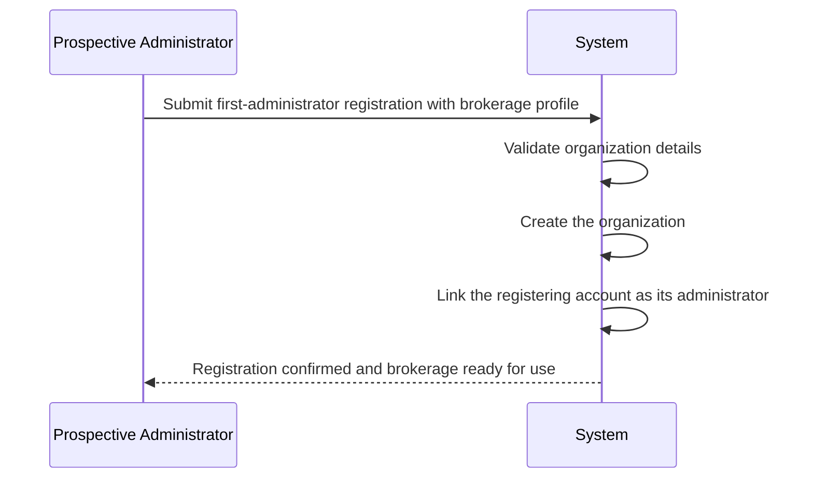

### Organization Profile Capture at Registration

At first-administrator registration, the organization profile is established from the details the registrant supplies.

THE SYSTEM SHALL capture a legal name for the organization at registration.

IF the legal name is absent, THEN THE SYSTEM SHALL reject the registration.

WHERE an operating name is supplied at registration, THE SYSTEM SHALL record it alongside the legal name; WHERE none is supplied, THE SYSTEM SHALL leave the operating name unset.

THE SYSTEM SHALL capture the organization's primary province from the recognized Canadian provinces (for example Ontario, Quebec, Alberta, and British Columbia).

IF the submitted primary province is not a recognized Canadian province, THEN THE SYSTEM SHALL reject the registration.

THE SYSTEM SHALL capture the organization's head office street address, city, province, postal code, and phone number.

WHERE an HST/GST registration number is supplied at registration, THE SYSTEM SHALL record it on the organization.

WHERE no HST/GST registration number is supplied at registration, THE SYSTEM SHALL allow the number to be added later through a profile update.

### Organization Profile Viewing and Updates

Administrators can view the complete organization profile at any time, including legal name, operating name, primary province, head office address, phone number, HST/GST registration number, default currency, and current settings.

Signed-in members of the brokerage can view the organization's identifying information so that day-to-day work presents an accurate brokerage identity.

WHEN an administrator submits a profile update, THE SYSTEM SHALL apply the submitted details to the profile and leave all other values unchanged.

THE SYSTEM SHALL support updates to the legal name, operating name, primary province, head office address, phone number, and HST/GST registration number as business details change.

IF an update would leave the organization without a legal name, THEN THE SYSTEM SHALL reject the update and keep the existing legal name in force.

WHEN the operating name is removed, THE SYSTEM SHALL present the legal name wherever the brokerage's name is displayed.

WHEN the primary province is changed, THE SYSTEM SHALL apply the new value to subsequent organization-level behaviour (such as broker fee tax lookups) without altering provinces already recorded on clients, policies, producer licences, or addresses.

Profile updates take effect for all subsequent operations immediately; records already issued are not rewritten retrospectively.

### Canadian Dollar Default Currency

THE SYSTEM SHALL run every brokerage in Canadian dollars; Canadian dollars are the sole supported currency in this version.

WHEN a new organization is established, THE SYSTEM SHALL set its default currency to Canadian dollars automatically, without requiring a currency choice at registration.

THE SYSTEM SHALL express all monetary figures under an organization — premiums, broker fees, taxes, invoice subtotals and totals, payment amounts, commission amounts, and dashboard revenue figures — in Canadian dollars.

THE SYSTEM SHALL record monetary amounts to the cent.

IF a monetary amount is entered without a stated currency, THEN THE SYSTEM SHALL interpret it as Canadian dollars.

### Broker Fee Tax Rate Table in Settings

Provincial practice governs whether and how broker fees are taxed, so each organization keeps its own configurable rate table within its settings.

THE SYSTEM SHALL maintain, in each organization's settings, a broker fee tax rate table that associates provinces with applicable tax rates.

WHEN a new organization is established, THE SYSTEM SHALL seed its tax rate table with an Ontario HST 13% entry as the default example.

WHEN broker fee tax is calculated on a quote, policy, endorsement, or invoice charge, THE SYSTEM SHALL determine the rate from the owning organization's tax rate table according to the applicable province.

IF the applicable province has no entry in the organization's tax rate table, THEN THE SYSTEM SHALL leave the broker fee untaxed.

WHEN an administrator adds or edits a table entry, THE SYSTEM SHALL apply the new rate to calculations performed after the change; documents and records already issued retain the rates applied when they were produced.

WHEN an administrator removes a table entry, THE SYSTEM SHALL treat the corresponding province as having no rate for subsequent calculations.

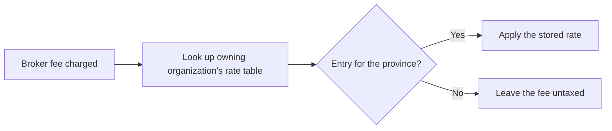

### Admin-Only Organization Settings

Organization-level governance — the profile itself, the broker fee tax rate table, and the default currency — is reserved to administrators. The full permission matrix is maintained canonically in the Actors and Permissions document.

Only administrators may view and modify organization settings.

Producers and customer service representatives cannot open organization settings views.

Future client portal accounts likewise have no access to organization settings.

IF an account without administrator authority attempts to change any organization setting or profile detail, THEN THE SYSTEM SHALL refuse the attempt and leave every value unchanged.

These restrictions concern organization governance only; producers and customer service representatives continue performing their client, policy, and service duties unaffected.

Administration of user accounts and roles is covered by the User Operations unit.

### Tenant Isolation Between Brokerages

Every business record in the system belongs to exactly one organization, keeping every brokerage's data private from every other brokerage.

THE SYSTEM SHALL confine every listing, search, detail view, client timeline, report, dashboard count, and notification to records belonging to the signed-in user's organization.

WHEN a user requests a record owned by a different organization, THE SYSTEM SHALL respond as though the record does not exist, never revealing its presence.

WHEN a user creates a new record, THE SYSTEM SHALL attach it to the creating user's organization.

THE SYSTEM SHALL prevent any operation — viewing, editing, removing, attaching documents, applying payments, or generating paperwork — from crossing an organization boundary.

A user account belongs to exactly one organization; simultaneous membership in multiple brokerages is not supported in this version.

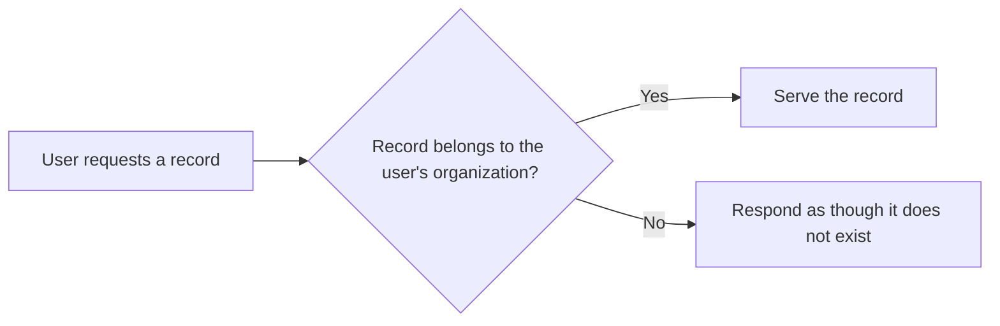

### Sample Ontario Seed Organization

WHERE the demonstration environment initializes, THE SYSTEM SHALL create one sample organization based in Ontario.

The sample organization carries a legal name and operating name for a fictionalized Ontario brokerage, together with fictionalized contact details and Canadian dollar defaults matching a normally registered organization.

The sample organization's tax rate table arrives with the Ontario HST 13% entry, consistent with the standard new-organization seed described in the Broker Fee Tax Rate Table in Settings section.

WHEN the sample organization is seeded, THE SYSTEM SHALL include supporting demonstration records — an administrator account, sample carriers with fictionalized contact data, sample products spanning personal auto, home, and commercial liability offerings, a sample client, and a draft quote — so new users immediately see realistic data.

All seeded information is fictionalized and intended for demonstration and training purposes.

Production brokerages do not rely on seeded records; they begin with their own first-administrator registration as described in the Organization Creation Through First-Administrator Registration section.

Seeded records obey the same tenant isolation and lifecycle rules as ordinary records.

## User Operations

Staff accounts begin when an administrator registers the first administrative account, an act that also brings the organization into existence. From there, administrators invite or create additional users with an email, password credential, display name, role, and active standing, and they may later change roles or deactivate people who leave. Roles divide responsibility clearly: administrators run everything including users, carriers, products, templates, commission schedules, reports, and audit logs; producers own their book of business; customer service representatives service clients, endorsements, documents, and tasks but may not manage users or organization settings. Users sign in with email and password and receive an access token plus refresh token to stay authenticated across sessions. Password reset and email verification flows operate through secure tokens, with outgoing emails permitted to remain logged rather than actually sent during development. A client role scaffolding exists now even though the client portal itself arrives later. Deactivating someone removes their access while preserving the history they created.

### First Admin Registration Creating the Organization

THE system SHALL allow a person to register the first administrative account for a new brokerage by providing an email address, a password credential, and a display name.

WHEN the first administrative registration completes, THE system SHALL bring the brokerage organization into existence and bind the new account to it as its first administrator.

WHERE organization profile details such as legal name, operating name, primary province, tax number, and default currency are gathered, THE system SHALL capture them within the same registration journey as defined under "Organization Operations".

IF a registration attempt supplies an email address already held by any existing account, THEN THE system SHALL reject the registration.

THE system SHALL treat founding registration as a guest-accessible journey available before any account exists.

THE system SHALL refuse additional founding registrations once an organization exists; later accounts join exclusively through administrator invitation or creation.

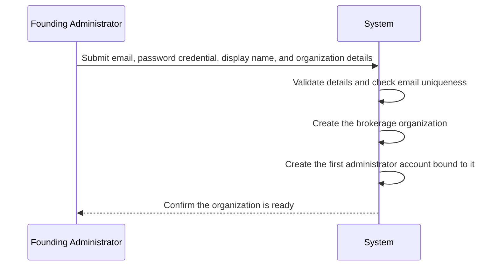

### User Invitation and Creation by Administrators

WHEN an administrator invites or creates a staff user, THE system SHALL require an email address, a password credential, a display name, and a role.

THE system SHALL start each newly created user with the activity status chosen by the creating administrator.

IF the supplied email address already belongs to a user within the same organization, THEN THE system SHALL reject the creation attempt.

THE system SHALL record which administrator created each user for accountability.

THE system SHALL restrict inviting and creating users to administrators; producers and customer service representatives never bring new staff into the organization.

### Roles for Administrator, Producer, CSR, and Future Client Portal

THE system SHALL recognize four roles within each organization: administrator, producer, customer service representative, and client.

THE system SHALL give administrators authority over the organization, users and roles, carriers, products, templates, commission schedules, reports, and audit logs.

THE system SHALL give producers ownership of their book of business, covering assigned clients, quotes, submissions, policies, renewals, and commission figures for themselves.

THE system SHALL let customer service representatives service clients, endorsements, documents, and tasks while withholding authority over users and organization settings.

THE system SHALL put client-role sign-in and role recognition in place now even though the client portal experience itself arrives in a later release.

The complete permission matrix is the canonical content of "01-actors-and-auth.md" and governs every sensitive operation described throughout this document.

### Changing Roles and Deactivating Users

WHEN an administrator changes a user's role, THE system SHALL apply the new role to that user's subsequent actions while leaving records the person previously created attributed unchanged.

WHEN an administrator deactivates a user, THE system SHALL immediately withdraw that person's ability to sign in and act within the organization.

THE system SHALL preserve all history created by a deactivated user, including activities, tasks, quotes, policies, documents, and audit entries.

IF an administrator attempts to deactivate or demote the last remaining active administrator of the organization, THEN THE system SHALL refuse the change so the brokerage always retains governing authority.

### Email and Password Sign-In

WHEN a user submits an email address and password, THE system SHALL verify them against an existing, active account before granting entry.

IF the credentials do not match any account, THEN THE system SHALL reject the sign-in without revealing whether the email address or the password was wrong.

IF the matched account belongs to a deactivated user, THEN THE system SHALL refuse entry and direct the person to contact their administrator.

THE system SHALL confine guests without an account to the registration, sign-in, password reset, and email verification journeys only; every other operation requires authentication.

WHEN sign-in succeeds, THE system SHALL scope all of the user's subsequent work to that person's single organization.

### Access and Refresh Token Issuance

WHEN sign-in succeeds, THE system SHALL issue an access token together with a refresh token so the user stays authenticated across sessions.

THE system SHALL demand a valid access token for every operation outside the open guest journeys of registration, sign-in, password reset, and email verification.

WHEN an access token stops being valid, THE system SHALL accept the accompanying refresh token to continue the session without asking for the password again.

IF a refresh attempt presents an unrecognized or withdrawn refresh token, THEN THE system SHALL end the session and require a fresh sign-in.

THE system SHALL bind every issued token pair to the signing-in user and that person's organization so tenant isolation carries into each request.

### Token-Based Password Reset Flow

WHEN a user requests a password reset, THE system SHALL issue a single-use reset token bound to the account behind the submitted email address.

THE system SHALL deliver the reset token toward the account's email address rather than showing it inside the application.

WHEN the user submits a new password together with a valid reset token, THE system SHALL replace the stored password credential.

IF the reset token has expired, was already redeemed, or matches no account, THEN THE system SHALL reject the change and invite the user to request a fresh token.

WHEN the password update succeeds, THE system SHALL confirm the outcome so the user can proceed to sign in with the new password.

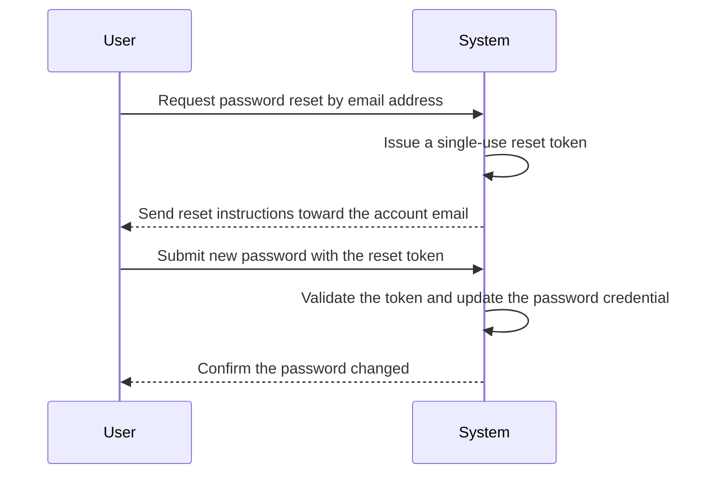

### Email Verification Flow

THE system SHALL issue a verification token whenever an account is registered or its email address is changed.

WHEN the holder presents a valid verification token, THE system SHALL mark the account's email address as verified.

IF a verification token is unknown or already redeemed, THEN THE system SHALL decline it and offer to send a fresh verification message.

THE system SHALL retain each account's verification standing so administrators can see who has and has not confirmed their address.

THE system SHALL allow sign-in while email verification remains outstanding so development environments, where email is merely logged, remain fully usable.

### Logged Email Sending During Development

WHILE the platform runs in development mode, THE system SHALL record outgoing email content — invitations, verification messages, and password-reset instructions — in application logs instead of transmitting real email.

THE system SHALL log enough context, including recipient, purpose, and message body, for developers to exercise verification and reset journeys end-to-end before real email infrastructure exists.

THE system SHALL keep the delivery step isolated behind the sending flows so a production deployment can introduce genuine email dispatch without changing registration, verification, or reset behaviour.

### Producer Book-of-Business Ownership

THE system SHALL assign each client to exactly one producing user accountable for that relationship.

WHEN a producer browses clients, quotes, submissions, policies, or renewals, THE system SHALL limit the results to records belonging to clients assigned to that producer.

THE system SHALL show commission figures to producers solely for their own sales, never for teammates.

THE system SHALL scope every producer view to the producer's own organization before applying book-of-business limits.

WHEN an administrator reassigns a client to a different producer, THE system SHALL transfer ongoing responsibility while historical records remain attributed to whoever originally performed the work.

THE system SHALL let administrators and customer service representatives work across the whole brokerage client base, subject to their own role limits.

### CSR Restrictions on User and Settings Management

THE system SHALL enable customer service representatives to service clients, process endorsements, manage documents, and handle tasks across the brokerage's client base.

THE system SHALL withhold all user management — inviting, creating, changing roles, deactivating — from customer service representatives.

THE system SHALL withhold organization settings administration, including the organization profile, from customer service representatives.

IF a customer service representative attempts a user-management or organization-settings action, THEN THE system SHALL deny the action and explain that it is reserved for administrators.

THE system SHALL hold customer service representatives to the same tenant boundary as every other staff member: only their own organization's records.

Capability boundaries summarized here defer to the permission matrix in "01-actors-and-auth.md" as the canonical source.

### Listing Users by Role and Activity Status

THE system SHALL let administrators browse the staff directory of their own organization.

THE system SHALL filter the directory by role so an administrator can isolate all producers, all customer service representatives, or all administrators at will.

THE system SHALL filter the directory by activity status to separate current staff from deactivated accounts.

THE system SHALL paginate, sort, and filter the directory listing so it remains usable as the organization grows.

THE system SHALL surface each listing entry's email address, display name, role, activity status, and verification standing.

THE system SHALL hide other organizations' directories completely, consistent with tenant isolation everywhere else in the system.

## ProducerLicence Operations

The brokerage records each producer's provincial selling licences, capturing province, licence type such as RIBO, licence number, issue date, expiry date, and current status. Administrators and customer service representatives maintain these records as producers join, renew credentials, or depart. When a licence has already expired or is approaching its expiry window, the system flags it as a compliance alert and feeds it into the compliance section of the daily summary. Staff review licences per producer to confirm proper licensing before pursuing business in a given province. Renewals bring a licence back into good standing with fresh dates and status. Because licensing underpins lawful selling activity, licence health appears alongside carrier appointment tracking in compliance reporting.

### Provincial Producer Licence Records

Each producer's authority to sell insurance comes from provincial credentials, and the brokerage keeps those credentials on record.

- THE SYSTEM SHALL allow staff to record a provincial selling licence against a producer, capturing the issuing province, the licence type, the licence number, the issue date, the expiry date, and the current status.
- THE SYSTEM SHALL attach each licence record to the producer who holds it and to that producer's organization, keeping licence information within the brokerage that employs the producer.
- THE SYSTEM SHALL support multiple licence records for a single producer so that a producer licensed in several provinces holds one record per province.
- IF a licence record is submitted without the issuing province, licence type, licence number, issue date, or expiry date, THEN THE SYSTEM SHALL reject the submission.
- THE SYSTEM SHALL retain licence records as producers join the brokerage and while they remain associated with it.

### Licence Types Such As RIBO

Provinces regulate insurance selling through distinct licence classes, so the credential type matters when judging what a producer may sell.

- THE SYSTEM SHALL record the licence type designated by the provincial regulator for each licence record, accepting designations such as RIBO.
- THE SYSTEM SHALL accept whatever licence type the reporting province uses, because licence class names differ from province to province.
- THE SYSTEM SHALL present the licence type together with the issuing province wherever licence details are shown, so staff can confirm the credential suits the work being placed.
- THE SYSTEM SHALL allow one producer to hold different licence types in different provinces at the same time.

### Licence Number and Issue Date Capture

The licence number and issue date identify the credential against provincial regulator records.

- THE SYSTEM SHALL capture the regulator-issued licence number for every licence record exactly as provided.
- THE SYSTEM SHALL capture the issue date on which the province granted the credential.
- THE SYSTEM SHALL show the licence number and issue date in every licence listing and review, so staff can verify details against the producer's paper or regulator-issued confirmation.
- THE SYSTEM SHALL keep the licence number stable across routine edits, changing it only when staff deliberately correct a captured mistake.

### Licence Expiry Date Tracking

Licence validity is governed by the expiry date, and the system watches that date continuously rather than relying on staff memory.

- THE SYSTEM SHALL track the expiry date on every licence record.
- WHEN the current date passes a licence's expiry date, THE SYSTEM SHALL treat that licence as expired.
- THE SYSTEM SHALL classify a licence as expiring while its expiry date falls within the next thirty days, giving staff advance notice before a lapse occurs.
- THE SYSTEM SHALL reflect expired and expiring standings in licence listings automatically, without requiring anyone to update records by hand.

A licence moves through the following standing lifecycle:

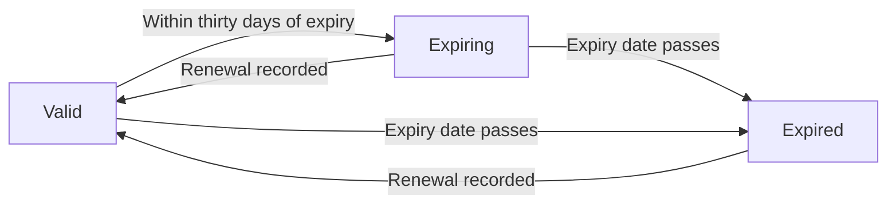

### Expired Licence Alerts

An expired licence means the producer cannot lawfully sell in that province until the credential is restored, so lapses are raised to the organization's attention.

- WHEN a licence expires, THE SYSTEM SHALL surface it as an expired-licence compliance item for the organization.
- THE SYSTEM SHALL keep an expired licence visible in compliance views until its standing is restored through renewal.
- THE SYSTEM SHALL identify the affected producer and the issuing province on every expired-licence compliance item, so staff know exactly whose credential has lapsed.
- IF a producer holds any expired licence, THEN THE SYSTEM SHALL reflect that lapse wherever the producer's licensing health is summarized.

### Expiring Licence Warnings

Before a licence lapses, the system warns staff while there is still time to renew.

- WHEN a licence enters the expiring classification defined in Licence Expiry Date Tracking, THE SYSTEM SHALL trigger the licence-expiring notification described under Notification Operations.
- THE SYSTEM SHALL direct the expiring warning to the affected producer and to the organization's administrative and service staff responsible for credential upkeep.
- THE SYSTEM SHALL raise the expiring warning when the licence enters the warning window rather than repeating it day after day.
- THE SYSTEM SHALL distinguish expiring warnings from expired alerts so staff can prioritize credentials that have already lapsed.

### Admin and CSR Maintenance Duties

Licence records are compliance-sensitive, so their upkeep rests exclusively with administrative and service staff.

- THE SYSTEM SHALL restrict creation, modification, and removal of licence records to administrator and customer service representative roles.
- IF a producer, client, or unauthenticated party attempts to change licence records, THEN THE SYSTEM SHALL refuse the change.
- Administrators and customer service representatives add licence records as producers join the brokerage, correct captured details when errors surface, and remove records entered by mistake.
- THE SYSTEM SHALL apply accepted corrections immediately so subsequent reviews and compliance summaries reflect current facts.

### Renewal Restores Good Standing

When a producer renews a credential with the provincial regulator, staff bring the licence record back into good standing instead of discarding its history.

- WHEN a producer presents a renewed credential, THE SYSTEM SHALL let administrators or customer service representatives record the renewal by entering the new expiry date on the existing licence record.
- THE SYSTEM SHALL restore the licence to valid standing once the renewed expiry date is recorded.
- THE SYSTEM SHALL clear the licence's expired and expiring flags, and retire the associated alerts, once renewed standing takes effect.
- THE SYSTEM SHALL preserve the licence record's identity and captured history through renewal, so the record continues to represent the same provincial credential rather than starting anew.

### Per-Producer Licence Review

Staff verify a producer's licensing before placing business on that producer's behalf.

- THE SYSTEM SHALL let administrators and customer service representatives retrieve every licence record held by a single producer in one consolidated review.
- THE SYSTEM SHALL show the province, licence type, licence number, issue date, expiry date, and current standing for each licence presented in the review.
- THE SYSTEM SHALL support narrowing a producer's licences by province and by standing, including valid, expiring, and expired credentials.
- Staff rely on this per-producer review to confirm proper licensing before pursuing business in a given province.

### Compliance Reporting Feed

Licensing underpins lawful selling activity, so licence health feeds the same compliance picture as carrier appointments.

- THE SYSTEM SHALL feed expired and expiring producer licence information into the compliance portion of the organization's daily summary, alongside carrier appointment standing tracked under CarrierAppointment Operations.
- THE SYSTEM SHALL base the compliance feed on current licence standings at the moment the summary is viewed.
- THE SYSTEM SHALL attribute each licence compliance entry to the affected producer and province, mirroring how appointment entries identify their carriers.
- Leadership therefore reads producer licence health next to carrier appointment health in a single compliance view.

### Selling Eligibility Confirmation by Province

Before quoting or placing risk in a jurisdiction, staff confirm that the chosen producer may lawfully sell there.

- THE SYSTEM SHALL let staff confirm whether a named producer holds a currently valid licence for a specific province.
- THE SYSTEM SHALL derive the confirmation from that producer's licence standings, treating only unexpired licences as sufficient for selling in the province.
- IF the producer holds no valid licence for the requested province, THEN THE SYSTEM SHALL indicate that the producer's credentials do not support selling there.
- THE SYSTEM SHALL limit this confirmation to producer licensing; whether a product may be sold in a province remains governed by the eligibility rules under Product Operations.

## Client Operations

Staff create clients typed as either individual or business, capturing the appropriate naming — legal name for businesses, first and last name for individuals — along with preferred name, primary province, preferred language of English or French, email, phone, mailing address, and relationship status. Clients progress through prospect, active, inactive, and lost statuses, giving a clear picture of relationship health over time. Tags organize segments such as industry or referral source, and free-form notes preserve context about the relationship. Each client is assigned to a producer whose book of business it joins; producers work primarily their own clients while service staff support clients across the office. Business clients additionally carry contacts, addresses, activities, tasks, quotes, and policies that all hang off the client record. A timeline view weaves interactions, tasks, quotes, and policies into one chronological story per client. Search and filtering by name, status, producer, province, and tags lets staff locate accounts quickly. Removal happens as soft deletion so history and linked business remain intact.

### Creating Clients as Individual or Business

Staff members create client records within their own brokerage. Every new client must declare its type up front: either an individual person or a business entity. The declared type determines which naming information the system collects.

THE system SHALL allow producers and CSRs to create a client within their own brokerage, choosing a client type of either individual or business.
WHEN creating an individual client, THE system SHALL capture a first name and a last name that together form the client's legal name.
WHEN creating a business client, THE system SHALL capture a single legal business name in place of personal first and last names.
IF a client is submitted without a legal name appropriate to its declared type, THEN THE system SHALL reject the request.
WHILE creating a client, THE system SHALL accept additional descriptive details — preferred name, primary province, language preference, email, phone, and mailing address — each of which may be omitted and completed later.
THE system SHALL treat the declared client type as a permanent characteristic of the client record once created.
THE system SHALL automatically link every newly created client to the brokerage of the staff member creating it.

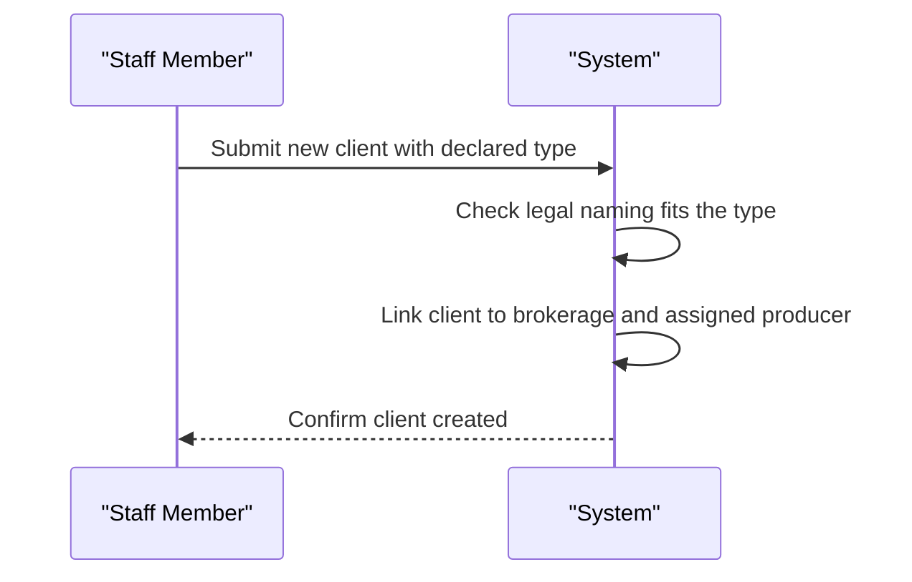

### Client Status Lifecycle from Prospect to Lost

Every client carries a relationship status drawn from four stages: prospect, active, inactive, and lost. A client typically enters as a prospect, becomes active when coverage business begins, may go dormant as inactive, and ends as lost when the opportunity or relationship concludes. The current status gives staff an immediate read on relationship health.

THE system SHALL offer exactly four relationship statuses on every client: prospect, active, inactive, and lost.
THE system SHALL start every newly created client at the prospect status when no other status is specified.
THE system SHALL allow staff to change a client's status at any time among the four permitted values.
THE system SHALL show the current status wherever client records and client summaries are displayed.
WHEN a client's status changes, THE system SHALL record the change in the audit trail as with other critical client changes.

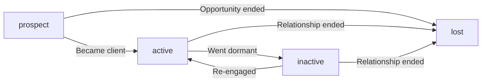

### Preferred Name and Language Preference Usage

Clients are people before they are accounts. Beyond the legal identity captured at creation, the system keeps an informal way to address each client and remembers whether they conduct business in English or French.

WHERE a preferred name differing from the legal name was provided during creation, THE system SHALL surface the preferred name prominently in staff-facing client displays instead of the legal name.
THE system SHALL restrict each client's language preference to either English or French.
THE system SHALL let staff update the preferred name and language preference at any time as they learn more about the client.
WHILE corresponding with or serving a client, THE system SHALL make the recorded language preference visible so staff know how the client prefers to communicate.

### Assigned Producer and Book of Business

Each client belongs to the book of business of exactly one producer. Producers concentrate their work on their own assigned clients, while CSR staff support clients across the whole office. Reassignment moves a client between books without disturbing its accumulated history.

THE system SHALL assign every client to exactly one producer user within the same brokerage.
THE system SHALL let staff choose the responsible producer when creating a client.
THE system SHALL let staff reassign a client to a different producer afterwards.
WHEN a client is reassigned, THE system SHALL transfer the client intact, leaving its activities, tasks, quotes, policies, and documents untouched.
WHILE working with clients, THE system SHALL let producers primarily serve the clients assigned to them and let CSRs service any client in the brokerage.

### Tagging for Segmentation

Tags give brokerages a lightweight way to group clients into segments such as industry verticals, referral sources, or campaign cohorts without rigid category structures.

THE system SHALL let staff attach multiple free-form tags to any client record.
THE system SHALL let staff add new tags to and remove existing tags from a client at any time.
THE system SHALL expose tags as a filtering criterion when locating clients so that an entire segment can be pulled up at once.

### Notes for Relationship Context

Beyond structured interactions, staff need a place for open-ended relationship context — background on how the client was won, sensitivities to remember, negotiation history. General notes on the client record serve this purpose and remain distinct from formal activity entries.

THE system SHALL provide a free-form notes capability on each client record for preserving relationship context over time.
THE system SHALL keep general notes separate from structured interaction entries, which follow the logging behaviour defined in Activity Operations.
THE system SHALL let staff revise the notes as the relationship develops.

### Client Search and Filtering by Name, Status, Producer, Province, and Tags

Staff need to find the right account quickly whether they remember a name, a stage, a producer, a province, or a segment label. The client listing supports each angle alone or in combination.

THE system SHALL let staff search clients by name using partial text matches.
THE system SHALL let staff narrow client results by relationship status.
THE system SHALL let staff narrow client results by assigned producer.
THE system SHALL let staff narrow client results by primary province.
THE system SHALL let staff narrow client results by tag.
THE system SHALL let staff combine several filters in a single client search.
WHILE presenting client results, THE system SHALL govern result ordering and paging according to the list-browsing expectations defined in Business Rules.

### Chronological Client Timeline View

A client's story is scattered across calls made, tasks owed, quotes produced, and policies written. The timeline weaves these threads into a single chronological narrative so anyone opening the account understands where things stand.

THE system SHALL assemble one chronological timeline per client mixing activities, tasks, quotes, and policies into a unified sequence.
THE system SHALL order timeline entries most recent first according to each item's relevant date.
THE system SHALL label every timeline entry with its kind so staff can tell interactions apart from tasks, quotes, and policies at a glance.
THE system SHALL let staff move from a timeline entry to the underlying quote, policy, or task record for full detail.

### Soft Deletion Retaining Client History

When a client relationship truly ends, the record leaves daily view but never vanishes. Deletion is a soft mark that hides the client from routine work while preserving every trace of the relationship for compliance and historical reference.

THE system SHALL remove clients by marking them as deleted rather than physically erasing them.
WHEN a client is deleted, THE system SHALL retain the client's full history including activities, tasks, quotes, policies, invoices, and documents.
THE system SHALL exclude deleted clients from default client listings and searches.
THE system SHALL prevent deleted clients from being chosen when staff start new quotes or policies.
WHEN a client record is deleted, THE system SHALL record the removal in the audit trail consistent with other critical client changes.

### Primary Contact Details and Mailing Address Capture

Every client needs reachable coordinates: where mail is delivered and how contact is made day to day. These basics live directly on the client record, while richer address books and multi-address arrangements build on them through dedicated management operations.

THE system SHALL capture a primary email address and phone number on the client record.
THE system SHALL accept a mailing address during client creation and store it on the client record.
THE system SHALL let staff maintain multiple addresses of mailing, billing, and risk types for a client following the management behaviour defined in Address Operations.
WHERE a client is a business, THE system SHALL let staff maintain a dedicated contact directory for the insured organization following the behaviour defined in ClientContact Operations.

## ClientContact Operations

Business clients carry a directory of contacts, each holding a name, job title, email, phone number, and a primary-contact flag. Staff add contacts as they engage more people at an insured business and remove those who have left. Exactly one contact can be marked primary so correspondence about quotes, policies, and invoices has a clear recipient. Contact details stay current as personnel change at client companies. Primary designation helps producers know whom to call when preparing comparative proposals. Individual clients need no separate directory because the client record itself holds their personal details.

### Business Client Contact Directory

THE system SHALL maintain a contact directory attached to every business client record, listing all people known to work at the insured business.

WHEN authorized brokerage staff open a business client, THE system SHALL display that client's complete contact directory alongside the client's other information.

THE system SHALL show each directory entry with its name, job title, email address, phone number, and whether it currently carries the primary designation.

WHEN a business client has no contacts yet, THE system SHALL present the directory as empty rather than hiding the capability, inviting staff to record the first contact.

THE system SHALL restrict directory visibility and management to staff of the brokerage that owns the underlying client, consistent with organization-wide tenant isolation.

### Adding Contacts for Insured Businesses

WHERE the client is a business, authorized brokerage staff SHALL be able to add contacts to the insured business's directory as relationships broaden across the company.

THE system SHALL capture for each added contact a name (required), a job title, an email address, and a phone number.

THE system SHALL accept a contact whose only provided detail is the name, allowing job title, email address, and phone number to be filled in later.

WHEN the added contact is the first one ever recorded for that business client, THE system SHALL automatically give it the primary designation.

WHEN the business client already has at least one contact, THE system SHALL save the new contact without the primary designation unless the staff member explicitly grants it.

IF the target client is an individual rather than a business, THEN THE system SHALL refuse the addition, because individuals are excluded from directories (see Individuals Excluded from Directories).

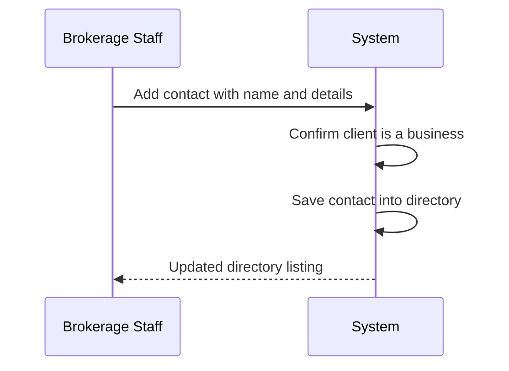

### Primary Contact Designation

WHILE a business client has at least one contact, THE system SHALL ensure exactly one contact carries the primary designation.

WHERE the directory contains more than one contact, authorized brokerage staff SHALL be able to transfer the primary designation to any other contact in the directory.

WHEN a staff member marks a different contact as primary, THE system SHALL move the designation in the same action, clearing it from the previous holder so two contacts never hold it simultaneously.

THE system SHALL retain the primary designation on its holder until it is explicitly transferred or the holder is removed.

### Keeping Contact Details Current

WHEN personnel change at a client company, such as a promotion, a new email address, or a new phone number, authorized brokerage staff SHALL be able to edit the affected contact's job title, email address, and phone number directly in the directory.

THE system SHALL apply edits immediately so every subsequent view of the directory reflects the corrected details.

THE system SHALL preserve a contact's primary designation through ordinary detail updates unless the staff member separately transfers it (see Primary Contact Designation).

THE system SHALL leave the rest of the contact's record untouched by an edit, changing only the updated details themselves.

### Removing Departed Contacts

WHEN a person leaves a client company, authorized brokerage staff SHALL be able to remove that person's contact from the directory so stale recipients do not linger.

THE system SHALL remove the contact completely from the directory upon a confirmed removal request.

IF the departing contact does not hold the primary designation, THEN THE system SHALL complete the removal without further input.

IF the departing contact holds the primary designation and other contacts remain, THEN THE system SHALL automatically designate the longest-standing remaining contact as the new primary as part of the same action.

IF the departing contact is the only contact in the directory, THEN THE system SHALL allow the removal and leave the business client temporarily without contacts; the next contact added becomes primary automatically.

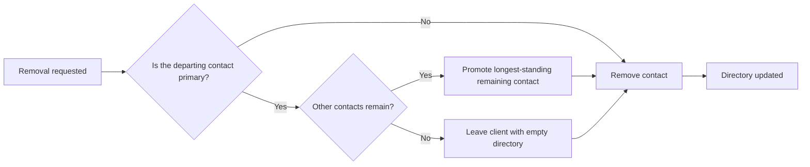

### Correspondence Recipient Clarity

THE system SHALL treat the business client's primary contact as the default intended recipient for paperwork concerning that client, including quote proposals, policy schedules, certificates, and invoice-related correspondence prepared from templates (template kinds defined in DocumentTemplate Operations).

WHEN a document is prepared naming a recipient for a business client, THE system SHALL pre-select the primary contact unless the staff member chooses otherwise.

THE system SHALL highlight the primary contact within the directory so producers can identify at a glance whom to call when assembling comparative proposals.

WHEN the primary designation moves to another contact, THE system SHALL reflect the new recipient in subsequent correspondence prepared for that client, without rewriting previously issued documents.

### Individuals Excluded from Directories

THE system SHALL exclude individual clients from the contact directory capability, because the individual client record itself already holds their personal details (client types and personal detail capture defined in Client Operations).

WHEN staff view an individual client, THE system SHALL present personal details drawn directly from the client record rather than offering a separate contact directory.

THE system SHALL not permit contact entries to be created, listed, or managed for individual clients at any point.

Confining directories to businesses keeps one authoritative place for a company's people and one authoritative place for a person's own details.

## Address Operations

Client addresses are typed as mailing, billing, or risk locations and composed of street lines, city, province, and postal code. A single client may hold several addresses, for instance a mailing address different from the property being insured. The risk address matters commercially because the province of the risk drives eligibility checks and downstream handling of placements. Billing addresses support accurate invoicing when payment correspondence differs from regular mail. Staff correct addresses whenever clients relocate or a risk location changes. Canadian province codes and postal codes are expected on every address captured.

### Address Type Selection (Mailing, Billing, Risk)

WHEN an authorized staff member adds an address to a client record, THE system SHALL record exactly one address type chosen from mailing, billing, or risk.

THE system SHALL treat the mailing type as the client's general correspondence location used for routine mail.

THE system SHALL treat the billing type as the location used for payment and invoicing correspondence when it differs from regular mail.

THE system SHALL treat the risk type as the physical location being insured, anchoring the placement commercially.

IF an address is submitted without a recognized type, THEN THE system SHALL reject the addition and ask the staff member to classify it.

THE system SHALL show the address type label wherever a client's addresses are listed so staff can distinguish purposes at a glance.

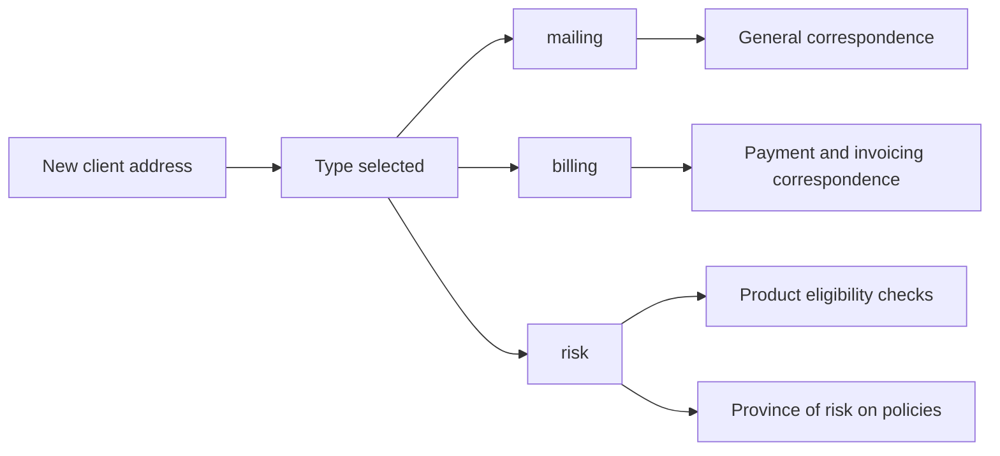

### Address Detail Capture (Street Lines, City, Province, Postal)

WHEN an authorized staff member records an address, THE system SHALL capture a first street line, city, province, and postal code as the required details.

WHERE a unit, suite, or apartment needs recording, THE system SHALL accept an optional second street line alongside the first.

THE system SHALL present the captured components together whenever an address is shown, reading naturally as a complete Canadian address.

WHERE the brokerage needs to record its own location, THE system SHALL reuse the identical capture so organization and client addresses follow the same structure (see Organization Operations).

THE system SHALL keep each component separately editable so staff can amend a single element, such as a unit number, without retyping the whole address.

### Multiple Addresses per Client

THE system SHALL allow a single client to hold several addresses at the same time.

THE system SHALL give each address its own independent type so, for example, a client's mailing address can differ from the insured property location.

THE system SHALL permit more than one address of the same type where a business client genuinely operates from multiple locations.

WHEN staff view a client's profile, THE system SHALL present every stored address labelled by its type.

WHEN an address is added, THE system SHALL attach it to the client and thereby to the client's brokerage, keeping it visible only within the owning organization.

### Risk Location Driving Eligibility

WHEN staff attach products to quote lines, THE system SHALL evaluate product eligibility using the province of the client's risk-typed address, applying the eligibility rules defined for products (see Product Operations).

WHEN a placement is created from an accepted quote, THE system SHALL carry the risk-address province forward as the province of risk recorded on the policy (see Policy Operations).

IF a product restricts coverage to particular provinces and the client's risk address lies outside them, THEN THE system SHALL surface that restriction through the eligibility evaluation performed at attach time.

WHEN a client's risk address changes, THE system SHALL apply the new province to all future eligibility evaluations while past evaluations remain as originally decided.

### Billing Address for Invoicing

WHEN an invoice is prepared for a client whose payment correspondence differs from regular mail, THE system SHALL make the client's billing-typed address available for the invoice.

WHEN no billing address has been recorded for a client, THE system SHALL fall back to the client's mailing address for invoicing purposes.

WHERE a client holds several billing addresses, THE system SHALL let staff select among them when producing paperwork that requires payment correspondence.

WHEN invoice paperwork is rendered from templates, THE system SHALL place the chosen billing address onto the generated documents (see Invoice Operations and Document Template Operations).

### Address Corrections Over Time

WHEN a client relocates or a risk location changes, THE system SHALL let authorized staff correct the affected address details directly on the client record.

THE system SHALL apply corrections to the existing address entry so the client maintains a current, accurate address set.

WHEN staff remove an address that is no longer valid, such as a vacated risk location, THE system SHALL drop it from the client's active address list.

THE system SHALL NOT alter quotes or policies already created from a superseded address; mid-term coverage changes proceed through endorsements (see Endorsement Operations).

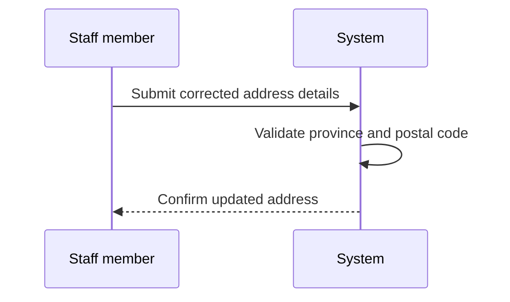

### Canadian Province Code Selection

THE system SHALL offer province selection from the full set of Canadian provinces and territories for every address captured.

THE system SHALL identify each province by its standard abbreviation, such as ON for Ontario, QC for Quebec, AB for Alberta, and BC for British Columbia.

IF an address is submitted with a blank province or one outside the Canadian list, THEN THE system SHALL reject the save until a valid Canadian province is chosen.

THE system SHALL keep province values consistent across the organization record, client records, addresses, producer licences, and product eligibility rules so downstream comparisons match like with like.

### Postal Code Expectations

THE system SHALL expect a postal code on every address captured for a client or the brokerage.

THE system SHALL accept postal codes in the standard Canadian form alternating letters and digits, displayed with the customary space in the middle.

IF an address is submitted without a postal code, THEN THE system SHALL reject it, reflecting the expectation that every captured address carries one.

THE system SHALL show the postal code as part of the complete address wherever addresses appear, whether on profiles, quotes, policies, or rendered paperwork.

## Activity Operations

Every interaction with a client can be logged as an activity typed as call, email, meeting, note, or other, with a subject, detailed body, and the moment it occurred. Whoever records the activity is captured as its creator, creating accountability for client communications. Activities accumulate into the client's history and appear alongside tasks, quotes, and policies on the client timeline. Staff review past interactions to understand relationship context before the next conversation. Filtering interaction history helps locate specific calls or notes quickly. Activities are retained as part of the client record rather than discarded.

### Logging Client Interactions

Every client touchpoint — a telephone conversation, an email exchange, a scheduled or impromptu meeting, or a remark worth remembering — can be recorded on the client's record as an activity. Producers and CSRs log these interactions in the course of daily work, and administrators may record interactions on the brokerage's behalf.

- WHEN a producer, CSR, or administrator records an interaction for a client, THE system SHALL create an activity attached to that client.
- THE system SHALL require an activity type, a subject, and the occurrence timestamp before an activity can be saved.
- WHERE the recorder supplies further detail beyond the subject, THE system SHALL store it as the activity body (defined in Subject and Body Capture).
- THE system SHALL attribute the staff member performing the recording as the activity's creator automatically (defined in Creator Attribution for Accountability).
- THE system SHALL confine every activity to the same organization as its client, so interactions recorded by one brokerage are never visible to another.
- THE system SHALL prevent portal clients from recording activities or viewing staff interaction records, keeping interaction logs internal to the brokerage.

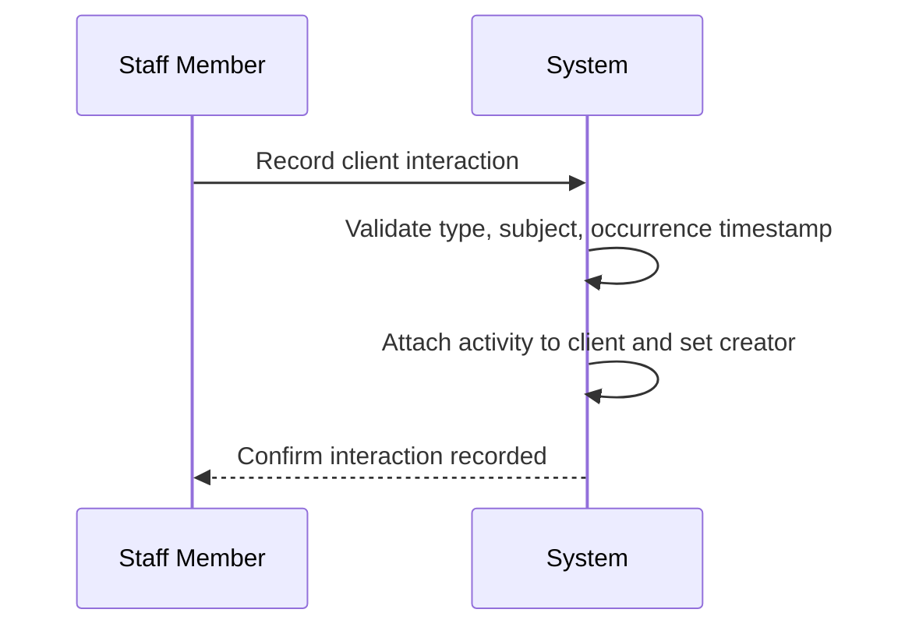

### Activity Type Classification

The system classifies every activity under exactly one of five fixed interaction types, so history stays consistent and searchable across all staff. Custom categories are not offered; anything outside the standard channels falls under "other".

| Type | Intended Use |
|------|--------------|
| call | Live telephone conversation with or about the client |
| email | Written correspondence exchanged with the client |
| meeting | In-person or virtual appointment with the client |
| note | Internal remark about the relationship not tied to a communication channel |
| other | Any interaction that fits none of the standard channels |

- THE system SHALL classify every activity under exactly one of five supported types: call, email, meeting, note, and other.
- WHEN an activity is recorded, THE system SHALL require one selected type.
- IF a type outside the supported classifications is supplied, THEN THE system SHALL reject the recording attempt.
- THE system SHALL identify each entry in interaction history and on the client timeline by its activity type.
- THE system SHALL support narrowing interaction history by activity type (defined in Filtering Past Interactions).

### Subject and Body Capture

Each activity carries two text components: a subject that serves as the scannable one-line summary, and an optional body that preserves the substance of the exchange for whoever picks up the relationship next.

- THE system SHALL require a subject summarizing the interaction whenever an activity is recorded.
- THE system SHALL display the subject wherever the activity appears in interaction history and on the client timeline.
- WHERE the recorder supplies a detailed body, THE system SHALL preserve it alongside the subject as supporting context for future readers.
- THE system SHALL permit recording an activity without a body, so quick calls and brief remarks can be logged without friction.
- THE system SHALL keep the subject and body confined to the activity itself, so logging an interaction never alters the client's profile information.

### Occurrence Timestamp Recording

An activity captures when the interaction actually took place, separate from when someone typed it in. This lets staff enter a morning of client calls in one sitting at day's end while history still reflects true conversation times.

- THE system SHALL record on every activity the occurrence timestamp representing when the interaction took place.
- WHERE the recorder does not specify when the interaction occurred, THE system SHALL default the occurrence timestamp to the moment of recording.
- WHERE the recorder backdates an interaction, THE system SHALL honour the supplied occurrence timestamp.
- THE system SHALL order interaction history and client timeline placement by the occurrence timestamp rather than by entry sequence.
- THE system SHALL display the occurrence timestamp together with every listed activity.

### Creator Attribution for Accountability

The system answers "who logged this" without extra effort from the recorder. Accountability for client communications is captured automatically at save time and travels with the record for life.

- THE system SHALL attribute every activity to the staff member who recorded it as its creator.
- THE system SHALL prevent changing the creator once the activity has been recorded.
- THE system SHALL distinguish the activity creator from the client's assigned producer, since the person logging an interaction is not always the producer who owns the relationship.
- THE system SHALL display the creator alongside each activity in interaction history.
- THE system SHALL support narrowing interaction history to activities logged by a specific creator (defined in Filtering Past Interactions).

### Client Interaction History Review

For any client, staff can pull up everything ever logged about that client by anyone in the brokerage. The next phone call therefore starts with full conversational context instead of relying on memory or scattered personal notes.

- THE system SHALL present, for each client, a complete interaction history assembled from activities recorded by all staff members.
- THE system SHALL list each history entry showing its activity type, subject, occurrence timestamp, and creator.
- THE system SHALL present the most recent interactions first when a client's history is opened.
- THE system SHALL keep interaction history available for clients in any status, including prospect, active, inactive, and lost clients.
- WHILE a staff member works with a client, THE system SHALL expose that client's interaction history so relationship context is always at hand before the next conversation.

### Client Timeline Integration

Interaction history does not stand alone: the system composes a single client timeline that mixes activities with the client's tasks, quotes, and policies in one chronological view. A reviewer follows the whole relationship story — conversations leading to proposals leading to coverage — without jumping between screens.

- THE system SHALL merge activities, tasks, quotes, and policies into one chronological timeline for each client.
- THE system SHALL place each activity on the client timeline according to its occurrence timestamp.
- THE system SHALL label every timeline entry with its item kind — activity, task, quote, or policy — and its date, so readers can tell interactions apart from work items and coverage records.
- THE system SHALL draw the task, quote, and policy contributions to the timeline from the same client records maintained by their respective operations (defined in Task Operations, Quote Operations, and Policy Operations).
- WHEN a new activity, task, quote, or policy is added for a client, THE system SHALL incorporate it into that client's timeline automatically.

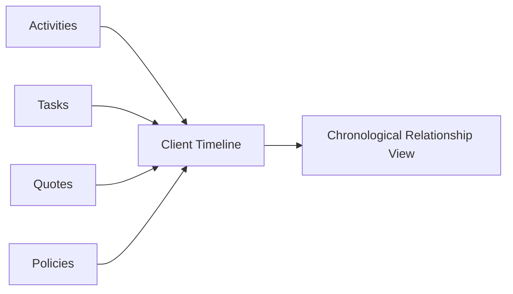

### Filtering Past Interactions

When a history grows long, staff narrow it down instead of scrolling. Filters operate within a selected client's interactions and stack together to answer precise questions such as which meetings a particular producer held last quarter.

- THE system SHALL filter a client's interaction history by activity type, for example isolating calls or notes.
- THE system SHALL filter interaction history by a date range applied to the occurrence timestamp.
- THE system SHALL filter interaction history by creator.
- THE system SHALL combine the type, date range, and creator filters so staff can isolate a specific slice of past interactions.
- THE system SHALL apply filters to the displayed history only, leaving the underlying records unchanged so clearing filters restores the complete history.

### Permanent Retention of Activities

Activities are kept for the life of the client record rather than discarded. Even when a client goes quiet, turns inactive, or is marked lost, the accumulated interaction history remains available for compliance questions and future re-engagement.

- THE system SHALL retain every recorded activity as a permanent part of its client's record rather than discarding it.
- THE system SHALL keep interaction history intact when a client moves to inactive or lost status.
- THE system SHALL retain activities attached to a soft-deleted client as part of the archived record.
- WHERE a recorded activity contains a mistake, THE system SHALL allow correcting the subject or body while the activity remains part of the history.
- THE system SHALL provide no routine purge or expiry of activities tied to normal client lifecycle changes.

## Task Operations

Staff create tasks carrying a title, description, and due date, assigning each to a teammate responsible for completion. A task stands alone or ties to a related client or policy so follow-up stays anchored to underlying business. Tasks progress through open, done, and cancelled states as work gets handled. When a task reaches its due date unfinished, the assignee receives a notification reminder. Reassignment keeps workload balanced when staff are away or duties shift. Completed and cancelled tasks remain visible on timelines so past follow-up stays traceable.

### Task Creation

Staff members in the administrative, producer, and customer-service roles create tasks to track follow-up work such as calling a prospect back or chasing an outstanding document.

- THE SYSTEM SHALL allow staff members to create a task providing a title (required), an optional description, and a due date.
- WHEN a task is created, THE SYSTEM SHALL set the task status to open and record the creating staff member as the creator.
- THE SYSTEM SHALL associate every task with the creating staff member's organization so tasks never cross brokerage boundaries.
- IF a task is submitted without a title, THEN THE SYSTEM SHALL reject the request.
- WHERE a description is provided, THE SYSTEM SHALL retain it with the task so the responsible teammate understands the requested work without needing to ask.

### Task Assignment to Teammates

Every task has exactly one teammate responsible for seeing it through to completion.

- THE SYSTEM SHALL require each task to carry exactly one assignee drawn from active staff members within the same organization.
- THE SYSTEM SHALL allow the task creator to name the assignee while creating the task.
- WHERE the creator does not choose an assignee, THE SYSTEM SHALL assign the task to its creator by default.
- THE SYSTEM SHALL hold the assignee responsible for the task until it reaches a terminal state or is reassigned.
- IF an assignment designates a staff member who is deactivated or belongs to a different organization, THEN THE SYSTEM SHALL reject the assignment.

### Related Client or Policy Linking

A task may stand alone as general follow-up, or it may anchor to the business records the follow-up concerns.

- THE SYSTEM SHALL allow a task to be linked to one related client and, optionally, one related policy of that client.
- THE SYSTEM SHALL permit linking a client or a policy either while creating the task or by editing the task afterwards.
- WHEN a task is linked to a policy, THE SYSTEM SHALL treat that policy's client as the task's related client context.
- IF a proposed link points to a client or policy belonging to another organization, THEN THE SYSTEM SHALL reject the link.
- THE SYSTEM SHALL use these links to keep follow-up anchored to the underlying business so context travels with the work.

### Open, Done, and Cancelled Progression

Tasks move through three states as work gets handled: open, done, and cancelled.

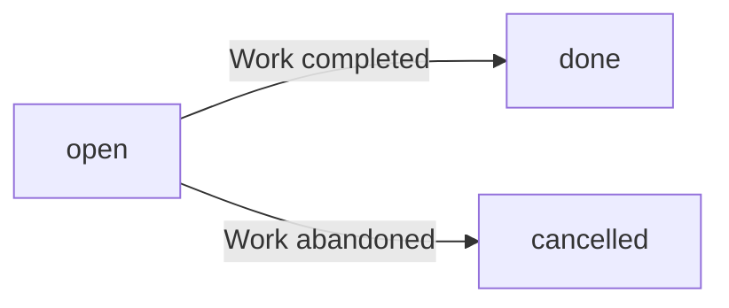

- WHILE a task is open, THE SYSTEM SHALL treat it as outstanding work owed by the assignee.
- WHEN the assignee finishes the work, THE SYSTEM SHALL allow the assignee to move the task from open to done.
- WHEN the follow-up is no longer needed before completion, THE SYSTEM SHALL allow the task's creator or an administrator to move the task from open to cancelled.
- THE SYSTEM SHALL treat done and cancelled as terminal states from which no further transitions are possible.
- IF renewed follow-up is needed after a task is closed, THEN THE SYSTEM SHALL require a new task rather than reopening the finished one.

### Due Date Reminder Notification

Unfinished work past its due date must resurface so nothing slips quietly.

- WHEN a task reaches its due date while still open, THE SYSTEM SHALL create a reminder notification addressed to the assignee.
- THE SYSTEM SHALL deliver the reminder as a persisted notification so it survives sign-out and device changes, regardless of whether outbound email sending is stubbed in development.
- THE SYSTEM SHALL reference the overdue task inside the reminder so the assignee can reach the work directly.
- THE SYSTEM SHALL raise at most one reminder per open task when its due date passes unfinished.
- IF a task is done or cancelled by the time its due date arrives, THEN THE SYSTEM SHALL NOT send any reminder.

### Task Reassignment Between Staff

When staff are away or duties shift, open work must move to whoever will handle it.

- THE SYSTEM SHALL allow an administrator to reassign any open task within the organization to another active staff member.
- WHERE the current assignee hands off the work personally, THE SYSTEM SHALL allow the assignee to transfer an open task to another active staff member in the same organization.
- WHEN a task is reassigned, THE SYSTEM SHALL transfer completion responsibility to the new assignee.
- THE SYSTEM SHALL limit reassignment to open tasks; done and cancelled tasks keep the teammate who held them at closure.
- IF a reassignment targets a staff member who is inactive or belongs to a different organization, THEN THE SYSTEM SHALL reject the change.

### Follow-up Accountability

Each task carries the identity of the people behind it so follow-up can always be traced to its origin and outcome.

- THE SYSTEM SHALL preserve the creator recorded at task creation for the life of the task.
- THE SYSTEM SHALL preserve the assignee holding the task at the moment it is marked done or cancelled.
- THE SYSTEM SHALL attribute completion of a done task to the staff member who performed the closure.
- THE SYSTEM SHALL retain these identities even after reassignment, so a task's history shows who created it and who ultimately closed it.
- THE SYSTEM SHALL NOT allow tasks to be erased in a way that would break this trail of responsibility.

### Timeline Visibility of Tasks

Tasks surface where the related business lives, keeping client history whole.

- THE SYSTEM SHALL include tasks in the chronological client timeline together with activities, quotes, and policies for that client.
- THE SYSTEM SHALL keep done and cancelled tasks visible on the timeline so past follow-up remains traceable rather than disappearing once closed.
- THE SYSTEM SHALL present timeline entries in chronological order so a reader can reconstruct what happened and when.
- THE SYSTEM SHALL show tasks without a related client link only in staff task lists, not on any client timeline.
- THE SYSTEM SHALL restrict client timeline visibility to staff members of the client's organization.

## Document Operations

Users attach documents to whichever business object they belong with — a client, quote, policy, or invoice — so paperwork lives next to related work. Each document records its kind, filename, file format, size, storage location, checksum, version number, and who uploaded it. When a corrected or refreshed copy arrives, it becomes a new version rather than erasing what came before. Documents generated by the system from templates, such as rendered proposals, schedules, or certificates, file alongside manually uploaded scans. Access stays confined to members of the owning brokerage, keeping tenant boundaries intact. Soft deletion hides a document without destroying the historical trail, preserving evidence for disputes.

### Attaching Documents to Clients, Quotes, Policies, and Invoices

Brokerage staff attach paperwork directly to the business record it belongs with — a scanned form beside the client, a signed acceptance beside the quote, an issued schedule beside the policy or invoice — so supporting evidence never drifts away from related work.

- THE system SHALL allow authorized brokerage staff to upload a file and attach it to exactly one owning record among a client, a quote, a policy, or an invoice.
- THE system SHALL require every document to belong to exactly one owning record throughout its life, so paperwork always appears beside the work it relates to.
- THE system SHALL permit multiple documents to be attached to the same owning record.
- WHEN a user views a client, quote, policy, or invoice, THE system SHALL present the documents attached to that record together with each document's kind, filename, and version number.
- IF an attachment is attempted without identifying the owning record, THEN the system SHALL reject the filing.

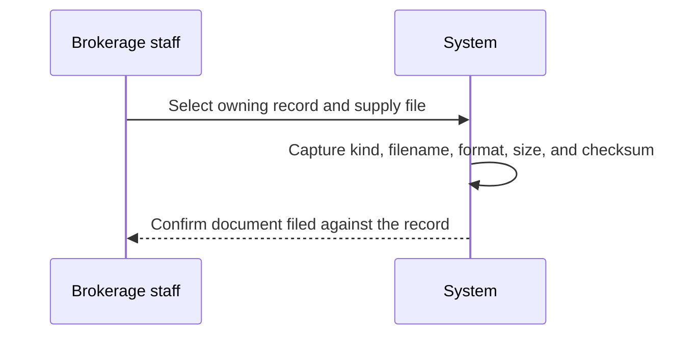

Which roles may attach files to which record types follows the permission matrix defined in 01-actors-and-auth.md.

### Document Kind and Filename Capture

Every filed document carries a purpose label and a recognizable name so colleagues can tell what a file contains without opening it.

- THE system SHALL classify each document with a document kind describing its purpose, drawn from the brokerage's vocabulary such as quote proposal, policy schedule, certificate of insurance, invoice copy, or custom item.
- THE system SHALL require a document kind for every filing, whether the copy is uploaded by hand or produced by the system from a template.
- THE system SHALL record the file's format so staff know how a copy opens before retrieving it.
- THE system SHALL preserve the filename supplied with an upload unchanged, so staff recognize files the way their office named them.
- WHERE a document is generated by rendering an organization template, THEN the system SHALL assign its kind and filename from that generation rather than asking staff to name it manually.
- THE system SHALL display kind and filename wherever documents are listed for a record.

### File Size and Checksum Metadata

Each filed copy is measured and fingerprinted at the moment of filing so its integrity can be demonstrated later.

- THE system SHALL record the file size of every document at the time it is filed.
- THE system SHALL compute a checksum of the filed content at filing time and keep that value with the document.
- THE system SHALL record the storage location assigned to each filed copy so the copy can be retrieved on request.
- WHEN a stored copy is retrieved, THE system SHALL make its recorded checksum available so staff can compare the retrieved copy against what was originally filed.
- THE system SHALL prevent users from altering a document's file size, checksum, or storage location after filing, keeping these measurements trustworthy.

### Version Numbering on Replacement Copies

Insurance paperwork gets corrected and reissued often; the system never lets a replacement erase what came before.

- WHEN a corrected or refreshed copy of an already-filed document arrives, THE system SHALL file it as a new version of the existing document rather than overwriting the previous content.
- THE system SHALL number document versions consecutively starting from one and treat the highest-numbered version as the current one.
- THE system SHALL keep every superseded version open for viewing after a newer version becomes current.
- THE system SHALL capture kind, filename, file size, checksum, storage location, and uploader attribution separately for each individual version.

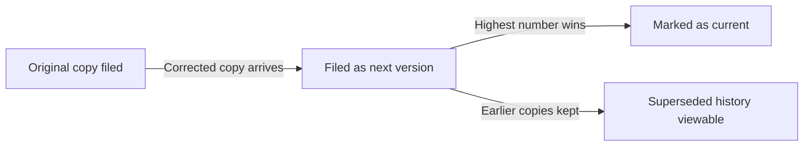

### Filing Template-Generated Paperwork

Paperwork the system produces itself is filed exactly like a manual upload, so proposals, schedules, and certificates live in one place regardless of origin. Template library management itself is defined in DocumentTemplate Operations.

- WHEN staff render paperwork from an organization template for a client, quote, policy, or invoice, THE system SHALL file the rendered result as a document owned by that same record.
- THE system SHALL always keep the readable rendered text of generated paperwork even when a print-ready formatted copy cannot be produced.
- THE system SHALL note on template-generated documents which named organization template produced them, tracing wording back to the approved library.
- THE system SHALL list template-generated documents alongside manual uploads and treat them identically for viewing, versioning, tenant confinement, and soft deletion.

### Uploader Attribution and Filing Date

Every document answers who put it on file and when, supporting accountability across the brokerage.

- THE system SHALL record the user who filed each document together with the date and time of filing.
- THE system SHALL display uploader attribution and filing date wherever documents are listed.
- THE system SHALL keep each version's own uploader attribution, so version history shows who contributed every copy.
- WHERE a document is generated through template rendering, THE system SHALL attribute the filing to the staff member who triggered the generation.

### Tenant-Confined Document Access

Paperwork stays inside the brokerage that owns the underlying work; no document crosses a tenant boundary.

- THE system SHALL confine every document, including all of its versions, to the brokerage organization that owns its underlying client, quote, policy, or invoice.
- IF a user requests a document whose owning record belongs to a different brokerage than their own, THEN the system SHALL reject the request as if the document did not exist.
- THE system SHALL scope document listings so a user sees only paperwork belonging to their own brokerage.
- THE system SHALL enforce the same confinement on template-generated documents and on soft-deleted documents.
- Role-based limits on who within the brokerage may retrieve or file documents follow the permission matrix defined in 01-actors-and-auth.md.

### Soft Deletion of Documents

Removing a document from view is a deliberate act that never destroys what lies behind it.

- THE system SHALL hide a soft-deleted document from ordinary record views and document lists immediately upon removal.
- THE system SHALL keep the entire underlying record of a soft-deleted document intact, including versions, metadata, and uploader attribution.
- THE system SHALL exclude soft-deleted items from default document listings unless the viewer explicitly asks to see removed paperwork.
- THE system SHALL continue enforcing tenant confinement and version integrity for soft-deleted documents exactly as for visible ones.
- How long removed documents remain recoverable is governed by the retention policy in 05-non-functional.md.

### Dispute Evidence Retention

Because brokerages must answer for what they issued, revised, or withdrew, the document trail is built to survive disputes.

- THE system SHALL retain the complete version history of every document, covering current, superseded, and soft-deleted copies, so the brokerage can demonstrate what was issued, changed, or withdrawn and when.
- THE system SHALL preserve filenames, kinds, file sizes, checksums, storage locations, and uploader attribution for every retained copy, keeping each piece of evidence verifiable.
- WHEN a dispute arises over previously issued paperwork, THE system SHALL let staff produce past versions together with their attribution and checksums for comparison.
- THE system SHALL offer no routine operation that permanently destroys a filed copy or its version history.
- How long documentary evidence must remain retrievable is governed by the retention policy in 05-non-functional.md.

## Carrier Operations

Administrators curate the catalogue of insurance carriers the brokerage places business with, recording each carrier's name, short code, optional financial strength note, website, service email and phone, working notes, and active standing. Carriers are deactivated rather than erased when relationships end, because in-force policies and historical commissions continue referencing them. Working notes capture practical knowledge about dealing with each market. Products, quote options, submissions, policies, and commissions all tie back to this catalogue, making it foundational reference data. Listing carriers helps staff confirm which markets exist for a given placement. Demonstration environments seed sample carriers resembling Intact, Aviva, and Wawanesa with fictionalized contact details.

### Carrier Catalogue Curation by Administrators

THE system SHALL allow an administrator to add a new carrier to the brokerage's carrier catalogue, supplying at least the carrier name and short code described in the following sections.

THE system SHALL reserve creating, editing, deactivating, and reactivating carriers for administrators.

WHILE a producer or CSR works with clients, quotes, submissions, and policies, THE system SHALL grant them read access to the carrier catalogue without any ability to alter it.

WHEN an administrator corrects or completes a carrier's details, THE system SHALL apply the change to the single catalogue entry that all related products, quotes, policies, and commissions refer to.

WHEN staff browse the catalogue, THE system SHALL list each carrier identified by its carrier name, short code, and active standing.

### Carrier Name and Short Code

WHEN an administrator creates a carrier, THE system SHALL require both a carrier name and a short code.

The carrier name presents the market's full name to staff, while the short code provides a compact label used wherever space is limited across quotes, policies, listings, and statements.

IF a new or edited short code matches one already held by another carrier in the brokerage's catalogue, THEN the system SHALL refuse to save the duplicate and ask for a different code.

WHEN an administrator renames a carrier, THE system SHALL update the name everywhere it appears while leaving the short code unchanged, so existing records stay recognizably tied to the same market.

THE system SHALL identify every carrier in lists, forms, and documents by both its carrier name and its short code.

### Optional Financial Strength Note

THE system SHALL allow an administrator to record an optional financial strength note as free-form text on each carrier, suitable for remarks such as an AM Best-style rating observation.

THE system SHALL enforce no fixed rating scale, format, or mandatory wording on this note.

WHERE no financial strength note has been entered, THE system SHALL present the carrier normally with no strength information rather than treating the record as incomplete.

WHERE a financial strength note exists, THE system SHALL display it alongside the carrier's other details so staff can weigh the market's stability when deciding where to place coverage.

WHEN an administrator refreshes the note over time, THE system SHALL replace the previous wording with the latest observation.

### Website and Service Contact Details

THE system SHALL capture an optional website address together with an optional service email address and service phone number on each carrier record.

These details tell staff where to reach the carrier's service team for underwriting questions, submission follow-up, and ongoing policy servicing.

WHEN a staff member opens a carrier record, THE system SHALL present the website, service email, and service phone together so a single look-up answers contact questions.

THE system SHALL treat the website, service email, and service phone as independent optional entries, letting a carrier record carry whichever contact channels the brokerage actually uses.

WHEN a team member follows up on a submission sent to a market, THE system SHALL let them take the carrier's service contact details from its catalogue entry.

### Working Notes About Carriers

THE system SHALL give each carrier a working-notes area in which administrators capture practical knowledge about dealing with that market.

THE system SHALL keep working notes as plain prose, imposing no structure beyond the text itself.

WHEN day-to-day experience with a carrier evolves, THE system SHALL let administrators revise the working notes accordingly.

WHEN staff decide which market to approach for a placement, THE system SHALL surface the working notes beside the carrier's core details so accumulated institutional knowledge guides the choice.

THE system SHALL confine what appears in working notes to the brokerage's own observations, keeping the area distinct from the structured fields such as the financial strength note and service contacts.

### Deactivating Ended Carrier Relationships

WHEN the brokerage stops placing business with a carrier, THE system SHALL let an administrator deactivate the carrier rather than erase it.

WHILE a carrier is deactivated, THE system SHALL withhold it from the market choices offered when staff attach products or assemble comparative quotes.

WHILE a carrier is deactivated, THE system SHALL continue showing it wherever it already appears in existing records, so nothing previously written becomes unreadable.

WHEN the brokerage resumes the relationship, THE system SHALL let an administrator reactivate the carrier, returning it to new-business selections.

IF removal of a carrier that is referenced by other records is attempted, THEN the system SHALL refuse the erasure and direct the administrator toward deactivation instead.

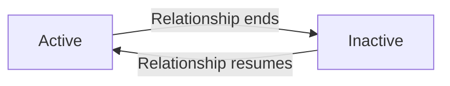

### Historical References Preserved

THE system SHALL preserve every reference to a deactivated carrier so in-force policies, past quotes and their comparative lines, recorded submissions, endorsements and cancellations, and historical commissions continue pointing at the original market record.

WHEN staff open a quote, submission, policy, or commission belonging to a now-deactivated carrier, THE system SHALL still display the carrier's name and short code exactly as recorded.

WHEN commission statements or revenue reporting cover periods involving a deactivated carrier, THE system SHALL include those figures rather than dropping them from history.

THE system SHALL never reassign a historical record from its original carrier to a different carrier, even if the original is renamed or reactivated afterwards.

### Foundational Market Reference Data

THE system SHALL anchor the brokerage's commercial activity to the carrier catalogue so products are offered through carriers, comparative quote lines represent carrier options, submissions are tracked per carrier, and policies and commissions attribute their results back to a carrier.

WHEN a producer wants to confirm which markets exist for a given placement, THE system SHALL let them view the brokerage's carrier list with each entry identified by carrier name, short code, and active standing.

THE system SHALL present both active and deactivated carriers in the list, clearly distinguished by their standing, reflecting the brokerage's real placement history rather than hiding former markets.

### Seeded Sample Carriers for Demonstration Environments

WHEN a demonstration environment is prepared, THE system SHALL seed sample carriers resembling Intact, Aviva, and Wawanesa, each carrying fictionalized website, service email, and service phone details.

THE system SHALL populate the seeded carriers solely with invented contact information, ensuring no walkthrough action could ever reach a real carrier inbox or phone line.

THE system SHALL create the seeded carriers as ordinary catalogue entries inside the demonstration environment, so guided walkthroughs exercise realistic Canadian markets end to end alongside the seeded sample products, client, and draft quote.

WHEN a fresh production environment is deployed, THE system SHALL begin with an empty carrier catalogue curated by its own administrators rather than preloaded samples.

## CarrierAppointment Operations

For every insurer relationship the brokerage tracks its appointment standing with that carrier, including whether the appointment is active and when it expires. Appointment expiry serves as a compliance alert source, feeding both notifications and the compliance portion of the summary dashboard. When agreements lapse or get renegotiated, administrators update the standing and expiry accordingly. Appointments belong to the pairing of this brokerage with this carrier, since each organization holds its own agreements with insurers. Seeing standings well ahead of expiry prevents working a market without valid appointment. Producers rely on current appointments when choosing which carriers to approach with a submission.

### Recording Organization-Carrier Appointments

An appointment records the standing agreement between a brokerage and an insurance carrier that authorizes the brokerage to place business with that carrier. Because every brokerage negotiates its own agreements with insurers, each appointment belongs strictly to one organization-carrier pairing and is never shared across brokerages.

THE system SHALL allow an administrator to record an appointment connecting their organization to a carrier chosen from the brokerage's carrier catalogue (defined in Carrier Operations), capturing the initial appointment status and the expiry date of the agreement.

THE system SHALL bind every appointment to exactly one organization-carrier pairing, reflecting that each brokerage holds its own independent insurer agreements.

THE system SHALL scope every appointment record to the owning organization so that one brokerage never sees or alters another brokerage's insurer arrangements.

THE system SHALL make a brokerage's appointments visible to that brokerage's producers and CSRs as read-only records, reserving recording and changes to administrators.

THE system SHALL capture an expiry date whenever an appointment is first recorded, because the expiry date drives every downstream compliance alert.

### Monitoring Appointment Status and Expiry Dates

Staff monitor appointment standing continuously so the brokerage always knows which markets it may work. The meaningful state combines the recorded status with how long the agreement lasts.

THE system SHALL offer three appointment statuses for administrators to assign: pending confirmation, active, and lapsed.

THE system SHALL allow staff to list all appointments held by their brokerage, showing the carrier, the current status, and the expiry date for each.

THE system SHALL support filtering the appointment list by carrier and by status.

WHEN an active appointment's expiry date has passed, THE system SHALL treat that appointment as expired for compliance purposes even before an administrator changes the recorded status.

THE system SHALL show the remaining time until each appointment's expiry date alongside the date itself, so staff can judge placement authority at a glance.

An appointment moves through a simple standing lifecycle driven by carrier confirmation, the passage of the expiry date, and administrator action:

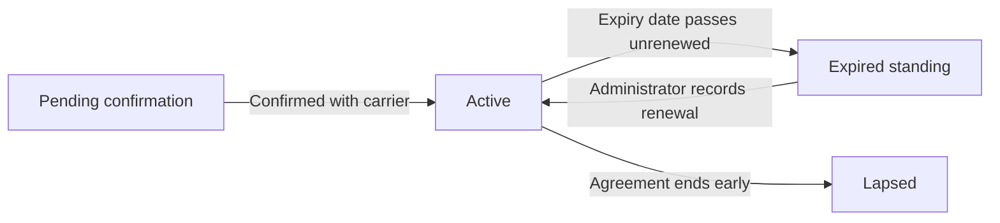

### Renewing Insurer Agreements and Updating Standing

Insurer agreements lapse or get renegotiated over time, and administrators keep the recorded appointment aligned with reality.

WHEN an insurer agreement is renewed or renegotiated, THE system SHALL allow an administrator to restore the appointment to active status and set the newly agreed expiry date in a single update.

WHEN an agreement lapses without renewal, THE system SHALL allow an administrator to move the appointment to lapsed status while retaining the record.

THE system SHALL retain lapsed appointments so quotes and policies previously placed with that carrier remain explainable.

THE system SHALL allow administrators to correct the status or expiry date of an existing appointment when an agreement changes or a recording error is discovered.

IF a change to an appointment would remove the brokerage's only current authorization with a carrier, THEN THE system SHALL apply the change as requested and reflect the resulting gap in compliance surfaces, leaving the placement decision to staff judgment rather than blocking the update.

### Expiring Appointment Warnings as Compliance Alerts

Appointment expiry is an explicit compliance alert source in brokerDesk. Warnings reach staff through persisted notifications both before and after the expiry date passes, mirroring how producer licence expiries are handled (defined in ProducerLicence Operations).

THE system SHALL treat appointment expiry as a compliance alert source feeding both notifications and the compliance portion of the summary dashboard.

WHEN an appointment enters its advance-warning window ahead of the expiry date, THE system SHALL raise an expiring-appointment warning naming the affected carrier and the expiry date, using the same configurable lead window applied to other expiry alerts rather than a fixed number of days.

WHEN an active appointment's expiry date passes without renewal, THE system SHALL raise an expired-appointment alert naming the affected carrier.

THE system SHALL direct appointment compliance notifications to the administrators accountable for carrier relationships within the owning organization.

THE system SHALL identify the affected organization-carrier pairing in every appointment alert so the recipient can act without searching for the record.

THE system SHALL persist appointment compliance notifications through the notification mechanism (defined in Notification Operations), where email delivery may remain stubbed.

### Dashboard Compliance Feed and Market Readiness

The organization dashboard reserves a compliance portion for appointment health and producer licensing findings, giving leadership one place to spot compliance exposure. Producers separately rely on current appointments when deciding which carriers to approach, so standings must be visible during everyday placement work.

THE system SHALL provide a compliance portion of the organization dashboard summarizing carrier appointment health alongside producer licence findings.

THE system SHALL report on that compliance portion the number of appointments already expired and the number expiring within the 30, 60, and 90 day outlooks, mirroring the outlooks already used for expiring policies.

WHERE a dashboard compliance finding points to a specific appointment, THE system SHALL let an administrator open the underlying appointment to renew or end the agreement.

THE system SHALL give producers a market-readiness view distinguishing carriers the brokerage may approach under an active appointment from carriers lacking current standing.

WHEN a producer selects a carrier for quoting or submission work (defined in QuoteLine Operations and Submission Operations), THE system SHALL present that carrier's current appointment standing for the brokerage so the producer avoids working a market without a valid appointment.

THE system SHALL base market readiness on an active appointment status combined with an expiry date that has not yet passed.

## Product Operations

Administrators define sellable products offered by each carrier, naming them, coding them, classifying them by line of business spanning auto, home, commercial property, commercial liability, life, health, disability, travel, and other, describing them, and toggling active state. Product eligibility rules state allowed provinces, qualifying client types, and minimum or maximum values, and the system validates them whenever the product attaches to a quote option. A rating schema describes the inputs required to quote the product — coverage options, limits, deductibles, and risk questions — guiding preparation of accurate quotes. Each product carries its default commission schedule and a catalog of coverage items as companion data. Retiring a product deactivates new use while existing quotes and policies remain intact. Seeded sample products cover personal auto, home, and commercial liability for demonstration.

### Product Definition per Carrier

Administrators curate the sellable product catalog for each carrier in the organization's appointment book. A product represents an insurance offering the brokerage can quote and place on behalf of clients.

- WHEN an administrator creates a product under a carrier, THE system SHALL record the product's name, short product code, plain-language description, line of business, active state, and owning carrier.
- THE system SHALL require the product code to be unique among the organization's own products.
- WHEN an administrator edits a product's name, code, or description, THE system SHALL apply the change going forward without altering the historical records of quotes and policies already referencing the product.
- THE system SHALL scope every product to its owning organization so no other brokerage can view or quote it.
- THE system SHALL support listing products with filtering by carrier, line of business, and active state, subject to the organization-wide list browsing expectations defined in 04-business-rules.
- Only administrators create and modify products; producers and service staff read active product information while preparing quotes, per the permission matrix defined in 01-actors-and-auth.

Every create, update, and retirement of a product is captured in the append-only audit trail defined in AuditLog Operations.

### Line of Business Classification

Each product belongs to exactly one line of business describing what kind of coverage it provides, enabling consistent grouping across quoting, policies, and reporting.

- THE system SHALL classify every product into exactly one line of business drawn from the fixed set: auto, home, commercial property, commercial liability, life, health, disability, travel, and other.
- WHEN a product is created or edited, THE system SHALL reject any line of business outside this fixed set.
- WHILE a product is referenced by any quote line or policy, THE system SHALL refuse to change its line of business so historical business keeps its original classification.
- THE system SHALL let users narrow the product catalog by line of business when choosing products for a comparative quote.

### Eligibility Rule Configuration

A product may carry eligibility rules stating under what conditions a client qualifies for it. Administrators configure these rules alongside the product definition.

- THE system SHALL allow administrators to define, per product, three kinds of eligibility rules: allowed provinces, qualifying client types, and minimum and maximum value thresholds.
- THE system SHALL draw allowed provinces from the same Canadian province codes used for organizations, clients, addresses, and producer licences.
- THE system SHALL allow the qualifying client types to include individual clients, business clients, or both.
- THE system SHALL express the value thresholds as Canadian dollar lower and upper bounds that quoted amounts must respect.
- WHERE a rule category is left unset for a product, THE system SHALL treat that dimension as unrestricted, meaning the product passes that check regardless of province, client type, or amount.

### Eligibility Validation on Quote Attachment

Eligibility is enforced at the moment a product becomes part of a quote, never afterwards. The system evaluates the product's configured rules before a quote option may carry it.

- WHEN a user attaches a product to a quote option, THE system SHALL evaluate the product's eligibility rules before accepting the option.
- THE system SHALL verify that the applicable province appears in the product's allowed provinces, taking the risk location recorded on the quote when present and otherwise falling back to the client's primary province.
- THE system SHALL verify that the client's type, whether individual or business, is among the product's qualifying client types.
- THE system SHALL verify that the values supplied on the quote option fall within the product's minimum and maximum value thresholds.
- IF any eligibility check fails, THEN THE system SHALL reject the attachment and identify which rule was not satisfied.
- THE system SHALL perform eligibility validation only at attachment time; later changes to a product's eligibility rules do not retroactively invalidate quote options already carrying the product.

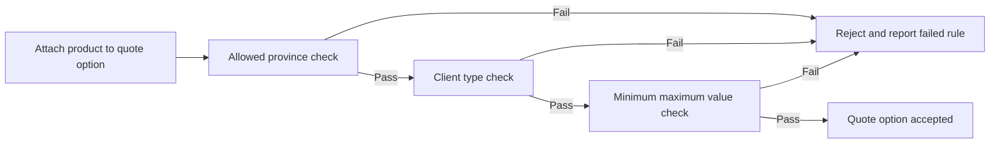

The full catalogue of rejection scenarios and edge cases around eligibility is maintained in 04-business-rules.

### Rating Schema for Quoting Inputs

A product may define a rating schema describing the inputs required to quote it accurately. The schema guides producers through collecting comparable information for every carrier option on a quote.

- THE system SHALL allow administrators to attach a rating schema to each product describing its required quoting inputs: selectable coverage options, available limits, deductible choices, and risk questions.
- WHEN a producer prepares a quote option for a product with a rating schema, THE system SHALL present the required inputs and record the answers with that option, following the answer handling defined in QuoteLine Operations.
- WHERE a product carries no rating schema, THE system SHALL still allow quoting the product with manually entered premium figures.
- THE system SHALL treat rating schema answers as pricing guidance that never prevents a producer from overriding any premium manually on a quote option.
- WHEN an administrator modifies a product's rating schema, THE system SHALL leave the answers already captured on earlier quote options unchanged.

### Companion Commission Schedule and Coverage Catalog

Every product travels with two pieces of companion data — its default commission schedule and its coverage item catalog — so the product is immediately usable for quoting without extra setup.

- WHEN a product is created, THE system SHALL let administrators configure its companion commission schedule, whose agency rate percent, producer split percent, and optional tier table behaviour is defined in CommissionSchedule Operations.
- WHEN a product is created, THE system SHALL let administrators build its companion coverage catalog, whose named coverage codes, default limits, and optional-versus-standard flags are defined in CoverageItem Operations.
- THE system SHALL use the product's companion commission schedule to seed commission estimates whenever the product appears on a priced quote option and again when business binds.
- THE system SHALL offer the product's coverage catalog entries for selection while assembling the coverage portion of a quote option.
- WHEN a product is retired, THE system SHALL retain both companion datasets so historical quotes and policies stay fully interpretable.

### Product Retirement

Products are retired rather than destroyed, protecting the business already written against them.

- WHEN an administrator retires a product by switching it to inactive, THE system SHALL stop offering that product for attachment to new quote options.
- WHILE a product is retired, THE system SHALL keep displaying it wherever existing quotes, submissions, policies, and commissions reference it, clearly identified as retired.
- THE system SHALL preserve all premiums, coverage selections, and commission estimates computed from a retired product exactly as originally recorded.
- WHERE a retired product becomes sellable again, THE system SHALL allow an administrator to reactivate it, restoring its availability for new quote options.
- IF a product has ever been referenced by a quote or policy, THEN THE system SHALL refuse permanent deletion and direct the administrator to retirement instead.

```mermaid
flowchart LR
    A["Active product"] -->|"Retire"| B["Retired product"]
    B -->|"Reactivate"| A["Active product"]
```

### Seeded Sample Products

The demonstration environment ships with sample products so a newly registered brokerage can explore comparative quoting immediately.

- THE system SHALL seed the demo organization in Ontario with sample products covering personal auto, home, and commercial liability.
- THE system SHALL attach each seeded sample product to one of the fictionalized sample carriers in the demonstration catalog.
- THE system SHALL equip each seeded sample product with a usable companion commission schedule and coverage catalog sufficient to exercise end-to-end comparative quoting.
- THE system SHALL make the seeded sample products eligible for the seeded sample client so a draft quote can be prepared without additional configuration.
- THE system SHALL treat seeded sample data as ordinary product data carrying no special behaviour beyond the operations defined in this file.

## CoverageItem Operations

Each product carries a catalog of coverage items with a name, code, a default limit, and an optional flag marking which coverages come standard versus optional extras. When preparing a quote, staff select from these items to assemble the offering presented to the client. Accepted selections flow onto the resulting policy's coverage schedule at bind time. Administrators adjust catalogs as carriers revise offerings, keeping defaults aligned with current forms. Default limits give preparers sensible starting values that can be tailored per deal. Clear item codes keep coverage language consistent between quotes, policies, and generated documents.

### Coverage Item Catalogs Per Product

THE system SHALL maintain a separate coverage item catalog for every product, so each carrier offering presents its own list of named coverages.

WHEN an administrator creates a coverage item, THEN THE system SHALL record it under exactly one product together with its coverage name, coverage code, default limit value, and optional-versus-standard marking.

THE system SHALL confine each coverage item to a single product; coverage catalogs are never shared between products.

WHERE an organization offers products from several carriers, THE system SHALL keep each carrier product's catalog independently maintained.

THE system SHALL let administrators maintain their organization's product coverage catalogs, while producers and CSRs read the catalog when preparing quotes.

### Named Coverage Codes

Every coverage item carries a plain-language coverage name that clients read and a short coverage code used as stable shorthand across the system.

THE system SHALL require both a coverage name and a coverage code whenever a coverage item is created.

IF a new coverage item would duplicate a coverage code already used within the same product's catalog, THEN THE system SHALL reject the creation.

THE coverage code SHALL act as the stable link keeping coverage language identical wherever the item appears — on quote lines, on policy coverage schedules, and in generated documents.

THE coverage name SHALL read naturally on client-facing material such as proposals and schedules.

### Default Limit Values

Each coverage item carries a default limit value representing the typical coverage amount offered with the product.

WHEN a preparer considers a coverage item while assembling an offering, THE system SHALL present the item's default limit as the starting value.

WHERE a particular deal requires different terms, THE system SHALL allow the preparer to tailor the limit on the individual selection without changing the catalog entry itself.

WHEN an administrator revises an item's default limit, THEN THE system SHALL apply the new default to future selections only, leaving previously recorded selections untouched.

### Optional Versus Standard Coverage Flags

Every coverage item carries an optional-versus-standard flag stating whether the coverage comes standard with the product or stands as an optional extra.

THE system SHALL treat items marked standard as part of the product's baseline offering.

THE system SHALL treat items marked optional as add-ons the client may choose.

WHEN a preparer begins assembling coverage for a product, THEN THE system SHALL present standard items as the starting set and remaining items as available extras.

The flag guides how the offering is assembled and presented; it does not force any outcome, and the preparer remains free to drop a standard item or omit an optional one.

### Selecting Coverage During Quoting

WHEN a producer or CSR prepares a quote line, THE system SHALL offer coverage choices drawn only from the quoted product's own catalog.

THE system SHALL let the preparer include standard items and add optional extras so the assembled selection forms the offering presented to the client.

THE system SHALL start each selection from the item's default limit (defined in Default Limit Values) and permit deal-specific tailoring.

THE system SHALL record the chosen coverage selections on the quote line itself; line-level handling of selections is defined in QuoteLine Operations.

IF a requested coverage item does not belong to the quoted product, THEN THE system SHALL reject the selection.

### Flow Into Policy Coverage Schedule

WHEN an accepted quote binds, THE system SHALL carry every accepted coverage selection onto the resulting policy's coverage schedule.

Each policy coverage line SHALL mirror its source coverage item's coverage name and coverage code together with the limit agreed for the deal; deductible and premium contribution behaviour follows the schedule defined in PolicyCoverage Operations.

THE system SHALL preserve the coverage wording captured at bind time; later catalog edits SHALL NOT rewrite coverage lines on already-bound policies.

WHERE a policy is entered manually for a book rollover, THE system SHALL let staff enter coverage lines directly, drawing coverage names and codes from the relevant product's catalog where practical.

```mermaid
flowchart LR
    A["Product coverage catalog"] -->|"Preparer selects coverages"| B["Quote line coverage selections"]
    B -->|"Quote accepted and bound"| C["Policy coverage schedule"]
    C -->|"Rendered through templates"| D["Proposals and policy documents"]
```

### Catalog Upkeep by Administrators

WHEN a carrier revises an offering, THE system SHALL let an administrator update the affected coverage item's coverage name, coverage code, default limit, or optional-versus-standard flag so the catalog stays aligned with the carrier's current forms.

WHEN an administrator withdraws a coverage item from a catalog, THE system SHALL continue to display it on historical quotes and policies exactly as recorded, while excluding it from new coverage selections.

WHERE a coverage item is referenced by existing quote or policy records, THEN THE system SHALL keep it readable for those records.

Catalog upkeep belongs to administrators; producers and CSRs consume the catalog during quoting but never edit it.

### Consistent Coverage Naming Across Documents

THE system SHALL use each coverage item's coverage name and coverage code consistently wherever that coverage appears — on quote lines, on policy coverage schedules, and inside rendered documents.

WHEN a proposal, policy schedule, certificate, or other document is rendered from a template, THE system SHALL draw coverage wording from the coverage names and codes recorded on the underlying quote or policy, so printed language always matches the stored record.

WHEN an administrator later renames a catalog item, THE system SHALL leave the wording captured on each historical record unchanged, so older quotes and policies continue to read exactly as issued.

## CommissionSchedule Operations

For each product, administrators set the default agency commission percentage and the default producer split percentage, optionally backed by a graduated tier table rewarding volume or mix. These defaults seed commission estimates automatically while quoting and become the basis for actual commissions once business binds. Adjusting a schedule affects future business only, leaving settled commissions untouched. Tier tables let the brokerage model stepped arrangements without custom work per deal. Schedules live alongside the product so anyone quoting sees the economics immediately. Clear schedules keep producer compensation predictable and reduce payout disputes.

### Configuring Default Agency and Producer Rates

Each product carries exactly one commission schedule that states the economics of placing business with that product's carrier.

- THE system SHALL allow administrators to define a commission schedule for each product carrying two headline figures: the default agency rate percent and the default producer split percent.
- THE system SHALL interpret the default agency rate percent as the share of a line's premium retained by the brokerage as its agency compensation.
- THE system SHALL interpret the default producer split percent as the share of the resulting agency amount passed on to the writing producer.
- WHEN an administrator updates either default figure, THE system SHALL govern the effect of that change under Restricting Schedule Changes to Future Business.
- THE system SHALL maintain a single active commission schedule per product so there is never ambiguity about which rates apply.
- WHERE a product has no commission schedule configured yet, THE system SHALL still permit quoting the product while leaving its commission estimate unseeded rather than assuming zero earnings.
- WHEN any user views a quote line for the product, THE system SHALL surface the product's commission economics alongside its coverage information so anyone quoting sees the economics immediately.

### Defining Graduated Tier Arrangements

Beyond flat defaults, a schedule may carry an optional tier table so the brokerage can model graduated tier arrangements — richer rates once a volume or business-mix threshold is reached — without custom work per deal.

```mermaid
flowchart LR
    A["Line premium"] --> B{"Tier table present?"}
    B -->|"No"| C["Apply flat default rates"]
    B -->|"Yes"| D["Evaluate tiers in listed order"]
    D --> E{"First threshold satisfied?"}
    E -->|"Yes"| F["Apply that tier's rates"]
    E -->|"No tier matches"| C
```

- WHERE carrier terms reward volume or business mix, THE system SHALL support attaching an optional tier table to a product's commission schedule to represent graduated tier arrangements.
- THE system SHALL let each tier entry pair a qualification threshold — such as a premium volume level or a business-mix criterion — with its own agency rate percent and producer split percent.
- THE system SHALL evaluate tier entries in their listed order and apply the first tier whose threshold the business satisfies.
- WHEN no configured tier threshold is satisfied, THE system SHALL fall back to the default agency rate percent and default producer split percent defined in Configuring Default Agency and Producer Rates.
- THE system SHALL allow administrators to add, amend, or remove tier entries on an existing schedule.
- WHEN tier entries change, THE system SHALL confine the effect to business quoted afterwards per Restricting Schedule Changes to Future Business.
- WHEN a product's schedule carries no tier table, THE system SHALL rely solely on the flat default rates for all commission purposes.

### Seeding Quote-Time Commission Estimates

While quoting, schedule values automatically seed quote-time commission estimates so producers see the economics of every comparative option before anything is bound.

```mermaid
flowchart LR
    S["Product commission schedule"] -->|"Line priced while quoting"| E["Quote-time commission estimate"]
    E -->|"Accepted option binds"| B["Binding-time commission basis"]
    U["Schedule update"] -->|"Applies only to"| F["Business quoted afterwards"]
    U -.->|"Never alters"| R["Commissions already recorded"]
```

- WHEN a quote line is added or repriced against a product carrying a commission schedule, THE system SHALL seed a quote-time commission estimate for that line from the line's premium.
- THE system SHALL derive the estimate's agency amount by applying the matched agency rate percent to the line's premium.
- THE system SHALL derive the estimate's producer amount by applying the matched producer split percent to that agency amount.
- WHERE the product's schedule carries a tier table, THE system SHALL select the estimate's rates by matching the line premium against the graduated tier arrangements defined in Defining Graduated Tier Arrangements.
- WHEN a producer manually overrides the line premium after initial pricing, THE system SHALL refresh the seeded estimate from the revised premium.
- THE system SHALL display the seeded estimate on each comparative quote line so multiple carriers can be weighed on expected earnings as well as price.
- IF the product has no commission schedule, THEN THE system SHALL leave that line's estimate unseeded rather than displaying zero earnings as though guaranteed.
- THE system SHALL treat seeded figures strictly as estimates; they become actual commission records solely through binding as described in Establishing the Commission Basis at Binding.

### Establishing the Commission Basis at Binding

When an accepted quote binds transactionally into a policy, the schedule stops being a preview and becomes the binding-time commission basis for real money owed to the brokerage and the producer.

- WHEN an accepted quote binds transactionally into a policy, THE system SHALL establish actual commission records for the bound business from the schedule values in effect at the moment of binding.
- THE system SHALL carry each accepted quote line's quote-time commission estimate forward as the starting point of that policy's commission record.
- THE system SHALL record the agency rate percent and producer split percent actually applied so any later payout traces back to the rates in force at binding.
- IF the product's schedule changed between pricing and binding, THEN THE system SHALL use the schedule in effect at binding as the binding-time commission basis.
- THE system SHALL hand the resulting commission records over to the commission lifecycle — estimated, due, paid, clawback — governed under Commission Operations.

### Restricting Schedule Changes to Future Business

Renegotiated carrier terms and rate corrections happen, but they must never rewrite history: adjusting a schedule affects future business only, leaving settled commissions untouched.

- WHEN an administrator updates a commission schedule, THE system SHALL confine the change's effect to business quoted, priced, or bound after the update.
- THE system SHALL leave commission amounts already recorded — whether estimated, due, or paid — exactly as captured at their original seeding or binding.
- WHEN an existing draft quote is repriced after a schedule change, THE system SHALL refresh its estimates using the updated schedule values.
- THE system SHALL NOT retroactively alter issued commission statements or completed payouts made under prior schedule values.
- IF different economics are needed for an already-bound policy, THEN THE system SHALL require the correction to flow through an endorsement-generated adjustment commission under Endorsement Operations rather than a silent schedule edit.

### Keeping Producer Compensation Predictable

Visible, stable schedules are the point of this feature: predictable producer compensation and fewer disagreements at payout time.

- THE system SHALL expose each product's commission economics to producers quoting that product so expected earnings are never hidden until payout time.
- THE system SHALL let a producer review the schedule-derived estimate on each of their own quotes before submission or binding.
- THE system SHALL present the same commission figures on the bound policy record and on later commission statements, eliminating drift between what was quoted, what was bound, and what is paid.
- WHEN a producer questions a payout, THE system SHALL support tracing the amount back to the agency rate percent and producer split percent captured at binding, reducing payout disputes rooted in mismatched expectations.
- THE system SHALL preserve the rates actually applied on each commission record independently of later schedule edits, keeping the payout basis stable for reconciliation.

## Quote Operations

Producers prepare quotes owned by themselves for their clients within the brokerage, stating the desired effective date, a quote expiry after which pricing lapses, and helpful notes. A quote advances through draft, priced, submitted, and finally bound, declined, or expired, mirroring the real sales motion. Multiple carrier and product options sit side by side on one quote enabling comparative shopping. Totals roll up premium, broker fee, taxes, and grand total, all in Canadian dollars. Binding the accepted option creates the policy transactionally in one reliable step. Proposals and schedules generate from templates and file as documents against the quote. Draft quotes can be soft-deleted without disturbing anything already bound.

### Quote Creation

THE system SHALL let a producer create a quote for a client assigned to that producer within the same organization.

WHEN a quote is created, THE system SHALL record the creating producer as the owning producer and link the quote to both the client and the organization.

WHEN creating a quote, THE system SHALL capture the desired effective date stating when the client wants coverage to begin.

THE system SHALL accept an optional quote expiry date at creation time; WHERE no expiry date is supplied, THE system SHALL keep the pricing open until an expiry date is set before the quote can move forward.

THE system SHALL accept free-form notes describing the client's situation, special requests, or negotiation context.

WHILE a quote remains in draft, THE system SHALL allow updating the desired effective date, the quote expiry date, and the notes.

IF the target client is not visible within the requesting user's organization, THEN THE system SHALL reject the creation request.

Capabilities for roles other than the owning producer follow the permission definitions in the actors-and-auth specification.

### Reading and Listing Quotes

THE system SHALL let a user open a quote and see, in one place, its desired effective date, quote expiry date, notes, current status, rolled-up totals, comparative lines, recorded carrier submissions, and filed documents.

THE system SHALL let a producer list the quotes in their own book of business.

WHEN listing quotes, THE system SHALL support narrowing the results by client and by status so producers can find working quotes quickly.

THE system SHALL keep every quote readable only within its owning organization; a quote from another organization never appears in lists or searches regardless of the filters applied.

Chronological placement of quotes inside a client's timeline follows the activity operations definition.

### Quote Status Workflow

A quote advances through draft, priced, and submitted stages and then closes as bound, declined, or expired, mirroring the real sales motion of preparing pricing, putting it in front of carriers, and resolving the outcome.

THE system SHALL start every newly created quote in the draft status.

WHEN the producer confirms the comparative lines carry final pricing figures, THE system SHALL let the producer advance the quote from draft to priced.

WHEN carrier submissions have been recorded on the quote, THE system SHALL let the producer advance the quote from priced to submitted.

THE system SHALL enforce forward-only movement so a quote never reverts to an earlier stage.

WHILE a quote is in draft, THE system SHALL allow free changes to its dates, notes, and comparative lines.

WHILE a quote is priced or submitted, THE system SHALL protect the established pricing by restricting changes to the notes field only.

WHEN the opportunity is lost, THE system SHALL let the producer record the quote as declined, preserving the outcome for history.

Per-carrier submission outcomes progress separately as described in the submission operations definition; a quote-level decline records the overall result of the opportunity, not any single carrier's response.

```mermaid
flowchart LR
    D["draft"] -->|"Confirm final pricing"| P["priced"]
    P -->|"Put in front of carriers"| S["submitted"]
    S -->|"Bind accepted option"| B["bound"]
    S -->|"Opportunity lost"| X["declined"]
    D -->|"Expiry date passes"| E["expired"]
    P -->|"Expiry date passes"| E
    S -->|"Expiry date passes"| E
```

### Comparative Multi-Carrier Options

THE system SHALL hold multiple comparative lines on a single quote so several carrier and product combinations can be shopped and evaluated side by side.

WHEN a producer opens a quote, THE system SHALL present every comparative line together with its premium, broker fee, taxes, and commission estimate for direct comparison.

WHILE a quote is in draft, THE system SHALL let the producer add or remove comparative lines to broaden or narrow the shopping set.

Each comparative line's product pairing, carrier snapshot, coverage selections, rating inputs, premium derivation, and commission estimate follow the quote-line operations definition and are not restated here.

At bind time only the winning comparative line is converted into the policy, as described in the transactional bind section below.

### Quote Totals in Canadian Dollars

THE system SHALL maintain four money figures on every quote: total premium, total broker fee, tax amount, and grand total.

WHEN any comparative line's premium, broker fee, or taxes change, THE system SHALL roll the quote totals up again from its comparative lines.

THE system SHALL derive the grand total as total premium plus total broker fee plus tax amount.

THE system SHALL express every quote money figure in Canadian dollars, matching the organization default currency established in the organization operations definition.

Line-level premium computation, manual override, and commission estimation follow the quote-line and commission-schedule operations definitions; quote totals only aggregate the line figures.

### Quote Expiry Lapse

THE system SHALL treat the quote expiry date as the last day the offered pricing stands.

WHEN the quote expiry date passes while a quote is still in draft, priced, or submitted status, THE system SHALL mark the quote expired.

THE system SHALL prevent any stage advancement once a quote is expired.

WHILE a quote is still active, THE system SHALL let the owning producer extend the quote expiry date to keep the offer alive.

An expired quote remains readable for history and reporting but can no longer be repriced, submitted, or bound.

### Template-Generated Proposals

WHERE the organization maintains quote proposal templates, THE system SHALL generate a proposal for a quote from a selected template.

WHEN a producer requests proposal generation, THE system SHALL render the chosen template against the quote's client details, comparative lines, and totals.

WHEN rendering completes, THE system SHALL file the rendered result as a document attached to the quote, following the filing behaviour in the document operations definition.

Template bodies, placeholder variables, and locale handling follow the document-template operations definition.

WHEN a newer proposal is produced after pricing changes, THE system SHALL keep previously generated proposals intact.

### Transactional Bind

WHEN a producer binds a submitted quote, THE system SHALL create the policy from the chosen comparative line in a single reliable step, so that closing the quote and creating the policy either complete together or not at all.

THE system SHALL refuse to bind a quote whose status is anything other than submitted.

WHEN the bind succeeds, THE system SHALL close the quote as bound and carry the accepted option's coverage selections and financial figures onto the resulting policy as described in the policy operations definition.

IF the bind action is attempted again on a quote that is already bound, THEN THE system SHALL confirm the original outcome instead of creating a second policy.

```mermaid
sequenceDiagram
    participant U as Producer
    participant S as System
    U->>S: Bind accepted option on submitted quote
    S->>S: Verify quote is submitted and identify winning line
    S->>S: Create policy and close quote together
    S-->>U: Confirmation with resulting policy
```

### Removing Draft Quotes

THE system SHALL let the owning producer remove a draft quote.

WHEN a draft quote is removed, THE system SHALL hide it from normal lists and searches while keeping the underlying record.

THE system SHALL refuse removal of quotes in any status other than draft so sales history stays intact.

THE system SHALL leave all previously bound business and filed documents undisturbed when a draft quote is removed.

Recovery of removed quotes follows the retention and recovery policies in the non-functional specification.

## QuoteLine Operations

Each option on a quote is expressed as a quote line pairing one carrier and one product, snapshotting carrier details at quoting time. Lines carry the selected coverages and the answers to the product's rating questions. Premium may be computed automatically when the product has formula configuration, and manual override remains available whenever judgment demands it. Broker fee, taxes, and a commission estimate tally per line so economics stay transparent per option. Attaching a product to a line passes eligibility validation, preventing unsuitable placements from being prepared. Comparing lines side by side supports confident recommendations to clients.

### Adding a Quote Line

Every placement option prepared for a client is expressed as a single quote line on the parent quote. Authority to manage lines follows the permission matrix defined in 01-actors-and-auth.md; in practice the producer who owns the quote manages its lines, and administrators may act on any quote in the organization.

THE system SHALL allow an authorized user to add a quote line to any quote belonging to the user's organization.
EACH quote line SHALL pair exactly one carrier with exactly one product offered by that carrier.
THE system SHALL permit multiple quote lines on a single quote so that several carriers and products stand as distinct, separately rated options.
THE system SHALL associate every quote line with the same client and organization as its parent quote.
WHILE the parent quote is in draft or priced status, THE system SHALL accept new quote lines.
IF the parent quote has moved past pricing (submitted, bound, declined, or expired), THEN THE system SHALL reject the addition of further lines.

Building one option from empty to priced:

```mermaid
flowchart LR
    A["Start a new option"] --> B["Choose carrier and product"]
    B --> C["Evaluate eligibility rules"]
    C -->|"Passed"| D["Snapshot carrier details"]
    C -->|"Not passed"| E["Reject with reason"]
    D --> F["Seed standard coverages"]
    F --> G["Collect rating answers"]
    G --> H["Compute or enter premium"]
```

### Carrier Snapshot at Quoting Time

A quotation must always show the client what was actually proposed at the time, so each line freezes the carrier's identity when the pairing is made.

WHEN a carrier is paired with a product on a new quote line, THE system SHALL capture a snapshot of the carrier's name and code as they read at that moment.
WHILE the quote line exists, THE system SHALL keep the snapshot unchanged even if the carrier record is later renamed, corrected, or deactivated.
WHEN a proposal or schedule document is produced from the quote, THE system SHALL print the snapshot carrier details rather than whatever the carrier record says today.
IF the carrier behind a line is deactivated after quoting, THEN the line SHALL remain intact and comparable, because the snapshot preserves the history.

### Eligibility Validation on Product Attach

The eligibility rules themselves — allowed provinces, permitted client types, and minimum or maximum value bounds — are maintained on the product and described with the product catalog; this section governs how the system enforces them at the moment a product joins a line.

WHEN a user attaches a product to a quote line, THE system SHALL evaluate that product's eligibility rules against the client and risk context of the parent quote.
IF any eligibility rule fails, THEN THE system SHALL reject the attachment and tell the user which condition was not met.
IF the product is marked inactive, THEN THE system SHALL reject the attachment.
WHILE a line continues to exist, THE system SHALL keep its attached product in place even if that product is later deactivated, so previously built comparisons stay stable.

### Coverage Selections per Line

The catalog of coverage items per product — names, codes, default limits, and which coverages are standard versus optional — is defined in CoverageItem Operations. This section describes how a single line composes its own selection from that catalog.

WHEN a product is attached to a quote line, THE system SHALL seed the line with the product's standard coverage items at their default limits.
THE system SHALL let the user add any optional coverage items from the product's catalog onto the line.
THE system SHALL let the user remove optional coverage items from the line while keeping standard ones selected.
FOR every coverage carried on the line, THE system SHALL record the coverage name, code, chosen limit, and chosen deductible where one applies, exactly as the option would be presented to the client.
WHEN the user adjusts a coverage selection, THE system SHALL update the line's displayed contents immediately so the option under construction is always visible.

### Rating Input Answers per Line

Each product states the questions an underwriter-style answer set must include before it can be rated (the product's rating schema). Because a comparative quote may place the same product with different carriers or different assumptions, answers are held per line.

THE system SHALL collect rating answers separately on each quote line so competing options can rest on different assumptions.
THE system SHALL check each answer against the kind of response its question expects and reject mismatched entries with a plain-language explanation.
IF a mandatory rating question is unanswered when a computed figure is requested, THEN THE system SHALL ask for the missing answer instead of producing a number.
WHILE the line lives, THE system SHALL preserve the recorded answers unchanged so the basis of every quoted figure can be revisited later.

### Formula-Based Premium Computation and Manual Override

Pricing honours both automation and judgment: a product with formula configuration prices itself, yet the producer's word wins whenever experience says otherwise.

WHERE the attached product carries formula configuration, THE system SHALL compute the line premium from the stored rating answers on request.
WHERE the product has no formula configuration, THE system SHALL leave premium entry entirely to the user.
THE system SHALL always allow the user to type a premium directly, overriding any computed figure without restriction.
WHEN a premium is entered manually, THEN THE system SHALL mark that line's premium as manually set and hold the entered value until the user changes it.
WHEN rating answers change on a line whose premium was computed, THE system SHALL recompute the premium from the new answers.
IF a line's premium was manually overridden, THEN THE system SHALL NOT overwrite it when answers change; the override stands until the user clears it.

```mermaid
flowchart LR
    A["Rating answers change"] --> B{"Formula configured"}
    B -->|"Yes"| C["Recompute candidate premium"]
    B -->|"No"| D["Manual entry only"]
    C --> E{"Premium manually overridden"}
    E -->|"No"| F["Apply computed premium"]
    E -->|"Yes"| G["Retain overridden premium"]
```

### Per-Line Broker Fee and Taxes

Money on an option is more than premium: the brokerage's fee and applicable taxes are tallied on the same line so nothing hides in aggregates. Amounts are expressed in Canadian dollars.

THE system SHALL record a broker fee amount and a tax amount independently on each quote line.
THE system SHALL calculate each line's grand total as the sum of its premium, broker fee, and tax amount.
THE system SHALL show premium, broker fee, tax, and grand total together for every line so the full cost of each option reads at a glance.
WHEN any component of a line changes, THE system SHALL refresh that line's grand total at once.
THE system SHALL feed each line's premium, broker fee, and tax into the quote-level totals defined in Quote Operations, keeping per-line figures reconcilable with the whole-quote summary.

### Commission Estimate per Option

The commission schedule itself — default agency rate percent, default producer split percent, and any tier table — is defined in CommissionSchedule Operations. This section covers turning that schedule into a visible estimate on each option.

WHERE the line's product has a commission schedule, THE system SHALL derive an estimated agency amount and an estimated producer amount from the line's premium basis.
WHEN the line premium changes, THE system SHALL refresh the commission estimate automatically.
WHERE the product carries no commission schedule, THE system SHALL present the line without an estimate rather than assuming a rate.
THE system SHALL display the estimate beside each option so a producer can weigh expected earnings when recommending among carriers.

### Editing and Removing Quote Lines

Options evolve as negotiations proceed, so lines remain editable for as long as the quote itself is.

WHILE the parent quote remains in draft or priced status, THE system SHALL allow changes to a line's coverage selections, rating answers, premium, broker fee, and tax.
THE system SHALL allow an entire line to be removed when an option falls out of consideration.
WHEN a line is removed, THE system SHALL leave all sibling lines and their figures untouched.
IF the parent quote has left the editable stages (submitted, bound, declined, or expired), THEN THE system SHALL refuse edits to its lines.
WHEN a line is changed or removed, THE system SHALL update the quote's totals and comparison views immediately so stale figures never linger.

### Side-by-Side Option Comparison

Confident recommendations come from seeing the whole market on one screen, so all of a quote's options are compared side by side.

THE system SHALL present every line of a quote together in a single comparison view.
FOR each option in the view, THE system SHALL show the snapshotted carrier, the product with its line of business, the selected coverages with limits and deductibles, premium, broker fee, taxes, grand total, and commission estimate.
WHERE a submission has been recorded for an option's carrier, THE system SHALL show its current status in the comparison (submission tracking defined in Submission Operations) so carrier responses sit next to numbers.
THE system SHALL let the user reorder options in the view so preferred placements can be ranked ahead of the client conversation.
WHEN one option is accepted, THE system SHALL treat that line as the source of the resulting policy when binding occurs (binding behaviour defined in Quote Operations).

## Submission Operations

When a quote goes to market, staff record a submission per carrier tracking progress through pending, sent, acknowledged, quoted, and declined states. Carrier reference numbers are kept on each submission so conversations with underwriters trace cleanly. Messages and notes capture back-and-forth context around the placement attempt, with timestamps marking each movement. Status changes raise notifications so nobody chases stale information. Because this version operates without live integrations, submissions are recorded manually as brokers correspond with carriers by email or phone. A declined submission steers the producer toward remaining options on the same comparative quote.

### Recording Submissions Per Carrier

A submission represents one carrier's involvement in a quote's placement attempt. Because quoting is comparative, a single quote commonly carries several simultaneous submissions — one per carrier being shopped.

- THE system SHALL allow authorized brokerage staff to record one submission per carrier against a quote, representing that carrier's involvement in the placement attempt.
- THE system SHALL permit multiple simultaneous submissions on a single comparative quote, one for each carrier being shopped.
- WHEN a submission is recorded, THE system SHALL set its initial status to pending.
- WHEN a submission is recorded, THE system SHALL associate it with the recording staff member and the time of recording.
- THE system SHALL restrict submission recording to staff of the organization that owns the quote, with day-to-day recording performed by the quote's owning producer and servicing CSRs (permission boundaries as defined in Actors and Authentication).
- THE system SHALL require each submission's carrier to be drawn from the organization's carrier catalogue; WHERE the organization does not hold a current appointment with that carrier, THE system SHALL still allow the submission to be recorded while surfacing the appointment gap flagged by appointment tracking (as defined in CarrierAppointment Operations).
- THE system SHALL show all of a quote's submissions together so staff can compare each carrier's progress at a glance.
- THE system SHALL allow a new submission to the same carrier on the same quote only after the previous submission to that carrier has reached a concluding status (quoted or declined).

### Submission Status Progression

Every submission advances through five statuses: pending, sent, acknowledged, quoted, and declined. Movement reflects what the brokerage learns from the carrier during manual follow-up.

- THE system SHALL manage each submission through the statuses pending, sent, acknowledged, quoted, and declined.
- WHEN staff record that the placement enquiry has gone out, THE system SHALL move the submission from pending to sent.
- WHEN the carrier confirms it has received the enquiry, THE system SHALL move the submission from sent to acknowledged.
- WHEN the carrier returns terms or pricing, THE system SHALL move the submission to quoted, whether it arrives directly from sent or after acknowledgement.
- WHEN the carrier passes on the risk or the terms, THE system SHALL move the submission to declined from whichever working status it occupied.
- WHEN a submission's status changes, THE system SHALL record a timestamp for the movement and retain the sequence of movements on the submission.
- IF a submission has already been sent, THEN THE system SHALL not allow it to return to pending.
- WHILE a submission sits in quoted, THE system SHALL treat it as holding the carrier's standing offer, comparable against the other lines on the same quote; revised terms are captured as new conversation entries rather than a second quoted event.

```mermaid
flowchart LR
    P["pending"] -->|"Marked as sent"| S["sent"]
    S -->|"Carrier confirms receipt"| A["acknowledged"]
    S -->|"Terms returned"| Q["quoted"]
    A -->|"Terms returned"| Q
    S -->|"Carrier passes"| D["declined"]
    A -->|"Carrier passes"| D
    Q -->|"Carrier passes"| D
```

Sending the first submission on a quote corresponds to the quote entering its own submitted status, whose broader workflow is defined in Quote Operations.

### Carrier Reference Number Tracking

Carriers issue their own identifiers for placement enquiries. Keeping these numbers on the submission lets every phone call and email with an underwriter trace cleanly back to the right attempt.

- THE system SHALL reserve a carrier reference number on each submission for the identifier the carrier assigns to the enquiry.
- WHEN staff learn a carrier's reference number during correspondence, THE system SHALL accept it onto the matching submission at any point in the progression.
- THE system SHALL display the carrier reference number beside the submission wherever submission details appear, so underwriter conversations can be cited accurately.
- WHEN a carrier corrects or replaces its reference, THE system SHALL allow the stored reference to be updated in place, keeping the latest value as current.
- WHERE no reference number has yet been issued, THE system SHALL leave the field empty without blocking other submission activity.

### Underwriter Conversation Messages and Notes

Placement work happens through back-and-forth contact with underwriters. Each submission keeps that context attached to the attempt itself, so any colleague picking up the file sees the full story.

- THE system SHALL maintain a running conversation log on every submission for messages exchanged with the carrier's underwriters.
- WHEN a staff member logs an exchange, THE system SHALL store the message text together with the authoring staff member and the date and time it occurred, presenting entries in chronological order.
- THE system SHALL support logging exchanges conducted by email or telephone, reflecting that v1 operates without live carrier integrations.
- THE system SHALL additionally provide free-form notes on the submission summarizing overall placement context, separate from individual messages, stamped with the writing time and author.
- WHEN a submission's status changes, THE system SHALL let the accompanying explanation be captured as a message or note so each movement carries its reasoning alongside its timestamp.
- THE system SHALL keep every logged message and note visible for the life of the submission so the complete back-and-forth remains available to the brokerage.

### Submission Status Change Notifications

Nobody should chase stale market information. Whenever a submission moves, the people responsible find out without checking the quote by hand.

- WHEN a submission's status changes, THE system SHALL persist a notification addressed to the quote's owning producer announcing the change.
- THE system SHALL make each notification identify the carrier, the quote, the previous status, and the new status, carrying references that lead back to the submission (notification structure as defined in Notification Operations).
- THE system SHALL persist the notification at the moment of the status change, independent of any outward delivery mechanism; electronic mail dispatch may be stubbed in development environments.
- THE system SHALL raise notifications for transitions between submission statuses, beginning with the move out of pending, and SHALL NOT raise one when a save produces no actual status change.
- WHILE a notification remains unread, THE system SHALL let the recipient distinguish unreviewed market updates from ones already marked as read.

### Manual Market Follow-Up Without Live Integrations

This version connects to no live carrier systems. Submissions are honest, hand-kept records of what brokers negotiate over email and the phone, and the system's job is to keep those records trustworthy and easy to work.

- THE system SHALL operate submissions as manually maintained workflow records, with no v1 capability transmitting enquiries, documents, or updates to carriers on the brokerage's behalf.
- THE system SHALL treat every status, reference number, and conversation entry as a fact entered by staff from off-system correspondence such as email and telephone.
- WHEN staff follow up with a carrier after sending an enquiry, THE system SHALL let them reflect the outcome by updating the submission's status and logging the exchange.
- THE system SHALL let producers review the open submissions across their quotes so outstanding market follow-ups are visible in one place.
- THE system SHALL show how long each submission has sat since its last movement, so quiet enquiries stand out during follow-up sweeps.
- WHEN a transcription mistake is discovered, THE system SHALL allow the submission's details to be corrected, recording when the correction was made.

### Handling Declined Placements

A decline from one carrier is progress, not a dead end: the comparative quote still holds the remaining options.

- WHEN a carrier declines a submission, THE system SHALL record the declined outcome together with the reason captured as a conversation entry or note.
- THE system SHALL keep declined submissions visible in the quote's history so the market attempt stays part of the client record.
- WHEN reviewing a declined submission, THE system SHALL surface the remaining comparative lines on the same quote so the producer can steer the placement toward carriers still in play.
- THE system SHALL allow a fresh submission to another carrier on the same quote without disturbing the declined record.
- WHERE every submission on a quote has ended declined, THE system SHALL allow the producer to conclude the quote itself as declined, following the quote outcome workflow (defined in Quote Operations).
- THE system SHALL not let declined submissions to other carriers interfere with binding the accepted line, whose transactional steps are defined in Quote Operations.

## Policy Operations

A policy comes to life either by binding an accepted quote or through manual entry when rolling over an existing book. Records identify the client, carrier, product, and servicing producer, along with a policy number generated by the organization and/or issued by the carrier. Terms run from start to end dates with a stated province of risk, and money figures cover billed premium, broker fee, taxes, and a chosen payment plan among annual, semi-annual, quarterly, or monthly. Policies progress through active, pending cancellation, cancelled, expired, and lapsed states. Coverage schedule lines itemize the limits, deductibles, and premiums behind the headline figures. Policies nearing term end surface automatically as renewal candidates within a configurable window so nothing quietly lapses. Generated paperwork such as schedules and certificates attaches to the policy record.

### Creating a Policy from a Bound Quote

WHEN an authorized producer confirms binding an accepted quote line, THE system SHALL create a policy from the bound quote together with its coverage selections and commission estimates in one complete action, so that afterward either every record exists or none does.

THE system SHALL carry onto the new policy the client, carrier, product, and servicing producer associated with the bound quote.

WHEN a policy is created from a bound quote, THE system SHALL set the policy's term start date from the quote's desired effective date.

THE system SHALL populate the new policy's billed premium, broker fee, and taxes from the accepted quote line's amounts.

THE system SHALL copy the chosen coverage selections from the accepted quote line onto the new policy as its coverage schedule (line-level handling defined in PolicyCoverage Operations).

THE system SHALL seed initial commission estimates for the new policy from the product's commission schedule (defined in CommissionSchedule Operations).

WHEN binding completes, THE system SHALL link the resulting policy back to the source quote, which concludes as bound under the quote workflow, so the origin of every policy remains visible.

IF any required figure or reference is missing at bind time, THEN THE system SHALL refuse the bind and leave the quote unchanged, creating no partial policy records.

IF a bind request is repeated for a quote that has already been bound, THEN THE system SHALL create no additional policy from that quote.

### Manual Policy Entry for Book Rollovers

Producers and administrators can enter policies directly when rolling an existing book of business over from a previous agency-management system, without first creating a quote.

Manual entry captures the same essentials as binding: the client, carrier, product, servicing producer, policy numbers, term start and end dates, province of risk, billed premium, broker fee, taxes, and payment plan.

The coverage schedule of a manually entered policy is itemized line by line during entry (defined in PolicyCoverage Operations).

WHERE a manually entered policy represents business already in force, THE system SHALL bring it into effect immediately as an active record.

Manually entered policies participate in renewals, invoicing, commissions, reporting, and renewal candidate detection exactly like policies created from bound quotes.

### Organization-Generated and Carrier-Issued Policy Numbers

THE system SHALL assign every policy an organization-generated policy number drawn from the brokerage's own numbering scheme, unique within the organization.

WHERE the carrier has issued its own policy number for the placement, THE system SHALL record the carrier-issued number alongside the organization-generated number.

THE system SHALL prevent two policies within the same organization from carrying the same carrier-issued policy number.

Both identifiers remain visible on the policy record, and generated paperwork may present them together so carriers and clients each recognize their own reference.

### Policy Terms and Province of Risk

Every policy states a term start date and a term end date bounding the period of coverage; the term end date must follow the term start date.

WHEN a policy is created from a bound quote, the quote's desired effective date becomes the policy's term start date; manually entered policies state their own term dates directly.

Each policy records the province of risk — the Canadian province where the insured property or exposure is located.

The province of risk participates in product eligibility evaluation against allowed provinces (eligibility rules defined in Product Operations) and informs the provincial tax treatment of charges billed around the policy (tax codes defined in InvoiceLine Operations).

A policy whose term ends without an accepted renewal stops representing active protection on its term end date (see Policy Status Lifecycle).

### Billed Premium, Broker Fee, Taxes, and Payment Plans

Each policy records its billed premium, broker fee, and taxes in Canadian dollars.

The broker fee is recorded explicitly and kept distinct from the premium so brokerage compensation remains transparent.

Each policy designates a payment plan among annual, semi-annual, quarterly, and monthly, describing how the term's charges are spread for billing purposes.

The policy's financial figures feed the invoices and commission records generated against the policy (invoicing defined in Invoice Operations; commissions defined in Commission Operations).

Mid-term changes to premium or fee are made through endorsements carrying a premium difference and fee difference, rather than by editing the policy figures directly (defined in Endorsement Operations).

### Policy Status Lifecycle

A newly created policy begins in the active status.

WHEN a cancellation is requested with a future effective date, THE system SHALL move the policy to pending cancellation until the cancellation takes effect (cancellation capture defined in Cancellation Operations).

WHEN the cancellation reaches its effective date, THE system SHALL mark the policy cancelled.

WHERE reinstatement is permitted, THE system SHALL reverse a recorded cancellation and restore the policy to active.

WHEN a policy reaches its term end date without an accepted renewal, THE system SHALL mark the policy expired, denoting normal completion of the term.

A policy that ceases providing coverage before its term ends for reasons outside a recorded cancellation is marked lapsed.

Only active policies may be endorsed, cancelled, or offered for renewal; the terminal statuses of cancelled, expired, and lapsed close the policy to further amendment.

Every status transition forms part of the append-only audit trail (defined in AuditLog Operations).

```mermaid
flowchart LR
    S["New policy"] -->|"Creation"| A["Active"]
    A -->|"Cancellation requested"| P["Pending cancellation"]
    P -->|"Reinstatement permitted"| A
    P -->|"Cancellation effective"| C["Cancelled"]
    A -->|"Term ends without renewal"| X["Expired"]
    A -->|"Early cessation outside cancellation"| L["Lapsed"]
```

### Reviewing and Maintaining Policy Records

Users can open a policy and see, in one place, its coverage schedule lines, endorsements, cancellations, renewals, invoices, payments, commissions, and attached documents.

Brokers can browse and filter their policy lists — for example by client, carrier, product, status, or servicing producer — with detailed filtering and paging expectations defined in the business rules.

Descriptive details on a policy may be corrected after creation; substantive mid-term coverage or pricing changes travel through endorsements instead, so amendments stay documented.

Policies may be removed by soft deletion where appropriate; a removed policy drops out of working lists while remaining recoverable for audit and history (retention and recovery defined in the non-functional specification).

### Automated Renewal Candidate Detection

THE system SHALL identify active policies whose term end date falls within a configurable number of days and surface them automatically as renewal candidates, so no policy quietly lapses for lack of attention.

The dashboard summary groups expiring policies into 30-day, 60-day, and 90-day horizons for the organization or for the individual producer.

WHEN a policy enters the renewal candidate horizon, THE system SHALL raise a policy-expiring notification to the responsible users (notification behaviour defined in Notification Operations).

Each detected candidate anchors a renewal record linked to the expiring prior policy (renewal statuses and next-term policy generation defined in Renewal Operations).

### Policy Document Generation

From a policy record, brokers can generate a policy schedule, a certificate of insurance, or related certificates, drawing wording from the organization's template library by kind and language (templates defined in DocumentTemplate Operations).

Full policy wordings are supported as placeholder documents; simplified rendering may stand in for heavyweight document production, provided the rendered content itself is retained so every generated piece of paperwork has a stored record.

WHEN a document is generated for a policy, THE system SHALL store the rendered output as a document attached to the policy (filing and versioning defined in Document Operations).

## PolicyCoverage Operations

A policy's coverage schedule lists each coverage with its limit, deductible, and premium contribution. Schedules originate from the accepted quote's coverage selections at bind, or are entered directly for rolled-over books. Endorsement-driven changes adjust relevant schedule entries together with their premium effects. Reading the schedule tells staff and clients exactly what protection stands at any moment. Coverage entries carry names and codes matching the product catalog so language stays consistent across generated documents. Line-level detail also grounds the arithmetic of any mid-term amendment.

### Viewing the Policy Coverage Schedule

WHEN an authorized user views a policy, THE system SHALL list every coverage schedule line attached to that policy, scoped to the user's organization.

THE system SHALL show, for each coverage line, its coverage name, coverage code, limit, deductible, and premium contribution.

THE system SHALL reflect all issued endorsements in the listed schedule so the view matches the policy as currently amended.

WHERE a manually prepared policy holds no coverage lines yet, THE system SHALL show the schedule as empty rather than concealing the schedule.

THE system SHALL make the schedule available to template rendering so generated paperwork such as policy schedules describes the same lines the user sees on screen.

### Limits and Deductibles on Coverage Lines

THE system SHALL record a limit on every coverage schedule line.

THE system SHALL record a deductible on each coverage line where the insured retains a per-loss portion, and record the absence of a deductible otherwise.

WHEN a schedule line originates from a product catalog coverage item, THE system SHALL carry the limit chosen for that coverage during quoting, falling back to the catalog's default limit when no other value was selected.

THE system SHALL express limits and deductibles as monetary amounts in Canadian dollars.

THE system SHALL keep each line's limit and deductible visible wherever that line appears, so protection terms never read apart from their amounts.

### Premium Contribution per Coverage Line

THE system SHALL record a premium contribution on every coverage schedule line.

THE system SHALL display each line's premium beside its limit and deductible so cost and protection read together.

THE system SHALL keep the total of line-level premium contributions reconcilable with the policy's billed premium (defined in Policy Operations).

WHEN an endorsement changes a line's premium, THE system SHALL update that line's premium contribution as described in Endorsement-Adjusted Schedule Lines.

THE system SHALL provide line-level premiums as the supporting detail behind commission bases established at binding time (see CommissionSchedule Operations).

### Seeding the Schedule from Accepted Quote Selections

WHEN a quote binds into a policy, THE system SHALL create one coverage schedule line for each coverage selection carried on the accepted quote line.

FOR EACH seeded line, THE system SHALL copy the coverage name and code from the corresponding catalog coverage item and take the chosen limit, deductible, and quoted premium from the accepted selections.

WHERE a comparative quote contains several carrier lines, THE system SHALL seed the schedule only from the accepted line, disregarding unchosen alternatives.

THE system SHALL perform schedule seeding inside the same transactional bind that creates the policy (see Policy Operations); if the bind cannot complete, neither the policy nor its schedule lines persist.

```mermaid
flowchart LR
    A["Accepted quote line"] -->|"Bind"| C["Initial coverage schedule"]
    B["Manual book-roll entry"] --> C
    C -->|"Issued endorsement"| D["Amended schedule lines"]
    C --> E["Current protection view"]
```

### Direct Entry of Schedule Lines for Book Rollovers

WHERE a policy is being entered manually for a book rollover, THE system SHALL let authorized users build the coverage schedule by adding lines directly, supplying a coverage name, code, limit, deductible, and premium contribution for each line.

WHERE the rolled-over policy identifies a product, THE system SHALL offer that product's coverage item catalog for picking names, codes, and default limits.

WHERE no catalog item matches the transferred wording, THE system SHALL accept the coverage wording carried over from the previous paperwork.

WHILE a rolled-over policy record is still being prepared, THE system SHALL let authorized users edit or remove directly added schedule lines.

AFTER a rolled-over policy becomes active, THE system SHALL route further schedule changes through endorsements rather than free-form edits.

THE system SHALL treat manually built schedule lines identically to bind-seeded lines for viewing, document generation, and later endorsement adjustment.

### Endorsement-Adjusted Schedule Lines

WHEN an endorsement is issued on a policy, THE system SHALL apply its recorded coverage changes to the affected schedule lines effective from the endorsement's effective date.

WHEN an endorsement alters a coverage's limit, deductible, or premium, THE system SHALL update the corresponding schedule line to the amended values.

WHEN an endorsement introduces a new coverage, THE system SHALL add a schedule line carrying the endorsed coverage name, code, limit, deductible, and premium contribution.

WHEN an endorsement removes a coverage, THE system SHALL drop the corresponding line from the current schedule while the endorsement record preserves what changed and why.

THE system SHALL reflect each amendment's premium difference at the affected line level so line-level arithmetic supports the policy-level premium movement (see Endorsement Operations).

WHEN a viewer inspects a changed line, THE system SHALL make the originating endorsement identifiable through the policy's endorsement history.

### Consistent Coverage Naming with the Product Catalog

THE system SHALL take each schedule line's coverage name and code from the product's coverage item catalog whenever the line derives from a catalog selection.

THE system SHALL render the same coverage names and codes in generated documents such as proposals, policy schedules, and certificates produced through templates.

WHERE a book-rollover line uses wording without a catalog match, THE system SHALL reuse that exact wording in every subsequent view and generated document.

IF the catalog wording changes after policies are written, THE system SHALL preserve the wording already recorded on existing schedule lines.

### Reading Current Protection at a Glance

THE system SHALL present the coverage schedule as the single authoritative statement of the policy's current protections, incorporating every issued endorsement to date.

WHEN a reader consults any schedule line, THE system SHALL convey what is protected, up to what limit, subject to what deductible, and at what premium.

THE system SHALL keep superseded historical values out of the current schedule view, leaving amendment history to the policy's endorsement records.

THE system SHALL feed the same schedule content to client-facing document rendering so clients read protection terms identical to those seen by staff.

## Endorsement Operations

Mid-term changes happen through endorsements specifying a type, effective date, and a plain description of what alters. Common triggers include adjusting coverage, limits, or deductibles, which the description captures in everyday words. Financial impact is explicit with premium difference and fee difference recorded up front. Endorsements begin as drafts and become issued once confirmed, at which point they adjust the policy's standing figures. The staff member issuing the endorsement is recorded for accountability. Issued endorsements can spawn corresponding commission adjustments tied back to the endorsement record so payouts track reality.

### Initiating Mid-Term Policy Amendments

- THE system SHALL allow authorized staff to create an endorsement against a policy that is active within its current term.
- WHEN an in-force policy needs a mid-term change such as adjusting coverages, limits, or deductibles, THE system SHALL record that change through an endorsement rather than by editing the policy directly.
- THE system SHALL attach every endorsement to exactly one policy belonging to the same organization.
- Producers may initiate endorsements for policies inside their own assigned book of business; customer service representatives may initiate and service endorsements across the brokerage's clients, subject to the permission matrix (defined in Actors and Permissions).
- IF the target policy is not active, THEN THE system SHALL refuse endorsement initiation until the policy returns to an amendable state.

### Specifying the Endorsement Type

- WHEN staff create an endorsement, THE system SHALL require an endorsement type that classifies the nature of the amendment.
- THE system SHALL accept endorsement types whose wording describes the amendment's purpose, with typical uses being adjusting coverages, changing limits, or changing deductibles on the policy.
- THE system SHALL display the endorsement type wherever the endorsement is listed or reviewed so staff can tell at a glance what category of change occurred.
- IF an endorsement is submitted for issuance without a type, THEN THE system SHALL reject the issuance request.

### Applying Effective-Dated Changes

- THE system SHALL require an effective date on every endorsement, identifying the date the amendment applies to the policy.
- THE system SHALL accept effective dates falling within the policy's current term, including past dates within that term, so staff can record changes agreed with the carrier after the fact.
- IF an effective date falls outside the policy's current term, THEN THE system SHALL reject the endorsement as out-of-term.
- THE system SHALL order the policy's history using effective dates so readers see which standing figures applied at any point in the term.

### Capturing Plain-Language Change Descriptions

- THE system SHALL require a description on every endorsement written in plain, everyday wording that explains what alters on the policy.
- THE description SHALL be understandable by any staff member without insurance-system expertise, capturing the substance of the change rather than internal codes.
- THE system SHALL preserve the description exactly as entered so the wording agreed between brokerage and client is retained verbatim.
- WHEN an endorsement appears on the policy's history or generated paperwork, THE system SHALL show its plain-language description alongside the type and effective date.

### Recording the Premium Difference

- THE system SHALL require a premium difference on every endorsement, recorded as an amount in Canadian dollars.
- THE premium difference SHALL be positive when the change raises the premium, negative when it lowers it, and zero when the premium is unchanged.
- THE system SHALL capture the premium difference while the endorsement is still a draft, so reviewers see the money impact before committing.
- WHEN staff review a policy's current premium position, THE system SHALL show the combined financial impact of all issued endorsements.

### Recording the Fee Difference

- THE system SHALL require a broker fee difference on every endorsement, recorded as an amount in Canadian dollars alongside the premium difference.
- THE fee difference SHALL follow the same positive, negative, or zero convention as the premium difference (defined in Recording the Premium Difference).
- THE fee difference SHALL be captured at draft time so the full financial picture of the change is explicit before issuance.
- Because broker fees are taxed per provincial rules, any invoicing of the fee difference SHALL follow provincial tax practice (defined in InvoiceLine Operations).

### Progressing from Draft to Issued

- WHEN staff create an endorsement, THE system SHALL set its status to draft.
- WHILE an endorsement is in draft, THE system SHALL allow its assigned staff to edit the type, effective date, description, premium difference, and fee difference freely.
- WHEN authorized staff confirm a draft endorsement, THE system SHALL change its status to issued.
- IF an endorsement has been issued, THEN THE system SHALL forbid any further edits to its contents.
- THE system SHALL never return an issued endorsement to draft; a mistaken issuance is corrected only through a further endorsement.

```mermaid
flowchart LR
    A["draft"] -->|"Issue confirmation"| B["issued"]
```

### Holding the Issuing Staff Member Accountable

- THE system SHALL record the staff member who created the endorsement at the moment of creation.
- WHEN an endorsement moves from draft to issued, THE system SHALL record the staff member who performed the issuance.
- THE system SHALL retain both staff identities permanently as part of the endorsement record for accountability reviews.
- THE system SHALL feed endorsement creations and issuances into the organization's audit trail in accordance with audit logging behaviour (defined in AuditLog Operations).

### Generating Linked Commission Adjustments

- WHEN an endorsement is issued, THE system SHALL generate a corresponding commission adjustment record linked back to that endorsement.
- THE system SHALL base the commission adjustment amounts on the endorsement's premium difference together with the product's commission schedule, applying the agency rate and producer split in force (defined in CommissionSchedule Operations).
- THE system SHALL attribute the commission adjustment to the same carrier and producer as the underlying policy.
- THE commission adjustment SHALL follow the standard commission lifecycle of estimated, due, paid, and clawback (defined in Commission Operations).
- IF the endorsement's premium difference is negative, THEN THE system SHALL reflect the reduction in the generated commission adjustment accordingly.

### Adjusting the Policy's Standing Figures

- WHEN an endorsement is issued, THE system SHALL adjust the policy's standing billed premium by the endorsement's premium difference.
- WHEN an endorsement is issued, THE system SHALL adjust the policy's standing broker fee by the endorsement's fee difference.
- THE system SHALL apply the adjustment from the endorsement's effective date onward, keeping all amounts in Canadian dollars.
- WHERE an endorsement alters coverages, limits, or deductibles, THE system SHALL reflect those changes on the policy's coverage schedule at issuance (coverage schedule behaviour defined in PolicyCoverage Operations).
- THE system SHALL present the post-endorsement figures as the policy's current position whenever the policy is viewed after issuance.

### Reviewing a Policy's Endorsement History

- THE system SHALL provide a chronological listing of all endorsements belonging to a policy, ordered by effective date.
- WHEN staff open an endorsement from the list, THE system SHALL show its type, effective date, plain-language description, premium difference, fee difference, status, creator, and issuing staff member.
- THE system SHALL allow filtering of the endorsement list by status so staff can separate outstanding drafts from committed changes.
- THE system SHALL restrict endorsement visibility to the owning organization so no other brokerage can view or retrieve them.

## Cancellation Operations

Cancelling a policy captures the effective date, the reason, and any return premium owed back to the client. The policy moves to pending cancellation and then fully cancelled once the effective date arrives. Reinstatement reverses a cancellation when circumstances allow, restoring the policy toward active standing. Return premium handling and reversal of earned commissions are accounted for, protecting both client fairness and brokerage finances. Reasons are recorded to satisfy insurer and regulatory expectations. Cancellation history stays attached to the policy so the story of the account remains complete.

### Policy Cancellation Capture

Authorized brokerage staff can record a cancellation against a policy in their organization, capturing every detail carriers and regulators expect.

- THE system SHALL allow an authorized staff member to record a cancellation against an existing policy belonging to their organization.
- THE system SHALL restrict cancellation recording to staff whose role grants policy administration authority, as defined in the actors and authentication specification.
- THE system SHALL capture the cancellation effective date, the cancellation reason, and any return premium amount owed back to the client on every cancellation record.
- THE system SHALL associate each cancellation record with the policy being cancelled, the staff member who recorded it, and the moment it was recorded.
- WHEN a cancellation is recorded, THE system SHALL reflect the change through the append-only audit trail described in Audit Log Operations.
- IF a cancellation is requested for a policy that is already cancelled, THEN THE system SHALL reject the request.

```mermaid
sequenceDiagram
    participant U as Brokerage Staff
    participant S as System
    U->>S: Record cancellation with effective date, reason, and return premium
    S->>S: Validate policy eligibility and effective date
    S-->>U: Cancellation saved and applied or held for its effective date
```

### Cancellation Effective Date Handling

Every cancellation is anchored to an effective date that determines whether coverage ends now or is scheduled to end later.

- THE system SHALL require a cancellation effective date on every cancellation record.
- WHEN the cancellation effective date is the current date, THE system SHALL apply the cancellation immediately.
- WHEN the cancellation effective date is in the future, THE system SHALL schedule the cancellation and hold it against the policy until that date arrives.
- WHEN a scheduled cancellation reaches its effective date, THE system SHALL complete the cancellation automatically without further staff action.
- IF the cancellation effective date falls before the policy's term start or after its term end, THEN THE system SHALL reject the cancellation request.

### Cancellation Reason Recording

A written explanation accompanies every cancellation so the brokerage can always answer why coverage ended.

- THE system SHALL require a cancellation reason on every cancellation record.
- THE system SHALL preserve the reason text exactly as entered by the recording staff member.
- THE system SHALL display the reason wherever the cancellation details are shown, including the policy's cancellation history.
- THE system SHALL NOT alter or remove the reason after the cancellation is recorded, even when the cancellation is later reversed by reinstatement.

### Return Premium Amount Owed to the Client

Ending coverage early may result in premium being owed back to the client; the cancellation captures this amount as part of the event.

- THE system SHALL accept an optional return premium amount on every cancellation record.
- WHERE no return premium applies, THE system SHALL treat the amount owed back to the client as zero.
- THE system SHALL express return premium amounts in Canadian dollars, consistent with the organization's default currency.
- THE system SHALL retain the recorded return premium unchanged after the cancellation takes effect.
- THE system SHALL leave settlement of the owed amount to the organization's normal billing practices supported by Invoice Operations.

### Pending Cancellation Transition

A policy moves through a defined lifecycle as its cancellation approaches and takes hold.

- THE system SHALL carry the policy through the cancellation lifecycle: active, pending cancellation, then cancelled.
- WHEN a cancellation is recorded with a future effective date, THE system SHALL move the policy into pending cancellation.
- WHILE a policy is in pending cancellation, THE system SHALL show its scheduled effective date, reason, and return premium on the policy record.
- WHEN the scheduled effective date arrives, THE system SHALL move the policy from pending cancellation to cancelled.
- WHEN a cancellation takes effect on the day it is recorded, THE system SHALL move the policy directly from active to cancelled without passing through pending cancellation.
- IF a new cancellation is requested for an expired or lapsed policy, THEN THE system SHALL reject the request.

```mermaid
flowchart LR
    A["Active"] -->|"Cancellation with future effective date"| B["Pending Cancellation"]
    B -->|"Effective date arrives"| C["Cancelled"]
    A -->|"Same-day cancellation"| C
    B -->|"Reinstatement"| A
    C -->|"Reinstatement when circumstances allow"| A
```

### Reinstatement Reversal When Allowed

When circumstances allow, a recorded cancellation can be reversed so the client's coverage resumes.

- THE system SHALL allow authorized staff to reverse a recorded cancellation through reinstatement.
- THE system SHALL leave the judgement of whether circumstances allow reinstatement to the authorized staff performing the action.
- WHEN a reinstatement is applied to a cancelled policy, THE system SHALL restore the policy to active standing.
- WHEN a reinstatement is applied while a cancellation is still pending, THE system SHALL clear the scheduled cancellation and keep the policy active.
- THE system SHALL record which staff member performed the reinstatement and when it was performed.
- THE system SHALL preserve the original cancellation record as part of the policy's history rather than deleting it.
- WHEN a reinstatement occurs, THE system SHALL handle affected commissions according to the behaviour defined in Commission Reversal Effects.

### Commission Reversal Effects

Cancelling a policy affects commissions already recorded against it, protecting both client fairness and brokerage finances.

- WHEN a policy cancellation takes effect, THE system SHALL identify every commission arising from that policy, including commissions generated by its endorsements.
- THE system SHALL route affected commissions through the commission stages defined in Commission Operations, moving settled amounts into the clawback stage.
- THE system SHALL derive reversal amounts from the premium basis, agency rate, and producer split recorded on the original commission rather than requiring new figures to be entered manually.
- WHEN a cancellation is later reversed by reinstatement, THE system SHALL restore affected commissions to their previous stage unless the reversal has already been finalized.
- THE system SHALL reflect commission reversals in producer commission reporting so outstanding balances remain accurate.

### Insurer and Regulatory Expectations

Cancellation records give the brokerage the evidence it needs when carriers or regulators ask why coverage ended.

- THE system SHALL record every cancellation with its effective date, reason, and return premium so the brokerage can demonstrate a documented rationale to insurers and regulators.
- THE system SHALL attribute each cancellation and reinstatement to the responsible staff member, consistent with the actor identification described in Audit Log Operations.
- THE system SHALL preserve completed cancellation records unaltered so historical evidence remains trustworthy.
- THE system SHALL present a policy's cancellation details on demand so staff can respond promptly to insurer or regulatory inquiries.
- THE system SHALL NOT overwrite earlier cancellation details when subsequent events occur on the policy.

### Cancellation History Retention

Cancellation events stay part of the policy's story so the account history remains complete for audits and carrier inquiries.

- THE system SHALL attach every cancellation and reinstatement event to its policy for the life of the account, in line with the data retention policies defined in the non-functional specification.
- THE system SHALL present a policy's cancellation history in chronological order, showing effective dates, reasons, return premiums, reversal events, and the staff members involved.
- THE system SHALL retain cancellation history even when the underlying policy has been soft-deleted, preserving the completeness of the account record.
- THE system SHALL surface past cancellation events whenever the full story of the policy is reviewed.

## Renewal Operations

As a policy term ends, a renewal record links the successor effort to the prior policy, carrying the offered premium and progressing through scheduled, offered, accepted, rewritten, non-renewed, or lost states. Acceptance generates the next-term policy so continuous coverage stays seamless. Rewritten outcomes mark business replaced onto different terms rather than simply extended. Staff decide not to renew, or record a lost renewal when the client walks away, keeping the book's story honest. Policies nearing term end surface automatically as renewal candidates so outreach starts early. Notifications remind producers when renewal action is due, and outcomes appear in dashboards and reporting.

### Renewal Record Creation and Prior Policy Linkage

THE system SHALL allow admin and producer users to create a renewal record for an existing policy, establishing the linkage between the successor effort and the prior policy it continues.

WHEN a renewal is created, THE system SHALL permanently link it to its prior policy so every renewal traces back to exactly one expiring term.

WHEN a renewal is created, THE system SHALL inherit the prior policy's client, carrier, product, and assigned producer as the starting context for the successor effort.

THE system SHALL scope every renewal to the same organization as its prior policy.

IF the referenced prior policy does not exist within the requesting user's organization, THEN THE system SHALL reject the request.

WHEN a prior policy already has an open renewal (one not yet in a final outcome), THEN THE system SHALL refuse to create another renewal for it.

### Offered Renewal Premium Capture

THE system SHALL capture an offered premium in Canadian dollars on each renewal, representing the amount proposed to continue coverage for the successor term.

THE system SHALL permit the offered premium to be set when the renewal offer is prepared and revised at any time before a final outcome is recorded.

THE system SHALL refuse to move a renewal into offered status until an offered premium has been recorded.

THE system SHALL present the offered premium alongside the expiring term's billed premium so staff can see the year-over-year change at a glance.

### Renewal Status Lifecycle

THE system SHALL create every renewal in scheduled status and progress it through exactly one final outcome. The permitted transitions are:

- WHEN an offer is prepared, THE system SHALL move the renewal from scheduled to offered.
- WHEN the client accepts the offer, THE system SHALL move the renewal from offered to accepted.
- WHEN the business is replaced onto different terms rather than simply extended, THE system SHALL move the renewal from offered to rewritten.
- WHEN the brokerage decides not to offer or not to renew, THE system SHALL move the renewal from scheduled or offered to non-renewed.
- WHEN the client declines the renewal or places coverage elsewhere, THE system SHALL move the renewal from scheduled or offered to lost.

```mermaid
flowchart LR
    S["scheduled"] -->|"Offer prepared"| O["offered"]
    O -->|"Client accepts"| A["accepted"]
    O -->|"Replaced on new terms"| R["rewritten"]
    S -->|"Brokerage declines early"| N["non-renewed"]
    O -->|"Brokerage decides not to renew"| N
    O -->|"Client walks away"| L["lost"]
    S -->|"Client departs before offer"| L
```

IF a user requests a status change that is not one of the transitions above, THEN THE system SHALL reject the request.

WHILE a renewal sits in accepted, rewritten, non-renewed, or lost status, THE system SHALL treat it as closed and refuse further status changes.

### Next-Term Policy Generation on Acceptance

WHEN a renewal is marked accepted, THE system SHALL generate the next-term policy in the same all-or-nothing action as the acceptance.

WHEN the next-term policy is generated, THE system SHALL start its term on the day following the prior policy's term end and run it for the same length as the expiring term.

WHEN the next-term policy is generated, THE system SHALL copy the prior policy's coverage schedule lines as the starting coverage schedule for the successor term.

THE system SHALL link the generated policy back to both the renewal and the prior policy so continuity of coverage stays traceable.

THE system SHALL number the generated policy according to the organization's policy numbering practice (defined in Policy Operations).

IF any part of next-term generation fails, THEN THE system SHALL leave the renewal in its previous status with no partially created policy.

```mermaid
sequenceDiagram
    participant P as Producer
    participant S as System
    P->>S: Mark renewal accepted
    S->>S: Generate next-term policy from prior policy
    S-->>P: Accepted renewal with successor policy attached
```

### Rewritten Replacement Outcomes

THE system SHALL allow admin and producer users to mark a renewal rewritten when the business is replaced onto different terms rather than simply extended — for example when the successor coverage is placed with a different carrier or under a different product.

WHEN a renewal is marked rewritten, THE system SHALL close the renewal without generating a next-term policy.

THE system SHALL record any replacement coverage separately through its own manually entered policy entry (manual entry supports placements outside the original arrangement, per Policy Operations).

WHILE a renewal is marked rewritten, THE system SHALL prevent further edits to the renewal outcome so the prior term does not appear open for extension.

### Non-Renewal Decisions

THE system SHALL allow admin and producer users to record a decision not to renew from either scheduled or offered status.

WHEN a renewal is marked non-renewed, THE system SHALL NOT generate a next-term policy.

WHEN a renewal is marked non-renewed, THE system SHALL show the prior policy continuing to its natural expiry with no successor attached.

THE system SHALL leave the client's own lifecycle status untouched when a non-renewal is recorded; managing client status remains a separate operation handled through Client Operations.

WHILE a renewal is marked non-renewed, THE system SHALL treat it as closed against further status changes.

### Lost Renewal Recording

THE system SHALL allow admin and producer users to record a lost renewal when the client declines the offer or places the successor coverage elsewhere.

WHEN a renewal is marked lost, THE system SHALL NOT generate a next-term policy.

WHEN a lost outcome is recorded after an offer was made, THE system SHALL retain the previously recorded offered premium for historical comparison.

WHILE a renewal is marked lost, THE system SHALL keep the record available so reporting reflects why business left the book.

WHEN a renewal reaches lost status, THE system SHALL treat it as closed against further status changes.

### Automated Renewal Candidate Detection

THE system SHALL continuously identify active policies whose term end date falls within the organization's renewal look-ahead window and surface them as renewal candidates.

THE system SHALL allow admin users to configure the length of the renewal look-ahead window at the organization level.

WHEN a candidate is identified and the prior policy has no open renewal, THE system SHALL automatically create a renewal record in scheduled status linked to that policy.

THE system SHALL exclude policies that are not active — including those pending cancellation, cancelled, expired, or lapsed — from automatic candidate detection.

THE system SHALL NOT create a second renewal for a policy that already has an open one.

### Early Renewal Outreach

THE system SHALL allow producers to review their upcoming renewal candidates ordered by term end proximity so outreach begins well ahead of expiry.

WHEN a producer prepares the renewal offer, THE system SHALL support moving the renewal from scheduled to offered with the proposed premium, signalling that client contact has begun.

THE system SHALL allow outreach work for a renewal to be tracked through standard client tasks and logged client activities referencing the renewal's linked client and policy (defined in Task Operations and Activity Operations).

WHILE a renewal sits unresolved in scheduled status and its related policy approaches term end, THE system SHALL keep surfacing it in the candidate view so it cannot be overlooked.

### Renewal Due Reminders

WHEN a renewal in scheduled or offered status remains unresolved and its linked policy's term end date falls within the renewal look-ahead window, THE system SHALL raise a renewal-due notification addressed to the responsible producer.

THE system SHALL deliver renewal-due reminders through the same persisted notification mechanism used for other attention-driving alerts (defined in Notification Operations).

WHEN a renewal reaches a final outcome, THE system SHALL stop raising further renewal-due reminders for that renewal.

### Renewal Listing and Pipeline Visibility

THE system SHALL provide a renewal list browsable with filtering by renewal status, assigned producer, and term end date range, following the platform-wide list behaviour rules (defined in Business Rules).

PRODUCER users SHALL see renewals for their own book of business; admin users SHALL see all renewals in the organization.

THE system SHALL summarize renewal counts by status for the organization dashboard so staff can see the renewal pipeline at a glance.

THE system SHALL reflect renewal outcomes — including non-renewed and lost business — in organization reporting so the story of the book stays honest.

## Invoice Operations

Invoices bill clients for premiums, fees, and other charges, optionally tied to the policy that generated them. Each invoice carries an invoice number, issue date, due date, and a lifecycle of draft, sent, partially paid, paid, or voided. Money figures show subtotal, tax, and total in Canadian dollars. Applying payments reduces the outstanding balance, and partial payments are tracked until settled. Voiding remains available for erroneous invoices before settlement completes. Invoice documents can be produced from templates for delivery to clients.

### Client Invoicing

- THE system SHALL allow authorized staff to create an invoice that bills a client for premiums, broker fees, and other charges.
- THE system SHALL associate every invoice with exactly one client within the issuing organization.
- IF an invoice is attempted for a client belonging to another organization, THEN THE system SHALL reject the request.
- THE system SHALL restrict access to an invoice to users of the organization that issued it.
- THE system SHALL let staff view all invoices issued to a given client, together with each invoice's status and outstanding balance.
- THE system SHALL record who created each invoice for accountability.

### Invoice Numbering

- THE system SHALL assign every invoice a unique invoice number within its issuing organization.
- WHEN an invoice is created, THE system SHALL assign the next number in the organization's invoice sequence automatically.
- THE system SHALL never reuse an invoice number, even after the invoice is voided.
- THE system SHALL display the invoice number on the invoice itself and on any document produced for it.
- THE system SHALL prevent changing an invoice number after it has been assigned.

### Issue Date and Due Date

- THE system SHALL record an issue date on every invoice.
- WHEN no issue date is supplied at creation, THE system SHALL default the issue date to the day the invoice was created.
- THE system SHALL record a due date on every invoice stating when payment is expected.
- IF a proposed due date precedes the issue date, THEN THE system SHALL reject the entry.
- WHILE an invoice remains in draft, THE system SHALL allow its issue date and due date to be corrected.
- ONCE an invoice is released from draft, THE system SHALL hold its issue date and due date fixed.

### Optional Policy Linkage

- THE system SHALL allow an invoice to be linked to the policy whose charges it bills.
- THE system SHALL equally allow invoices with no linked policy, such as fee-only or miscellaneous billing.
- WHEN an invoice is linked to a policy, THE system SHALL display the identifying policy number alongside the invoice so recipients can see what the charges relate to.
- WHILE an invoice is in draft, THE system SHALL allow staff to set or change the linked policy.
- ONCE an invoice is released from draft, THE system SHALL hold the policy linkage fixed.

### Invoice Lifecycle: Draft to Paid or Voided

```mermaid
flowchart LR
    A["draft"] -->|"Release"| B["sent"]
    B["sent"] -->|"First partial payment"| C["partially paid"]
    C["partially paid"] -->|"Final payment"| D["paid"]
    A["draft"] -->|"Void"| E["voided"]
    B["sent"] -->|"Void"| E
    C["partially paid"] -->|"Void"| E
```

- THE system SHALL track each invoice through the statuses draft, sent, partially paid, paid, and voided.
- WHEN authorized staff release a draft invoice for delivery, THE system SHALL mark it sent.
- WHEN a payment is applied to a sent invoice and part of the balance remains owing, THE system SHALL mark it partially paid.
- WHEN applied payments cover the invoice total in full, THE system SHALL mark it paid.
- WHEN staff void an invoice whose settlement is incomplete, THE system SHALL mark it voided.
- IF an invoice is paid or voided, THEN THE system SHALL treat it as terminal and reject further status changes.

### Partial Payment Tracking

- THE system SHALL accept multiple separate payments against a single invoice until it settles.
- THE system SHALL record every applied payment against its invoice, including the chosen payment method and when payment occurred (method categories and timing are defined in Payment Operations).
- WHILE an invoice carries an unpaid balance, THE system SHALL continue accumulating its applied payments.
- IF a submitted payment exceeds the remaining balance, THEN THE system SHALL not apply it.
- WHEN identical duplicate payment submissions arrive together, THE system SHALL apply the payment only once so the balance is reduced a single time.

### Outstanding Balance Reduction

- THE system SHALL maintain the outstanding balance of every invoice as its total minus all applied payments.
- WHEN a payment is applied, THE system SHALL reduce the invoice's outstanding balance by the payment amount immediately.
- WHEN the outstanding balance reaches zero, THE system SHALL treat the invoice as settled in accordance with the lifecycle in "Invoice Lifecycle: Draft to Paid or Voided".
- THE system SHALL show the current outstanding balance whenever an invoice is viewed.
- WHEN an invoice is voided, THE system SHALL treat it as carrying nothing owed.

### Subtotal, Tax, and Total in Canadian Dollars

- THE system SHALL derive each invoice's subtotal from the amounts on its charge lines (line structure and tax codes are defined in InvoiceLine Operations).
- THE system SHALL derive each invoice's tax amount from the taxes recorded on its charge lines, using the rate stored on each line at the time of billing.
- THE system SHALL compute each invoice's total as the subtotal plus the tax amount.
- THE system SHALL express the subtotal, tax amount, and total of every invoice in Canadian dollars, matching the brokerage's default currency.
- WHILE an invoice is in draft, THE system SHALL recalculate the subtotal, tax amount, and total whenever its charge lines change.
- ONCE an invoice is released from draft, THE system SHALL hold the recorded figures fixed.

### Voiding Erroneous Invoices

- THE system SHALL allow staff to void an erroneous invoice while settlement is still incomplete, meaning it is in draft, sent, or partially paid status.
- IF an invoice is already fully paid, THEN THE system SHALL refuse to void it.
- WHEN an invoice is voided, THE system SHALL stop counting it toward amounts owed by the client.
- THE system SHALL retain the voided invoice as a read-only record rather than deleting it.
- THE system SHALL preserve the voided invoice's number so it is never reassigned.
- THE system SHALL record which staff member voided the invoice and when, consistent with the audit trail defined in AuditLog Operations.

### Template-Produced Invoice Documents

- WHERE the organization maintains an invoice-kind template in its library, THE system SHALL render an invoice document by filling that template with the invoice's data (template libraries are defined in DocumentTemplate Operations).
- WHEN an invoice document is rendered, THE system SHALL file it as a document owned by that invoice (filing behaviour is defined in Document Operations).
- THE system SHALL at minimum store the rendered result as readable content, treating PDF output as an optional enhancement.
- WHILE an invoice is still in draft, THE system SHALL allow staff to regenerate the invoice document after corrections.
- THE system SHALL record which staff member produced each invoice document.

## InvoiceLine Operations

Invoice lines describe each charge individually with its own description, amount, and tax code chosen among GST, HST, QST, or exempt. The rate actually applied is stored on the line so historical invoices stay explainable even if rates change later. Broker fees are explicitly charged and taxed according to provincial practice, guided by the brokerage's configurable rate table with Ontario HST 13% seeded as the default example. Typical invoices separate premium-related charges from broker service fees for clarity. Line amounts roll upward into the invoice header totals. Line-level tax discipline keeps remittance reporting trustworthy.

### Adding Charge Lines to Invoices

THE system SHALL let authorized billing users (administrators and customer service representatives, per the role assignments defined for actors) add individual charge lines to an invoice belonging to their own organization.

Each invoice line SHALL carry a plain-language charge description stating exactly what the client is being billed for, such as the premium portion of a policy term or a named brokerage service.

Each invoice line SHALL record its own charge amount in Canadian dollars, independent of every other line on the invoice.

WHEN a user adds an invoice line, THE system SHALL require exactly one tax code for that line, chosen from GST, HST, QST, or exempt.

WHERE the invoice relates to a policy, THE system SHALL let the line description refer to the policy term or coverage being billed, while leaving the wording to the user.

Every invoice line SHALL remain part of the same organization as its parent invoice and SHALL never be visible or attachable outside that organization.

IF a new line arrives without a charge description, without an amount, or without a tax code, THEN THE system SHALL refuse to add it and indicate which piece is missing.

### Recording the Applied Tax Rate on Each Line

WHEN an invoice line is saved with a non-exempt tax code, THE system SHALL store the exact tax rate applied to that line at the moment it is entered.

THE system SHALL continue to display the originally applied tax rate on older invoice lines even after tax rates change in subsequent periods, so historical invoices remain explainable years later.

THE system SHALL calculate each line's tax as the line amount multiplied by the tax rate stored on that line.

WHERE a line uses the exempt tax code, THE system SHALL record no tax for that line and retain the exempt designation so the absence of tax is documented rather than accidental.

THE system SHALL treat the stored applied rate as permanent history: repricing a past invoice requires deliberately editing its line, never a silent background update when published rates move.

### Taxing Broker Fees Under Provincial Practice

THE system SHALL treat broker fees as explicit, separately stated line charges that are taxable according to provincial practice.

WHEN a user adds a broker-fee line, THE system SHALL suggest a tax code and tax rate taken from the brokerage's configurable tax rate table held in the organization settings.

THE system SHALL provision every new organization's tax rate table with Ontario HST at 13 percent as the seeded default working example, which administrators may adjust or replace.

WHERE a brokerage bills clients in provinces whose practice differs from the default, THE system SHALL let administrators add further province-based entries to the organization rate table so staff can follow local tax practice.

THE system SHALL permit a user to override the suggested code or rate on a specific line when circumstances warrant, and SHALL record whichever code and rate were finally applied on that line.

THE system SHALL base remittance views for broker fees on the tax treatment actually recorded on the lines, not on the suggestions that preceded them.

### Separating Premium Charges from Broker Service Fees

THE system SHALL let invoices state premium-related charges and broker service fees as separate lines, so the client can distinguish the cost of insurance from the cost of brokerage services.

WHEN both kinds of charge appear on one invoice, THE system SHALL require each line to be described so the reader can tell premium money apart from fee money without consulting staff.

THE system SHALL keep this distinction stable through the invoice lifecycle, so a sent or partially paid invoice continues to show which lines were premiums and which were broker fees.

### Editing and Removing Invoice Lines

THE system SHALL allow authorized users to correct a line's charge description, amount, or tax code while the invoice is still open to change.

THE system SHALL allow authorized users to remove a line that was added in error.

WHEN a line is edited or removed, THE system SHALL immediately recalculate the invoice totals that derive from lines, so the header never disagrees with its lines.

THE system SHALL stop accepting line additions, edits, and removals once the invoice reaches paid or void status, preserving the record of what was actually billed.

### Reviewing Lines and Remittance-Ready Tax Detail

THE system SHALL let users open an invoice they may access and read all of its lines in order, each showing its charge description, amount, tax code, and applied tax rate.

THE system SHALL provide a per-tax-code breakdown of each invoice's lines, showing how much was charged under GST, under HST, under QST, and what was exempt, in a form suitable for preparing remittances to tax authorities.

THE system SHALL keep this remittance-ready tax detail available on sent, partially paid, paid, and historical invoices, not only drafts.

THE system SHALL restrict line listing to invoices within the viewer's own organization.

### Rolling Line Amounts into Invoice Totals

THE system SHALL derive the invoice subtotal from the sum of its line amounts.

THE system SHALL derive the invoice tax total from the sum of the taxes calculated on its individual lines.

THE system SHALL derive the invoice grand total from the subtotal plus the tax total, expressed in Canadian dollars.

WHENEVER a line is added, changed, or removed, THE system SHALL refresh these header totals in the same step so they always agree with the lines beneath them.

THE system SHALL refuse direct edits to invoice header totals; totals may change only through changes to their lines.

The following flow summarizes how a single charge travels from entry to the invoice header:

```mermaid
flowchart LR
    A["Enter charge line"] --> B["Choose GST, HST, QST, or exempt"]
    B --> C["Applied rate stored on line"]
    C --> D["Line tax calculated"]
    D --> E["Totals rolled up to invoice"]
    F["Edit or remove line"] --> E
```

## Payment Operations

Payments received are recorded against invoices with the amount, the method chosen among e-transfer, cheque, card, carrier billing, or other, the date-time the payment occurred, and a reference. Recording a payment moves the invoice toward paid, supporting partial settlements along the way. Payment recording behaves idempotently so duplicate submissions do not distort balances. Carrier-billed arrangements are noted distinctly since the insurer collects rather than the brokerage. References tie bank deposits back to specific invoices for reconciliation. Payment histories give staff quick answers when clients ask what is outstanding.

### Recording Payments Against Invoices

WHEN an authorized brokerage staff member receives money from a client for an issued invoice, THE system SHALL allow recording a payment capturing the amount, the payment method, the occurrence date-time, and a reference.

THE system SHALL associate every recorded payment with exactly one invoice and, through that invoice, with the invoiced client and the owning organization.

THE system SHALL record payment amounts in Canadian dollars, consistent with the currency of the invoice being settled.

IF the target invoice does not exist within the recording staff member's organization, THEN THE system SHALL reject the recording request.

IF the target invoice is in draft or void status according to the invoice lifecycle defined in Invoice Operations, THEN THE system SHALL reject the recording request, because only issued invoices can receive payments.

IF the submitted payment amount is zero or negative, THEN THE system SHALL reject the recording request.

```mermaid
sequenceDiagram
    participant U as Staff member
    participant S as System
    U->>S: Submit payment details
    S->>S: Validate invoice eligibility and amount
    S->>S: Check for duplicate submission
    alt Duplicate submission
        S-->>U: Return originally recorded payment
    else Unique payment
        S->>S: Record payment and update invoice balance
        S-->>U: Confirm payment recorded
    end
```

### Payment Methods: E-Transfer, Cheque, and Card

THE system SHALL offer exactly five payment methods for recorded payments: e-transfer, cheque, card, carrier billed, and other.

THE system SHALL require every recorded payment to carry exactly one of these methods.

WHERE the method is e-transfer, staff typically enter the client's transfer confirmation number from their banking notice as the reference.

WHERE the method is cheque, staff typically enter the cheque number as the reference.

WHERE the method is card, staff typically enter the card authorization reference obtained outside the system.

THE system SHALL NOT collect card funds itself; choosing the card method records only that a card payment occurred through external means, because payment gateway capture is out of scope for this version.

### Carrier-Billed Arrangements

WHERE a client's coverage is billed directly by the insurance carrier, THE system SHALL allow recording the settlement using the carrier-billed method, noting that the insurer collected the funds rather than the brokerage.

THE system SHALL present carrier-billed entries distinctly from brokerage-collected methods wherever payments are displayed, so staff can tell insurer-collected money apart from money held by the brokerage.

THE system SHALL apply carrier-billed entries to the invoice balance like any other payment, settling the client's account while preserving the collector distinction on the payment record.

WHEN summarizing money actually received by the brokerage, THE system SHALL count carrier-billed entries separately from e-transfer, cheque, and card receipts, because those funds never pass through the brokerage.

### Other Payment Arrangements

WHERE a settlement occurs through an arrangement outside e-transfer, cheque, card, or carrier billing, THE system SHALL allow recording it using the other method.

THE system SHALL expect a descriptive explanation in the reference field for other-method payments, so the nature of the exchange remains clear to any staff member reviewing the record later.

THE system SHALL apply other-method payments to the invoice balance exactly like the named methods once recorded.

### Payment Occurrence Timing

THE system SHALL store, for every payment, the date-time the money was received, kept distinct from the moment the payment was entered into the system.

WHERE no occurrence date-time is supplied at recording time, THE system SHALL default it to the current date-time.

WHERE staff record a payment after the fact, such as a cheque deposited days after reception, THE system SHALL allow setting the occurrence date-time to the actual reception moment.

THE system SHALL use the occurrence date-time, not the entry time, whenever payments are grouped, ordered, or reported by period.

### Payment References and Deposit Reconciliation

THE system SHALL accept a reference on every recorded payment, free of format constraints, so that any deposit evidence such as confirmation numbers or cheque numbers can be cited.

THE system SHALL support searching and filtering recorded payments by reference, allowing staff to match a bank deposit line back to the specific invoice it settled.

WHERE a single bank deposit settles several invoices, staff SHALL be able to locate each contributing payment by entering its reference, completing the reconciliation of that deposit.

THE system SHALL preserve references verbatim so reconciliation evidence remains faithful to its source.

### Partial Settlements and Invoice Balance Progression

THE system SHALL compute an invoice's outstanding balance as the invoice total minus the sum of payments applied to it.

WHEN applied payments total less than the invoice total and at least one payment exists, THE system SHALL reflect the invoice as partially paid, following the invoice status lifecycle defined in Invoice Operations.

WHEN applied payments reach the invoice total, THE system SHALL mark the invoice fully paid.

IF a submitted payment would exceed the invoice's outstanding balance, THEN THE system SHALL reject the request rather than create an unintended credit.

THE system SHALL update the outstanding balance immediately upon successful recording, so every subsequent enquiry reflects the current standing.

```mermaid
flowchart LR
    A["Issued and sent"] -->|"First partial payment"| B["Partially paid"]
    B -->|"Remaining balance settled"| C["Paid"]
    A -->|"Single full payment"| C
```

### Idempotent Duplicate Protection

THE system SHALL recognize a recording attempt as a duplicate when its invoice, amount, payment method, occurrence date-time, and reference all match a payment already recorded for that invoice.

WHEN a duplicate attempt is detected, THE system SHALL ignore it instead of creating a second payment entry.

WHEN a duplicate attempt is detected, THE system SHALL respond with the originally recorded payment, so the submitting staff member sees the same outcome as the first successful attempt.

THE system SHALL guarantee that repeated submissions of the same payment never alter invoice balances or received totals, protecting against double-counting caused by retried requests or repeated button presses.

### Payment History and Outstanding-Balance Answers

THE system SHALL provide a chronological payment history for any accessible invoice, ordered by occurrence date-time.

THE system SHALL show alongside that history the invoice total, the total received to date, and the remaining outstanding balance, letting staff answer a client's "what do I owe" question immediately.

THE system SHALL support listing payments across many invoices filtered by client, payment method, and occurrence period, so staff can prepare statements or investigate disputed receipts.

THE system SHALL confine all payment visibility to the viewer's organization; payments belonging to another brokerage are never retrievable.

## Commission Operations

Commissions are recorded per policy and optionally per endorsement, capturing the premium basis, agency rate and amount, producer split rate and amount, and the carrier involved. Lifecycle stages run from estimated to due to paid, with clawback entries when business unwinds, such as cancellations reversing advanced payouts. Statement periods organize commissions into reviewable batches filterable by producer and timeframe, and administrators mark batches paid once settled. Producers view only their own earnings while administrators see the whole book. Accurate commission records keep producer statements trustworthy and disputes rare. Commission due feeds the revenue picture on the organization summary.

### Policy Commission Generation

WHEN a quote is accepted and bound into a policy, THE system SHALL automatically generate a commission record attributed to that policy, its carrier, and its producing user.

WHERE a policy is entered manually for a book rollover, THE system SHALL likewise generate the initial commission record once the policy is recorded.

THE system SHALL seed the agency rate and the producer split rate for a new commission from the commission schedule configured on the policy's product (rate defaults are defined in Commission Schedule Operations).

THE system SHALL set the premium basis of an initial policy commission to the policy's billed premium at the moment of generation.

THE system SHALL set the stage of every newly generated commission to estimated.

THE system SHALL compute the agency amount from the agency rate applied to the premium basis, and shall compute the producer amount from the producer split rate applied to the agency amount.

THE system SHALL associate each commission with the organization that owns the originating policy, so commission data remains scoped to the owning brokerage.

### Endorsement Commission Adjustments

WHEN an endorsement carrying a premium change is issued on a policy, THE system SHALL generate an additional commission record linked to both the policy and the endorsement.

THE system SHALL base an endorsement commission on the endorsement's premium change rather than the policy's full premium.

WHERE the premium change increases the premium, THE system SHALL treat the resulting commission as an additional earning using the same rate defaults as the parent policy commission.

WHERE the premium change decreases the premium AND the affected earning has not yet been paid, THE system SHALL record the adjustment as a negative commission entry that reduces expected earnings for the affected statement period.

WHERE the premium change decreases the premium AND the affected earning has already been paid, THE system SHALL recover the difference through a clawback entry (see Clawback Entries on Business Unwinding).

THE system SHALL attribute endorsement commissions to the same producing user and carrier as the parent policy.

### Premium Basis Capture

Every commission record SHALL state the premium basis amount from which its earnings are calculated.

For an initial policy commission, THE system SHALL capture the policy's billed premium as the premium basis at generation time.

For an endorsement commission, THE system SHALL capture the endorsement's premium change as the premium basis.

THE system SHALL retain a captured premium basis unchanged once the commission leaves the estimated stage; later premium changes to the business are handled through new adjustment or clawback entries rather than edits to historical records.

WHERE an administrator corrects a commission before settlement, THE system SHALL require the corrected amounts to remain arithmetically consistent with the captured premium basis and rates.

### Agency Rate and Agency Amount

Each commission SHALL record the agency rate percentage and the resulting agency amount owed by the carrier to the brokerage.

THE system SHALL take the default agency rate from the product's commission schedule at generation time (defined in Commission Schedule Operations).

WHERE the schedule defines a tier table matching the premium basis, THE system SHALL select the agency rate according to the schedule's tier rules.

THE system SHALL compute the agency amount by applying the agency rate to the premium basis, expressed in Canadian dollars.

WHEN an administrator adjusts the agency rate before settlement, THE system SHALL recalculate the agency amount while retaining the originally seeded values for the audit trail.

IF the amount the carrier ultimately remits differs from the recorded agency amount, THEN the discrepancy is resolved through administrator correction before the statement is settled, never by overwriting records after payment.

### Producer Split Rate and Producer Amount

Each commission SHALL record the producer split percentage and the resulting producer amount credited to the producing user.

THE system SHALL take the default producer split rate from the same commission schedule that supplies the agency rate (defined in Commission Schedule Operations).

THE system SHALL apply the producer split rate to the agency amount, not directly to the premium basis, when computing the producer amount.

THE system SHALL express the producer amount in Canadian dollars, consistent with all other monetary records.

WHEN an administrator adjusts the producer split before settlement, THE system SHALL recalculate the producer amount while preserving the original values for the audit trail.

THE system SHALL treat the sum of producer amounts across a producer's records as the basis for that producer's statements and dashboard figures.

### Commission Lifecycle Stages

Every commission exists in exactly one of four stages: estimated, due, paid, or clawback.

```mermaid
flowchart LR
    A["estimated"] -->|"Confirmed as owed"| B["due"]
    B -->|"Statement settled"| C["paid"]
    A -->|"Business unwound"| D["clawback"]
    B -->|"Business unwound"| D
```

THE system SHALL create commissions in the estimated stage, reflecting projected earnings not yet confirmed by the carrier.

WHEN an administrator confirms an earning as owed by the carrier, THE system SHALL advance that commission from estimated to due.

WHEN a statement containing the commission is marked paid, THE system SHALL advance the commission from due to paid together with the rest of the batch.

WHEN the underlying business unwinds through a cancellation or premium reversal, THE system SHALL represent the recovery through clawback entries instead of deleting the original records.

THE system SHALL prevent backward transitions from paid to due, from due to estimated, and from clawback to earlier stages, except where a reinstatement explicitly reverses the triggering cancellation.

THE system SHALL keep the stage history of each commission observable, so producers and administrators can always explain why money moved between stages.

### Clawback Entries on Business Unwinding

WHEN a policy is cancelled with a return premium, THE system SHALL generate clawback entries reversing each affected commission in proportion to the return premium.

WHEN an endorsement issued after settlement reduces already-paid earnings, THE system SHALL raise a clawback entry against the affected commission.

THE system SHALL calculate each clawback amount using the same agency rate, producer split rate, and premium basis relationship that produced the earning being recovered.

THE system SHALL link every clawback entry to the commission it recovers, so the reason for the recovery remains visible beside the original earning.

THE system SHALL attribute clawback entries to the same producing user, carrier, and statement handling path as the original commission.

WHEN a cancelled policy is reinstated and the cancellation reversed, THE system SHALL reverse the corresponding clawback entries so the producer's ledger returns to its pre-cancellation position.

THE system SHALL net outstanding clawback amounts against unpaid earnings for the same producer whenever presenting commission balances.

### Statement Period Batching

THE system SHALL assign every commission to exactly one statement period by the time the commission becomes due.

THE system SHALL identify statement periods by calendar month and year, providing a predictable batching rhythm without requiring configurable period boundaries.

THE system SHALL hold commissions in the estimated stage outside statement batches until they are confirmed due, keeping unsettled projections out of payment reviews.

THE system SHALL present each statement period with its contained commissions, the number of entries, and the combined agency amount and combined producer amount payable.

WHEN clawback entries arise within a period, THE system SHALL include them in the same batch so recoveries settle alongside the earnings they offset.

THE system SHALL fix the membership of each settled period thereafter; late adjustments enter a subsequent period rather than rewriting a closed batch.

### Filtering Statements by Producer and Period

THE system SHALL allow commission listings to be filtered by producing user, by statement period, and by stage.

THE system SHALL support viewing a single statement period for a single producer as one coherent batch ready for review.

THE system SHALL display, for any filtered selection, the totals of agency amounts and producer amounts after netting clawback entries.

THE system SHALL show each entry's linked policy, the originating endorsement where applicable, the premium basis, the applied rates, the amounts, and the current stage, so administrators can answer producer questions without consulting the carrier first.

THE system SHALL constrain filtered results to the viewer's permitted scope under the visibility rules defined in Producer Self-View Restrictions and Administrator Whole-Book Visibility.

THE system SHALL paginate long listings so statement review remains practical across many entries.

### Marking Statements Paid

WHEN an administrator marks a statement period as paid, THE system SHALL advance every due commission in that batch to paid and record when settlement occurred.

THE system SHALL permit only administrators to mark statements paid; producers and service staff may review statements but never settle them.

IF a selected period contains no commissions, THEN THE system SHALL treat the period as empty with nothing to settle.

WHERE a batch contains estimated entries alongside due entries, THE system SHALL settle only the due entries and leave estimates untouched.

THE system SHALL keep previously settled periods permanently viewable in read-only form so historical producer payments remain verifiable.

```mermaid
sequenceDiagram
    participant A as Administrator
    participant S as System
    A->>S: Open statement period for a producer
    S-->>A: Batch contents with amounts and stages
    A->>S: Mark statement paid
    S->>S: Advance due entries to paid
    S-->>A: Settlement confirmation
```

### Producer Self-View Restrictions

THE system SHALL limit each producer's commission access to their own earnings only.

THE system SHALL prevent a producer from reading another producer's commissions, statements, or totals within the same organization.

THE system SHALL make producer access strictly read-only; producers cannot create, edit, confirm, or settle commission records.

WHILE signed in as a producer, THE system SHALL pre-filter commission views and statement views to that producer without requiring a manual selection step.

IF a producer requests a commission record they did not earn, THEN THE system SHALL reject the request without revealing the existence of the other producer's data.

THE system SHALL withhold commission data entirely from service staff and portal clients, whose roles carry no compensation responsibilities.

### Administrator Whole-Book Visibility

THE system SHALL grant administrators read access to the entire commission book within their own organization, spanning every producer, carrier, product line, and statement period.

THE system SHALL allow administrators to act on commissions anywhere in the whole book, including confirming earnings as due and settling statements.

THE system SHALL confine even administrator visibility to their own organization; no brokerage may read another brokerage's commission data even where carriers and products coincide.

THE system SHALL enable administrators to compare producers side by side within a statement period to support payout decisions and dispute resolution.

THE system SHALL record administrative commission actions in the append-only audit trail (capture rules are defined in Audit Log Operations).

### Commission Due Reporting on the Dashboard

THE system SHALL surface the total commission currently due as part of the organization summary, alongside the bound premium figures.

THE system SHALL define the commission-due figure as the combined producer amounts in the due stage for the relevant scope, net of any outstanding clawback entries in the same scope.

WHILE an administrator views the summary, THE system SHALL report commission due across the whole brokerage.

WHILE a producer views the summary, THE system SHALL report commission due for that producer alone, mirroring the visibility limits on detailed commission records.

THE system SHALL refresh the commission-due figure whenever commissions enter the due stage, are settled as paid, or are offset by clawback entries, so the dashboard never advertises money that is no longer owed.

## DocumentTemplate Operations

Administrators maintain a library of reusable document templates scoped to their brokerage covering kinds such as quote proposal, policy schedule, certificate of insurance, certificate, invoice, and custom letters. Template bodies use placeholder variables that fill from live records at render time, written in markdown or HTML. Kind classification tells the system which records a template draws upon. Templates exist per locale of English or French so audiences receive properly worded output, though full bilingual authoring tooling stays out of scope for this phase. Rendering takes a template plus entity references and returns finished content, storing at least the text result while PDF bytes may be simplified or stubbed. Central templates keep client-facing paperwork consistent and professional.

### Organization-Scoped Template Libraries

Administrators maintain a central library of reusable document templates for their brokerage. The library keeps client-facing paperwork consistent and professional: producers and customer service representatives issue approved wording rather than composing letters and schedules ad hoc.

- THE SYSTEM SHALL allow an administrator to add a template to their organization's library by providing a name, a kind, a locale, and a body.
- THE SYSTEM SHALL confine every template to the organization that created it, so templates belonging to one brokerage are never visible or usable by another brokerage.
- THE SYSTEM SHALL allow an administrator to edit the name, kind, locale, and body of any template in their organization's library.
- THE SYSTEM SHALL allow an administrator to retire a template so it no longer appears when staff produce new paperwork, while documents already rendered from it remain untouched.
- THE SYSTEM SHALL present the library to producers and customer service representatives for browsing and reading, while reserving creation and modification to administrators.
- WHEN listing the library, THE SYSTEM SHALL support narrowing the results by kind and by locale.

### Template Kind Classification

Every template carries exactly one kind, and the kind determines which live records the template draws upon at render time. A brokerage may keep multiple templates of the same kind, such as one quote proposal layout per carrier program or per audience.

| Kind | Records drawn upon |
|---|---|
| Quote proposal | The client, the quote, and its comparative lines including carrier names, premiums, broker fee, taxes, and grand total |
| Policy schedule | The policy, its term start and end dates, assigned producer, and coverage schedule lines showing limits, deductibles, and premium contributions |
| Certificate of insurance | The policy and insured client identification, summarizing coverages as third-party evidence of insurance |
| Certificate | General certificate wording drawing on the same policy records as a certificate of insurance |
| Invoice | The invoice, its charge lines with tax codes and amounts, and the payment due date |
| Custom letter | Free-form correspondence drawing chiefly on client identification details |

- WHEN rendering, THE SYSTEM SHALL accept only entity references whose record types match the template's kind, so a quote proposal renders against quotes and an invoice template renders against invoices.
- IF a requested record does not suit the template's kind, THEN THE SYSTEM SHALL refuse the render and identify the mismatch so staff can correct their selection.

### Placeholder Variables Filling

Template bodies are authored in markdown or HTML with double-brace placeholder variables placed where live values belong. At render time, the system fills each recognized placeholder from the referenced records, producing finished client-facing paperwork without manual retyping.

- THE SYSTEM SHALL replace each recognized placeholder variable in the body with the corresponding value taken from the referenced records at the moment of rendering.
- THE SYSTEM SHALL support placeholders spanning client details such as legal name, preferred name, and mailing address; quote figures such as premiums, broker fee, taxes, and grand total; policy particulars such as policy number and term dates; and invoice particulars such as invoice number, issue date, due date, and total owing.
- WHEN a placeholder refers to a value the record does not carry, THE SYSTEM SHALL fill it as blank rather than fail the render.
- IF finished content still contains an unrecognized placeholder, THEN THE SYSTEM SHALL leave it visibly in place so reviewing staff can spot and correct the gap before the paperwork reaches the client.

Placeholder availability follows the template kind: quote figures fill only in quote proposal templates, coverage details fill only in policy schedule and certificate templates, and charge lines fill only in invoice templates.

### Markdown and HTML Bodies

Template bodies may be written in markdown or HTML, letting brokerages reuse marketing-style layouts, letterhead conventions, and formatting they already maintain. The system stores the body as authored text and renders it into finished content; it imposes no particular authoring tool or editor beyond plain text entry.

- THE SYSTEM SHALL accept markdown or HTML bodies when a template is created or edited.
- THE SYSTEM SHALL preserve the authored body exactly as entered until a render occurs.
- WHERE a body uses neither recognizable markup nor placeholders, THE SYSTEM SHALL still accept it, treating the content as plain correspondence wording.

### English and French Locale Variants

Each template declares one locale, either English or French, so audiences receive properly worded output. A brokerage maintains side-by-side variants of the same paperwork, one per locale, sharing the same kind.

- THE SYSTEM SHALL record a locale on every template and offer both English and French choices when a template is created or edited.
- THE SYSTEM SHALL allow a brokerage to keep separate English and French templates of the same kind under distinct names within its library.
- WHEN producing client-facing paperwork, staff select the variant matching the client's recorded language preference (captured on Client Operations).
- WHERE no variant exists in the client's preferred language, staff choose among the variants the brokerage actually maintains; the system does not block rendering on a locale mismatch.

This phase supports locale fields only: the system stores and filters by locale but provides no bilingual authoring or automatic translation tooling, consistent with the phase scope declared in 00-toc.

### Rendering Against Entity References

Rendering turns a stored template into finished paperwork by combining it with live records identified through entity references supplied at request time.

```mermaid
sequenceDiagram
    participant U as Producer or CSR
    participant S as System
    U->>S: Select template and give entity references
    S->>S: Confirm organization ownership and kind match
    S->>S: Fill placeholder variables from live values
    S-->>U: Finished content returned and filed
```

- THE SYSTEM SHALL let producers and customer service representatives render any available template in their organization's library against records they are permitted to access (per 01-actors-and-auth).
- THE SYSTEM SHALL require entity references appropriate to the template's kind before starting a render.
- THE SYSTEM SHALL verify that every referenced record belongs to the requester's organization before filling begins.
- THE SYSTEM SHALL return the finished content for review at the time of rendering.
- THE SYSTEM SHALL leave all underlying records unchanged; rendering reads data and produces output only.

### Stored Rendered Output

Finished renders become part of the client file rather than transient screen output.

- THE SYSTEM SHALL file the rendered result as a document attached to the entity it was drawn from, whether client, quote, policy, or invoice.
- THE SYSTEM SHALL classify the filed document according to the template kind that produced it, such as a quote proposal document or a certificate document.
- THE SYSTEM SHALL attribute the filing to the staff member who performed the render.
- THE SYSTEM SHALL store at minimum the rendered text or HTML result whenever paperwork is produced from a template.
- THE SYSTEM SHALL preserve documents already rendered from a template even after that template is edited or retired.
- WHEN a staff member re-renders paperwork to replace an earlier copy, THE SYSTEM SHALL handle the replacement through the version numbering already defined for documents (defined in Document Operations).

### Simplified Stubbed PDF Generation

Paperwork generation stays deliberately lightweight in this release.

- THE SYSTEM SHALL produce PDF bytes optionally, allowing the conversion to be simplified or stubbed where it proves heavy.
- WHERE PDF generation is available, THE SYSTEM SHALL return the PDF bytes alongside the stored textual result.
- IF PDF generation is unavailable for a given template, THEN THE SYSTEM SHALL still complete the render using the stored text or HTML as the official filed copy that staff can print or share with clients.
- THE SYSTEM SHALL indicate in the render result which output formats were produced, so staff know whether a PDF artifact accompanies the filed copy.

The same lightweight posture applies to full policy documents, which remain placeholders in this release as noted in Policy Operations.

### Consistent Client Paperwork

Central templates give every producer and customer service representative the same approved wording for quotes, schedules, certificates, invoices, and letters. Because bodies live in the organization's library rather than in individual staff hands, client-facing paperwork stays uniform across the book of business.

- THE SYSTEM SHALL draw all generated client-facing paperwork from organization-managed templates so no staff member renders unapproved wording.
- THE SYSTEM SHALL apply edits to a shared template immediately for every subsequent render, keeping the whole brokerage on current wording without per-user copies.
- WHILE a template remains available in the library, THE SYSTEM SHALL render identical source content for every user invoking it against equivalent records, differing only through the live values filled from those records.

This consistency obligation covers wording and structure only; the values filled at render time naturally vary with each client, quote, policy, or invoice.

## Notification Operations

The system persists notifications for moments needing attention: tasks coming due, producer licences expiring, policies approaching term end, renewals awaiting action, and submission status changes. Each notification names its recipient and carries a type, title, body, and pointers to the related records so context sits one click away. Recipients review notifications and mark them read once handled, keeping attention focused on unread items. Notification volume stays purposeful by tying every message to concrete business events. Persistent notifications ensure nothing important slips simply because someone was away, while email delivery can remain logged rather than sent during development. Mobile push delivery is explicitly out of scope for this phase.

### Persisted Attention-Driving Notifications

THE system SHALL persist every notification as a durable record addressed to one named recipient, created automatically whenever a tracked business event occurs.

WHEN a task reaches its due date while still open, THE system SHALL raise a task due reminder.

WHEN a producer licence approaches or passes its expiry date, THE system SHALL raise a licence expiring warning.

WHEN an active policy approaches its term end date, THE system SHALL raise a policy expiring alert.

WHEN a renewal sits waiting for a decision, THE system SHALL raise a renewal due prompt.

WHEN a submission's status changes, THE system SHALL raise a submission status change notice.

THE system SHALL derive every notification solely from these business events; staff cannot compose free-form messages to colleagues through this feature, keeping notification volume purposeful.

IF the triggering condition resolves before the moment of notification arrives (for example, a task completed ahead of its due date), THEN THE system SHALL NOT raise the corresponding notification.

THE system SHALL keep each notification visible in the recipient's feed until the recipient marks it read, so nothing requiring attention slips simply because someone was away; how long handled notifications are retained afterwards is governed by the data retention policies in the non-functional requirements.

```mermaid
flowchart LR
    A["Business event occurs"] -->|"System creates"| B["Notification persisted for recipient"]
    B -->|"Appears unread"| C["Recipient reviews linked records"]
    C -->|"Handled"| D["Marked read"]
    A -.->|"Condition already resolved"| E["No notification raised"]
```

### Task Due Reminders

WHEN an open task reaches its due date, THE system SHALL raise a task due reminder addressed to the task assignee.

THE reminder SHALL point to the task itself and, where a related client or policy is linked, to that record as well.

THE reminder SHALL carry the task title and due date so the assignee can recognize the commitment without opening the record.

IF the task is completed or cancelled before its due date arrives, THEN THE system SHALL NOT raise the reminder.

THE system SHALL raise at most one reminder per task per due date, even if several days pass before the assignee next signs in.

Task lifecycle itself — creation, assignment, and completion — is defined under Task Operations; this section governs only the reminder notification raised against it.

### Licence Expiring Warnings

WHEN a producer licence enters its warning window — thirty days before the licence expiry date — THE system SHALL raise a licence expiring warning addressed to the producer who holds that licence.

Each warning SHALL name the province, the licence type, and the expiry date, so the producer knows exactly which credential needs renewal action.

WHEN the licence is renewed with a later expiry date, THE system SHALL stop raising warnings tied to the superseded expiry.

Warnings raised before expiry are distinct from alerts raised once a licence has already lapsed; the latter follow the expired licence alerts described under ProducerLicence Operations.

### Policy Expiring Alerts

WHEN an active policy's term end date comes within 30, 60, or 90 days — the same outlook used for the dashboard's expiring-policy counts — THE system SHALL raise a policy expiring alert addressed to the policy's assigned producer.

THE system SHALL raise one alert as each threshold is crossed, so a single policy generates at most three alerts per term.

Each alert SHALL identify the client, the carrier and product, and the term end date, letting the producer prioritize outreach.

IF a next-term policy has already been generated from the expiring policy because its renewal was accepted, THEN THE system SHALL suppress any remaining expiring alerts for the prior term.

Policy terms and next-term generation are defined under Policy Operations and Renewal Operations respectively.

### Renewal Due Prompts

WHEN a renewal record sits in the scheduled or offered status awaiting a decision, THE system SHALL raise a renewal due prompt addressed to the producer of the prior policy.

THE prompt SHALL point to the renewal and its prior policy, and SHALL indicate the offered premium so the producer can act without hunting for context.

WHEN the renewal reaches a final outcome — accepted, rewritten, non-renewed, or lost — THEN THE system SHALL stop raising further prompts for that renewal.

THE system SHALL keep at most one outstanding prompt per renewal at any time.

Renewal statuses and next-term policy generation are defined under Renewal Operations; this section governs only the prompting notification.

### Submission Status Change Notices

WHEN a submission moves along its status progression — pending, sent, acknowledged, quoted, declined — THE system SHALL raise a submission status change notice addressed to the producer who owns the quote carrying the submission.

THE notice SHALL state the carrier involved, the new status reached, and the carrier reference number where one exists.

THE notice SHALL point back to the submission so the producer can continue carrier follow-up directly from the message.

Recording submissions and their lifecycle is defined under Submission Operations; this section governs only the status-change notification.

### Recipient Targeting

THE system SHALL direct each notification to the single responsible recipient rather than broadcasting to the entire brokerage:

| Trigger | Recipient |
|---------|-----------|
| Task reaching its due date | The task assignee |
| Licence approaching expiry | The producer holding the licence |
| Policy approaching term end | The policy's assigned producer |
| Renewal awaiting action | The producer of the prior policy |
| Submission status change | The producer owning the parent quote |

THE system SHALL never deliver a notification to a user outside the organization that owns the triggering record; tenant isolation applies to notifications as to every other record.

WHERE one person holds both roles behind a single event (for example, the task assignee is also the policy's assigned producer), THE system SHALL collapse delivery into one notification rather than sending duplicates to the same person.

### Notification Content: Type, Title, Body, and Related-Record Pointers

THE system SHALL give every notification a type identifying which business event fired, a short title suitable for scanning a list, a body describing what happened in plain business language, and a creation timestamp.

THE system SHALL attach pointers to the related records behind the event — the task, licence, policy, renewal, or submission — so full context sits one step away from the message.

WHEN a recipient follows a pointer, THE system SHALL take them to the referenced record within their own organization's data.

Notification titles and bodies SHALL be written for people — for example, "Auto policy for Maplewood Dental expires in 30 days" — never bare internal identifiers or codes.

### Reviewing Notifications: Read Receipt Tracking and Unread Focus

THE system SHALL let each signed-in user list their own notifications, newest first.

WHERE the user wants to triage, THE system SHALL support viewing only unread or only read notifications.

WHEN a recipient reads or acknowledges a notification, THE system SHALL record the read receipt — who read it and when — providing read receipt tracking.

THE system SHALL expose an unread count for the signed-in user so outstanding attention items are visible at a glance, keeping focus on what has not yet been handled.

WHERE the user wants to clear the backlog, THE system SHALL offer marking every current notification read in one action as a convenience.

THE system SHALL confine notification review and management to the recipient alone; another user's feed, including marking items read, is never operable by anyone else.

```mermaid
sequenceDiagram
    participant U as Recipient
    participant S as System
    U->>S: Open notification feed
    S-->>U: Own notifications newest first plus unread count
    U->>S: Follow a related-record pointer
    S-->>U: Linked client, quote, or policy view
    U->>S: Mark the item read
    S->>S: Record read receipt
    S-->>U: Updated unread count
```

### Delivery Channels: Logged Email During Development and No Mobile Push

WHERE development configuration disables real email dispatch, THE system SHALL log the would-be outgoing notification emails instead of sending them, so delivery behaviour can be exercised without a mail provider.

THE persisted in-app notification SHALL remain the authoritative record of what the user was told, independent of whether an outbound email actually left the platform.

Logged email entries SHALL serve as development aids only and carry no user-facing inbox behaviour.

THE system SHALL NOT provide mobile push delivery in this phase; mobile push is declared out of scope, and no requirement above depends on a push transport existing.

## AuditLog Operations

Create, update, and delete actions on critical entities — clients, quotes, policies, endorsements, invoices, commissions, users, and products — are written to an append-only audit log. Entries capture the actor, the action taken, the affected entity type and reference, and a human-readable change summary. The trail is immutable, serving as trustworthy evidence for disputes and compliance reviews. Where practical, reads of sensitive client personal information are audited too, reflecting privacy-aware operation under Canadian expectations. Because entries never rewrite, the log remains a faithful chronicle even against tampering attempts. Administrators consult and filter the log when questions arise about how records evolved or who touched them.

### Audit Capture of Critical Entity Changes

THE SYSTEM SHALL automatically record an audit entry whenever a create, update, or delete action succeeds on a critical entity.

THE SYSTEM SHALL treat the following as critical entities whose every change is captured: clients, quotes, policies, endorsements, invoices, commissions, users, and products.

WHEN a user creates a critical entity, THE SYSTEM SHALL record an audit entry reflecting the newly established record.

WHEN a user updates any aspect of a critical entity, THE SYSTEM SHALL record an audit entry describing the modification.

WHEN a user deletes a critical entity, THE SYSTEM SHALL record an audit entry noting the removal.

WHERE a client, quote, or policy supports removal by marking it inactive rather than permanent erasure, WHEN such an entity is removed in that way, THE SYSTEM SHALL still record the removal action in the audit trail so deactivations remain visible alongside permanent removals.

THE SYSTEM SHALL produce audit entries as an inseparable part of performing the underlying action, requiring no separate logging step by the user.

WHEN a single business operation changes more than one critical entity (for example, binding a quote both advances the quote and establishes a policy), THE SYSTEM SHALL record an audit entry for each affected critical entity.

IF a requested change fails validation or is rejected before accomplishing anything, THEN THE SYSTEM SHALL NOT record an audit entry, since only accomplished changes belong in the chronicle.

### Actor Identification and Affected Entity Referencing

THE SYSTEM SHALL attribute every audit entry to the signed-in user who performed the action, so questions about who touched a record can always be answered.

THE SYSTEM SHALL identify the acting user by their identity within the brokerage, making the person unambiguous even where several team members share similar duties.

THE SYSTEM SHALL record the type of the affected entity on every audit entry, distinguishing for example a client change from a policy change.

THE SYSTEM SHALL record a reference pointing to the specific affected record, so an entry leads reviewers directly to the item concerned rather than merely naming its category.

WHEN an action concerns a critical entity, THE SYSTEM SHALL confine the recorded reference to the same brokerage as the entry, keeping the trail meaningful inside each tenant.

### Human-Readable Change Summaries

THE SYSTEM SHALL accompany every audit entry with a human-readable change summary written in plain language.

WHEN a critical entity is created, THE SYSTEM SHALL summarize the establishment of the record in terms a non-technical reader understands, such as naming the new client, quote, or policy involved.

WHEN a critical entity is updated, THE SYSTEM SHALL describe what aspects changed, presenting the previous value and the new value for altered attributes wherever practical.

WHEN a critical entity is deleted, THE SYSTEM SHALL summarize the removal together with any stated reason.

THE SYSTEM SHALL compose change summaries so that a brokerage owner reviewing a dispute months later can understand what happened without assistance from the team that performed the work.

### Append-Only Immutable Audit Trail

THE SYSTEM SHALL maintain the audit log as an append-only record: new entries are added over time, and previously written entries are never revised.

THE SYSTEM SHALL provide no means, to any role including administrators, to alter or erase a recorded audit entry.

IF a rewrite or erasure of recorded history is attempted, THEN THE SYSTEM SHALL reject the attempt, leaving the original entry intact as a tamper-resistant chronicle of events.

THE SYSTEM SHALL preserve the chronological order of entries exactly as events occurred, so the sequence itself carries evidentiary weight.

WHERE a disagreement arises with a client or carrier about a past decision, such as a bound premium, a cancellation, or a commission payment, THE SYSTEM SHALL let the brokerage present the corresponding entries as trustworthy evidence of what was done, when, and by whom.

THE SYSTEM SHALL retain the audit trail independently of the working records, so that even after a record is later edited, updated, or deleted, the earlier entries continue to testify to its prior state.

```mermaid
flowchart LR
    A["Team member performs action"] --> B{"Action succeeded on critical entity?"}
    B -->|"Yes"| C["Audit entry appended"]
    C --> D["Entry fixed permanently"]
    D --> E["Available as evidence and for review"]
    B -->|"No"| F["No entry recorded"]
```

### Privacy-Aware Personal Information Access Logging

WHERE practical, WHEN a user opens an individual client record containing personal information, THE SYSTEM SHALL record an access entry identifying the viewer, the client concerned, and the time of access, supporting privacy-aware operation under Canadian expectations.

THE SYSTEM SHALL distinguish these personal-information access entries from ordinary change entries, so privacy reviews can isolate who looked at client details without wading through routine business updates.

THE SYSTEM SHALL apply the same immutability to personal-information access entries as to change entries: they are written once and never rewritten.

Routine browsing of client lists or search results SHALL NOT generate personal-information access entries; only opening an individual client's detailed record triggers the privacy-aware logging, keeping the trail practical rather than overwhelming.

THE SYSTEM SHALL make personal-information access entries available to the same administrative review described in Administrator Log Review and Record Evolution Tracing.

### Administrator Log Review and Record Evolution Tracing

THE SYSTEM SHALL allow administrators to consult the audit log of their own brokerage.

THE SYSTEM SHALL confine every log consultation to the administrator's own organization, so no brokerage can read another's chronicle.

THE SYSTEM SHALL let administrators narrow the log by the kind of action taken, the affected entity type, the acting team member, and a period of interest, instead of paging blindly through the entire history.

WHEN an administrator selects a specific business record, such as a particular client, quote, or policy, THE SYSTEM SHALL present all entries referencing that record in chronological order, tracing how the record evolved from creation onward.

WHEN an administrator selects a specific team member, THE SYSTEM SHALL present that person's recorded actions across the period of interest, answering questions about who touched which records.

THE SYSTEM SHALL display each retrieved entry with its actor, action, affected entity type and reference, change summary, and time of occurrence, giving a complete picture without cross-referencing elsewhere.

```mermaid
sequenceDiagram
    participant A as Administrator
    participant S as System
    A->>S: Consult audit log with filters
    S->>S: Restrict results to own brokerage
    S-->>A: Matching entries in chronological order
```

# Error Scenarios and Edge Cases

Business-level error scenarios, edge case coverage, and expected system behaviors for exceptional conditions.

## Organization Error Scenarios

Define business error conditions, edge cases, and expected system behaviors for all Organization operations.

### First Administrator Registration Error Scenarios

THE system SHALL accept a first-administrator registration only when an email address, a password, a display name, a legal organization name, and a primary province are all provided.

IF any required registration detail is missing, THEN the system SHALL reject the registration and identify each missing item.

IF the submitted email already belongs to any existing account, THEN the system SHALL reject the registration as a duplicate and SHALL NOT create a second organization for that email.

WHEN two registration attempts using the same email arrive at the same time, THEN the system SHALL complete exactly one registration and SHALL inform the other attempt that the email is already taken.

IF the chosen primary province falls outside the supported Canadian provinces, THEN the system SHALL reject the registration and ask for a valid province.

WHEN a registration fails any check, THEN the system SHALL NOT leave behind a partially created organization or a partially created administrator account.

THE system SHALL create the new organization and its first administrator together as a single outcome, so an organization never exists without its first administrator.

```mermaid
flowchart LR
    A["Registration submitted"] --> B{"Required details present?"}
    B -->|"No"| C["Reject: list missing items"]
    B -->|"Yes"| D{"Email already registered?"}
    D -->|"Yes"| E["Reject: duplicate email"]
    D -->|"No"| F{"Province valid?"}
    F -->|"No"| G["Reject: invalid province"]
    F -->|"Yes"| H["Create organization and first administrator together"]
```

### Organization Profile Validation Rules

THE system SHALL require a legal name for every organization and SHALL reject profile creation or update attempts that leave it blank.

WHERE an operating name is not supplied, THE system SHALL use the legal name wherever the operating name would appear.

THE system SHALL restrict the primary province to valid Canadian provinces and SHALL normalize lowercase province entries to their standard uppercase form before saving.

IF a province value falls outside the Canadian province list, THEN the system SHALL reject the entry regardless of letter casing.

WHERE a phone number is provided, THE system SHALL accept only plausible dialable numbers and SHALL reject entries that cannot be one.

WHERE an HST/GST number is provided, THE system SHALL accept only well-formed values and SHALL reject entries that cannot represent a Canadian tax registration number.

THE system SHALL fix the organization default currency to Canadian dollars; IF a profile update attempts to adopt another currency, THEN the system SHALL reject that change while keeping the remaining valid portions of the update.

THE system SHALL store organization configuration settings as free-form settings and SHALL preserve setting entries untouched by an update, so unrelated configuration is never lost during a partial save.

### Organization Update Conflicts and Resolution

WHEN two users save changes to the same organization profile at the same time, THEN the system SHALL apply the changes in sequence and SHALL notify the later saver that the profile changed underneath them so they can re-check before retrying.

IF an update arrives based on information older than the currently saved profile, THEN the system SHALL warn the requester and require a fresh review instead of silently overwriting newer values.

WHEN the primary province changes, THEN the system SHALL apply the new province to future defaults such as suggested tax rates and eligibility checks, and SHALL leave previously issued invoices with the tax amounts originally recorded on them.

WHEN conflicting edits touch the same configuration setting, THEN the system SHALL keep one authoritative value, surface both attempted values to the involved administrators, and allow an administrator to confirm the winning value.

### Cross-Organization Access Rejection

THE system SHALL limit every organization-scoped query to records belonging to the requesting user's own organization.

IF a user requests, updates, or references a record belonging to a different organization, THEN the system SHALL refuse the operation exactly as though the record does not exist.

WHEN a user account joins through an invitation, THEN the system SHALL bind that account to precisely one organization, and the system SHALL provide no switching between organization memberships in this version.

IF an operation would mix records from more than one organization into a single result, THEN the system SHALL reject the attempt rather than return combined data.

THE system SHALL apply identical isolation behaviour to administrators; an administrator's authority stops at their own organization boundary and never reaches another organization's data.

### Organization Boundary Conditions and Edge Cases

THE system SHALL NOT offer organization deletion in this version; corrections happen through profile updates only.

WHILE an organization has at least one active user, THE system SHALL treat the organization as operational regardless of how few clients, quotes, or policies it holds.

WHERE configuration settings have never been filled in, THE system SHALL fall back to sensible seeded defaults, including the Ontario 13 percent harmonized sales tax rate as the default example.

THE system SHALL remove surrounding whitespace from names and province entries before validation, so padded-but-valid input is accepted.

IF a name consists only of whitespace, THEN the system SHALL treat it as missing and reject the save.

THE system SHALL enforce maximum lengths on organization text entries and SHALL reject entries beyond them with a clear message instead of truncating them silently.

WHEN a newly registered organization is created, THE system SHALL start it with empty carrier appointments, template libraries, and product catalogues rather than pre-populating them; only the seeded demonstration organization used in development environments begins with sample carriers and products.

## User Error Scenarios

Define business error conditions, edge cases, and expected system behaviors for all User operations.

### First Admin Registration Errors

These scenarios cover failure conditions that arise when a person registers the very first administrator account together with a new organization. Successful registration behaviour is defined in User Operations.

- WHEN a first-administrator registration omits any required detail (email address, password, display name, organization legal name, or primary province), THE SYSTEM SHALL reject the entire registration and create neither the user account nor the organization.
- IF the submitted email address already belongs to any user account in any organization, THEN THE SYSTEM SHALL reject the registration as a duplicate, and no organization shall be created.
- IF the submitted email address is malformed (for example, missing the @ separator), THEN THE SYSTEM SHALL reject the registration and explain the expected format.
- WHEN the organization portion of the registration fails validation, THE SYSTEM SHALL leave no partially created user or organization behind.
- WHERE open self-registration is offered, THE SYSTEM SHALL attach each successful registrant to a freshly created organization and shall never attach a new registrant to an existing organization.
- IF a self-registration attempt declares any role other than administrator, THEN THE SYSTEM SHALL reject it, because self-registration is reserved for the first administrator of a new organization.

### User Invitation and Creation Validation Rules

These validation rules govern administrator-initiated invitation and creation of user accounts. Each rule produces a clear, testable rejection outcome.

- THE SYSTEM SHALL require a validly formatted email address, a non-blank display name, and exactly one of the four supported roles (administrator, producer, customer service representative, client) whenever an administrator invites or creates a user.
- THE SYSTEM SHALL enforce email address uniqueness across all organizations, because the email address alone identifies the account at sign-in.
- THE SYSTEM SHALL treat email addresses as duplicates irrespective of letter casing when enforcing uniqueness.
- IF an invitation is issued for an email address that already has a pending, never-activated user in the same organization, THEN THE SYSTEM SHALL resend the existing invitation instead of creating a second account.
- IF an invitation targets the email address of a previously deactivated user in the same organization, THEN THE SYSTEM SHALL offer restoration of that existing account rather than creating a new one.
- WHEN an administrator creates a user directly with an initial password, THE SYSTEM SHALL place the account in an immediately usable state with no separate activation step.
- WHEN a user is invited rather than created outright, THE SYSTEM SHALL keep the account unable to sign in until the recipient sets an initial password through the invitation.
- IF any supplied value fails validation, THEN THE SYSTEM SHALL reject the invitation or creation and report every failing field together in one response.

Changes to critical user attributes are additionally captured in the append-only audit trail (defined in AuditLog Operations).

### Role Change and Deactivation Guardrails

These guardrails prevent administrative mistakes that could lock an organization out of its own user administration. Normal role-change and deactivation behaviour is defined in User Operations.

- THE SYSTEM SHALL refuse an administrator's attempt to change their own role or to deactivate their own account.
- IF the target user is the only active administrator of the organization, THEN THE SYSTEM SHALL reject both demotion below the administrator role and deactivation of that user.
- IF the user being deactivated still owns assigned clients or holds open tasks, THEN THE SYSTEM SHALL block the deactivation and identify the records that must be reassigned first.
- WHEN a deactivation succeeds, THE SYSTEM SHALL apply it immediately to further sign-in attempts and exclude the user from future assignment choices.
- WHEN a producer's role changes away from producer, or the producer is deactivated, THE SYSTEM SHALL preserve historical attribution so that previously created quotes, policies, activities, and documents continue to show the original user's name.
- THE SYSTEM SHALL allow an administrator to restore a deactivated user, returning the account to its prior role in an active state.
- WHEN an organization contains only one active user, THE SYSTEM SHALL still enforce every guardrail in this section, including refusal to deactivate that sole administrator.

```mermaid
flowchart LR
    A["Deactivation requested"] --> B{"Target is requesting admin?"}
    B -->|"Yes"| C["Rejected"]
    B -->|"No"| D{"Only active administrator?"}
    D -->|"Yes"| C
    D -->|"No"| E{"Owned clients or open tasks remain?"}
    E -->|"Yes"| F["Blocked - reassignment required"]
    E -->|"No"| G["Account deactivated"]
```

### Sign-In and Credential Recovery Errors

These scenarios define how sign-in and credential recovery fail safely without disclosing account existence. Full sign-in and recovery flows are defined in 01-actors-and-auth; this section covers only their error outcomes.

- WHEN a sign-in attempt fails because the email address is unknown or the password is wrong, THE SYSTEM SHALL return one identical non-specific failure outcome so the attempt reveals nothing about which part failed.
- IF a deactivated user attempts to sign in, THEN THE SYSTEM SHALL reject the attempt with guidance that the account is inactive.
- IF a user whose account is still awaiting activation attempts to sign in, THEN THE SYSTEM SHALL redirect the user to complete activation before signing in.
- WHEN a password reset is requested for an unknown email address, THE SYSTEM SHALL respond exactly as it does for a known address, so the response discloses nothing about account existence.
- IF a password-reset or email-verification link is expired or has already been used, THEN THE SYSTEM SHALL reject it and instruct the user to request a fresh one.
- WHEN a password reset completes successfully, THE SYSTEM SHALL invalidate any outstanding reset links for that account.
- IF a sign-in attempt omits the password entirely, THEN THE SYSTEM SHALL treat it as an ordinary failed attempt rather than a distinct error kind.

```mermaid
flowchart LR
    A["Sign-in attempt"] --> B{"Credentials valid?"}
    B -->|"No"| C["Non-specific sign-in failure"]
    B -->|"Yes"| D{"Awaiting activation?"}
    D -->|"Yes"| E["Redirected to complete activation"]
    D -->|"No"| F{"Account deactivated?"}
    F -->|"Yes"| G["Inactive account guidance"]
    F -->|"No"| H["Sign-in succeeds"]
```

### Concurrent Update and Cross-Tenant Conflicts

These resolutions define expected outcomes when competing operations reach the system at the same time, and when records are accessed across organizational boundaries.

- WHEN two administrators submit changes to the same user record around the same time, THE SYSTEM SHALL apply the submissions in the order received so the final saved state reflects the most recent accepted change.
- WHEN two conflicting role changes for the same user arrive concurrently, THE SYSTEM SHALL settle on the last accepted change without merging the two.
- IF a user of one organization attempts to view, edit, deactivate, or restore a user belonging to another organization, THEN THE SYSTEM SHALL behave as if the target user does not exist.
- WHEN an administrator reassigns owned clients or open tasks away from a user being deactivated, THE SYSTEM SHALL apply the reassignments completely or not at all.
- IF a deactivated user is restored while another administrator is editing the same record, THE SYSTEM SHALL resolve the overlap using the same last-change-applied behaviour.

### User Record Boundary Conditions

These boundary conditions define behaviour at the edges of acceptable user record values and states.

- THE SYSTEM SHALL reject display names that are empty or contain only whitespace.
- THE SYSTEM SHALL reject role designations outside the four supported roles of administrator, producer, customer service representative, and client.
- THE SYSTEM SHALL compare email addresses for duplicates in normalized lowercase form, so that case variants of the same address collide as duplicates.
- THE SYSTEM SHALL NOT permit tasks to be assigned to client-portal role accounts, which are reserved for future read-only portal use.
- IF an activation, verification, or restoration action targets an account already in the desired state, THEN THE SYSTEM SHALL complete quietly with no duplicate side effects.
- THE SYSTEM SHALL offer deactivation, not removal, as the only way to retire a user record, so that historical attribution remains intact everywhere the user is referenced.

## ProducerLicence Error Scenarios

Define business error conditions, edge cases, and expected system behaviors for all ProducerLicence operations.

### Licence Data Validation Errors

THE system SHALL require every producer licence record to carry a province, a licence type, a licence number, an issue date, and an expiry date.

IF any of these values is missing when a licence is created, THEN THE system SHALL reject the request and identify which values are absent.

IF the entered province does not correspond to a Canadian province or territory, THEN THE system SHALL reject the licence record.

IF the expiry date is earlier than the issue date, or falls on the same day as the issue date, THEN THE system SHALL reject the licence record and explain the date-order problem.

IF the issue date lies in the future, THEN THE system SHALL reject the record as a probable data-entry mistake.

IF the licence number is left blank or contains no usable characters, THEN THE system SHALL reject the record.

WHEN a caller supplies a licence status outside the supported statuses, THEN THE system SHALL reject the request and identify the acceptable status values.

THE system SHALL accept licence types as free-form designations, of which RIBO is a typical example, and SHALL NOT restrict entries to a fixed list.

### Duplicate Licence Records and Concurrent Edit Conflicts

IF a producer already holds an active licence for the same province and licence type, THEN THE system SHALL reject creation of a second active licence for that combination and direct the user to update the existing record instead.

IF the same licence number is submitted for a different producer within the same organization for the same province and licence type, THEN THE system SHALL reject the record and flag a possible mis-attribution between producers.

IF the same licence number is submitted again for the same producer for a later term, THEN THE system SHALL permit it because sequential terms legitimately reuse one licence number (see Licence Renewal Replacement and Correction Edge Cases).

WHEN two authorized users save changes to the same licence record at nearly the same time, THEN THE system SHALL accept the first saved change and reject the second with a notice that the record changed in the meantime, requiring the losing user to review the current record and reapply their change.

IF a rejected duplicate request would have overwritten an existing licence number, THEN THE system SHALL leave the existing record untouched.

### Expiry Date Boundary Conditions and Alert Transitions

A licence whose expiry date has not yet arrived displays as active.

On the expiry date itself, the licence is still treated as expiring rather than expired; it is reported as expired starting the following day.

WHEN the expiry date passes without renewal, THEN THE system SHALL move the licence into the expired status on its own, with no manual action required.

WHILE a licence sits inside the advance-notice span used for compliance alerts before its expiry date, THE system SHALL include it in the expiring list and raise a licence-expiring notification for the holding producer and the organization's administrators.

IF a licence has already expired, THEN THE system SHALL stop raising new expiring notices for it and surface it only in the expired compliance listing.

A producer MAY hold separate licences for several provinces at once, and each licence is tracked and alerted on independently.

THE system SHALL accept expiry dates arbitrarily far in the future, provided they are valid calendar dates, including leap-day dates.

```mermaid
flowchart LR
    A["Active"] -->|"Enters notice span"| B["Expiring"]
    B -->|"Expiry date passes"| C["Expired"]
    C -->|"Dates corrected or renewed"| A
```

### Unauthorized and Cross-Tenant Licence Operations

IF anyone other than an administrator or a client service representative attempts to create, modify, or remove a licence record — including a producer acting on their own licences — THEN THE system SHALL reject the operation because licence administration is reserved for administrators and client service representatives.

IF a user references a producer who belongs to a different organization, THEN THE system SHALL reject the operation and treat the producer as unknown, preserving tenant isolation.

IF a licence is attached to a user whose role is not producer, such as an administrator, client service representative, or future client portal account, THEN THE system SHALL reject the attachment.

IF a new licence is submitted for a producer account that has been deactivated, THEN THE system SHALL reject the submission while retaining the producer's historical licence records for compliance review.

IF a caller requests a licence record that does not exist or has been removed, THEN THE system SHALL report the record as unavailable rather than exposing whether it ever existed.

### Licence Renewal Replacement and Correction Edge Cases

An administrator or client service representative MAY correct an expired licence's dates or licence number; THE system SHALL re-evaluate the licence status after every such correction, and a correction that moves the expiry date into the future returns the licence to active standing.

WHEN a renewed licence term is recorded for a province and licence type where the producer held a prior record, THEN THE system SHALL store the new term as a separate record and retain the prior record unchanged as compliance history; the prior record ages into expired status naturally through its own dates.

IF the dates of a proposed new term overlap the active span of an existing licence for the same province and licence type, THEN THE system SHALL reject it under the duplicate rule defined in Duplicate Licence Records and Concurrent Edit Conflicts.

IF an update would leave the expiry date before the issue date, THEN THE system SHALL reject the change under the same date-order validation applied at creation (defined in Licence Data Validation Errors).

WHEN a licence record is removed by an authorized role, THEN THE system SHALL permanently remove it and discontinue any pending expiring notices tied to it.

## Client Error Scenarios

Define business error conditions, edge cases, and expected system behaviors for all Client operations.

### Client Not Found and Access Errors

- WHEN any client operation references a client that does not exist in the requesting organization, THE system SHALL reject the operation and report that the client was not found.
- IF a matching client exists but belongs to a different organization, THEN THE system SHALL respond exactly as it would for a nonexistent client, so that records of other brokerages are indistinguishable from missing records.
- WHILE a client carries a deletion marker, THE system SHALL exclude it from lookup, update, timeline, and selection operations, treating any further reference to it as not found.
- WHEN an actor requests a client operation that their role does not permit (per the actors and authentication specification), THE system SHALL reject the entire request without applying any portion of it.
- WHEN a client operation fails validation, THE system SHALL leave the stored client record completely unchanged.
- WHERE the client portal is in use, THE system SHALL confine each portal client's access to their own record, answering attempts to reach any other client as not found.

### Client Creation Validation Rules

- WHEN an individual client is created, THE system SHALL require both a first name and a last name, rejecting the request when either is absent or contains only whitespace.
- WHEN a business client is created, THE system SHALL require a legal name, rejecting the request when it is absent or blank.
- IF a creation request omits a status, THEN THE system SHALL record the new client as a prospect.
- WHEN the supplied language preference is not one of the supported choices (English or French), THE system SHALL reject the request.
- WHEN the supplied primary province is not a Canadian province or territory, THE system SHALL reject the request.
- IF an email address is supplied, THEN THE system SHALL require it to be a well-formed address and reject obviously malformed values.
- IF a non-deleted client with the same primary email address already exists in the same organization, THEN THE system SHALL reject creation as a probable duplicate entry.
- WHERE multiple clients legitimately share the same name (for example, members of one household), THE system SHALL permit creation, because identical names alone never block entry; only a repeated primary email triggers the duplicate rejection described above.
- WHEN an assigned producer is named at creation, THE system SHALL accept the assignment only if that producer is an active user holding the producer role within the same organization.

### Concurrent Updates and Conflict Resolution

- WHEN two team members save changes to the same client at nearly the same time, THE system SHALL apply the later submission as the surviving state and SHALL record both submissions in the append-only audit log so earlier values remain reconstructable.
- WHEN a producer reassignment is requested, THE system SHALL apply it only if the incoming producer is an active producer belonging to the same organization, rejecting the request otherwise.
- WHEN a producer reassignment succeeds, THE system SHALL preserve the original authorship of previously recorded activities, documents, and audit entries.
- IF a status change does not follow the client status lifecycle defined in the client operations specification, THEN THE system SHALL reject the update request.
- IF an update targets a client that carries a deletion marker, THEN THE system SHALL reject the request as not found.
- WHEN clearing optional details such as the preferred name or notes, THE system SHALL accept the cleared values; attempts to empty required identity details such as the name fields are rejected.
- IF a business client that still has recorded contacts is switched to the individual type, THEN THE system SHALL reject the type change until its contacts are removed, because contacts belong exclusively to business clients.
- IF an updated primary email collides with a different non-deleted client in the organization, THEN THE system SHALL reject the change under the same duplicate rule applied at creation.

### Deletion Guardrails and Dependency Edge Cases

- WHEN deletion of a client is requested, THE system SHALL perform a soft delete, hiding the client from searches, lists, timelines, and selection dialogs without physically removing any data.
- IF the client holds any policy in an active status, THEN THE system SHALL refuse the deletion.
- IF the client has any quote still open for work, THEN THE system SHALL refuse the deletion.
- IF the client has any issued invoice that remains unpaid and has not been voided, THEN THE system SHALL refuse the deletion.
- WHEN deletion is refused, THE system SHALL identify which dependency category (active policy, open quote, or unpaid invoice) prevented it.
- IF a second deletion request arrives for an already soft-deleted client, THEN THE system SHALL answer as though the client were not found, producing the same outcome as the first deletion without raising a duplicate-deletion error.
- WHEN a client is soft-deleted, THE system SHALL retain all linked historical records so that audit trails and compliance reporting remain complete.

```mermaid
flowchart LR
    A["Deletion requested"] --> B{"Active policy?"}
    B -->|"Yes"| F["Rejected with dependency reason"]
    B -->|"No"| C{"Open quote?"}
    C -->|"Yes"| F
    C -->|"No"| D{"Unpaid invoice?"}
    D -->|"Yes"| F
    D -->|"No"| E["Soft delete applied"]
```

### Data Boundary Conditions in Client Handling

- WHEN a name value trims down to nothing, THE system SHALL reject the operation, whether it occurs at creation or during a later edit.
- WHEN a tag is submitted empty or containing only whitespace, THE system SHALL silently discard it rather than store it, and repeated identical tags SHALL collapse to a single occurrence on the client.
- WHEN a search or filter combines name, status, producer, province, or tag criteria that match no clients, THE system SHALL return an empty result set rather than an error.
- WHEN a search term matches only soft-deleted clients, THE system SHALL report no matches, keeping deleted records invisible to normal searching.
- WHEN the client timeline is requested for a client that has no activities, tasks, quotes, or policies yet, THE system SHALL return an empty chronology rather than an error.

## ClientContact Error Scenarios

Define business error conditions, edge cases, and expected system behaviors for all ClientContact operations.

### Nonexistent and Cross-Tenant Contact References

WHEN a user attempts to add, view, update, or remove a contact under a client that does not exist, THE system SHALL reject the request and report the client as not found.

IF the target client belongs to a different organization than the requesting user's, THEN THE system SHALL reject every contact operation against it exactly as it would for a nonexistent client, without disclosing whether the foreign client exists.

WHEN a user lacks access to the target client under the client-level role permissions, THE system SHALL reject all contact operations on that client.

WHEN a user attempts to update or remove a contact reference that does not exist under the given business client, THE system SHALL reject the request and report the contact as not found.

WHEN contacts are listed for a valid business client, THE system SHALL return only the contacts belonging to that specific client within the requester's organization.

### Business-Only Contacts and Detail Validation Rules

THE system SHALL accept contact creation only for clients of the business type.

IF a user attempts to add a contact to an individual-type client, THEN THE system SHALL reject the request and explain that contacts are available for business clients only.

IF a contact update or removal references a contact under an individual-type client, THEN THE system SHALL reject the request on the same grounds, because individual clients carry no contact directory.

THE system SHALL require a contact name whenever a contact is created or updated.

IF the supplied name is missing, blank, or composed only of whitespace, THEN THE system SHALL reject the request and identify the name as the offending detail.

WHEN an email address is supplied for a contact, THE system SHALL verify that the value reads as an email address before saving; IF the value is malformed, THEN THE system SHALL reject the request and point to the email address.

WHEN a phone number is supplied for a contact, THE system SHALL verify that the value contains only dialable characters before saving; IF the value contains unsuitable characters, THEN THE system SHALL reject the request.

THE system SHALL accept contact creation when optional details such as title, email address, or phone number are omitted.

IF a contact update would blank out the required name, THEN THE system SHALL reject the update and leave the previously stored details unchanged.

### Primary Designation Conflict Resolution

THE system SHALL maintain at most one primary contact for any business client at any time.

WHEN a user designates a contact as primary while a different contact currently holds the primary designation, THE system SHALL move the designation to the newly chosen contact and clear it from the former holder as part of the same operation.

WHEN two users attempt to designate different contacts as primary around the same time, THE system SHALL guarantee that once both operations conclude exactly one contact on that client carries the primary designation.

WHEN a user designates a contact that is already the primary contact, THE system SHALL accept the request as a successful no-op rather than raising an error.

WHEN a user edits a primary contact's details without touching the primary flag, THE system SHALL preserve that contact's primary status after the edit.

```mermaid
flowchart LR
    A["User marks a contact as primary"] --> B{"Another contact already primary?"}
    B -->|"Yes"| C["Clear previous primary designation"]
    B -->|"No"| D["Apply the designation"]
    C --> D
    D --> E["Client retains exactly one primary contact"]
```

### Primary Contact Removal and Stale Reference Edge Cases

IF a removal request targets the contact holding the primary designation, THEN THE system SHALL still complete the removal rather than blocking it.

WHEN the primary contact is removed, THE system SHALL leave the business client without a primary contact until a replacement is designated.

WHILE a business client has no primary contact, THE system SHALL continue to allow normal contact viewing, addition, and editing for that client.

WHEN a user attempts to update or remove a contact that was already removed, THE system SHALL reject the request and report the contact as not found.

WHEN an update to a contact races a concurrent removal by another user, THE system SHALL settle to a single outcome: either the update completes against the surviving contact or the request reports the contact as no longer available.

WHEN a removed contact's details are requested afterward, THE system SHALL report the contact as unavailable rather than returning its former details.

### Duplicate Details and Directory Boundary Conditions

THE system SHALL allow several contacts on one business client to share the same name, recognizing that distinct people at the insured business may carry identical names.

THE system SHALL allow different contacts of the same business client to share an identical email address or phone number, recognizing that insured businesses commonly publish shared mailboxes and main lines.

THE system SHALL impose no minimum contact count on a business client; a newly recorded business client is valid with an entirely empty contact directory.

WHERE a business client accumulates many contacts, THE system SHALL present the directory using the platform's standard list browsing behaviour for ordering and paging as defined for list views.

WHEN a contact update supplies values identical to those already stored, THE system SHALL accept the request as a successful unchanged save instead of reporting a conflict.

## Address Error Scenarios

Define business error conditions, edge cases, and expected system behaviors for all Address operations.

### Address Creation Validation Errors

These scenarios cover rejection conditions when adding an address to a client.

- THE system SHALL reject an attempt to add an address when the first street line, the city, or the province is missing, identifying which required element was not supplied.
- IF the address type is omitted or is not one of mailing, billing, or risk, THEN THE system SHALL reject the request and list the accepted address types.
- IF the province supplied is not a recognized Canadian province or territory, THEN THE system SHALL reject the request and name the unrecognized value received.
- IF a supplied postal code cannot be interpreted as a Canadian postal code, THEN THE system SHALL reject the request and describe the expected letter–digit–letter digit–letter–digit arrangement.
- IF the target client does not exist within the caller's organization, THEN THE system SHALL reject the address creation as a not-found condition.
- IF the target client has been soft-deleted, THEN THE system SHALL reject attempts to add new addresses to that client.
- IF the requester's role does not permit modifying client records (permissions defined in Actors and Authentication), THEN THE system SHALL reject the address creation regardless of how complete the address details are.
- THE system SHALL accept an address with no second street line, because that element is optional.
- WHEN an address fails validation, THE system SHALL report all validation failures together rather than only the first one, so the user can correct them in a single pass.
- THE system SHALL NOT create a partial address record when any part of the request fails validation.

Validation order for an incoming address save:

```mermaid
flowchart LR
    A["Save address request"] --> B{"First street line, city, province present?"}
    B --> "|No|" C["Reject: list all missing elements"]
    B --> "|Yes|" D{"Type is mailing, billing, or risk?"}
    D --> "|No|" E["Reject: unrecognized address type"]
    D --> "|Yes|" F{"Province recognized?"}
    F --> "|No|" G["Reject: unrecognized province"]
    F --> "|Yes|" H{"Postal code acceptable?"}
    H --> "|No|" I["Reject: explain expected pattern"]
    H --> "|Yes|" J{"Exact duplicate of same-type address?"}
    J --> "|Yes|" K["Reject: duplicate entry"]
    J --> "|No|" L["Normalize postal code and attach address"]
```

### Province and Postal Code Validation Boundaries

Boundary behaviour for the Canada-specific elements of an address.

- THE system SHALL recognize all ten Canadian provinces and three territories as valid province values on an address, and no others.
- IF a province value corresponds to a jurisdiction outside Canada, such as a foreign state or region, THEN THE system SHALL reject the address and indicate that only Canadian provinces and territories are supported.
- WHEN a postal code arrives in lowercase letters or without its internal space, THE system SHALL normalize it to uppercase with the conventional space between the first and second halves instead of rejecting it.
- IF a postal code contains any character other than letters and digits once spaces are disregarded, THEN THE system SHALL reject the request.
- THE system SHALL treat a street line containing only whitespace as a missing value for validation purposes.
- THE system SHALL require a postal code on risk-type addresses, because risk locations drive product eligibility checks; mailing and billing addresses may omit it.
- IF a risk-type address is submitted without a postal code, THEN THE system SHALL reject the save and explain that risk locations need one for eligibility evaluation.
- THE system SHALL allow the province on a client's address to differ from the client's primary province, because coverage may be placed on property located outside the client's home province; such a combination is a valid configuration, not an error.
- WHILE an address's province differs from the owning client's primary province, THE system SHALL continue to use the address province for eligibility evaluation without raising a failure solely for the mismatch.

### Multiple Addresses, Duplicates, and Type Changes

Edge cases arising from a client holding several addresses and from changing an address over time.

- THE system SHALL allow a client to hold multiple addresses at the same time, including more than one address of the same type.
- IF a new address would exactly repeat an address already held by the same client under the same address type, meaning identical street lines, city, province, and postal code, THEN THE system SHALL reject the save as a suspected duplicate entry and identify the existing address for comparison.
- THE system SHALL allow two addresses of different types to carry identical location details, because the same premises may legitimately serve as both a mailing and a risk location.
- WHEN an existing address is changed from one address type to another, such as from mailing to risk, THE system SHALL reapply every address validation to the updated record before committing the change.
- IF a type change would leave the client holding no remaining address of the former type, THEN THE system SHALL still permit the change; having zero addresses of any given type is an allowed state.
- THE system SHALL store an address separately for each client even when two clients of the same organization share premises, so that editing one client's address never alters another client's record.

### Address Update and Deletion Error Scenarios

Error handling when existing addresses are changed or removed.

- IF the address identified for update or deletion does not exist within the caller's organization, THEN THE system SHALL respond exactly as though the address did not exist, preserving tenant isolation between organizations.
- THE system SHALL NOT disclose whether an out-of-scope address identifier refers to a real record belonging to another organization.
- WHEN an address is successfully deleted, THE system SHALL leave previously issued invoices and generated documents unchanged, because those records preserve the address details captured at the time they were produced.
- WHEN an address is edited or removed, THE system SHALL NOT retroactively alter existing quotes or policies; eligibility conclusions already recorded remain until a new quoting action takes place (re-evaluation behaviour defined in QuoteLine Error Scenarios).
- IF an open quote relied on a now-deleted risk address for its eligibility outcome, THEN THE system SHALL surface a review indication on that quote rather than automatically failing it, leaving the decision to the owning producer.
- THE system SHALL permit deletion of a client's only remaining address without demanding a replacement.
- IF deletion is attempted a second time for the same address, THEN THE system SHALL treat the repeat attempt as a not-found condition.
- THE system SHALL record address creations, changes, and deletions in the append-only audit trail with actor attribution (coverage defined in AuditLog Operations).

### Concurrent Address Editing Conflicts

CONFLICT RESOLUTION: How the system behaves when two users act on the same address at nearly the same time.

- WHEN two users save changes to the same address in overlapping sessions, THE system SHALL apply the later-saved change in full and shall not silently merge partially conflicting edits.
- WHEN the losing editor views the address afterwards, THE system SHALL display the stored winning values, never that editor's discarded version.
- IF one user deletes an address while another user is editing it, THEN THE system SHALL refuse the second user's save with a notice that the address no longer exists, discarding the edit rather than recreating the address.
- IF one user saves an address change while another user deletes the same address in overlap, THEN THE system SHALL resolve the outcome by whichever action completed last, and the resulting state shall be internally consistent: either the updated address survives, or it is gone entirely with no half-applied remnants.
- THE system SHALL attribute every surviving change to the user who made it in the audit trail, so conflicting sequences remain reconstructable.

## Activity Error Scenarios

Define business error conditions, edge cases, and expected system behaviors for all Activity operations.

### Activity Logging Rejection Scenarios

This section defines the rejection conditions that apply whenever a user logs an activity (call, email, meeting, note, or other) against a client.

- THE system SHALL reject an activity submission that omits the activity type.
- WHEN the supplied activity type is not one of the supported classifications (call, email, meeting, note, other), THE system SHALL reject the request.
- WHEN an activity is submitted without subject text, THE system SHALL reject the request; the body may be left empty for brief interactions such as a quick call.
- WHEN an activity references a client that does not exist in the user's organization, THE system SHALL reject the request.
- WHEN an activity targets a client that has been soft-deleted, THE system SHALL reject the request, and previously recorded activities for that client remain stored for the record.

Validation failures SHALL identify which check failed (for example, missing subject versus unknown client) so the user can correct the entry without guesswork.

The following flow summarizes the checks applied before an activity is recorded:

```mermaid
flowchart LR
    A["User submits activity"] --> B{"Activity type recognized?"}
    B -->|"No"| R["Reject with reason"]
    B -->|"Yes"| C{"Subject text present?"}
    C -->|"No"| R
    C -->|"Yes"| D{"Client exists in organization and is not soft-deleted?"}
    D -->|"No"| R
    D -->|"Yes"| S["Record activity with creator attribution"]
```

### Occurrence Timestamp Boundaries

The occurrence timestamp deserves special attention because brokers frequently record interactions after the fact and occasionally import historical paper files.

- WHEN no occurrence timestamp is supplied, THE system SHALL record the current date and time as the occurrence timestamp.
- WHEN the supplied occurrence timestamp lies in the future, THE system SHALL reject the request, since an interaction cannot be logged before it happens.
- THE system SHALL accept occurrence timestamps in the past so users can log calls, meetings, and emails after they took place.
- WHEN the occurrence timestamp predates the date the client was created, THE system SHALL accept the activity so historical interaction records can be imported during onboarding or book transfers.
- THE system SHALL treat the occurrence timestamp as the business time of the interaction, independent of when the entry was keyed into the system, and both moments remain visible for accountability.

### Cross-Tenant and Access Errors

Because every business record belongs to exactly one organization, activity access is subject to tenant isolation and role scoping in addition to ordinary validation.

- WHEN a user attempts to read, update, or remove an activity that belongs to a different organization, THE system SHALL behave exactly as though the activity does not exist and SHALL NOT reveal its presence.
- THE system SHALL enforce the role permissions defined in the actors and authentication specification for every activity read and write; the permission matrix in that file is the single source of truth for who may act on activities.
- WHEN a producer attempts to open or modify an activity on a client outside their assigned book of business, THE system SHALL reject the request.
- WHEN a user with client-service duties acts on an activity for a client inside the organization's serviced book, THE system SHALL permit the action subject to the permission matrix.
- IF an activity request passes validation but fails tenant or role scoping, THEN THE system SHALL report an access refusal consistent with the not-found behaviour above, avoiding disclosure of record existence.

### Editing Conflicts and Creator Attribution

Activities carry accountability value, so editing and removal follow deliberate conflict-resolution behaviour rather than ad hoc overwrites.

- THE system SHALL preserve the original creator attribution on an activity; the creator never changes, even when another user edits the subject or body.
- WHEN two users save changes to the same activity around the same moment, THE system SHALL keep the most recently completed change as the surviving content.
- WHEN a user saves edits to an activity that another user has already removed, THE system SHALL refuse the save and inform the user that the activity no longer exists rather than recreating it.
- WHEN an activity is removed while another user is viewing or editing it, THE system SHALL stop offering that activity in the client timeline on the next view.
- THE system SHALL permanently remove a deleted activity, because activities are not among the entities retained through soft deletion; only Client, Quote, Policy, and Document records enjoy soft-delete recovery.
- THE system SHALL continue to show the display name of a creator whose user account has since been deactivated, so historical attribution survives staff turnover.

### Timeline Composition Edge Cases

The client timeline blends activities with tasks, quotes, and policies into one chronological feed; its exceptional behaviours are defined here, while its normal composition follows the domain model description.

- THE system SHALL present timeline entries in reverse chronological order by their relevant dates, newest first.
- WHEN several timeline entries share the same date and time, THE system SHALL break the tie with a stable secondary ordering (entry kind, then title) so the sequence is identical on repeated requests.
- THE system SHALL exclude soft-deleted quotes and policies from the timeline while continuing to show their historical effect on surrounding entries.
- WHEN a client has no recorded history of any kind, THE system SHALL return an empty timeline rather than an error.
- THE system SHALL apply the pagination, filtering, and sorting conventions defined in the business rules specification when returning long histories, so a client with years of interactions remains browsable in pages instead of one unbounded list.
- WHEN a timeline source (for example, a task) is linked to the client only indirectly through a policy, THE system SHALL still surface it in the client's feed once the relationship exists.

## Task Error Scenarios

Define business error conditions, edge cases, and expected system behaviors for all Task operations.

### Task Creation Validation Errors

WHEN a user submits a new task without a title, THE system SHALL reject the request and explain that a title is required.

THE system SHALL accept a task that provides only a title; the description, due date, related client, and related policy remain optional.

IF a supplied due date cannot be interpreted as a valid calendar date, THEN THE system SHALL reject the request and ask the user to correct the date.

WHEN the referenced assigned user does not exist, is deactivated, or belongs to a different organization, THEN THE system SHALL reject the task creation.

WHEN the referenced related client cannot be resolved within the requester's organization, for example because it was soft-deleted, THE system SHALL reject the request instead of creating an orphaned task.

WHEN the referenced related policy cannot be resolved within the requester's organization, THE system SHALL reject the request instead of creating an orphaned task.

THE system SHALL enforce the task-related permissions defined in 01-actors-and-auth when a user creates a task on behalf of another user.

### Task Status Transition Errors

```mermaid
flowchart LR
    A["open"] -->|"Mark done"| B["done"]
    A -->|"Cancel"| C["cancelled"]
    B -->|"Any further change"| D["Rejected: task closed"]
    C -->|"Any further change"| D
```

THE system SHALL permit exactly two status changes on an open task: marking it done, or cancelling it.

IF a status change is requested on a task that is already done or cancelled, THEN THE system SHALL reject the request and report that the task is closed.

WHEN a task becomes done or cancelled, THE system SHALL treat the task record as read-only and reject further edits to its title, description, due date, assigned user, or client and policy links.

IF the requested task does not exist within the requester's organization, THEN THE system SHALL reject the operation without revealing any other organization's data, consistent with tenant isolation rules defined in 04-business-rules.

### Assignment and Linkage Edge Cases

THE system SHALL allow a user to assign a task to themselves at creation time.

IF a task's assigned user is deactivated after assignment, THEN THE system SHALL keep the open task visible within the organization so an administrator can reassign it.

THE system SHALL reject any new task assignment that names a deactivated user.

WHEN the client linked to an open task moves to inactive or lost status, THEN THE system SHALL leave the task unchanged rather than closing or cancelling it automatically.

WHEN the client linked to a task is soft-deleted, THEN THE system SHALL preserve the open task and its history while rejecting any new task creation that references that client.

WHEN the policy linked to an open task is cancelled, expires, or lapses, THEN THE system SHALL leave the task open until a user resolves it manually.

WHERE an administrator reassigns an open task from a deactivated user, THE system SHALL allow assignment only to an active teammate in a single action.

### Concurrent Edit Conflicts

```mermaid
sequenceDiagram
    participant P as Producer
    participant C as Coworker
    participant S as System
    P->>S: Mark open task as done
    S->>S: Record completion first
    C->>S: Cancel the same task
    S-->>C: Reject: task already closed as done
```

WHEN two users attempt to mark the same open task done at nearly the same moment, THEN THE system SHALL record the first completion and answer the second identical completion request as already satisfied without raising an error.

WHEN one user marks a task done while another cancels it, THEN THE system SHALL apply whichever change was recorded first and reject the second change because the task is then closed.

WHEN two users edit different details of the same open task concurrently, THEN THE system SHALL keep the most recently saved value for each edited detail.

WHEN an assigned-user change races with a completion on the same task, THEN THE system SHALL honour the completion and keep the task read-only afterwards.

THE system SHALL never leave a task in a mixed state after a concurrency conflict; each resolved task ends with exactly one owner-visible status.

### Due Date Boundary Conditions

WHEN the due date of an open task arrives, THEN THE system SHALL raise a task-due notification for the assigned user, as described in Task Operations.

THE system SHALL raise the due reminder only once per task, even if the due date passes while the task remains open.

THE system SHALL not raise a due reminder for a task that has no due date.

IF a task becomes done or cancelled before its due date arrives, THEN THE system SHALL suppress the reminder entirely.

THE system SHALL keep an overdue open task editable and completable so late-finished work can still be recorded accurately.

THE system SHALL accept due dates arbitrarily far in the future without imposing a maximum horizon.

THE system SHALL NOT send a retroactive or catch-up reminder batch for tasks whose due dates elapsed before the assigned user account existed or while the assigned user was deactivated.

## Document Error Scenarios

Define business error conditions, edge cases, and expected system behaviors for all Document operations.

### Upload Validation Failures

Every document upload passes validation before any content is stored, and a failed validation leaves behind no partial or hidden record.

- THE system SHALL fully validate an upload (file content, filename, MIME type, document kind, owning record, uploader identity) before storing anything.
- WHEN an uploaded file contains no content, THE system SHALL reject the upload and explain that empty files are not accepted.
- WHEN an uploaded file exceeds the organization's supported maximum file size, THEN the system SHALL reject the upload and identify which size limit was exceeded.
- WHEN a filename is missing or composed only of whitespace, THE system SHALL reject the upload and require a descriptive filename.
- WHEN the MIME type of an uploaded file cannot be determined, THE system SHALL reject the upload rather than store a file of unknown type.
- IF required accompanying information such as document kind or the owning record is missing, THEN the system SHALL reject the request without creating a partial document entry.

Validation gate summary:

```mermaid
flowchart LR
    A["Start upload"] --> B{"File has content?"}
    B -->|"No"| R["Reject: empty file"]
    B -->|"Yes"| C{"Within size limit?"}
    C -->|"No"| S["Reject: size limit exceeded"]
    C -->|"Yes"| D{"Filename and MIME type present?"}
    D -->|"No"| M["Reject: incomplete metadata"]
    D -->|"Yes"| E{"Exactly one accessible owner given?"}
    E -->|"No"| O["Reject: invalid owner reference"]
    E -->|"Yes"| F["Store content and verify checksum"]
    F -->|"Mismatch"| G["Fail upload, keep prior version intact"]
    F -->|"Verified"| H["File document successfully"]
```

### Owner Reference and Attachment Errors

A document attaches to exactly one owning record among client, quote, policy, or invoice. Ambiguous or broken ownership references are caught when the attachment is submitted.

- WHEN a document is submitted with no owning record, THE system SHALL reject the attachment.
- WHEN more than one owning record is designated on a single document, THE system SHALL reject the request and require exactly one owner.
- WHEN the referenced owning record does not exist, THE system SHALL reject the request and identify the unresolvable reference.
- WHEN the referenced owning record exists but belongs to another organization, THE system SHALL reject the request exactly as though the record did not exist, preserving tenant isolation.
- WHEN the referenced owning record has been deleted, THE system SHALL reject attaching further documents to it.
- WHERE the requester's role does not grant service access to the owning record, THE system SHALL reject the upload under the same permission matrix that governs the owner itself (defined in 01-actors-and-auth).

### Replacement Version Conflicts

Replacing a document never destroys stored content: each accepted replacement becomes a new numbered version as introduced in Document Operations. Concurrent replacements resolve without data loss.

- WHEN two teammates replace the same document around the same time, THE system SHALL accept both replacements as consecutive versions rather than discarding either copy.
- WHILE a replacement is in progress, THE system SHALL continue serving the most recent complete version to other viewers.
- IF a replacement fails validation or storage, THEN the system SHALL keep the prior version intact and continue serving it.
- WHEN a viewer needs an earlier copy of a replaced document, THE system SHALL make prior versions retrievable through the version history.
- WHEN a document accumulates many versions, THE system SHALL present them through the standard pagination behaviour (pagination rules defined in 04-business-rules).

### Storage and Integrity Failures

Integrity problems are surfaced honestly instead of silently returning damaged or missing content.

- WHEN the stored content of a requested document fails checksum verification, THE system SHALL withhold the file and report an integrity problem naming that document.
- WHEN the underlying storage write fails during an upload, THE system SHALL cancel the upload completely so that no metadata-only document remains visible.
- WHEN a document's stored location can no longer be resolved, THE system SHALL report a retrieval failure identifying the affected document rather than returning an empty success.
- IF an integrity failure affects one version of a multi-version document, THEN the system SHALL leave unaffected versions available.

### Retrieval Error Scenarios

- WHEN a requested document does not exist, THE system SHALL reject the request.
- WHEN a requested document has been deleted, THE system SHALL reject the request and indicate that the document is no longer available.
- WHEN a user requests a document belonging to another organization, THE system SHALL reject the request exactly as though the document did not exist.
- WHEN role authorization denies the requester access to the document's owning record, THE system SHALL reject the retrieval (permission matrix defined in 01-actors-and-auth).
- WHEN documents are requested through their owner (for example, listing a client's paperwork) and the owner itself is unavailable, THE system SHALL return the same unavailability outcome for the contained documents rather than exposing their existence.

### Template Generation Failures

Documents produced from templates follow the generation behaviour described in DocumentTemplate Operations; failed renders must never file broken paperwork.

- WHEN a document is generated using a template whose kind does not suit the target record, for example certificate-of-insurance wording applied to an invoice, THE system SHALL refuse generation.
- WHEN required placeholder values cannot be resolved while rendering, THE system SHALL reject the render and name each unresolved placeholder so the underlying record can be corrected.
- WHEN the selected template has been removed or deactivated, THE system SHALL reject generation and require an available template of the matching kind.
- WHEN a render produces empty content, THE system SHALL treat the generation attempt as failed.
- WHEN generation fails for any reason, THE system SHALL register no document entry for the failed attempt.

### Deletion Edge Cases and Lifecycle Boundaries

- Deletion of a document is a soft delete: the document becomes unavailable to normal operations while remaining subject to the recovery policies in 05-non-functional.
- WHEN deletion is requested for an already-deleted document, THE system SHALL reject the request instead of performing a second deletion.
- WHEN a multi-version document is deleted, THE system SHALL retire the whole document together with every version as one unit; individual versions are not deleted separately.
- WHEN a document's owning record is deleted, THE system SHALL treat the attached documents as unavailable along with their owner.
- WHILE the owning record exists in any non-deleted status, including cancelled policies or expired quotes, THE system SHALL continue accepting archival documents against it so historical paperwork stays complete.
- WHEN deletion succeeds, THE system SHALL hide the document from ordinary listings while leaving it discoverable for audit review purposes.

## Carrier Error Scenarios

Define business error conditions, edge cases, and expected system behaviors for all Carrier operations.

### Carrier Creation Error Scenarios

WHEN a user attempts to create a carrier without providing a carrier name, THE system SHALL reject the request and report that the carrier name is required.

WHEN a user attempts to create a carrier without providing a short code, THE system SHALL reject the request and report that the short code is required.

IF the submitted service email address is not recognizable as an email address, THEN THE system SHALL reject the request and report that the service email is invalid.

IF the submitted website address is not recognizable as a web address, THEN THE system SHALL reject the request and report that the website is invalid.

WHEN a carrier name or any optional text field contains only whitespace, THE system SHALL treat that value as missing and apply the corresponding missing-value rejection.

IF the financial strength note is omitted, THEN THE system SHALL accept the carrier and store it without a strength note, because the note is optional.

### Carrier Code Uniqueness and Conflict Resolution

THE system SHALL enforce that two carriers in the catalogue never share the same short code.

WHEN a submitted carrier code differs from an existing carrier's code only by upper versus lower case letters, THE system SHALL treat the codes as conflicting and reject the request.

WHEN a creation or rename is rejected due to a code conflict, THE system SHALL identify the carrier currently holding that code so the administrator can choose a distinct code.

WHEN two administrators simultaneously submit carriers with the same short code, THE system SHALL accept the first submission and reject the second; the administrator of the rejected request shall retry with a different code.

IF a deactivated carrier still holds a short code, THEN THE system SHALL NOT release that code for reuse by a new carrier, preserving the traceability of historical records that cite it.

WHEN an administrator renames a carrier's short code to a value already taken, THE system SHALL reject the rename under the same uniqueness rule that governs creation.

Short code changes apply going forward; records created earlier keep the short code that was recorded when they were made, so past quotes and policies remain readable.

### Carrier Update Conflict Scenarios

WHEN a user requests a change to a carrier that does not exist in the catalogue, THE system SHALL reject the request and report that the carrier was not found.

WHEN a user requests a change to a carrier outside the reach of their organization, THE system SHALL reject the request and report that the carrier was not found.

THE system SHALL permit editing a carrier's name, website, service contact details, financial strength note, and notes without restriction beyond the validation rules above.

WHEN a carrier update is rejected for validation reasons, THE system SHALL keep the stored carrier unchanged and report every failed reason together rather than one at a time.

WHEN two users edit the same carrier concurrently, THE system SHALL save the later submission completely; a partially merged result combining both edits shall never be produced.

Only administrative users may modify carriers; IF a producer or service representative attempts a carrier modification, THEN THE system SHALL reject the request and report insufficient permission.

### Carrier Deactivation and Reactivation Edge Cases

THE system SHALL deactivate a carrier by marking it inactive rather than deleting it, because quotes, submissions, policies, and commissions may already reference the carrier.

WHEN a user requests deletion of a carrier that is referenced by any product, quote, policy, submission, or commission record, THE system SHALL refuse the removal and direct the user to deactivate instead.

WHEN an administrator deactivates a carrier that still owns active products, THE system SHALL complete the deactivation and leave those products in place; the practical effect is that new work may not begin against the carrier while existing records keep their history.

WHEN a carrier is inactive, THE system SHALL NOT permit starting new submissions addressed to that carrier, while previously recorded submissions remain viewable with their full status history.

WHEN a user attempts to deactivate a carrier that is already inactive, THE system SHALL return the carrier unchanged in the inactive state rather than raising an error.

WHEN an administrator reactivates a previously deactivated carrier, THE system SHALL restore the carrier to active standing and make it selectable for new work again.

Reactivation preserves the carrier's original identity, including its short code and accumulated history; it does not create a replacement record.

```mermaid
flowchart LR
    A["Deactivation requested"] --> B{"Referenced by existing records?"}
    B -->|"Yes"| C["Refuse deletion"]
    C --> D["Mark inactive"]
    B -->|"No"| D
    D --> E["New work blocked"]
    E --> F{"Administrator reactivates"}
    F --> G["Active again"]
```

### Carrier Catalogue Browsing Boundary Conditions

WHEN a newly registered organization opens the carrier catalogue before any carrier has been added, THE system SHALL present an empty catalogue as a normal result rather than an error.

WHEN a search of the carrier catalogue matches no carrier by name or code, THE system SHALL present an empty result set rather than an error.

WHEN a user filters the catalogue by active or inactive standing, THE system SHALL return only carriers whose standing matches the chosen filter.

WHEN a carrier name includes accented characters such as those used in Canadian French text, THE system SHALL store and display the name exactly as entered.

WHEN a carrier name or optional text field is supplied with surrounding whitespace, THE system SHALL trim the surrounding whitespace before applying validation and storage.

WHEN a user browses the catalogue page by page near the end of the collection, THE system SHALL serve any final partial page without error even when fewer entries remain than a usual page would hold.

IF a user selects a carrier that owns no products while preparing comparative quote options, THEN THE system SHALL surface the carrier with an indication that no products are available under it, rather than hiding the carrier silently.

## CarrierAppointment Error Scenarios

Define business error conditions, edge cases, and expected system behaviors for all CarrierAppointment operations.

### Appointment Creation Validation Errors

WHEN recording an appointment between the organization and a carrier, THE SYSTEM SHALL require the carrier reference, the appointment status, and the expiry date.

IF the referenced carrier does not exist or has been removed from the catalog, THEN THE SYSTEM SHALL reject the request.

IF the referenced carrier has been deactivated, THEN THE SYSTEM SHALL reject the request because appointments track ongoing carrier relationships.

IF the appointment status is missing or unrecognized, THEN THE SYSTEM SHALL reject the request.

IF the expiry date is missing, THEN THE SYSTEM SHALL reject the request because the expiry date drives compliance reporting.

THE SYSTEM SHALL derive the owning organization from the authenticated account performing the action and SHALL NOT allow the caller to assign the appointment to any other organization.

```mermaid
flowchart LR
    A["Record carrier appointment"] --> B{"Carrier recognized?"}
    B -->|"No"| R["Reject request"]
    B -->|"Yes"| C{"In-force appointment already exists?"}
    C -->|"Yes"| R
    C -->|"No"| D{"Expiry date present?"}
    D -->|"No"| R
    D -->|"Yes"| E["Create appointment for own organization"]
    E --> F{"Expiry date before today?"}
    F -->|"Yes"| G["Reported as expired in compliance feed"]
    F -->|"No"| H["Reported as in force"]
```

### Appointment Expiry Date Boundary Conditions

WHEN the expiry date equals today, THE SYSTEM SHALL classify the appointment as expiring today and include it in the compliance section of the dashboard.

WHEN the current date moves past the expiry date, THEN THE SYSTEM SHALL report the appointment as expired without requiring manual action by staff.

IF an appointment is recorded whose expiry date is already in the past, THEN THE SYSTEM SHALL accept it as a historical record and immediately report it in the expired portion of the compliance feed.

WHILE an appointment's expiry date is today or later, THE SYSTEM SHALL exclude it from the expired portion of the compliance feed.

THE SYSTEM SHALL NOT impose a limit on how far in the future an expiry date may be set.

WHERE the expiry date of an existing appointment is changed, THEN THE SYSTEM SHALL accept the change only when the resulting date keeps the appointment classifiable as either in force or expired.

### Duplicate and Overlapping Appointment Conflicts

THE SYSTEM SHALL enforce at most one in-force appointment per organization-carrier pair at any time.

IF a new in-force appointment is requested for a carrier that already holds one, THEN THE SYSTEM SHALL reject the request and identify the conflicting existing appointment so the administrator can end it or wait for its expiry.

WHEN a carrier's previous appointment has expired or was ended, THEN THE SYSTEM SHALL accept a successor appointment for the same carrier.

WHEN two administrators modify the same appointment around the same time, THEN THE SYSTEM SHALL retain the most recently submitted change and inform the earlier submission that the record was changed by someone else.

IF an update attempts to remove the expiry date from an existing appointment, THEN THE SYSTEM SHALL reject the change because the expiry date is required for compliance reporting.

WHEN an appointment ends or expires, THEN THE SYSTEM SHALL retain the record for history rather than deleting it.

### Appointment Access and Permission Errors

IF a user who is not an administrator attempts to create, modify, or end a carrier appointment, THEN THE SYSTEM SHALL reject the operation (the complete permission matrix is defined in Actors and Permissions).

IF a user requests appointment records belonging to another organization, THEN THE SYSTEM SHALL reject the request as though those records do not exist, preserving tenant isolation.

WHILE a user account is deactivated, THEN THE SYSTEM SHALL reject every appointment operation attempted with that account.

THE SYSTEM SHALL permit any signed-in member of the organization to view appointment compliance information surfaced on the organization dashboard.

IF an unauthenticated request attempts any appointment operation, THEN THE SYSTEM SHALL reject the request (authentication flows are defined in Authentication).

### Compliance Feed Edge Cases and Carrier Deactivation Conflicts

THE SYSTEM SHALL present two distinct views in the compliance feed: appointments already expired with an expiry date before today, and appointments approaching expiry with an expiry date of today or later.

IF a carrier is deactivated while holding an in-force appointment, THEN THE SYSTEM SHALL reject the deactivation and direct the administrator to end the appointment first.

WHERE a carrier holds no in-force appointment, THEN THE SYSTEM SHALL allow the carrier to be deactivated without objection related to appointments.

IF an expired appointment was never replaced by a successor, THEN THE SYSTEM SHALL continue displaying it in the compliance feed until a successor appointment exists for that carrier.

WHEN a successor appointment replaces an expired one for the same carrier, THEN THE SYSTEM SHALL show only the newest appointment in the compliance feed while retaining the superseded record in history.

THE SYSTEM SHALL surface appointment compliance exclusively through the dashboard compliance section; appointment changes are not among the events that raise notifications (the notification-triggering events are defined in Notification Operations).

## Product Error Scenarios

Define business error conditions, edge cases, and expected system behaviors for all Product operations.

### Product Definition Validation Rules

THE system SHALL reject the creation of a product whose name is missing or blank.

THE system SHALL reject the creation of a product whose short code is missing or blank.

WHEN a product is created without a line-of-business classification drawn from auto, home, commercial property, commercial liability, life, health, disability, travel, or other, THE system SHALL reject the request and identify the unsupported classification.

IF the carrier referenced by a new product does not exist within the requesting organization, THEN THE system SHALL reject the creation attempt.

IF the referenced carrier has been deactivated, THEN THE system SHALL reject the creation of new products under that carrier while leaving its existing products viewable for historical reference.

IF a user who is not an administrator attempts to create, update, reactivate, or deactivate a product, THEN THE system SHALL reject the operation and leave the catalogue unchanged.

IF a user attempts to open, modify, or deactivate a product belonging to another organization, THEN THE system SHALL behave as though the product does not exist and disclose nothing about it.

WHEN a product creation, update, or deactivation succeeds, THE system SHALL record the change and the acting user in the append-only audit trail (governed by the AuditLog Operations section).

### Duplicate Codes and Concurrent Editing Conflicts

WHEN a new product code matches the code of another product offered by the same carrier within the same organization, THE system SHALL reject the creation and explain which existing product caused the collision.

WHEN an update renames a product to a code that collides with a sibling product of the same carrier, THE system SHALL reject the update and leave the original code in place.

Codes remain unique per carrier within an organization; identical codes under different carriers are permitted and raise no error.

WHEN two users load the same product and both attempt to save changes, THE system SHALL accept the first save and reject the second with a notice that the product was changed by someone else after it was opened.

WHEN a concurrent save is rejected, THE system SHALL apply no part of the rejected change, preserving the stored product exactly as the first saver left it.

IF the second editor reviews the current state of the product and reapplies intended changes, THEN the save proceeds subject to the ordinary validation rules above.

### Product Eligibility Configuration Errors

THE system SHALL reject saving an eligibility configuration whose allowed-province list contains entries that are not recognized Canadian province or territory codes.

THE system SHALL reject saving an eligibility configuration whose client-type restriction names anything other than individual or business.

WHEN an eligibility configuration sets a minimum value greater than its matching maximum value, THE system SHALL reject the configuration and identify the inverted pair.

IF a minimum or maximum value in an eligibility rule is entered as a negative amount, THEN THE system SHALL reject the rule.

WHERE an organization leaves a product's eligibility rules empty, THE system SHALL treat that product as eligible regardless of client type or province, making explicit the otherwise ambiguous blank configuration.

### Boundary Conditions When Attaching Products to Quotes

WHEN a product is selected for attachment to a quote, THE system SHALL evaluate the product's eligibility rules against the client at that moment rather than relying on any earlier assessment.

IF the client's primary province falls outside the product's allowed provinces, THEN THE system SHALL refuse the attachment and name the mismatched province in the refusal.

IF the client's type is excluded by the product's client-type restriction, THEN THE system SHALL refuse the attachment.

WHEN the value being quoted equals the configured minimum or maximum threshold exactly, THE system SHALL deem the value eligible, treating both ends of the range as inclusive.

IF the client has no province recorded and the product restricts provinces, THEN THE system SHALL refuse the attachment until the client record supplies a province.

IF a deactivated product is chosen for a brand-new quote line, THEN THE system SHALL refuse the selection while leaving previously written lines on the same quote untouched.

The decision path below summarizes attachment-time evaluation:

```mermaid
flowchart LR
    A["Product selected for quote"] --> B{"Product active?"}
    B -->|"No"| Z["Refuse attachment"]
    B -->|"Yes"| C{"Client province allowed?"}
    C -->|"No"| Z
    C -->|"Yes"| D{"Client type allowed?"}
    D -->|"No"| Z
    D -->|"Yes"| E{"Quoted value within inclusive range?"}
    E -->|"No"| Z
    E -->|"Yes"| Y["Attach product to quote"]
```

### Deactivation, Removal, and Snapshot Integrity

THE system SHALL refuse to remove a product that is referenced by any quote line, policy, or commission record, and shall direct the requester toward deactivation instead.

WHEN a product is deactivated, THE system SHALL withhold it from future product selection while keeping historical quote lines, policies, and generated documents readable through their stored references.

WHEN a deactivated product is reactivated, THE system SHALL restore its availability for new quoting without altering any record created while it was inactive.

WHEN a deactivation is requested for a product that is already inactive, THE system SHALL confirm the outcome without treating the request as an error.

IF an update attempts to transfer a product to a different carrier after that product has appeared on any quote or policy, THEN THE system SHALL reject the transfer so that existing carrier snapshots remain truthful.

Transfers between carriers remain possible only while the product has never been quoted or bound, subject to the duplicate-code checks defined earlier in this unit.

### Premium Formula and Rating Definition Failures

WHERE a product carries no premium formula configuration, THE system SHALL support manual premium entry only and attempt no automatic calculation.

WHEN automatic premium calculation cannot proceed because inputs demanded by the product's rating definition were never answered, THE system SHALL report every missing input in a single pass instead of revealing them one at a time.

IF saving a product would install a rating definition whose declared input descriptions contradict one another, THEN THE system SHALL reject the save and describe the contradiction.

WHEN formula evaluation fails or yields no result during pricing, THE system SHALL surface a clear failure message identifying the product involved, leave any existing figures unchanged, and continue to permit manual entry.

WHEN a calculated premium disagrees with a manually entered figure, THE system SHALL retain the manually entered figure as the authoritative amount, honouring the always-allow-override principle for premiums.

Line-by-line mismatches between answered rating inputs and the product's rating definition are governed by the QuoteLine Error Scenarios section and are intentionally not restated here.

## CoverageItem Error Scenarios

Define business error conditions, edge cases, and expected system behaviors for all CoverageItem operations.

### CoverageItem Catalog Validation Rules

These validation rules apply whenever an administrator adds a coverage item to a product's coverage catalog.

WHEN an administrator creates a coverage item for a product, THE system SHALL require both a coverage name and a coverage item code.

IF the coverage name or the coverage item code is missing, empty, or composed only of whitespace, THEN THE system SHALL reject the request.

WHERE the optional flag is not supplied at creation time, THE system SHALL record the coverage item as standard (not optional).

WHEN a coverage item is created inside a product, THE system SHALL reject the request if another coverage item in the same product already carries the same coverage item code.

WHEN checking for duplicate codes, THE system SHALL treat codes that differ only in letter case or surrounding spaces as identical.

IF the submitted default limit is a negative amount, THEN THE system SHALL reject the request.

THE system SHALL interpret every default limit as an amount in Canadian dollars.

WHEN the parent product identified for the new coverage item does not exist, THE system SHALL reject the request.

### CoverageItem Update, Removal, and Edit Conflicts

These scenarios govern changing or retiring an existing coverage item.

IF the requested coverage item does not exist, THEN THE system SHALL reject the update or removal request.

IF an update would set the coverage item code to one already used by a different coverage item in the same product, THEN THE system SHALL reject the update.

WHEN a coverage item has been selected on any quote line or mirrored onto any policy coverage schedule, THE system SHALL reject its permanent removal and identify the kind of usage (quoting history or policy history) that blocks it.

WHEN a coverage item has never been selected on a quote line or a policy coverage schedule, THE system SHALL allow its removal, after which it no longer appears for selection on new quote lines.

WHEN a coverage item is edited (name, code, default limit, or optional flag), THE system SHALL leave all previously created quote lines and policy coverage schedules unchanged, because those records preserve the values captured when they were created.

WHEN two users update the same coverage item at the same time, THE system SHALL apply the updates in the order they complete, with each successful update replacing all editable attributes together so no half-applied combination results.

```mermaid
flowchart LR
    A["Removal requested"] --> B{"Referenced by quotes or policies?"}
    B -->|"Yes"| C["Reject removal"]
    B -->|"No"| E["Remove from catalog"]
```

### CoverageItem Selection Errors During Quoting

These scenarios govern how coverage items behave when producers select coverage while building quote lines.

WHEN a quote line is built from a product, THE system SHALL offer coverage selections drawn only from that product's coverage item catalog.

WHEN a quote line is built from a product, THE system SHALL include every standard coverage item of that product automatically.

IF an attempt is made to drop a standard coverage item from a quote line built from the catalog, THEN THE system SHALL reject the change, because only optional coverage items may be excluded.

IF a quote line selects a coverage item that belongs to a different product than the quote line itself, THEN THE system SHALL reject the selection as a product mismatch.

WHEN an optional coverage item is selected without an explicit limit and the coverage item defines a default limit, THE system SHALL fill the selection with the default limit rather than raising an error.

WHEN the coverage catalog of a product is edited after a quote line has been saved, THE system SHALL keep the saved line's recorded selections and limits as captured, applying catalog changes only to quote lines created afterwards.

WHILE the parent product of a coverage item is inactive, THE system SHALL withhold that product's coverage items from selection on new quote lines.

### CoverageItem Boundary Conditions and Edge Cases

These edge cases capture the outer boundaries of coverage item handling.

A default limit of zero is accepted only for optional coverage items whose actual limit will be chosen at quoting time; IF a standard coverage item is submitted without a positive default limit, THEN THE system SHALL reject the request.

IF a submitted default limit exceeds the largest monetary amount the system supports for Canadian dollar figures, THEN THE system SHALL reject the request rather than rounding or truncating the value.

Two different products may each contain a coverage item carrying the same coverage item code, because code uniqueness is enforced only within a single product.

A product whose coverage catalog is empty is valid; quote lines built from such a product simply carry no catalog-driven coverage selections.

WHEN the same coverage item is selected more than once on a single quote line, THE system SHALL reject the repeated selection as a duplicate rather than counting its premium twice.

## CommissionSchedule Error Scenarios

Define business error conditions, edge cases, and expected system behaviors for all CommissionSchedule operations.

### Agency Rate Validation Errors

THE system SHALL enforce the following error conditions whenever a commission schedule's default agency rate is created or changed:

- WHEN an administrator saves a commission schedule for a product, THE system SHALL accept the default agency rate only as a percentage between 0 and 100 inclusive.
- IF the agency rate is missing, blank, or not a number, THEN THE system SHALL reject the save and state that a numeric agency rate percentage is required.
- IF the agency rate is less than 0 or greater than 100, THEN THE system SHALL reject the save and explain the permitted percentage range.
- WHERE a rate of exactly 0 percent or exactly 100 percent is entered, THE system SHALL accept it as a valid boundary value, since zero-commission arrangements and fully retained arrangements are legitimate commercial configurations.
- IF a commission schedule save is rejected for any rate reason, THEN THE system SHALL leave the previously stored schedule unchanged.

### Producer Split Rate Validation Errors

THE system SHALL validate the default producer split percent independently of the agency rate:

- WHEN a commission schedule is saved, THE system SHALL require a producer split percent expressed as a percentage between 0 and 100 inclusive.
- IF the producer split percent is missing or non-numeric, THEN THE system SHALL reject the save and request a valid split percentage.
- IF the producer split percent is less than 0 or greater than 100, THEN THE system SHALL reject the save, since a split above 100 percent would overpay the producer relative to the amount retained by the brokerage.
- WHILE both rates are present and individually valid, THE system SHALL accept combinations such as a high agency rate paired with a low producer split without additional cross-checks, because agency retention and producer share are independent commercial decisions of the brokerage.
- IF either rate fails validation, THEN THE system SHALL report which of the two values was unacceptable so the administrator can correct precisely that entry.

### Tier Table Structural Validation

The optional tier table lets a brokerage vary the agency rate by premium size. THE system SHALL enforce the following structural checks when a tier table is supplied:

- WHERE a tier table is omitted, THE system SHALL rely solely on the default agency rate and producer split percent for all commission estimates on that product.
- IF a tier table is provided, THEN THE system SHALL require every tier to carry both a premium-basis threshold and a rate percentage.
- IF any tier lacks a threshold or a rate, THEN THE system SHALL reject the save and identify the incomplete tier.
- IF two tiers declare overlapping or identical threshold ranges, THEN THE system SHALL reject the save and name the conflicting tiers so the administrator can resolve the overlap before retrying.
- IF the tiers are not ordered by ascending threshold, THE system SHALL still accept them but interpret them by their declared thresholds, applying the highest tier whose threshold the premium basis reaches or exceeds.
- IF a tier rate falls outside 0 to 100 inclusive, THEN THE system SHALL reject the save for that tier under the same percentage rule as the default agency rate (defined in Agency Rate Validation Errors).

### Tier Selection Boundary Conditions

THE system SHALL resolve commission rates deterministically at the exact boundaries of tier thresholds:

```mermaid
flowchart LR
    A["Premium basis known"] --> B{"Tier table configured?"}
    B -->|"No"| C["Apply default agency rate"]
    B -->|"Yes"| D{"Basis reaches a tier threshold?"}
    D -->|"Yes"| E["Apply highest matching tier rate"]
    D -->|"No"| C
```

- WHEN the premium basis exactly equals a tier threshold, THE system SHALL apply that tier's rate rather than the rate of the tier below.
- IF the premium basis falls into a gap between two tier thresholds, THEN THE system SHALL apply the rate of the nearest tier below the basis, ensuring no estimate ever fails for lack of a covering tier.
- IF the premium basis is below the lowest threshold in the table, THEN THE system SHALL fall back to the default agency rate of the schedule.
- WHERE several tiers are all exceeded by the premium basis, THE system SHALL select the single tier with the greatest qualifying threshold rather than combining or averaging rates.
- WHERE a tier table contains only one tier, THE system SHALL treat it as a plain override above its threshold, with the default agency rate applying beneath it.

### Missing or Withdrawn Schedule Edge Cases

THE system SHALL behave predictably when commission information is absent or withdrawn:

- WHEN a quote line is priced for a product that has no commission schedule, THE system SHALL proceed with pricing and record no commission estimate for that line, instead of blocking the quote.
- IF an administrator removes a product's commission schedule after estimates were recorded, THEN THE system SHALL preserve all previously recorded commission figures untouched.
- IF a product is deactivated while its schedule remains defined, THEN THE system SHALL continue to honour the schedule for already-created quotes but shall never produce new estimates, because new quote lines cannot reference a deactivated product (defined in Product Error Scenarios).
- WHEN a bound policy has already generated commission records, THE system SHALL leave those records unaffected by any later removal or replacement of the underlying schedule, since binding fixes the commission basis.
- IF an administrator attempts to manage a schedule for a product that does not exist, THEN THE system SHALL reject the request as an unknown product reference.

### Estimate Stability and Concurrent Edit Conflicts

THE system SHALL keep commission figures stable across schedule changes and resolve simultaneous editing safely:

- WHEN a commission schedule is edited after quotes were priced, THE system SHALL NOT recompute commission estimates already stored on those quotes; only quotes priced afterwards adopt the new rates.
- WHEN a schedule is edited after a policy was bound, THE system SHALL NOT alter commissions already generated for that policy, whether due, paid, or clawed back.
- IF two administrators save conflicting changes to the same commission schedule at nearly the same time, THEN THE system SHALL keep the later save in full and discard the earlier one, without silently merging partial changes.
- WHEN a schedule change is accepted, THE system SHALL record the change against the parent product in the append-only audit trail so the before-and-after configuration remains traceable.
- IF a schedule change would affect open draft quotes, THEN THE system SHALL allow it, leaving those drafts to be refreshed with new rates only when they are next explicitly priced.

### Access and Scope Error Handling

THE system SHALL guard commission schedule management behind organizational scope and role permissions:

- WHEN a user who is not an administrator attempts to create, modify, or remove a commission schedule, THEN THE system SHALL reject the attempt regardless of the target product.
- IF an administrator addresses a product belonging to another organization, THEN THE system SHALL treat the product as nonexistent for that administrator and reject the operation, preserving tenant isolation.
- IF a client portal account requests schedule details, THEN THE system SHALL withhold commission configuration, since producer splits and agency rates are internal brokerage economics.
- WHEN a legitimate administrator views a schedule, THE system SHALL present the default agency rate, default producer split percent, and any tier table exactly as stored, enabling verification of what future estimates will use.

## Quote Error Scenarios

Define business error conditions, edge cases, and expected system behaviors for all Quote operations.

### Quote Creation and Client Association Errors

WHEN a quote is requested for a client that does not exist, THE SYSTEM SHALL reject the request.

IF the target client has been soft-deleted, THEN THE SYSTEM SHALL reject quote creation and all other quote activity against that client.

IF the client belongs to a different organization than the requesting user, THEN THE SYSTEM SHALL reject the request without revealing whether the client exists.

WHEN a producer creates a quote, THE SYSTEM SHALL record that producer as the owning producer automatically; the creator cannot assign ownership to another user during creation.

IF a user attempts to name a quote owner who is not an active member of the same organization, THEN THE SYSTEM SHALL reject the request.

IF the desired effective date is not provided when a quote is created, THE SYSTEM SHALL reject the request.

WHEN a user attempts to create a quote for a client whose status is lost, THEN THE SYSTEM SHALL permit creation with the quote starting in draft status, because lost prospects occasionally return.

IF a user creates more than one independent quote for the same client, THEN THE SYSTEM SHALL allow it; parallel comparative pursuits are legitimate and no duplicate restriction applies.

### Quote Date Boundary Conditions

IF a user sets a desired effective date earlier than the current date, THEN THE SYSTEM SHALL reject the request; v1 does not support backdated quotations.

IF a user sets a desired effective date more than one year ahead, THEN THE SYSTEM SHALL reject the request as outside the practical quoting horizon.

IF a user sets the quote expiry date in the past at creation or on update, THEN THE SYSTEM SHALL reject the request.

IF the quote expiry date equals the current date, THEN THE SYSTEM SHALL treat the quote as still valid through the end of that day before expiry enforcement begins.

WHEN the quote expiry date passes without the quote having reached a terminal outcome, THEN THE SYSTEM SHALL move the quote to the expired status.

WHEN a quote sits in draft with no expiry date set, THEN THE SYSTEM SHALL leave the quote open indefinitely; expiry enforcement applies only when an expiry date is present.

IF a producer extends the expiry date of a quote that has not yet expired, THEN THE SYSTEM SHALL accept the new date provided it lies in the future.

IF a producer shortens the expiry date to fall before the current date, THEN THE SYSTEM SHALL reject the change rather than trigger immediate expiry through an edit.

### Invalid Status Transition Errors

```mermaid
flowchart LR
    A["draft"] -->|"Mark Priced"| B["priced"]
    B -->|"Submit"| C["submitted"]
    C -->|"Bind"| D["bound"]
    C -->|"Carrier Declines"| E["declined"]
    A -->|"Expiry Passes"| F["expired"]
    B -->|"Expiry Passes"| F["expired"]
    C -->|"Expiry Passes"| F["expired"]
```

WHEN a user attempts to mark a quote as priced while it has no quote lines, THE SYSTEM SHALL reject the request; a priced quote must carry at least one carrier option.

IF a user attempts to move a quote from draft directly to submitted, THEN THE SYSTEM SHALL reject the request; the quote must pass through priced.

IF a user attempts any edit to the core quote fields or its lines while the quote is bound, declined, or expired, THEN THE SYSTEM SHALL reject the request; these are terminal states.

IF a bind is attempted on a quote whose status is draft or priced, THEN THE SYSTEM SHALL reject the request; only a submitted quote can be bound.

IF a decline is attempted on an already bound quote, THEN THE SYSTEM SHALL reject the request; the outcome has already been decided.

IF a status regression is attempted, such as returning a submitted quote to draft, THEN THE SYSTEM SHALL reject the request; statuses never move backwards.

WHEN a status-changing request is rejected, THEN THE SYSTEM SHALL leave the stored status unchanged.

### Bind Operation Errors and Idempotent Conflict Resolution

WHEN a bind succeeds, THE SYSTEM SHALL create the resulting policy together with its coverage schedule and initial commission records in one all-or-nothing operation; if any part fails, none of the records are created.

IF two bind attempts for the same quote arrive close together, THEN THE SYSTEM SHALL complete only the first attempt; every later attempt reports that the quote is already bound instead of producing a second policy.

WHEN the identical bind request is retried after a successful bind, THEN THE SYSTEM SHALL report the outcome of the original bind without creating anything new.

IF a bind is attempted on a quote with zero quote lines, THEN THE SYSTEM SHALL reject the request.

IF a product referenced by a quote line has been deactivated after the quote was priced, THEN THE SYSTEM SHALL proceed with the bind using the carrier and product details snapshotted onto the line at quoting time.

IF the client linked to the quote has been soft-deleted between pricing and binding, THEN THE SYSTEM SHALL reject the bind.

WHEN a policy born from a bound quote is later cancelled or amended, THEN THE SYSTEM SHALL keep the quote permanently bound; there is no unbind operation, and cancellations are handled entirely on the policy.

### Quote Amount and Totals Validation

IF a total premium, broker fee, tax amount, or grand total is supplied as a negative value, THEN THE SYSTEM SHALL reject the request.

THE SYSTEM SHALL capture every monetary amount in Canadian dollars rounded to the cent.

WHEN quote lines change, THE SYSTEM SHALL recompute the quote totals as the sum across all lines.

IF a supplied grand total does not equal the sum of the total premium, broker fee, and tax amount, THEN THE SYSTEM SHALL reject the request rather than store the inconsistency.

IF a quote carries multiple lines from different carriers, THEN THE SYSTEM SHALL include every line in the totals regardless of which option the producer favours.

WHEN all quote lines are removed from a draft quote, THEN THE SYSTEM SHALL reset the totals to zero, leaving the quote in a state that cannot be marked priced until a line exists again.

IF an amount is entered with more precision than cents, THEN THE SYSTEM SHALL round to the nearest cent using half-up rounding rather than rejecting the entry.

### Access Control and Tenant Isolation Errors

IF a user requests a quote belonging to another organization, THEN THE SYSTEM SHALL respond exactly as though the quote does not exist, never confirming its presence.

IF a user lacks the role or ownership required by the organization's permission matrix to act on a quote, THEN THE SYSTEM SHALL reject the specific action while leaving permitted reading untouched.

WHEN a producer requests modification of a quote they do not own, THEN THE SYSTEM SHALL deny the modification while viewing follows the permission matrix defined in the actors file.

IF an action arrives under the credentials of a user who has since been deactivated, THEN THE SYSTEM SHALL reject the action regardless of the validity of the session.

WHEN a quote has been soft-deleted, THEN THE SYSTEM SHALL exclude it from list results and reject direct access for ordinary users.

IF a soft-deleted quote is targeted by a status change, bind, or submission recording, THEN THE SYSTEM SHALL reject the action.

### Concurrent Editing Conflict Resolution

WHEN two users save conflicting edits to the same quote fields, THEN THE SYSTEM SHALL accept the change that completed last and notify the losing writer that the quote changed underneath them rather than discarding anything silently.

IF a user submits changes based on a view taken before the quote's status advanced, THEN THE SYSTEM SHALL reject the submission and require the user to reload the quote before retrying.

WHEN a bind attempt and a decline attempt for the same quote race, THEN THE SYSTEM SHALL apply whichever arrives first and report the settled outcome to the losing request.

WHEN one user adds a quote line while another marks the quote priced, THEN THE SYSTEM SHALL serialize the operations so the priced result consistently reflects either the presence or absence of the new line, never a half-applied mixture.

IF a quote is soft-deleted while another user is editing it, THEN THE SYSTEM SHALL reject that user's next save and report the quote as no longer available.

### Expired, Declined, and Abandoned Quote Edge Cases

WHEN a quote expires, THE SYSTEM SHALL freeze it as read-only; continuing the pursuit requires creating a fresh quote, since v1 provides no expiry reversal for quotes.

IF a submitted quote expires before carriers respond, THEN THE SYSTEM SHALL expire the quote and leave any recorded submission history intact for reference.

IF a user attempts to delete a bound quote, THEN THE SYSTEM SHALL reject the request; bound quotes are permanent business records.

WHEN a draft quote is abandoned without activity, THEN THE SYSTEM SHALL take no automatic cleanup action; drafts persist until a user deletes or completes them.

IF a quote is declined while some carriers have quoted and others remain pending, THEN THE SYSTEM SHALL preserve all submission history and forbid adding new submissions to the now-terminal quote.

WHEN an expired or declined quote is viewed, THEN THE SYSTEM SHALL clearly present the outcome so staff do not mistake it for live business.

## QuoteLine Error Scenarios

Define business error conditions, edge cases, and expected system behaviors for all QuoteLine operations.

### Quote Line Product and Coverage Selection Validation

WHEN a producer adds a line to a quote, THE system SHALL require the selected product to be active and to belong to an active carrier.

IF the selected product is inactive, or its offering carrier is inactive, THEN THE system SHALL reject the attachment and identify the inactive record by name.

THE system SHALL accept coverage selections on a line only when they reference coverage items from the selected product's own catalogue.

IF a coverage selection names an item outside the product catalogue, THEN THE system SHALL reject the save and identify the unrecognized item.

IF a standard, non-optional coverage item of the product is omitted from the line's selections, THEN THE system SHALL reject the save until it is included.

WHEN the same coverage item is selected more than once on a single line, THEN THE system SHALL collapse the repeated selections into one rather than rejecting the request.

Negative premiums, broker fees, or tax amounts on any line SHALL cause the save to be rejected.

### Rating Input Validation Errors

WHEN rating inputs are saved on a line, THE system SHALL validate every answer against the rating schema defined on the selected product.

IF a rating input marked as required has no answer, THEN THE system SHALL reject the save and list each missing input by its display label.

IF an answer cannot be interpreted as the kind of value its rating input expects, such as text supplied where a numeric answer is required, THEN THE system SHALL reject the save and identify the offending input.

IF an answer addresses a risk question absent from the product's rating schema, THEN THE system SHALL reject the save instead of silently storing the orphan answer.

WHERE the selected product defines no rating schema, THE system SHALL allow the line to be saved without rating inputs.

IF the product's rating schema is revised after the line was created, THEN THE system SHALL retain the stored answers unchanged and mark the line as pending review before the quote can be priced.

### Eligibility Rule Failures on Product Attachment

WHEN a product is attached to a quote line, THE system SHALL evaluate the product's eligibility rules at attachment time, using the client's primary province, the client's individual-or-business type, and the province of the recorded risk address where one exists.

IF the client's primary province is outside the product's allowed provinces, THEN THE system SHALL reject the attachment and name the failing rule.

IF the client's type is excluded by the product's eligibility rules, THEN THE system SHALL reject the attachment and state the supported client types.

IF a minimum-value rule is violated by the supplied rating inputs or coverage limits, THEN THE system SHALL reject the attachment and display the permitted range.

IF a maximum-value rule is exceeded by the supplied rating inputs or coverage limits, THEN THE system SHALL reject the attachment and display the permitted range.

IF the eligibility rules on a product change after lines already reference it, THEN THE system SHALL leave the existing lines intact and flag them for review before pricing or binding proceeds.

```mermaid
flowchart LR
    A["Attach product to quote line"] --> B{"Eligibility rules pass"}
    B -->|"No"| Z["Reject attachment"]
    B -->|"Yes"| C["Save line with carrier snapshot"]
```

### Premium Computation Conflicts and Manual Override Resolution

WHEN a line's product provides a rating formula and the line carries complete rating inputs, THE system SHALL produce computed premium, broker fee, and tax amounts for the line.

THE system SHALL always permit manual override of any computed line amount.

WHEN a manual override exists on a line amount, THEN THE system SHALL preserve the overridden value while other line details are edited, until the user explicitly recalculates or clears the override.

WHEN the user explicitly requests recalculation of a line, THEN THE system SHALL replace previously computed amounts with fresh results and confirm before discarding any manual override.

IF the product carries no rating formula, THEN THE system SHALL accept manually entered amounts without requiring a computation step.

IF the product has no commission schedule configured, THEN THE system SHALL leave the line's commission estimate unset rather than rejecting the line.

THE system SHALL treat line commission estimates as provisional figures that are superseded by commissions determined at binding time.

### Line Editing Locks Across the Quote Lifecycle

THE system SHALL allow lines to be added, edited, and removed only while the parent quote is in draft or priced status.

WHEN a line is edited on a priced quote, THEN THE system SHALL return the quote to draft status so that totals are re-priced before any submission.

WHEN the parent quote reaches submitted, bound, declined, or expired status, THEN THE system SHALL reject any attempt to add, modify, or delete its lines.

IF an edit is attempted on a locked quote, THEN THE system SHALL respond with an explanation that the quote has progressed past its editable stages.

IF deleting a line would leave no remaining line supporting a carrier whose submission is pending or sent, THEN THE system SHALL reject the deletion until that submission is resolved.

WHEN a line is deleted from an editable quote, THEN THE system SHALL immediately remove its contribution from the quote's totals.

IF two users save conflicting changes to the same line in quick succession, THEN THE system SHALL apply the later save and record the outcome against the quote's audit trail.

```mermaid
flowchart LR
    D["draft"] -->|"price"| P["priced"]
    P -->|"submit"| S["submitted"]
    S -->|"bind"| B["bound"]
    P -->|"line edited"| D
    S --> L["line changes rejected"]
    B --> L
```

### Duplicate Line Detection and Comparison Conflicts

THE system SHALL support multiple lines on a single quote so that options across carriers and products can be compared side by side.

WHEN a new line repeats the product of an existing line with identical coverage selections, THEN THE system SHALL reject the addition as a redundant duplicate.

WHERE the coverage selections differ between an existing line and the proposed line, THEN THE system SHALL allow both lines so alternative coverage packages on the same product can be compared.

THE system SHALL never treat two lines as duplicates when they reference different products, even when both products belong to the same carrier.

### Monetary Boundaries and Line Total Consistency

THE system SHALL store every line monetary value in Canadian dollars expressed to the cent, rejecting values with finer precision than cents.

WHEN any line amount changes, THE system SHALL recompute the quote's total premium, total broker fee, tax amount, and grand total as the sum of the corresponding line values.

THE system SHALL define the quote's grand total as total premium plus total broker fee plus tax amount.

IF a quote has no lines, THEN THE system SHALL refuse pricing and binding actions until at least one line exists.

THE system SHALL accept a single-line quote as a valid, priceable quotation.

A line MAY carry a zero premium where coverage is included at no charge, and such a line SHALL contribute nothing to the premium total while still appearing as a comparison option.

### Stale Carrier Snapshots After Catalogue Changes

WHEN a line is displayed after creation, THE system SHALL rely on the carrier snapshot captured at quoting time (defined in Quote Line Operations) for the line's carrier identity rather than the carrier's current catalogue entry.

IF the referenced carrier or product is deactivated after lines exist, THEN THE system SHALL preserve the existing lines unchanged and continue honouring their snapshots.

WHERE a product's displayed name or code changes afterwards, THEN THE system SHALL keep showing the snapshotted identity on existing lines while maintaining the link to the current catalogue record.

WHEN a producer attempts to price or bind a quote containing lines whose product or carrier has since been deactivated, THEN THE system SHALL warn about the stale catalogue entries and require confirmation before proceeding.

IF a product's eligibility rules or rating schema change while lines referencing it remain on open quotes, THEN THE system SHALL surface the pending-review indication described in the eligibility and rating sections during the next pricing attempt.

## Submission Error Scenarios

Define business error conditions, edge cases, and expected system behaviors for all Submission operations.

### Submission Creation Validation Rules

THE system SHALL create a carrier submission only when the target quote exists within the caller's organization.

IF the requested quote does not exist or belongs to a different organization, THEN the system SHALL reject the request without revealing whether the quote exists elsewhere.

IF the submission names a carrier that does not appear on any quote line of the target quote, THEN the system SHALL reject the request, because submissions are tracked per carrier actually quoted.

IF the named carrier has been deactivated in the organization's catalogue, THEN the system SHALL reject the creation of new submissions for that carrier while leaving existing submissions and their history untouched.

WHERE the organization holds no active appointment record with the target carrier, THE system SHALL still record the submission and attach a compliance reminder noting the missing appointment.

THE system SHALL initialize every new submission in the pending status and record the creation time and creating user.

IF the requesting user lacks access to the client that owns the target quote, THEN the system SHALL reject the request.

### Duplicate and Conflicting Submission Resolution

WHEN a user attempts to record a second submission for a carrier that already has a submission on the same quote, THEN the system SHALL reject the duplicate and return the existing submission summary so ongoing carrier contact continues on the original record.

IF two users attempt to change the same submission's status at the same time, THEN the system SHALL accept the first change and reject the later change, informing that user of the newly recorded status so they can refresh before deciding the next step.

WHEN a status change arrives for a submission whose parent quote has already reached a final outcome (bound, declined, or expired), THEN the system SHALL reject the late change and preserve the historical record as it stood at the moment of the final outcome.

Among accepted changes, THE system SHALL treat the most recently recorded status value as the authoritative current status of the submission.

IF identical carrier reference numbers are recorded under different carriers, THEN the system SHALL accept both entries, because reference numbering is meaningful only within a single carrier.

### Invalid Status Transition Errors

THE system SHALL permit only forward movement through the sequence pending, sent, acknowledged, then quoted or declined.

IF a status change attempts to move a submission backward (for example, from acknowledged back to sent), THEN the system SHALL reject the change and report the currently recorded status.

IF a status change names a status other than the next sequential stage or declined, THEN the system SHALL reject the change as an unsupported transition.

THE system SHALL allow a declined outcome to be recorded from any non-terminal status, because a carrier may decline at any point in the exchange.

IF a submission is already in a terminal status (quoted or declined), THEN the system SHALL reject all further status changes for that submission.

WHEN the parent quote becomes bound, declined, or expired, THEN the system SHALL freeze every submission on that quote against further status changes and retain each submission's last recorded value.

WHEN a status change is accepted, THEN the system SHALL record the time of the change and raise a notification for the submission status change to the interested users.

```mermaid
flowchart LR
    P["pending"] -->|"Mark sent"| S["sent"]
    S -->|"Acknowledge"| A["acknowledged"]
    A -->|"Quote received"| Q["quoted"]
    P -->|"Declined by carrier"| D["declined"]
    S -->|"Declined by carrier"| D
    A -->|"Declined by carrier"| D
```

### Carrier Reference Number Error Scenarios

THE system SHALL accept a submission without a carrier reference number, since v1 records carrier responses manually rather than through live integrations.

IF a carrier reference number entered for a submission duplicates a reference already recorded for the same carrier within the organization, THEN the system SHALL reject the entry and identify the submission that already holds that reference.

THE system SHALL allow correction of a carrier reference number while the submission has not yet reached a terminal status.

IF an edit to a carrier reference number is attempted after the submission has reached quoted or declined, THEN the system SHALL reject the edit and preserve the originally recorded value.

IF the carrier reference number is left blank when a status advances to sent or beyond, THEN the system SHALL accept the change and allow the reference to be supplied later.

### Submission Notes and Timestamp Edge Cases

THE system SHALL store every submission message together with the authoring user, the message text, and the time it was recorded.

IF a message is submitted with no text content, THEN the system SHALL reject the message.

THE system SHALL return a submission's message history ordered oldest to newest, each entry showing its author and recorded time.

THE system SHALL not permit editing or deletion of recorded messages, keeping the underwriting conversation intact for later review.

WHEN the parent quote reaches a final outcome (bound, declined, or expired), THEN the system SHALL close the submission conversation to new messages while keeping all prior messages readable.

IF the submission itself remains active but the user can no longer access the parent quote's client, THEN the system SHALL deny both message additions and history reads for that submission.

### Submission Boundary Conditions

THE system SHALL support submissions to every distinct carrier appearing on a comparative quote, with one submission permitted per carrier.

IF all quote lines are removed from a quote after a submission was recorded, THEN the system SHALL retain the existing submission and its full history unchanged.

WHEN a submission status change is accepted, THEN the system SHALL persist the resulting notification record even if electronic mail delivery is unavailable or intentionally stubbed in the environment.

WHEN the client associated with the parent quote is soft-deleted, THEN the system SHALL withhold the quote's submissions from ordinary browsing while preserving them for recovery alongside the rest of the client record.

IF a submission references a carrier whose catalogue entry changed after quoting, THEN the system SHALL evaluate eligibility against the carrier snapshot recorded on the quote line at quoting time rather than the carrier's current catalogue state.

WHEN a submission advances beyond pending while its parent quote still sits in draft or priced status, THEN the system SHALL leave the quote's own status unchanged, because progression through draft, priced, and submitted remains under the producing broker's control.

## Policy Error Scenarios

Define business error conditions, edge cases, and expected system behaviors for all Policy operations.

### Policy Creation Validation Rules

These requirements govern what must hold true before a policy record can come into existence, whether it originates from a bound quote or from manual entry recording a book roll.

1. WHEN a policy is created from a quote, THE system SHALL first verify that the quote has reached the bound outcome; any other quote status SHALL result in rejection.
2. WHEN a bind is requested, THE system SHALL verify that the quote belongs to the requesting organization before creating the policy.
3. THE system SHALL require, for manual entry, the client, the carrier, the product, the assigned producer, the term start date, the term end date, and the province of risk before accepting a policy.
4. THE system SHALL accept a new policy only when at least one policy number is supplied: the organization-generated number, the carrier-issued number, or both.
5. IF neither form of policy number is provided, THEN THE system SHALL reject the creation request, identifying both missing identifiers.
6. WHEN a payment plan value outside annual, semi-annual, quarterly, or monthly is submitted, THE system SHALL reject the entry.
7. WHEN the province of risk is not a recognized Canadian province or territory code, THE system SHALL reject the entry.
8. IF the billed premium, the broker fee, or the tax amount is negative, THEN THE system SHALL reject the entry.
9. THE system SHALL record all policy monetary amounts in Canadian dollars.
10. WHEN a manual entry references a client, carrier, or product that belongs to another organization, THE system SHALL reject the entry.
11. WHERE a deactivated carrier or a deactivated product is selected, THE system SHALL permit the selection only when recording historical book-roll business whose term began in the past, and SHALL reject it for newly written in-force policies.
12. THE system SHALL create every new policy in the active status; pending cancel, cancelled, expired, and lapsed are reachable only through lifecycle events recorded after creation.
13. WHEN a policy is created, materially changed, or deleted, THE system SHALL record the event in the append-only audit trail together with the acting user, as specified under AuditLog Operations.

### Quote Binding Failure Scenarios

Binding converts a bound quote into a live policy. These requirements define how the system behaves when that conversion cannot proceed or is attempted repeatedly.

1. WHEN a bind action targets a quote in draft, priced, submitted, declined, or expired status, THE system SHALL reject the action, explaining that only a bound quote can produce a policy.
2. WHEN a bind action is attempted on a bound quote in which no quote line has been accepted, THE system SHALL reject the action until an accepted line is designated.
3. WHEN a second bind attempt arrives for a quote that has already been converted, THE system SHALL return the existing policy unchanged instead of creating another one, making the bind safe to repeat.
4. WHEN a bind operation fails partway through its steps, THE system SHALL complete none of its effects: the quote remains unconverted, and no partial policy, coverage schedule, invoice, or commission record from that attempt persists.
5. WHEN a bind is requested for a quote that has been soft-deleted, THE system SHALL reject the action as unavailable.
6. WHEN conversion succeeds, THE system SHALL populate the new policy and its coverage schedule from the accepted quote line, following the carry-over behaviour described under PolicyCoverage Operations rather than redefining it here.

### Policy Number Conflict Resolution

Every policy carries an organization-generated number, a carrier-issued number, or both. These requirements prevent duplicate identifiers and describe deterministic outcomes when collisions occur.

1. THE system SHALL prevent two policies within the same organization from sharing the same organization-generated policy number.
2. THE system SHALL prevent two policies within the same organization from sharing the same carrier-issued policy number for the same carrier.
3. WHEN a duplicate identifier is detected during creation, THE system SHALL reject the request, name the identifier that conflicted, and preserve the user's remaining entries for correction rather than discarding them.
4. WHERE an organization-generated number is produced automatically, THE system SHALL take the next value from the organization's own sequence so that successive creations do not collide.
5. WHEN two users submit creations proposing the same number at nearly the same time, THE system SHALL accept the first completed save and require the second user to correct the number, reporting the conflicting policy.
6. IF an issued policy number is edited to a value already held by another policy in the organization, THEN THE system SHALL reject the change.
7. WHEN a renewal generates the next-term policy, THE system SHALL assign fresh identifiers to the successor rather than reusing the prior policy's numbers, as described under Renewal Operations.

### Term Date Boundary Conditions

These requirements define how far policy dates may bend, where the edges of the term fall, and what happens automatically when a term closes.

1. THE system SHALL require the term end date to fall strictly after the term start date; equal dates are rejected because a policy must span at least one full day.
2. THE system SHALL treat a policy as within its term throughout the entire final day of the term.
3. WHEN the term end date passes without an accepted renewal and without an earlier termination, THE system SHALL move the policy status to expired automatically.
4. WHERE a policy is entered manually to record a book roll, THE system SHALL accept term dates that lie entirely in the past.
5. WHEN a policy expires, THE system SHALL retain its coverage schedule, endorsements, documents, and financial records unchanged for ongoing reference.
6. THE system SHALL surface policies approaching term end as renewal candidates according to the look-ahead window defined under Renewal Operations; this unit does not redefine that window.

### Invalid Status Transition Handling

Policy status moves only along recognized paths. Attempts to jump states are refused predictably, with the permitted routes explained.

```mermaid
flowchart LR
    A["Active"] -->|"Cancellation requested"| B["Pending cancel"]
    B -->|"Effective date reached"| C["Cancelled"]
    B -->|"Withdrawn before effective date"| A
    C -->|"Reinstatement when allowed"| A
    A -->|"Term ends without renewal"| D["Expired"]
    A -->|"Non-payment lapse"| E["Lapsed"]
    E -->|"Reinstatement when allowed"| A
```

1. THE system SHALL admit only the transitions shown above; any other status change SHALL be rejected together with an explanation of the permitted next states from the current status.
2. THE system SHALL refuse direct status edits that bypass lifecycle events, directing the user to the cancellation, reinstatement, or renewal flow appropriate to the intent.
3. WHEN a reinstatement is requested for a policy that was never cancelled or lapsed, THE system SHALL reject the request as not applicable.
4. WHEN a policy becomes cancelled or lapsed, THE system SHALL preserve all prior endorsements, the coverage schedule, and every financial record exactly as they stood at closure.
5. IF an actor attempts to pull an expired policy back into force by direct edit, THEN THE system SHALL refuse and identify renewal as the only path to continued coverage.
6. WHEN a status transition is driven through cancellation, reinstatement, or renewal, THE system SHALL apply the triggering and timing conditions defined under Cancellation Operations and Renewal Operations rather than duplicating them here.

### Concurrent Edit and Tenant Isolation Errors

Simultaneous competing saves and out-of-bound access attempts are resolved without leaking information or corrupting records.

1. WHEN two users save competing changes to the same policy at nearly the same time, THE system SHALL accept the first completed save and return the later one with notice that the policy changed underneath the user, requiring review before retrying.
2. WHEN a rejected competing save would have altered the policy status, THE system SHALL leave the stored status exactly as the winning save left it.
3. WHEN an actor requests a policy belonging to another organization, THE system SHALL respond exactly as it would for a policy that does not exist, so that existence outside the tenant is never revealed.
4. IF a producer requests a policy whose client lies outside their assigned book of business, THEN THE system SHALL refuse the request and identify that the policy falls outside their book.
5. WHERE the future client portal is enabled, THE system SHALL restrict client accounts to reading their own policies and related documents, and SHALL refuse any attempt by a client account to modify policy data.
6. WHEN a guest attempts any policy operation, THE system SHALL deny access outright.
7. WHEN a deactivated user account attempts a policy operation, THE system SHALL refuse authentication-dependent processing as described in 01-actors-and-auth, and the refusal itself SHALL alter no policy record.

### Deletion and Reference Integrity Edge Cases

Policies sit beneath invoices, commissions, endorsements, renewals, and documents, so removal and recovery respect every dependent record.

1. WHEN deletion of a policy is requested, THE system SHALL perform a soft delete: the policy disappears from ordinary lists, searches, and timelines while remaining recoverable.
2. IF a policy is referenced by any invoice, commission, endorsement, renewal, or document, THEN THE system SHALL refuse permanent removal outright and offer only the soft-delete path.
3. WHEN a deletion is requested for a policy that does not exist or is already deleted, THE system SHALL return the same refusal in both cases without disclosing which condition holds.
4. WHEN an administrator restores a soft-deleted policy, THE system SHALL reinstate it with its coverage schedule, endorsements, financial references, and documents intact.
5. THE system SHALL keep soft-deleted policies visible for compliance review according to the retention and recovery policies defined in 05-non-functional.

## PolicyCoverage Error Scenarios

Define business error conditions, edge cases, and expected system behaviors for all PolicyCoverage operations.

### Coverage Schedule Line Validation Rules

WHEN a coverage schedule line is added to a policy, THE SYSTEM SHALL require a coverage name, a coverage code, and a premium amount.

IF any of these required attributes is missing, THE SYSTEM SHALL reject the request and identify which attribute was not supplied.

IF a limit, a deductible, or a premium is supplied as a negative value, THE SYSTEM SHALL reject the request.

WHEN a policy is derived from an accepted quote, THE SYSTEM SHALL verify that every coverage code on the new schedule line matches a coverage item offered by the chosen product; IF a code does not match the product's coverage catalog, THE SYSTEM SHALL reject the line and explain the mismatch.

IF two schedule lines on the same policy carry the same coverage code, THE SYSTEM SHALL reject the second line and ask the user to consolidate the information into a single line.

WHEN a premium, limit, or deductible is entered with a fraction of a cent, THE SYSTEM SHALL round the amount to the nearest cent and record the rounded value, consistent with Canadian dollar monetary handling.

IF a schedule line is submitted against a policy that does not exist or has been deleted, THE SYSTEM SHALL reject the request.

### Coverage Mirroring Errors at Bind Time

WHEN a policy is created from an accepted quote, THE SYSTEM SHALL copy each selected quote line's coverage selections into the policy coverage schedule, including limits, deductibles, and premiums exactly as priced at quoting time.

IF the accepted quote carries no priced lines at the moment of binding, THE SYSTEM SHALL refuse to generate a coverage schedule and report that there are no selections to carry over.

IF the coverage selections recorded on a quote line no longer correspond to the product's rating inputs at binding time, THE SYSTEM SHALL reject the schedule generation and direct the producer to re-price that quote line; the rating input mismatch itself is handled under the QuoteLine error scenarios.

WHEN a product's coverage catalog is edited after a quote was accepted, THE SYSTEM SHALL leave already-created policy coverage schedules unchanged, because each schedule line preserves the carrier and product details as they were captured at quoting time.

IF a carrier or product referenced by a schedule line is deactivated after the policy exists, THE SYSTEM SHALL continue to show the historical schedule line without alteration.

IF schedule generation fails partway through, THE SYSTEM SHALL abandon the entire policy creation rather than store a partially filled coverage schedule, honoring the transactional nature of binding.

### Mid-Term Change Conflicts and Resolution

WHILE a policy exists beyond its initial creation, THE SYSTEM SHALL NOT accept direct additions, edits, or deletions to its coverage schedule; premium-affecting changes SHALL be applied only through endorsements.

IF a user attempts to modify or remove a schedule line directly on an existing policy, THE SYSTEM SHALL reject the change and direct the user to raise an endorsement describing the amendment.

WHERE a schedule entry mistake is discovered shortly after policy creation, THE SYSTEM SHALL allow the correction to be recorded as an endorsement carrying a zero premium change and a zero fee change, keeping the amendment history complete.

WHEN two endorsements affecting the same coverage line are processed at nearly the same time, THE SYSTEM SHALL issue the first completed amendment and reject the second as superseded, requiring its author to redraft it against the updated schedule; endorsement drafting itself follows the Endorsement error scenarios.

WHEN a cancellation takes effect on a policy, THE SYSTEM SHALL make the coverage schedule read-only until reinstatement; IF the policy is reinstated, THE SYSTEM SHALL return the schedule to the exact state it held at cancellation.

WHEN an endorsement amends a coverage after a renewal offer has been generated for the expiring policy, THE SYSTEM SHALL build the next-term policy's schedule from the amended schedule as it stands at renewal acceptance.

### Book-Rollover Entry Edge Cases and Boundaries

WHERE a policy is entered manually for a book rollover, THE SYSTEM SHALL permit coverage schedule lines to be built directly without any preceding quote, subject to the same validation rules that apply to quote-derived policies.

IF an optional coverage is listed with a zero premium, THE SYSTEM SHALL accept the line as a no-charge coverage rather than rejecting it.

IF a deductible of zero is entered, THE SYSTEM SHALL accept it as a valid first-dollar coverage arrangement.

IF a coverage line has no stated limit, THE SYSTEM SHALL allow the limit to be left empty; IF a limit is provided, it must be a positive amount.

THE SYSTEM SHALL accept a coverage schedule consisting of a single line, treating one coverage as the minimum valid schedule for both quote-derived and manually entered policies.

THE SYSTEM SHALL NOT require the sum of schedule line premiums to equal the policy's billed premium, because billed premium is captured independently at the policy level and may reflect amounts outside individual coverage lines.

### Tenancy, Access, and Reference Errors

IF the requesting user's organization does not own the policy, THE SYSTEM SHALL reject the request and behave as though the policy does not exist, preserving tenant isolation between brokerages.

IF a coverage item referenced while building a schedule belongs to another organization's product catalog, THE SYSTEM SHALL reject the reference.

IF the requesting user's role does not grant authority to establish or amend coverage schedules under the role permissions defined in the actors and authentication specification, THE SYSTEM SHALL reject the operation.

WHEN a coverage schedule is successfully established or amended, THE SYSTEM SHALL capture the change through the append-only audit trail described in the audit logging specification, identifying the acting user and summarizing the coverage change.

### Coverage Schedule Change Resolution Flow

The following decision flow summarizes how the system resolves a requested change to a policy coverage schedule:

```mermaid
flowchart LR
    A["Coverage schedule change requested"] --> B{"Requester belongs to owning organization?"}
    B -->|"No"| C["Reject as not found"]
    B -->|"Yes"| D{"Change occurs at policy creation?"}
    D -->|"Yes"| E["Validate lines and build schedule"]
    D -->|"No"| F{"Submitted through an endorsement?"}
    F -->|"No"| G["Reject direct edit"]
    F -->|"Yes"| H{"Conflicting amendment already issued?"}
    H -->|"Yes"| I["Reject as superseded; redraft required"]
    H -->|"No"| J["Apply amendment and update schedule"]
    E --> K["Record audit trail entry"]
    J --> K
```

## Endorsement Error Scenarios

Define business error conditions, edge cases, and expected system behaviors for all Endorsement operations.

### Endorsement Creation Validation Errors

This section defines the validation failures that occur when a user attempts to record a mid-term amendment against a policy. Every rejection identifies which information was missing, unreadable, or disallowed.

- WHEN a user creates an endorsement without specifying the endorsement type, THE system SHALL reject the request and identify the endorsement type as the missing information.
- WHEN a user creates an endorsement without an effective date, THE system SHALL reject the request and identify the effective date as the missing information.
- WHEN a user creates an endorsement without a plain-language description of the change, THE system SHALL reject the request and identify the change description as the missing information.
- IF the policy referenced by the endorsement does not exist within the caller's organization, THEN THE system SHALL reject the request exactly as it would for a non-existent policy, without revealing whether such a policy exists elsewhere.
- IF the target policy has been removed through soft-deletion, THEN THE system SHALL treat it as non-existent for endorsement purposes and reject the request.
- WHERE the acting user's role lacks authority to amend policies according to the permission matrix (canonical source: Actor Definitions and Permission Matrix), THE system SHALL reject the endorsement request regardless of how complete the submitted information is.
- IF a premium change or fee change is supplied in a form that is not a readable monetary amount, THEN THE system SHALL reject the request and identify which amount was unreadable.
- IF an endorsement supplies neither a premium change nor a fee change, THEN THE system SHALL accept it as an administrative endorsement, provided all mandatory information passes validation.

### Effective Date Boundary Conditions

An endorsement amends a policy mid-term, so its effective date must land inside the live coverage window of the target policy. These boundary conditions determine acceptance or rejection.

- IF the endorsement effective date falls before the policy term start, THEN THE system SHALL reject the request and advise that the change predates the covered period.
- IF the endorsement effective date falls on the policy term end date or later, THEN THE system SHALL reject the request and advise handling the change through the renewal workflow (see Renewal Error Scenarios).
- IF the endorsement effective date is exactly the policy term start date, THEN THE system SHALL accept it as the earliest permissible effective date.
- IF the endorsement effective date is exactly one day before the term end date, THEN THE system SHALL accept it as the latest permissible mid-term change.
- IF the endorsement effective date lies in the past but remains inside the current term, THEN THE system SHALL accept it so brokers can record changes agreed with carriers retroactively.
- IF the endorsement effective date lies in the future but remains inside the current term, THEN THE system SHALL accept it so scheduled changes can be prepared ahead of time.
- WHEN comparing the effective date against the term, THE system SHALL compare calendar dates only, disregarding any time-of-day component.

### Premium Change and Fee Change Amount Rules

Premium and fee changes may increase or reduce amounts owed, but they must never drive the parent policy's financial totals into impossible territory.

- WHEN an endorsement carries a positive premium change, THE system SHALL treat it as additional premium owed by the client.
- WHEN an endorsement carries a negative premium change, THE system SHALL treat it as return premium owed back to the client.
- WHEN an endorsement carries a premium change or fee change of zero, THE system SHALL treat it as having no financial impact on the policy.
- WHEN an endorsement omits a premium change or fee change, THE system SHALL interpret the omission as a zero change rather than rejecting the request.
- IF applying the premium change would push the policy's cumulative billed premium below zero, THEN THE system SHALL reject the request and explain that returning more than the collected premium belongs in a cancellation, not an endorsement.
- IF applying the fee change would push the policy's cumulative broker fee below zero, THEN THE system SHALL reject the request and cite the fee floor.
- WHEN any premium or fee amount is recorded, THE system SHALL express it in Canadian dollars with cent-level precision, rejecting entries finer than whole cents.

### Draft-to-Issued Status Conflicts

An endorsement moves through a draft-to-issued lifecycle, and several errors arise when users act on endorsements whose status has changed beneath them.

- WHILE an endorsement remains in draft, THE system SHALL permit authorized users to modify its type, effective date, description, premium change, and fee change.
- IF a user attempts to modify an endorsement that has already been issued, THEN THE system SHALL reject the change and advise that corrections require a superseding endorsement.
- IF a user attempts to delete an endorsement that has been issued, THEN THE system SHALL reject the deletion, because issued endorsements are permanent policy history feeding the audit trail.
- IF a user attempts to issue an endorsement whose status is no longer draft, THEN THE system SHALL report a conflict instead of re-issuing it.
- WHEN a user issues a draft endorsement, THE system SHALL derive the adjustment commission estimate in the same action as the status change.
- IF the adjustment commission cannot be derived during issuance, THEN THE system SHALL revert the endorsement to draft so no partially issued amendment remains visible (commission derivation details: Commission Operations).

```mermaid
flowchart LR
    A["Issue requested"] --> B{"Target policy active?"}
    B -->|"No"| C["Reject: policy not eligible"]
    B -->|"Yes"| D{"Endorsement in draft?"}
    D -->|"No"| E["Reject: already issued"]
    D -->|"Yes"| F{"Changed by another user since loaded?"}
    F -->|"Yes"| G["Reject: stale copy"]
    F -->|"No"| H{"Commission derivable?"}
    H -->|"No"| I["Remain draft"]
    H -->|"Yes"| J["Mark issued"]
```

### Concurrent Draft Editing Conflict Resolution

CSRs and producers frequently work the same book of business, so multiple users may open the same draft endorsement. The system prevents silent overwrites without blocking legitimate collaboration.

- WHEN a user saves changes to a draft endorsement that another user has already modified since it was loaded, THE system SHALL reject the save and present the newer draft contents so the user can review and reapply their intended change.
- WHEN a user saves changes to a draft that no other user has touched since it was loaded, THE system SHALL apply the changes immediately without prompting.
- IF a user attempts to save a draft that another user has just deleted, THEN THE system SHALL inform the user the draft no longer exists rather than silently recreating it.
- IF a user attempts to delete a draft that another user has just issued, THEN THE system SHALL apply the same rejection used for any issued endorsement.
- WHEN a stale-save conflict is reported, THE system SHALL preserve both users' work until the second user explicitly chooses what to keep.

### Interaction With Cancellation, Reinstatement, and Renewal

Endorsements interact with cancellation, reinstatement, and renewal workflows. These edge cases define which amendment paths stay open and which close.

- IF the target policy is awaiting cancellation, THEN THE system SHALL reject new endorsements and direct the user to resolve the pending cancellation first (cancellation behaviour defined in Cancellation Error Scenarios).
- IF the target policy is cancelled, expired, or lapsed, THEN THE system SHALL reject new endorsements outright.
- IF an endorsement effective date coincides with the effective date of a pending cancellation, THEN THE system SHALL flag the overlapping dates for reviewer confirmation before allowing issuance.
- WHEN a cancellation is reversed through reinstatement, THE system SHALL retain every endorsement issued before the cancellation as part of the policy history.
- WHEN an accepted renewal generates the next-term policy, THE system SHALL confine all prior-term endorsements to the expiring policy and carry none of them forward automatically (renewal behaviour defined in Renewal Error Scenarios).
- IF a user attempts an endorsement against the prior-term policy after its renewal has been accepted, THEN THE system SHALL reject the request and point the user toward the successor policy.

## Cancellation Error Scenarios

Define business error conditions, edge cases, and expected system behaviors for all Cancellation operations.

### Cancellation Request Error Scenarios

A cancellation terminates a policy before or at its natural expiry. This section defines what happens when a cancellation request itself cannot be fulfilled.

THE system SHALL reject a cancellation request when the referenced policy does not exist.

THE system SHALL reject a cancellation request when the referenced policy belongs to a different organization than the requesting user's organization, preserving tenant isolation.

IF a cancellation is requested against a policy that has been removed through soft deletion, THEN THE system SHALL reject the request.

IF a cancellation is requested for a policy whose status is already cancelled, THEN THE system SHALL reject the request and indicate that the policy is already cancelled.

IF a cancellation is requested for a policy whose status is expired or lapsed, THEN THE system SHALL reject the request because there is no remaining coverage to terminate.

WHERE a user lacks the authority to cancel policies under the permission matrix, THE system SHALL reject the cancellation request regardless of the policy's current state.

WHEN a cancellation request fails any of the above checks, THE system SHALL leave the policy status completely unchanged.

WHEN a cancellation request passes all checks and is recorded, THE system SHALL append an audit log entry identifying the acting user, the affected policy, and a summary of the change.

The following diagram shows the only permitted cancellation-related policy status movements; every other path is an error scenario:

```mermaid
flowchart LR
    A["active"] -->|"Schedule cancellation with future effective date"| B["pending cancellation"]
    B -->|"Cancellation effective date arrives"| C["cancelled"]
    A -->|"Cancel effective immediately"| C
    C -->|"Reinstate when allowed"| A
```

### Cancellation Data Validation Rules

Every cancellation must carry complete and coherent data before the system accepts it.

THE system SHALL require a cancellation effective date on every cancellation request and reject the request when it is absent.

THE system SHALL require a cancellation reason on every cancellation request and reject the request when the reason is missing or blank.

THE system SHALL accept a cancellation with no return premium recorded when nothing is owed back to the client.

IF the cancellation effective date precedes the policy term start date, THEN THE system SHALL reject the request because the cancellation predates the coverage it would terminate.

IF the cancellation effective date falls after the policy term end date, THEN THE system SHALL reject the request because the coverage will already have ended naturally.

IF the return premium amount is negative, THEN THE system SHALL reject the request.

THE system SHALL record all cancellation amounts in Canadian dollars, matching the organization's default currency.

THE system SHALL attribute every accepted cancellation to the user who recorded it.

### Cancellation Boundary Conditions

These edge cases define how the cancellation behaves at the exact limits of its permitted range.

WHEN the cancellation effective date equals the policy term start date, THE system SHALL accept the cancellation and record the supplied return premium without automatic proration; the recording user determines the returned amount.

WHEN the cancellation effective date equals the policy term end date, THE system SHALL accept the cancellation as the last permissible cancellation date inside the term.

IF the cancellation effective date is even one day beyond the policy term end date, THEN THE system SHALL reject the request.

WHEN the cancellation effective date is today, THE system SHALL move the policy directly to cancelled rather than leaving it in pending cancellation.

WHILE a policy carries a cancellation with a future effective date, THE system SHALL hold the policy in pending cancellation unchanged until that date arrives, at which point the policy becomes cancelled.

WHERE the recorded return premium equals the full billed premium, THE system SHALL accept it as valid, reflecting cancellation before any coverage was delivered.

WHERE the recorded return premium is zero, THE system SHALL accept it as valid, reflecting fully earned premium.

### Cancellation Conflict Resolution

Conflicts arise when multiple changes compete for the same policy. The system resolves each case deterministically.

WHEN two users submit cancellation requests for the same active policy at the same time, THE system SHALL accept only the first completed request and reject the other, reporting that the policy is no longer eligible.

WHEN a cancellation is requested for a policy that already has a recorded cancellation, THE system SHALL reject the duplicate request instead of creating a second cancellation record, making repeated submissions safe.

WHERE a scheduled cancellation needs correction, THE system SHALL allow authorized users to amend the details of the existing cancellation record — its effective date, reason, or return premium — rather than layering additional cancellations on the policy.

WHEN a scheduled cancellation is amended or withdrawn before its effective date, THE system SHALL restore the policy to active if no other cancellation remains recorded.

IF an endorsement is submitted for issuance while the policy is in pending cancellation, THEN THE system SHALL reject the endorsement until the pending cancellation is withdrawn or completed.

IF a renewal offer is accepted while the expiring prior policy is in pending cancellation, THEN THE system SHALL reject the acceptance until the pending cancellation is resolved, preventing a next-term policy from being generated for coverage the client asked to end.

WHEN any conflicting operation is rejected due to an outstanding cancellation, THE system SHALL describe the outstanding cancellation so the user understands which action must come first.

### Reinstatement Error Scenarios

Reinstatement reverses a cancellation when allowed. These scenarios cover every way a reinstatement attempt can fail.

IF reinstatement is requested for a policy that has no recorded cancellation, THEN THE system SHALL reject the request.

IF reinstatement is requested for a policy that is active or merely in pending cancellation, THEN THE system SHALL reject the request because reinstatement applies only to policies already cancelled; pending cancellations are corrected by amending or withdrawing the cancellation itself.

IF reinstatement is requested after the policy has already been restored to active by a previous reinstatement, THEN THE system SHALL reject the duplicate request.

IF the policy term has ended before reinstatement is requested, THEN THE system SHALL reject the reinstatement and the policy remains cancelled, since coverage can no longer be revived within the finished term.

WHEN a reinstatement is accepted, THE system SHALL restore the policy status to active, reverse the recorded cancellation's return premium effect, and mark the cancellation as reversed.

WHEN a reinstatement is accepted, THE system SHALL append an audit log entry identifying the acting user, the affected policy, and the reversal of the cancellation.

## Renewal Error Scenarios

Define business error conditions, edge cases, and expected system behaviors for all Renewal operations.

### Duplicate and Invalid Renewal Creation

These scenarios cover failures when a broker tries to establish a renewal against a prior policy. Happy-path renewal creation is defined under Renewal Operations; only failure behaviour is described here.

- IF a renewal is requested for a prior policy that does not exist, has been deleted, or belongs to a different brokerage, THEN THE system SHALL reject the request and report that the prior policy was not found within the caller's brokerage.
- IF the prior policy already has a linked renewal record, THEN THE system SHALL reject the creation of a second renewal for that policy and point the requester to the existing renewal, because one prior policy supports at most one renewal.
- WHEN a renewal is moved out of scheduled status by extending an offer, THE system SHALL require an offered premium expressed as a positive Canadian dollar amount.
- IF the offered premium is missing, zero, or negative at the time the offer is extended, THEN THE system SHALL reject the offer extension and explain which value must be corrected.
- IF a user without permission to manage renewals attempts any renewal operation, THEN THE system SHALL reject the attempt according to the permission matrix defined in 01-actors-and-auth.
- WHEN any of the above rejections occurs, THEN THE system SHALL leave both the prior policy and any existing renewal unchanged.

### Renewal Status Transition Conflicts

A renewal follows the status path scheduled → offered → accepted → rewritten, with offered also able to end as non-renewed or lost. Only legal movements between these statuses succeed; every other movement is treated as a business conflict.

- WHEN a status change is requested, THE system SHALL permit only these movements: scheduled to offered; offered to accepted, non-renewed, or lost; accepted to rewritten; and non-renewed or lost back to offered when the opportunity reopens.
- IF a movement outside this set is requested (for example, accepted back to offered, or lost directly to accepted), THEN THE system SHALL reject the change and state the currently permitted movements.
- WHEN a renewal is marked rewritten, THE system SHALL require the renewal to already be in accepted status, because a rewrite records that an accepted renewal was ultimately replaced by coverage placed elsewhere.
- IF two users attempt to change the same renewal at the same moment (for example, one producer records acceptance while a colleague records loss), THEN THE system SHALL apply the first completed change, reject the second, and ask the second user to review the current status before trying again.
- WHEN a rejection caused by a competing change occurs, THEN THE system SHALL preserve whichever change was completed first and SHALL NOT merge or silently overwrite either user's intent.

The full lifecycle including reopening paths:

```mermaid
flowchart LR
    S["scheduled"] -->|"Offer extended"| O["offered"]
    O -->|"Accept"| A["accepted"]
    A -->|"Client rewrites elsewhere"| RW["rewritten"]
    O -->|"Marked non-renewed"| NR["non-renewed"]
    O -->|"Marked lost"| LO["lost"]
    NR -->|"Reopened"| O
    LO -->|"Reopened"| O
```

### Next-Term Policy Generation Failures

Accepting an offered renewal generates the next-term policy together with its coverage schedule in one indivisible operation. These scenarios cover partial failures, repeats, and timing conflicts during that generation.

- IF any step of the next-term policy generation fails (for example, a coverage line cannot be carried forward), THEN THE system SHALL undo all partially created records so that no incomplete next-term policy remains, leaving the renewal still in offered status with the failure reported to the producer.
- IF acceptance of the same renewal is submitted more than once (for example, a repeated confirmation after a slow response), THEN THE system SHALL complete the generation only once and SHALL NEVER produce two next-term policies from one renewal.
- IF the requested next-term start date falls earlier than the day immediately following the prior policy's term end date, THEN THE system SHALL reject the acceptance and explain that the new term would overlap the prior term; starting exactly on the day after the prior term end is the normal continuous case and succeeds.
- IF the product behind the offer has been deactivated since the offer was extended, THEN THE system SHALL reject the acceptance and direct the producer to refresh the offer against an available product before accepting.
- IF the prior policy carries an unresolved cancellation at the time of acceptance, THEN THE system SHALL reject the acceptance and instruct the user to reverse the cancellation through reinstatement first (cancellation and reinstatement behaviour defined under Cancellation Operations).
- WHEN an acceptance is rejected for any of the reasons above, THEN THE system SHALL keep the offered premium and offer details intact so the producer can correct and retry without re-entering the offer.

### Renewal Candidate Detection Boundaries

The system automatically surfaces policies approaching their term end as renewal candidates. These scenarios define exactly which policies enter candidacy at the edges of the detection window and which are deliberately excluded.

- WHILE the automated renewal scan runs, THE system SHALL treat every active policy whose term end date falls within the brokerage's configurable look-ahead period as a renewal candidate.
- WHEN a policy's term end date falls exactly on the last day of the look-ahead period, THEN THE system SHALL include it as a candidate, making the window boundary inclusive.
- WHEN a policy's term end date falls even one day beyond the look-ahead period, THEN THE system SHALL exclude it from candidacy until the window advances to include it.
- IF a policy has been cancelled or expired before its term end date, THEN THE system SHALL exclude it from automatic candidacy, since there is nothing left to renew; a producer may still create such a renewal manually where warranted.
- IF a policy already has a linked renewal record, THEN THE system SHALL skip it during scanning (the one-renewal-per-policy constraint is defined in Duplicate and Invalid Renewal Creation).
- WHERE a producer creates a renewal manually, THE system SHALL allow it regardless of how far ahead the policy's term end date sits, because early planning is a deliberate business choice distinct from automated detection.

### Overdue Renewals After the Prior Term Ends

These edge cases cover renewals that remain unresolved once the prior policy's term has ended — the coverage has lapsed in practice, but the renewal record itself still demands attention.

- IF the prior policy's term end date passes while its renewal is still in scheduled or offered status, THEN THE system SHALL keep the renewal open and flag it as overdue rather than closing it automatically.
- WHILE a renewal is flagged as overdue, THE system SHALL continue surfacing it in renewal listings so the producer consciously resolves it as accepted, non-renewed, or lost.
- WHERE a renewal stays overdue, THE system SHALL continue treating it as renewal-due for reminder purposes until it reaches a final outcome (reminder delivery itself is governed by Notification Operations).
- WHERE a client accepts a renewal after the prior term has already ended, THE system SHALL permit the late acceptance, start the next-term policy on the newly agreed date, and note on the renewal that a gap occurred between the two terms so the coverage interruption remains visible.
- IF an overdue renewal is eventually marked non-renewed or lost, THEN THE system SHALL retain the overdue history on the record so the brokerage can later see why the business lapsed.

## Invoice Error Scenarios

Define business error conditions, edge cases, and expected system behaviors for all Invoice operations.

### Status Transition Guard Rails

THE system SHALL restrict invoice status movement to the lifecycle draft to sent, sent to partial on part payment, and partial or sent to paid on full settlement.

IF a transition outside this lifecycle is requested, such as reopening a paid invoice or moving a draft directly to paid, THEN THE system SHALL reject the request and describe the allowed next states.

THE system SHALL allow structural changes to lines, client, and dates only while the invoice remains in draft.

WHEN a draft is issued, THE system SHALL require at least one charge line, a valid billed client, and valid dates before allowing the move to sent.

WHEN a payment settles the entire outstanding balance, THE system SHALL advance the invoice from sent or partial to paid automatically.

IF a user attempts to mark an invoice paid directly without any matching payment records, THEN THE system SHALL reject the action so that all settled amounts remain evidenced by recorded payments.

THE system SHALL treat paid and void as terminal states from which no further status movement is possible.

```mermaid
flowchart LR
    D["Draft"] -->|"Issue and send"| S["Sent"]
    S -->|"Part payment received"| P["Partial"]
    S -->|"Outstanding balance settled"| PAID["Paid"]
    P -->|"Outstanding balance settled"| PAID
    D -->|"Void, no payments applied"| V["Void"]
    S -->|"Void, no payments applied"| V
    P -->|"Void, no payments applied"| V
```

### Void Handling Conflicts

IF any payment has been applied to an invoice, THEN THE system SHALL reject the void request, keeping the invoice payable-to-settled through its recorded payments instead.

THE system SHALL retain a voided invoice as a permanent record rather than deleting it, because withdrawal from active billing happens through voiding alone; the audit history and numbering sequence stay continuous.

WHEN an invoice is voided, THE system SHALL append an audit trail entry identifying the acting user and summarizing the change.

THE system SHALL reject any further line additions, payment applications, or status changes against a voided invoice.

WHEN a void request and a payment application race against each other on the same invoice, THE system SHALL complete whichever action finishes first and reject the other, informing the user that the invoice is no longer voidable or payable respectively.

THE system SHALL exclude voided invoices from outstanding balance totals while keeping them visible in listings with an explicit void indication.

### Access, Concurrency, and Reporting Edge Cases

IF a user requests an invoice belonging to another organization, THEN THE system SHALL respond as though the invoice does not exist, preserving tenant isolation on every read, update, and payment path.

WHEN a user lacking billing permissions attempts an invoice operation, THEN THE system SHALL reject the request with an insufficient permission outcome, as governed by the permission matrix defined in the actors and authentication specification.

WHEN a deactivated user attempts any invoice operation, THEN THE system SHALL reject the request, while invoices the user previously created remain intact and attributable.

WHEN two users save conflicting changes to the same invoice at the same time, THE system SHALL accept the first completed save and require the second user to reload the invoice and reapply the change.

WHEN reports aggregate invoiced amounts, THE system SHALL exclude voided invoices and count only recorded payments toward collected totals, never treating outstanding balances as money received.

## InvoiceLine Error Scenarios

Define business error conditions, edge cases, and expected system behaviors for all InvoiceLine operations.

### InvoiceLine Validation Rules

These rules govern whether an individual invoice line entry is accepted onto an invoice.

- THE SYSTEM SHALL require a charge description on every invoice line and reject lines whose description is missing, blank, or contains only whitespace.
- THE SYSTEM SHALL express every invoice line amount in Canadian dollars to two decimal places.
- THE SYSTEM SHALL reject an invoice line whose amount is zero or negative; corrections to previously charged amounts are handled by voiding and reissuing the invoice, never by negative-valued lines.
- THE SYSTEM SHALL restrict each invoice line tax classification to goods and services tax, harmonized sales tax, Quebec sales tax, or exempt.
- WHEN an invoice line uses a taxed classification, THE SYSTEM SHALL record the applied tax rate on the line itself at entry time so the rate survives later configuration changes.
- WHEN an invoice line is marked exempt, THE SYSTEM SHALL record no applied tax rate for that line.
- THE SYSTEM SHALL verify a submitted applied tax rate against the organization's configured provincial tax rate table and reject the line when the offered rate does not correspond to any configured province rate (for example, the seeded Ontario harmonized sales tax rate of thirteen percent).
- WHERE a line represents an explicitly charged broker fee, THE SYSTEM SHALL apply the provincial tax treatment configured in the organization's settings rather than treating the fee as exempt by default.

### InvoiceLine Boundary Conditions

- THE SYSTEM SHALL accept the smallest representable Canadian dollar amount of one cent for an invoice line.
- WHEN a submitted line amount includes fractional cents, THE SYSTEM SHALL reject the line and require an amount expressible in whole cents.
- IF a submitted line amount exceeds the largest magnitude the system stores for a monetary value, THEN THE SYSTEM SHALL reject the line rather than truncating or rounding the figure.
- WHEN a taxed line is submitted with an applied rate of zero percent, THE SYSTEM SHALL reject the entry and direct the user to classify the line as exempt instead.
- WHEN a taxed line carries an applied rate absent from the organization's rate table, whether higher or lower than any configured value, THE SYSTEM SHALL reject the entry until an administrator records the corresponding province rate.
- THE SYSTEM SHALL support invoices consisting of a single line and invoices consisting of many lines without special handling at either end.

### InvoiceLine Operation Errors

The following scenarios describe rejected line operations and expected responses:

- IF the invoice targeted by a line operation does not exist or has been deleted, THEN THE SYSTEM SHALL reject the operation.
- IF the acting user's organization differs from the organization owning the invoice, THEN THE SYSTEM SHALL reject the operation without revealing the other organization's invoice contents.
- IF the invoice status is void, THEN THE SYSTEM SHALL reject every attempt to add, modify, or remove its lines.
- WHEN any payment has been recorded against the invoice (status partially paid or paid), THE SYSTEM SHALL reject line additions, modifications, and deletions, directing the user to void the invoice and issue a corrected replacement instead.
- WHEN a user attempts to remove the only remaining line from an invoice that has been issued, THE SYSTEM SHALL NOT perform the removal because an issued invoice must retain at least one line.
- WHEN an invoice in draft or sent status with no recorded payments receives a new line, THE SYSTEM SHALL accept the line and recalculate the invoice subtotal, tax, and total.
- WHEN a tax classification outside goods and services tax, harmonized sales tax, Quebec sales tax, and exempt is submitted, THE SYSTEM SHALL reject the line and identify the four supported classifications.
- WHEN a line carries a taxed classification but omits an applied tax rate, THE SYSTEM SHALL reject the line and request either a valid rate or the exempt classification.
- WHEN a line is marked exempt yet supplies an applied tax rate, THE SYSTEM SHALL reject the entry because exempt lines carry no rate.

### InvoiceLine Edge Cases

- WHEN a single invoice combines taxed and exempt lines, THE SYSTEM SHALL compute tax per line so exempt lines contribute nothing to the tax amount while taxed lines contribute according to their stored rates.
- WHEN the organization later changes its provincial tax rate table, THE SYSTEM SHALL leave the stored rate on previously saved lines untouched, preserving the tax basis in force when each invoice was created.
- WHEN identical charge descriptions appear on multiple lines of one invoice, THE SYSTEM SHALL accept them as independent lines rather than merging them.
- WHEN a line's tax computation yields fractional cents, THE SYSTEM SHALL round the result to the nearest cent, rounding halves upward, so line amounts always reconcile to whole cents.
- WHERE an invoice holds a large number of lines, THE SYSTEM SHALL offer paginated browsing of the lines while calculating invoice totals across every line regardless of the page viewed (pagination expectations defined in 04-business-rules).
- WHEN a line on a sent but unpaid invoice is edited, THE SYSTEM SHALL update the invoice totals immediately while leaving the invoice number, issue date, and due date unchanged (these attributes defined in Invoice Operations).
- WHEN an exempt line is changed to a taxed classification, THE SYSTEM SHALL require an applied tax rate at the moment of change before accepting the edit.
- WHEN a line addition, modification, or deletion is accepted, THE SYSTEM SHALL append the change to the organization's audit trail as part of the invoice's history.

### InvoiceLine Conflict Resolution

Line availability follows the invoice lifecycle (statuses defined in Invoice Operations) so completed financial activity stays stable:

- WHILE the invoice is in draft status, THE SYSTEM SHALL allow lines to be added, edited, and removed freely.
- WHILE the invoice is sent and no payment has been recorded, THE SYSTEM SHALL continue to permit line edits.
- WHILE the invoice is partially paid, fully paid, or void, THE SYSTEM SHALL treat its lines as read-only.
- WHEN two users save conflicting changes to the lines of the same invoice, THE SYSTEM SHALL accept the first completed save and reject the later one with guidance to review the invoice's current lines before retrying.
- WHEN a payment is recorded while a user still holds unsaved line changes, THE SYSTEM SHALL give precedence to the payment and reject subsequent line saves because the invoice has become partially paid.
- WHEN the invoice is voided while a user holds unsaved line changes, THE SYSTEM SHALL let the void prevail and reject any further line operations.
- WHEN a correction becomes necessary on an invoice whose lines are locked, THE SYSTEM SHALL require the void-and-reissue path described in Invoice Operations rather than reopening the locked lines.

```mermaid
flowchart LR
    A["Draft"] -->|"Issue to client"| B["Sent, unpaid"]
    B -->|"Lines editable"| B
    B -->|"First payment recorded"| C["Partially or fully paid"]
    B -->|"Voided"| D["Void"]
    C -->|"All line edits rejected"| C
    D -->|"All line edits rejected"| D
```

## Payment Error Scenarios

Define business error conditions, edge cases, and expected system behaviors for all Payment operations.

### Payment Amount, Method, and Occurrence Time Validation

THE system SHALL require every recorded payment to carry an amount expressed in Canadian dollars.

THE system SHALL reject a payment whose amount is missing, zero, or negative.

THE system SHALL treat one cent as the smallest acceptable payment amount.

IF a payment amount carries precision finer than one cent, THEN THE system SHALL reject the request and ask for the amount to two decimal places.

THE system SHALL accept only the following payment methods: electronic transfer, cheque, card, carrier bill, and other.

IF the selected method is missing or unrecognized, THEN THE system SHALL reject the request.

WHEN a payment is submitted without an occurrence time, THE system SHALL record the moment of entry as its paid-at time.

### Invoice Status Restrictions on Payment Recording

WHILE an invoice is in draft or void status, THE system SHALL refuse every payment attempted against it.

WHILE an invoice is fully paid, THE system SHALL refuse any additional payment recorded against it.

WHEN a payment is refused because of the invoice's status, THEN THE system SHALL report the invoice's current status alongside the refusal so the user understands why.

IF the referenced invoice does not exist, THEN THE system SHALL reject the request as not found.

IF the referenced invoice exists but belongs to another organization, THEN THE system SHALL reject the request exactly as though the invoice did not exist, preserving organization scoping on every query.

WHEN a payment targets an invoice in sent or partially paid status, THEN THE system SHALL accept and apply it under the balance boundaries defined below.

### Outstanding Balance Boundaries and Overpayment Handling

THE system SHALL define an invoice's outstanding balance as its total owing minus all payments applied to date.

IF a payment amount exceeds the invoice's outstanding balance, THEN THE system SHALL reject the request and report the current outstanding balance.

WHEN a payment amount equals the outstanding balance exactly, THEN THE system SHALL apply it and mark the invoice paid.

WHEN a payment amount is lower than the outstanding balance, THEN THE system SHALL apply it and place the invoice in partially paid status unless it is already there.

THE system SHALL compare payment amounts against balances to the cent, treating any difference smaller than one cent as exact settlement.

WHERE several payments accumulate against one invoice, THE system SHALL evaluate each new payment against the balance remaining after all earlier payments.

```mermaid
flowchart LR
    A["Payment Submitted"] --> B{"Status Allows Payment?"}
    B -->|"No"| R["Refused With Invoice Status"]
    B -->|"Yes"| C{"Amount Versus Outstanding Balance"}
    C -->|"Greater Than Balance"| R2["Refused, Balance Reported"]
    C -->|"Equal To Balance"| P1["Applied, Invoice Paid"]
    C -->|"Less Than Balance"| P2["Applied, Invoice Partially Paid"]
```

### Duplicate Submission and Concurrent Payment Conflicts

WHERE a payment request carries an idempotency reference, THE system SHALL return the originally recorded payment when the identical request is replayed, instead of applying a second payment.

IF a replayed request reuses a known idempotency reference but carries different payment details, THEN THE system SHALL reject it as a conflicting retry and change nothing.

WHEN two payments against the same invoice are submitted at the same time, THE system SHALL settle them one at a time against the live outstanding balance.

IF settling a waiting payment would push the applied total above the outstanding balance, THEN THE system SHALL refuse that payment alone and report the updated remaining balance so the user can resubmit a corrected amount.

WHEN a payment fails partway through being applied, THE system SHALL leave no partial payment record behind, so a retry begins cleanly.

### Access Control and Timing Edge Cases

THE system SHALL permit only authorized staff members of the invoicing organization to record payments; the role-by-role permission split is defined in the actors and authentication specification.

IF a client portal account attempts to record a payment, THEN THE system SHALL reject the attempt, since portal accounts are limited to reading their own information and submitting service requests.

IF a payment is submitted with a paid-at time in the future, THEN THE system SHALL reject the request.

THE system SHALL accept payments whose paid-at times fall before the day of entry, such as cheques deposited after issuance.

WHERE no reference text is supplied, THE system SHALL still record the payment rather than refusing it.

WHEN the method is carrier bill, THE system SHALL apply the payment against the invoice balance like any other payment, distinguishing it only by its method label in listings and reporting.

## Commission Error Scenarios

Define business error conditions, edge cases, and expected system behaviors for all Commission operations.

### Commission Creation Error Scenarios

WHEN a commission is created for a policy, THE SYSTEM SHALL verify the policy exists within the requester's organization; IF the policy does not exist or belongs to another organization, THEN THE SYSTEM SHALL reject the request.
IF the referenced policy has been deleted, THEN THE SYSTEM SHALL reject commission creation against it.
WHEN a commission references an endorsement, THE SYSTEM SHALL verify the endorsement belongs to the same policy; IF it does not, THEN THE SYSTEM SHALL reject the request.
THE SYSTEM SHALL require both a carrier attribution and a producer attribution on every commission; IF either is missing, THEN THE SYSTEM SHALL reject the request.
IF the producer named on a new commission has been deactivated, THEN THE SYSTEM SHALL reject the request and explain that an active producer must be credited.
THE SYSTEM SHALL reject commission creation when the premium basis is missing or not greater than zero.
WHEN a commission is created, THE SYSTEM SHALL record the event in the append-only audit log.

### Commission Amount Validation Rules

THE SYSTEM SHALL accept an agency rate percent between 0 and 100 inclusive and reject values outside that range.
THE SYSTEM SHALL accept a producer split rate percent between 0 and 100 inclusive and reject values outside that range.
WHEN rates are entered without explicit amounts, THE SYSTEM SHALL compute the agency amount as the premium basis multiplied by the agency rate percent.
WHEN the agency amount is known, THE SYSTEM SHALL compute the producer amount as the agency amount multiplied by the producer split rate percent.
THE SYSTEM SHALL express all commission monetary values in Canadian dollars carried to exactly two decimal places.
WHEN a computed amount would exceed two decimal places, THE SYSTEM SHALL round to the nearest cent before storing it.
THE SYSTEM SHALL reject negative amounts on newly created commissions.
WHERE a user overrides a computed amount manually, THE SYSTEM SHALL apply the same range and rounding checks to the overridden value.

### Commission Calculation Edge Cases

WHILE a product has no commission schedule configured, THE SYSTEM SHALL NOT seed an automatic commission estimate; an administrator may add the commission manually afterwards.
WHEN a tier table is applied, THE SYSTEM SHALL select the tier whose threshold range contains the premium basis, treating the lower threshold of each tier as inclusive.
WHEN the premium basis exceeds the highest tier threshold, THE SYSTEM SHALL apply the highest tier's rate to the entire basis.
WHEN rounding produces a value of zero cents on a positive premium basis, THE SYSTEM SHALL accept the zero-value commission and continue processing rather than failing.
WHEN an endorsement carries a negative premium change, THE SYSTEM SHALL record the resulting producer shortfall as a clawback entry instead of a negative payable commission.
WHEN one policy generates both a base commission and an endorsement adjustment within the same period, THE SYSTEM SHALL keep them as separate commission entries.

### Commission Status Conflict Resolution

THE SYSTEM SHALL reject creation of a second commission for the same combination of policy, endorsement (where present), producer, and statement period; the existing commission must be corrected through an update instead.
WHEN two users attempt to mark the same commission as paid at the same time, THE SYSTEM SHALL complete only the first action and inform the second user that the commission is already paid.
WHILE a commission status is paid, THE SYSTEM SHALL reject edits to its rates and amounts.
IF a correction is required after payment, THEN THE SYSTEM SHALL require a clawback entry followed by a replacement commission rather than editing the paid record.
WHEN a policy is reassigned to a different producer, THE SYSTEM SHALL leave commissions already created attributed to the original producer and attribute future commissions to the new producer.
IF two users edit the same unpaid commission simultaneously, THEN THE SYSTEM SHALL accept the first saved change and require the second user to review the updated record before retrying.
WHEN any commission status or amount change occurs, THE SYSTEM SHALL record the change in the append-only audit log with actor identification.

```mermaid
flowchart LR
    A["estimated"] -->|"Confirmed as due"| B["due"]
    B -->|"Marked paid"| C["paid"]
    B -->|"Return premium or reversal"| D["clawback"]
    A -->|"Policy cancelled early"| D
    C -->|"Post-payment correction"| D
```

### Statement Period Boundary Conditions

THE SYSTEM SHALL treat statement period filters as inclusive of both the start and end dates supplied.
THE SYSTEM SHALL restrict commission statement listings to the requesting organization; commissions from other organizations shall never appear in results.
THE SYSTEM SHALL require a commission to reach the due stage before it can be marked paid; estimated commissions cannot be paid directly.
WHEN the mark-paid action is applied to a statement selection, THE SYSTEM SHALL change only commissions inside the selected producer and period that are currently due.
REPEATING the mark-paid action over the same selection SHALL produce no further changes to commissions already marked paid.
WHEN a policy is cancelled partway through a statement period, THE SYSTEM SHALL record any resulting clawback within that same statement period.
WHEN a statement period crosses the end of a calendar year, THE SYSTEM SHALL assign each commission to the single statement period recorded on the commission itself.

## DocumentTemplate Error Scenarios

Define business error conditions, edge cases, and expected system behaviors for all DocumentTemplate operations.

### Template Creation Validation Rules

WHEN an administrator creates a document template, THE system SHALL require a template name, a template kind, a locale, and a template body.

IF any of these attributes is missing or blank, THEN THE system SHALL reject the creation request.

IF the submitted template kind is not one of quote proposal, policy schedule, certificate of insurance, certificate, invoice, or custom, THEN THE system SHALL reject the creation request.

IF the submitted locale is neither English nor French, THEN THE system SHALL reject the creation request.

IF the new template's name duplicates the name of an existing template with the same kind and locale within the same organization, THEN THE system SHALL reject the creation request so brokers can reliably select wording by name.

THE system SHALL accept template bodies written as markdown or HTML containing placeholder variables enclosed in double curly brace markers.

### Template Access and Permission Errors

IF a user requests a template that does not exist, THE system SHALL reject the request.

IF a user requests a template belonging to another organization, THEN THE system SHALL reject the request exactly as if the template did not exist, so the presence of other organizations' templates is never revealed.

WHEN a user who is not an administrator attempts to create, change, or remove a template, THEN THE system SHALL reject the operation.

THE system SHALL permit producers and CSRs to render documents from templates only for entities they are otherwise permitted to view.

IF the client portal role attempts any template management operation, THEN THE system SHALL reject the operation.

WHILE a user account has been deactivated, THE system SHALL reject every template operation attempted by that account.

### Template Concurrency and Deletion Conflicts

WHEN two administrators save changes to the same template close together in time, THE system SHALL keep the most recently saved version and overwrite the earlier one without attempting a merge, so the final body always reflects one complete authoring pass.

WHEN an administrator renames a template to a name already used by another template of the same kind and locale in the organization, THEN THE system SHALL reject the rename and keep the original name.

WHEN an administrator deletes a template, THE system SHALL leave every document previously generated from that template completely unchanged.

IF an administrator deletes a template that has already been removed, THEN THE system SHALL report that the template no longer exists.

THE system SHALL NOT automatically restore or recreate a removed template.

### Render Target Validation Errors

THE system SHALL require both a chosen template and one target owner entity (a client, quote, policy, or invoice) for every render request.

IF the render request does not identify a target entity, THEN THE system SHALL reject the request.

IF the identified target entity does not exist, THEN THE system SHALL reject the request.

IF the target entity belongs to a different organization than the template, THEN THE system SHALL reject the request.

IF the target entity is a client, quote, or policy that has been deleted, THEN THE system SHALL reject the request.

WHEN the template kind is quote proposal, THEN THE system SHALL require the target entity to be a quote.

WHEN the template kind is policy schedule, certificate of insurance, or certificate, THEN THE system SHALL require the target entity to be a policy.

WHEN the template kind is invoice, THEN THE system SHALL require the target entity to be an invoice.

WHEN the template kind is custom, THEN THE system SHALL accept any client, quote, policy, or invoice as the target entity.

IF the requesting user lacks permission to view the target entity, THEN THE system SHALL reject the render request.

```mermaid
flowchart LR
    A["Render requested"] --> B{"Template found"}
    B -->|"No"| R["Request rejected"]
    B -->|"Yes"| C{"Same organization"}
    C -->|"No"| R
    C -->|"Yes"| D{"Target entity exists and visible to user"}
    D -->|"No"| R
    D -->|"Yes"| E{"Kind matches entity type"}
    E -->|"No"| R
    E -->|"Yes"| F["Resolve placeholders"]
    F --> G["Store rendered document"]
```

### Placeholder Resolution Edge Cases

THE system SHALL complete a render even when the template body contains no placeholders, producing the body exactly as authored.

WHEN a placeholder corresponds to data available on the target entity, THE system SHALL substitute the corresponding value into the rendered content.

IF a placeholder cannot be matched to any data on the target entity, THEN THE system SHALL finish the render anyway, leave that position blank, and identify the unmatched placeholders in the render result so the author can correct the template.

WHEN placeholder markers in the body are malformed or unbalanced, THEN THE system SHALL treat that text as ordinary literal content rather than failing the render.

WHEN the same placeholder appears multiple times in one body, THEN THE system SHALL substitute every occurrence with the same value.

THE system SHALL ignore data on the target entity that no placeholder references.

### Rendered Output Boundary Conditions

THE system SHALL store every successful render as a document attached to the target entity, following the document filing behaviour defined in Document Operations.

WHEN PDF generation is unavailable for a render, THEN THE system SHALL keep the rendered text content as the stored document and indicate in the result that no PDF copy was produced, so the broker can still file and share the paperwork.

WHEN a template is rendered again for an entity that already holds generated documents, THEN THE system SHALL record the new output separately and leave all earlier generated documents untouched.

IF a template body is changed after documents were generated from it, THEN THE system SHALL NOT alter those earlier documents; each remains a snapshot of the wording used at generation time.

IF a render fails any validation described in this unit, THEN THE system SHALL store no document at all for that attempt.

## Notification Error Scenarios

Define business error conditions, edge cases, and expected system behaviors for all Notification operations.

### Notification Recipient and Visibility Error Scenarios

WHEN a user attempts to view or mark a notification addressed to a different user, THE system SHALL reject the request.

IF the requested notification does not exist within the caller's organization, THE system SHALL reject the request.

A notification created within one brokerage SHALL never be visible to users of another brokerage, regardless of how the request is made.

IF a triggering event targets a user who is currently deactivated, THE system SHALL still record the notification against that user so the alert history survives later reactivation.

WHERE the future client portal user is named as a recipient, THE system SHALL persist the notification so it becomes visible once portal access is enabled.

### Notification Conflict Resolution for Duplicate Alerts

Recurring monitoring of the same condition (an overdue task, an expiring licence, an expiring policy, a due renewal) must not flood recipients with duplicate warnings.

WHEN a monitoring pass detects a condition for which the same recipient already holds an unread notification of the same type for the same underlying record, THE system SHALL suppress creation of a second identical notification.

WHEN the underlying condition materially changes (a licence is renewed, a policy term is extended, a task is completed, a renewal decision is recorded), THE system SHALL treat prior matching notifications as resolved and permit a later recurrence to raise a fresh notification.

WHEN a submission progresses through several carrier statuses, THE system SHALL record one notification per observed status change, because each transition is a distinct event rather than a repeat of the same condition.

IF the duplicate-suppression check fails mid-processing, THE system SHALL leave existing notifications untouched rather than deleting or merging them.

```mermaid
flowchart LR
    A["Trigger condition detected"] --> B{"Matching unread notification exists?"}
    B -->|"Yes"| C["Suppress duplicate creation"]
    B -->|"No"| D["Create notification for recipient"]
    D --> E["Condition resolves or recipient reads it"]
    E --> F["Future recurrence may notify again"]
```

### Notification Read-State Error Handling

WHEN a user marks a notification as read that was already read, THE system SHALL accept the action idempotently and preserve the original read-at timestamp unchanged.

WHEN two requests from the same user mark the same notification as read simultaneously, THE system SHALL settle on the single read-at timestamp recorded by whichever request completes first; the losing request SHALL have no further effect and raise no error to the user.

IF the notification being marked as read does not exist, belongs to a different user, or belongs to a different organization, THE system SHALL reject the request.

Marking a notification as read SHALL NOT delete, hide, or alter its title, body, or related entity references.

WHEN a user views their notification list, THE system SHALL distinguish unread items from read items so outstanding attention points surface first.

### Notification Reminder Trigger Boundary Conditions

Due-task reminders:

WHEN a task reaches its due date while still open, THE system SHALL raise the due reminder to the assigned user.

IF a task is completed or cancelled before its due date arrives, THE system SHALL NOT raise the pending due reminder.

A task whose due date falls on the current calendar day SHALL be treated as due under an inclusive boundary interpretation.

Expiry and renewal reminders:

WHEN a licence expiry date, a policy term end, or a renewal due point falls exactly on a monitoring threshold day, THE system SHALL treat the item as inside the alerting window rather than outside it.

IF a policy reaches its term end with no renewal accepted, THE system SHALL stop raising expiring-policy alerts for that term and treat the policy simply as expired.

IF a renewal reaches a final outcome (accepted, rewritten, non-renewed, or lost), THE system SHALL cease further renewal-due prompts linked to that prior policy.

Expiring-policy horizons:

WHEN counting policies approaching expiry across the thirty-, sixty-, and ninety-day horizons, THE system SHALL place each policy only in its nearest applicable horizon and not repeat it across wider horizons.

IF a policy's term end has already passed, THE system SHALL exclude it from all expiring horizons because expired policies are surfaced through their own treatment instead.

### Notification Record Validation Rules

THE system SHALL require every notification to name a recipient who is an existing user within the creating organization.

THE system SHALL require the notification type to be one of the supported attention kinds: task due, licence expiring, policy expiring, renewal due, or submission status change.

THE system SHALL require a title for every notification; the body remains optional supporting detail.

WHEN a notification carries related entity references, THE system SHALL verify each reference resolves to an existing record before storing the notification.

IF a creation attempt omits the recipient, uses an unrecognized type, or leaves the title empty, THE system SHALL reject the attempt and store nothing.

IF outbound electronic mail delivery is unavailable or stubbed, THE system SHALL still persist the notification so the recipient's in-application attention list remains complete.

## AuditLog Error Scenarios

Define business error conditions, edge cases, and expected system behaviors for all AuditLog operations.

### Unauthorized Audit Log Access

The audit log records who changed what and when across the brokerage, so failed access must fail closed.

- THE system SHALL restrict browsing of audit history to administrators of the requesting organization.
- WHEN a producer, CSR, or client-role user requests audit log contents, THE system SHALL reject the request.
- WHEN an administrator requests audit entries belonging to another organization, THE system SHALL reject the request without revealing whether such entries exist.
- WHEN any user requests a specific audit entry held outside their organization, THE system SHALL respond as though the entry does not exist.
- IF a deactivated user attempts any audit log operation, THEN THE system SHALL deny the attempt as though no valid session existed.
- THE system SHALL apply organization scoping to every audit query regardless of which search conditions are supplied.

```mermaid
sequenceDiagram
    participant U as User
    participant S as System
    U->>S: Request audit history
    S->>S: Verify administrator role
    S->>S: Apply organization scope
    alt Authorized administrator
        S-->>U: Matching audit entries
    else Non-administrator or cross-organization request
        S-->>U: Request denied
    end
```

### Append-Only Integrity Violations and Write Conflicts

Once written, an audit entry can never be altered or erased by anyone. These scenarios describe tamper attempts and the resolution when writing an entry fails.

- THE system SHALL NOT offer any operation that edits an existing audit entry, regardless of requester role, including administrators.
- THE system SHALL NOT offer any operation that removes an existing audit entry, even after the related business record is deleted.
- WHEN a request attempts to rewrite the actor, action, or occurred-at timestamp of a recorded entry, THE system SHALL reject the request in full.
- WHEN a change to a critical entity is accepted, THE system SHALL record its audit entry as part of completing that same change.
- IF the audit entry for a critical-entity change cannot be recorded, THEN THE system SHALL reverse the business change entirely so that no critical change ever persists without its audit entry.
- WHEN a change is reversed because its audit entry failed to record, THE system SHALL inform the acting user that the change was not applied and may be retried.
- WHEN the user retries after such a reversal, THE system SHALL treat it as a fresh change and record exactly one audit entry on success.

```mermaid
flowchart LR
    A["User submits critical-entity change"] --> B{"Authorized within own organization?"}
    B -->|"No"| C["Request rejected"]
    B -->|"Yes"| D{"Audit entry recorded?"}
    D -->|"Yes"| E["Change confirmed"]
    D -->|"No"| F["Change reversed"]
    F --> G["User informed and may retry"]
```

### Audit Log Query Validation Rules

Administrators narrow audit history using filters. Malformed or impossible queries are rejected before any results are produced.

- IF a requested date range begins after it ends, THEN THE system SHALL reject the query.
- IF a filter names an action type other than create, update, or delete, THEN THE system SHALL reject the query.
- IF a filter names an affected entity type outside the audited set (client, quote, policy, endorsement, invoice, commission, user, product) or client personal-information access, THEN THE system SHALL reject the query.
- WHEN a required filter value is missing or left blank, THE system SHALL reject the query rather than silently widening the search.
- WHEN a query combines several conditions, THE system SHALL return only entries satisfying every supplied condition.
- WHEN a filter references an affected record that does not exist within the requester's organization, THE system SHALL return an empty result.
- WHEN a structurally valid query matches no entries, THE system SHALL return an empty result without error.

### Audit Capture Edge Cases

Unusual but realistic situations in how audit entries come to exist.

- WHEN a critical entity is removed by soft deletion, THE system SHALL record a delete action in the audit log even though the record remains recoverable.
- WHEN a soft-deleted record is later restored, THE system SHALL record the restoration as a separate update entry rather than altering the earlier delete entry.
- WHEN an update request leaves the business record unchanged, THE system SHALL NOT record a redundant entry for the no-op update.
- WHEN two users change the same critical entity at nearly the same moment, THE system SHALL record two separate entries preserving each actor and each change summary rather than merging them.
- WHEN a user named in past entries is later deactivated, THE system SHALL continue attributing those historical entries to them.
- WHEN the first administrator registers and thereby creates their own user record and organization, THE system SHALL attribute the resulting audit entries to that new administrator.
- WHERE practical, WHEN a staff member views a client's detailed personal information, THE system SHALL record a personal-information access entry kept separate from create, update, and delete actions.
- WHERE practical, routine listing or searching across many clients SHALL NOT generate a personal-information access entry for every listed client.

### Boundary Conditions in Audit History

How audit history behaves at the extremes of volume, age, and time alignment.

- THE system SHALL derive the occurred-at timestamp itself; caller-supplied timestamps for audit entries are disregarded.
- WHEN several entries share an identical occurred-at timestamp, THE system SHALL display them in the order they were recorded.
- WHEN a queried date range starts before the organization's earliest entry or extends into the future, THE system SHALL return every matching entry without error.
- WHEN an action begins before a day boundary and completes after it, THE system SHALL assign the occurred-at time at completion so the entry falls within exactly one day-scoped query.
- WHEN an organization has no audit entries yet, THE system SHALL present an empty history rather than an error.
- WHEN history grows very large, THE system SHALL continue serving narrowed date, entity, or actor views drawn from the complete history without truncating matching entries.
- HOW LONG entries are retained, and what happens at the end of their life, is governed by the retention policies defined in 05-non-functional.md and is intentionally not repeated here.

# End-to-End User Scenarios

Cross-domain user scenarios that span multiple concepts, describing complete user journeys.

## Cross-Domain User Scenarios

Define end-to-end user scenarios that span multiple concepts, describing complete user journeys from start to finish.

### Scenario Walkthrough Conventions

Every section in this unit is a user-scenario walkthrough: an end-to-end, multi-step user journey that crosses several capability areas of the brokerage platform rather than exercising a single operation. Each journey tells the story of real brokerage work — winning a client, servicing a policy, collecting money, staying compliant.

Journeys deliberately avoid restating detail that already lives elsewhere:

- Field lists, status definitions, and single-operation behaviour are defined in Module 1 (entity Operations) and are cited as "(defined in …)" wherever a journey step touches them.
- Edge cases, validation failures, and conflict handling belong to the Error Scenarios unit and are not repeated here.

Shared conventions applying to all journeys:

- THE system SHALL scope every step of every journey to the signed-in user's brokerage, so no journey ever exposes or mixes another organization's records.
- WHEN a journey step creates, changes, or removes a critical record, THE system SHALL capture the change in the append-only audit trail (coverage defined in AuditLog Operations).
- THE system SHALL persist a notification whenever a journey reaches a trigger named in Notification Operations (task due, licence expiring, policy expiring, renewal due, submission status change); email delivery may remain stubbed during development.
- THE system SHALL express every monetary figure in Canadian dollars throughout every journey.
- Actor shorthand follows the permission model (defined in 01-actors-and-auth): ADMIN manages the brokerage, PRODUCER owns a book of business, CSR services clients, CLIENT is the future portal user whose account scaffolding exists today.

### Brokerage Onboarding Journey

**User scenario**: a brokerage principal goes from nothing to a working desk. This multi-step scenario chains organization setup, staffing, licensing, carrier curation, catalogue preparation, and template authoring into one continuous journey.

1. WHEN an unregistered principal completes first-admin registration with an email and password, THE system SHALL create the brokerage organization and grant the registering user the ADMIN role (registration defined in User Operations).
2. THE admin SHALL complete the organization profile: legal name, operating name, primary province, address, phone, HST/GST number, and Canadian dollar default currency (profile defined in Organization Operations).
3. THE admin SHALL invite producers and CSRs by email; invited users SHALL activate their accounts through token-based verification and password selection, with email delivery permitted to be stubbed during development.
4. Staff SHALL record each producer's provincial licences — province, licence type such as RIBO, licence number, issue date, and expiry date — so the compliance surfaces exist before the first sale (records defined in ProducerLicence Operations).
5. THE admin SHALL curate the carrier catalogue and record the brokerage's appointment status and expiry with each carrier (defined in Carrier and CarrierAppointment Operations).
6. THE admin SHALL prepare the product shelf: products classified by line of business, eligibility rules, rating schemas, coverage item catalogs with default limits, and commission schedules with agency rate and producer split; demonstration seed carriers and products may stand in until real arrangements are entered (defined in Product, CoverageItem, and CommissionSchedule Operations).
7. WHERE paperwork automation is wanted, THE admin SHALL author organization templates per document kind and language variant for later rendering (library defined in DocumentTemplate Operations).
8. WHEN onboarding completes, each producer SHALL hold an empty assigned book, ready to begin the sales journey below.

### Prospect-to-Bound-Policy Journey

**End-to-end user journey**: the flagship multi-step scenario taking a stranger from first contact to insured customer with money earned. It spans client capture, comparative quoting, carrier submissions, transactional binding, and handoff to billing.

*Capture*

1. WHEN a lead first contacts the brokerage, THE producer SHALL register the person or business as a prospect client with themselves as assigned producer (profile fields defined in Client Operations).
2. THE producer SHALL record mailing and risk addresses, and for businesses build the contact directory, tagging the client for segmentation.
3. THE producer SHALL log the intake conversation as an activity, opening the client's timeline.

*Engage*

4. THE producer or CSR SHALL create follow-up tasks with due dates; WHEN a task comes due, THE system SHALL raise a task-due notification to the assignee.
5. Subsequent calls, meetings, and notes SHALL accumulate on the client timeline alongside quotes and policies.

*Compare*

6. WHEN coverage needs are understood, THE producer SHALL open a draft quote for the client with a desired effective date and a quote expiry date.
7. THE producer SHALL add one or more comparative lines, each pairing one carrier's product with selected coverage items and rating answers; WHEN a line attaches a product, THE system SHALL validate that product's eligibility rules against the client and requested values.
8. WHERE the product carries a formula configuration, THE system SHALL compute the line premium from it; THE producer MAY override any computed figure manually; line-level premium, broker fee, and taxes SHALL roll up to the quote totals in Canadian dollars, and commission estimates SHALL be seeded from the product's schedule (calculation defined in QuoteLine and CommissionSchedule Operations).
9. WHEN pricing is settled, THE producer SHALL advance the quote to priced status.

*Submit*

10. THE producer SHALL record one submission per targeted carrier, progressing it through pending, sent, acknowledged, quoted, or declined; the carrier reference number and underwriter messages SHALL be captured with timestamps, and WHEN a submission changes status THE system SHALL notify the owning producer (workflow defined in Submission Operations).

*Decide and bind*

11. WHEN the client accepts an option, THE producer SHALL bind the accepted line; THE system SHALL create the resulting policy — term dates, organization-generated and/or carrier-issued numbers, a coverage schedule mirroring the accepted selections, payment plan, and binding-time commission basis — in one atomic step so no half-created policy can exist if anything fails (bind defined in Quote and Policy Operations).
12. Unchosen submissions SHALL be closed out while remaining visible for comparison history; IF the client declines every option, THEN the producer SHALL mark the quote declined; IF the quote expiry passes without a bind, THEN the system SHALL treat the quote as expired.
13. WHERE a prospect binds a first policy, the assigned producer SHALL move the client to active status per the client lifecycle.

*Hand off*

14. The bound policy SHALL enter the billing and commission settlement journey described separately, and the producer SHALL render proposal or schedule paperwork through the document production journey.

```mermaid
flowchart LR
    A["Lead makes contact"] --> B["Prospect client captured"]
    B --> C["Intake activity and follow-up tasks"]
    C --> D["Comparative quote built"]
    D --> E{"Eligibility rules pass?"}
    E -->|"No"| F["Line adjusted"]
    F --> D
    E -->|"Yes"| G["Quote priced"]
    G --> H["Submissions recorded per carrier"]
    H --> I{"Carrier response?"}
    I -->|"Declined"| J["Submission closed declined"]
    I -->|"Quoted"| K{"Client decides"}
    K -->|"Accepts option"| L["Accepted line bound atomically"]
    K -->|"Declines all"| M["Quote declined"]
    L --> N["Policy active with coverage schedule"]
    N --> O["Billing and commissions begin"]
    G --> P["Expiry passes unbound"]
    P --> Q["Quote expired"]
```

### Mid-Term Endorsement Service Journey

**Multi-step user journey**: an insured phones in a mid-term change — adding a vehicle, raising a limit — and the office turns the conversation into a completed amendment with settled money and fresh paperwork.

- WHEN a change request arrives, the receiving staff member SHALL log the conversation as an activity on the client's timeline.
- IF the request needs scheduling or a second pair of hands, THEN the staff member SHALL raise a task with a due date and assignee, linked to the affected client and optionally the policy.
- THE CSR or producer SHALL locate the active policy and draft an endorsement capturing its type, effective date, plain-language description, premium change, and fee change (amendment defined in Endorsement Operations).
- WHEN the endorsement is issued, THE system SHALL apply the recorded premium and fee differences to the policy's financial position.
- THE system SHALL generate the producer's adjustment commission according to the product's commission schedule.
- THE system SHALL produce refreshed schedule or certificate paperwork from the organization templates and file it as newer versions on the policy and client (production defined in the document production journey).
- THE system SHALL notify the responsible producer of the issuance, with email delivery permitted to be stubbed during development.
- The client's timeline SHALL show the amendment event together with the triggering activity and any task.

### Renewal Journey

**Multi-step user journey**: keeping expiring coverage on the books without anything slipping through the cracks. Detection is automatic; decision and generation follow the renewal lifecycle.

- WHILE a policy's term end falls within the organization's renewal candidate window, THE system SHALL flag it as a renewal candidate and raise a renewal-due notification to the responsible producer (candidates defined in Renewal Operations).
- Expiring policies SHALL additionally surface through the dashboard's expiry windows, so nothing depends on noticing one alert alone.
- THE producer or CSR SHALL open a renewal record linked to the prior policy in scheduled status and set the offered renewal premium.
- WHEN the offer is presented to the client, the renewal SHALL move to offered status.
- WHEN the client accepts, THE system SHALL generate the next-term policy carrying the coverage schedule forward under renewed term dates and the offered premium; that new policy then feeds its own invoice and commission cycle.
- WHERE the renewal is restructured rather than continued, the producer SHALL resolve it as rewritten with the replacement outcome recorded.
- IF the client declines or places the business elsewhere, THEN the renewal SHALL close as non-renewed or lost while preserving its linkage history to the expiring policy.
- IF no decision is reached, the untouched candidate SHALL simply age past term end, leaving the prior policy to conclude through its own lifecycle.

```mermaid
flowchart LR
    A["Term end inside candidate window"] --> B["Renewal candidate flagged"]
    B --> C["Renewal-due notification to producer"]
    C --> D["Renewal scheduled with offered premium"]
    D --> E["Offer presented to client"]
    E -->|"Accepted"| F["Next-term policy generated"]
    E -->|"Restructured"| G["Recorded as rewritten replacement"]
    E -->|"Declined or lost"| H["History preserved on prior policy"]
    E -->|"No response"| I["Prior policy concludes its lifecycle"]
```

### Cancellation and Reinstatement Journey

**User scenario**: ending coverage cleanly, settling owed money, and undoing the ending when circumstances change.

- WHEN a cancellation request arrives, staff SHALL log the contact and record the cancellation on the policy with its effective date, reason, and any return premium amount owed (cancellation defined in Cancellation Operations).
- Recording the request SHALL place the policy into pending-cancellation status until the effective date arrives.
- WHEN the effective date is reached, the cancellation SHALL finalize and the policy SHALL conclude as cancelled.
- THE system SHALL record a clawback commission against the producer for the cancelled policy in accordance with the applicable commission terms.
- Any return premium SHALL be capable of being settled through the ordinary billing cycle rather than an off-system process.
- WHEN reinstatement is permitted and requested, THE system SHALL reverse the cancellation and restore the policy to active status.
- THE system SHALL notify the responsible producer of both the cancellation and any subsequent reinstatement.

### Billing, Payment, and Commission Settlement Journey

**End-to-end user journey**: from chargeable event to money in the bank to producers being paid. This journey ties invoicing, payments, and commission statements into one settlement path.

*Invoicing*

1. WHEN a chargeable event occurs — a new binding, an endorsement, or a manually raised charge — staff SHALL prepare an invoice for the client with numbered description lines, each carrying the appropriate GST/HST/QST or exempt code and the rate actually applied per provincial practice, drawn from the organization's configured settings (invoicing defined in Invoice and InvoiceLine Operations).
2. THE system SHALL total the invoice from subtotal, tax, and grand total in Canadian dollars; sending it SHALL start the clock against its due date.
3. IF an invoice was prepared or sent in error, staff MAY void it.

*Collecting*

4. WHEN money arrives, staff SHALL record a payment against the invoice capturing the amount, method such as e-transfer, cheque, card, carrier bill, or other, the paid-at timing, and a reference (payments defined in Payment Operations).
5. IF the very same payment is submitted for recording twice, THE system SHALL apply it only once, keeping the balance accurate.
6. WHILE payments cover only part of the balance, THE invoice SHALL remain partially paid until a later payment completes it.
7. WHERE the method is carrier-billed, the payment record SHALL note that the carrier collects the premium directly, keeping the brokerage ledger truthful.

*Settling commissions*

8. THE admin or producer SHALL pull commission statements filtered by producer and period, reviewing estimated and due amounts derived from policies and endorsements (statements defined in Commission Operations).
9. WHEN the carrier remits, the reviewer SHALL mark the covered commission entries paid; clawback entries arising from cancellations SHALL appear in the same statements for recovery tracking.

### Document Production Journey

**Multi-step user journey**: turning maintained templates into filed paperwork for quotes, policies, certificates, and invoices.

- THE admin SHALL maintain the organization template library per document kind and language variant, with placeholder variables marking where entity values belong (templates defined in DocumentTemplate Operations).
- WHEN staff request a rendering for a specific client, quote, policy, certificate need, or invoice, THE system SHALL substitute that entity's values into the placeholders and produce rendered content, storing at minimum the rendered text or markup.
- THE rendered artifact SHALL be filed automatically as a document on the owning entity with its kind, filename, and metadata (filing defined in Document Operations).
- WHEN circumstances change — for example after an endorsement — re-rendering SHALL produce a newer version while earlier versions remain retrievable.
- Manually uploaded files SHALL sit in the same document space, so produced and uploaded paperwork are found through the same browsing and filtering.

### Compliance Monitoring Journey

**User scenario**: the brokerage is never surprised by an expired licence or lapsed carrier appointment because expiry dates are watched continuously.

- THE system SHALL monitor producer licence expiry dates and carrier appointment expiry dates across the organization.
- WHEN either kind of expiry approaches, THE system SHALL raise an expiring notification to the accountable staff (alert sources defined in ProducerLicence and CarrierAppointment Operations).
- The dashboard compliance section SHALL aggregate currently expired and soon-expiring licences and appointments so the whole exposure is visible at a glance (dashboard defined in the producer daily operations journey).
- THE admin or CSR SHALL correct flagged records by entering renewed licence details or updating the appointment status and expiry.
- WHILE a flagged record remains uncorrected, THE system SHALL keep it surfaced as expired or expiring rather than silently clearing it.

### Book-Roll Migration Journey

**User scenario**: a brokerage abandoning a legacy system brings its whole book across without quoting anything anew.

- WHEN a migrating brokerage onboards with existing business, producers SHALL enter each existing client and then enter that client's policies directly, with no originating quote (manual entry defined in Policy Operations).
- Each rolled-over policy SHALL carry its carrier, product, assigned producer, term start and end dates, province of risk, organization-generated and/or carrier-issued numbers, billed premium, broker fee, taxes, and payment plan.
- THE producer SHALL enter the coverage schedule lines directly, mirroring the predecessor insurer's limits, deductibles, and per-line premiums (schedule defined in PolicyCoverage Operations).
- Staff SHALL enter corresponding invoices, payments already collected, and commissions with statuses reflecting reality at migration — for example commissions already received recorded as paid — so the books line up from day one.
- Entered term end dates SHALL feed ordinary renewal candidate detection, so the migrated book renews normally going forward.

### Producer Daily Operations Journey

**Multi-step user journey**: a producer's recurring workday, gluing the dashboard, notifications, and tasks into one loop over their book of business.

- WHEN a producer signs in, THE system SHALL present a dashboard summarizing active client count, open quote count, active policy count, and policies expiring in 30-, 60-, and 90-day windows.
- THE dashboard SHALL additionally show the quote pipeline grouped by status, month-to-date and year-to-date bound premium, commission due, and a compliance section aggregating expired or expiring producer licences and carrier appointments.
- THE producer SHALL triage persisted notifications covering tasks due, licences expiring, policies expiring, renewals due, and submission status changes, acting on each (triggers defined in Notification Operations).
- THE producer SHALL open affected client timelines to review the chronological mix of activities, tasks, quotes, and policies before contacting anyone.
- THE producer SHALL complete, cancel, or reschedule tasks; WHEN a task is completed, its outstanding due reminder SHALL cease requiring attention.
- IF a notification concerns work assigned to a teammate, THE producer SHALL redirect it through task reassignment rather than duplicating the effort (assignment rules defined in Task Operations).

### Client Portal Self-Service Journey

**Optional user journey**: the client-facing portal is deliberately deferred, but its authentication scaffolding ships now, so this scenario describes what the CLIENT role will do once a portal interface arrives.

- WHERE portal access is enabled for a client account, THE client SHALL sign in with their own credentials.
- THE client SHALL view their own policies and their own documents, and nothing else: IF a client attempts to reach another client's records or internal brokerage financials, THEN the system SHALL refuse the access.
- THE client SHALL submit a service request, which SHALL land in the serving brokerage's workload as a trackable item for CSR or producer attention.
- THE system SHALL support this role's sign-in and scoping scaffolding immediately, even while the fuller portal experience remains out of scope.

# File Storage

File upload capabilities, media processing, and storage requirements.

## File Upload and Management

Define file upload capabilities, supported formats, processing requirements, and access control for stored files.

### Uploading Files

Authorized staff members file electronic paperwork by uploading files directly against the business record the file belongs to. Uploading is available to admins across their organization, to producers for records within their own book of business, and to CSRs servicing brokerage clients.

- THE system SHALL allow an authorized staff user to upload a file together with a document kind and a filename against one owning record (a client, quote, policy, or invoice).
- WHEN a file is uploaded, THE system SHALL store a copy of the file contents and record the uploader and upload time on the resulting document (document metadata capture defined under Document Operations).
- WHEN a file is uploaded, THE system SHALL compute and store a checksum of the file contents for later integrity verification.
- IF an upload does not identify an owning record, THEN THE system SHALL reject the upload.
- IF the identified owning record belongs to a different organization than the uploading user, THEN THE system SHALL reject the upload.
- IF a producer attempts to upload against a record outside their own book of business, THEN THE system SHALL reject the upload.
- WHERE an upload supplies a replacement copy of an existing document, THEN THE system SHALL record it as a new version of that document (version behaviour defined under Document Operations).
- WHERE paperwork is produced from a document template, THEN THE system SHALL file the rendered output into the same document store as manually uploaded files (template rendering defined under DocumentTemplate Operations).

```mermaid
sequenceDiagram
    participant U as Staff user
    participant S as System
    U->>S: Upload file with owning record, kind, and filename
    S->>S: Validate ownership, scope, and size
    S->>S: Store file contents and compute checksum
    S-->>U: Confirm document filed or give rejection reason
```

### Supported Media Formats

The platform accepts the everyday file formats brokerages use for insurance paperwork and refuses files it cannot safely handle.

- THE system SHALL accept common business document files, including portable-document files, word-processor documents, spreadsheet files, plain-text and formatted-text files, and image files of scanned paperwork.
- THE system SHALL accept rendered template output saved as web-page content whenever full document conversion is not performed.
- THE system SHALL record the media type reported at upload time and preserve it so that later retrieval returns the file in its original form.
- IF an uploaded file carries a media type outside the accepted categories, THEN THE system SHALL refuse to store the file and report an unsupported media type.
- THE system SHALL NOT accept executable program files as documents.
- WHEN a stored file is delivered, THEN THE system SHALL return the original contents unchanged under the document's recorded media type.
- WHEN a stored file is requested for retrieval, THEN THE system SHALL confirm the stored contents still match the checksum recorded at upload before delivering the file.
- IF the stored contents no longer match the recorded checksum, THEN THE system SHALL withhold the file and report a storage integrity problem instead of delivering it.

### Stored File Storage and Access

Every stored file lives behind an internal storage key separate from its human-readable name, and retrieval respects the same organization boundaries as every other business record.

- THE system SHALL assign each stored file a unique internal storage key that is distinct from the document's human-readable filename.
- THE system SHALL keep one organization's stored files separate from the stored files of every other organization.
- WHEN a user requests a stored file, THEN THE system SHALL first confirm the owning record belongs to the user's organization.
- IF the requesting user belongs to a different organization, THEN THE system SHALL refuse the request exactly as though the document did not exist.
- WHEN an entitled staff user retrieves a stored file, THEN THE system SHALL deliver it under the document's original filename and recorded media type.
- THE system SHALL restrict removing a document to users entitled to manage its owning record.
- WHEN a document is removed, THEN THE system SHALL hide it from day-to-day listings while retaining the stored copy for recovery (retention and recovery policies defined in non-functional policies).
- WHEN a document containing client personal information is downloaded by staff, THEN THE system SHALL treat the event as access to client personal information and record it in the append-only audit trail where practical (audit coverage defined under AuditLog Operations).

```mermaid
flowchart LR
    A["Document request"] --> B{"Same organization?"}
    B -->|"No"| C["Refuse access"]
    B -->|"Yes"| D{"Entitled to owning record?"}
    D -->|"No"| C
    D -->|"Yes"| E["Verify checksum"]
    E --> F["Deliver file"]
```

### Attaching Files to Business Records

A document attaches to exactly one owner, selected at upload time from clients, quotes, policies, and invoices.

- THE system SHALL permit documents to attach to clients, quotes, policies, and invoices as their owning records.
- THE system SHALL bind each document to a single owning record fixed at upload time.
- THE system SHALL allow any number of documents against a single owning record.
- THE system SHALL carry a document kind on every attachment so paperwork can be distinguished by purpose (document kinds defined under Document Operations).
- WHEN a quote proposal or policy schedule is generated from a template, THEN THE system SHALL attach the resulting document to the quote or policy it was generated from.
- WHERE a certificate of insurance or proof-of-insurance document is produced, THEN THE system SHALL store it as a document attached to the related policy.
- WHEN an entitled user opens a business record's document listing, THEN THE system SHALL show the record's attached documents, displaying only the newest version of each replaced file.