**brokerDesk — Business rules, validation constraints, data browsing expectations, error scenarios**

Business rules, validation constraints, data browsing expectations, error scenarios

# Domain Business Rules

Per-concept business rules, validation logic, and domain constraints.

## Organization Rules

An organization represents one brokerage tenancy, and every business record created in the system belongs to exactly one brokerage. Creating an organization requires a legal name, while an optional operating name lets a trade name differ from the registered corporate name. The primary province must come from the recognized Canadian province list such as Ontario or Quebec, and it anchors default tax behaviour for the whole tenancy. The GST/HST registration number is collected when available so filings stay credible. Default currency is Canadian dollars and cannot be changed, so premiums, fees, taxes, and commissions all read consistently across the platform. Mailing address and phone number round out the contact card staff rely on daily. Organization settings carry configurable preferences, most importantly the provincial tax rate table that determines how taxable broker fees are charged, with Ontario harmonized sales tax at thirteen percent seeded as the working example. Because clients, quotes, policies, and invoices all hang beneath the organization, its core identity stays stable over time, with corrections expressed as updates rather than replacement.

### Organization Creation Validations

THE system SHALL require a legal name whenever an organization is created, because the registered corporate name anchors filings and carrier relationships.

IF an organization creation attempt arrives without a legal name, or with only blank characters, THEN THE system SHALL reject the attempt and indicate that the legal name is missing.

WHERE an operating name is supplied, THE system SHALL record it separately from the legal name so a brokerage may present itself publicly under a trade name distinct from its registered corporate name.

THE system SHALL permit the operating name to be omitted, and WHEN it is omitted, THE system SHALL rely on the legal name wherever a single display name is needed.

THE system SHALL keep the two names independent, so editing the operating name never alters the registered legal name, and editing the legal name never alters the operating name.

IF either name contains no readable text after removing surrounding blanks, THEN THE system SHALL reject the submission.

WHEN an organization is created or updated, THE system SHALL also accept a mailing address and phone number to round out the contact card staff rely on daily; contact detail structure follows the shared expectations defined in the Address Rules.

The following flow summarizes how creation attempts are validated:

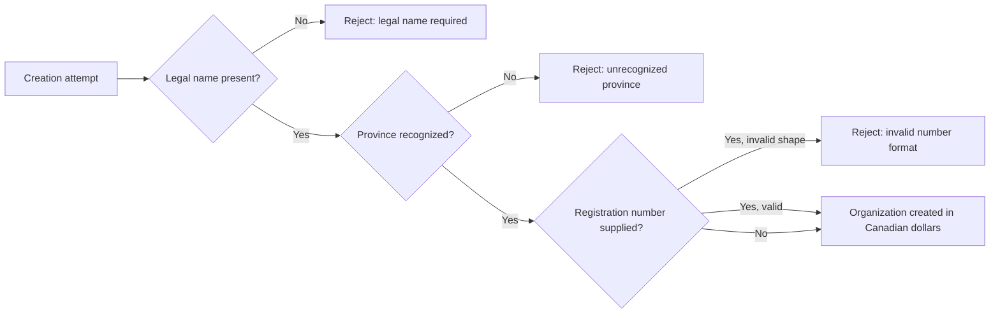


### Primary Province Selection Rules

THE system SHALL restrict the primary province to the recognized set of Canadian provinces and territories, such as Ontario, Quebec, Alberta, and British Columbia.

IF a submitted primary province is not on the recognized Canadian list, THEN THE system SHALL reject the attempt and ask for a listed province.

THE system SHALL use the primary province as the anchor for the whole tenancy's default tax behaviour, including which provincial rate applies when taxing broker fees.

WHEN the primary province is corrected, THE system SHALL apply the new province's defaults only to calculations performed afterwards, leaving amounts already recorded on existing documents untouched.

THE system SHALL accept the province regardless of case presentation and record it in its standard abbreviated form, so Ontario reads consistently everywhere it appears.


### GST/HST Registration Number Format

WHERE a GST/HST registration number is available, THE system SHALL record it on the organization so filings stay credible.

THE system SHALL treat the GST/HST registration number as optional, and WHEN it is absent, THE system SHALL still allow the organization to operate fully.

IF a GST/HST registration number is supplied, THEN THE system SHALL accept only entries matching the Canadian business numbering pattern of nine digits followed by the letters RT and four further digits, ignoring spaces between groups.

IF a supplied value does not match that pattern, THEN THE system SHALL reject the attempt and describe the expected nine-digit, RT, four-digit shape.

THE system SHALL allow the registration number to be added, corrected, or removed at any time without changing records already issued.


### Canadian Dollar Currency Lock

THE system SHALL establish Canadian dollars as the single operating currency of the organization at creation, reflecting the platform's Canada-first scope.

THE system SHALL express every monetary amount under the tenancy, including premiums, broker fees, taxes, commissions, invoice totals, and payments, in Canadian dollars.

IF anyone attempts to change the organization's currency after creation, THEN THE system SHALL refuse the change.

THE system SHALL refuse any monetary entry declared in a currency other than Canadian dollars, so no mixed-currency figures ever appear within one tenancy's records.


### Provincial Tax Rate Table Settings

THE system SHALL maintain a configurable provincial tax rate table among the organization settings that determines how taxable broker fees are charged.

THE system SHALL seed every new organization's tax rate table with Ontario harmonized sales tax at thirteen percent as the working default example.

WHEN a broker fee is taxed, THE system SHALL select the applicable rate from the organization's tax rate table according to the relevant province.

THE system SHALL store the rate actually applied whenever a fee is taxed, so historical documents remain explainable even after rates change.

THE system SHALL permit the tax rate table to be edited through organization settings, and WHEN an entry is changed, THE system SHALL apply the new rate only to calculations performed afterwards.

IF a calculation needs a province that has no entry in the table, THEN THE system SHALL charge no tax on the broker fee until the organization adds a rate, keeping the fee amount itself explicit.


### Organization Identity Stability Constraint

THE system SHALL keep the organization as the permanent root tenancy for its entire lifetime, because clients, quotes, policies, and invoices all hang beneath it.

THE system SHALL express corrections to organization details, including names, primary province, mailing address, phone number, GST/HST registration number, and settings, as updates to the existing record.

THE system SHALL NOT create a second organization as a way of correcting information belonging to the first, so history remains attributable to one continuous tenancy.

WHILE the organization exists, THE system SHALL keep its identity stable even as contact details evolve, allowing staff and reports to refer to the brokerage unambiguously over time.


## User Rules

A user account belongs to a brokerage and carries one of four roles: administrator, producer, customer service representative, or client portal user. The email address must be well-formed and unique within the brokerage so sign-in identity is never ambiguous. A password is mandatory at registration and must meet basic strength expectations before the account becomes usable. A display name is required so activities, tasks, documents, and approvals can be attributed to a readable person rather than an opaque label. Only active users may sign in; deactivating a user preserves their historical work while blocking future access. The very first administrator registration carries a special rule: it creates the organization itself, whereas every later user is invited or created by an administrator inside an existing brokerage. Role changes and deactivations remain administrator-only actions, and nobody may be assigned outside the four approved roles. Client-role accounts exist so the future portal can authenticate, yet they never manage brokerage staff or configuration.

### Unique Email Identity Within the Brokerage

- THE system SHALL enforce email address uniqueness within the brokerage that owns the account, so that one email address resolves to exactly one account.
- THE system SHALL evaluate email uniqueness across every account in the brokerage regardless of whether the account is currently active or deactivated.
- THE system SHALL compare email addresses case-insensitively when checking uniqueness, so differing capitalization cannot produce a second account.
- IF a user creation or update request omits the email address or supplies a malformed one, THEN THE system SHALL reject the request.
- WHEN a user's email address is changed, THE system SHALL re-run the uniqueness check before accepting the new value.
- IF the requested email address already belongs to another account in the same brokerage, THEN THE system SHALL reject the request and identify the conflict.

### Password Required at Registration

- THE system SHALL require a password whenever a new account is registered or provisioned.
- IF a supplied password fails the system's basic strength expectations, THEN THE system SHALL refuse to make the account usable until a compliant password is set.
- WHEN an invited user completes the token-based invitation step by setting an initial password, THE system SHALL activate the account for sign-in.
- WHEN a user completes a password reset with a valid reset token, THE system SHALL apply the same strength expectations to the replacement password.
- THE system SHALL never reveal a stored password credential in any response or listing.

### Display Name Attribution

- THE system SHALL require a display name for every account.
- IF a user creation request supplies an empty or blank display name, THEN THE system SHALL reject the request.
- THE system SHALL attribute recorded work — such as logged activities, assigned tasks, uploaded documents, and recorded changes — to the acting account's display name.
- THE system SHALL prefer display names over opaque identifiers wherever attributed work is presented to end users.
- WHEN a user's display name is changed, THE system SHALL keep previously attributed records pointing to the same account so history stays intact.

### Four Approved Roles

- THE system SHALL restrict role assignment to exactly four approved values: administrator, producer, customer service representative, and client portal user.
- IF a user creation or update request names any role outside the four approved values, THEN THE system SHALL reject the request.
- THE system SHALL give each account exactly one role; combined or multiple roles are not permitted.
- THE system SHALL place every invited or administrator-created account inside the acting administrator's brokerage and nowhere else.
- The complete capability differences between the four roles remain authoritative in 01-actors-and-auth.md; this section governs only assignment validity.

### Deactivated Users Cannot Sign In

- THE system SHALL permit sign-in only while an account's activation status is set to active.
- IF a deactivated account attempts to sign in, THEN THE system SHALL reject the attempt and report that the account is inactive.
- WHILE an account remains deactivated, THE system SHALL preserve every historical record attributable to that account without alteration.
- WHEN an administrator reactivates a deactivated account, THE system SHALL restore sign-in capability under the same email address and role.
- THE system SHALL retire accounts by deactivation rather than deletion, so organizational memory of past work is never lost.

### First Administrator Creates the Brokerage

- WHEN the very first administrator registers with an email address and password, THE system SHALL create the brokerage and that first administrator account together as one inseparable action.
- THE system SHALL establish the registering account as an administrator of the newly formed brokerage without requiring a pre-existing brokerage or prior invitation.
- IF a registration attempt targets an existing brokerage directly rather than arriving through an administrator's invitation, THEN THE system SHALL reject the attempt.
- THE system SHALL treat the first-administrator bootstrap as the only self-service entry point for creating a brokerage.

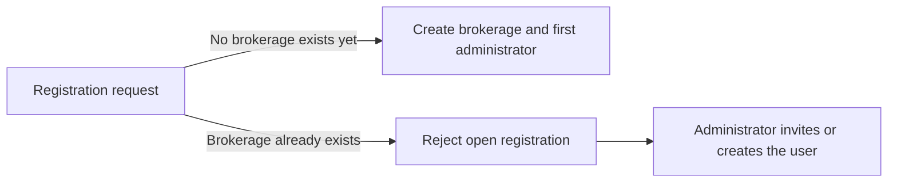

### Administrator-Only Role Management

- THE system SHALL reserve inviting users, creating users, changing roles, and deactivating accounts exclusively to administrators.
- IF a producer, customer service representative, or client portal account attempts any account administration action, THEN THE system SHALL reject the attempt.
- IF a proposed role change or deactivation would leave a brokerage with no active administrator, THEN THE system SHALL reject the request to protect the brokerage from losing administrative control.
- THE system SHALL allow administrators to correct their own profile details, subject to the last-active-administrator safeguard above for anything affecting their administrator role or activation status.
- THE system SHALL record every account administration action in the audit trail as defined for critical-entity changes (see AuditLog Rules).

### Client Portal Account Scaffolding

- THE system SHALL support client portal accounts that authenticate with an email address and password under the same identity rules as staff accounts.
- THE system SHALL treat each client portal account as representing one client of its brokerage, since portal access is scoped to that client's own records.
- THE system SHALL exclude client portal accounts from every staff capability, including account administration, carrier and product management, template management, commission schedule management, reporting, and audit log review.
- IF a client portal account attempts any staff-only operation, THEN THE system SHALL reject the attempt.
- WHILE the client-facing portal screens are not yet delivered, THE system SHALL still enforce the role boundary above at the backend level for every client portal account.

## ProducerLicence Rules

A producer licence records one provincial insurance credential held by a producer user, and every licence names a valid Canadian province. The licence type is mandatory and covers designations such as RIBO, and the licence number is required so regulators and carriers can cross-reference the credential. The issue date must fall before the expiry date, and both dates are always recorded so validity windows are computable at any moment. A licence whose expiry date has passed counts as expired, and one approaching expiry is flagged as expiring soon. Expired and expiring licences surface through compliance alerts and appear on the administrative dashboard so the brokerage reacts before a producer writes unlicensed business. Administrators and customer service representatives maintain licence records on behalf of producers. Renewal of a credential updates the record going forward while the earlier history remains visible, giving an auditable trail of credentials over time.

### Provincial Licence Requirement

Every producer licence represents exactly one provincial insurance credential held by one producer user. These rules define the mandatory attributes, validity logic, alert behaviour, maintenance rights, and history handling for the ProducerLicence concept.

THE SYSTEM SHALL require a province on every producer licence record.
THE SYSTEM SHALL accept only recognized Canadian provinces as the licence province.
IF the named province is not a recognized Canadian province, THEN THE SYSTEM SHALL reject the record.
THE SYSTEM SHALL associate every producer licence with exactly one producer user.
WHERE a producer holds credentials in several provinces, THE SYSTEM SHALL permit any number of licences for that producer, each naming its own province.
WHILE a licence record exists, THE SYSTEM SHALL keep its province unchanged except through an explicit amendment by a permitted maintainer.

### Licence Type and Number Validation

The licence type identifies the class of credential, covering designations such as RIBO, and the licence number allows regulators and carriers to cross-reference the credential.

THE SYSTEM SHALL require a licence type on every producer licence.
THE SYSTEM SHALL require a licence number on every producer licence.
IF the licence type is missing, THEN THE SYSTEM SHALL reject the record.
IF the licence number is missing, THEN THE SYSTEM SHALL reject the record.
IF a new licence repeats the same province, licence type, and licence number as an existing licence whose validity window has not ended, THEN THE SYSTEM SHALL reject the record as a duplicate.
WHERE the same licence number recurs after a prior licence of identical province, type, and number has fully expired, THEN THE SYSTEM SHALL treat the entry as a renewal rather than a duplicate.

### Issue Date and Expiry Date Validation

Both dates are always recorded so that every licence has a computable validity window at any moment.

THE SYSTEM SHALL require an issue date and an expiry date whenever a producer licence is created or amended.
IF the issue date is not earlier than the expiry date, THEN THE SYSTEM SHALL reject the record.
WHEN a producer licence is created or amended, THE SYSTEM SHALL validate the date relationship before saving the record.
WHERE a licence is recorded after its expiry date has already passed, THEN THE SYSTEM SHALL accept the historical record and classify it immediately under the expired detection rules.
IF either date is removed during an amendment, THEN THE SYSTEM SHALL reject the amendment because a validity window must remain computable.

### Expired Licence Detection and Expiring Soon Flagging

Validity classification derives solely from comparing the licence expiry date against the current date; no manual action moves a licence between classifications.

THE SYSTEM SHALL classify a producer licence as expired once the current date passes the licence expiry date.
WHILE the licence expiry date falls within the organization-configured warning window ahead of the current date, THE SYSTEM SHALL flag the licence as expiring soon.
WHEN a licence flagged as expiring soon passes its expiry date, THE SYSTEM SHALL reclassify it as expired automatically.
THE SYSTEM SHALL derive the validity classification from the current date whenever a licence is displayed, so a licence never shows a stale classification.
The length of the warning window is configured in organization settings, so different brokerages may warn earlier or later.

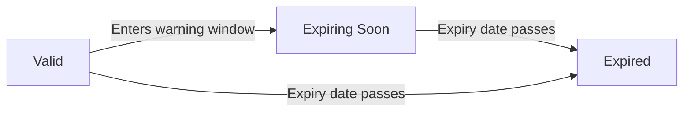

### Compliance Alert Source

Producer licences are the authoritative source data for licence-related compliance alerts; carrier appointment expiries are a separate alert source governed by their own unit and are never merged with licence alerts.

THE SYSTEM SHALL treat expired and expiring-soon producer licences as compliance alert conditions.
THE SYSTEM SHALL surface expired and expiring-soon licences in the compliance area of the administrative dashboard.
WHILE an expired licence has no renewed credential replacing it, THE SYSTEM SHALL continue to report it as an open compliance condition.
WHERE an organization also tracks carrier appointment expiries, THE SYSTEM SHALL present licence compliance and appointment compliance side by side without combining the two sources.
Delivery of individual notifications arising from these conditions follows the notification rules and is not redefined here.

### CSR Maintenance Rights

Licence records are maintained on behalf of producers by administrative and service staff; producers themselves do not perform licence maintenance.

ADMIN users may create, amend, and record renewals for the licence records of any producer in their organization.
CSR users may create, amend, and record renewals for the licence records of any producer in their organization.
A producer may view their own licence records.
IF a user without licence maintenance rights attempts to create, amend, or renew a licence record, THEN THE SYSTEM SHALL reject the request.
IF a maintainer attempts to modify a licence belonging to a producer outside their organization, THEN THE SYSTEM SHALL reject the request under tenant isolation rules.
The complete permission matrix is defined in the actors and authorization document; this section allocates only the licence-specific maintenance rights.

### Licence History Retention

Recording a renewal updates the credential going forward while keeping the earlier credential history visible, producing an auditable trail of a producer's credentials over time.

WHEN a licence credential is renewed, THE SYSTEM SHALL apply the new validity window going forward without erasing the prior record.
THE SYSTEM SHALL retain superseded licence records with their original issue date and expiry date intact.
THE SYSTEM SHALL NOT modify the recorded dates of a superseded licence when its replacement is added.
WHERE a producer's licence history is viewed, THE SYSTEM SHALL present all retained records, including superseded ones, alongside the currently effective credential.
IF a renewal would alter the dates of the prior licence instead of creating a forward-looking record, THEN THE SYSTEM SHALL reject the operation as a violation of history retention.

## Client Rules

A client is classified as either an individual or a business, and that choice decides which naming fields apply. Individuals require a first and last name, businesses require a legal name, and a preferred name is optional in both cases for friendlier correspondence. The primary province must come from the recognized Canadian province list, and the preferred language is limited to English or French so bilingual service expectations stay explicit. Email and phone follow normal contact formats whenever supplied. Every client carries a relationship status chosen from prospect, active, inactive, or lost, letting brokerages manage their sales funnel alongside their book. Free-form tags support grouping by market segment, referral source, or any internal convention. Each client is assigned to one producing agent who owns the relationship, and the assignee must be an active member of the brokerage. Removing a client happens softly, so historical quotes, policies, and invoices remain intact and readable afterward.

### Individual versus Business Naming Rules

- WHEN a client is created, THE system SHALL record whether the client is an individual or a business.
- WHERE the client type is individual, THE system SHALL require both a first name and a last name.
- WHERE the client type is business, THE system SHALL require a legal name.
- THE system SHALL accept an optional preferred name for both individual and business clients.
- IF an individual client is submitted without a first name or without a last name, THEN THE system SHALL reject the request and identify the missing naming fields.
- IF a business client is submitted without a legal name, THEN THE system SHALL reject the request.
- WHEN the client type is changed on an existing client, THE system SHALL require the naming fields appropriate to the new type before accepting the change.
- THE system SHALL treat the preferred name as correspondence guidance only; it never replaces the required names.

Validation flow:

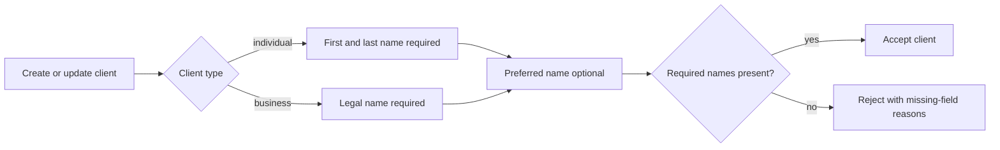

### Canadian Province and Language Validation

- THE system SHALL validate the client's primary province against the recognized Canadian provinces and territories: ON, QC, AB, BC, MB, SK, NS, NB, PE, NL, YT, NT, NU.
- IF the primary province is absent, blank, or outside the recognized list, THEN THE system SHALL reject the request and report the invalid province.
- THE system SHALL restrict the preferred service language to English or French.
- IF a language other than English or French is submitted, THEN THE system SHALL reject the request.
- WHEN no language preference is supplied at creation, THE system SHALL record English as the client's language.

### Email and Phone Format Constraints

- THE system SHALL leave the client's email address and phone number optional.
- IF an email address is supplied, THEN THE system SHALL require a well-formed email address and reject clearly malformed values.
- IF a phone number is supplied, THEN THE system SHALL require a plausible phone number and reject clearly malformed values.
- THE system SHALL accept free-form notes on a client without format restrictions.
- WHERE a client carries additional addresses, THE system SHALL validate each entry according to the Address rules defined in its own unit section.

### Relationship Status Rules

- THE system SHALL allow relationship status values of prospect, active, inactive, or lost only.
- WHEN a client is created without an explicit status, THE system SHALL record prospect as the initial status.
- IF a status outside the recognized set is submitted, THEN THE system SHALL reject the request.
- THE system SHALL permit changes among the four recognized statuses at any time so brokerages can correct misclassifications and manage their sales funnel.
- WHEN a relationship status changes, THE system SHALL leave related records such as quotes, policies, invoices, tasks, and activities untouched by the change itself.

### Free-form Tagging Constraints

- THE system SHALL accept free-form tag values on each client without requiring tags to pre-exist anywhere in the brokerage.
- WHEN a tag value carries surrounding whitespace, THE system SHALL trim it before storing.
- THE system SHALL prevent duplicate tags on the same client, treating values that differ only in letter case as duplicates.
- IF a tag value is empty after trimming, THEN THE system SHALL ignore it rather than store a blank entry.
- THE system SHALL keep tags purely descriptive: membership in a tag group never alters product eligibility, pricing, or access rights.

### Assigned Producer Ownership Rules

- THE system SHALL associate every client with exactly one assigned producer who owns the relationship.
- THE system SHALL require the assigned producer to be an active user holding the producer role within the same brokerage.
- IF the proposed assignee is inactive, holds a non-producer role, or belongs to a different brokerage, THEN THE system SHALL reject the assignment.
- WHEN a producer creates a client, THE system SHALL assign that producer as owner unless another eligible producer is explicitly named.
- THE system SHALL allow transfer of ownership between eligible producers at any time without rewriting historical attributions such as who recorded an activity.
- WHEN a producer is deactivated, THE system SHALL refuse new client assignments to that producer while keeping existing assignments readable.
- THE system SHALL permit reassignment of a deactivated producer's clients to any currently active producer of the same brokerage.

### Soft Removal and History Preservation

- THE system SHALL perform client removal as a soft removal that keeps the client record retrievable by the brokerage.
- THE system SHALL exclude removed clients from default client searches and listings.
- WHEN a client is removed, THE system SHALL leave all attached quotes, policies, invoices, documents, activities, and tasks intact and readable.
- IF an operation that requires a live client targets a removed client (for example, attaching a newly drafted quote), THEN THE system SHALL reject the operation.
- THE system SHALL exclude removed clients from brokerage-wide counts shown on dashboards.
- THE system SHALL NOT permanently erase a client through ordinary client management; final data disposal follows the retention and recovery policies defined in 05-non-functional.

## ClientContact Rules

Contacts capture the people a brokerage deals with inside a business client, and contacts attach only to business-type clients because individuals represent themselves. A contact requires a person name, while job title, email, and phone enrich the record, and at least one reachable channel should exist. Exactly one contact per business client holds the primary flag, and naming a new primary automatically clears the flag from the previous holder. Primary contacts act as the default recipients for proposals, policy documents, and billing correspondence. Contacts remain viewable even when their parent client goes inactive, keeping historical dealings reachable. Repeating the same person under one client draws a warning so duplicates never multiply quietly. Customer service representatives and producers both maintain contacts as part of servicing the account.

### Business Clients Only

Contacts capture the people a brokerage deals with inside a business client's organization. Because an individual client represents himself or herself, personal details for individuals live directly on the client record, and a contact roster is meaningless for them.

- THE SYSTEM SHALL allow contacts to be attached only to clients whose client type is business.
- IF a contact is submitted for a client whose client type is individual, THEN THE SYSTEM SHALL reject the request and explain that contacts are supported for business clients only.
- IF a change of a client's client type from business to individual is attempted while the client still holds one or more contacts, THEN THE SYSTEM SHALL refuse the change until every attached contact has been removed, preserving the business-clients-only constraint.
- Changing a contact's details never affects the parent client's type; this rule governs attachment only.

### Contact Field Validation and Reachability Expectation

A contact represents a specific person, so the person name is the anchor of the record.

- THE SYSTEM SHALL require a non-blank person name for every contact.
- THE SYSTEM SHALL accept an optional job title, which describes the person's role inside the business client's organization.
- THE SYSTEM SHALL accept an optional email address and an optional phone number as the contact's reachable channels.
- To honour the reachability expectation, IF a contact is created with neither an email address nor a phone number, THEN THE SYSTEM SHALL reject the request and explain that at least one reachable channel must be provided.
- THE SYSTEM SHALL validate that a supplied email address is well formed and that a supplied phone number is a usable telephone number.
- WHILE an existing contact is being edited, THE SYSTEM SHALL apply the same rules, so removing a contact's last remaining reachable channel is rejected.
- THE SYSTEM SHALL reject contact creation or edit requests whose person name consists only of whitespace.

### Primary Contact Uniqueness and Transfer

Every business client that has contacts has exactly one contact holding the primary contact flag at all times. The primary contact is the brokerage's main point of contact inside the client's organization.

- WHILE a business client has at least one contact, THE SYSTEM SHALL guarantee that exactly one of its contacts holds the primary contact flag — never zero and never two.
- WHEN the first contact is created for a business client, THE SYSTEM SHALL automatically mark that contact as primary, keeping the exactly-one-primary expectation intact from the start.
- WHEN a user designates a different contact as primary, THE SYSTEM SHALL clear the primary contact flag from the previous holder in the same action, so no manual unset step exists and two primaries can never coexist.
- WHEN the contact currently holding the primary contact flag is removed while other contacts remain, THE SYSTEM SHALL automatically transfer the primary contact flag to the longest-standing remaining contact, preserving the exactly-one invariant without extra work for staff.
- WHEN the last contact of a business client is removed, THE SYSTEM SHALL treat the client as having no contacts and therefore no primary, which is consistent because the invariant applies only among existing contacts.

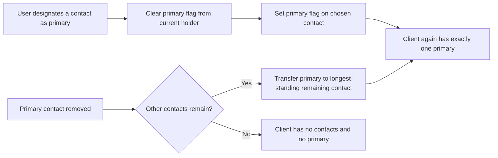

### Default Correspondence Recipient

The primary contact is the standing destination for routine paperwork the brokerage produces for a business client.

- WHEN a proposal, policy document, or billing correspondence is prepared for a business client that has contacts, THE SYSTEM SHALL designate that client's primary contact as the default recipient.
- IF the business client has no contacts at the time of preparation, THEN THE SYSTEM SHALL fall back to the client profile's own recorded email address as the default recipient.
- IF the client has neither contacts nor a client-level email address, THEN THE SYSTEM SHALL leave the recipient unspecified and require staff to choose one before the item leaves the office.
- WHERE a staff member explicitly selects a different recipient for a particular document or piece of correspondence, THE SYSTEM SHALL honour that choice over the default.
- These rules govern recipient selection only; how messages physically travel out of the system is outside the scope of this section.

### Duplicate Contact Warning

Duplicate contacts fragment a client's history, so the system watches for repeats instead of letting them multiply quietly.

- WHEN a contact is created or edited so that its person name matches an existing contact under the same business client and the two share at least one reachable channel (email address or phone number), THEN THE SYSTEM SHALL warn the user that a similar contact already exists before saving.
- THE WARNING SHALL name the existing suspected match so the user can review it directly.
- THE SYSTEM SHALL allow the user to confirm and save anyway, because two genuinely different people can share a name; the alert is advisory, never a block.
- Matching SHALL be evaluated only within a single client: the same person appearing under two different business clients is ordinary and never triggers a warning.
- A confirmed intentional duplicate SHALL not repeatedly warn on unrelated future edits unless the person-name-plus-channel combination is changed again.

### Historical Contact Retention

Contacts are part of a client's institutional memory, not disposable convenience data.

- THE SYSTEM SHALL keep contacts fully viewable regardless of the parent client's status, including prospect, active, inactive, and lost.
- WHEN a client moves to inactive or lost status, THE SYSTEM SHALL neither delete nor hide the client's contacts, so historical dealings remain reachable.
- Removal of a contact SHALL occur only through a deliberate action by authorized staff, never as an automatic consequence of a client status change.
- THE SYSTEM SHALL continue to show a former primary contact's identity in past correspondence references even after that contact is replaced or removed, preserving an accurate record of who received what.

### Servicing Staff Maintenance Rights

Maintaining the contact roster is day-to-day servicing work, and the servicing roles own it.

- THE SYSTEM SHALL permit producers assigned to a business client and customer service representatives to create, edit, and remove that client's contacts as part of servicing the account.
- THE SYSTEM SHALL permit administrators to maintain contacts across the whole organization.
- THE SYSTEM SHALL NOT permit portal clients to create, edit, or remove contacts; the contact roster is internal to the brokerage.
- Every contact change made by servicing staff SHALL obey the same validation, reachability, primary-transfer, and duplicate-warning rules defined in this file.
- The complete role-by-role permission matrix is defined in 01-actors-and-auth.md and is not repeated here.

## Address Rules

Addresses are typed as mailing, billing, or risk, and each type serves a distinct purpose: where correspondence goes, where invoices point, and where the insured property sits. A street line is mandatory, a secondary line is optional, and city plus province are required so every address stays mailable within Canada. The postal code must match the Canadian alphanumeric pattern, and the province must come from the recognized province list. Risk addresses tie quotes and policies to physical locations, which matters for underwriting questions and certificates of insurance. Multiple addresses per client are expected, for example a mailing address differing from a risk location. Editing replaces the shown value while the older wording remains recoverable, keeping previously issued documents meaningful. Unrecognized provinces or malformed postal codes are rejected immediately with plain-language messages.

### Address Type Classification: Mailing, Billing, and Risk

- WHERE an address is saved, THE SYSTEM SHALL classify it as exactly one type chosen from mailing, billing, or risk.
- THE SYSTEM SHALL treat a mailing address as the destination for correspondence directed to its owner.
- THE SYSTEM SHALL treat a billing address as the location that invoices point to for payment purposes.
- THE SYSTEM SHALL treat a risk address as the physical location of the property being insured.
- IF an address is submitted without a type or with a type outside these three, THEN THE SYSTEM SHALL reject it immediately.
- THE SYSTEM SHALL apply the same three types to organization addresses, because organizations reuse the address structure for their own contact and billing needs.
- THE SYSTEM SHALL rely on the assigned type when deciding which address appears where: billing wording feeds invoice documents, risk wording feeds certificates and schedules, and mailing wording feeds correspondence.

### Mandatory Content and Completeness Validation

- WHEN an address is created or edited, THE SYSTEM SHALL require the first street line, city, province, and postal code before accepting it.
- THE SYSTEM SHALL treat the second street line as always optional.
- IF the first street line is missing or contains only spaces, THEN THE SYSTEM SHALL reject the address with a message stating that a street address is required.
- IF the city is missing or contains only spaces, THEN THE SYSTEM SHALL reject the address with a message stating that the city is required.
- IF the province is missing, THE SYSTEM SHALL reject the address under the recognized province restriction (defined in Recognized Province Restriction).
- IF the postal code is missing or malformed, THE SYSTEM SHALL reject the address under the postal code pattern rule (defined in Canadian Postal Code Pattern).

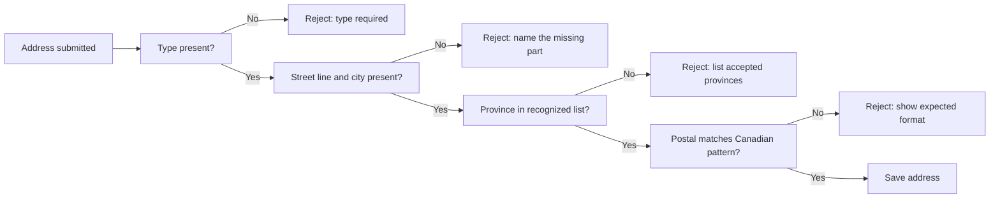

These checks run together so that every accepted address stays mailable within Canada.

### Canadian Postal Code Pattern

- WHEN a postal code is supplied, THE SYSTEM SHALL accept only the Canadian arrangement of six characters alternating letters and digits: letter, digit, letter, then digit, letter, digit (for example, K1A 0B1).
- THE SYSTEM SHALL accept the postal code written with or without the separating space between the two groups.
- THE SYSTEM SHALL accept letters typed in upper or lower case and shall store and display them in upper case.
- THE SYSTEM SHALL display postal codes with the separating space between the two groups.
- IF the supplied postal code does not match the expected arrangement, THEN THE SYSTEM SHALL reject it immediately with a plain-language message showing the expected shape, such as an example postal code.
- THE SYSTEM SHALL judge the postal code by the pattern alone and shall not attempt to confirm deliverability with any outside service.

### Recognized Province Restriction

- THE SYSTEM SHALL restrict province entries to the recognized list of Canadian provinces and territories: Alberta, British Columbia, Manitoba, New Brunswick, Newfoundland and Labrador, Northwest Territories, Nova Scotia, Nunavut, Ontario, Prince Edward Island, Quebec, Saskatchewan, and Yukon.
- WHEN an address is saved, THE SYSTEM SHALL require the province to be drawn from this recognized list.
- IF the province is absent, misspelled, or otherwise outside the recognized list, THEN THE SYSTEM SHALL reject the address immediately with a plain-language message that names the accepted choices.
- THE SYSTEM SHALL treat this same recognized list as the sole authority wherever an address province is recorded, including organization addresses.
- Province attributes carried by other kinds of records, such as producer licences or eligibility settings, are governed by their own rule sections and are not redefined here.

### Risk Address Ties Quotes and Policies to Locations

- WHERE a quote or policy covers property at a physical location, THE SYSTEM SHALL link it to a risk-type address belonging to the same client.
- THE SYSTEM SHALL use the linked risk address to answer location-based underwriting questions and to populate certificates of insurance and policy schedules.
- WHEN a document is rendered for a quote or policy, THE SYSTEM SHALL draw the location wording from the currently shown risk address.
- THE SYSTEM SHALL permit a client to hold several risk addresses so that distinct insured properties remain separately identified.
- IF a policy is bound or a certificate is issued without any risk address available for the client, THEN THE SYSTEM SHALL refuse the action until a risk address is added, because a covered location must be identifiable.

### Multiple Addresses per Client

- THE SYSTEM SHALL allow a client to hold any number of addresses without imposing an upper limit.
- THE SYSTEM SHALL expect common cases such as a mailing address that differs from the risk location.
- THE SYSTEM SHALL permit several addresses of the same type under one client, for instance two separate risk properties.
- THE SYSTEM SHALL attach each address to exactly one owner, either a single client or the organization itself, and shall not share an address between different clients.
- THE SYSTEM SHALL apply the completeness and format rules for street lines, city, province, and postal code equally to organization addresses.

### Edit Replacement and Recoverable Prior Wording

- WHEN an existing address is edited, THE SYSTEM SHALL replace the shown value with the new wording while keeping the earlier wording recoverable.
- THE SYSTEM SHALL preserve the prior wording for every changed part, including the street lines, city, province, and postal code.
- THE SYSTEM SHALL keep previously issued documents meaningful by allowing retrieval of the address wording as it stood when each document was produced.
- How long recovered wordings are kept follows the data-retention policies in 05-non-functional.md and is not redefined here.

### Plain-Language Rejection of Invalid Addresses

- WHEN any address validation fails, THE SYSTEM SHALL reject the submission immediately at the moment of entry rather than saving an invalid value.
- THE SYSTEM SHALL express every address rejection in plain language that names the offending part and states the expectation.
- FOR an unrecognized province, THE SYSTEM SHALL answer with guidance of the form: choose a province from the listed Canadian provinces and territories.
- FOR a malformed postal code, THE SYSTEM SHALL answer with guidance of the form: enter the postal code in the Canadian format, for example K1A 0B1.
- FOR a missing street line or city, THE SYSTEM SHALL answer by naming the part that must be filled in.
- THE SYSTEM SHALL exclude technical identifiers, internal codes, and system jargon from address rejection messages.
- General error-handling conventions are defined in the dedicated error-scenarios module; this section fixes only the address-specific message expectations.

## Activity Rules

Activities log client-facing interactions such as calls, emails, meetings, notes, and other touchpoints, building the relationship history on a client record. The subject line is mandatory so scanning a timeline stays meaningful, while the body holds the detail. Each activity records when it occurred, and backdating is permitted so representatives can log conversations that happened earlier, though implausible far-future moments are refused. Authorship is captured automatically from the signed-in user and cannot be reassigned casually, protecting accountability. Activities anchor to a client and feed the chronological timeline that mixes interactions with tasks, quotes, and policies. Corrections happen visibly rather than through invisible rewrites, so the interaction log doubles as a service evidence trail. Deletion is discouraged in favour of correction entries.

### Interaction Type Categories

Every activity belongs to exactly one interaction type category drawn from a fixed set of five: call, email, meeting, note, and other.

- THE system SHALL accept an interaction type only when it matches one of the five recognized categories.
- IF the interaction type is missing or does not match a recognized category, THEN THE system SHALL reject the request.
- THE system SHALL treat "other" as the designated category for client-facing touchpoints that fit none of call, email, meeting, or note.
- THE system SHALL allow a mistyped category to be corrected later through the normal visible-correction path (defined in Correction Over Deletion).
- THE system SHALL display the interaction type on the client timeline so a reader can distinguish a logged phone call from a written note at a glance.

### Mandatory Subject Line

The subject line is the scanning anchor of the interaction log, so it can never be empty.

- THE system SHALL require a subject line for every activity.
- IF the subject line is absent or contains only blank characters, THEN THE system SHALL reject the request.
- THE system SHALL trim leading and trailing blank characters from the subject line before recording it.
- WHEN a request is rejected for a missing subject line, THE system SHALL identify the subject line as the failing requirement so the representative can resubmit quickly.
- THE system SHALL accept an optional body that holds the fuller account of the interaction without imposing any presence requirement on it.

A submitted activity passes through the following validation gate before it reaches the client timeline:

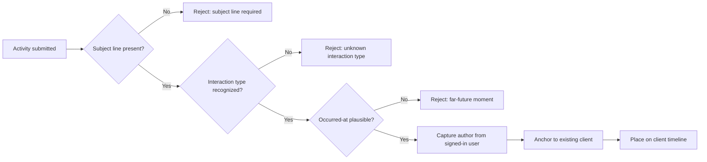

### Backdated Occurrence Allowed

Representatives often log a conversation after it has already happened, so the occurred-at moment is decoupled from the moment of logging.

- THE system SHALL record an occurred-at moment for every activity.
- THE system SHALL accept an occurred-at moment anywhere in the past so earlier conversations can be logged faithfully.
- IF no occurred-at moment is supplied, THEN THE system SHALL use the moment of logging as the occurred-at value.
- IF the occurred-at moment lies more than twenty-four hours ahead of the current time, THEN THE system SHALL reject the request as an implausible far-future entry (a pragmatic boundary chosen because the exact tolerance was left open).
- THE system SHALL store the occurred-at moment exactly as supplied rather than silently replacing it with the logging moment.
- WHEN a request is rejected for an implausible occurred-at moment, THEN THE system SHALL explain that the entry appears to come from too far in the future.

### Automatic Authorship Capture

Authorship answers "who spoke with this client", so the system derives it rather than trusting the request payload.

- THE system SHALL capture the authorship of every activity automatically from the signed-in user at the moment of logging.
- IF a logging attempt supplies a different authorship value, THEN THE system SHALL disregard the supplied value and record the signed-in user as the author.
- THE system SHALL NOT permit ordinary editing to reassign the original authorship of a recorded activity.
- THE system SHALL show the original author alongside any later corrections so accountability for the interaction remains attached to the person who had it.

### Client Timeline Contribution

An activity only exists in relation to a client, and it earns its place on that client's running story.

- THE system SHALL anchor every activity to exactly one existing client record before accepting it.
- IF the referenced client record cannot be found, THEN THE system SHALL reject the request.
- THE system SHALL position each activity on the client timeline according to its occurred-at moment rather than the moment of logging.
- THE system SHALL interleave activities with tasks, quotes, and policies on the same chronological client timeline, ordered as described in the domain model.
- WHEN an activity's occurred-at moment is corrected, THE system SHALL reposition the activity on the timeline immediately so the displayed order always reflects the corrected values.
- THE system SHALL render each timeline entry with its interaction type, subject line, author, and occurred-at moment.

### Correction Over Deletion and the Service Evidence Trail

The interaction log doubles as a service evidence trail, so the record favours transparent correction over silent rewriting.

- THE system SHALL treat editing as the standard way to fix an erroneous activity.
- THE system SHALL preserve the prior content of an edited activity together with who applied the change and when, so the history of the interaction remains inspectable.
- THE system SHALL attribute every visible correction to the user who applied it.
- THE system SHALL NOT expose routine removal of activities as an everyday operation.
- IF removal of an activity is genuinely unavoidable, THEN THE system SHALL perform it only as an exceptional action that is itself recorded, never as an untracked disappearance.
- WHEN a representative needs to retract the substance of an interaction, THE system SHALL expect a follow-up correction entry that states the retraction rather than an edit that erases the original wording.

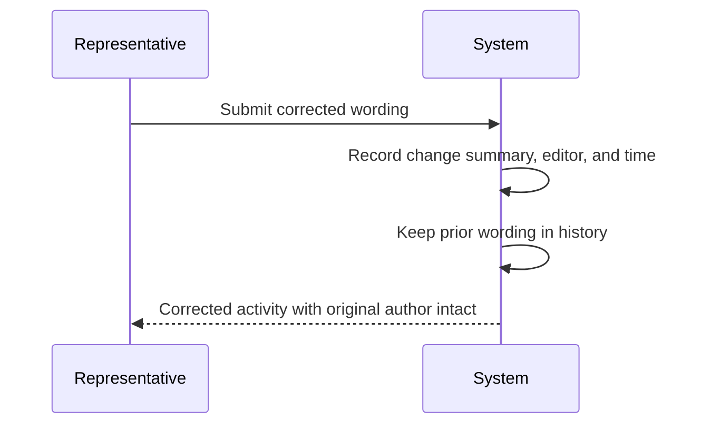

## Task Rules

Tasks represent follow-up work with a title that is mandatory and an optional longer description explaining what needs doing. A due date drives reminders, so any task meant to alert someone should always carry one. Task standing is limited to open, done, or cancelled, and completion and cancellation are terminal outcomes that freeze further changes to the outcome itself. Every task names an assignee who must be an active member of the brokerage, ensuring reminders land with a real person. Tasks may optionally reference a client or a policy so follow-ups appear on the right timelines and renewal checklists. When a task reaches its due moment unfinished, the system generates a notification for the assignee. Cancelling leaves the task visible in history so nothing disappears without explanation.

### Mandatory Task Title

Every task begins with a short title that tells the assignee what needs doing at a glance.

- THE SYSTEM SHALL require a title for every newly created task.
- IF a task creation request omits the title or supplies only blank characters, THEN THE SYSTEM SHALL reject the request and identify the missing title.
- WHEN an existing task is updated, THE SYSTEM SHALL continue to enforce the mandatory title rule, refusing updates that would leave the task untitled.
- THE SYSTEM SHALL allow the longer description explaining what needs doing to be omitted entirely.
- WHERE a description is supplied alongside the title, THE SYSTEM SHALL preserve both texts as written.

### Due Date Drives Reminders

The due date is the single driver of task reminders: a task without one can never become overdue.

- THE SYSTEM SHALL base all overdue evaluation exclusively on the task's due date.
- THE SYSTEM SHALL allow a task to be recorded without a due date.
- WHILE a task lacks a due date, THE SYSTEM SHALL perform no overdue evaluation for it, regardless of how long it stays open.
- WHEN an update moves the due date to a later moment, THE SYSTEM SHALL evaluate future overdue behaviour against the new due date only.
- WHERE a follow-up is meant to alert someone, the task shall be entered with a due date so the reminder machinery has something to act on.

### Open, Done, and Cancelled Standing

A task stands in exactly one of three positions: open, done, or cancelled. These are the only accepted standings, and only an open task can change its standing.

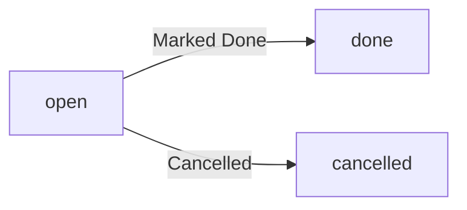

- THE SYSTEM SHALL restrict task standing to the values open, done, and cancelled.
- IF a request supplies a standing outside these three values, THEN THE SYSTEM SHALL reject the request as invalid.
- THE SYSTEM SHALL give every newly created task the standing open.
- WHILE a task stands open, THE SYSTEM SHALL permit moving it to done or to cancelled, and to no other standing.

### Terminal Completion Rule

Reaching done or cancelled ends a task's life permanently; the outcome itself can never be changed afterwards.

- WHEN a task arrives at done or cancelled, THE SYSTEM SHALL freeze its standing against any further change.
- IF any attempt is made to reopen, complete, cancel, or otherwise alter the standing of a task already carrying a closing outcome, THEN THE SYSTEM SHALL reject the attempt and explain that the task is closed.
- WHILE a task stands done or cancelled, THE SYSTEM SHALL exclude it from all reminder evaluation.
- THE SYSTEM SHALL keep done and cancelled tasks visible in listings and in the recorded history so nothing disappears without explanation.

### Assignee Must Be Active

Reminders must land with a real person, so every task names exactly one assignee drawn from the brokerage's active members.

- THE SYSTEM SHALL require exactly one assignee on every task.
- IF the selected assignee is not an active member of the brokerage, THEN THE SYSTEM SHALL reject the assignment.
- WHEN an existing task is handed to a different person, THE SYSTEM SHALL apply the same active-member check to the incoming assignee before accepting the change.
- WHEN a member holding tasks becomes inactive, THE SYSTEM SHALL keep their existing tasks visible and allow them to be reassigned to an active member through the normal change process, so no follow-up is stranded with someone who can no longer act on it.

### Optional Client or Policy Link

Tasks may stand alone as general follow-ups or be anchored to a client, a policy, or both, which places them on the right timelines and renewal checklists.

- THE SYSTEM SHALL allow a task to reference a client, reference a policy, reference both, or reference neither.
- IF a task names a client that does not exist, THEN THE SYSTEM SHALL reject the request.
- IF a task names a policy that does not exist, THEN THE SYSTEM SHALL reject the request.
- WHERE a task references a client, THE SYSTEM SHALL present the task on that client's chronological timeline.
- WHERE a task references a policy, THE SYSTEM SHALL present the task in that policy's follow-up context alongside its renewal activity.

### Overdue Notification Generation

When an unfinished task crosses its due date, the system raises a notification so the work is not silently forgotten.

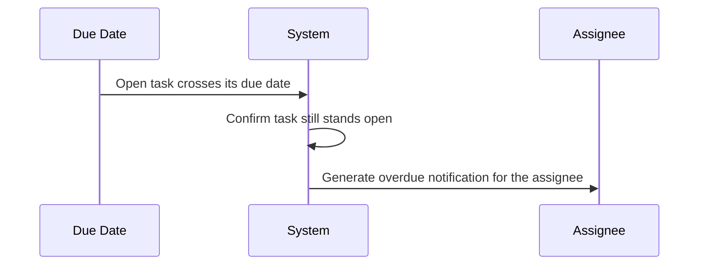

- WHEN an open task passes its due date without reaching done or cancelled, THE SYSTEM SHALL generate an overdue notification.
- THE SYSTEM SHALL address the overdue notification to the assignee named on the task.
- IF a task reaches done or cancelled before its due date, THEN THE SYSTEM SHALL never generate an overdue notification for it.
- WHERE a task carries no due date, THE SYSTEM SHALL generate no overdue notification at any time.

## Document Rules

Documents store files alongside rich metadata: a human-readable filename, a document kind, the media type, and the file size. Ownership is polymorphic, meaning a document attaches to exactly one of a client, quote, policy, or invoice, and the attachment is mandatory so nothing floats unlinked. The uploader is always recorded for accountability, and the storage location is generated by the system so internal paths are never user-controlled. An integrity fingerprint accompanies each stored file, and replacing a file bumps its version rather than overwriting, so previously issued schedules and certificates stay reproducible. Numeric size caps and acceptable media types follow the dedicated file-validation section, which owns those policies. Removal is soft: deleted documents leave listings yet remain recoverable for audits. Documents produced from templates, such as proposal schedules, enter the same store with their origin noted alongside manually uploaded files.

### Document Metadata Completeness

Every stored document must carry complete descriptive metadata before the system accepts it. These completeness rules apply equally to manually uploaded files and files produced from templates.

- THE system SHALL require a non-empty, human-readable filename for every document before storing it.
- THE system SHALL require each document to declare a document kind that describes its purpose.
- THE system SHALL capture the media type and file size of each stored file as observed by the system at intake.
- THE system SHALL record the upload date and time automatically at the moment the file is accepted.
- THE system SHALL reject a document submission when any mandatory element — the owner record, the filename, the document kind, the media type, or the file size — is absent.
- IF the declared file size does not match the size of the content actually received, THEN THE system SHALL reject the submission.
- THE system SHALL display the filename exactly as the uploader supplied it, while never relying on that filename for any internal addressing purpose.
- Numeric size caps and the list of acceptable media types are owned by the File Validation and Policies rules; this section defers to them entirely and introduces no independent limits.

### Polymorphic Attachment Target

A document attaches to exactly one owning business record. The attachment is mandatory and permanent; nothing floats unlinked in the document store.

- THE system SHALL accept a document only when it names exactly one owner among a client, a quote, a policy, or an invoice.
- THE system SHALL refuse to store any document that lacks an owner or names more than one owner.
- THE system SHALL verify that the named owner exists within the requesting organization before accepting the attachment.
- IF the named owner has been removed from active use, THEN THE system SHALL reject the attachment of new documents to it.
- WHERE a document is logically relevant to more than one record, THE system SHALL still store it against a single owner; other relationships remain visible through their own records rather than through duplicated attachments.
- THE system SHALL treat the attachment as permanent once created: ownership cannot be reassigned to a different record afterward.
- IF a user needs the same file associated with another record, THEN THE system SHALL handle this through a new submission of that file rather than by moving the existing document.

### Uploader Accountability

The person who puts a file into the system is always identifiable. Attribution happens automatically and cannot be shaped by the request itself.

- THE system SHALL derive the uploader of every document from the authenticated user performing the action at creation time.
- THE system SHALL disregard any attempt by a requester to designate someone else as the uploader.
- THE system SHALL keep the uploader attribution unchanged for the life of the document.
- THE system SHALL record a separate uploader for each version produced by a replacement, so accountability follows every revision of the file.
- FOR documents produced by rendering a template, THE system SHALL attribute the user who triggered the generation as the accountable originator, alongside the noted template origin.
- THE system SHALL make uploader attribution available to the audit trail alongside other document changes.

### System-Generated Storage Location

Where a file physically resides is decided exclusively by the system. Requesters control what they upload, never where it lands.

- THE system SHALL generate the storage location internally whenever a file is accepted into the document store.
- THE system SHALL ignore any storage location supplied by the requester.
- THE system SHALL guarantee that each stored file version receives its own unique location so that no submission ever overwrites the stored bytes of another.
- THE system SHALL base the generated location solely on system-chosen identifiers, so that a crafted or hostile filename cannot influence where content is placed.
- THE system SHALL keep the storage location outside the reach of ordinary document editing: renaming a document changes its display filename only, never its storage location.

### Integrity Fingerprint

Each stored file carries an integrity fingerprint computed from its exact contents, allowing the system to detect silent corruption of issued schedules and certificates.

- THE system SHALL compute the integrity fingerprint itself from the received file contents at intake.
- THE system SHALL disregard any fingerprint value supplied by the requester.
- THE system SHALL bind each fingerprint permanently to the exact bytes of the version it describes; a fingerprint never changes once set.
- WHEN the system verifies a stored file against its fingerprint and finds a mismatch, THE system SHALL flag that document as failing integrity verification.
- WHEN a document is replaced, THE system SHALL compute a fresh fingerprint for the incoming version while leaving the outgoing version's fingerprint untouched.
- THE system SHALL treat the fingerprint as part of the immutable record of every version, available for audit inspection.

### Versioned Replacements

Replacing a file never destroys what was there before. Each replacement adds a new version, keeping previously issued schedules and certificates reproducible indefinitely.

- THE system SHALL create a new version of the document when an existing document is replaced, rather than modifying the previously stored file.
- THE system SHALL number versions sequentially beginning at one, incrementing by exactly one per replacement, and never reuse a version number within a document.
- THE system SHALL retain every prior version, together with its own filename, media type, file size, fingerprint, uploader, and timestamp.
- THE system SHALL present the newest version by default wherever documents appear, while keeping all earlier versions reachable through the document's version history.
- THE system SHALL allow the filename, media type, and file size to differ between versions; each version carries its own values.
- IF a replacement submission fails intake validation, THEN THE system SHALL leave the currently stored version completely unchanged.
- IF a document has been removed, THEN THE system SHALL refuse further replacements until it is restored.

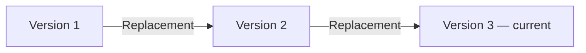

### Soft Removal Recoverability

Removal hides a document from everyday work without destroying it. Deleted documents stay recoverable so audits can reconstruct what was issued and seen.

- THE system SHALL exclude removed documents from ordinary document listings immediately upon removal.
- THE system SHALL preserve the full content, metadata, and version history of removed documents for recovery purposes.
- HOW LONG removed documents are kept before final disposal is owned by the data retention and recovery policies; this section imposes no independent retention period.
- THE system SHALL return a removed document intact — including all versions and attribution — when it is restored.
- THE system SHALL stop offering removed documents anywhere references to a client's, quote's, policy's, or invoice's documents are assembled.
- IF a removal is requested for a document already removed, THEN THE system SHALL reject the request as a duplicate.
- IF a restoration is requested for a document that was never removed, THEN THE system SHALL reject the request.
- THE system SHALL continue to honour the single-owner attachment rule for removed documents; removal never detaches a document from its owner.

### Template-Generated Documents

Documents rendered from templates live in the same store as uploads and obey the same rules. Their only difference is a recorded origin, so consumers can tell a generated proposal schedule from a scanned upload.

- THE system SHALL store template-generated output in the shared document store under the same rules that govern manually uploaded files.
- THE system SHALL note the template origin on every generated document, distinguishing it from manual uploads.
- THE system SHALL require both the template and the target owner record to belong to the requesting organization before generating a document.
- IF the named template does not exist in the organization, THEN THE system SHALL reject the generation request without creating any document.
- WHEN the requested template contains placeholder variables whose values cannot be resolved for the target entity, THE system SHALL fail the generation and store nothing.
- THE system SHALL determine the document kind of a generated document from the template's purpose, and derive a sensible filename from the template and target entity when none is supplied.
- THE system SHALL render generated documents in the language configured on the template used.
- THE system SHALL apply attachment, uploader attribution, fingerprinting, versioning, and soft removal identically to generated documents and uploaded documents.

## Carrier Rules

A carrier represents an insurance company the brokerage places business with, and both the display name and a short reference code are required. The reference code must be unique within the brokerage so lists, exports, and reports resolve without confusion. An optional financial strength remark is stored as free text rather than pulled from a ratings feed, since v1 has no live integrations. Public-facing details such as website, service email, and phone help staff route inquiries without leaving the system. Internal notes give producers room for appointment quirks and submission preferences learned over time. Marking a carrier inactive removes it from new quoting choices while preserving every historical quote, policy, and commission written through it. Administrators alone maintain carriers because they shape what the whole brokerage can sell.

### Carrier Identification and Unique Reference Code

- THE system SHALL require both a display name and a short reference code whenever a carrier is created.
- IF either the display name or the reference code is missing or blank, THEN THE system SHALL reject the carrier creation request.
- THE system SHALL enforce that each carrier reference code is unique within the brokerage, so lists, exports, and reports resolve to exactly one carrier.
- IF a proposed reference code differs from an existing brokerage carrier code only by upper or lower case letters, THEN THE system SHALL treat it as a duplicate and reject the request.
- IF a carrier has been referenced by any quote line, policy, submission, or commission record, THEN THE system SHALL refuse further edits to its reference code.
- WHILE a carrier has never been referenced by any business record, THE system SHALL allow an administrator to correct its reference code subject to the uniqueness rule above.
- THE system SHALL allow the display name to be corrected at any time, because historical records reference the carrier itself rather than copying its display name.

### Financial Strength Remark as Free Text

- THE system SHALL accept an optional financial strength remark as free text entered during carrier maintenance.
- THE system SHALL NOT fetch, synchronize, or refresh the financial strength remark from any external rating agency, since v1 has no live carrier integrations.
- THE system SHALL store the remark exactly as written by the administrator, without imposing any structure or vocabulary on its content.
- WHERE a financial strength remark is present, THE system SHALL show it wherever carrier summary information is displayed to brokerage staff.
- THE system SHALL NOT evaluate, score, or threshold the remark, and the presence, absence, or wording of the remark shall never block quoting, submission, or binding with that carrier.

### Carrier Contact Routing Details

- THE system SHALL accept an optional website address, service email address, and service telephone number for each carrier, holding at most one value of each kind per carrier.
- IF a service email address is provided, THEN THE system SHALL reject the change when the value is not shaped like an email address.
- IF a website address is provided, THEN THE system SHALL reject the change when the value is not a well-formed web address.
- THE system SHALL present these contact routing details to brokerage staff so client inquiries, submission follow-ups, and carrier service questions can be directed correctly without leaving the application.
- THE system SHALL treat these contact routing details as brokerage-facing reference information maintained together with the carrier record.

### Internal Producer Notes

- THE system SHALL provide an internal free-text notes area on each carrier record for capturing appointment quirks and carrier submission preferences learned over time.
- THE system SHALL allow administrators to write and update carrier notes, consistent with administrator maintenance rights (defined in Administrator Maintenance Rights).
- THE system SHALL allow producers and CSRs to read carrier notes when preparing submissions and servicing business.
- IF a document is rendered for delivery outside the brokerage, THEN THE system SHALL exclude carrier notes from the rendered output.
- THE system SHALL NOT require any particular structure, length, or vocabulary for carrier notes.

### Inactive Carrier Restrictions

- WHEN an administrator marks a carrier inactive, THE system SHALL remove it from the carrier choices offered when a new quote line is created.
- THE system SHALL prevent new submissions from being initiated with an inactive carrier.
- WHILE a submission involving an inactive carrier is already underway, THE system SHALL continue to let its status advance to a final outcome.
- IF a product belonging to an inactive carrier is chosen for new quoting work, THEN THE system SHALL reject the choice, independent of the product's own eligibility rules (defined in Product Rules).
- WHEN an administrator reactivates a carrier, THE system SHALL restore its availability for new quoting choices immediately.

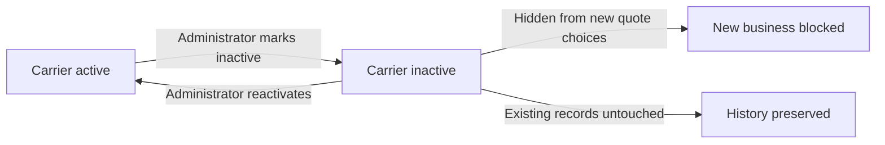

### Historical Business Preservation

- WHEN a carrier is marked inactive, THE system SHALL leave every quote, policy, endorsement, invoice, and commission previously written through that carrier unchanged, readable, and reportable.
- THE system SHALL include business written through inactive carriers in brokerage reports and commission statements.
- IF a carrier has ever been referenced by any business record, THEN THE system SHALL refuse permanent deletion and SHALL offer deactivation as the only removal path.
- WHERE a carrier has never been referenced by any business record, THE system SHALL allow an administrator to remove it outright.
- THE system SHALL let staff open and review quotes, policies, and commissions belonging to an inactive carrier without reactivating the carrier first.

### Administrator Maintenance Rights

- THE system SHALL restrict creating, editing, deactivating, and reactivating carriers to administrators, because carrier choices shape what the whole brokerage can sell.
- THE system SHALL grant producers and CSRs read access to carriers so they can quote, submit, and service business.
- IF a user without administrator rights attempts any carrier maintenance operation, THEN THE system SHALL reject the operation.
- THE system SHALL deny client-role users access to carrier records and carrier maintenance.
- WHEN an administrator changes a carrier record, THE system SHALL apply the change immediately across the brokerage.

## CarrierAppointment Rules

An appointment links the brokerage to a carrier and records whether that carrier authorized the brokerage to write business on its behalf, together with an expiry date. Whenever an appointment stands, its expiry date is required, because a dated authorization is the entire point of tracking. An appointment past its expiry counts as lapsed and becomes a source for compliance alerts rather than being hidden away. These lapses appear on the administrative dashboard beside expired producer licences so the compliance picture reads complete in one place. Renewing simply advances the expiry date, keeping one authoritative record per carrier relationship instead of stacking duplicates. Workflows that depend on an authorization draw attention when the underlying appointment has lapsed, reinforcing the alert rather than silently permitting placement. Appointments are maintained alongside carriers by administrators, since both define the brokerage's authority to sell.

### Appointment Expiry Mandatory

THE system SHALL treat the expiry date as a mandatory element of every carrier appointment standing between a brokerage and a carrier, because a dated authorization is the entire point of tracking.

WHEN an appointment is created between a brokerage and a carrier, THE system SHALL reject the request if no expiry date is provided.

WHEN an existing appointment is amended, THE system SHALL reject any change that removes or blanks the recorded expiry date.

IF an appointment is recorded with an expiry date already in the past, THEN THE system SHALL accept the record but immediately report it as lapsed under the detection rule defined in "Lapsed Appointment Detection".

THE system SHALL compare appointment dates using calendar days, so an appointment becomes lapsed on the day after its recorded expiry date.

### Lapsed Appointment Detection

THE system SHALL classify a carrier appointment as lapsed once the current date passes its recorded expiry date.

WHILE an appointment's expiry date lies in the past, THE system SHALL report the appointment as lapsed wherever appointment standing is shown or consulted.

THE system SHALL keep lapsed appointments visible in appointment listings and compliance views rather than hiding or removing them, because a lapse is itself a compliance signal.

WHEN a workflow that depends on the carrier's authorization engages a lapsed carrier — for example, preparing to place coverage with that carrier — THE system SHALL draw attention to the lapsed standing instead of proceeding silently, reinforcing the alert rather than quietly permitting placement.

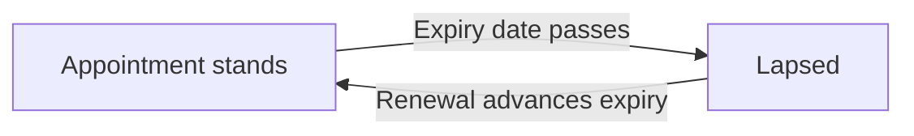

An appointment leaves the lapsed classification only through renewal advancing the expiry date, as governed by "Renewal Advances Expiry".

### Compliance Alert Generation

THE system SHALL treat every lapsed carrier appointment as a qualifying source for compliance alerts, in the same way an expired producer licence qualifies.

THE system SHALL generate the compliance signal automatically from the passage of the expiry date; administrators need not flag a lapse manually for it to count.

Alert delivery mechanics are governed by the Notification rules; this section governs only what qualifies as a compliance signal.

### Dashboard Compliance Visibility

THE system SHALL surface lapsed carrier appointments on the administrative dashboard beside expired producer licences, so the compliance picture reads complete in one place.

WHERE several appointments are lapsed at once, THE system SHALL present them together within the same compliance view rather than scattering them across unrelated screens.

WHERE an appointment's expiry date is approaching but has not yet passed, THE system SHALL also reflect it in the compliance view, mirroring how expiring producer licences are treated, so attention is drawn before an authorization lapses.

### Single Record per Carrier Relationship

THE system SHALL maintain exactly one authoritative appointment record for each pairing of a brokerage and a carrier.

WHEN an appointment already exists for the same brokerage–carrier pairing, THE system SHALL reject the creation of a second appointment for that pairing.

IF a request attempts to stack duplicate appointment records against a carrier relationship, THEN THE system SHALL refuse the request and direct the requester to amend or renew the existing record instead.

THE system SHALL preserve the single record's continuity across amendments and renewals, so the history of a carrier relationship accumulates under one authoritative entry rather than fragmented duplicates.

### Renewal Advances Expiry

WHEN an appointment is renewed, THE system SHALL advance the existing record's expiry date forward to the newly agreed date.

THE system SHALL NOT create additional appointment records during renewal; renewal amends the single authoritative record established under "Single Record per Carrier Relationship".

WHEN a renewal advances the expiry date beyond the current date, THE system SHALL cease reporting the appointment as lapsed from that point onward.

IF a renewal proposes an expiry date that does not move forward from the currently recorded one, THEN THE system SHALL reject the renewal and require a date that genuinely extends the authorization.

### Administrator Maintenance Rights

THE system SHALL reserve creation, amendment, and renewal of carrier appointments for administrators, who maintain them alongside carriers because both define the brokerage's authority to sell.

WHEN a non-administrator attempts to create, amend, or renew a carrier appointment, THE system SHALL reject the operation.

THE system SHALL apply these maintenance rights consistently with carrier management rights, so both records governing selling authority are administered by the same role.

## Product Rules

A product is an insurable offering belonging to exactly one carrier, carrying a name, a reference code, and a line of business drawn from the fixed catalogue of auto, home, commercial property, commercial liability, life, health, disability, travel, and other. Reference codes stay unique within the brokerage so quoting screens and reports point at one thing only. Each product declares eligibility rules covering permitted provinces, permitted client types, and minimum or maximum values, and the system enforces those rules whenever the product attaches to a quote line rather than merely displaying them. Each product also declares its rating input definition, describing which coverage options, limits, deductibles, and risk questions a quotation must answer, and incomplete answers block pricing. Where a formula table exists, pricing derives from it, yet manual premium entry remains always available. Default commission terms ride along through the product's commission schedule. Deactivating a product bars it from new quote lines while leaving existing quotes, policies, and history untouched. Administrators curate products because eligibility and rating definitions govern the entire book.

### Product Definition and Line of Business Catalogue

- THE system SHALL require every product to belong to exactly one carrier and carry a display name, a reference code, and a line of business.
- THE system SHALL restrict the line of business to the fixed catalogue: auto, home, commercial property, commercial liability, life, health, disability, travel, other.
- IF a product submission omits the display name, the reference code, or the line of business, THEN the system SHALL reject the request.
- IF a product submission carries a line of business outside the fixed catalogue, THEN the system SHALL reject the request.
- IF the carrier named for a product does not exist within the brokerage, THEN the system SHALL reject the request.
- THE system SHALL accept an optional plain-language description on every product.
- IF a user who is not an administrator creates, updates, deactivates, or reactivates a product, THEN the system SHALL reject the request.

### Unique Product Code Within the Brokerage

Reference codes exist so quotation screens and reports point at exactly one offering inside a brokerage; two separate brokerages may reuse the same code independently.

- THE system SHALL enforce uniqueness of the product reference code within a single brokerage.
- IF a new or edited product carries a reference code already held by another product in the same brokerage, THEN the system SHALL reject the request regardless of letter casing.
- WHERE identical reference codes appear in two different brokerages, THEN the system SHALL accept both because uniqueness never crosses tenant boundaries.

### Eligibility Enforcement at Quote-Line Attachment

Eligibility rules are declarations of who a product may serve: permitted provinces, permitted client types (individual or business), and minimum or maximum value bounds. They are enforced automatically whenever the product attaches to a quote line, not merely displayed for guidance.

- THE system SHALL store each product's eligibility rules in structured form so they can be evaluated automatically rather than read as free text.
- WHEN a quote line attaches a product, THEN the system SHALL evaluate every eligibility rule of that product before accepting the attachment.
- IF the client's primary province does not appear among the product's allowed provinces, THEN the system SHALL reject the attachment and report the province mismatch.
- IF the client's type (individual or business) does not appear among the product's allowed client types, THEN the system SHALL reject the attachment and report the client-type mismatch.
- IF the requested value falls below the product's minimum bound or above its maximum bound, THEN the system SHALL reject the attachment and identify the bound that was exceeded.
- WHERE a product declares no restriction for a given dimension, THEN the system SHALL treat every value along that dimension as eligible.
- IF an eligibility rule cannot be interpreted by the system, THEN the system SHALL reject the attachment rather than silently admit the product.
- THE system SHALL apply eligibility checks at attachment time only; editing eligibility afterwards never detaches lines attached earlier under the previous rules.

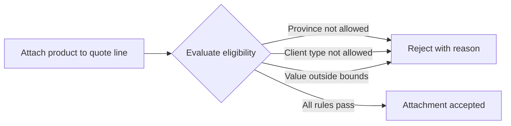

### Rating Input Definition Gates Pricing

A product's rating input definition describes the coverage options, limits, deductibles, and risk questions any quotation of that product must answer. Incomplete answers block pricing.

- THE system SHALL hold, per product, a rating input definition enumerating every input a quotation must supply before pricing.
- WHEN a quote line is priced, THEN the system SHALL confirm every input named in the product's rating input definition carries an answer.
- IF any required rating input is missing or blank, THEN the system SHALL refuse to price the quote line and report which inputs remain outstanding.

### Formula Pricing with Manual Override

Where a product carries a formula configuration, premiums derive from it; manual entry always remains available.

- WHERE a product carries a formula configuration, THEN the system SHALL derive the quote-line premium from that formula using the supplied rating-input answers.
- THE system SHALL always permit manual premium entry, including when a formula configuration exists.
- WHERE a producer enters a premium manually, THEN the system SHALL treat the manual figure as authoritative and keep the formula-derived figure available for comparison.
- IF the formula configuration cannot produce a figure from the supplied answers, THEN the system SHALL require manual premium entry instead of leaving the line silently unpriced.

### Commission Defaults Inheritance

Default commission terms ride along through the product's commission schedule into every quote line created for that product.

- WHEN a quote line is created for a product, THEN the system SHALL seed the line's commission estimate from the product's commission schedule defaults (agency rate percent and producer split percent).
- WHERE the commission schedule defines a tier table, THEN tier selection follows the rules defined under Commission Schedule Rules; this section governs only that the defaults flow into the newly created line.
- WHERE a product carries no commission schedule, THEN the system SHALL leave the commission estimate unset rather than assume a zero rate.

### Deactivation Preserves History

Deactivation withdraws a product from new sale while leaving every historical trace readable.

- WHILE a product is deactivated, THEN the system SHALL refuse to attach that product to any newly created quote line.
- THE system SHALL keep deactivated products fully readable wherever they were historically used, including past quotes, policies, and reports.
- THE system SHALL leave existing quotes and policies referencing a deactivated product completely unchanged.
- IF reactivation is requested, THEN the system SHALL restore the product's availability for new attachments without altering any historical record.
- IF deletion of a product is attempted while any quote line or policy still references it, THEN the system SHALL reject the deletion and direct the administrator to deactivate instead.
- WHERE a product has never been referenced by a quote line or policy, THEN the system SHALL permit its removal.

## CoverageItem Rules

A coverage item is a catalogue entry describing one piece of protection available under a product, carrying a name, a reference code, and an optional default limit. Reference codes stay unique within their parent product so selections map cleanly between quotes, proposals, and policy schedules. The default limit acts as a prefill convenience when building quotations, sparing repetitive entry for common protections. An optionality marker separates coverages the client may drop from those the product always includes. Changing a catalogue default affects only future quotations, because existing quotes and issued policies keep the figures they were priced and bound with, preserving contract integrity. Coverage items are maintained by administrators together with their parent product, defining what the brokerage is authorized to offer. Removing a coverage item from sale does not disturb schedules already issued under it.

### Coverage Code Uniqueness Within Parent Product

Every coverage item carries a human-readable name and a reference code identifying it inside its parent product. The reference code exists so that a protection selected while quoting maps unambiguously onto proposal documents and policy schedule lines.

THE system SHALL require both a name and a reference code whenever a coverage item is created.
WHEN a coverage item is created or modified, THE system SHALL reject a reference code that duplicates the reference code of another coverage item under the same product, treating codes that differ only by letter casing as duplicates.
IF a duplicate reference code is submitted, THEN THE system SHALL reject the request and identify the conflicting coverage item already holding that code.
THE system SHALL accept identical reference codes under different products, including products of different carriers, because uniqueness is scoped to a single parent product.
THE system SHALL preserve the reference code originally recorded on a quotation selection or policy schedule line when the underlying catalogue code changes later, so historical documents remain interpretable.

### Default Limit Prefill Behaviour

A coverage item may define a default limit: a monetary amount in Canadian dollars offered as the starting value whenever that coverage is selected. The default limit is a data-entry convenience, not a contractual figure.

WHERE a coverage item defines a default limit, THE system SHALL prefill that limit when the coverage is added to a quotation.
THE system SHALL allow the producer to override the prefilled limit on any individual selection without changing the catalogue default itself.
IF a coverage item carries no default limit, THEN THE system SHALL leave the limit empty for manual entry instead of assuming a value.
IF a negative default limit is submitted, THEN THE system SHALL reject the catalogue change.
WHEN an administrator changes a coverage item's default limit, THE system SHALL apply the new value only to coverage selections made from that moment forward, as described in Catalogue Stability and Contract Figure Preservation.

### Optional Versus Mandatory Coverage Selection

Each coverage item carries an optionality marker separating protections the client may drop from protections the product always includes. An item marked optional may be omitted from a selection; an item not marked optional is treated as always included.

WHERE a coverage item is marked optional, THE system SHALL allow producers to omit the coverage entirely from a quotation or remove it after it was added.
IF a coverage item is not marked optional, THEN THE system SHALL prevent its removal from any quotation built from the parent product.
WHEN a new coverage item is created without an explicit optionality choice, THE system SHALL treat the item as optional.
WHEN an administrator changes a coverage item's optionality marker, THE system SHALL confine the effect to future selections; selections already saved on quotations and issued policies keep the optionality under which they were captured.

### Catalogue Stability and Contract Figure Preservation

Catalogue entries are living reference data, but quotations and policies are commercial records whose figures were agreed at a point in time. Catalogue edits therefore propagate forward only.

WHEN any catalogue attribute of a coverage item changes (its name, reference code, default limit, or optionality marker), THE system SHALL leave every quotation saved before the change untouched, preserving the figures it was priced with.
THE system SHALL never recalculate premiums, limits, deductibles, or broker fees on an issued policy because a catalogue value changed afterwards.
WHEN a policy schedule was built from coverage items that have since been edited or withdrawn, THE system SHALL continue to show the coverage names, codes, limits, deductibles, and premiums exactly as captured at issuance.
WHERE a coverage item is withdrawn from sale while draft quotations still select it, THE system SHALL allow those drafts to be completed and bound using their recorded figures.
WHEN a proposal document is rendered from a saved quotation, THE system SHALL draw coverage details from the figures recorded on the quotation, never from current catalogue defaults.

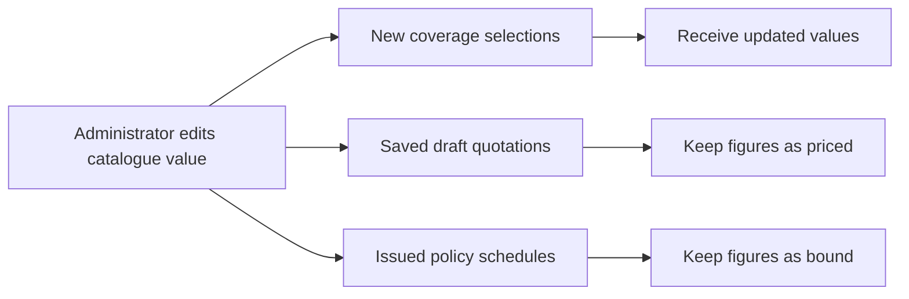

### Administrator Catalogue Control and Item Withdrawal

Coverage items are maintained by administrators together with their parent product, because together they define what the brokerage is authorized to offer.

THE system SHALL restrict creation, modification, and withdrawal of coverage items to administrators.
THE system SHALL give producers and CSRs read access to coverage items so they can build quotations and review schedules.
IF a non-administrator attempts to create, modify, or withdraw a coverage item, THEN THE system SHALL reject the request.
WHEN an administrator withdraws a coverage item from sale, THE system SHALL stop offering the item in new quotation building while leaving all existing references intact.
IF a coverage item has ever been selected on any quotation or policy schedule, THEN THE system SHALL disallow permanent deletion and permit withdrawal from sale only, protecting the records that depend on it.
WHEN a coverage item has never been referenced by any quotation or policy schedule, THE system SHALL allow an administrator to delete it outright.

## CommissionSchedule Rules

A commission schedule defines how a product pays the brokerage, holding a default agency rate expressed as a percentage and a default producer split percentage applied against the agency amount. Both figures live between zero and one hundred percent, and the producer split cannot imply paying out more than the agency earns. An optional tier table supports volume arrangements, letting larger premium bases earn richer rates according to thresholds the administrator sets. Schedules attach to products, so any quote line using that product inherits sensible commission estimates immediately. Estimates derived from a schedule remain adjustable on individual transactions where reality demands, but the schedule stays the starting truth. Amending a schedule applies forward only, leaving already-recorded commissions untouched. Administrators own schedule maintenance because compensation terms affect every producer's book simultaneously.

### Agency Rate Percentage Bounds

A commission schedule carries two governing figures: the default agency rate earned by the brokerage and the default producer split paid out of the agency amount.

- THE system SHALL require every commission schedule to specify a default agency rate expressed as a percentage before the schedule can attach to its product.
- WHEN a commission schedule is created or amended, THE system SHALL accept the agency rate only when it is greater than or equal to zero percent and less than or equal to one hundred percent.
- IF an agency rate falls outside these bounds or is omitted entirely, THEN the system SHALL reject the request and identify the agency rate as the invalid figure.
- THE system SHALL store both percentages exactly as configured by the administrator, without silently rounding or clamping them at the schedule level.

### Producer Split Against Agency Amount

The producer split never acts on raw premium. It always divides the agency amount the brokerage earns, keeping producer compensation subordinate to brokerage compensation by construction.

- THE system SHALL require every commission schedule to specify a default producer split expressed as a percentage.
- WHEN a commission schedule is created or amended, THE system SHALL accept the producer split only when it satisfies the same zero-to-one-hundred-percent bounds defined for the agency rate (defined in Agency Rate Percentage Bounds).
- THE system SHALL apply the producer split against the agency amount only, never directly against the premium basis.
- THE system SHALL ensure the resulting producer amount never exceeds the corresponding agency amount under any accepted combination of agency rate and producer split.
- IF a proposed configuration would allow a producer amount greater than its agency amount, THEN the system SHALL reject that configuration before it takes effect.

### Tier Table Volume Thresholds

WHERE a commission schedule includes an optional tier table, each tier expresses a volume arrangement: once the premium basis reaches the tier's threshold, that tier's richer rate replaces the default agency rate.

- WHERE a tier table is provided, THE system SHALL require every tier to specify both a premium-basis threshold and its own agency rate.
- THE system SHALL accept tier thresholds only when they are positive monetary amounts expressed in Canadian dollars.
- THE system SHALL validate each tier's agency rate against the percentage bounds that govern the default agency rate (defined in Agency Rate Percentage Bounds).
- IF two tiers share the same threshold, THEN the system SHALL reject the request as ambiguous.
- THE system SHALL require tier thresholds to be strictly increasing, so that larger premium bases map unambiguously to their intended tier.
- WHEN the premium basis reaches a tier's threshold, THE system SHALL use that tier's agency rate in place of the default agency rate.
- IF multiple tiers qualify for one premium basis, THEN the system SHALL apply the tier whose threshold is highest among those reached, so larger volumes earn the richest configured rate.
- IF a tier table is submitted empty, THEN the system SHALL treat the schedule as having no tiers and rely on the default agency rate alone.

### Product-Level Inheritance

A commission schedule attaches to exactly one product, so a product carries at most one active schedule at any time. Compensation terms therefore resolve automatically from the product whenever a transaction references it.

- THE system SHALL attach each commission schedule to exactly one product.
- IF an attempt is made to attach a second commission schedule to a product that already has one, THEN the system SHALL reject the attempt until the existing schedule is removed.
- WHEN a quote line is created for a product governed by a commission schedule, THE system SHALL seed that line's commission estimate from the schedule immediately, without requiring further action from the user.
- THE system SHALL NOT propagate a newly attached or amended schedule into estimates already recorded on existing transactions before the change existed.
- IF a transaction references a product that has no commission schedule, THEN the system SHALL leave the commission estimate unset until entered manually or until a schedule becomes available.

### Commission Estimate Derivation

Estimates follow one deterministic calculation path so every producer sees identical figures from identical inputs.

- THE system SHALL compute the agency amount as the premium basis multiplied by the applicable agency rate, where the applicable rate resolves through the tier selection rules (defined in Tier Table Volume Thresholds).
- THE system SHALL compute the producer amount as the agency amount multiplied by the schedule's producer split.
- THE system SHALL round both the agency amount and the producer amount to whole cents in Canadian dollars.
- THE system SHALL record the estimated agency amount and producer amount on the originating transaction at creation time, so later schedule changes cannot silently rewrite history.

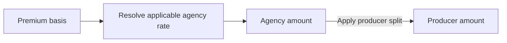

### Manual Adjustment Allowance

The schedule provides the starting truth, not the final word. Individual deals sometimes demand different figures, and the system accommodates that without disturbing the shared schedule.

- THE system SHALL allow authorized users to override the estimated agency amount or producer amount on an individual commission record without modifying the underlying commission schedule.
- THE system SHALL retain the schedule-derived figures alongside the adjusted values so the original estimate remains visible after an override.
- IF a manual override would make the producer amount exceed the agency amount on the same commission record, THEN the system SHALL reject the override.
- THE system SHALL confine each override's effect to that single commission record, leaving all sibling commissions derived from the same schedule untouched.
- IF an override is attempted on a commission already marked paid or clawback, THEN the system SHALL reject the override because those statuses are settled outcomes (defined in Commission Rules).

### Forward-Only Amendment

Amending a schedule shapes the future, never the past. Compensation already recorded represents agreements made under earlier terms.

- WHEN a commission schedule is amended, THE system SHALL apply the new percentages only to commission estimates generated after the amendment takes effect.
- THE system SHALL NOT recalculate, adjust, or delete any commission already recorded under previous schedule terms, regardless of the commission's current status (defined in Commission Rules).
- WHEN a schedule is created, amended, or removed, THE system SHALL record the change in the organization's append-only audit log together with the acting user and both the previous and new percentages.
- IF removal of a schedule is requested, THEN the system SHALL detach future seeding while leaving all previously recorded commissions intact.

### Administrator Compensation Control

Because one schedule change reshapes expected income across every producer working the product, control over compensation terms is deliberately concentrated.

- THE system SHALL permit only administrators to create, amend, or remove commission schedules.
- THE system SHALL allow producers and customer service representatives to view commission schedule terms attached to the products they work with, for reference purposes only.
- IF a user who is not an administrator attempts to create, amend, or remove a commission schedule, THEN the system SHALL reject the request.

## Quote Rules

A quote captures proposed coverage for one client and belongs to a producing agent responsible for the opportunity. The desired effective date is mandatory, and the quote's own expiry date must fall after that effective date so offers cannot lapse before they begin. All monetary figures — total premium, broker fee, tax amount, and grand total — read in Canadian dollars, and the grand total must equal premium plus broker fee plus taxes so arithmetic stays honest at every save. Totals roll up from the quote's lines, meaning editing a line refreshes the roll-up rather than allowing contradictory headline numbers. Comparative quoting deliberately carries several lines across carriers on one quote so clients weigh alternatives side by side. Manual premium override is always permitted even when a formula exists, reflecting real-world negotiation, and overridden figures stay visibly distinct from calculated ones. Advancing beyond draft demands at least one complete line, and binding the accepted choice into a policy happens in one indivisible step so half-created contracts never appear.

### Quote-to-Client Attachment and Producer Ownership

A quote captures proposed coverage for exactly one client and names the producer responsible for the opportunity.

- THE system SHALL associate every quote with exactly one client and one owning producer.
- IF a quote is created without a client reference or without an owning producer, THEN THE system SHALL reject the request.
- IF the referenced client does not exist within the brokerage, THEN THE system SHALL reject the request.
- THE system SHALL keep the quote attributed to that single client throughout its life, so comparison history remains tied to one client relationship.
- THE system SHALL accept an optional note field on every quote for context such as negotiation remarks.

### Desired Effective Date Mandatory and Expiry Ordering

The desired effective date anchors every quote offer, and the quote's own expiry date governs how long the offer stands. Offers can never lapse before they begin.

- THE system SHALL require a desired effective date on every quote; IF it is absent, THEN THE system SHALL reject the save.
- THE system SHALL accept an optional quote expiry date while the quote sits in draft.
- IF a quote expiry date is provided, THEN THE system SHALL require it to fall on a later calendar day than the desired effective date; IF it falls on or before that date, THEN THE system SHALL reject the save.
- WHEN the desired effective date is changed to a value on or after an existing quote expiry date, THEN THE system SHALL reject the change until the expiry date is moved as well.
- THE system SHALL evaluate these date rules on every create and update of a quote so the ordering constraint always holds.

### Canadian Dollar Amounts and Grand Total Arithmetic Consistency

Every monetary figure on a quote reads in Canadian dollars, carried to two-decimal amounts, and the headline arithmetic must stay honest at every save.

- THE system SHALL express total premium, total broker fee, tax amount, and grand total in Canadian dollars as two-decimal amounts.
- THE system SHALL compute the grand total as total premium plus total broker fee plus tax amount.
- THE system SHALL keep broker fee and taxes as distinct figures that are never folded into the premium.
- IF a save would carry a grand total that disagrees with that sum, THEN THE system SHALL reject the save rather than persist contradictory figures.
- THE system SHALL derive the grand total itself on every save so the headline figure can never drift from its components.

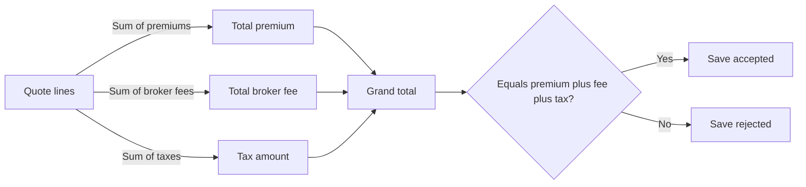

### Line Roll-Up of Quote Totals

Headline figures on a quote are never typed independently; they are always the sum of the quote's lines.

- THE system SHALL derive total premium, total broker fee, and tax amount exclusively by rolling up the corresponding figures of the quote's lines, using the sum identities defined in Canadian Dollar Amounts and Grand Total Arithmetic Consistency.
- WHEN a line is added, edited, or removed, THEN THE system SHALL refresh the rolled-up totals within the same save.
- IF a save would leave headline figures disagreeing with the current lines, THEN THE system SHALL reject the save instead of storing contradictory numbers.
- THE system SHALL NOT provide a way to type headline totals directly; they change only through their lines.
- WHEN all lines are removed from a quote, THEN THE system SHALL reset the rolled-up totals to zero amounts consistent with the empty roll-up.

The individual premium, broker fee, and tax figures carried by each line are governed by QuoteLine Rules.

### Multi-Carrier Comparison on a Single Quote

One quote deliberately carries several lines so a client can weigh alternatives across carriers against each other.

- THE system SHALL allow multiple lines on a single quote, including lines from different carriers at the same time.
- THE system SHALL capture each line's carrier identity at the time the line is written and preserve it as recorded, so later catalogue changes do not rewrite past comparisons (carrier snapshot defined in QuoteLine Rules).
- THE system SHALL keep all lines of a quote pointing at the same client and subject to the same date rules defined for the quote.
- THE system SHALL retain every carrier alternative within the single quote record so the options remain comparable against each other.
- A quote holding a single line remains valid; comparison simply presents fewer alternatives.

### Manual Premium Override and Override Visibility

Formula-driven pricing assists the producer, but negotiation wins: a manual override is always available regardless of whether a product supplies a formula configuration.

- WHERE a product supplies formula configuration, THE system SHALL compute suggested figures from that configuration when the line is priced.
- WHERE no formula configuration exists, THE system SHALL still accept figures entered directly.
- THE system SHALL always permit a manual override of any computed figure, whatever the formula produced.
- THE system SHALL mark every overridden figure as manually set so it stays visibly distinct from calculated figures.
- IF an override is applied, THEN THE system SHALL preserve its manually-set marking on later saves as long as the figure itself is unchanged.
- THE system SHALL feed overridden figures into the roll-up exactly like calculated ones, as described in Line Roll-Up of Quote Totals.

Numeric constraints on the figures entered for a line are governed by QuoteLine Rules.

### Complete Line Required Before Advancement

A quote cannot advance out of draft on promises alone; at least one fully usable line must stand behind it.

- THE system SHALL consider a line complete when it references an active product, carries that product's carrier identity as recorded, includes the input values the product's rating schema requires, and states its premium figures.
- IF the product's eligibility rules disqualify the client, THEN THE system SHALL refuse to treat the line as complete, applying the eligibility checks defined in Product Rules.
- THE system SHALL refuse to advance a quote beyond draft unless at least one complete line exists.
- IF advancement is attempted with no complete line, THEN THE system SHALL reject the request and identify that no complete line supports it.
- THE system SHALL keep incomplete lines visible on the draft quote so work in progress is not lost, while counting none of them toward the advancement gate.

### Indivisible Bind Step

Turning the accepted choice into a policy happens in one indivisible step: either the whole handoff succeeds or nothing changes at all.

- THE system SHALL perform binding as a single indivisible action that creates the policy from the accepted quote line together with everything that depends on it, or leaves the quote untouched.
- IF any part of the bind fails, THEN THE system SHALL undo every partial effect so half-created contracts never appear.
- THE system SHALL NOT settle a bind through partial saves that could leave a policy standing without its accepted quote resolved, or the reverse.
- WHEN the bind completes, THEN THE system SHALL record the outcome on the quote within the same indivisible step so the quote and the new policy agree.
- THE system SHALL treat repeated bind attempts on an already-bound quote as harmless repeats that produce no second policy.

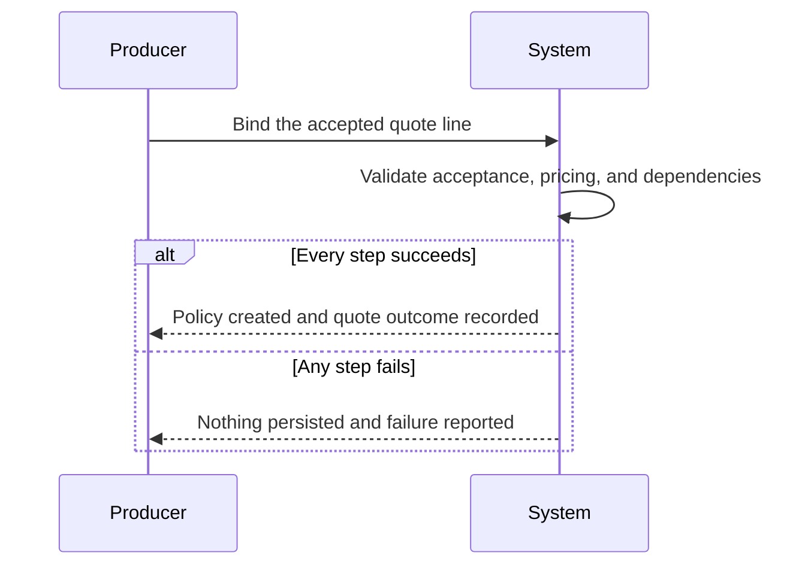

## QuoteLine Rules

A quote line prices one carrier-product combination inside a larger quote, snapshotting the carrier and product identities at pricing time so later renames never distort the offer. Rating answers supplied on the line must satisfy the product's declared rating definition, and missing answers stop the line from counting as priced. Eligibility is checked at attachment against the client's province, the client type, and any minimum or maximum value thresholds the product publishes, so ineligible combinations are refused with clear reasons. Monetary amounts on the line — premium, broker fee, taxes — are non-negative Canadian dollar figures. The commission estimate derives from the product's commission schedule and adjusts when the schedule changes before the quote finalizes. Coverage selections reference the product's catalogue items, keeping chosen protections traceable to what the carrier truly offers. Lines stand alone inside comparative quotes, so declining one carrier never disturbs another.

### Rule Scope and Check Timing

The rules in this unit are line-level business rules: they govern each quote line independently of the other lines sharing the same comparative quote. Three checkpoints apply:

- **Attachment-time validation** — eligibility is confirmed before a line may join a quote.
- **Pricing-time validation** — rating answer completeness and monetary constraints must hold before a line counts as priced.
- **Finalization-time domain logic** — commission estimates follow the product's commission schedule until the quote finalizes, after which they freeze; carrier and product snapshots become immutable.

THE system SHALL apply these checkpoints to every line regardless of how many carriers are compared on the same quote.
WHEN any checkpoint fails, THE system SHALL refuse only the offending line and leave sibling lines untouched.
BEFORE a line is included in a carrier submission or a bind action, THE system SHALL re-confirm that the line still passes attachment-time and pricing-time checks.

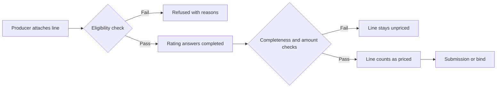

### Carrier and Product Snapshot Integrity

WHEN a line records a carrier-product combination, THE system SHALL capture the carrier and product identities exactly as they read at that moment, forming the line's pricing snapshot.
WHILE a line exists, THE system SHALL treat its snapshot as immutable: later renames, description edits, or deactivation affecting the referenced carrier or product SHALL NOT alter what the line already shows.
IF a carrier or product named on an existing line is renamed afterward, THEN THE system SHALL keep displaying the originally captured names on that line.
WHEN a referenced product is deactivated, THE system SHALL bar new lines from attaching to it while leaving existing lines readable and their pricing meaningful.
WHEN a submission or a bound policy originates from a line, THE system SHALL carry the snapshot identity forward rather than re-resolving it from the live catalog.
IF a producer changes the selected carrier or product on a line, THEN THE system SHALL replace the snapshot wholesale and re-run attachment-time eligibility before saving.

### Rating Answer Completeness and Validity

THE system SHALL require an answer for every input declared by the attached product's rating definition before the line counts as priced.
IF one or more required rating answers are missing, THEN THE system SHALL hold the line out of priced status and report precisely which inputs remain unanswered.
WHEN an answer contradicts the form declared for that input — a number outside the permitted range, or a choice outside the listed options — THEN THE system SHALL reject the answer and request a corrected value.
WHEN the product's rating definition gains new required inputs after a line was priced, THEN THE system SHALL require the line to supply answers for them before it regains priced standing.
IF a rating input is supplied that the product's rating definition does not declare, THEN THE system SHALL refuse it so unvetted data cannot influence the price or the comparison.
WHERE a producer overrides the premium manually, THE system SHALL still enforce rating answer completeness, preserving eligibility evidence and cross-carrier comparability.

### Eligibility Checked at Attachment and Ineligible Refusal

WHEN a line is attached to a quote, THE system SHALL test the product's published eligibility rules against the client's primary province, the client type (individual or business), and any minimum or maximum value thresholds the product declares.
IF any eligibility rule fails, THEN THE system SHALL refuse the attachment and return each failing rule as a distinct, human-readable reason.
THE system SHALL NOT persist a line whose attachment was refused; ineligible combinations never linger half-attached to a quote.
WHEN the client's primary province or client type changes after lines are attached, THEN THE system SHALL re-run eligibility and flag any line that no longer qualifies instead of silently retaining it.
WHERE a product publishes no eligibility restrictions, THE system SHALL attach the line without threshold checks beyond the product being active.
IF a previously refused combination is attempted again with no change to the client's attributes or the product's rules, THEN THE system SHALL refuse it again citing the same reasons.

### Non-Negative Monetary Amounts on Lines

THE system SHALL record a line's premium, broker fee, and taxes as Canadian dollar amounts that are zero or positive, kept to two decimal places.
IF a negative value is supplied for premium, broker fee, or taxes, THEN THE system SHALL reject the change and name the offending figure.
WHEN a premium is computed from the product's formula configuration, THE system SHALL round the result to two decimal places before storing it on the line.
WHERE a producer overrides a computed premium, THE system SHALL accept the manual figure provided it respects the same non-negative constraint.
WHEN broker fee or taxes are left unset, THE system SHALL treat them as zero rather than rejecting the line.
THE system SHALL ensure every line contributes zero or a positive amount toward the quote totals, never a negative contribution.

### Schedule-Derived Commission Estimates

WHEN a line becomes priced, THE system SHALL compute its commission estimate from the commission schedule configured on the attached product, applying the agency rate and producer split described under CommissionSchedule Rules.
WHERE the schedule carries a tier table, THE system SHALL select the tier matching the line's premium basis using the tier-selection behaviour defined for commission schedules.
WHILE the owning quote has not yet finalized, WHEN the product's commission schedule changes, THEN THE system SHALL refresh the line's commission estimate accordingly.
ONCE the quote has finalized, THE system SHALL freeze each line's commission estimate so later schedule edits cannot rewrite historical offers.
THE system SHALL treat the line estimate as provisional only; authoritative commission records arise under the Commission Rules when policies and endorsements are issued.

### Catalogue-Traceable Coverage Selections

THE system SHALL confine a line's coverage selections to items listed in the attached product's coverage catalogue.
IF a selection names an item outside the catalogue, THEN THE system SHALL reject the selection and identify the unrecognized item.
WHEN a chosen catalogue item defines a default limit and the producer supplies no explicit limit, THEN THE system SHALL adopt the default limit for the line.
WHERE the catalogue marks an item optional, THE system SHALL allow the producer to omit it; items not marked optional SHALL be included before the line counts as priced.
WHEN a selection is accepted, THE system SHALL retain the catalogue item's code together with the chosen limit and deductible so the offered protection remains traceable to what the carrier actually sells.

### Standalone Comparison Lines

THE system SHALL evaluate, validate, and track each line on a comparative quote independently of every other line.
WHEN one line is removed, declined through its submission, or fails any rule, THEN THE system SHALL leave all remaining lines untouched — their premiums, broker fees, taxes, commission estimates, and coverage selections unchanged.
THE system SHALL allow several lines from different carriers to coexist on one quote throughout drafting, pricing, and submission.
IF editing one line's rating answers or coverage selections produces an error, THEN THE system SHALL scope the error to that line alone.
WHEN a line advances toward a submission or a bind action, THE system SHALL carry only that line's own data forward, never borrowing figures from sibling lines.

## Submission Rules

A submission records one carrier's handling of a quote, and each carrier on a quote holds a single submission rather than scattered threads. Permitted standing runs from pending through sent, acknowledged, and quoted, ending in declined when the carrier passes. The carrier's reference number is captured once known so staff can cite it in calls and emails without digging through inboxes. Notes and messages accumulate with timestamps, forming a conversation log that survives staff turnover. Because v1 has no live carrier connections, status changes and reference numbers arrive manually, and every change records who made it and when. A declined submission closes that carrier's branch of the comparison while sibling carriers continue untouched. Binding the eventual policy relies on the chosen line reaching a quotable outcome, tying submissions to the credibility of the numbers behind the contract.

### One Submission Per Carrier Per Quote

THE system SHALL maintain a single submission per carrier on each quote, so every exchange with that carrier about the quote gathers in one record rather than scattered threads.

- WHEN a submission is created on a quote, THE system SHALL set its status to "pending".
- IF the named carrier already holds a submission on that quote, THEN THE system SHALL reject the creation and point the user to the existing submission.
- IF the named carrier is not represented anywhere on the quote by at least one comparative line, THEN THE system SHALL reject the creation, because a submission without a corresponding offer branch has nothing to compare.
- THE system SHALL permanently attach each submission to its one parent quote; submissions shall never move between quotes.
- THE system SHALL fix the carrier named on the submission at creation; that association shall not change afterwards.

### Status Progression From Pending Through Quoted or Declined

The business meaning of each status is defined in the Domain Model; this section governs only which movements between statuses the system accepts.

| Current status | Permitted next statuses |
| --- | --- |
| pending | sent, acknowledged, quoted, declined |
| sent | acknowledged, quoted, declined |
| acknowledged | quoted, declined |
| quoted | none — final successful status |
| declined | none — final unsuccessful status |

- THE system SHALL restrict every submission to the statuses "pending", "sent", "acknowledged", "quoted", and "declined"; any other value shall be rejected.
- WHEN a requested status change matches a permitted move in the table above, THE system SHALL apply it, including forward skips such as a carrier replying straight from "pending" to "quoted".
- IF a requested status change moves backwards along the table, THEN THE system SHALL reject the change and leave the current status untouched.
- IF the submission already stands at "quoted" or "declined", THEN THE system SHALL accept no further status changes; only additional conversation-log entries remain possible.
- WHEN a submission reaches "quoted", THE system SHALL treat it as the successful outcome that makes that carrier's branch eligible for binding (see Quoted Status Required Before Binding).
- WHEN a submission reaches "declined", THE system SHALL treat that carrier's branch as closed (see Decline Isolation Within a Comparison).

### Carrier Reference Number Capture

THE system SHALL allow the carrier reference number to be absent when a submission is created, since carriers issue their references only after they engage with the risk.

- WHEN a reference number becomes known, THE system SHALL record it on the submission so staff can cite it in calls and correspondence without digging through inboxes.
- THE system SHALL accept the reference number as free-form text in whatever form the issuing carrier uses, imposing no fixed pattern.
- IF a reference number is supplied but left blank, THEN THE system SHALL reject the entry.
- WHERE a captured reference number proves wrong, THE system SHALL allow replacement with a corrected value but shall not permit it to be emptied afterwards.

### Timestamped Conversation Log

THE system SHALL collect every note and message exchanged with the carrier on the submission into a chronological conversation log.

- WHEN an entry is added, THE system SHALL stamp it automatically with the entry time and the name of the signed-in author; neither value may be typed or altered by hand.
- THE system SHALL order log entries strictly by their entry times.
- THE system SHALL keep the log append-only: existing entries shall never be edited or deleted.
- IF an entry carries no body text, THEN THE system SHALL reject it; a short heading remains optional.
- THE system SHALL continue to show each entry's original author name even after that user has been deactivated, preserving institutional memory across staff turnover.
- THE system SHALL present the whole log on the submission so any successor staff member reads the entire carrier conversation in one place.

### Manual Updates With Automatic Attribution

THE system SHALL rely solely on manual entry for submission status changes and reference-number capture in this version, because no live carrier connections exist.

- WHEN a status change or reference correction is submitted, THE system SHALL take the acting user and the time of the change from the signed-in session; users shall not be able to credit a change to someone else.
- THE system SHALL preserve those attribution records unchanged for the life of the submission, so the history shows who moved each status and when.
- WHEN a submission's status changes, THE system SHALL raise the submission-status notification behaviour described in Notification Rules.
- IF a status change arrives without an accompanying explanation, THEN THE system SHALL still accept it; capturing the reason in the conversation log is encouraged practice rather than a precondition.

### Decline Isolation Within a Comparison

THE system SHALL confine the effect of a declined submission to the declined carrier's own branch of the comparison.

- WHEN a submission is marked "declined", THE system SHALL exclude only that carrier's lines from further comparison and from binding consideration.
- THE system SHALL leave sibling carriers' submissions, statuses, and figures completely unaffected by another carrier's decline.
- THE system SHALL leave the parent quote's own status untouched by a single-carrier decline whenever another live branch remains; outcomes at quote level follow the Quote Rules.
- IF every carrier branch on the quote ends up declined, THEN the quote holds no quotable outcome and follows the quote-level decline path defined in the Quote Rules.
- WHERE the carrier gives a reason for declining, THE system SHALL expect staff to record it as a conversation-log entry on the declined submission rather than as a separate field.

### Quoted Status Required Before Binding

THE system SHALL require the chosen carrier's submission to stand at "quoted" before the quote can be bound into a policy, anchoring the eventual contract to figures a carrier actually returned.

- WHEN a bind is attempted, THE system SHALL verify that the submission of the carrier behind the chosen comparative line exists and stands at "quoted".
- IF that carrier holds no submission yet, THEN THE system SHALL reject the bind and identify the missing submission.
- IF that carrier's submission exists but has not reached "quoted", THEN THE system SHALL reject the bind and report its current status.
- WHERE several carriers have reached "quoted", THE system SHALL allow binding against whichever quoted branch the producer selects.
- WHEN the quote is bound, THE system SHALL freeze all submissions on that quote as read-only history: further status changes and reference corrections shall be rejected, since the comparison has concluded.
- THE system SHALL keep frozen submissions and their conversation logs viewable alongside the resulting policy for provenance.

## Policy Rules

A policy is the written contract, born either from a bound quote or entered manually when a brokerage rolls an existing book onto the platform. Every policy carries a policy number sourced from the brokerage's own numbering or the carrier-issued number, and numbers stay unique within the brokerage so statements and certificates reference exactly one contract. Term start must precede term end, defining the coverage window unambiguously. Financial figures — billed premium, broker fee, taxes — are Canadian dollar amounts consistent with the originating quote where one exists. A payment plan is selected from annual, semi-annual, quarterly, or monthly, shaping how invoicing spreads the term cost. The province of risk must be a recognized Canadian province and feeds both tax treatment and eligibility checks. Policies leave the system only softly, so endorsements, claims-free histories, and commission records survive any cleanup.

### Policy Number Uniqueness and Sourcing

Every policy carries exactly one policy number. That number comes from one of two sources: the brokerage's own numbering scheme, or the number issued by the carrier when it accepts the risk. Both sources feed a single shared space of numbers inside the brokerage, so a number quoted on a statement or certificate always points to exactly one contract.

- THE system SHALL give every stored policy exactly one policy number, sourced either from the brokerage's own numbering or from the carrier-issued number.
- THE system SHALL enforce that each policy number is unique within the brokerage, so that statements, certificates, and commission records reference exactly one contract.
- WHEN a policy is created from a bound quote and the carrier has not yet issued its own number, THE system SHALL allow the brokerage-generated number to stand alone and permit recording the carrier-issued number against the same policy once received.
- THE system SHALL treat brokerage-generated numbers and carrier-issued numbers as occupying the same uniqueness space, so no two policies share a number regardless of source.
- IF a requested policy number already exists anywhere in the brokerage — including on a soft-removed policy — THEN THE system SHALL reject the request.

### Term Start Must Precede Term End

The coverage window of a policy runs from its term start date to its term end date. The window is only meaningful when the start precedes the end, so both dates must be present and correctly ordered on every policy, whatever its origin.

- THE system SHALL require both a term start date and a term end date on every policy; a policy with an undefined or open-ended term is rejected.
- THE system SHALL require the term start date to precede the term end date whenever a policy is created or amended.
- IF the term end date equals or falls before the term start date, THEN THE system SHALL reject the request.
- WHEN a next-term policy is produced following a renewal acceptance, THE system SHALL validate that policy's term dates against this same ordering rule.

### Quote-Consistent Financial Figures

Billed premium, broker fee, and taxes are Canadian dollar amounts. When a policy is born from a bound quote, the money written on the contract must mirror what was quoted; when there is no originating quote, the entering user supplies the figures directly.

- THE system SHALL express billed premium, broker fee, and taxes on every policy in Canadian dollars.
- WHEN a policy is created from a bound quote, THE system SHALL carry the accepted quote's premium, broker fee, and taxes onto the policy so the two records agree.
- WHEN a policy is entered manually because no originating quote exists, THE system SHALL accept the figures supplied at entry, subject to the remaining financial validations.
- IF any billed amount on a policy is negative, THEN THE system SHALL reject the request.
- WHEN a cancellation returns premium or an endorsement adjusts premium, THE system SHALL record those effects through their own records rather than rewriting the policy's original billed figures.

### Payment Plan Choices

A policy declares how its cost is spread across the term through a payment plan. The plan is a constrained choice, not free text, and it shapes how invoicing presents the term cost without changing the policy's total figures.

- THE system SHALL restrict payment plan selection to one of: annual, semi-annual, quarterly, or monthly.
- IF a payment plan outside these four choices is supplied, THEN THE system SHALL reject the request.
- WHERE no payment plan is specified at policy creation, THE system SHALL apply the annual plan as the default.
- THE system SHALL treat the payment plan as fixed input to billing presentation; how instalments appear on invoices is governed by Invoice Rules, not by the policy itself.

### Province of Risk Validation

Every policy names the province where the insured risk sits. This single value feeds two downstream behaviours: determining applicable tax treatment, including broker fee taxability, and evaluating product eligibility rules that restrict where a product may be placed.

- THE system SHALL require a province of risk on every policy.
- IF the province of risk is absent or is not a recognized Canadian province, THEN THE system SHALL reject the request.
- WHEN product eligibility is evaluated for a policy's coverage, THE system SHALL evaluate the product's eligibility rules against the policy's province of risk.
- WHEN broker fee taxability is determined, THE system SHALL consult the policy's province of risk together with the organization's configured provincial rate table (defined in Organization Rules).

### Manual Entry for Book-Roll

When a brokerage rolls an existing book onto the platform, its in-force contracts are written directly as policies rather than re-quoted and bound. These manually entered policies stand entirely on their own inputs.

- THE system SHALL permit creating a policy directly without a bound quote for book-roll purposes.
- WHEN a policy is entered manually, THE system SHALL require an identified client, carrier, product, assigned producer, term dates, and the financial figures for the term.
- THE system SHALL NOT require any quote or submission linkage for manually entered policies.
- WHEN a manually entered policy is saved, THE system SHALL subject it to the same numbering, term-date, financial, and province-of-risk validations as a policy born from a quote.
- WHEN coverage schedule lines are captured on a manually entered policy, THE system SHALL apply the same mirroring expectations defined in PolicyCoverage Rules.

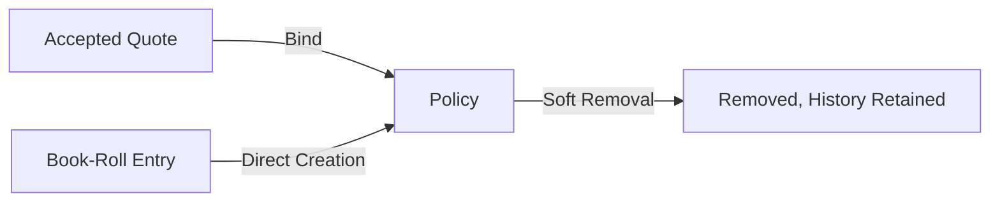

### Soft Removal with Retained History

Policies leave ordinary view through soft removal, never through destruction, so the commercial history built around a contract survives any cleanup.

- THE system SHALL remove a policy only by marking it removed while retaining the full record.
- WHEN a policy is soft-removed, THE system SHALL preserve its endorsements, cancellations, renewals, coverage schedule lines, commissions, invoices, and documents untouched.
- THE system SHALL exclude soft-removed policies from ordinary browsing and selection lists while keeping them reachable through the records that reference them.
- IF a soft-removed policy holds commission records in any status, THEN THE system SHALL leave those records intact so statement reporting remains complete.
- THE system SHALL NOT release the policy number of a soft-removed policy for reuse by another policy, consistent with Policy Number Uniqueness and Sourcing.

## PolicyCoverage Rules

Policy coverage lines enumerate what a bound policy actually protects, each carrying a coverage name, a reference code, a limit, and a deductible. Limits and deductibles must be non-negative amounts, and a deductible exceeding its own limit is nonsensical and refused. The schedule at binding mirrors the accepted quote selections so the contract matches what the client agreed to purchase, line for line. Direct edits to a bound schedule are off limits; adjustments flow through endorsements so every mid-term change leaves a paper trail. Coverage lines inherit identity from the product catalogue, keeping naming consistent across proposals, schedules, and certificates. The completed schedule is exactly what rendered policy schedules and proof-of-insurance documents print, making its accuracy contractual rather than cosmetic.

### Non-Negative Amounts on Coverage Lines

THE system SHALL require every coverage schedule line to carry a coverage name, a reference code, a coverage limit, a deductible amount, and a premium amount.

WHEN a coverage line is created or changed, THE system SHALL express all monetary amounts in Canadian dollars.

THE system SHALL reject any coverage line whose limit is negative.

THE system SHALL reject any coverage line whose deductible is negative.

THE system SHALL reject any coverage line whose premium is negative.

THE system SHALL accept a zero deductible as the representation of no deductible and a zero premium as the representation of a no-cost coverage.

IF a requested coverage line contains a negative limit, deductible, or premium, THEN THE system SHALL refuse the request and identify which amount was invalid.

### Deductible Within Its Own Limit

THE system SHALL refuse any coverage line whose deductible exceeds that same line's coverage limit.

THE system SHALL evaluate the deductible-versus-limit comparison independently for each coverage line, never comparing a deductible on one coverage against the limit of another.

WHEN an endorsement proposes new limit or deductible values for an existing coverage, THE system SHALL re-validate that the resulting deductible does not exceed the resulting limit before the change takes effect.

IF an endorsement would leave a deductible greater than its own coverage limit, THEN THE system SHALL reject the endorsement request and identify the offending coverage by name.

A deductible equal to the coverage limit is accepted, representing a scenario where any loss consumes the full limit.

### Binding Mirrors the Accepted Quote Selections

WHEN a quote is bound into a policy, THE system SHALL create the initial coverage schedule as an exact line-for-line mirror of the coverage selections recorded on the accepted quote lines.

THE system SHALL copy each selected coverage's name, code, limit, deductible, and premium from the quote selection onto the corresponding schedule line without alteration.

THE system SHALL create the schedule within the same bind operation as the policy itself, so that a failed bind leaves neither a policy nor a partial schedule behind.

WHEN a policy is entered manually for book-roll purposes instead of being created from a bound quote, THE system SHALL require its coverage schedule to be supplied at creation and subject each line to the same amount validations defined above.

IF a binding attempt would produce a schedule that diverges from the accepted quote selections, THEN THE system SHALL refuse the bind rather than silently reconciling the difference.

### No Direct Schedule Edits After Binding

THE system SHALL prohibit direct modification, addition, or removal of coverage lines on a policy after the policy exists.

WHEN a request arrives to alter a bound schedule outside of an endorsement, THE system SHALL reject it and indicate that changes must be submitted as an endorsement.

THE system SHALL allow schedule lines to be established only during policy creation, either through the binding of an accepted quote or through manual book-roll entry.

THE system SHALL preserve the original bound schedule values as issued, so that the history of what was originally purchased remains distinguishable from later endorsement-driven changes.

```mermaid
flowchart LR
    A["Bound coverage schedule"] -->|"Direct edit request"| B["Refused"]
    A -->|"Endorsement submitted"| C["Draft endorsement"]
    C -->|"Issued"| D["Validated and applied"]
    D --> A
```

### Endorsement-Driven Adjustments

THE system SHALL route every mid-term change to a policy's coverage schedule through an endorsement, leaving a paper trail of who made the change, when it takes effect, and why.

WHILE an endorsement remains in draft status, THE system SHALL NOT alter the underlying coverage schedule; changes apply only when the endorsement is issued.

WHEN an endorsement is issued, THE system SHALL update the affected coverage lines' limits, deductibles, and premiums so the schedule always reflects the current contract terms.

THE system SHALL record the premium change and fee change introduced by each issued endorsement alongside a description of the affected coverages.

IF an endorsement fails validation, THEN THE system SHALL leave the existing schedule untouched.

The authoritative lifecycle of endorsements themselves (draft to issued) is governed by the Endorsement rules; this section governs only their effect on the schedule.

### Catalogue-Inherited Identity

THE system SHALL populate each schedule line's coverage name and code from the corresponding coverage item in the originating product's catalogue rather than accepting arbitrary free text.

THE system SHALL validate at policy creation that every scheduled coverage corresponds to a coverage item offered by the policy's product.

THE system SHALL retain the catalogue-derived name and code already recorded on existing schedule lines even if the catalogue item is renamed afterwards, so historical documents remain accurate.

THE system SHALL use these same catalogue-inherited names and codes consistently across proposals, policy schedules, and proof-of-insurance documents, so every artifact refers to a coverage in identical terms.

The catalogue itself (names, codes, default limits, optional flags) is governed by the Product and CoverageItem rules.

### Authoritative Source for Printed Contract Documents

THE system SHALL render policy schedule documents and proof-of-insurance certificates exclusively from the policy's current coverage schedule lines.

THE system SHALL include each coverage's catalogue name, code, limit, and deductible on rendered documents exactly as stored on the schedule.

THE system SHALL ensure any document generated after an endorsement is issued shows the post-endorsement schedule values.

Because rendered documents constitute the client-facing statement of coverage, THE system SHALL treat schedule accuracy as contractual: any defect in the schedule flows directly into the printed contract documents.

Document generation mechanics (templates, rendering, storage) are governed by the DocumentTemplate and Document rules; this section establishes only the schedule as their authoritative input.

## Endorsement Rules

An endorsement amends a live policy mid-term, requiring a type, a description of the change, and an effective date falling inside the current policy term. Premium and fee deltas accompany the amendment and may run positive or negative, since removing coverage returns money while adding coverage charges it. Endorsements start as drafts that staff refine freely, and issuance locks the figures so the amendment becomes part of the permanent contract record. Issuing adjusts the policy's running totals and gives rise to corresponding commission entries based on the changed premium basis. The effective date may never precede the policy's term start, blocking retroactive amendments outside the agreement window. Rendered confirmation documents record what changed and when, supporting both client communication and regulatory questions.

### Endorsement Eligibility and Effective Date Validation

An endorsement may only amend a live, active policy, and its effective date is strictly bounded by the policy's existing term.

- THE system SHALL require every endorsement to carry three mandatory inputs before it can be saved: an amendment type identifying the nature of the change, a written description of what is being amended, and an effective date.
- THE system SHALL reject creation of any endorsement whose effective date falls outside the current policy term.
- THE system SHALL reject any endorsement whose effective date precedes the policy's term start date, blocking retroactive amendments outside the agreed window of coverage.
- THE system SHALL reject any endorsement whose effective date falls after the policy's term end date.
- THE system SHALL treat the term start and term end dates themselves as valid effective dates (inclusive boundaries).
- THE system SHALL accept a future-dated effective date provided it remains within the current term.
- THE system SHALL reject attaching an endorsement to a policy that is not in active status.
- THE system SHALL permit multiple endorsements against the same policy, each tracked and issued independently.

Validation decision flow:

```mermaid
flowchart LR
    A["Endorsement submitted"] --> B{"Effective date on or after term start?"}
    B -->|"No"| R1["Reject: retroactive"]
    B -->|"Yes"| C{"Effective date on or before term end?"}
    C -->|"No"| R2["Reject: outside term"]
    C -->|"Yes"| D{"Policy active?"}
    D -->|"No"| R3["Reject: ineligible policy"]
    D -->|"Yes"| V["Accepted"]
```

### Premium and Fee Change Sign Rules

Every endorsement carries two signed money movements — a premium change and a broker fee change — and either direction is legitimate.

- THE system SHALL record an explicit premium change and an explicit broker fee change on every endorsement, both denominated in Canadian dollars.
- THE system SHALL accept a positive premium change when the amendment adds coverage or raises limits, charging the client additional premium.
- THE system SHALL accept a negative premium change when the amendment removes or reduces coverage, returning premium to the client.
- THE system SHALL apply the same sign convention to the broker fee change: positive values charge additional fee and negative values refund fee.
- THE system SHALL accept zero on either change for purely administrative amendments that move no money.
- IF either change amount has not been set, THEN THE system SHALL refuse to issue the endorsement; both values must be explicit even when zero.

### Draft Stage Editability Rules

An endorsement begins life as a draft so staff can prepare and refine the amendment before it becomes contractual.

- THE system SHALL create every newly recorded endorsement in draft form.
- WHILE an endorsement remains in draft, THE system SHALL allow authorized staff to freely revise its type, description, effective date, premium change, and fee change without restriction.
- WHILE an endorsement remains in draft, THE system SHALL exclude its amounts from the policy's running totals, commission generation, and confirmation documentation.
- THE system SHALL NOT surface draft endorsements as part of the client-facing contract record.
- THE system SHALL restrict who may issue a draft endorsement according to the permission matrix (see 01-actors-and-auth.md).

### Issuance Locking and Immutability

Issuance converts a prepared draft into permanent contract history; from that moment the figures are frozen.

- THE system SHALL lock every value on an endorsement at the moment it is issued.
- THE system SHALL reject any attempt to modify an issued endorsement's type, description, effective date, premium change, or fee change.
- THE system SHALL treat an issued endorsement as part of the permanent contract record that supports regulatory questions and client disputes.
- WHEN a correction is needed after issuance, THEN THE system SHALL require staff to record a further endorsing amendment rather than alter the issued record.
- THE system SHALL capture who issued the endorsement and when issuance occurred, feeding the append-only audit trail (see AuditLog Rules).

```mermaid
flowchart LR
    A["draft"] -->|"Issue"| B["issued"]
    B -->|"No further edits"| B
```

### Policy Running Total Adjustments

Issuing an endorsement immediately and atomically rolls its signed amounts into the policy's financial picture.

- THE system SHALL add the endorsement's premium change to the policy's billed premium at the moment of issuance.
- THE system SHALL add the endorsement's fee change to the policy's broker fee at the moment of issuance.
- THE system SHALL reduce the corresponding policy total when the applied change is negative, reflecting premium or fee returned to the client.
- THE system SHALL guarantee that a policy's running totals always equal its originally written amounts plus the sum of all issued endorsement changes, with no drift.
- THE system SHALL apply the totals update and the issuance action as one indivisible step, so the policy's figures can never disagree with its issued endorsements.
- THE system SHALL leave the policy's term start and term end dates unchanged when applying endorsement adjustments; because every endorsement's effective date must fall within the existing term, an endorsement amends the contract within its term rather than extending it.

### Adjustment Commission Generation

Because an endorsement moves premium, issuance also moves producer compensation.

- THE system SHALL generate an adjustment commission entry whenever an endorsement with a non-zero premium change is issued.
- THE system SHALL use the endorsement's premium change as the premium basis for the generated commission.
- THE system SHALL compute the agency amount and producer amount from the agency rate and producer split rate configured on the product's commission schedule (defined in CommissionSchedule Rules).
- THE system SHALL produce negative commission amounts when the endorsement's premium change is negative, mirroring premium returned to the client.
- THE system SHALL generate no commission entry for an endorsement issued with a zero premium change.
- THE system SHALL attribute the generated commission to the same carrier and producer as the underlying policy.
- THE system SHALL place the adjustment commission in the statement period containing the endorsement's effective date.

### Confirmation Documentation on Issuance

Each issuance leaves behind documentary evidence of exactly what changed and when.

- THE system SHALL produce a rendered confirmation document whenever an endorsement is issued, recording the amended items, the effective date, the premium and fee changes applied, and the resulting adjusted totals.
- THE system SHALL render the confirmation through the organization's template mechanism (see DocumentTemplate Rules), using the custom template kind where no dedicated kind exists.
- THE system SHALL store the confirmation document against the endorsing policy following the polymorphic ownership rules for documents (see Document Rules).
- THE system SHALL complete the confirmation rendering as part of the same issuance step, keeping the contract record and its documentary evidence consistent.
- WHERE full PDF generation is unavailable, THE system SHALL at minimum persist the rendered text content of the confirmation so the evidence of change is retained.

## Cancellation Rules

A cancellation ends a policy before its natural expiry and demands an effective date plus a reason, because regulators and carriers expect documented justification. The effective date must sit inside the policy's coverage window, neither before the term begins nor after it ends. A return premium covers the unused portion of the term and may legitimately be zero when cancellation lands at expiry or under minimum-earned arrangements. Recording a cancellation moves the policy out of active standing and halts future billing tied to that contract. Reinstatement is possible only while the policy sits cancelled and surrounding terms allow reversal, in which case the cancellation's financial effects, including the return premium, unwind coherently. Cancelling an already-cancelled policy is refused outright, and every cancellation or reinstatement lands in the audit trail given its impact on client coverage.

### Mandatory Effective Date and Reason

Every cancellation record demands an effective date and a written reason, because regulators and carriers expect documented justification when coverage ends early.

- WHEN a cancellation is recorded against a policy, THE system SHALL require both an effective date and a reason before accepting the record.
- WHEN a cancellation request arrives without an effective date, THE system SHALL reject the request and identify the missing effective date.
- WHEN a cancellation request arrives without a reason, THE system SHALL reject the request and identify the missing reason.
- THE system SHALL preserve the reason text exactly as entered, so the documented justification remains available for later review.
- THE system SHALL associate every cancellation with exactly one policy and record which user created it.
- WHILE a cancellation request is being validated, THE system SHALL evaluate the acceptance checks below in order and report the first failing check.

```mermaid
flowchart LR
    A["Cancellation request"] --> B{"Effective date present?"}
    B -->|"No"| R["Reject and name the missing detail"]
    B -->|"Yes"| C{"Reason present?"}
    C -->|"No"| R
    C -->|"Yes"| D{"Date inside coverage window?"}
    D -->|"No"| R
    D -->|"Yes"| E{"Existing cancellation on policy?"}
    E -->|"Yes"| S["Reject: blocked by existing cancellation"]
    E -->|"No"| F["Accept and compute return premium"]
```

### Cancellation Within Coverage Window

A cancellation may only take effect during the period the policy actually provides coverage; a date outside that window describes a contract state that never existed.

- WHEN an effective date is supplied for a cancellation, THE system SHALL accept it only when it falls on or after the policy's term start date.
- WHEN an effective date is supplied for a cancellation, THE system SHALL accept it only when it falls on or before the policy's term end date.
- IF the effective date falls before the term start date, THEN THE system SHALL reject the cancellation and cite the term start boundary that was violated.
- IF the effective date falls after the term end date, THEN THE system SHALL reject the cancellation because the policy had already ended naturally by that date.
- WHERE the effective date equals the term end date, THE system SHALL permit the cancellation, treating it as ending coverage exactly at natural expiry.
- THE system SHALL measure the coverage window using the cancelled policy's own term boundaries, never the dates of a quote, renewal, or any other record.

### Return Premium Computation

When coverage ends before the term runs out, the client is owed back the premium that paid for protection no longer provided; the cancellation therefore carries a computed return premium.

- WHEN a cancellation takes effect earlier than the term end date, THE system SHALL compute a return premium representing the unused portion of the term, derived from the policy's billed premium.
- THE system SHALL express the return premium in Canadian dollars, consistent with every monetary amount in the system.
- THE system SHALL record the return premium amount on the cancellation record itself, so the owed amount remains visible even as the policy changes afterwards.
- IF the computed return premium would ever come out negative, THEN THE system SHALL refuse the cancellation, because the system never returns money to the brokerage through a policy cancellation.
- WHERE a minimum earned premium arrangement governs the cancellation, THE system SHALL allow the return premium to be reduced by that arrangement.
- THE system SHALL leave the actual settling of refunds to the billing and payment rules, recording only the owed amount here.

### Zero Return Premium Legitimacy

A zero return premium is a legitimate outcome, not a data error; the system must distinguish between "nothing is owed back" and "an amount was forgotten".

- THE system SHALL treat a return premium of zero as a fully valid value on any cancellation.
- WHEN the effective date equals the term end date, THE system SHALL record a return premium of zero, because no unused portion of the term remains to refund.
- WHERE a minimum earned premium arrangement reduces the refund to nothing (derivation defined in Return Premium Computation), THE system SHALL record the resulting zero without complaint.
- THE system SHALL distinguish between a deliberately zero return premium and a missing one; a blank amount is never silently treated as zero.
- THE system SHALL retain the effective date and reason alongside a zero return premium, so reviewers can see why nothing was returned.

### Exit From Active Standing

Recording a cancellation changes the commercial reality of the contract: the policy no longer stands as active coverage, and money collection attached to that contract stops.

- WHEN a cancellation is accepted, THE system SHALL move the policy out of active standing according to its lifecycle definition in the domain model.
- WHEN a cancellation takes effect, THE system SHALL cease generating further billing tied to the cancelled policy's remaining term.
- THE system SHALL leave billing records already issued before the cancellation untouched; the halt applies only to future charges.
- THE system SHALL retain the full cancellation history on the policy so that any later reinstatement, renewal, or audit can reconstruct what happened and when.
- WHILE a policy sits outside active standing due to cancellation, THE system SHALL continue to expose the cancellation details to authorized users answering service and compliance questions.

### Reinstatement Conditions

Reinstatement undoes a cancellation, so it is only meaningful for a policy that currently sits cancelled, and its financial effects must unwind cleanly rather than partially.

- WHEN a reinstatement is requested for a policy, THE system SHALL permit it only while the policy stands cancelled.
- IF the policy stands in any condition other than cancelled, THEN THE system SHALL refuse the reinstatement, because there is no cancellation left to reverse.
- WHERE the surrounding terms of the cancellation do not allow reversal, THE system SHALL refuse the reinstatement and state why reversal is not permitted.
- WHEN a reinstatement is performed, THE system SHALL restore the policy to the standing it held immediately before the cancellation took effect.
- WHEN a reinstatement is performed, THE system SHALL unwind the cancellation's financial effects coherently, reversing the return premium previously granted so the client cannot be compensated twice for the same period.
- THE system SHALL perform the standing restoration and the financial unwinding together, never restoring coverage while leaving the money side uncorrected, or the reverse.

```mermaid
flowchart LR
    A["Reinstatement request"] --> B{"Policy stands cancelled?"}
    B -->|"No"| C["Refuse: nothing to reverse"]
    B -->|"Yes"| D{"Terms allow reversal?"}
    D -->|"No"| C
    D -->|"Yes"| E["Restore standing and unwind finances together"]
```

### Double Cancellation Refusal

A second cancellation on top of an existing one has no business meaning and would corrupt the return premium picture, so it is refused without exception.

- IF a policy already carries a cancellation in effect, THEN THE system SHALL refuse outright any attempt to record another cancellation against that same policy.
- THE system SHALL apply this refusal regardless of whether the newly requested effective date differs from the existing cancellation's date.
- WHEN refusing a duplicate cancellation, THE system SHALL identify the existing cancellation that blocks the request instead of returning a generic failure.
- IF users wish to undo or alter an existing cancellation, THEN THE system SHALL direct them through the reinstatement path (defined in Reinstatement Conditions) rather than permitting stacked or edited cancellation records.
- WHEN a reinstatement has reversed a cancellation, THE system SHALL again accept new cancellations, because the policy once more stands active.

### Audited Coverage Impact

Because cancellations and reinstatements directly affect client coverage, both actions must land in the append-only audit trail as defined by the organization's audit log rules.

- WHEN a cancellation is created, THE system SHALL write an audit entry capturing the action, the affected policy reference, and a summary of the change, following the audit log rules for critical entities.
- WHEN a reinstatement reverses a cancellation, THE system SHALL write an equivalent audit entry covering the reversal and its financial unwinding.
- THE system SHALL attribute each cancellation and reinstatement audit entry to the user who performed the action and the time it occurred.
- THE system SHALL never edit or remove existing audit entries related to cancellations or reinstatements, preserving the append-only nature of the audit trail.
- WHERE a cancellation or reinstatement exposes client personal information to a reviewer, THE system SHALL reflect that access in the audit trail where practical, consistent with privacy expectations.

## Renewal Rules

A renewal continues an expiring policy into a fresh term and stays permanently linked to the prior contract so history chains cleanly year over year. The offered premium is recorded in Canadian dollars and may differ from the expiring term's price, reflecting the carrier's new appetite. Policies whose term end falls inside a look-ahead window are flagged automatically as renewal candidates, feeding notifications and the dashboard's expiring counters. Accepting the offer generates the next-term policy, carrying forward the coverage schedule while applying the newly offered figures. Outcomes other than acceptance — rewritten terms under a different arrangement, non-renewal, or losing the client to another brokerage — close the renewal loop without fabricating a successor policy. At most one live renewal chases a given expiring policy at a time, preventing duplicated successor contracts. Renewal activity reaches the audit trail alongside policies, since it materially changes client coverage.

### Renewal Linkage to the Expiring Policy

A renewal is always anchored to one concrete expiring policy.

- THE system SHALL require every renewal to name exactly one prior policy at creation time; a renewal attempt without a resolvable prior policy is rejected.
- IF the named prior policy does not exist within the requesting brokerage, THEN the request is rejected.
- THE system SHALL derive the client for a renewal exclusively from its prior policy; a renewal never selects a client independently.
- THE system SHALL make the link between a renewal and its prior policy permanent: the linked policy cannot be substituted after creation.
- THE system SHALL stamp each successor policy with the renewal that produced it, so year-over-year history chains stay traceable across multiple renewal generations.
- IF the prior policy is soft-deleted, THEN its renewals remain readable for history, and any live renewal against it is barred from producing a successor policy.

### Offered Premium Recording

The offered premium is the price the brokerage extends for the coming term, held on the renewal itself.

- THE system SHALL record an offered premium, expressed in Canadian dollars, on every renewal before an offer can be extended to the client.
- IF a renewal is submitted with a missing or negative offered premium, THEN the request is rejected.
- THE system SHALL impose no restriction forcing the offered premium to equal the prior term's billed premium; the figure may rise, fall, or hold steady to reflect the carrier's current appetite.
- WHILE a renewal is still awaiting a decision, THE system SHALL allow the offered premium to be revised, with each revision captured in the append-only audit trail alongside the renewal record.
- WHEN a renewal reaches the accepted outcome, THE system SHALL treat the recorded offered premium as final; subsequent price changes require a fresh negotiation cycle instead of edits to the closed offer.

### Automatic Renewal Candidate Flagging

Candidate flagging turns term-end proximity into actionable work without manual hunting.

- WHEN an active policy's term end date falls inside the brokerage's renewal look-ahead window, THE system SHALL flag that policy automatically as a renewal candidate.
- THE system SHALL perform candidate flagging without requiring any manual trigger; staff encounter candidates already flagged.
- THE look-ahead window SHALL be configurable per brokerage, so each office controls how early candidates appear ahead of the term end date.
- WHILE a policy stands active, THE system SHALL keep it eligible for candidacy; policies that are pending cancellation, cancelled, expired, or lapsed are excluded from flagging.
- THE system SHALL withdraw candidate flagging once the policy carries a live renewal or has reached any final renewal outcome.
- THE system SHALL feed flagged candidates into expiry notifications and the dashboard's expiring-policy counters, so one signal drives both reminders and summary totals (raising behaviour defined in Notification Rules).

### Acceptance and Successor Generation

Acceptance converts an offer into real continuing coverage.

- WHEN an offered renewal is accepted, THE system SHALL generate the next-term policy in a single atomic operation, so that either the complete successor exists or nothing does.
- THE successor policy SHALL carry forward the prior policy's coverage schedule while applying the newly offered figures.
- THE successor policy SHALL inherit the prior policy's client, carrier, and product, and SHALL retain the prior policy's assigned producer.
- THE successor policy's term SHALL begin directly after the prior policy's term end, keeping the client's coverage continuous.
- THE system SHALL issue the successor policy its own policy number under the brokerage's normal numbering practice.
- IF acceptance is attempted on a renewal that is not currently in the offered stage, THEN the request is rejected.
- WHEN a renewal has produced its successor, THE system SHALL mark that renewal permanently accepted and refuse any second acceptance.

### Closed Outcomes: Rewritten, Non-Renewed, and Lost

Outcomes short of acceptance end the pursuit honestly, without inventing coverage that was never bound.

- THE system SHALL conclude any renewal marked rewritten, non-renewed, or lost without generating a successor policy.
- WHERE the outcome is rewritten, THE system SHALL record that coverage continues under a different arrangement, leaving the producer free to enter the replacement policy manually rather than having one fabricated automatically.
- WHERE the outcome is non-renewed, THE system SHALL record that the policy will not continue; the prior policy runs to its natural expiry, and any earlier termination follows the cancellation rules (defined in Cancellation Rules).
- WHERE the outcome is lost, THE system SHALL record that the client placed the coverage with another brokerage, closing the opportunity while preserving the history for the producer's book of business.
- THE system SHALL treat accepted, rewritten, non-renewed, and lost as final outcomes; a closed renewal cannot be reopened or re-decided.
- WHEN a final outcome is recorded, THE system SHALL capture the decision and the acting user in the audit trail together with the renewal record.

### Single Live Renewal Constraint

One expiring policy gets one active pursuit at a time.

- THE system SHALL enforce at most one live renewal — one still in the scheduled or offered stage — per prior policy at any moment.
- IF a new renewal is requested for a policy that already carries a live renewal, THEN the request is rejected with an indication that an existing renewal is in progress.
- THE single-live rule SHALL prevent two parallel offers from racing toward duplicated successor contracts on the same expiring policy.
- WHERE every existing renewal on a policy has reached a final outcome and no successor policy was ever generated, THE system SHALL permit a brand-new renewal cycle for that policy.
- WHERE a successor policy already exists, THE system SHALL refuse any further renewal against the prior policy, because its continuation has already been fulfilled.

```mermaid
flowchart LR
    A["Renewal requested"] --> B{"Live renewal exists?"}
    B -->|"Yes"| C["Reject request"]
    B -->|"No"| D["Create live renewal"]
    D --> E["Final outcome reached"]
    E --> F{"Successor generated?"}
    F -->|"Yes"| G["No further renewal"]
    F -->|"No"| H["New cycle permitted"]
```

## Invoice Rules

An invoice bills a client for passed-through premiums, broker fees, or other charges, and its invoice number is unique within the brokerage, ideally following a readable sequence. Issue date and due date are both required, and the due date may never precede the issue date. The subtotal equals the sum of its lines, the tax total follows from the applied rates, and the overall total binds the two so headline figures never drift from detail. Standing moves among draft, sent, partially paid, fully paid, and void, with drafts invisible to client-facing outputs and voided invoices refusing any further payment application. Payments posted against an invoice can never exceed its outstanding balance, and exhausting the balance flips the invoice to fully paid automatically. Currency stays Canadian dollars throughout. Voiding expresses deliberate intent rather than deletion, preserving the numbering sequence and any partial payment history for reconciliation.

### Invoice Number Uniqueness and Sequence

THE System SHALL assign every invoice an invoice number that is unique within the creating brokerage at the moment the invoice record is created.

THE System SHALL draw invoice numbers from a single readable sequence maintained per brokerage, so consecutive invoices remain easy to cite and reconcile.

IF a proposed invoice number already exists within the same brokerage, THEN THE System SHALL reject the request and identify the conflicting existing invoice.

THE System SHALL never return an assigned invoice number to the available pool, including when the invoice holding it is later voided.

WHERE an invoice begins life as a draft, THE System SHALL reserve its invoice number at draft creation so drafts and issued invoices share one numbering space without gaps introduced by renumbering.

This uniqueness constraint applies per brokerage only; two different brokerages may independently use the same invoice number without conflict.

### Issue Date and Due Date Validation

THE System SHALL require an issue date on every invoice.

THE System SHALL require a due date on every invoice.

IF the supplied due date falls before the issue date, THEN THE System SHALL reject the request and identify the offending dates.

THE System SHALL accept a due date equal to the issue date, supporting immediate-payment terms.

THE System SHALL permit issue date and due date changes only while the invoice stands in draft; once the invoice leaves draft, both dates are locked.

WHEN either date is missing on an attempted invoice creation, THEN THE System SHALL reject the request naming the missing field.

### Subtotal, Tax Total, and Grand Total Consistency

THE System SHALL calculate the invoice subtotal as the sum of the amounts of all its invoice lines.

THE System SHALL derive the invoice tax total by applying the tax rate stored on each invoice line to that line's amount (tax codes themselves are defined in InvoiceLine Rules).

THE System SHALL bind the invoice total as the subtotal plus the tax total, so headline figures can never drift from line-level detail.

THE System SHALL express every invoice amount, including line amounts, the subtotal, the tax total, and the total, in Canadian dollars.

WHEN invoice lines are added, changed, or removed while the invoice stands in draft, THEN THE System SHALL recompute the subtotal, tax total, and total together.

WHILE the invoice stands beyond draft, THE System SHALL treat its recorded headline figures as immutable (edit gating is defined in Status Standing and Transition Constraints).

IF a monetary correction becomes necessary after the invoice has left draft, THEN THE System SHALL require the invoice to be voided and a replacement issued rather than permitting silent amount edits.

### Status Standing and Transition Constraints

State meanings are defined in the domain model; this section constrains which standing moves the system accepts.

THE System SHALL open every newly created invoice in draft standing.

THE System SHALL permit movement out of draft only to sent or to void.

THE System SHALL permit movement out of sent only to partially paid, to fully paid, or to void.

THE System SHALL permit movement out of partially paid only to fully paid or to void.

THE System SHALL hold fully paid and void as terminal standings that admit no further status changes.

IF a payment application targets an invoice still standing in draft, THEN THE System SHALL reject the application until the invoice has been sent.

THE System SHALL exclude draft invoices from client-facing outputs such as rendered statements and generated documents.

THE System SHALL allow invoice lines, amounts, and dates to be edited only while the invoice stands in draft.

### Voiding: Payment Blocking and Sequence Preservation

Voiding expresses deliberate intent rather than deletion; a voided invoice remains part of the brokerage's records.

WHEN a user voids an invoice, THEN THE System SHALL refuse all further payment applications against it.

IF a payment submission names a voided invoice, THEN THE System SHALL reject the payment in full rather than posting it partially.

THE System SHALL preserve the invoice number of a voided invoice permanently and continue the numbering sequence past it, ensuring the sequence stays unbroken and unreused for reconciliation.

THE System SHALL retain the complete payment history captured before voiding so that reconciliation can still explain the money movement that occurred.

THE System SHALL keep voided invoices retrievable in history and audit views while excluding them from open-balance and receivable views.

### Balance Ceiling Enforcement and Automatic Paid Flip

THE System SHALL compute an invoice's outstanding balance as its total minus the payments applied to date.

IF applying a payment would push cumulative payments above the invoice total, THEN THE System SHALL reject the application rather than post an overpayment.

WHEN an applied payment brings the outstanding balance to zero, THEN THE System SHALL flip the invoice to fully paid automatically.

WHILE a balance remains outstanding after a payment, THEN THE System SHALL hold the invoice in partially paid standing.

```mermaid
flowchart LR
    A["Payment submitted"] --> B{"Exceeds outstanding balance?"}
    B -->|"Yes"| C["Reject application"]
    B -->|"No"| D["Apply payment to invoice"]
    D --> E{"Balance reaches zero?"}
    E -->|"Yes"| F["Automatically mark fully paid"]
    E -->|"No"| G["Hold in partially paid"]
```

## InvoiceLine Rules

Invoice lines itemize what a client is being charged for, each demanding a description and a positive amount so zero-value clutter never reaches statements. Every line declares a tax code from the Canadian set of GST, HST, QST, or exempt, and the exact rate applied is stored at issuance so historical invoices remain explainable long after organizational rate tables change. Tax computation draws on the brokerage's configured provincial rate table, with Ontario's thirteen percent harmonized rate seeded as the default example. Lines roll up into the invoice subtotal, and their combined tax produces the invoice's tax total, keeping the hierarchy arithmetically tight. Draft invoices allow lines to be edited or removed freely; once sent or paid, lines freeze and corrections travel through credit-style adjustments rather than silent edits. Descriptions read plainly — identifying the policy period or the nature of a fee — because clients receive these lines verbatim.

### Description and Positive Amount Requirements

- THE system SHALL require every invoice line to carry a non-empty description stating what the client is being charged for.
- THE system SHALL require every invoice line amount to be greater than zero.
- IF a line is submitted without a description, THEN THE system SHALL reject the request.
- IF a line amount is zero or negative, THEN THE system SHALL reject the line so zero-value clutter never reaches client statements.
- THE system SHALL express line amounts in Canadian dollars recorded to two decimal places.
- WHEN an existing line is edited on a draft invoice, THE system SHALL re-validate the description and amount rules before accepting the change.

### Tax Code Selection Rules (GST, HST, QST, Exempt)

- THE system SHALL require every invoice line to declare exactly one tax code chosen from GST, HST, QST, or exempt.
- IF a line omits its tax code or declares a code outside the supported set, THEN THE system SHALL reject the line.
- THE system SHALL NOT assign or guess a tax code on behalf of the preparer; the preparer declares the code for each line.
- WHERE a line is declared exempt, THE system SHALL compute no tax for that line and record the applied rate as zero.
- THE system SHALL allow different lines on the same invoice to declare different tax codes, since one invoice may mix taxable premiums and exempt fees.

### Applied Rate Captured at Issuance

- WHEN a line's tax is determined, THE system SHALL store beside the line the exact rate used so historical invoices remain explainable long after organizational rate tables change.
- THE system SHALL preserve the stored rate unchanged even if the brokerage later modifies its provincial rate table.
- WHEN a past invoice is displayed, exported, or reviewed, THE system SHALL show the rate captured at issuance rather than the current configured rate.
- IF no rate has been configured for the province and tax code combination on a line, THEN THE system SHALL refuse to determine the line's tax until the brokerage configures the missing rate or the preparer corrects the declaration; the system SHALL NOT fall back to a guessed rate.

### Provincial Rate Table Usage

- THE system SHALL determine each taxable line's rate exclusively by looking up the brokerage's configured provincial rate table held in the organization settings.
- THE system SHALL match the rate table entry using both the applicable province and the line's declared tax code.
- WHEN an invoice is linked to a policy, THE system SHALL use that policy's province of risk as the applicable province; OTHERWISE the system SHALL use the billed client's primary province.
- THE system SHALL apply rate-table changes prospectively only, so edits affect invoices issued afterward and never rewrite rates already captured on issued lines.
- THE system SHALL NOT accept a hand-entered tax percentage on a line; every applied rate originates from the rate table.

### Ontario Thirteen Percent Default Seed

- WHEN a new brokerage organization is created, THE system SHALL seed its provincial rate table with Ontario's thirteen percent harmonized sales tax as the default example.
- THE seeded Ontario rate serves as an illustrative starting point only; the brokerage MAY adjust or replace seeded rates through its organization settings.
- THE system SHALL NOT hard-code the Ontario rate into tax computations; every calculation SHALL resolve through the configurable rate table even when the seeded value remains in place.
- WHERE a brokerage operates outside Ontario, THE system SHALL expect the brokerage to configure its own provincial rates while retaining or replacing the seeded example.

### Roll-Up into Invoice Subtotal and Tax Total

- THE system SHALL compute the invoice subtotal as the sum of the amounts of all lines currently on the invoice.
- THE system SHALL compute the invoice tax total as the combined tax of all lines, each derived from its own declared tax code and captured rate.
- WHEN a line is added, changed, or removed on a draft invoice, THE system SHALL immediately recalculate the affected totals so the hierarchy stays arithmetically tight.
- THE system SHALL derive invoice totals solely from their lines; totals SHALL never diverge from the sum of the underlying lines.
- IF any line fails validation, THEN THE system SHALL prevent the invoice from leaving draft status until the offending line is corrected, keeping broken arithmetic out of issued records.

### Frozen Lines After Sending

- WHILE the parent invoice remains in draft status (statuses defined in Invoice Rules), THE system SHALL allow its lines to be added, edited, or removed freely.
- WHEN an invoice leaves draft status by being sent, THE system SHALL freeze its lines against editing and removal.
- IF a correction is needed on an invoice that has been sent, partially paid, or paid, THEN THE system SHALL route the correction through a credit-style adjustment rather than allowing silent edits to the original lines.
- THE system SHALL retain frozen lines exactly as issued so any statement previously delivered to the client remains reproducible.
- Credit-style adjustments themselves obey the line rules of this unit: they carry their own description, a positive credited amount, and a declared tax code, and they participate in the same subtotal and tax roll-up.

```mermaid
flowchart LR
    A["Draft invoice"] -->|"Add, edit, or remove lines"| B["Totals recalculated"]
    B -->|"Send invoice"| C["Lines frozen"]
    C -->|"Correction required"| D["Credit-style adjustment"]
    D -->|"Recorded separately"| E["Original lines unchanged"]
```

### Verbatim Client-Facing Descriptions

- WHEN preparing a line, the preparer writes a plain-language description identifying the policy period covered or the nature of the fee being charged.
- THE system SHALL present line descriptions verbatim on client-facing outputs such as rendered invoices and schedules.
- THE system SHALL NOT abbreviate, reformat, translate, or truncate line descriptions when presenting them to clients.
- THE system SHALL treat the description as the client's authoritative view of the charge; internal references SHALL never substitute for the description in client-facing rendering.

## Payment Rules

A payment records money received against an invoice, capturing a positive amount, a method chosen from electronic transfer, cheque, card, carrier billing, or other, plus the received date and an external reference such as a cheque or transfer number. The applied amount may never exceed the invoice's remaining balance, so overpayment attempts are refused with guidance to adjust the figure or target the correct invoice. Duplicate submissions are made harmless through idempotent intake: presenting the same reference for the same invoice registers a single payment rather than double-counting a client's money. Each accepted payment nudges the invoice's standing forward, moving it from unpaid toward partially paid and finally fully paid as the balance shrinks. Method diversity reflects Canadian brokerage reality, where carriers sometimes bill clients directly and the brokerage records the arrangement without collecting funds itself. Correcting an erroneous posting means posting a reversing entry rather than quietly rewriting receipts, preserving trust in the ledger.

### Positive Amount and Balance Ceiling

THE system SHALL accept a payment only when the amount is a positive value greater than zero.
IF a payment amount is zero or negative, THEN THE system SHALL reject the payment and report that the amount must be positive.
IF the offered payment amount exceeds the invoice's remaining balance at the moment of submission, THEN THE system SHALL refuse the overpayment and guide the user to lower the amount or direct the money to the correct invoice.
WHEN evaluating whether a payment fits within the balance ceiling, THE system SHALL measure the remaining balance after all payments already accepted on that invoice, including any carrier-billed arrangements.
THE system SHALL express every payment amount in Canadian dollars at cent precision, consistent with brokerage money handling.
IF the target invoice cannot lawfully receive money — for example it has been voided — THEN THE system SHALL reject any new payment against it.

### Payment Method Selection and Carrier-Billed Arrangements

THE system SHALL record exactly one method on every payment, chosen from electronic transfer, cheque, card, carrier billing, or other.
IF a payment is submitted without a recognized method, THEN THE system SHALL reject the payment.
WHERE the chosen method is carrier billing, THE system SHALL record the entry as documentation of a carrier-billed arrangement — evidence that the carrier invoiced the client directly — rather than as money collected by the brokerage.
WHERE the method is carrier billing, THE system SHALL nevertheless apply the recorded amount against the invoice balance once accepted, so the client's obligation is shown as discharged even though no funds passed through the brokerage.
THE system SHALL treat all five methods as equally valid for balance settlement; no method may alter how much a payment reduces what the client owes.

### Received Date and Reference Recording

THE system SHALL store the received date on every payment as the date the money or carrier-billed arrangement took effect.
IF no received date is supplied at recording time, THEN THE system SHALL default the received date to the current date.
THE system SHALL store the caller-supplied external reference — such as a cheque number or e-transfer confirmation — alongside each payment for reconciliation.
WHERE the method is cheque or electronic transfer, THE system SHALL require an external reference, because these methods carry identifying numbers that make duplicate detection possible.
WHERE the method is card, carrier billing, or other, THE system SHALL accept the payment with or without a reference.

### Idempotent Duplicate Payment Intake

WHEN a payment arrives bearing a reference that matches an already-recorded payment on the same invoice, THE system SHALL recognize the submission as a repeat intake and register no additional money against the invoice.
THE system SHALL answer a repeated submission with the outcome of the original payment, confirming the earlier receipt rather than double-counting the client's money.
IF a submission matches an existing reference on the same invoice but carries a different amount, THEN THE system SHALL treat it as a distinct payment and subject it to the ordinary positive-amount and balance-ceiling checks.
IF a matching reference appears on a different invoice within the organization, THEN THE system SHALL process the payment normally, because duplicate detection applies per invoice rather than across all invoices.

### Progressive Invoice Standing Movement

WHEN a payment is accepted, THE system SHALL reduce the invoice's outstanding balance by the payment amount and advance the invoice's standing one step forward.
WHILE an issued invoice holds a remainder after one or more accepted payments, THE system SHALL present the invoice as partially paid.
WHEN cumulative accepted payments bring the outstanding balance to zero, THE system SHALL present the invoice as fully paid.
THE system SHALL derive partial and fully paid standing from the running balance produced by payments and reversals, never from a manually edited paid marker.
The standing labels themselves and their full lifecycle are governed by the Invoice Rules section; this section governs only how payments push that progression forward.

```mermaid
flowchart LR
    A["issued"] -->|"first accepted payment"| B["partially paid"]
    B -->|"further payment"| B
    B -->|"balance reaches zero"| C["fully paid"]
    C -->|"reversing entry"| B
```

### Correction by Reversal Rather Than Silent Rewrite

THE system SHALL forbid altering the amount, method, received date, or reference of a payment once it has been recorded.
WHERE a posted payment proves erroneous, THE system SHALL provide a reversing entry capability that offsets the original payment and restores the invoice's balance.
WHEN a reversal is posted, THE system SHALL link it visibly to the payment it corrects, so the ledger shows both the mistaken posting and its correction side by side.
WHEN a reversal is accepted, THE system SHALL move the invoice's standing backward in accordance with the restored balance, which may reopen a fully paid invoice.
IF a reversal is attempted against a payment that does not exist on the stated invoice, THEN THE system SHALL reject the reversal.
THE system SHALL never quietly rewrite receipts: every correction must remain visible as a reversal paired with the payment it offsets.

## Commission Rules

A commission tracks what a policy earns the brokerage and its producer, anchored to a policy and optionally to the endorsement that changed the premium basis. Core figures include the premium basis, the agency rate and resulting agency amount, the producer split rate, and the resulting producer amount, all in Canadian dollars with amounts derived from their rates. Commissions begin as estimates when business is written, mature to due once the underlying transaction qualifies, and conclude as paid when settled through a statement. Clawback standing handles money returned when a policy cancels early or an endorsement reverses premium, keeping producer payouts honest over time. Statement periods group commissions for review, and marking items paid happens in the context of a statement run rather than one-off edits. Producer earnings accumulate from these records, feeding both payroll conversations and the revenue reporting on dashboards.

### Premium Basis Anchoring

Every commission SHALL be anchored to exactly one policy belonging to the organization that wrote the business.

WHEN a commission arises from an endorsement rather than the base term, THE system SHALL additionally link it to the specific endorsement that changed the premium.

THE system SHALL set the premium basis of a base-term commission to the billed premium of the originating policy at the moment the commission is created.

THE system SHALL set the premium basis of an endorsement-originated commission to the premium change recorded on that endorsement.

THE system SHALL copy the carrier and the assigned producer from the originating policy onto the commission at creation.

IF a commission is requested without a policy reference, THEN THE system SHALL reject the request.

WHERE an estimated commission expectation was seeded from a quote line before the quote was bound, THE system SHALL treat that estimate as advisory and exclude it from earnings figures.

WHEN a quote binds into a policy, THE system SHALL replace quote-stage estimates with policy-anchored commissions carrying the final premium basis, so the same piece of business can never be counted twice.

### Agency Amount Derivation

THE system SHALL derive the agency amount by multiplying the premium basis by the agency rate in effect for the product at the time the commission is created.

THE system SHALL copy the applied agency rate onto the commission record at creation, so later edits to the product's commission schedule never retroactively change commissions already written.

WHERE the product's commission schedule defines a tier table, THE system SHALL select the applicable tier according to the Commission Schedule rules and apply that tier's agency rate to the derivation.

THE system SHALL express amounts in Canadian dollars carried to two decimal places.

IF direct entry or editing of a computed agency amount is attempted, THEN THE system SHALL reject the operation; corrections happen only through new commissions created from correcting transactions such as endorsements or cancellations.

IF an applied agency rate is below 0% or above 100%, THEN THE system SHALL reject the commission at creation time.

### Producer Split Derivation

THE system SHALL derive the producer amount by multiplying the agency amount by the producer split rate in effect at the time the commission is created.

THE system SHALL copy the applied producer split rate onto the commission record at creation, so later changes to split arrangements affect only future commissions.

THE system SHALL attribute the producer share to the producer assigned to the policy when the commission was created; reassigning the client to a different producer afterwards SHALL NOT move commissions already written.

THE system SHALL express the producer amount in Canadian dollars carried to two decimal places.

IF an applied producer split rate is below 0% or above 100%, THEN THE system SHALL reject the commission at creation time.

IF the resulting producer amount exceeds the agency amount it derives from, THEN THE system SHALL reject the commission at creation time.

### Standing Progression Between Estimated, Due, Paid, and Clawback

Commissions move through four standings: estimated, due, paid, and clawback. The domain model defines what each standing means; the rules below govern when the system moves a commission between them.

A newly created commission SHALL start in the estimated standing.

WHEN every invoice linked to the originating policy that covers the commission's premium basis becomes fully paid, THE system SHALL mature that commission from estimated to due.

WHERE the policy is billed directly by the carrier, THE system SHALL mature its commissions from estimated to due once the policy has remained continuously active for one full statement period.

A commission SHALL reach the paid standing only through a statement settlement, never through a one-off edit.

WHEN a cancellation with return premium or a reversing endorsement affects a commission, THE system SHALL move the affected commission into the clawback standing as described in the clawback rules below.

IF settlement of a commission still in the estimated standing is attempted directly, THEN THE system SHALL reject the attempt.

IF moving a paid commission back to due or estimated is attempted, THEN THE system SHALL reject the attempt; corrections to paid money happen only through clawback entries.

```mermaid
flowchart LR
    A["estimated"] -->|"Qualifying transaction settles"| B["due"]
    B -->|"Statement settlement"| C["paid"]
    A -->|"Policy cancelled with return premium"| D["clawback"]
    B -->|"Premium reversed"| D
    C -->|"Cancellation clawback raised"| D
```

### Early Cancellation Clawback

WHEN a policy is cancelled with a return premium, THE system SHALL raise clawback adjustments against every commission on that policy whose premium basis included the returned portion, except commissions already in the clawback standing.

THE system SHALL size each clawback proportionally: the fraction of the original premium basis that was returned determines the fraction of the agency amount and of the producer amount that is reversed, using the rates snapshotted on the original commission.

IF a policy is cancelled flat with no return premium, THEN THE system SHALL raise no clawback against its commissions.

WHEN a cancellation is reversed by reinstatement, THE system SHALL reverse the corresponding clawback adjustments and restore the affected commissions to the standing they held beforehand.

THE system SHALL assign clawback entries to the statement period in which the cancellation was processed, so the recovery surfaces in the next review cycle.

THE system SHALL leave original commission figures untouched alongside the clawback, preserving the audit trail of what was originally earned versus what was returned.

### Endorsement-Linked Commissions

WHEN an endorsement is issued with a positive premium change, THE system SHALL create a new commission whose premium basis equals that premium change, starting in the estimated standing.

THE system SHALL use the same snapshotted agency and producer split rates used by the parent policy's commissions for endorsement-linked commissions.

WHEN an endorsement reduces premium or reverses a previously issued endorsement, THE system SHALL raise a clawback-style adjustment against the affected earnings rather than creating an earning commission with a negative basis.

IF an endorsement carries no premium change, THEN THE system SHALL generate no commission.

THE system SHALL inherit the carrier, the assigned producer, and the policy link from the parent policy on every endorsement-linked commission, so reporting by producer and carrier stays complete.

### Statement Period Grouping

THE system SHALL group commissions into statement periods, using the calendar month as the default grouping.

THE system SHALL assign each commission to exactly one statement period at the moment it matures to due; estimated commissions SHALL remain outside all statement periods until they mature.

THE system SHALL close statement periods in sequential order, and SHALL close a period only after the preceding period has been settled.

IF a commission matures after its natural period has closed, THEN THE system SHALL place it into the next open period instead.

THE system SHALL allow statements to be listed and filtered by producer and by statement period following the platform's list browsing expectations.

### Settlement Through Statements

Commissions SHALL be settled only through a statement run that targets one producer and one statement period together.

IF any commission in the scope of a settlement run is not in the due standing, THEN THE system SHALL reject the entire run; partial settlement of a mixed batch never occurs.

WHEN a settlement run succeeds, THE system SHALL mark every commission in scope as paid in a single all-or-nothing action and record the settlement against the statement period.

Settlement runs SHALL be idempotent: running settlement again over an already-settled statement period changes nothing and creates no duplicate records.

IF an attempt is made to flip an individual commission to paid outside of a statement run, THEN THE system SHALL reject the attempt.

BEFORE a settlement is confirmed, THE system SHALL report counts and Canadian dollar totals per standing for the commissions in scope so the administrator can verify the run.

### Earnings Reporting Accuracy

THE system SHALL compute commission-due figures for dashboards and reports exclusively from commissions in the due standing.

THE system SHALL compute paid commission totals as settled amounts less any clawback recoveries attributed to the same statement periods.

THE system SHALL count month-to-date and year-to-date commission performance by commissions maturing to due within the calendar window; estimates SHALL never be included.

THE system SHALL keep settled commissions historically immutable; any correction to already-paid money SHALL be made only by raising a new clawback entry, never by silently editing the settled record.

THE system SHALL exclude quote-stage estimates from every earnings figure, so reported producer earnings reflect only business anchored to real policies.

Producer earnings accumulation SHALL stay internally consistent: for any producer and statement period, earning entries minus clawback entries always equal the net amount shown on the corresponding statement.

## DocumentTemplate Rules

A document template is a reusable blueprint for branded paperwork, categorized by kind — quote proposal, policy schedule, certificate of insurance, certificate, invoice, or custom — and named so staff pick the right one quickly. Template bodies are written in markdown or HTML with double-curly placeholder variables that the renderer fills from the referenced entity, so a policy schedule pulls the client's name, term dates, and coverage lines automatically. Every template declares a locale, English or French, letting brokerages maintain parallel language versions for Quebec and francophone clients. Templates belong to the owning brokerage, so two organizations never share wording by accident. Rendering fails loudly when a required placeholder cannot be resolved from the entity, preventing half-filled certificates from reaching clients. Rendered output is stored as a document attached to the originating record, preserving exactly what the client received, even when PDF generation is simplified. Administrators curate templates because they define the brokerage's outward-facing voice.

### Template Kind Categorization and Render Target Compatibility

THE System SHALL restrict every template to exactly one kind drawn from: quote proposal, policy schedule, certificate of insurance, certificate, invoice, and custom.

IF a template is submitted with a missing kind or a value outside these six kinds, THEN THE System SHALL reject the submission.

THE System SHALL fix a template's kind at creation time; IF an update attempts to change the kind of an existing template, THEN THE System SHALL reject the update.

THE template name SHALL be mandatory and unique within the owning brokerage among templates sharing the same kind and language version, so staff can identify the correct template without inspecting its body.

THE System SHALL enforce a compatibility mapping between template kind and permitted render targets:

| Template kind | Permitted render target |
|---|---|
| Quote proposal | Quote |
| Policy schedule | Policy |
| Certificate of insurance | Policy |
| Certificate | Policy |
| Invoice | Invoice |
| Custom | Client, Quote, Policy, or Invoice |

IF a render request pairs a template kind with a target outside its compatibility mapping, THEN THE System SHALL reject the request before any rendering occurs.

WHERE a custom-kind template declares placeholders absent from its chosen target, the render follows the all-or-nothing failure rule (defined in Unresolved Placeholder Failure).

### Template Body Format and Placeholder Variable Syntax

THE System SHALL require every template to carry a non-empty body authored in Markdown or HTML.

THE System SHALL recognize placeholder variables in double-curly syntax, where the text between the braces names a value resolvable from the render target, such as client legal name, policy term start date, term end date, or individual coverage lines.

WHEN a template body is saved, THE System SHALL validate that every opening double-curly delimiter has a matching closing delimiter and that each enclosed variable path is syntactically well formed.

IF a body contains an unclosed or malformed placeholder token, THEN THE System SHALL reject the save and identify the offending token.

THE System SHALL defer resolvability checks to render time: a body may declare variables whose presence varies by target record, provided the tokens themselves are well formed.

THE System SHALL store the authored body unchanged alongside its kind, name, and locale, so every future render interprets the same source text.

### English and French Locale Rules

THE System SHALL require every template to declare exactly one locale, either English or French, at creation time.

THE System SHALL fix the declared locale after creation; IF an update attempts to change a template's locale, THEN THE System SHALL reject the update and direct the user to create a new template.

THE System SHALL allow parallel English and French templates of the same kind within one brokerage, supporting distinct wording for Quebec and francophone clients.

WHEN a render is performed, THE System SHALL produce output solely in the selected template's declared locale, without translating between languages.

THE System SHALL NOT mix locales within a single rendered document; all substituted values originate from the one selected template.

IF a brokerage requires the same paperwork in another language, THEN it maintains that version as a separately named template rather than relying on automatic translation.

### Brokerage-Owned Templates and Outward Voice Governance

THE System SHALL scope every template to exactly one owning brokerage; two organizations never share template wording, and cross-brokerage template access is treated as nonexistent for the requesting user (tenant isolation mechanics defined in 05-non-functional).

THE System SHALL reserve template creation, modification, and removal for administrator users, because templates constitute the brokerage's outward-facing voice presented to clients and carriers.

WHILE a user holds the producer, CSR, or client portal role, THE System SHALL permit that user to trigger renders from approved templates but SHALL deny authorship or structural edits to template bodies.

THE System SHALL apply template body changes only to renders performed after the change; previously archived paperwork is unaffected (archival rules defined in Rendered Output Archival).

IF a non-administrator attempts to create, edit, or delete a template, THEN THE System SHALL reject the attempt regardless of whether the user can view the template.

### Unresolved Placeholder Failure

WHEN a render request executes, THE System SHALL resolve every placeholder declared in the template body against the target entity and its related records, such as client identity, term dates, and coverage schedule lines.

IF any placeholder cannot be resolved from the render target, THEN THE System SHALL fail the entire render loudly rather than emit partial output.

THE System SHALL report every unresolved placeholder by its declared variable path in the failure response, so administrators can repair the template or complete the underlying record.

WHEN a render fails, THE System SHALL create no document record and deliver no content to the requester.

THE System SHALL apply this all-or-nothing rule uniformly across all template kinds, preventing half-filled certificates of insurance, schedules, or proposals from reaching clients.

THE System SHALL NOT issue output in which any declared placeholder remains visibly unfilled, defaulted, or marked as missing.

```mermaid
flowchart LR
    A["Render requested"] --> B{"All placeholders resolve?"}
    B -->|"Yes"| C["Archive rendered document"]
    C --> D["Attach to originating record"]
    B -->|"No"| E["Fail entire render"]
    E --> F["List unresolved variables"]
    F --> G["No document created"]
```

### Rendered Output Archival

WHEN a render succeeds, THE System SHALL archive the rendered content as a document attached to the originating record — client, quote, policy, or invoice — attributed to the user who triggered the render.

THE System SHALL store at minimum the rendered HTML or text content, even where PDF generation is simplified or stubbed.

THE System SHALL preserve archived renderings verbatim; subsequent edits to the template body SHALL NOT alter documents already rendered from it.

WHEN the same template is rendered again after its body has changed, THE System SHALL produce a new archived document rather than overwrite any prior rendering.

THE System SHALL treat archived renderings as the authoritative record of paperwork actually issued, so any dispute references the archived copy rather than the template's current body.

## Notification Rules

A notification delivers a timely heads-up to one user, carrying a type, a title, and a body that read clearly without opening anything else. Notifications reference the records they concern — a task, a licence, a policy, a renewal, or a submission — so following them lands somewhere useful. The system persists notifications for at least the trigger families of tasks reaching their due date, producer licences expiring, policies approaching term end, renewals coming due, and submission status changes. Persistence is guaranteed even though outbound email delivery may be stubbed in early deployments, so in-app visibility never depends on mail infrastructure. A notification stays unread until its user opens it, at which point the reading moment is stamped and any badge clears. Routine saves and edits notify nobody, keeping volume signal-heavy. Users see only their own notifications, aligned with the broader tenancy and privacy posture.

### Notification Content Validation

THE system SHALL require every notification to specify a type drawn from the five recognized trigger families: task due, producer licence expiring, policy expiring, renewal due, and submission status change.

THE system SHALL require every notification to carry a title and a body that read clearly on their own, without the recipient having to open any other record.

IF a notification is requested with a type outside the recognized families, THEN the system SHALL reject the request.

IF a notification is requested without a recipient, a title, or a body, THEN the system SHALL reject the request.

THE system SHALL preserve the related-entity references supplied at creation unchanged for the life of the notification.

### Per-User Addressing

THE system SHALL address each notification to exactly one user.

THE system SHALL NOT support organization-wide or role-wide broadcasts; reaching several people requires one individually addressed notification per person.

THE system SHALL restrict visibility of a notification to its addressed user alone; no other member of the organization, including administrators, may read another user's notifications.

IF a triggering event concerns a user who has been deactivated, THEN the system SHALL NOT create a notification for that user.

THE system SHALL keep every notification within the organization of its addressed user, consistent with overall tenant isolation.

### Entity Reference Click-Through

THE system SHALL attach a reference to the concerning record — a task, a producer licence, a policy, a renewal, or a submission — to every triggered notification.

WHEN the addressed user follows a notification's reference, THEN the system SHALL land directly on that record.

THE system SHALL accept references only to records belonging to the same organization as the addressed user; a cross-organization reference causes rejection at creation.

IF a referenced record has been deleted after the notification was issued, THEN the system SHALL keep the notification visible and present its target as unavailable rather than silently removing the notification.

THE system SHALL NOT leave a triggered notification without at least one resolvable kind of reference among task, licence, policy, renewal, or submission.

### Task Due Trigger

WHEN a task with open status reaches its due date, THE system SHALL create one notification addressed to the task's assignee.

WHEN a task reaches its due date while marked done or cancelled, THE system SHALL NOT raise a task-due notification.

IF a task's due date is moved later before the originally recorded date arrives, THEN the system SHALL withhold the task-due notification until the revised date arrives.

THE system SHALL NOT re-issue a task-due notification for repeated evaluations of the same due-date occurrence.

Marking a task done or cancelled after its due-date notification exists leaves that notification untouched, since it records what happened rather than live task state (task statuses are defined in Task Rules).

### Licence Expiry Trigger

WHEN a producer licence enters its expiring window ahead of the licence expiry date, THE system SHALL notify both the licence-holding producer and the organization's administrators, since a lapsed licence exposes the whole brokerage's compliance standing.

WHEN a producer licence passes its expiry date without renewal, THE system SHALL notify the same audience with wording that distinguishes expired from merely expiring.

THE system SHALL derive the length of the licence expiring window from organization settings rather than a hard-coded value, letting each brokerage match its own provincial renewal cadence.

THE system SHALL issue at most one expiring notification per licence per configured window, so recurring compliance checks cannot flood recipients with repeats.

THE system SHALL NOT notify producers about other producers' licences; licence alerts go to the holder and administrators only.

### Policy Term-End Trigger

WHEN an active policy's term end falls within the advance-warning horizon reported on the dashboard for expiring policies, THE system SHALL notify the policy's assigned producer.

THE system SHALL keep alert timing consistent with the dashboard's expiring-policy reporting so alerts and counts tell one story.

WHEN a policy is already cancelled, expired, or lapsed as its term end arrives, THEN the system SHALL NOT raise a term-end notification.

THE system SHALL hold at most one outstanding term-end notification per policy, refreshing it rather than stacking reminders across successive evaluations.

IF a bound renewal replaces the policy before the warning period closes, THEN the system SHALL suppress further term-end notifications for the superseded policy.

### Renewal Due Trigger

WHEN a prior policy nears its term end without an accepted renewal, THE system SHALL notify the assigned producer that the renewal is coming due.

THE system SHALL evaluate renewal-due against the renewal status values defined in Renewal Rules; a renewal already accepted, rewritten, non-renewed, or lost generates no further notifications.

THE system SHALL address renewal-due notifications to the producer assigned to the prior policy, since that producer owns the client relationship at renewal time.

THE system SHALL attach the renewal itself as the click-through reference so the producer lands on the renewal offer directly.

THE system SHALL maintain at most one outstanding renewal-due notification per renewal at a time, refreshing it rather than accumulating duplicates.

### Submission Status Change Trigger

WHEN a submission's status changes, THE system SHALL notify the producer who owns the quote carrying that submission.

THE notification body SHALL state both the previous status and the new status, so the movement — sent, acknowledged, quoted, or declined — is graspable at a glance.

WHEN a submission is initially created in pending status, THE system SHALL NOT treat this as a status change; notifications begin with the first real transition out of pending.

THE system SHALL emit one notification per status transition, preserving the sequence of changes instead of collapsing them into one message.

IF the user whose action caused the transition is the quote owner personally, THEN the system SHALL NOT create a self-directed notification for that transition.

### Persistence Despite Stubbed Email

THE system SHALL persist the in-app notification record whenever a trigger fires, regardless of whether outbound email delivery is enabled, stubbed, or currently failing.

IF email delivery fails or is deliberately stubbed during early deployments, THEN the system SHALL keep the notification fully visible in-app and SHALL NOT roll back the triggering business action because mail could not be sent.

THE system SHALL treat email purely as an enhancement layer; no trigger outcome depends on mail infrastructure being reachable.

THE system SHALL NOT attempt mobile push delivery in version 1, which remains explicitly out of scope.

### Unread Until Opened

THE system SHALL keep a notification unread until its addressed user opens it.

WHEN the addressed user opens a notification for the first time, THE system SHALL permanently stamp the moment of reading on that notification.

THE system SHALL NOT overwrite the reading moment when the same user opens the notification again; the first-open timestamp stands.

WHILE the reading moment remains unstamped, THE system SHALL count the notification toward the user's unread badge total.

THE system SHALL NOT permit anyone other than the addressed user to mark a notification as read, including administrators acting on another person's behalf.

### Signal Discipline and Duplicate Suppression

THE system SHALL NOT generate notifications for routine saves and edits; ordinary updates to clients, quotes, policies, documents, or invoices notify nobody.

THE system SHALL confine notification volume strictly to the five trigger families, keeping the stream signal-heavy rather than chatty.

THE system SHALL create exactly one notification per trigger occurrence, with recurring windows such as licence and policy-term warnings firing once per entry into a window.

IF a scheduled check evaluates the same underlying occurrence repeatedly, THEN the system SHALL recognize the already-fired occurrence and refrain from duplicating its notification.

### Notification Evaluation Flow

flowchart LR
    A["Triggering condition detected"] --> B{"Recognized trigger family?"}
    B -->|"No"| C["No notification created"]
    B -->|"Yes"| D{"Already fired for this occurrence?"}
    D -->|"Yes"| C
    D -->|"No"| E["Create notification for one addressed user"]
    E --> F["Persist regardless of email outcome"]
    F --> G["Stays unread until opened by recipient"]

## AuditLog Rules

The audit log is an append-only ledger recording who created, updated, or deleted critical records, covering at minimum clients, quotes, policies, endorsements, invoices, commissions, users, and products. Entries are immutable: nobody, administrators included, edits or erases history, which is precisely what makes the ledger trustworthy during disputes and reviews. Each entry summarizes the action, the affected entity, and what changed, written plainly enough for a compliance reviewer to follow. In the spirit of Canadian privacy law, accesses touching client personal information are logged wherever practical, extending oversight beyond mutations alone. Logging happens automatically as a side effect of the actions themselves, never dependent on staff remembering to press anything. Soft-deleted records still yield their history, since leaving listings never implies leaving the record. Administrators lean on this ledger when answering regulator or carrier questions about who did what and when.

### Audit Entry Composition and Validation

Every audit entry gives a complete account of exactly one recorded event. An entry names the acting user, the action taken (a creation, an update, or a deletion), the kind of record affected, a reference pointing to the specific affected record within the brokerage, a plain-language change summary, and the moment the event occurred.

- THE SYSTEM SHALL derive the occurrence time from the system clock at the moment the event is recorded; users cannot supply or alter this value.
- THE SYSTEM SHALL reject recording of any mutation entry whose acting user, affected record kind, or record reference is missing.
- THE SYSTEM SHALL limit mutation entries to the three actions — creation, update, and deletion; any other action label on a mutation entry is invalid.
- THE SYSTEM SHALL confine each entry to the organization of the affected record, so a brokerage's ledger reflects only events belonging to that brokerage.
- THE SYSTEM SHALL append entries in the order their events occur, so reading the ledger from earliest to latest reproduces the true sequence of events.

### Append-Only Immutability of the Ledger

The ledger earns trust precisely because nothing already written can ever be quietly revised.

- THE SYSTEM SHALL keep every accepted audit entry permanently; no operation offered anywhere in BrokerDesk modifies an entry after it is written.
- IF a user of any role, including an administrator, attempts to alter or erase an existing entry, THEN THE SYSTEM SHALL reject the attempt and leave the original entry untouched.
- THE SYSTEM SHALL treat corrections of past mistakes as new entries describing the corrective change, never as rewrites of the original entry.
- THE SYSTEM SHALL guarantee that the number of entries in an organization's ledger only grows over the lifetime of the brokerage.

```mermaid
flowchart LR
    A["Entry written"] --> B["Permanently retained"]
    B --> C["Edit attempt"]
    C -->|"Rejected"| B
```

### Critical Entity Coverage

Recording is mandatory for the record kinds where accountability matters most.

- THE SYSTEM SHALL record an audit entry for every successful creation, update, or deletion affecting a Client, Quote, Policy, Endorsement, Invoice, Commission, User, or Product.
- THE SYSTEM SHALL capture those entries regardless of which role performed the change — administrators, producers, and customer service representatives alike.
- THE SYSTEM SHALL treat a change to a covered record's status as an update and record it like any other update.
- THE SYSTEM SHALL record user administration events — creating or inviting a user, changing a role, deactivating a user — against the affected User record.
- THE SYSTEM MAY extend recording to record kinds beyond the eight mandatory ones, but coverage shall never fall below them.
- THE SYSTEM SHALL NOT offer any path that changes a covered record without producing an entry.

### Change Summary Readability

An entry is only useful if a compliance reviewer can read it without help from a developer.

- THE SYSTEM SHALL write every change summary in plain language that a non-technical reviewer can follow unaided.
- THE SYSTEM SHALL identify the affected record in the summary using familiar business identifiers — such as the client's name or the policy number — rather than bare internal references.
- WHEN a covered record is updated, THE SYSTEM SHALL state in the summary which attributes changed and, where practical, show the previous and new values together.
- THE SYSTEM SHALL keep summaries free of developer jargon, abbreviations, and codes that require training to interpret.
- THE SYSTEM SHALL make each summary self-sufficient, so a reviewer reading a single entry understands what happened without consulting surrounding entries.

### Personal Information Access Logging and Privacy-Law Alignment

In the spirit of Canadian privacy law (PIPEDA awareness), oversight extends beyond changes alone: looking at a person's information is itself an accountable act.

- WHERE practical, THE SYSTEM SHALL record an access entry whenever someone views the detailed personal information of a specific client.
- THE SYSTEM SHALL identify in each access entry who inspected the client's information, which client was involved, and when the access took place.
- THE SYSTEM SHALL apply access logging uniformly to every role, including administrators reviewing their own book of business.
- THE SYSTEM SHALL favour logging views of individual client records over generating an entry for every row met while paging through search results, keeping the ledger meaningful rather than noisy.
- IF an access entry concerns client personal information, THEN THE SYSTEM SHALL make it distinguishable from change entries at a glance, so privacy reviews can isolate accesses quickly.

### Automatic Side-Effect Capture

Logging is never a chore someone remembers to do; it is a built-in consequence of doing the work.

- THE SYSTEM SHALL create audit entries automatically as a side effect of the triggering action itself; no user decides whether an event is logged.
- THE SYSTEM SHALL settle the change and its audit entry together, so a recorded change always has its entry and an entry always corresponds to a change that truly took effect.
- IF a change attempt fails or does not take effect, THEN THE SYSTEM SHALL write no entry for that unsuccessful attempt.
- THE SYSTEM SHALL capture covered events no matter which screen or channel produced them, leaving no side door around the ledger.

```mermaid
flowchart LR
    A["User performs change"] --> B{"Change took effect?"}
    B -->|"Yes"| C["Audit entry written"]
    B -->|"No"| D["No entry"]
    C --> E["Entry permanently retained"]
```

### History Survival After Soft Deletion

Leaving the day-to-day listings never means leaving the record — and never means losing the paper trail.

- THE SYSTEM SHALL retain the complete audit history of a record that has been soft-deleted, exactly as it existed before deletion.
- THE SYSTEM SHALL present the full history of a soft-deleted covered record, including the entry that marks its deletion, whenever its past is reviewed.
- THE SYSTEM SHALL keep the deletion entry itself permanent, so the ledger shows both the record's working life and the fact and timing of its removal.
- THE SYSTEM SHALL answer history requests for soft-deleted records identically to active records, so an administrator investigating an old dispute finds no gaps.

### Ledger Browsing for Regulator and Carrier Inquiries

When a regulator or carrier asks who did what and when, the ledger is the answer.

- THE SYSTEM SHALL let administrators browse the audit ledger of their own brokerage.
- THE SYSTEM SHALL support narrowing the ledger by time period, acting user, action type, affected record kind, and one specific record.
- THE SYSTEM SHALL present results in chronological order and allow the reader to flip between oldest-first and newest-first.
- THE SYSTEM SHALL paginate long result sets following the platform-wide list browsing conventions, so even wide-ranging inquiries stay reviewable page by page.
- THE SYSTEM SHALL make it possible to establish, from the ledger alone and without asking anyone's memory, who changed a given record, what changed, and exactly when — the substance of any regulator or carrier inquiry.

# Data Browsing Expectations

Business expectations for how users browse, find, and navigate through lists of data.

## List Browsing Expectations

Define business expectations for how users find, filter, and browse lists.

### List Scoping and Visibility Rules

Every list view in brokerDesk presents business records through the lens of the requesting user's organization and role. These rules govern what appears in any browsable list of clients, quotes, submissions, policies, renewals, invoices, payments, commissions, documents, tasks, notifications, producer licences, carrier appointments, and audit entries.

WHEN any user requests a list of business records, THE system SHALL return only records that belong to that user's organization.

WHEN a producer requests a list of clients, quotes, submissions, policies, or renewals, THE system SHALL limit the results to the producer's own book of business, consistent with the role visibility rules defined in the actors and permissions document.

WHEN an administrator or CSR requests a list of records, THE system SHALL return all records of the requested type within the organization, subject to role permissions defined in the actors and permissions document.

WHERE a client user browses portal lists of own policies, invoices, and documents, THE system SHALL limit the results to records belonging to that client only.

THE system SHALL exclude soft-deleted clients, quotes, policies, and documents from all default list results.

IF a list request would otherwise match records belonging to another organization, THEN THE system SHALL omit those records entirely rather than revealing that they exist.

THE system SHALL apply the same organization and role scoping to every record type combined into a single view, such as the client timeline.

### Filtering Expectations for List Views

Users locate records by narrowing lists with filters appropriate to each record type. Filters are always optional; when none is supplied, the full permitted list is shown subject to pagination.

THE system SHALL support filtering the client list by name text match, client status (prospect, active, inactive, lost), assigned producer, primary province, and tag.

THE system SHALL support filtering the quote list by client, quote status, owning producer, and desired effective date range.

THE system SHALL support filtering the submission list by submission status and carrier.

THE system SHALL support filtering the policy list by policy status, carrier, line of business, province of risk, and term end date range.

THE system SHALL support filtering the renewal list by renewal status and by proximity of the prior policy's term end date.

THE system SHALL support filtering the invoice list by invoice status, client, and due date range.

THE system SHALL support filtering the payment list by payment method and payment date range.

THE system SHALL support filtering the commission list by producer, carrier, commission status, and statement period.

THE system SHALL support filtering the task list by task status, assignee, due date range, and related client or policy.

THE system SHALL support filtering the document list by document kind and owning entity.

THE system SHALL support filtering the notification list by notification type and by read or unread state.

THE system SHALL support filtering the audit log by affected entity type, action, and occurred-at date range.

WHEN several filters are applied together, THE system SHALL combine them so that only records satisfying all active filters are returned.

THE system SHALL treat name text matches as case-insensitive partial matches against the client's legal name and preferred name.

WHEN a tag filter carries multiple selected tags, THE system SHALL return clients holding any one of the selected tags.

IF a filter references a value that is not valid for that filter, THEN THE system SHALL reject the list request as described in the error scenarios module.

IF no records satisfy the active filters, THEN THE system SHALL return an empty result rather than treating the request as an error.

### Sorting Expectations for List Views

Every list view provides a predictable, business-oriented ordering so users can scan records efficiently, with defaults that surface the most operationally urgent records first.

THE system SHALL sort the client list alphabetically by legal name in ascending order when no other sort is requested.

THE system SHALL sort the quote list with the most recently created quotes first when no other sort is requested.

THE system SHALL sort the policy list by term end date in ascending order when no other sort is requested, so that policies nearing expiry appear first.

THE system SHALL sort open tasks by due date in ascending order when no other sort is requested, so the earliest due tasks appear first.

THE system SHALL sort the invoice list by issue date in descending order when no other sort is requested.

THE system SHALL sort payments by paid-at date in descending order when no other sort is requested.

THE system SHALL sort commissions by statement period in descending order when no other sort is requested.

THE system SHALL sort documents and notifications by creation time in descending order when no other sort is requested.

THE system SHALL sort audit log entries by occurred-at time in descending order when no other sort is requested.

THE system SHALL allow the requester to choose among the business fields offered for each record type when changing the sort, such as dates, names, monetary amounts, and statuses.

WHERE a list contains monetary values, such as invoice totals, premiums, or commission amounts, THE system SHALL offer sorting by those monetary values.

IF a sort field is supplied that is not offered for that record type, THEN THE system SHALL fall back to the default sort for that list instead of rejecting the request.

WHEN two records compare equally under the active sort, THE system SHALL break ties deterministically so that repeated requests return records in a stable order across pages.

### Pagination Expectations for List Views

All list views present large volumes of records in manageable pages rather than returning every matching record at once. Filtering and sorting always apply to the whole matching set before a page is carved out.

```mermaid
flowchart LR
    A["List Request"] --> B["Apply Organization and Role Scoping"]
    B --> C["Apply Active Filters"]
    C --> D["Apply Sort Order"]
    D --> E["Slice Requested Page"]
    E --> F["Return Page with Totals"]
```

THE system SHALL return every browsable list in pages, including the client timeline.

THE system SHALL use a default page size of 25 records when the requester does not specify one.

WHERE the requester specifies a page size, THE system SHALL accept it up to a maximum of 100 records per page and reduce larger requests to that maximum.

THE system SHALL report the total number of matching records alongside each page so users understand the size of the full result set.

THE system SHALL indicate the current page position within the total result set so users can navigate between pages.

THE system SHALL apply active filters and the chosen sort to the entire matching set before selecting the requested page, so every page is a consistent slice of the same ordered result.

IF a page beyond the last available page is requested, THEN THE system SHALL return an empty page rather than an error.

WHEN the active filters change between requests, THE system SHALL begin browsing again from the first page of the newly filtered result set.

WHERE the client timeline combines activities, tasks, quotes, and policies, THE system SHALL paginate that combined chronology using the same page-size and navigation behaviour as other lists.

### Timeline Browsing for a Client

Beyond tabular lists, users browse a single client's history through the client timeline, which weaves together every interaction and transaction for that client into one chronological narrative.

WHEN a permitted user opens a client timeline, THE system SHALL present a single chronological mix of the client's activities, tasks, quotes, and policies.

THE system SHALL order timeline entries from most recent to oldest.

THE system SHALL label each timeline entry with its record type so users can distinguish a note from a quote or a policy at a glance.

THE system SHALL exclude soft-deleted records from the timeline under the same rule that governs other lists.

IF the requesting user lacks permission to view the client under the role visibility rules referenced in the scoping rules above, THEN THE system SHALL deny access to that client's timeline.

# Error Conditions

Business error scenarios and how the system should respond.

## Error Scenarios

Describe error conditions and expected system responses in natural language.

### General Error Scenario Conventions

These conventions govern how every error scenario in BrokerDesk is reported. They keep rejections consistent, safe, and understandable to brokerage staff.

- WHEN a request fails validation, THE SYSTEM SHALL reject the request, identify every offending value with a plain-language reason, and leave all data unchanged.
- IF a referenced record does not exist inside the caller's organization, THEN THE SYSTEM SHALL reject the request as not found, and THE SYSTEM SHALL give exactly the same response when the record exists in a different organization, so that probing for another tenant's data reveals nothing.
- IF a normally addressed record has been soft-deleted, THEN THE SYSTEM SHALL treat it as not found for all standard operations.
- IF the caller's role does not permit the operation, THEN THE SYSTEM SHALL reject the request as forbidden and SHALL NOT disclose whether the target record exists.
- IF the caller's user account is deactivated, THEN THE SYSTEM SHALL reject every authenticated request made with that account.
- WHEN a request carries a payload that cannot be interpreted, THE SYSTEM SHALL reject it before evaluating any business rule.
- WHERE an operation touches several dependent records, THE SYSTEM SHALL check all preconditions before applying any part of the change.
- THE SYSTEM SHALL word every rejection in language a brokerage staff member can act on, without exposing internal structures or technical detail.
- WHEN a rejection is returned, THE SYSTEM SHALL guarantee that no record involved in the rejected request was created, modified, or deleted.

```mermaid
flowchart LR
    A["Incoming Request"] --> B{"Authenticated?"}
    B -->|"No"| R1["Rejection: fresh authentication required"]
    B -->|"Yes"| C{"Role permitted?"}
    C -->|"No"| R2["Rejection: forbidden"]
    C -->|"Yes"| D{"Record found in caller's organization?"}
    D -->|"No"| R3["Rejection: not found"]
    D -->|"Yes"| E{"Validation passed?"}
    E -->|"No"| R4["Rejection: field-level reasons given"]
    E -->|"Yes"| F["Operation applied atomically"]
```

### Authentication and Access Rejection Scenarios

These scenarios cover sign-in, credential tokens, account state, and role boundaries.

- WHEN sign-in credentials do not match an active user, THE SYSTEM SHALL reject the sign-in with a single generic message that does not reveal whether the email address is registered.
- WHEN a deactivated user attempts to sign in, THE SYSTEM SHALL reject the sign-in and direct the person to contact their organization administrator.
- IF a request presents a missing, expired, or otherwise invalid access token, THEN THE SYSTEM SHALL reject the request and require fresh authentication.
- IF a refresh token is invalid or expired, THEN THE SYSTEM SHALL refuse to issue a new access token and require a full sign-in.
- IF a password reset or email verification token is invalid, expired, or already consumed, THEN THE SYSTEM SHALL reject the action and allow the user to request a new token.
- WHEN user creation or invitation targets an email address already held by an active user, THEN THE SYSTEM SHALL reject the creation and report the duplicate address.
- IF a CSR attempts user management or organization settings changes, THEN THE SYSTEM SHALL reject the request as forbidden.
- IF a PRODUCER attempts to change clients, quotes, submissions, or policies assigned to a different producer, THEN THE SYSTEM SHALL reject the request as forbidden, except where an administrator performs the action.
- IF a CLIENT-role account asks for anything beyond its own policies, documents, and service requests, THEN THE SYSTEM SHALL reject the request as forbidden.
- WHEN a role change would remove the last active administrator of an organization, THEN THE SYSTEM SHALL reject the change so the organization always keeps at least one administrator.

### Quoting and Submission Failure Cases

These failure cases arise while building, pricing, submitting, and binding quotes.

- WHEN a product is attached to a quote line and the client profile or desired coverage violates the product eligibility rules, THE SYSTEM SHALL reject the attachment and name each eligibility condition that failed.
- IF a quote line references a product that is not active, THEN THE SYSTEM SHALL reject the addition.
- IF formula-based premium computation yields a missing, unreadable, or negative result, THEN THE SYSTEM SHALL decline the automatic price for that line and allow the premium to be entered manually instead.
- IF a manual premium override contains a negative amount, THEN THE SYSTEM SHALL reject the override.
- WHEN a bind is requested while the quote holds no accepted carrier line, THE SYSTEM SHALL reject the bind and explain that an accepted line is required.
- IF the quote expiry date has passed, THEN THE SYSTEM SHALL reject further pricing, submission, and bind actions on that quote.
- WHEN a bind is requested for a quote that is already bound, THE SYSTEM SHALL recognize the repeat request, return the originally created policy, and create nothing new.
- IF a submission status change arrives after the quote has been bound or declined, THEN THE SYSTEM SHALL reject the change.
- WHEN a quote line is priced, THE SYSTEM SHALL require that the grand total equals the sum of premium, broker fee, and taxes, and THE SYSTEM SHALL reject the price when the parts do not reconcile.

### Policy Lifecycle Failure Cases

These failure cases cover cancellations, reinstatements, endorsements, renewals, and policy numbering.

- WHEN a cancellation is requested for a policy already cancelled, expired, or lapsed, THEN THE SYSTEM SHALL reject the cancellation.
- IF the requested cancellation effective date falls outside the current policy term, THEN THE SYSTEM SHALL reject the cancellation.
- WHEN reinstatement is requested and the policy carries no active cancellation, THEN THE SYSTEM SHALL reject the reinstatement.
- IF reinstatement is not permitted for the recorded cancellation, or the policy term has already ended, THEN THE SYSTEM SHALL reject the reinstatement.
- IF an endorsement is filed against a cancelled, expired, or lapsed policy, THEN THE SYSTEM SHALL reject the endorsement.
- WHEN an endorsement effective date falls outside the current policy term, THEN THE SYSTEM SHALL reject the endorsement.
- WHEN a renewal acceptance arrives but the next-term policy has already been generated, THEN THE SYSTEM SHALL reject the duplicate acceptance and point to the existing next-term policy.
- IF a renewal stands in non-renewed or lost status, THEN THE SYSTEM SHALL reject any later acceptance attempt.
- IF a newly generated organization policy number collides with an existing policy number in the same organization, THEN THE SYSTEM SHALL reject the issuance and require a different number.

### Billing, Payment, and Commission Failure Cases

These failure cases cover invoices, invoice lines, payments, commissions, and statements.

- IF a payment is presented against a voided invoice, THEN THE SYSTEM SHALL reject the payment.
- IF a payment amount is zero or negative, THEN THE SYSTEM SHALL reject the payment.
- IF a payment would push the paid total past the invoice total, THEN THE SYSTEM SHALL reject the payment and state the largest acceptable amount.
- WHEN the very same payment confirmation is received more than once, THEN THE SYSTEM SHALL apply the amount only once and answer the repetition with the original outcome.
- IF an invoice due date is earlier than its issue date, THEN THE SYSTEM SHALL reject the invoice.
- IF a void is requested for an invoice that already has payments applied, THEN THE SYSTEM SHALL reject the void until those applied payments are removed.
- IF an invoice line's applied tax rate disagrees with the organization's configured rate for its declared tax code, THEN THE SYSTEM SHALL reject the line and require a matching rate.
- IF a clawback is recorded against a commission that was never in paid status, THEN THE SYSTEM SHALL reject the clawback.
- WHEN a commission statement is requested for a producer and period with no commissions, THEN THE SYSTEM SHALL return an empty statement rather than an error.

### Document Rendering Failure Cases

These failure cases cover template rendering and document attachment. Rules about uploaded file contents, accepted types, and scanning are defined separately in "File Validation and Policies" and are not repeated here.

- WHEN a render request names a client, quote, policy, or invoice that does not exist in the caller's organization, THEN THE SYSTEM SHALL reject the render.
- IF a template body is damaged to the point that its placeholder variables cannot be identified, THEN THE SYSTEM SHALL reject the render and report the unreadable portion.
- IF a template calls for variables the chosen entity cannot supply, THEN THE SYSTEM SHALL finish the render with those positions left blank and list the unfilled variable names alongside the result.
- IF document generation to PDF fails or is unavailable, THEN THE SYSTEM SHALL still save the rendered text or web-page version as a stored document and indicate which format was produced.
- IF a document is offered for an owner type outside client, quote, policy, or invoice, THEN THE SYSTEM SHALL reject the attachment.
- WHEN an upload's file is stored but its descriptive details cannot be recorded, THEN THE SYSTEM SHALL discard the stored copy and reject the upload so that no unreachable file copies linger.

### Transaction Rollback and Concurrency Exceptions

These exceptions protect data integrity when operations fail partway or users collide.

- IF any step of binding a quote into a policy fails, THEN THE SYSTEM SHALL undo the entire operation so that no half-created policy, coverage schedule, invoice, or commission estimate survives.
- WHEN two users save competing changes to the same record at nearly the same moment, THEN THE SYSTEM SHALL commit the first finished save and reject the second as a conflict, asking that user to reload the record and reapply the change.
- WHEN a business event completes but its notification cannot be recorded, THEN THE SYSTEM SHALL keep the completed business result and report the notification problem separately rather than undoing the business result.
- WHEN a change to a critical entity cannot be written to the audit trail, THEN THE SYSTEM SHALL refuse the change and reverse its effects so the audit history remains complete.
- WHEN a rejected multi-step operation is retried, THEN THE SYSTEM SHALL produce the same outcome as a clean first attempt, with no residue left by the failed try.
- IF a removal request would strand dependent business records, THEN THE SYSTEM SHALL reject the removal and suggest deactivation where the entity supports it.

```mermaid
sequenceDiagram
    participant U as Producer
    participant S as System
    U->>S: Request bind of accepted quote line
    S->>S: Create policy, coverage schedule, invoice, commission estimates
    S->>S: A step fails validation
    S->>S: Reverse every created record
    S-->>U: Rejection reported, nothing retained
```

# File Validation Rules

Validation rules and policies for file uploads and storage.

## File Validation and Policies

Define file type restrictions, virus scanning requirements, content validation, and retention policies for uploaded files.

### File Upload Validation

Every file entering BrokerDesk arrives as an attachment to exactly one business record, and validation happens before the file is ever stored for use.

1. WHEN a user uploads a file to attach as a Document, THE system SHALL require a filename, a document kind, and exactly one owning record among Client, Quote, Policy, or Invoice.
2. THE system SHALL record the uploading user and the upload timestamp automatically, and SHALL NOT permit these values to be supplied manually.
3. WHEN a file is submitted, THE system SHALL reject the upload if the file is empty or if its size exceeds 25 megabytes.
4. IF an upload is rejected because of size, THEN THE system SHALL inform the uploader that the maximum permitted file size is 25 megabytes.
5. THE system SHALL capture the file size and MIME type directly from the uploaded content rather than trusting values declared by the uploader.
6. THE system SHALL compute and store a checksum for every accepted file at upload time.
7. WHEN a stored document is retrieved for viewing or download, THE system SHALL compare the file's current checksum against the recorded value, and IF the two differ, THEN THE system SHALL withhold the file, mark the document as corrupted, and notify organization administrators.
8. IF the named owning record does not exist, has been deleted, or belongs to a different organization, THEN THE system SHALL reject the attachment attempt.
9. IF the uploader is not permitted to attach documents to the named owning record, THEN THE system SHALL reject the upload.

An accepted upload continues into format verification and virus scanning before becoming available:

```mermaid
flowchart LR
    A["Upload received"] --> B["Size and metadata checks"]
    B -->|"Rejected"| R["Rejected with reason"]
    B --> C["Format verification"]
    C -->|"Rejected"| R
    C --> D["Virus scanning"]
    D -->|"Threat found"| Q["Quarantined"]
    D -->|"Clean"| E["Available under role permissions"]
```

### Virus Scanning Policy

Uploaded files are treated as untrusted content until proven safe. No file becomes usable before a clean scan result.

1. WHEN a file passes upload validation, THE system SHALL place the document into a pending-scan state and submit it for virus scanning before the document becomes available for general use.
2. WHILE a document is in the pending-scan state, THE system SHALL prevent every user, including the uploader, from opening or downloading the underlying file.
3. WHEN scanning completes with no threats found, THE system SHALL release the document into ordinary availability under the role permissions that normally govern it.
4. IF scanning identifies a threat, THEN THE system SHALL move the document to quarantine, permanently block delivery of the underlying file, and send notifications to the uploader and to the organization administrators.
5. THE system SHALL retain quarantined files for 30 days for investigation purposes, after which the system shall permanently erase them.
6. THE system SHALL NOT return a quarantined file to circulation under any circumstances; a clean replacement copy must be uploaded instead.
7. IF the virus-scanning process cannot complete, THEN THE system SHALL hold the document in the pending-scan state and retry scanning rather than releasing an unscanned file.
8. WHEN a document is either released or quarantined, THE system SHALL record the scanning outcome against the document so that administrators can see why a document is or is not available.

### Permitted Content Types

Only business-appropriate document formats are admitted. The whitelist is deliberate: anything not listed is refused.

1. THE system SHALL accept only the following file formats for upload: PDF, PNG, JPEG, Microsoft Word documents, Microsoft Excel workbooks, and plain text files.
2. IF an uploaded file is in any other format, including executable programs, scripts, and compressed archives, THEN THE system SHALL reject the upload and name the permitted formats to the uploader.
3. THE system SHALL determine the true format of an uploaded file by inspecting the file's content signature, and SHALL NOT rely solely on the filename extension or on a user-declared MIME type.
4. IF the inspected content signature does not match the declared format or the filename extension, THEN THE system SHALL reject the upload as a mislabeled file.
5. WHEN a document is produced by rendering a DocumentTemplate, THE system SHALL store the rendered output as formatted text or as a PDF version, and generated documents SHALL obey the same permitted-format whitelist as uploaded files.
6. THE system SHALL record the MIME type and file size of every stored Document, whether it was uploaded by a user or generated from a template.

### File Retention and Disposal

Documents outlive their immediate use, so deletion is staged and disposal is deliberate. Organization-wide retention and recovery obligations for business records are governed by the non-functional specification; this section governs only document files.

1. THE system SHALL support soft deletion of Documents, so that a deleted document disappears from ordinary listings and detail views while its file content and metadata remain recoverable.
2. WHEN a Document has been soft-deleted, THE system SHALL retain it for 90 days, during which authorized roles may restore it, after which the file and its metadata may be permanently purged.
3. IF the record owning a Document — a Client, Quote, Policy, or Invoice — is itself soft-deleted, THEN THE system SHALL hide the document from normal access for as long as the owner remains deleted, without treating the document as independently deleted.
4. WHEN a soft-deleted owner is restored, THE system SHALL restore normal access to all Documents attached to it.
5. THE system SHALL retain superseded versions of template-generated documents for the life of the owning record, so that earlier proposals, schedules, certificates, and invoices remain available for audit.
6. Disposal of quarantined files follows the quarantine retention period (defined in Virus Scanning Policy) and proceeds independently of any document deletion performed by users.
7. WHEN the purge of a soft-deleted Document takes effect, THE system SHALL remove both the stored file and its metadata permanently.
8. Viewing or downloading a Document that exposes client personal information feeds the append-only audit log in accordance with the AuditLog business rules.