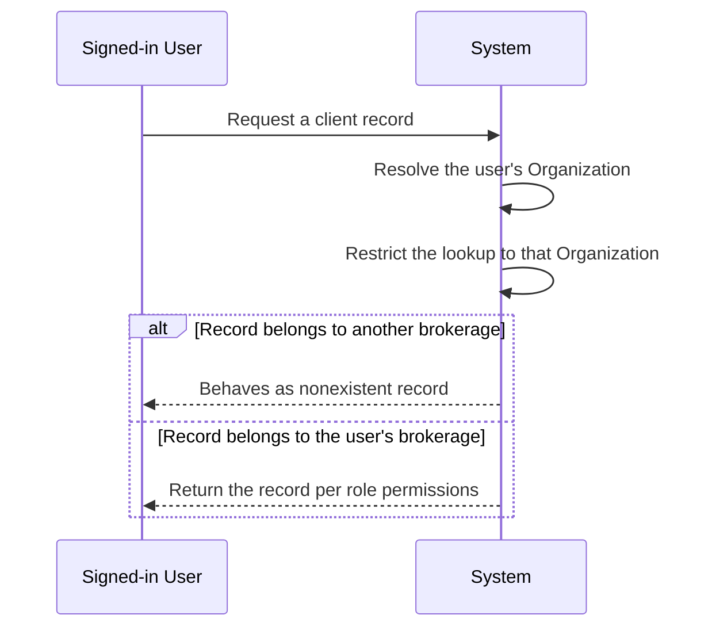
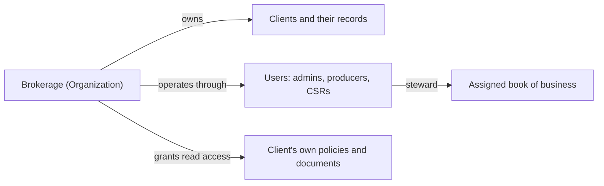
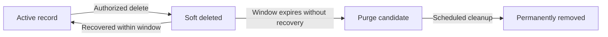
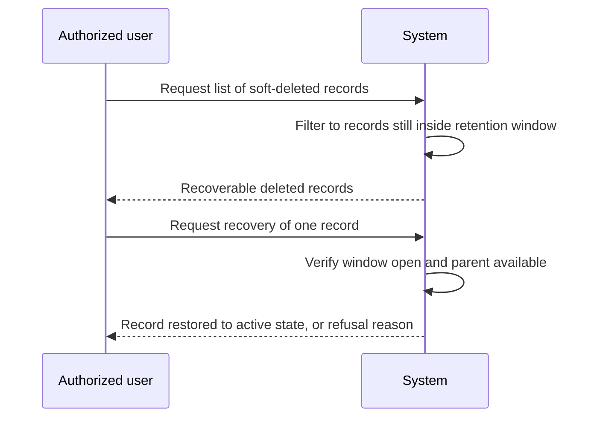
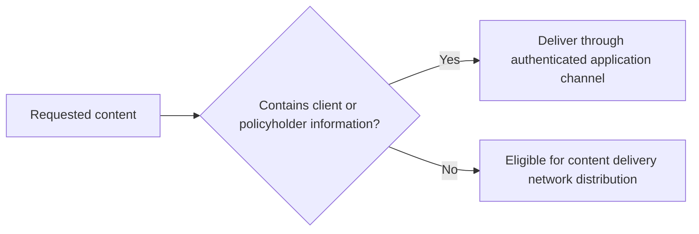

**brokerDesk — Data ownership, privacy, retention, and recovery policies**

Data ownership, privacy, retention, and recovery policies

# Data Policies

Data ownership, privacy, retention, and recovery policies from a business perspective.

## Data Ownership and Privacy

Define who owns what data, who can access it, and privacy boundaries between users.

### Tenant Data Isolation

brokerDesk is a multi-tenant service: each brokerage is onboarded as its own Organization, and every business record belongs to exactly one Organization. Data isolation means one brokerage can never see, search, modify, or infer another brokerage's data.

**Isolation policy:**

- Every business record — clients, contacts, addresses, activities, tasks, quotes, quote lines, submissions, policies, endorsements, cancellations, renewals, invoices, payments, commissions, documents, templates, producer licences, notifications, and audit log entries — is permanently attached to the Organization that created it.
- All listing, searching, filtering, reporting, and dashboard aggregation is automatically restricted to the signed-in user's Organization. No browsing path exposes another brokerage's records.
- A record belonging to another brokerage is treated as nonexistent for the requesting user: attempting to open, change, link, or download it behaves identically to requesting a record that does not exist.
- Business records cannot be linked across brokerages: a quote, task, document, or invoice in one brokerage can never reference a client or policy of another.
- Notifications, commission statements, and audit history are delivered only within the brokerage that owns the underlying records.
- Shared catalog information such as carrier profiles and products may serve many brokerages, but a brokerage acts on catalog entries only through its own appointments, quotes, policies, and commissions.

Tenant isolation is verified by automated end-to-end scenarios confirming that a user of one brokerage cannot read records of another brokerage.

### Data Ownership Model

Ownership answers "whose data is this?" at two levels: the brokerage as a whole, and the people working within it.

**Brokerage level:**

- The Organization (the brokerage) owns all business data captured for its operation: client relationships, quotes, policies, endorsements, invoices, payments, commissions, documents, templates, and interaction history. These records are brokerage property, not the personal property of individual staff members.
- The brokerage is responsible for the client information it collects and enters; the platform stores and serves that data on the brokerage's behalf.

**People level — stewardship and attribution:**

- Each client is assigned to a producer, who stewards that client's book of business — quotes, submissions, policies, and renewals. Assignment concentrates daily responsibility without transferring ownership away from the brokerage: moving a client to a different producer reassigns the book while the records remain brokerage-owned.
- Individuals are attributed for accountability: activities record the user who logged them, documents record the uploader, and endorsements record the issuing user. Attribution identifies who did what; it never makes a record privately owned.
- A user account is personal: credentials belong to the named individual and are not shared between staff members.
- Portal visibility does not transfer ownership: policies and documents shown to a client remain brokerage records to which the client holds read access for their own affairs.

### Privacy Access Boundaries

The full role permission matrix is defined canonically in 01-actors-and-auth; this section states the privacy-facing boundaries that follow from it.

- Business data is reachable only by authenticated users. Guests (unauthenticated visitors) can only register the first administrator for a new brokerage, sign in, request a password reset, or verify an email address.
- An admin sees everything inside the brokerage: all clients, quotes, policies, financial records, users, organization settings, and audit history.
- A producer works within their assigned book of business: the clients assigned to them and the quotes, policies, renewals, and tasks tied to that book. Commission figures are visible to a producer only for their own earnings.
- A CSR has service-level reach across the brokerage's clients for servicing work — client files, documents, endorsement support, and tasks — but never user administration or organization settings.
- A client portal user is walled to their own affairs: they may read their own policies and documents and submit their own service requests, and can never browse other clients of the same brokerage.
- Access follows the account, not the device: deactivating a user or changing a role removes or reshapes that person's data access for subsequent use of the system.
- Whenever a request raises the question "may this user see this record?", the answer is decided jointly by tenant isolation (see Tenant Data Isolation) and the permission matrix — never by anything embedded in a link or reference alone.

### Personal Information Privacy

Client personal information handled by the system includes legal and preferred names, email addresses and phone numbers, mailing, billing, and risk addresses, language preference (English or French), free-text notes and activity bodies, uploaded documents, and — for business clients — the names and contact details of contact persons.

- The system is PIPEDA-aware: it supports the brokerage's obligations under Canada's federal private-sector privacy legislation by keeping personal-information handling accountable and traceable.
- Access to client personal information is recorded in the append-only audit log wherever practical, alongside the create/update/delete history of critical entities (clients, quotes, policies, endorsements, invoices, commissions, users, and products).
- Audit entries record who acted and when, and cannot be edited or removed, so the brokerage retains a trustworthy trail of who touched client data.
- Passwords are kept only as irreversible hashes and are never displayed back to anyone, including admins.
- Client personal information is used to operate the brokerage's own workflows — quoting, carrier submissions, policy write-up, billing, servicing, and compliance — and is presented only to roles entitled to see it (see Privacy Access Boundaries).
- A client's language preference is respected when documents are rendered from bilingual templates, so client-facing material matches the client's chosen language (English or French).
- Retention periods, recovery windows, and permanent removal of personal data are governed by the Data Retention and Recovery policies (Module 1) and are intentionally not restated here.

## Data Retention and Recovery

Define what happens to deleted data, how long it is retained, and how users can recover it.

### Soft Deletion of Business Records

BrokerDesk removes Client, Quote, Policy, and Document records through **soft deletion**: the record is flagged as deleted and withdrawn from everyday use, but nothing is physically erased. This protects the brokerage against accidental loss and keeps the audit trail intact.

**How soft deletion behaves:**

- A soft-deleted record stops appearing immediately in lists, search results, timelines, dashboards, and reports for every user in the brokerage.
- The record keeps its content, relationships, and attachments exactly as they were at the moment of deletion, so a later recovery brings the record back unchanged.
- Each soft deletion is recorded as a new entry in the append-only audit log, together with the acting user, the affected record, and a summary of what changed.
- Deleting a Client hides only the Client itself. Its Quotes, Policies, Invoices, Activities, Tasks, Contacts, Addresses, and Documents remain stored under their own lifecycles and simply lose their path of access until the Client is recovered.
- A Document attached to a soft-deleted Quote or Policy is hidden along with its owner and follows the same recovery rules.
- Records that act as configuration rather than business history — Users, Carriers, Products, and DocumentTemplates — are deactivated instead of deleted, so past Quotes, Policies, and Commissions always keep resolving to real names.
- New work cannot lean on a soft-deleted record: attaching a quote line to a deactivated Product, or advancing a Quote that belongs to a deleted Client, is refused until the record is recovered.

Deletion of these records is performed only by users permitted under the role matrix in Actors and Authentication; this section defines what deletion means for the data, while that file defines who may perform it.

### Retention Periods for Deleted Data

Deleted data is not destroyed at once. Every soft-deleted record passes through a bounded retention period, after which it becomes eligible for permanent removal. The default retention window is **30 days**, counted from the record's deletion date, and an organization may adjust the window in its settings.

**Inside the window:**

- A soft-deleted Client, Quote, Policy, or Document stays recoverable for the whole of its retention window.
- WHILE a record sits inside its window, IT is excluded from operational views, workflows, and counts; it is recoverable but not usable until restored.
- If a record is recovered and deleted again, a fresh 30-day window starts from the newer deletion date.
- When the window lapses without recovery, the record becomes a purge candidate for the next scheduled cleanup pass described in Permanent Deletion and Erasure.
- Cleanup passes run as regular background maintenance rather than at the exact second of expiry, so no in-flight operation is interrupted midway.

**Records held outside the window mechanism:**

- AuditLog entries are append-only and are retained for the life of the organization; routine operations never edit or remove them. This sustains PIPEDA-aware accountability for access to client personal information.
- Invoice, Payment, and Commission records carry financial evidence value and follow their own lifecycles (issued, paid, voided, clawed back); their retention is not shortened by actions taken against the Policy or Client they reference.
- Deactivated configuration records (Users, Carriers, Products, DocumentTemplates) are kept indefinitely so that historical references always resolve.

No ordinary user action shortens a running retention window, and nothing inside the window prevents a later legitimate deletion from restarting it.

### Recovery of Soft-Deleted Records

Inside the retention window, an authorized user can bring a soft-deleted record back to active service. Recovery is the only path by which deleted data re-enters normal operation.

**Recovery rules:**

- Users permitted by the role matrix in Actors and Authentication may browse the brokerage's soft-deleted records and recover any record still inside its retention window.
- Recovering a record returns it to the exact state it had at deletion and restores its visibility in lists, search results, timelines, dashboards, and reports.
- Recovering a Client does not modify its Quotes, Policies, Invoices, or other holdings; it simply reopens the access paths that were closed when the Client was hidden.
- If the retention window has expired, recovery is refused, because the record has already become eligible for permanent removal.
- If the parent of the candidate record was already permanently removed, recovery of the dependent record is refused as well.
- Each recovery is written to the append-only audit log as its own event, attributable to the restoring user.
- Recovery is scoped strictly to the acting user's organization, consistent with the isolation principles owned by Data Ownership and Privacy.

### Permanent Deletion and Erasure

Permanent deletion is the point of no return. It bounds storage growth and honours erasure expectations, and it occurs only after the retention window closes.

**When permanent removal happens:**

- When a record's retention window ends without recovery, the record is permanently removed during the next scheduled cleanup sweep.
- A user permitted by the role matrix in Actors and Authentication may trigger immediate permanent removal of a single record that has already served its retention window, instead of waiting for the sweep.
- Dependents whose parent records were already purged are cleared in the same pass, so no orphaned fragments survive.

**What permanent removal means:**

- A permanently removed record cannot be brought back by any user or support action; for a Document, the stored file content behind the record is erased along with it.
- Purged items vanish from every view, search result, timeline, and report; surviving related records show a plain indication that a referenced item is no longer available, never a broken reference.
- Children with independent financial value are not destroyed by a purge: Invoices, Payments, and Commissions tied to a purged Policy continue their own lifecycles, decoupled from the deleted coverage record.

**Safeguards around the purge:**

- BEFORE a record is purged, THE system writes a final append-only audit entry identifying what was removed, when, and why; the audit entry outlives everything it describes.
- Cleanup sweeps operate strictly within one organization's scope and never touch another organization's data.
- If a record subject to financial record-keeping needs holds personal information that erasure expectations would remove, the system minimizes rather than destroys: personal identifiers are stripped or masked while the mandated business record completes its life, coordinated with the privacy practices owned by Data Ownership and Privacy.

Once a sweep completes, the only surviving trace of the removed record is the audit entry recording that the removal happened.

# Storage Capacity

Storage capacity planning and CDN requirements.

## Storage Capacity Requirements

Define storage requirements and capacity planning for file storage.

### Storage Consumption Categories

BrokerDesk holds several categories of persistent data, and their combined volume defines each brokerage's total storage demand:

| Category | What it contains | Growth pattern |
|---|---|---|
| Uploaded documents | Files attached to clients, quotes, policies, and invoices, together with their descriptive details (filename, file format, file size, storage location, checksum, version) | Grows with each upload and with every prior version kept |
| Rendered documents | Outputs produced from templates — quote proposals, policy schedules, certificates of insurance, invoices — stored as text or web content at minimum | Grows each time a template is rendered and stored |
| Business records | Clients, quotes, policies, endorsements, cancellations, renewals, invoices, payments, commissions | Grows steadily with the book of business; small compared with files |
| Audit log | Append-only records of critical changes | Grows continuously and never shrinks, since entries are neither edited nor erased |
| Notifications and tasks | Persisted operational reminders and messages | Grows with day-to-day activity |

Three behaviours drive most long-term growth: keeping prior versions when a document is replaced, the immutable nature of the audit log, and storing rendered copies of documents alongside the records they summarize.

### Capacity Limits and Usage Visibility

Because every business record belongs to exactly one brokerage, storage usage is always measured and managed per organization, never pooled across tenants.

Each organization can set a maximum size for a single uploaded document in its own organization settings. Brokerages that do not configure a limit follow the platform default established at deployment.

An upload larger than the applicable maximum is rejected in full, and no partial file content is retained.

Replacing a document with a new version preserves the previous version, so every retained historical version continues to consume storage. How long superseded versions are kept before removal follows the retention policy defined in Data Retention and Recovery.

Rendering a document from a template produces a stored copy that occupies space independently of the underlying client, quote, policy, or invoice record. When the same template is rendered again for the same record at the same version, the previously rendered copy is reused rather than duplicated.

Administrators can view their brokerage's current storage consumption, broken down by category, so that capacity shortfalls become visible before uploads start to fail.

If an upload cannot complete because available capacity is exhausted, it fails cleanly without leaving corrupted or partially written documents behind.

Documents that have been soft-deleted remain in storage and continue to count toward consumption until they are permanently removed under the retention policy defined in Data Retention and Recovery.

### Content Delivery Network Policy

Documents in BrokerDesk routinely contain personal and policyholder information. For this reason, version 1 delivers client, quote, policy, and invoice documents exclusively through authenticated channels that enforce tenant isolation and role-based access; none of this material is published to or cached by a public content delivery network.

A content delivery network may be used only for non-sensitive, non-client-specific static assets. Cached content must never include anything tied to a specific client, quote, policy, or invoice.

If content delivery network distribution is adopted in a later phase, two conditions apply: access control must continue to be enforced at the origin, and cached copies must be invalidated whenever a newer document version replaces an older one.

